# Hermes Agent - Detailed Flowcharts (Mermaid)

## 1. 核心对话循环 (Core Conversation Loop)

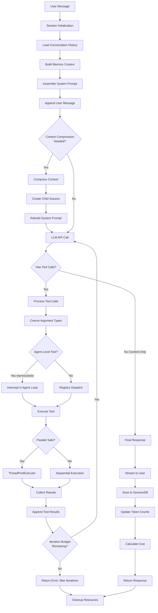

## 2. 工具调用执行流程 (Tool Call Execution)

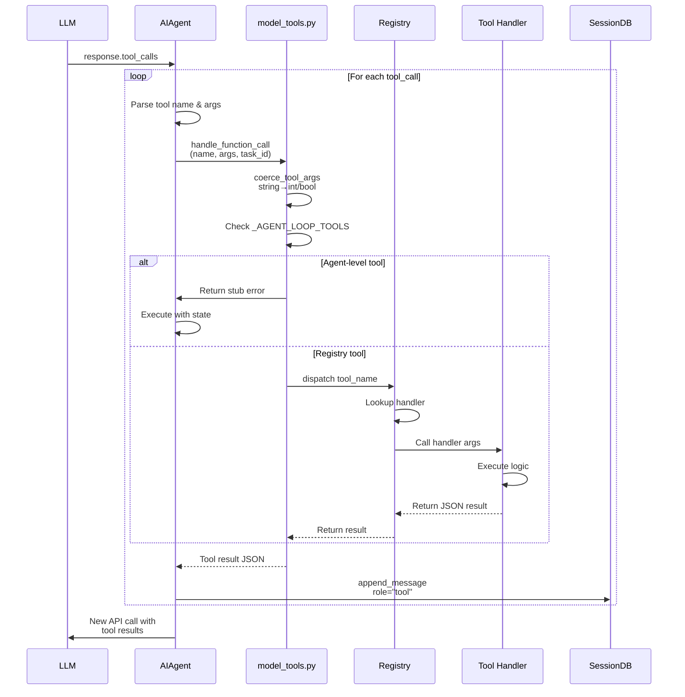

## 3. 会话生命周期 (Session Lifecycle)

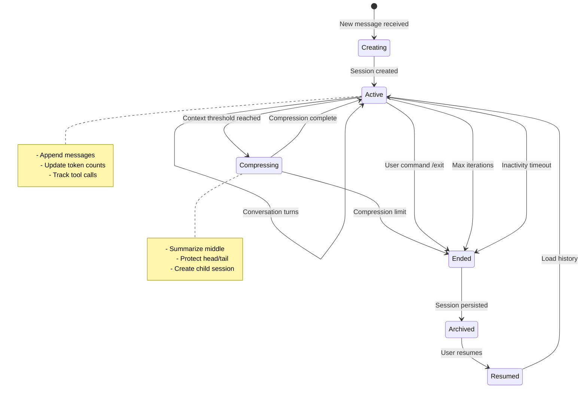

## 4. 上下文压缩流程 (Context Compression)

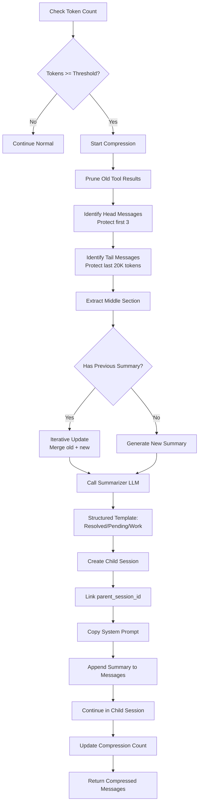

## 5. Gateway 消息路由 (Gateway Message Routing)

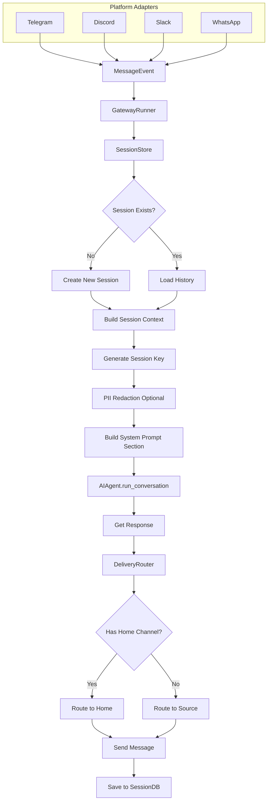

## 6. 工具注册与发现 (Tool Registry & Discovery)

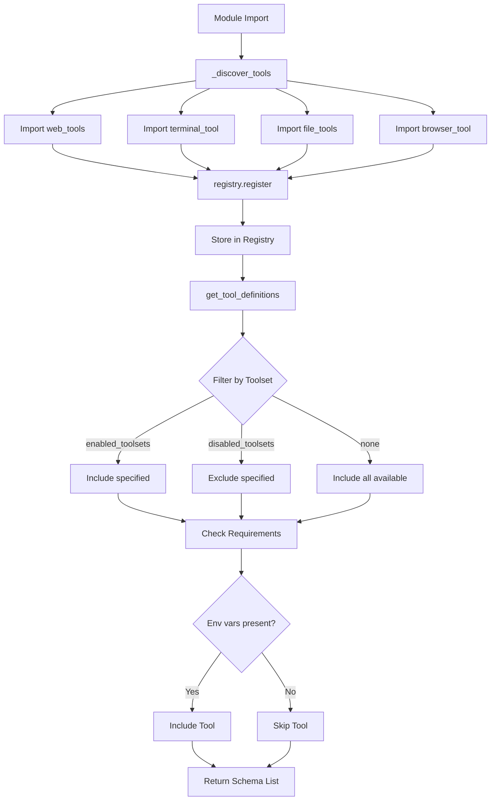

## 7. 内存管理系统 (Memory Management)

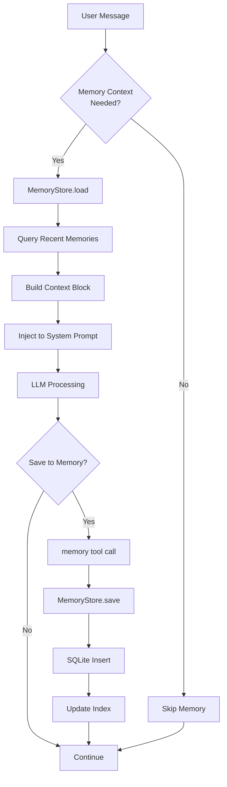

## 8. 技能系统工作流 (Skills System Workflow)

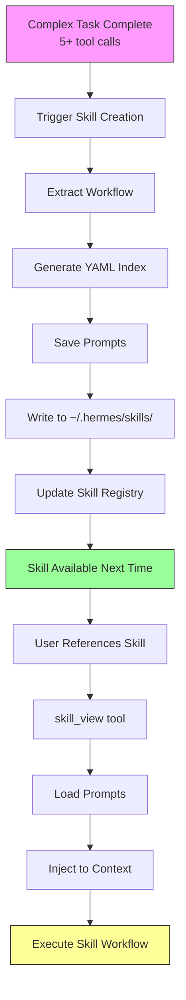

## 9. 并行工具执行 (Parallel Tool Execution)

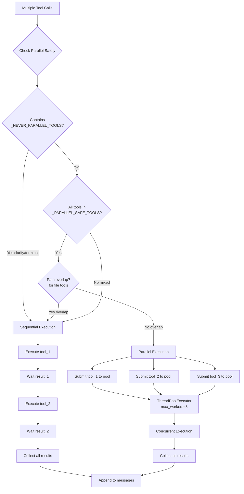

## 10. 配置加载流程 (Configuration Loading)

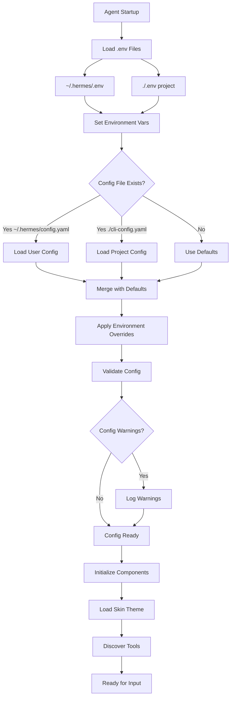

## 11. 错误处理与恢复 (Error Handling & Recovery)

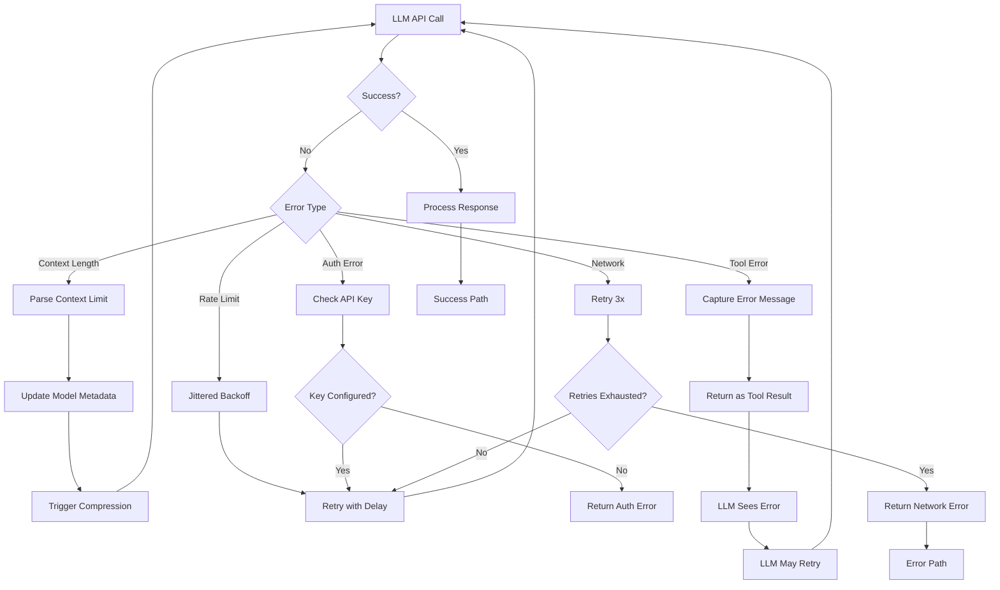

## 12. 多 Agent 委派 (Multi-Agent Delegation)

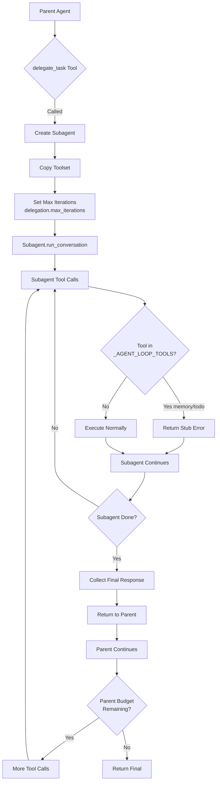

## 13. 会话搜索与召回 (Session Search & Recall)

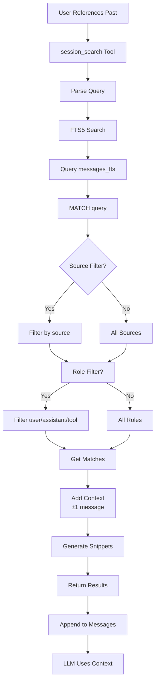

## 14. 令牌跟踪与计费 (Token Tracking & Billing)

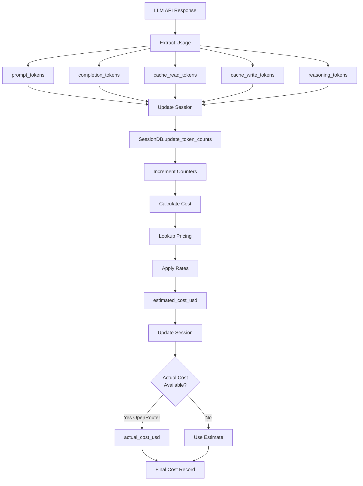

## 15. 皮肤/主题引擎 (Skin/Theme Engine)

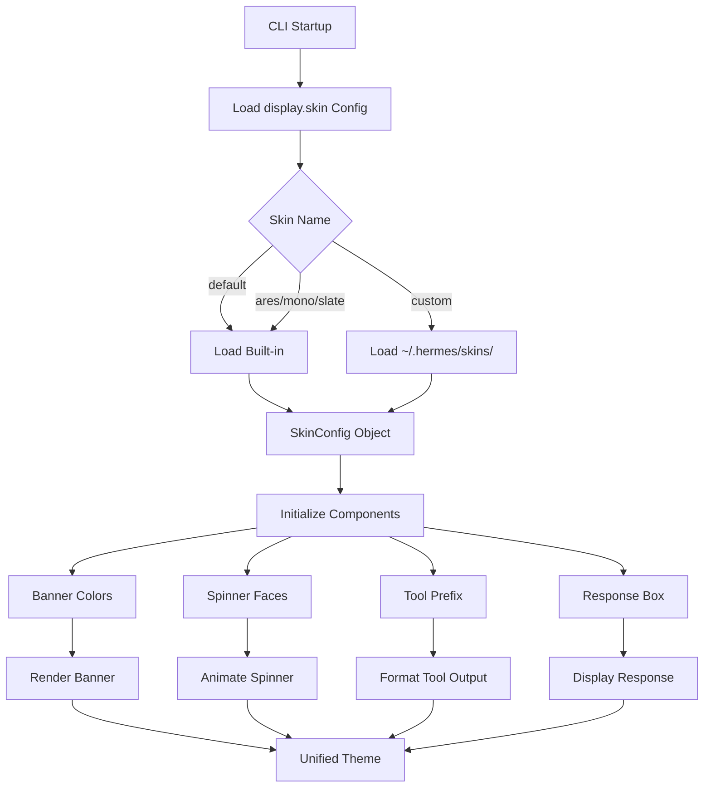

---

## 图例说明 (Legend)

### 流程图符号
- **矩形**: 处理步骤
- **菱形**: 决策点
- **圆角矩形**: 开始/结束
- **平行四边形**: 输入/输出

### 状态图符号
- **实心圆**: 初始状态
- **双环圆**: 结束状态
- **圆角矩形**: 状态
- **箭头**: 状态转换

### 序列图符号
- **垂直线**: 生命线
- **实线箭头**: 调用
- **虚线箭头**: 返回
- **激活框**: 执行中
