# Hermes-Agent AI Agent 架构详解

> 整理日期：2026-04-23 | 版本：1.0

***

## 目录

1. [AI Agent 架构总览](#1-ai-agent-架构总览)
2. [核心组件架构](#2-核心组件架构)
3. [对话循环架构](#3-对话循环架构)
4. [工具调用系统](#4-工具调用系统)
5. [会话管理机制](#5-会话管理机制)
6. [上下文管理系统](#6-上下文管理系统)
7. [回调和事件系统](#7-回调和事件系统)
8. [错误处理机制](#8-错误处理机制)
9. [完整业务流程](#9-完整业务流程)
10. [多平台集成架构](#10-多平台集成架构)

***

## 1. AI Agent 架构总览

### 1.1 整体架构图

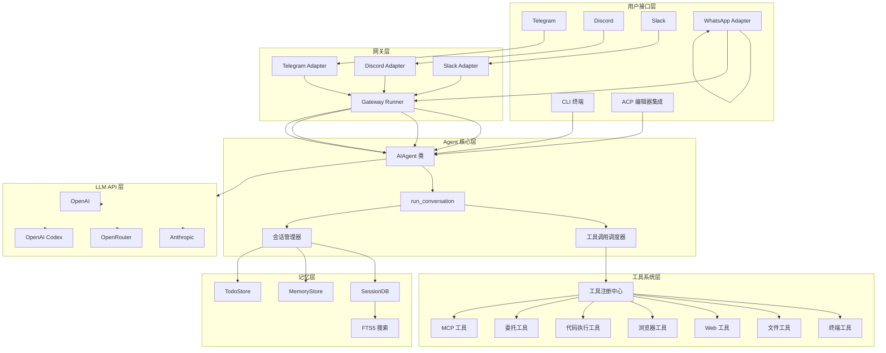

### 1.2 核心文件清单

| 文件 | 行数 | 核心类/函数 | 职责 |
|------|------|------------|------|
| `run_agent.py` | ~10,500 | `AIAgent`, `run_conversation`, `chat` | Agent 核心对话循环 |
| `model_tools.py` | ~500 | `get_tool_definitions`, `handle_function_call` | 工具编排和调度 |
| `tools/registry.py` | ~200 | `ToolRegistry`, `registry.register` | 工具注册中心 |
| `hermes_state.py` | ~800 | `SessionDB` | 会话持久化存储 |
| `cli.py` | ~800 | `HermesCLI`, `main` | CLI 交互界面 |
| `gateway/run.py` | ~600 | `GatewayRunner` | 网关运行时管理 |
| `agent/prompt_builder.py` | ~300 | `build_system_message` | 系统提示词构建 |
| `agent/context_compressor.py` | ~200 | `ContextCompressor` | 上下文压缩 |

### 1.3 架构设计原则

| 原则 | 说明 | 实现方式 |
|------|------|----------|
| **单一职责** | 每个组件只负责一个功能 | AIAgent 负责对话，Registry 负责工具注册 |
| **开闭原则** | 对扩展开放，对修改关闭 | 工具通过 registry.register 扩展，无需修改核心代码 |
| **依赖倒置** | 依赖抽象而非具体实现 | 工具通过 handler 回调，不直接依赖实现 |
| **接口隔离** | 使用多个专用接口 | 9 种回调函数，每种负责一个通知场景 |
| **分层架构** | 清晰的分层边界 | 用户接口层 → 网关层 → Agent 层 → 工具层 → 存储层 |

***

## 2. 核心组件架构

### 2.1 AIAgent 类结构

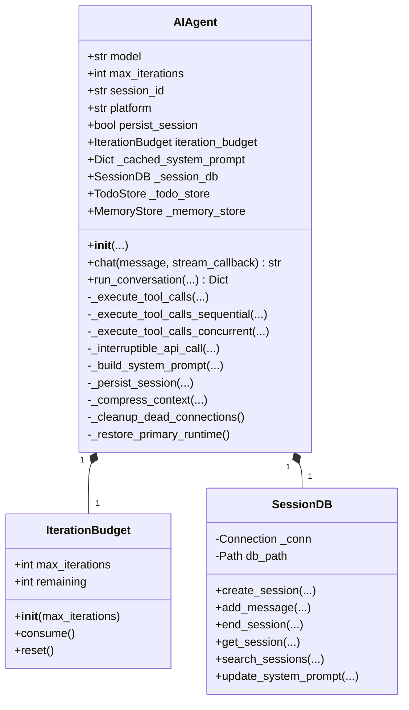

### 2.2 核心属性详解

```python
class AIAgent:
    """AI Agent with tool calling capabilities"""
    
    def __init__(
        self,
        # 模型配置
        model: str = "anthropic/claude-opus-4.6",
        max_iterations: int = 90,
        
        # API 配置
        base_url: str = None,
        api_key: str = None,
        provider: str = None,
        api_mode: str = None,  # "chat_completions", "codex_responses", "anthropic_messages"
        
        # 工具集配置
        enabled_toolsets: List[str] = None,
        disabled_toolsets: List[str] = None,
        
        # 会话管理
        session_id: str = None,
        platform: str = None,  # "cli", "telegram", "discord", etc.
        persist_session: bool = True,
        
        # 回调函数
        tool_progress_callback: callable = None,
        thinking_callback: callable = None,
        reasoning_callback: callable = None,
        clarify_callback: callable = None,
        stream_callback: callable = None,
        
        # 运行模式
        quiet_mode: bool = False,
        save_trajectories: bool = False,
        checkpoints_enabled: bool = False,
    ):
        # 核心配置
        self.model = model
        self.max_iterations = max_iterations
        self.iteration_budget = IterationBudget(max_iterations)
        
        # API 配置
        self.base_url = base_url or ""
        self.provider = provider or ""
        self.api_mode = api_mode or "chat_completions"
        
        # 工具配置
        self.enabled_toolsets = enabled_toolsets or []
        self.disabled_toolsets = disabled_toolsets or []
        
        # 会话管理
        self.session_id = session_id or str(uuid.uuid4())
        self.platform = platform or "cli"
        self.persist_session = persist_session
        self._session_db = SessionDB() if persist_session else None
        
        # 回调函数
        self.tool_progress_callback = tool_progress_callback
        self.thinking_callback = thinking_callback
        self.reasoning_callback = reasoning_callback
        self.clarify_callback = clarify_callback
        self.stream_callback = stream_callback
        
        # 系统提示词缓存
        self._cached_system_prompt = None
        
        # 工具商店
        self._todo_store = TodoStore()
        self._memory_store = MemoryStore()
```

### 2.3 组件依赖关系

```mermaid
flowchart TB
    subgraph Core[核心组件]
        AIAgent[AIAgent]
        RC[run_conversation]
    end
    
    subgraph Tools[工具系统]
        MT[model_tools.py]
        Registry[tools/registry.py]
        Tools[tools/*.py]
    end
    
    subgraph State[状态管理]
        SessionDB[hermes_state.py]
        Memory[memory/]
        Todo[todo.py]
    end
    
    subgraph Agent[Agent 辅助]
        Prompt[prompt_builder.py]
        Context[context_compressor.py]
        Display[display.py]
    end
    
    subgraph LLM[LLM API]
        Client[OpenAI Client]
        API[API Endpoints]
    end
    
    Core --> Tools
    Core --> State
    Core --> Agent
    Core --> LLM
    
    Tools --> Registry
    Registry --> Tools
    
    State --> SessionDB
    State --> Memory
    State --> Todo
    
    Agent --> Prompt
    Agent --> Context
    Agent --> Display
```

***

## 3. 对话循环架构

### 3.1 对话循环完整流程

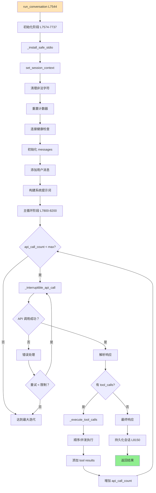

### 3.2 详细步骤代码

#### 步骤 1：初始化（L7574-7737）

```python
def run_conversation(self, user_message: str, ...):
    # 1. 保护 stdio
    _install_safe_stdio()
    
    # 2. 设置会话上下文
    set_session_context(self.session_id)
    
    # 3. 恢复主运行时
    self._restore_primary_runtime()
    
    # 4. 清理非法字符
    user_message = _sanitize_surrogates(user_message)
    
    # 5. 生成 task_id
    effective_task_id = task_id or str(uuid.uuid4())
    
    # 6. 重置计数器
    self._invalid_tool_retries = 0
    self._invalid_json_retries = 0
    # ... 更多计数器
    
    # 7. 连接健康检查
    if self.api_mode != "anthropic_messages":
        self._cleanup_dead_connections()
    
    # 8. 初始化消息列表
    messages = list(conversation_history or [])
    
    # 9. 添加用户消息
    messages.append({"role": "user", "content": user_message})
    
    # 10. 构建系统提示词
    if self._cached_system_prompt is None:
        self._cached_system_prompt = self._build_system_prompt()
    active_system_prompt = self._cached_system_prompt
```

#### 步骤 2：主循环（L7800-8200）

```python
api_call_count = 0

while api_call_count < self.max_iterations and self.iteration_budget.remaining > 0:
    # 1. 调用 LLM API
    try:
        response = self._interruptible_api_call(
            messages=messages,
            system_prompt=active_system_prompt,
            stream=stream_callback is not None,
        )
        api_call_count += 1
        
    except Exception as e:
        # 2. 错误处理
        if self._should_retry(e):
            continue
        else:
            break
    
    # 3. 解析响应
    assistant_message = response.choices[0].message
    
    # 4. 检查工具调用
    if assistant_message.tool_calls:
        # 5. 执行工具
        self._execute_tool_calls(
            assistant_message=assistant_message,
            messages=messages,
            effective_task_id=effective_task_id,
        )
    else:
        # 6. 最终响应
        final_response = assistant_message.content
        break

# 7. 保存会话
if self.persist_session:
    self._persist_session(messages, final_response)

# 8. 返回结果
return {
    "final_response": final_response,
    "messages": messages,
    "session_id": self.session_id,
}
```

### 3.3 API 调用流程

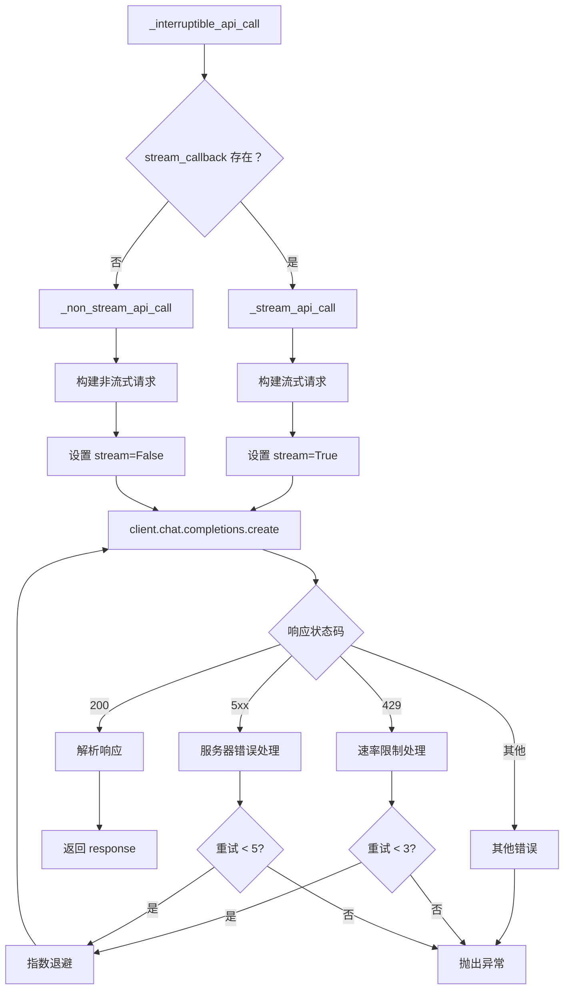

***

## 4. 工具调用系统

### 4.1 工具调用架构

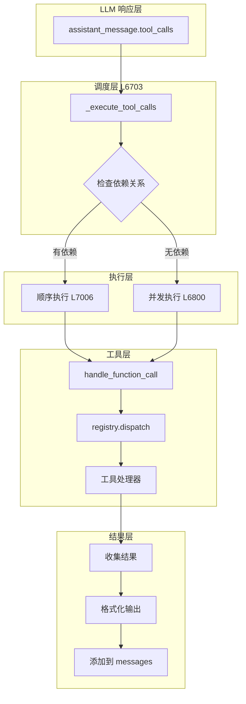

### 4.2 工具注册机制

```python
# tools/registry.py
class ToolRegistry:
    """单例工具注册中心"""
    
    def __init__(self):
        self._tools: Dict[str, ToolEntry] = {}
    
    def register(
        self,
        name: str,
        toolset: str,
        schema: dict,
        handler: Callable,
        check_fn: Callable = None,
        requires_env: list = None,
    ):
        """注册一个工具"""
        self._tools[name] = ToolEntry(
            name=name,
            toolset=toolset,
            schema=schema,
            handler=handler,
            check_fn=check_fn,
            requires_env=requires_env or [],
        )

# 全局单例
registry = ToolRegistry()

# 工具示例：terminal_tool.py
registry.register(
    name="terminal",
    toolset="terminal",
    schema={
        "name": "terminal",
        "description": "Execute a shell command",
        "parameters": {...},
    },
    handler=lambda args, **kw: terminal_tool(
        command=args.get("command"),
        background=args.get("background"),
        task_id=kw.get("task_id"),
    ),
    check_fn=lambda: True,
    requires_env=[],
)
```

### 4.3 工具发现流程

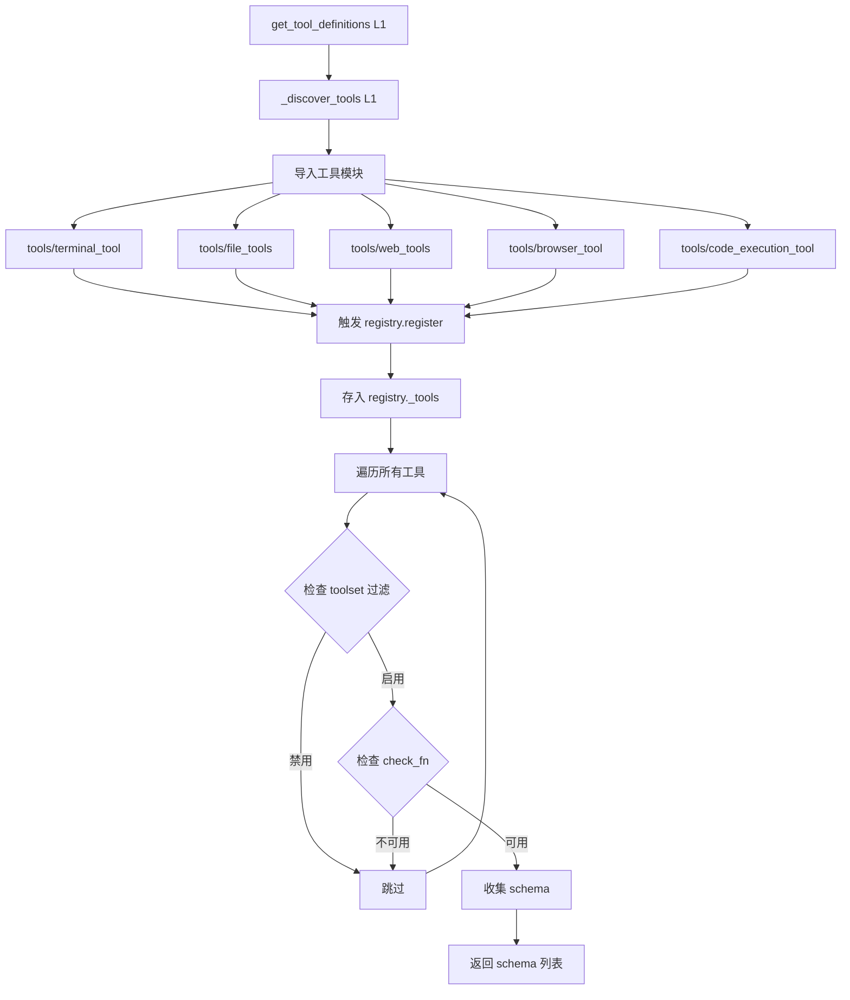

### 4.4 工具执行模式

#### 顺序执行（L7006-7100）

```python
def _execute_tool_calls_sequential(self, ...):
    """顺序执行工具调用（有依赖关系时）"""
    
    for tool_call in tool_calls:
        # 1. 提取工具信息
        tool_name = tool_call.function.name
        tool_args = json.loads(tool_call.function.arguments)
        
        # 2. 调用进度回调
        if self.tool_progress_callback:
            self.tool_progress_callback(tool_name, tool_args)
        
        # 3. 执行工具
        result = handle_function_call(
            tool_name=tool_name,
            tool_args=tool_args,
            task_id=effective_task_id,
        )
        
        # 4. 添加结果到消息
        messages.append({
            "role": "tool",
            "content": result,
            "tool_call_id": tool_call.id,
        })
        
        # 5. 工具间延迟
        if self.tool_delay > 0:
            time.sleep(self.tool_delay)
```

#### 并发执行（L6800-7000）

```python
def _execute_tool_calls_concurrent(self, ...):
    """并发执行工具调用（独立工具）"""
    
    from concurrent.futures import ThreadPoolExecutor
    
    # 1. 创建执行任务列表
    tasks = [...]
    
    # 2. 并发执行
    results = {}
    with ThreadPoolExecutor(max_workers=10) as executor:
        future_to_task = {
            executor.submit(
                handle_function_call,
                tool_name=task["tool_name"],
                tool_args=task["tool_args"],
                task_id=effective_task_id,
            ): task for task in tasks
        }
        
        for future in as_completed(future_to_task):
            task = future_to_task[future]
            try:
                result = future.result()
                results[task["tool_call_id"]] = result
            except Exception as e:
                results[task["tool_call_id"]] = {"error": str(e)}
    
    # 3. 按原始顺序添加结果
    for tool_call in tool_calls:
        result = results.get(tool_call.id)
        messages.append({
            "role": "tool",
            "content": result,
            "tool_call_id": tool_call.id,
        })
```

***

## 5. 会话管理机制

### 5.1 会话生命周期

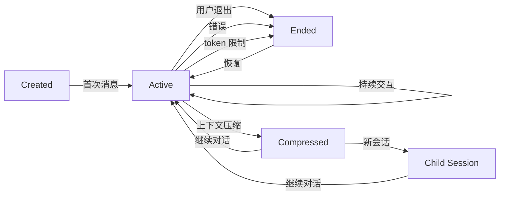

### 5.2 会话数据库设计

```sql
-- 会话表
CREATE TABLE sessions (
    id TEXT PRIMARY KEY,                    -- UUID
    source TEXT NOT NULL,                   -- 'cli', 'telegram', 'discord', etc.
    user_id TEXT,                           -- 用户 ID
    model TEXT,                             -- 使用的模型
    system_prompt TEXT,                     -- 系统提示词
    parent_session_id TEXT,                 -- 父会话 ID
    started_at REAL NOT NULL,               -- 开始时间戳
    ended_at REAL,                          -- 结束时间戳
    end_reason TEXT,                        -- 结束原因
    message_count INTEGER DEFAULT 0,
    tool_call_count INTEGER DEFAULT 0,
    input_tokens INTEGER DEFAULT 0,
    output_tokens INTEGER DEFAULT 0,
    estimated_cost_usd REAL,
);

-- 消息表
CREATE TABLE messages (
    id INTEGER PRIMARY KEY AUTOINCREMENT,
    session_id TEXT NOT NULL REFERENCES sessions(id),
    role TEXT NOT NULL,                     -- 'user', 'assistant', 'tool', 'system'
    content TEXT,
    tool_call_id TEXT,
    tool_calls TEXT,                        -- JSON
    tool_name TEXT,
    timestamp REAL NOT NULL,
    token_count INTEGER,
    reasoning TEXT,
);

-- FTS5 全文搜索
CREATE VIRTUAL TABLE messages_fts USING fts5(content, content=messages);
```

### 5.3 会话持久化流程

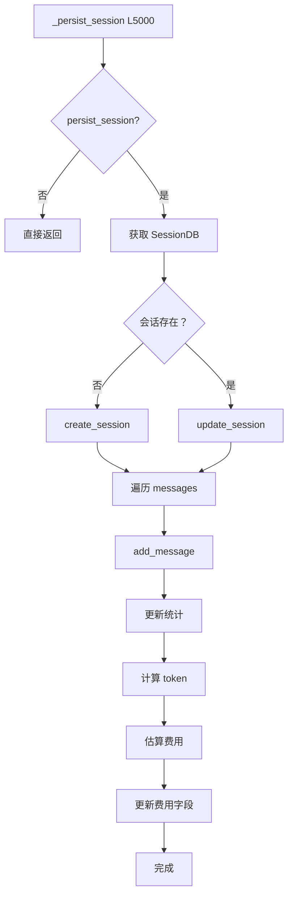

### 5.4 会话恢复机制

```python
# CLI 会话恢复
def parse_cli_args():
    # --resume 参数：按 ID 恢复
    if args.resume:
        session_id = args.resume
        if not session_exists(session_id):
            print(f"Error: Session {session_id} not found")
            sys.exit(1)
    
    # --continue 参数：按名称或最近会话恢复
    elif args.continue_last:
        if isinstance(args.continue_last, str):
            session_id = find_session_by_name(args.continue_last)
        else:
            session_id = find_most_recent_session()
    
    # 新会话：生成 UUID
    else:
        session_id = str(uuid.uuid4())
    
    return session_id

# 加载历史消息
def load_session_history(session_id: str):
    db = SessionDB()
    messages = db.get_session_messages(session_id)
    return messages
```

***

## 6. 上下文管理系统

### 6.1 上下文压缩架构

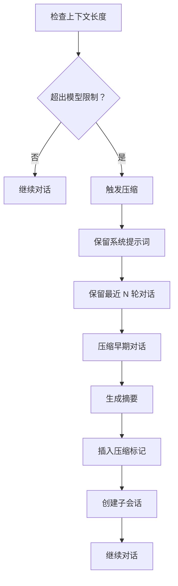

### 6.2 系统提示词构建

```python
def build_system_message(
    model: str,
    enabled_toolsets: list,
    platform: str,
) -> str:
    """组装完整的系统提示词"""
    parts = []
    
    # 1. Agent 身份设定
    parts.append(DEFAULT_AGENT_IDENTITY)
    
    # 2. 工具使用说明
    parts.append(build_tools_guidance(enabled_toolsets))
    
    # 3. 记忆系统指导
    parts.append(MEMORY_GUIDANCE)
    
    # 4. 技能列表
    parts.append(build_skills_system_prompt())
    
    # 5. 平台特定提示
    if platform in PLATFORM_HINTS:
        parts.append(PLATFORM_HINTS[platform])
    
    return "\n\n".join(parts)
```

### 6.3 缓存机制

```python
# 系统提示词缓存
if self._cached_system_prompt is None:
    # 1. 尝试从 SessionDB 加载
    stored_prompt = self._session_db.get_session(self.session_id)
    
    if stored_prompt:
        # 继续会话：复用之前的提示词（保持缓存前缀匹配）
        self._cached_system_prompt = stored_prompt
    else:
        # 新会话：从头构建
        self._cached_system_prompt = self._build_system_prompt()
        
        # 存储到 SQLite
        self._session_db.update_system_prompt(
            self.session_id,
            self._cached_system_prompt
        )

active_system_prompt = self._cached_system_prompt
```

***

## 7. 回调和事件系统

### 7.1 回调函数总览

| 回调函数 | 触发时机 | 参数 | 用途 |
|----------|----------|------|------|
| `tool_progress_callback` | 工具开始执行 | `(tool_name, args_preview)` | 显示工具进度 |
| `tool_start_callback` | 工具启动 | `(tool_name, args)` | 启动通知 |
| `tool_complete_callback` | 工具完成 | `(tool_name, result)` | 完成通知 |
| `thinking_callback` | 模型思考 | `(content)` | 显示思考过程 |
| `reasoning_callback` | 推理内容 | `(reasoning_text)` | 显示推理链 |
| `clarify_callback` | 需要澄清 | `(question, choices)` | 交互式提问 |
| `step_callback` | 步骤完成 | `(step_name, details)` | 步骤进度 |
| `stream_delta_callback` | 流式增量 | `(delta_text)` | TTS 生成 |
| `status_callback` | 状态变更 | `(status_message)` | 状态更新 |

### 7.2 回调调用示例

```python
# 工具进度回调
if self.tool_progress_callback:
    args_preview = json.dumps(args)[:100] + "..." if len(json.dumps(args)) > 100 else json.dumps(args)
    self.tool_progress_callback(tool_name, args_preview)

# 思考回调
if response.choices[0].message.reasoning and self.thinking_callback:
    self.thinking_callback(response.choices[0].message.reasoning)

# 流式回调（TTS）
if self._stream_callback and delta:
    self._stream_callback(delta)

# 状态回调
if self.status_callback:
    self.status_callback(f"🔧 Executing tool: {tool_name}")
```

***

## 8. 错误处理机制

### 8.1 错误分类和处理策略

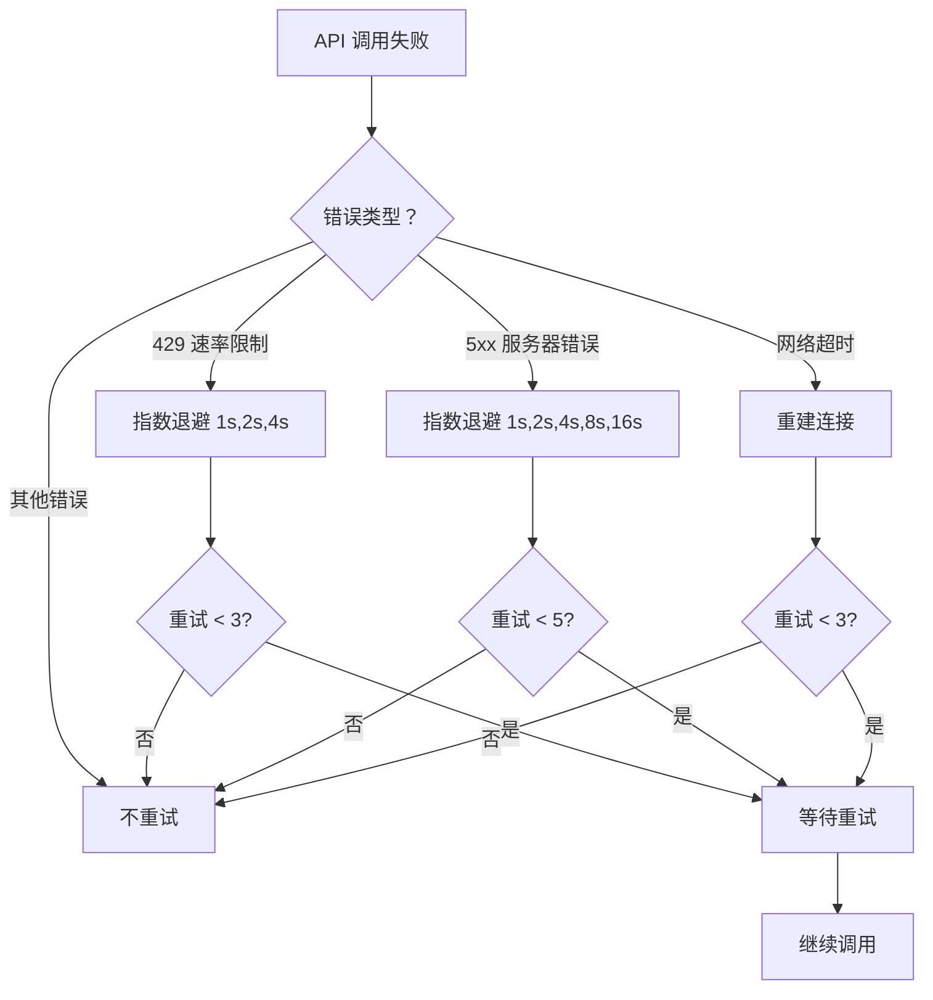

### 8.2 重试机制实现

```python
def _should_retry(self, error: Exception, api_call_count: int) -> bool:
    """判断是否应该重试"""
    
    # 检查是否达到最大迭代次数
    if api_call_count >= self.max_iterations:
        return False
    
    # 速率限制：指数退避
    if isinstance(error, RateLimitError):
        retry_delay = 2 ** self._rate_limit_retries
        self._rate_limit_retries += 1
        time.sleep(retry_delay)
        return self._rate_limit_retries < 3
    
    # 服务器错误：指数退避
    elif isinstance(error, APIServerError):
        retry_delay = 2 ** self._server_error_retries
        self._server_error_retries += 1
        time.sleep(retry_delay)
        return self._server_error_retries < 5
    
    # 网络超时：重建连接
    elif isinstance(error, NetworkTimeoutError):
        self._rebuild_connection()
        self._network_retries += 1
        return self._network_retries < 3
    
    # 其他错误：不重试
    return False
```

### 8.3 降级策略

```python
def _fallback_to_backup(self):
    """降级到备用模型"""
    
    if not self._fallback_model:
        return False
    
    # 保存当前配置
    self._primary_model = self.model
    self._primary_base_url = self.base_url
    
    # 切换到备用模型
    self.model = self._fallback_model["model"]
    self.base_url = self._fallback_model["base_url"]
    self.api_key = self._fallback_model["api_key"]
    
    # 标记已降级
    self._fallback_activated = True
    
    logger.info("Fallback activated: %s → %s", self._primary_model, self.model)
    return True

def _restore_primary_runtime(self):
    """恢复主运行时配置"""
    if self._fallback_activated:
        self.model = self._primary_model
        self.base_url = self._primary_base_url
        self._fallback_activated = False
        logger.info("Primary runtime restored")
```

***

## 9. 完整业务流程

### 9.1 CLI 对话完整时序

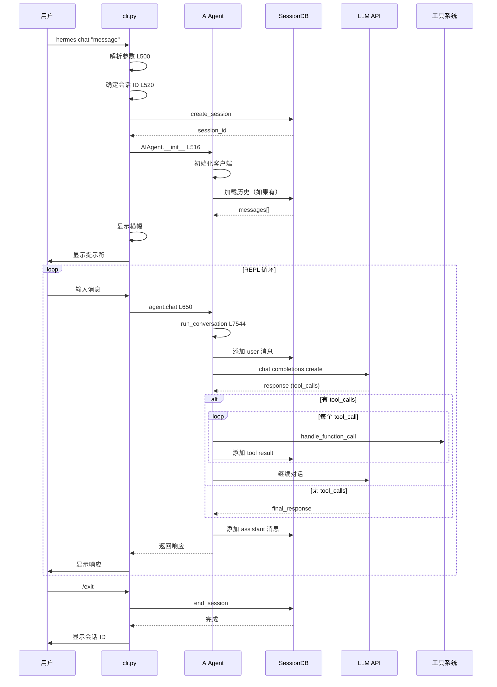

### 9.2 网关对话时序

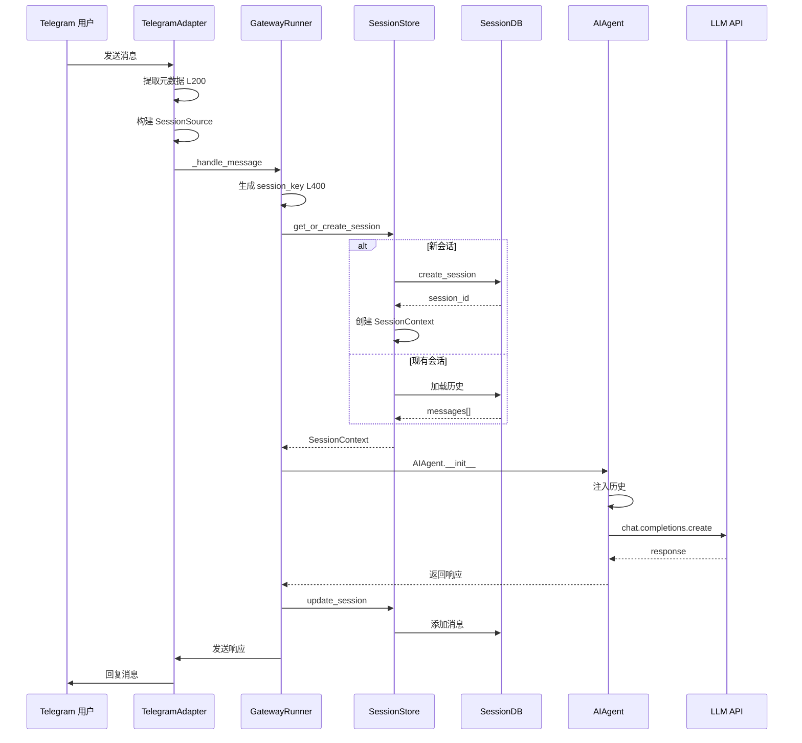

### 9.3 工具调用详细流程

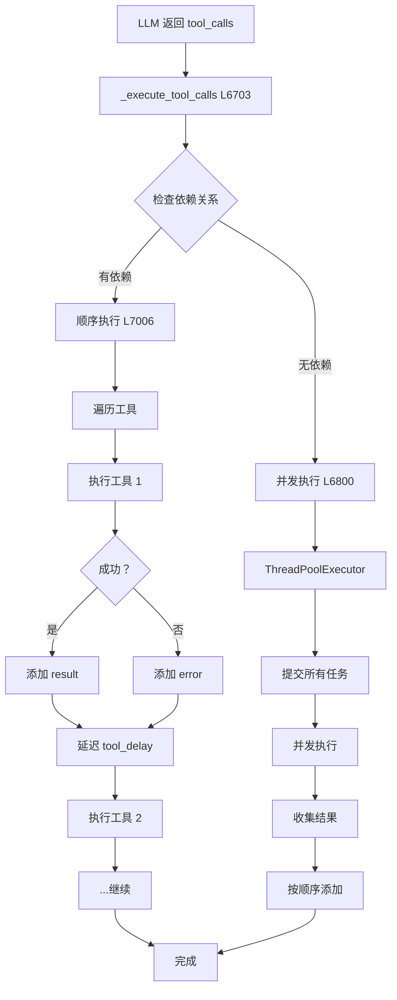

***

## 10. 多平台集成架构

### 10.1 平台适配器架构

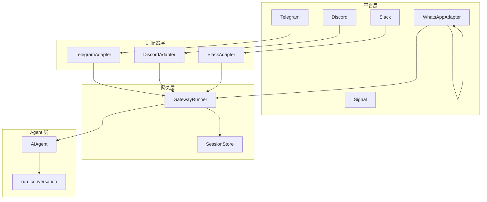

### 10.2 平台会话隔离

| 平台 | 会话键格式 | 示例 |
|------|------------|------|
| **CLI** | `cli:{UUID}` | `cli:550e8400-e29b-41d4-a716-446655440000` |
| **Telegram DM** | `telegram:{user_id}` | `telegram:123456789` |
| **Telegram 群组** | `telegram:{chat_id}` | `telegram:-1001234567890` |
| **Discord DM** | `discord:{user_id}` | `discord:123456789012345678` |
| **Discord 线程** | `discord:{channel_id}:{thread_id}` | `discord:123:456` |
| **Slack 频道** | `slack:{channel_id}` | `slack:C0123456789` |
| **WhatsApp** | `whatsapp:{phone_id}` | `whatsapp:1234567890@c.us` |

### 10.3 PII 脱敏机制

```python
_PII_SAFE_PLATFORMS = frozenset({
    Platform.WHATSAPP,
    Platform.SIGNAL,
    Platform.TELEGRAM,
})

def _hash_id(value: str) -> str:
    """确定性 12 字符十六进制哈希"""
    return hashlib.sha256(value.encode("utf-8")).hexdigest()[:12]

def build_session_context_prompt(context: SessionContext, redact_pii: bool = False):
    """构建会话上下文提示词，可选脱敏 PII"""
    if redact_pii and context.source.platform in _PII_SAFE_PLATFORMS:
        user_id = _hash_sender_id(context.source.user_id)
        chat_id = _hash_chat_id(context.source.chat_id)
    else:
        user_id = context.source.user_id
        chat_id = context.source.chat_id
    
    # 构建提示词...
```

***

## 11. 总结

### 11.1 核心架构特性

| 特性 | 说明 | 实现方式 |
|------|------|----------|
| **对话循环** | 多轮工具调用直到完成 | `while` 循环 + 迭代计数 |
| **工具调度** | 顺序/并发自动切换 | 依赖检测 + 执行模式选择 |
| **会话持久化** | SQLite 存储完整历史 | SessionDB + 事务处理 |
| **错误处理** | 分层重试 + 降级策略 | 错误分类 + 指数退避 |
| **回调系统** | 9 种回调函数 | 事件驱动通知 |
| **流式输出** | 支持 TTS 实时生成 | `_stream_callback` |
| **上下文管理** | 自动压缩 + 缓存优化 | 系统提示词缓存 |
| **平台隔离** | 多平台会话独立 | 会话键唯一标识 |

### 11.2 设计模式应用

| 模式 | 应用场景 | 优势 |
|------|----------|------|
| **命令模式** | 工具调用封装 | 解耦调用者和接收者 |
| **策略模式** | 顺序/并发执行选择 | 灵活切换执行策略 |
| **观察者模式** | 回调函数系统 | 事件通知解耦 |
| **单例模式** | SessionDB/Registry | 全局唯一实例 |
| **工厂模式** | API 客户端创建 | 统一创建逻辑 |
| **模板方法模式** | API 调用流程 | 固定步骤，可变实现 |

### 11.3 代码统计

| 模块 | 行数 | 复杂度 |
|------|------|--------|
| `run_agent.py` | ~10,500 | 高 |
| `model_tools.py` | ~500 | 中 |
| `tools/registry.py` | ~200 | 低 |
| `hermes_state.py` | ~800 | 中 |
| `cli.py` | ~800 | 中 |
| `gateway/run.py` | ~600 | 中 |
| **总计** | **~13,400** | **高** |

***

**文档版本：** 1.0  
**整理日期：** 2026-04-23  
**适用版本：** Hermes-Agent v2.0+
