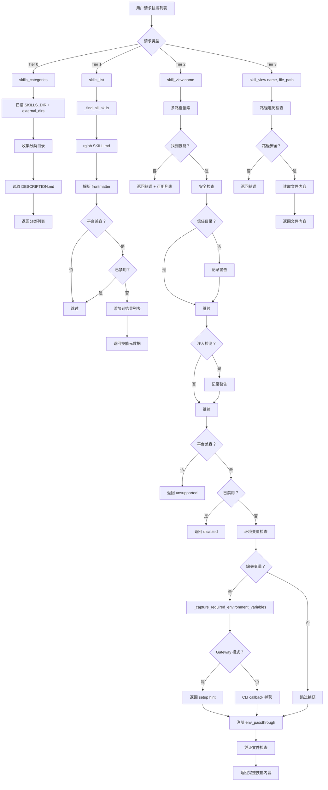
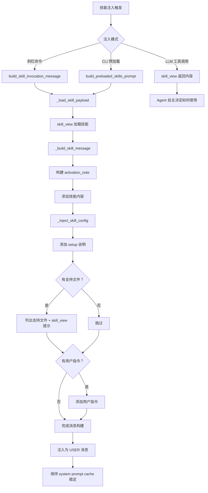
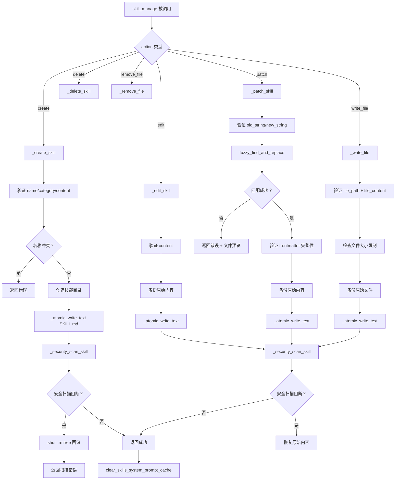
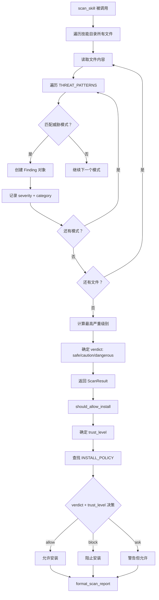
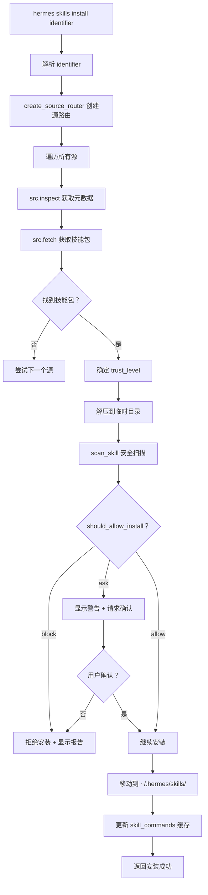

# Agent Skill 系统架构分析

## 1. 概述

Hermes Agent 实现了一套**渐进式披露、安全扫描、多来源协同**的 Skill 系统。系统覆盖技能发现、加载、注入、管理、安全扫描和市场分发等全生命周期，通过 4 个核心工具（skills_list/skill_view/skill_manage/skills_categories）、3 种注入模式（斜杠命令/预加载/工具调用）和多层安全防护（Guard 扫描 + 注入检测 + 路径安全），实现了灵活且安全的技能管理。

### 1.1 核心设计目标

| 目标 | 实现策略 |
|-----|---------|
| **渐进式披露** | 3 层递进：categories → list（元数据）→ view（完整内容） |
| **安全扫描** | 50+ 种威胁模式检测 + 信任级别策略 |
| **多来源协同** | 本地 skills/ + external_dirs + Hub 市场 |
| **多模式注入** | 斜杠命令、CLI 预加载、LLM 工具调用 |
| **平台感知** | OS 平台过滤 + 按平台禁用配置 |
| **环境变量管理** | 自动检测缺失 → CLI 交互捕获 → Gateway 提示 |

### 1.2 系统组件

```
┌─────────────────────────────────────────────────────────┐
│              Agent Skill 系统组件                        │
├─────────────────────────────────────────────────────────┤
│                                                         │
│  ┌─────────────────────────────────────────────────┐    │
│  │ 技能发现层                                       │    │
│  │ • skills_tool.py (skills_list/skill_view)       │    │
│  │ • skill_utils.py (frontmatter/platform/disabled)│    │
│  │ • skill_commands.py (scan_skill_commands)       │    │
│  └─────────────────────────────────────────────────┘    │
│                                                         │
│  ┌─────────────────────────────────────────────────┐    │
│  │ 技能管理层                                       │    │
│  │ • skill_manager_tool.py (create/edit/patch/     │    │
│  │   delete/write_file/remove_file)                │    │
│  │ • skills_config.py (enable/disable per platform)│    │
│  └─────────────────────────────────────────────────┘    │
│                                                         │
│  ┌─────────────────────────────────────────────────┐    │
│  │ 技能注入层                                       │    │
│  │ • skill_commands.py (build_skill_invocation_msg)│    │
│  │ • prompt_builder.py (build_skills_system_prompt)│    │
│  └─────────────────────────────────────────────────┘    │
│                                                         │
│  ┌─────────────────────────────────────────────────┐    │
│  │ 安全防护层                                       │    │
│  │ • skills_guard.py (50+ 威胁模式扫描)            │    │
│  │ • skills_tool.py (注入检测 + 路径安全)          │    │
│  │ • path_security.py (路径遍历防护)               │    │
│  └─────────────────────────────────────────────────┘    │
│                                                         │
│  ┌─────────────────────────────────────────────────┐    │
│  │ 市场分发层                                       │    │
│  │ • skills_hub.py (搜索/浏览/安装/卸载)           │    │
│  │ • hermes_cli/skills_hub.py (CLI/斜杠命令)       │    │
│  └─────────────────────────────────────────────────┘    │
│                                                         │
└─────────────────────────────────────────────────────────┘
```

---

## 2. 架构设计

### 2.1 分层架构

```
┌─────────────────────────────────────────────────────────┐
│              第 1 层：存储层                              │
│  ┌─────────────────────────────────────────────────┐    │
│  │ ~/.hermes/skills/                               │    │
│  │ ├── my-skill/                                   │    │
│  │ │   ├── SKILL.md          # 主指令文件（必需）   │    │
│  │ │   ├── references/       # 参考文档            │    │
│  │ │   ├── templates/        # 输出模板            │    │
│  │ │   ├── scripts/          # 可执行脚本          │    │
│  │ │   └── assets/           # 补充文件            │    │
│  │ ├── category-name/                              │    │
│  │ │   ├── DESCRIPTION.md    # 分类描述            │    │
│  │ │   └── another-skill/    # 分类下的技能        │    │
│  │ └── .hub/                 # Hub 安装隔离区      │    │
│  │                                                │    │
│  │ external_dirs (config.yaml)                     │    │
│  │ └── /path/to/project/.hermes/skills/           │    │
│  └─────────────────────────────────────────────────┘    │
└─────────────────────────────────────────────────────────┘
                        ↓
┌─────────────────────────────────────────────────────────┐
│              第 2 层：发现层                              │
│  ┌─────────────────────────────────────────────────┐    │
│  │ _find_all_skills()                              │    │
│  │ ├─ 扫描 SKILLS_DIR + external_dirs             │    │
│  │ ├─ rglob("SKILL.md") 递归发现                   │    │
│  │ ├─ 解析 YAML frontmatter                       │    │
│  │ ├─ 平台兼容性过滤 (platforms 字段)              │    │
│  │ ├─ 禁用列表过滤 (disabled 配置)                 │    │
│  │ └─ 去重 (seen_names 集合)                       │    │
│  │                                                │    │
│  │ scan_skill_commands()                           │    │
│  │ ├─ 构建斜杠命令映射 /skill-name → skill_info    │    │
│  │ └─ 名称标准化 (空格/下划线 → 连字符)            │    │
│  └─────────────────────────────────────────────────┘    │
└─────────────────────────────────────────────────────────┘
                        ↓
┌─────────────────────────────────────────────────────────┐
│              第 3 层：加载层                              │
│  ┌─────────────────────────────────────────────────┐    │
│  │ skill_view(name, file_path)                     │    │
│  │ ├─ 多路径搜索 (直接路径/目录名/legacy .md)      │    │
│  │ ├─ 安全扫描 (注入检测 + 路径遍历防护)           │    │
│  │ ├─ 环境变量检查 (required_environment_variables)│    │
│  │ ├─ 凭证文件检查 (required_credential_files)     │    │
│  │ ├─ 缺失变量捕获 (CLI callback / Gateway hint)   │    │
│  │ ├─ 环境变量透传注册 (env_passthrough)           │    │
│  │ └─ 凭证文件挂载注册 (credential_files)          │    │
│  └─────────────────────────────────────────────────┘    │
└─────────────────────────────────────────────────────────┘
                        ↓
┌─────────────────────────────────────────────────────────┐
│              第 4 层：注入层                              │
│  ┌─────────────────────────────────────────────────┐    │
│  │ 3 种注入模式：                                   │    │
│  │                                                 │    │
│  │ 模式 1: 斜杠命令 /skill-name                    │    │
│  │ ├─ build_skill_invocation_message()             │    │
│  │ ├─ 注入为 USER 消息（非 system prompt）         │    │
│  │ └─ 保持 prompt cache 前缀稳定                   │    │
│  │                                                 │    │
│  │ 模式 2: CLI 预加载 -s skill1,skill2             │    │
│  │ ├─ build_preloaded_skills_prompt()              │    │
│  │ ├─ 注入为 USER 消息                             │    │
│  │ └─ 会话级持续有效                                │    │
│  │                                                 │    │
│  │ 模式 3: LLM 工具调用 skill_view()               │    │
│  │ ├─ Agent 自主决定何时加载                       │    │
│  │ └─ 返回完整内容 + linked_files 列表             │    │
│  └─────────────────────────────────────────────────┘    │
└─────────────────────────────────────────────────────────┘
                        ↓
┌─────────────────────────────────────────────────────────┐
│              第 5 层：管理层                              │
│  ┌─────────────────────────────────────────────────┐    │
│  │ skill_manage(action, name, ...)                 │    │
│  │ ├─ create: 创建新技能 + 安全扫描 + 回滚        │    │
│  │ ├─ edit: 全量替换 SKILL.md + 安全扫描 + 回滚    │    │
│  │ ├─ patch: 模糊匹配替换 + 安全扫描 + 回滚       │    │
│  │ ├─ delete: 删除技能 + 清理空分类目录            │    │
│  │ ├─ write_file: 写入支持文件 + 安全扫描 + 回滚   │    │
│  │ └─ remove_file: 删除支持文件 + 清理空目录       │    │
│  │                                                 │    │
│  │ skills_config (hermes skills)                   │    │
│  │ ├─ 全局禁用/启用                                 │    │
│  │ ├─ 按平台禁用/启用                               │    │
│  │ └─ 按分类批量切换                                 │    │
│  └─────────────────────────────────────────────────┘    │
└─────────────────────────────────────────────────────────┘
                        ↓
┌─────────────────────────────────────────────────────────┐
│              第 6 层：安全层                              │
│  ┌─────────────────────────────────────────────────┐    │
│  │ skills_guard.py (50+ 威胁模式)                  │    │
│  │ ├─ 数据窃取 (exfiltration): 20+ 种模式          │    │
│  │ ├─ 提示注入 (injection): 10+ 种模式             │    │
│  │ ├─ 破坏操作 (destructive): 5+ 种模式            │    │
│  │ ├─ 持久化 (persistence): 5+ 种模式              │    │
│  │ ├─ 网络 (network): 5+ 种模式                    │    │
│  │ └─ 混淆 (obfuscation): 5+ 种模式                │    │
│  │                                                 │    │
│  │ 信任级别策略：                                   │    │
│  │ ├─ builtin:   safe→allow, caution→allow, ...    │    │
│  │ ├─ trusted:   safe→allow, caution→allow, ...    │    │
│  │ ├─ community: safe→allow, caution→block, ...    │    │
│  │ └─ agent-created: safe→allow, caution→allow, .. │    │
│  └─────────────────────────────────────────────────┘    │
└─────────────────────────────────────────────────────────┘
```

### 2.2 核心设计原则

1. **渐进式披露（Progressive Disclosure）**: 三层递进，最小化 Token 消耗
2. **安全优先（Security First）**: 50+ 威胁模式 + 信任级别策略 + 写入回滚
3. **用户消息注入（User Message Injection）**: 技能内容注入到用户消息，保持系统提示缓存
4. **平台感知（Platform Awareness）**: OS 平台过滤 + 按平台禁用配置
5. **原子写入（Atomic Writes）**: tempfile + os.replace，防止部分写入
6. **模糊匹配（Fuzzy Matching）**: patch 操作使用 fuzzy_find_and_replace，容忍格式差异

---

## 3. 核心实现

### 3.1 渐进式披露架构

**文件位置**: [`tools/skills_tool.py`](file:///home/meizu/Documents/my_agent_project/hermes-agent/tools/skills_tool.py#L1-L67)

```
┌─────────────────────────────────────────────────────────┐
│              渐进式披露三层架构                           │
│                                                         │
│  Tier 0: skills_categories()                            │
│  ├─ 返回分类名称 + 描述 + 技能数量                      │
│  ├─ Token 消耗: ~50 tokens                              │
│  └─ 用途: 快速浏览技能领域                              │
│                                                         │
│  Tier 1: skills_list(category?)                         │
│  ├─ 返回技能名称 + 描述 + 分类                          │
│  ├─ Token 消耗: ~200 tokens (20 个技能)                 │
│  └─ 用途: 发现具体技能                                  │
│                                                         │
│  Tier 2: skill_view(name)                               │
│  ├─ 返回完整 SKILL.md 内容 + linked_files               │
│  ├─ Token 消耗: ~1000-5000 tokens                      │
│  └─ 用途: 加载技能指令                                  │
│                                                         │
│  Tier 3: skill_view(name, file_path)                    │
│  ├─ 返回特定支持文件内容                                │
│  ├─ Token 消耗: ~500-3000 tokens                       │
│  └─ 用途: 按需加载参考文档/模板/脚本                    │
│                                                         │
└─────────────────────────────────────────────────────────┘
```

### 3.2 SKILL.md 格式规范

```yaml
---
name: skill-name              # 必需，最大 64 字符
description: Brief description # 必需，最大 1024 字符
version: 1.0.0                # 可选
license: MIT                  # 可选 (agentskills.io)
platforms: [macos]            # 可选 — 限制特定 OS 平台
prerequisites:                # 可选 — 运行时需求
  env_vars: [API_KEY]         #   环境变量名
  commands: [curl, jq]        #   命令检查（仅建议）
required_environment_variables:  # 可选 — 新式环境变量声明
  - name: API_KEY
    prompt: Enter your API key
    help: https://example.com/api-keys
required_credential_files:    # 可选 — 凭证文件路径
  - ~/.config/gcloud/application_default_credentials.json
setup:                        # 可选 — 安装引导
  help: https://docs.example.com/setup
  collect_secrets:
    - env_var: API_KEY
      prompt: Enter your API key
      secret: true
      provider_url: https://example.com/api-keys
compatibility: Requires X     # 可选 (agentskills.io)
metadata:                     # 可选 (agentskills.io)
  hermes:
    tags: [fine-tuning, llm]
    related_skills: [peft, lora]
    config:
      - key: training.default_epochs
        type: integer
        default: 3
---

# Skill Title

Full instructions and content here...
```

### 3.3 技能发现机制

**文件位置**: [`tools/skills_tool.py`](file:///home/meizu/Documents/my_agent_project/hermes-agent/tools/skills_tool.py#L512-L586)

```python
def _find_all_skills(*, skip_disabled: bool = False) -> List[Dict[str, Any]]:
    """Recursively find all skills in ~/.hermes/skills/ and external dirs."""
    from agent.skill_utils import get_external_skills_dirs

    skills = []
    seen_names: set = set()
    disabled = set() if skip_disabled else _get_disabled_skill_names()

    # Scan local dir first, then external dirs (local takes precedence)
    dirs_to_scan = []
    if SKILLS_DIR.exists():
        dirs_to_scan.append(SKILLS_DIR)
    dirs_to_scan.extend(get_external_skills_dirs())

    for scan_dir in dirs_to_scan:
        for skill_md in scan_dir.rglob("SKILL.md"):
            # Skip .git/.github/.hub directories
            if any(part in _EXCLUDED_SKILL_DIRS for part in skill_md.parts):
                continue

            skill_dir = skill_md.parent
            try:
                content = skill_md.read_text(encoding="utf-8")[:4000]
                frontmatter, body = _parse_frontmatter(content)

                # Platform compatibility check
                if not skill_matches_platform(frontmatter):
                    continue

                name = frontmatter.get("name", skill_dir.name)[:MAX_NAME_LENGTH]
                if name in seen_names or name in disabled:
                    continue

                # Extract description from frontmatter or first body line
                description = frontmatter.get("description", "")
                if not description:
                    for line in body.strip().split("\n"):
                        line = line.strip()
                        if line and not line.startswith("#"):
                            description = line
                            break

                category = _get_category_from_path(skill_md)
                seen_names.add(name)
                skills.append({"name": name, "description": description, "category": category})
            except Exception:
                continue

    return skills
```

### 3.4 技能加载与安全检查

**文件位置**: [`tools/skills_tool.py`](file:///home/meizu/Documents/my_agent_project/hermes-agent/tools/skills_tool.py#L779-L1237)

```python
def skill_view(name: str, file_path: str = None, task_id: str = None) -> str:
    # 1. 多路径搜索（直接路径 → 目录名 → legacy .md）
    # 2. 安全检查：信任目录验证
    _outside_skills_dir = True
    for _td in _trusted_dirs:
        try:
            skill_md.resolve().relative_to(_td)
            _outside_skills_dir = False
            break
        except ValueError:
            continue

    # 3. 安全检查：注入模式检测
    _INJECTION_PATTERNS = [
        "ignore previous instructions", "ignore all previous",
        "you are now", "disregard your", "forget your instructions",
        "new instructions:", "system prompt:", "<system>", "]]>",
    ]
    _content_lower = content.lower()
    _injection_detected = any(p in _content_lower for p in _INJECTION_PATTERNS)

    # 4. 平台兼容性检查
    if not skill_matches_platform(parsed_frontmatter):
        return error_json("Skill not supported on this platform")

    # 5. 禁用检查
    if _is_skill_disabled(resolved_name):
        return error_json("Skill is disabled")

    # 6. 路径遍历防护（file_path 参数）
    if file_path:
        if has_traversal_component(file_path):
            return error_json("Path traversal not allowed")
        target_file = skill_dir / file_path
        error = validate_within_dir(target_file, skill_dir)
        if error:
            return error_json(error)

    # 7. 环境变量检查与捕获
    required_env_vars = _get_required_environment_variables(frontmatter)
    missing_required_env_vars = [e for e in required_env_vars
                                  if not _is_env_var_persisted(e["name"])]
    capture_result = _capture_required_environment_variables(
        skill_name, missing_required_env_vars)

    # 8. 凭证文件检查与注册
    required_cred_files_raw = frontmatter.get("required_credential_files", [])
    missing_cred_files = register_credential_files(required_cred_files_raw)

    # 9. 环境变量透传注册（沙箱执行环境）
    register_env_passthrough(available_env_names)
```

### 3.5 技能注入机制

**文件位置**: [`agent/skill_commands.py`](file:///home/meizu/Documents/my_agent_project/hermes-agent/agent/skill_commands.py#L121-L197)

```python
def _build_skill_message(
    loaded_skill, skill_dir, activation_note,
    user_instruction="", runtime_note="",
) -> str:
    """Format a loaded skill into a user/system message payload."""
    content = str(loaded_skill.get("content") or "")
    parts = [activation_note, "", content.strip()]

    # 注入技能配置值
    _inject_skill_config(loaded_skill, parts)

    # 添加 setup 说明
    if loaded_skill.get("setup_skipped"):
        parts.extend(["", "[Skill setup note: Required environment setup was skipped...]"])
    elif loaded_skill.get("gateway_setup_hint"):
        parts.extend(["", f"[Skill setup note: {loaded_skill['gateway_setup_hint']}]"])

    # 列出支持文件
    supporting = []
    linked_files = loaded_skill.get("linked_files") or {}
    for entries in linked_files.values():
        if isinstance(entries, list):
            supporting.extend(entries)

    if supporting and skill_dir:
        parts.append("")
        parts.append("[This skill has supporting files you can load with the skill_view tool:]")
        for sf in supporting:
            parts.append(f"- {sf}")
        parts.append(f'\nTo view any of these, use: skill_view(name="{skill_view_target}", file_path="<path>")')

    # 添加用户指令
    if user_instruction:
        parts.append(f"\nThe user has provided the following instruction alongside the skill invocation: {user_instruction}")

    return "\n".join(parts)
```

**关键设计决策**: 技能内容注入为 **USER 消息**而非系统提示，保持 prompt cache 前缀稳定。

### 3.6 安全扫描（Skills Guard）

**文件位置**: [`tools/skills_guard.py`](file:///home/meizu/Documents/my_agent_project/hermes-agent/tools/skills_guard.py#L39-L200)

#### 3.6.1 信任级别策略

```python
TRUSTED_REPOS = {"openai/skills", "anthropics/skills"}

INSTALL_POLICY = {
    #                  safe      caution    dangerous
    "builtin":       ("allow",  "allow",   "allow"),
    "trusted":       ("allow",  "allow",   "block"),
    "community":     ("allow",  "block",   "block"),
    "agent-created": ("allow",  "allow",   "ask"),
}
```

| 信任级别 | safe | caution | dangerous | 来源 |
|---------|------|---------|-----------|------|
| builtin | ✅ allow | ✅ allow | ✅ allow | 内置技能 |
| trusted | ✅ allow | ✅ allow | ❌ block | openai/skills, anthropics/skills |
| community | ✅ allow | ❌ block | ❌ block | 其他 GitHub 仓库 |
| agent-created | ✅ allow | ✅ allow | ⚠️ ask | Agent 创建的技能 |

#### 3.6.2 威胁模式分类

```python
THREAT_PATTERNS = [
    # ── 数据窃取 (exfiltration) ──
    # curl/wget/fetch/httpx/requests + 环境变量
    # SSH/AWS/GPG/Kube/Docker 目录访问
    # Hermes .env 文件访问
    # os.environ/process.env/ENV[] 访问
    # DNS 窃取 + /tmp 暂存
    # Markdown 图片/链接窃取

    # ── 提示注入 (injection) ──
    # ignore previous instructions
    # you are now / pretend to be
    # do not tell the user
    # system prompt override
    # disregard your rules
    # leak system prompt
    # conditional deception
    # bypass restrictions
    # translate-then-execute
    # HTML comment injection
    # hidden div

    # ── 破坏操作 (destructive) ──
    # rm -rf /
    # mkfs, dd if=
    # format filesystem

    # ── 持久化 (persistence) ──
    # crontab, launchctl, systemd
    # .bashrc/.zshrc modification
    # SSH authorized_keys

    # ── 网络 (network) ──
    # Reverse shells
    # nc -l / socat

    # ── 混淆 (obfuscation) ──
    # base64 decode + eval
    # hex/unicode escapes
]
```

#### 3.6.3 写入回滚机制

```python
def _create_skill(name, content, category=None):
    """Create a new user skill with SKILL.md content."""
    # ... 验证 ...

    # 创建技能目录
    skill_dir = _resolve_skill_dir(name, category)
    skill_dir.mkdir(parents=True, exist_ok=True)

    # 原子写入 SKILL.md
    skill_md = skill_dir / "SKILL.md"
    _atomic_write_text(skill_md, content)

    # 安全扫描 — 阻断时回滚
    scan_error = _security_scan_skill(skill_dir)
    if scan_error:
        shutil.rmtree(skill_dir, ignore_errors=True)  # 删除整个目录
        return {"success": False, "error": scan_error}

    return {"success": True, "message": f"Skill '{name}' created."}


def _edit_skill(name, content):
    """Replace the SKILL.md of any existing skill (full rewrite)."""
    # ... 验证 ...

    # 备份原始内容用于回滚
    original_content = skill_md.read_text(encoding="utf-8")
    _atomic_write_text(skill_md, content)

    # 安全扫描 — 阻断时回滚
    scan_error = _security_scan_skill(existing["path"])
    if scan_error:
        if original_content is not None:
            _atomic_write_text(skill_md, original_content)  # 恢复原始内容
        return {"success": False, "error": scan_error}
```

### 3.7 环境变量管理

**文件位置**: [`tools/skills_tool.py`](file:///home/meizu/Documents/my_agent_project/hermes-agent/tools/skills_tool.py#L275-L344)

```python
def _capture_required_environment_variables(
    skill_name, missing_entries,
) -> Dict[str, Any]:
    """Capture missing environment variables via CLI callback or Gateway hint."""
    if not missing_entries:
        return {"missing_names": [], "setup_skipped": False, "gateway_setup_hint": None}

    # Gateway 模式：无法交互式输入，返回提示
    if _is_gateway_surface():
        return {
            "missing_names": missing_names,
            "setup_skipped": False,
            "gateway_setup_hint": _gateway_setup_hint(),
        }

    # CLI 模式：使用 secret_capture_callback 交互式捕获
    for entry in missing_entries:
        callback_result = _secret_capture_callback(
            entry["name"], entry["prompt"], metadata)

        success = callback_result.get("success")
        skipped = callback_result.get("skipped")
        if success and not skipped:
            continue
        setup_skipped = True
        remaining_names.append(entry["name"])

    return {"missing_names": remaining_names, "setup_skipped": setup_skipped}
```

### 3.8 技能配置注入

**文件位置**: [`agent/skill_commands.py`](file:///home/meizu/Documents/my_agent_project/hermes-agent/agent/skill_commands.py#L82-L118)

```python
def _inject_skill_config(loaded_skill, parts):
    """Resolve and inject skill-declared config values into the message parts.

    If the loaded skill's frontmatter declares metadata.hermes.config entries,
    their current values (from config.yaml or defaults) are appended as a
    [Skill config: ...] block so the agent knows the configured values.
    """
    raw_content = str(loaded_skill.get("content") or "")
    frontmatter, _ = parse_frontmatter(raw_content)
    config_vars = extract_skill_config_vars(frontmatter)
    if not config_vars:
        return

    resolved = resolve_skill_config_values(config_vars)
    if not resolved:
        return

    lines = ["", "[Skill config (from ~/.hermes/config.yaml):]"]
    for key, value in resolved.items():
        display_val = str(value) if value else "(not set)"
        lines.append(f"  {key} = {display_val}")
    lines.append("]")
    parts.extend(lines)
```

---

## 4. 业务流程

### 4.1 技能发现与加载流程



### 4.2 技能注入流程



### 4.3 技能创建与管理流程



### 4.4 安全扫描流程



### 4.5 技能市场安装流程



---

## 5. 设计模式分析

### 5.1 使用的设计模式

| 模式 | 应用位置 | 说明 |
|-----|---------|------|
| **渐进式披露** | skills_categories → skills_list → skill_view | 三层递进，最小化 Token |
| **策略模式** | INSTALL_POLICY | 信任级别决定安装策略 |
| **模板方法** | _build_skill_message | 定义消息构建骨架，子步骤可扩展 |
| **外观模式** | skill_manage | 统一 6 种操作的入口 |
| **观察者模式** | clear_skills_system_prompt_cache | 技能变更后通知缓存失效 |
| **命令模式** | skill_manage(action=...) | 将操作封装为命令对象 |
| **回滚模式** | _security_scan_skill + shutil.rmtree | 安全扫描失败时回滚写入 |
| **原子写入模式** | _atomic_write_text | tempfile + os.replace 防止部分写入 |
| **模糊匹配模式** | fuzzy_find_and_replace | 容忍格式差异的文本替换 |
| **多源路由模式** | create_source_router | 多个技能源按优先级查询 |

### 5.2 模式协作关系

```
渐进式披露 → 策略模式 → 外观模式
     ↓            ↓          ↓
 skills_list   INSTALL_POLICY  skill_manage
                    ↓
              命令模式 → 模板方法
                ↓           ↓
           action=create  _build_skill_message
                ↓
           回滚模式 ← 原子写入模式
                ↓           ↓
           _security_scan  _atomic_write_text
                ↓
           观察者模式
                ↓
           clear_cache
```

---

## 6. 安全机制详解

### 6.1 安全防护矩阵

| 安全层 | 防护目标 | 机制 | 应用位置 |
|-------|---------|------|---------|
| **注入检测** | 提示注入攻击 | 9 种注入模式字符串匹配 | skill_view |
| **路径安全** | 路径遍历 | has_traversal_component + validate_within_dir | skill_view, skill_manage |
| **Guard 扫描** | 恶意技能 | 50+ 种威胁模式正则匹配 | skill_manage, Hub 安装 |
| **信任策略** | 来源不可信技能 | 4 级信任 × 3 级裁决矩阵 | should_allow_install |
| **原子写入** | 部分写入损坏 | tempfile + os.replace | 所有写入操作 |
| **写入回滚** | 安全扫描失败 | 备份原始内容 + 恢复 | create/edit/patch/write_file |
| **大小限制** | 资源耗尽 | SKILL.md 100K chars / 文件 1 MiB | skill_manage |
| **名称验证** | 文件系统注入 | VALID_NAME_RE 正则 | skill_manage |
| **子目录限制** | 任意文件写入 | ALLOWED_SUBDIRS 白名单 | write_file/remove_file |
| **平台过滤** | 不兼容技能 | platforms 字段检查 | _find_all_skills, skill_view |
| **禁用列表** | 用户控制 | config.yaml disabled 配置 | _find_all_skills, skill_view |

### 6.2 威胁模式统计

| 类别 | 模式数量 | 严重级别 | 示例 |
|-----|---------|---------|------|
| 数据窃取 (exfiltration) | 20+ | critical/high | curl $API_KEY, os.environ |
| 提示注入 (injection) | 10+ | critical/high | ignore previous instructions |
| 破坏操作 (destructive) | 5+ | critical | rm -rf /, mkfs |
| 持久化 (persistence) | 5+ | high | crontab, .bashrc |
| 网络 (network) | 5+ | critical | reverse shell, nc -l |
| 混淆 (obfuscation) | 5+ | high | base64 decode + eval |

---

## 7. 相关文件索引

| 文件 | 职责 | 关键函数/类 |
|-----|------|------------|
| `tools/skills_tool.py` | 技能发现与加载 | `skills_list()`, `skill_view()`, `skills_categories()`, `_find_all_skills()` |
| `tools/skill_manager_tool.py` | 技能管理 | `skill_manage()`, `_create_skill()`, `_edit_skill()`, `_patch_skill()`, `_atomic_write_text()` |
| `agent/skill_commands.py` | 斜杠命令与注入 | `scan_skill_commands()`, `build_skill_invocation_message()`, `build_preloaded_skills_prompt()`, `_build_skill_message()` |
| `agent/skill_utils.py` | 共享工具函数 | `parse_frontmatter()`, `skill_matches_platform()`, `get_disabled_skill_names()`, `get_external_skills_dirs()` |
| `tools/skills_guard.py` | 安全扫描 | `scan_skill()`, `should_allow_install()`, `format_scan_report()`, `THREAT_PATTERNS` |
| `hermes_cli/skills_hub.py` | 市场 CLI | `do_search()`, `do_browse()`, `do_install()`, `do_uninstall()` |
| `hermes_cli/skills_config.py` | 启用/禁用配置 | `skills_command()`, `get_disabled_skills()`, `save_disabled_skills()` |
| `tools/skills_hub.py` | 市场后端 | `unified_search()`, `GitHubAuth`, `create_source_router()` |
| `tools/path_security.py` | 路径安全 | `has_traversal_component()`, `validate_within_dir()` |
| `tools/fuzzy_match.py` | 模糊匹配 | `fuzzy_find_and_replace()` |
| `tools/env_passthrough.py` | 环境变量透传 | `register_env_passthrough()` |
| `tools/credential_files.py` | 凭证文件管理 | `register_credential_files()` |

---

## 8. 总结

Hermes Agent 的 Skill 系统采用了**渐进式披露、安全优先、多模式注入**的设计哲学：

### 核心优势

1. **渐进式披露**: 4 层递进（categories → list → view → file），最小化 Token 消耗
2. **安全扫描**: 50+ 种威胁模式 + 4 级信任策略 + 写入回滚
3. **多模式注入**: 斜杠命令 / CLI 预加载 / LLM 工具调用，灵活适配不同场景
4. **用户消息注入**: 保持系统提示缓存稳定，降低 API 成本
5. **环境变量管理**: 自动检测缺失 → CLI 交互捕获 → Gateway 提示
6. **原子写入**: tempfile + os.replace，防止部分写入损坏
7. **模糊匹配**: fuzzy_find_and_replace 容忍格式差异

### 安全特性

- ✅ **防注入**: 9 种注入模式检测 + 50+ Guard 威胁模式
- ✅ **防路径遍历**: has_traversal_component + validate_within_dir
- ✅ **防恶意技能**: 信任级别策略 + 安全扫描 + 写入回滚
- ✅ **防资源耗尽**: SKILL.md 100K chars / 文件 1 MiB 限制
- ✅ **防文件系统注入**: VALID_NAME_RE + ALLOWED_SUBDIRS 白名单
- ✅ **防部分写入**: 原子写入 + 备份回滚

### 适用场景

| 场景 | 推荐方式 | 说明 |
|-----|---------|------|
| 快速发现 | skills_categories → skills_list | 最小 Token 消耗 |
| 按需加载 | skill_view(name) | Agent 自主决定 |
| 会话预加载 | hermes -s skill1,skill2 | 全会话有效 |
| 斜杠命令 | /skill-name | 快速激活 |
| Agent 创建 | skill_manage(action="create") | 自动安全扫描 |
| 市场安装 | hermes skills install | 信任级别策略 |
