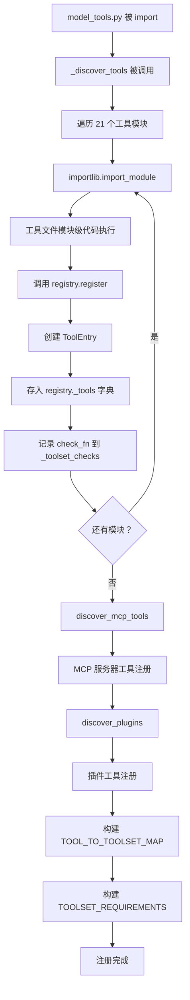
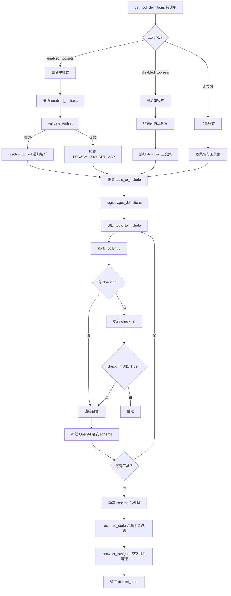
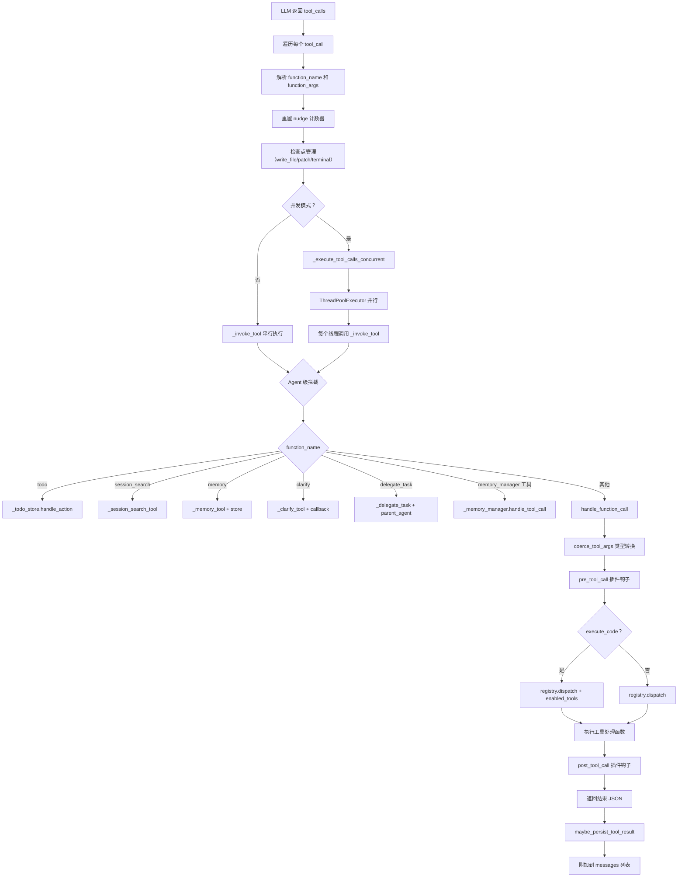
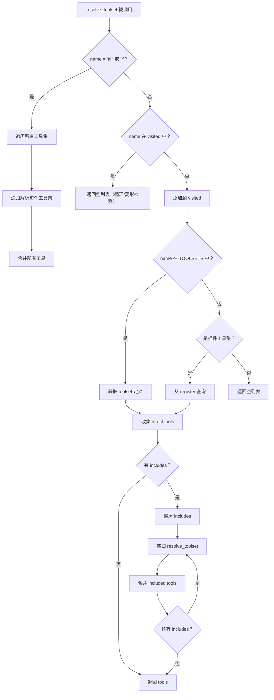

# Agent Tool 系统架构分析

## 1. 概述

Hermes Agent 实现了一套**声明式自注册、分层调度、可组合工具集**的工具系统。系统由三大核心模块组成：**ToolRegistry**（工具注册中心）、**Toolsets**（工具集管理）和 **ModelTools**（编排调度层），通过 50+ 个工具文件的自注册机制，实现了灵活的工具发现、过滤、调度和执行。

### 1.1 核心设计目标

| 目标 | 实现策略 |
|-----|---------|
| **声明式注册** | 工具文件在 import 时自动调用 `registry.register()` |
| **可组合工具集** | 工具集支持嵌套组合（`includes`）和递归解析 |
| **分层调度** | Agent 级拦截 → 插件钩子 → Registry 分发 |
| **动态发现** | MCP 服务器工具热刷新 + 插件工具动态注册 |
| **类型安全** | 参数类型自动强制转换（string→int/bool/number） |
| **并发执行** | ThreadPoolExecutor 并行执行多个工具调用 |

### 1.2 工具统计

```
工具文件:  53 个 (tools/*.py)
注册工具:  50+ 个
工具集:    30+ 个 (含 17 个平台工具集)
平台支持:  CLI, Telegram, Discord, WhatsApp, Slack, Signal, ...
```

---

## 2. 架构设计

### 2.1 三层架构

```
┌─────────────────────────────────────────────────────────┐
│              第 1 层：工具注册层                         │
│  ┌─────────────────────────────────────────────────┐    │
│  │ ToolRegistry (tools/registry.py)               │    │
│  │                                                 │    │
│  │ ┌───────────┐ ┌───────────┐ ┌───────────────┐ │    │
│  │ │ToolEntry  │ │ToolEntry  │ │   ToolEntry   │ │    │
│  │ │ web_search│ │ terminal  │ │  read_file    │ │    │
│  │ └───────────┘ └───────────┘ └───────────────┘ │    │
│  │ ┌───────────┐ ┌───────────┐ ┌───────────────┐ │    │
│  │ │ToolEntry  │ │ToolEntry  │ │   ToolEntry   │ │    │
│  │ │ mcp_xxx_y │ │ memory    │ │  execute_code │ │    │
│  │ └───────────┘ └───────────┘ └───────────────┘ │    │
│  │                                                 │    │
│  │ register()    — 注册工具                        │    │
│  │ deregister()  — 注销工具                        │    │
│  │ get_definitions() — 获取 schema                 │    │
│  │ dispatch()    — 执行工具                        │    │
│  └─────────────────────────────────────────────────┘    │
└─────────────────────────────────────────────────────────┘
                        ↑ import 时自注册
┌─────────────────────────────────────────────────────────┐
│              第 2 层：工具集层                           │
│  ┌─────────────────────────────────────────────────┐    │
│  │ Toolsets (toolsets.py)                         │    │
│  │                                                 │    │
│  │ ┌─────────┐ ┌─────────┐ ┌──────────────────┐  │    │
│  │ │  web    │ │terminal │ │  hermes-cli      │  │    │
│  │ │web_search│ │terminal │ │  (30+ tools)     │  │    │
│  │ │web_extract│ │process  │ │                  │  │    │
│  │ └─────────┘ └─────────┘ └──────────────────┘  │    │
│  │                                                 │    │
│  │ ┌─────────┐ ┌─────────────────────────────┐   │    │
│  │ │  safe   │ │  hermes-gateway (composite) │   │    │
│  │ │includes:│ │  includes:                   │   │    │
│  │ │ web     │ │  hermes-telegram             │   │    │
│  │ │ vision  │ │  hermes-discord              │   │    │
│  │ │image_gen│ │  hermes-whatsapp             │   │    │
│  │ └─────────┘ │  ...                         │   │    │
│  │              └─────────────────────────────┘   │    │
│  │                                                 │    │
│  │ resolve_toolset() — 递归解析                    │    │
│  │ validate_toolset() — 验证名称                   │    │
│  │ create_custom_toolset() — 动态创建              │    │
│  └─────────────────────────────────────────────────┘    │
└─────────────────────────────────────────────────────────┘
                        ↑ 工具集过滤
┌─────────────────────────────────────────────────────────┐
│              第 3 层：编排调度层                         │
│  ┌─────────────────────────────────────────────────┐    │
│  │ ModelTools (model_tools.py)                    │    │
│  │                                                 │    │
│  │ _discover_tools() — 触发 import 自注册          │    │
│  │ get_tool_definitions() — 工具集过滤 + schema    │    │
│  │ handle_function_call() — 调度分发               │    │
│  │ coerce_tool_args() — 参数类型强制转换            │    │
│  │                                                 │    │
│  │ ┌──────────────────────────────────────────┐    │    │
│  ��� │ AIAgent (run_agent.py)                    │    │    │
│  │ │                                          │    │    │
│  │ │ _invoke_tool() — Agent 级拦截            │    │    │
│  │ │   ├─ todo/session_search → 本地处理      │    │    │
│  │ │   ├─ memory → MemoryStore 处理           │    │    │
│  │ │   ├─ clarify → callback 处理             │    │    │
│  │ │   ├─ delegate_task → 子代理处理          │    │    │
│  │ │   └─ 其他 → handle_function_call()       │    │    │
│  │ │                                          │    │    │
│  │ │ _execute_tool_calls_concurrent()         │    │    │
│  │ │   └─ ThreadPoolExecutor 并行执行         │    │    │
│  │ └──────────────────────────────────────────┘    │    │
│  └─────────────────────────────────────────────────┘    │
└─────────────────────────────────────────────────────────┘
```

### 2.2 依赖链

```
tools/registry.py  (无外部依赖 — 被所有工具文件导入)
       ↑
tools/*.py  (每个文件在 import 时调用 registry.register())
       ↑
model_tools.py  (导入 tools.registry + 所有工具模块)
       ↑
run_agent.py, cli.py, batch_runner.py, gateway/run.py
```

**循环导入安全**: `registry.py` 不导入 `model_tools` 或任何工具文件，确保依赖链单向。

### 2.3 核心设计原则

1. **声明式自注册（Declarative Self-Registration）**: 工具文件在模块级调用 `registry.register()`，无需中央配置
2. **单一职责（Single Responsibility）**: Registry 只管存储和查询，Toolsets 只管组合和解析，ModelTools 只管调度
3. **开闭原则（Open/Closed）**: 新增工具只需创建文件并调用 `register()`，无需修改现有代码
4. **依赖倒置（Dependency Inversion）**: 上层依赖 Registry 抽象，不依赖具体工具实现
5. **组合优于继承（Composition over Inheritance）**: 工具集通过 `includes` 组合，而非继承

---

## 3. 核心实现

### 3.1 ToolRegistry — 工具注册中心

**文件位置**: [`tools/registry.py`](file:///home/meizu/Documents/my_agent_project/hermes-agent/tools/registry.py#L48-L290)

#### 3.1.1 ToolEntry 数据结构

```python
class ToolEntry:
    """Metadata for a single registered tool."""
    __slots__ = (
        "name", "toolset", "schema", "handler", "check_fn",
        "requires_env", "is_async", "description", "emoji",
        "max_result_size_chars",
    )
```

| 字段 | 类型 | 说明 |
|-----|------|------|
| `name` | str | 工具唯一标识符 |
| `toolset` | str | 所属工具集名称 |
| `schema` | dict | OpenAI 格式的 JSON Schema |
| `handler` | Callable | 工具处理函数 |
| `check_fn` | Callable | 可用性检查函数（如检查 API Key） |
| `requires_env` | list | 所需环境变量列表 |
| `is_async` | bool | 是否为异步处理函数 |
| `description` | str | 工具描述 |
| `emoji` | str | 显示用 emoji |
| `max_result_size_chars` | int | 结果大小限制 |

#### 3.1.2 注册机制

```python
class ToolRegistry:
    """Singleton registry that collects tool schemas + handlers from tool files."""

    def __init__(self):
        self._tools: Dict[str, ToolEntry] = {}
        self._toolset_checks: Dict[str, Callable] = {}

    def register(
        self, name, toolset, schema, handler,
        check_fn=None, requires_env=None, is_async=False,
        description="", emoji="", max_result_size_chars=None,
    ):
        """Register a tool. Called at module-import time by each tool file."""
        existing = self._tools.get(name)
        if existing and existing.toolset != toolset:
            logger.warning(
                "Tool name collision: '%s' (toolset '%s') is being "
                "overwritten by toolset '%s'",
                name, existing.toolset, toolset,
            )
        self._tools[name] = ToolEntry(...)
        if check_fn and toolset not in self._toolset_checks:
            self._toolset_checks[toolset] = check_fn
```

#### 3.1.3 Schema 获取

```python
def get_definitions(self, tool_names: Set[str], quiet: bool = False) -> List[dict]:
    """Return OpenAI-format tool schemas for the requested tool names.
    
    Only tools whose check_fn() returns True (or have no check_fn)
    are included.
    """
    result = []
    check_results: Dict[Callable, bool] = {}  # 缓存 check_fn 结果
    for name in sorted(tool_names):
        entry = self._tools.get(name)
        if not entry:
            continue
        if entry.check_fn:
            if entry.check_fn not in check_results:
                try:
                    check_results[entry.check_fn] = bool(entry.check_fn())
                except Exception:
                    check_results[entry.check_fn] = False
            if not check_results[entry.check_fn]:
                continue
        schema_with_name = {**entry.schema, "name": entry.name}
        result.append({"type": "function", "function": schema_with_name})
    return result
```

**check_fn 缓存优化**: 同一 toolset 的多个工具共享同一个 `check_fn`，结果只计算一次。

#### 3.1.4 调度分发

```python
def dispatch(self, name: str, args: dict, **kwargs) -> str:
    """Execute a tool handler by name.
    
    * Async handlers are bridged automatically via _run_async().
    * All exceptions are caught and returned as {"error": "..."}.
    """
    entry = self._tools.get(name)
    if not entry:
        return json.dumps({"error": f"Unknown tool: {name}"})
    try:
        if entry.is_async:
            from model_tools import _run_async
            return _run_async(entry.handler(args, **kwargs))
        return entry.handler(args, **kwargs)
    except Exception as e:
        logger.exception("Tool %s dispatch error: %s", name, e)
        return json.dumps({"error": f"Tool execution failed: {type(e).__name__}: {e}"})
```

#### 3.1.5 注销机制

```python
def deregister(self, name: str) -> None:
    """Remove a tool from the registry.
    
    Also cleans up the toolset check if no other tools remain.
    Used by MCP dynamic tool discovery to nuke-and-repave when
    a server sends notifications/tools/list_changed.
    """
    entry = self._tools.pop(name, None)
    if entry is None:
        return
    if entry.toolset in self._toolset_checks and not any(
        e.toolset == entry.toolset for e in self._tools.values()
    ):
        self._toolset_checks.pop(entry.toolset, None)
```

### 3.2 Toolsets — 工具集管理

**文件位置**: [`toolsets.py`](file:///home/meizu/Documents/my_agent_project/hermes-agent/toolsets.py#L68-L391)

#### 3.2.1 工具集定义结构

```python
TOOLSETS = {
    "web": {
        "description": "Web research and content extraction tools",
        "tools": ["web_search", "web_extract"],
        "includes": []  # 不包含其他工具集
    },
    "debugging": {
        "description": "Debugging and troubleshooting toolkit",
        "tools": ["terminal", "process"],
        "includes": ["web", "file"]  # 组合其他工具集
    },
    "hermes-gateway": {
        "description": "Gateway toolset - union of all messaging platform tools",
        "tools": [],
        "includes": ["hermes-telegram", "hermes-discord", "hermes-whatsapp", ...]
    },
}
```

#### 3.2.2 递归解析

```python
def resolve_toolset(name: str, visited: Set[str] = None) -> List[str]:
    """Recursively resolve a toolset to get all tool names.
    
    Handles toolset composition by recursively resolving included
    toolsets and combining all tools. Detects diamond dependencies
    and cycles via the visited set.
    """
    if visited is None:
        visited = set()

    # Special aliases: "all" or "*" → resolve every toolset
    if name in {"all", "*"}:
        all_tools: Set[str] = set()
        for toolset_name in get_toolset_names():
            resolved = resolve_toolset(toolset_name, visited.copy())
            all_tools.update(resolved)
        return list(all_tools)

    # Cycle / diamond detection
    if name in visited:
        return []
    visited.add(name)

    toolset = TOOLSETS.get(name)
    if not toolset:
        # Fall back to plugin-provided toolsets from registry
        if name in _get_plugin_toolset_names():
            from tools.registry import registry
            return [e.name for e in registry._tools.values() if e.toolset == name]
        return []

    # Collect direct tools
    tools = set(toolset.get("tools", []))

    # Recursively resolve included toolsets
    for included_name in toolset.get("includes", []):
        included_tools = resolve_toolset(included_name, visited)
        tools.update(included_tools)

    return list(tools)
```

#### 3.2.3 工具集分类

| 类别 | 工具集 | 说明 |
|-----|--------|------|
| **基础** | web, search, vision, image_gen, terminal, file, tts, ... | 单一功能域 |
| **场景** | debugging, safe | 组合多个基础工具集 |
| **核心** | hermes-cli | CLI 全功能工具集 |
| **平台** | hermes-telegram, hermes-discord, ... | 17 个消息平台工具集 |
| **组合** | hermes-gateway | 所有平台工具集的并集 |
| **编辑器** | hermes-acp | VS Code/Zed/JetBrains 集成 |
| **API** | hermes-api-server | OpenAI 兼容 API 服务器 |

### 3.3 ModelTools — 编排调度层

**文件位置**: [`model_tools.py`](file:///home/meizu/Documents/my_agent_project/hermes-agent/model_tools.py#L132-L549)

#### 3.3.1 工具发现

```python
def _discover_tools():
    """Import all tool modules to trigger their registry.register() calls.
    
    Wrapped in a function so import errors in optional tools don't
    prevent the rest from loading.
    """
    _modules = [
        "tools.web_tools",
        "tools.terminal_tool",
        "tools.file_tools",
        "tools.vision_tools",
        "tools.mixture_of_agents_tool",
        "tools.image_generation_tool",
        "tools.skills_tool",
        "tools.skill_manager_tool",
        "tools.browser_tool",
        "tools.cronjob_tools",
        "tools.rl_training_tool",
        "tools.tts_tool",
        "tools.todo_tool",
        "tools.memory_tool",
        "tools.session_search_tool",
        "tools.clarify_tool",
        "tools.code_execution_tool",
        "tools.delegate_tool",
        "tools.process_registry",
        "tools.send_message_tool",
        "tools.homeassistant_tool",
    ]
    import importlib
    for mod_name in _modules:
        try:
            importlib.import_module(mod_name)
        except Exception as e:
            logger.warning("Could not import tool module %s: %s", mod_name, e)

_discover_tools()

# MCP tool discovery (external MCP servers from config)
try:
    from tools.mcp_tool import discover_mcp_tools
    discover_mcp_tools()
except Exception as e:
    logger.debug("MCP tool discovery failed: %s", e)

# Plugin tool discovery (user/project/pip plugins)
try:
    from hermes_cli.plugins import discover_plugins
    discover_plugins()
except Exception as e:
    logger.debug("Plugin discovery failed: %s", e)
```

**三阶段发现**:
1. **内置工具**: 21 个核心工具模块 import
2. **MCP 工具**: 外部 MCP 服务器工具发现
3. **插件工具**: 用户/项目/pip 插件工具发现

#### 3.3.2 工具定义获取

```python
def get_tool_definitions(
    enabled_toolsets=None, disabled_toolsets=None, quiet_mode=False,
) -> List[Dict[str, Any]]:
    """Get tool definitions for model API calls with toolset-based filtering."""
    tools_to_include: set = set()

    if enabled_toolsets is not None:
        # 白名单模式：仅包含指定工具集
        for toolset_name in enabled_toolsets:
            if validate_toolset(toolset_name):
                resolved = resolve_toolset(toolset_name)
                tools_to_include.update(resolved)
            elif toolset_name in _LEGACY_TOOLSET_MAP:
                tools_to_include.update(_LEGACY_TOOLSET_MAP[toolset_name])
    elif disabled_toolsets:
        # 黑名单模式：排除指定工具集
        for ts_name in get_all_toolsets():
            tools_to_include.update(resolve_toolset(ts_name))
        for toolset_name in disabled_toolsets:
            if validate_toolset(toolset_name):
                tools_to_include.difference_update(resolve_toolset(toolset_name))
    else:
        # 默认模式：包含所有工具
        for ts_name in get_all_toolsets():
            tools_to_include.update(resolve_toolset(ts_name))

    # Registry 过滤（check_fn）
    filtered_tools = registry.get_definitions(tools_to_include, quiet=quiet_mode)
    available_tool_names = {t["function"]["name"] for t in filtered_tools}

    # 动态 schema 后处理
    # 1. execute_code: 仅列出实际可用的沙箱工具
    if "execute_code" in available_tool_names:
        sandbox_enabled = SANDBOX_ALLOWED_TOOLS & available_tool_names
        dynamic_schema = build_execute_code_schema(sandbox_enabled)
        # 替换 schema...

    # 2. browser_navigate: 移除不可用 web 工具的交叉引用
    if "browser_navigate" in available_tool_names:
        web_tools_available = {"web_search", "web_extract"} & available_tool_names
        if not web_tools_available:
            # 移除 "prefer web_search or web_extract" 描述...

    return filtered_tools
```

#### 3.3.3 参数类型强制转换

```python
def coerce_tool_args(tool_name: str, args: Dict[str, Any]) -> Dict[str, Any]:
    """Coerce tool call arguments to match their JSON Schema types.
    
    LLMs frequently return numbers as strings ("42" instead of 42)
    and booleans as strings ("true" instead of true).
    """
    if not args or not isinstance(args, dict):
        return args
    schema = registry.get_schema(tool_name)
    if not schema:
        return args
    properties = (schema.get("parameters") or {}).get("properties")
    if not properties:
        return args
    for key, value in args.items():
        if not isinstance(value, str):
            continue
        prop_schema = properties.get(key)
        if not prop_schema:
            continue
        expected = prop_schema.get("type")
        if not expected:
            continue
        coerced = _coerce_value(value, expected)
        if coerced is not value:
            args[key] = coerced
    return args
```

#### 3.3.4 调度分发

```python
_AGENT_LOOP_TOOLS = {"todo", "memory", "session_search", "delegate_task"}

def handle_function_call(
    function_name, function_args, task_id=None, tool_call_id=None,
    session_id=None, user_task=None, enabled_tools=None,
) -> str:
    """Main function call dispatcher that routes calls to the tool registry."""
    # 1. 参数类型强制转换
    function_args = coerce_tool_args(function_name, function_args)

    # 2. 通知 read-loop tracker
    if function_name not in _READ_SEARCH_TOOLS:
        notify_other_tool_call(task_id or "default")

    # 3. Agent 级工具拦截
    if function_name in _AGENT_LOOP_TOOLS:
        return json.dumps({"error": f"{function_name} must be handled by the agent loop"})

    # 4. 插件钩子: pre_tool_call
    invoke_hook("pre_tool_call", tool_name=function_name, args=function_args, ...)

    # 5. Registry 分发
    if function_name == "execute_code":
        sandbox_enabled = enabled_tools or _last_resolved_tool_names
        result = registry.dispatch(function_name, function_args,
                                   task_id=task_id, enabled_tools=sandbox_enabled)
    else:
        result = registry.dispatch(function_name, function_args,
                                   task_id=task_id, user_task=user_task)

    # 6. 插件钩子: post_tool_call
    invoke_hook("post_tool_call", tool_name=function_name, args=function_args, result=result, ...)

    return result
```

### 3.4 AIAgent — Agent 级工具拦截

**文件位置**: [`run_agent.py`](file:///home/meizu/Documents/my_agent_project/hermes-agent/run_agent.py#L6700-L6800)

```python
def _invoke_tool(self, function_name, function_args, effective_task_id, tool_call_id):
    """Agent-level tool interception — routes to appropriate handler."""
    # Agent 级拦截：需要 Agent 状态的工具
    if function_name == "todo":
        return self._todo_store.handle_action(function_args)
    elif function_name == "session_search":
        return self._session_search_tool(
            query=function_args.get("query", ""),
            current_session_id=self.session_id,
        )
    elif function_name == "memory":
        return _memory_tool(
            action=function_args.get("action"),
            target=function_args.get("target", "memory"),
            content=function_args.get("content"),
            old_text=function_args.get("old_text"),
            store=self._memory_store,
        )
    elif self._memory_manager and self._memory_manager.has_tool(function_name):
        return self._memory_manager.handle_tool_call(function_name, function_args)
    elif function_name == "clarify":
        return _clarify_tool(
            question=function_args.get("question", ""),
            choices=function_args.get("choices"),
            callback=self.clarify_callback,
        )
    elif function_name == "delegate_task":
        return _delegate_task(
            goal=function_args.get("goal"),
            context=function_args.get("context"),
            toolsets=function_args.get("toolsets"),
            tasks=function_args.get("tasks"),
            max_iterations=function_args.get("max_iterations"),
            parent_agent=self,
        )
    else:
        # 标准工具：委托给 handle_function_call
        return handle_function_call(
            function_name, function_args, effective_task_id,
            tool_call_id=tool_call_id,
            session_id=self.session_id or "",
            enabled_tools=list(self.valid_tool_names),
        )
```

### 3.5 异步桥接

**文件位置**: [`model_tools.py`](file:///home/meizu/Documents/my_agent_project/hermes-agent/model_tools.py#L39-L126)

```python
_tool_loop = None          # 主线程持久事件循环
_tool_loop_lock = threading.Lock()
_worker_thread_local = threading.local()  # 工作线程本地存储

def _run_async(coro):
    """Run an async coroutine from a sync context.
    
    三种执行路径:
    1. 异步上下文中（gateway/RL）→ 新线程 + asyncio.run()
    2. 工作线程中（并行工具执行）→ 线程本地持久循环
    3. 主线程中（CLI）→ 共享持久循环
    """
    try:
        loop = asyncio.get_running_loop()
    except RuntimeError:
        loop = None

    if loop and loop.is_running():
        # 路径 1: 异步上下文 → 新线程
        import concurrent.futures
        with concurrent.futures.ThreadPoolExecutor(max_workers=1) as pool:
            future = pool.submit(asyncio.run, coro)
            return future.result(timeout=300)

    if threading.current_thread() is not threading.main_thread():
        # 路径 2: 工作线程 → 线程本地持久循环
        worker_loop = _get_worker_loop()
        return worker_loop.run_until_complete(coro)

    # 路径 3: 主线程 → 共享持久循环
    tool_loop = _get_tool_loop()
    return tool_loop.run_until_complete(coro)
```

---

## 4. 业务流程

### 4.1 工具注册流程



### 4.2 工具定义获取流程



### 4.3 工具调用调度流程



### 4.4 工具集解析流程



---

## 5. 设计模式分析

### 5.1 使用的设计模式

| 模式 | 应用位置 | 说明 |
|-----|---------|------|
| **单例模式** | `ToolRegistry` | 模块级 `registry = ToolRegistry()` 全局唯一实例 |
| **自注册模式** | `tools/*.py` | 工具文件在 import 时自动注册，无需中央配置 |
| **策略模式** | `check_fn` | 每个工具集提供不同的可用性检查策略 |
| **组合模式** | `TOOLSETS.includes` | 工具集通过嵌套组合构建复杂工具集 |
| **外观模式** | `model_tools.py` | 对外提供简化 API，隐藏 Registry 和 Toolsets 细节 |
| **观察者模式** | `pre/post_tool_call` 钩子 | 插件可监听工具调用事件 |
| **模板方法** | `_invoke_tool` | Agent 级拦截定义了工具调用的骨架流程 |
| **适配器模式** | `_run_async` | 将异步处理函数适配为同步调用 |
| **装饰器模式** | `coerce_tool_args` | 在调度前增强参数处理 |
| **代理模式** | `handle_function_call` | 作为 Registry.dispatch 的代理，添加钩子和拦截 |

### 5.2 模式协作关系

```
自注册模式 → 单例模式 → 外观模式 → 策略模式
     ↓              ↓          ↓          ↓
  tools/*.py    registry   model_tools  check_fn
                              ↓
                    ┌─────────┼──────────┐
                    ↓         ↓          ↓
               观察者模式  模板方法   适配器模式
              pre/post_hook  _invoke   _run_async
                    ↓         ↓
               装饰器模式  代理模式
              coerce_args  handle_function_call
```

---

## 6. 安全机制详解

### 6.1 工具可用性检查

```python
# 每个 toolset 可以注册 check_fn 来检查前置条件
# 例如：检查 API Key 是否配置

# web_tools.py
def check_requirements() -> bool:
    return bool(os.getenv("BRAVE_API_KEY") or os.getenv("FIRECRAWL_API_KEY"))

registry.register(
    name="web_search",
    toolset="web",
    check_fn=check_requirements,
    requires_env=["BRAVE_API_KEY"],
)

# browser_tool.py
def check_requirements() -> bool:
    return bool(os.getenv("BROWSERBASE_API_KEY") or os.getenv("BROWSER_USE_API_KEY"))

registry.register(
    name="browser_navigate",
    toolset="browser",
    check_fn=check_requirements,
    requires_env=["BROWSERBASE_API_KEY"],
)
```

### 6.2 Agent 级工具拦截

```python
# 需要访问 Agent 状态的工具不能通过 Registry 分发
# 必须在 AIAgent._invoke_tool 中拦截处理

_AGENT_LOOP_TOOLS = {"todo", "memory", "session_search", "delegate_task"}

# 原因：
# - todo: 需要 Agent 的 TodoStore 实例
# - memory: 需要 Agent 的 MemoryStore 实例
# - session_search: 需要 Agent 的 session_id
# - delegate_task: 需要 Agent 的 parent_agent 引用
# - clarify: 需要 Agent 的 clarify_callback
```

### 6.3 动态 Schema 后处理

```python
# 1. execute_code: 仅暴露实际可用的沙箱工具
# 防止模型看到不可用的工具名并产生幻觉调用
if "execute_code" in available_tool_names:
    sandbox_enabled = SANDBOX_ALLOWED_TOOLS & available_tool_names
    dynamic_schema = build_execute_code_schema(sandbox_enabled)

# 2. browser_navigate: 移除不可用 web 工具的交叉引用
# 防止模型尝试调用不存在的 web_search
if "browser_navigate" in available_tool_names:
    web_tools_available = {"web_search", "web_extract"} & available_tool_names
    if not web_tools_available:
        # 移除 "prefer web_search or web_extract" 描述
```

### 6.4 参数类型安全

```python
# LLM 经常返回错误类型的参数
# coerce_tool_args 自动修正：

# "42" → 42 (integer)
# "3.14" → 3.14 (number)
# "true" → True (boolean)
# "false" → False (boolean)

# 联合类型也支持：
# type: ["integer", "string"] → 尝试 integer，失败则保留 string
```

---

## 7. 工具注册示例

### 7.1 标准工具注册

```python
# tools/web_tools.py
import os
from tools.registry import registry

def check_requirements() -> bool:
    return bool(os.getenv("BRAVE_API_KEY") or os.getenv("FIRECRAWL_API_KEY"))

def web_search(query: str, task_id: str = None) -> str:
    # ... 搜索逻辑
    return json.dumps({"results": [...]})

registry.register(
    name="web_search",
    toolset="web",
    schema={
        "name": "web_search",
        "description": "Search the web for information",
        "parameters": {
            "type": "object",
            "properties": {
                "query": {"type": "string", "description": "Search query"},
            },
            "required": ["query"],
        },
    },
    handler=lambda args, **kw: web_search(query=args.get("query", ""), task_id=kw.get("task_id")),
    check_fn=check_requirements,
    requires_env=["BRAVE_API_KEY"],
)
```

### 7.2 MCP 动态工具注册

```python
# tools/mcp_tool.py
def _register_server_tools(name, server, config):
    registered_names = []
    toolset_name = f"mcp-{name}"

    # 工具过滤
    tools_filter = config.get("tools") or {}
    include_set = _normalize_name_filter(tools_filter.get("include"))
    exclude_set = _normalize_name_filter(tools_filter.get("exclude"))

    for mcp_tool in server._tools:
        if not _should_register(mcp_tool.name):
            continue
        schema = _convert_mcp_schema(name, mcp_tool)
        tool_name_prefixed = schema["name"]  # mcp_{server}_{tool}

        # 碰撞检测：不覆盖内置工具
        existing_toolset = registry.get_toolset_for_tool(tool_name_prefixed)
        if existing_toolset and not existing_toolset.startswith("mcp-"):
            continue

        registry.register(
            name=tool_name_prefixed,
            toolset=toolset_name,
            schema=schema,
            handler=_make_tool_handler(name, mcp_tool.name, server.tool_timeout),
            check_fn=_make_check_fn(name),
            is_async=False,
        )
        registered_names.append(tool_name_prefixed)
```

---

## 8. 相关文件索引

| 文件 | 职责 | 关键函数/类 |
|-----|------|------------|
| `tools/registry.py` | 工具注册中心 | `ToolRegistry`, `ToolEntry`, `tool_error()`, `tool_result()` |
| `toolsets.py` | 工具集管理 | `TOOLSETS`, `resolve_toolset()`, `validate_toolset()`, `create_custom_toolset()` |
| `model_tools.py` | 编排调度层 | `_discover_tools()`, `get_tool_definitions()`, `handle_function_call()`, `coerce_tool_args()`, `_run_async()` |
| `run_agent.py` | Agent 级拦截 | `_invoke_tool()`, `_execute_tool_calls_concurrent()` |
| `tools/web_tools.py` | Web 搜索工具 | `web_search`, `web_extract` |
| `tools/terminal_tool.py` | 终端工具 | `terminal` |
| `tools/file_tools.py` | 文件工具 | `read_file`, `write_file`, `patch`, `search_files` |
| `tools/browser_tool.py` | 浏览器工具 | `browser_navigate`, `browser_snapshot`, ... |
| `tools/code_execution_tool.py` | 代码执行工具 | `execute_code` |
| `tools/delegate_tool.py` | 子代理工具 | `delegate_task` |
| `tools/mcp_tool.py` | MCP 工具 | `MCPServerTask`, `discover_mcp_tools()` |
| `tools/memory_tool.py` | 记忆工具 | `memory` |
| `tools/todo_tool.py` | 任务工具 | `todo` |
| `tools/approval.py` | 危险命令审批 | `detect_dangerous_command()`, `check_all_command_guards()` |

---

## 9. 总结

Hermes Agent 的工具系统采用了**声明式自注册、分层调度、可组合工具集**的设计哲学：

### 核心优势

1. **声明式注册**: 工具文件在 import 时自动注册，零配置
2. **分层调度**: Agent 拦截 → 插件钩子 → Registry 分发，三层清晰
3. **可组合工具集**: 30+ 个工具集支持嵌套组合，覆盖 17 个平台
4. **动态发现**: MCP 工具热刷新 + 插件工具动态注册
5. **类型安全**: 参数自动强制转换，防止 LLM 类型错误
6. **并发执行**: ThreadPoolExecutor 并行执行多个工具调用
7. **异步桥接**: 三路径异步适配（异步上下文/工作线程/主线程）

### 设计模式

- ✅ **单例模式**: 全局唯一 Registry 实例
- ✅ **自注册模式**: 工具文件零配置注册
- ✅ **策略模式**: 可插拔的 check_fn
- ✅ **组合模式**: 工具集嵌套组合
- ✅ **外观模式**: model_tools.py 简化 API
- ✅ **观察者模式**: pre/post_tool_call 钩子
- ✅ **适配器模式**: _run_async 异步桥接
- ✅ **代理模式**: handle_function_call 增强调度

### 安全特性

- ✅ **可用性检查**: check_fn 前置条件验证
- ✅ **Agent 级拦截**: 需要 Agent 状态的工具不被 Registry 分发
- ✅ **动态 Schema**: 防止模型幻觉调用不存在的工具
- ✅ **参数类型安全**: 自动强制转换 LLM 输出
- ✅ **碰撞保护**: MCP 工具不覆盖内置工具
- ✅ **工具过滤**: include/exclude 细粒度控制
