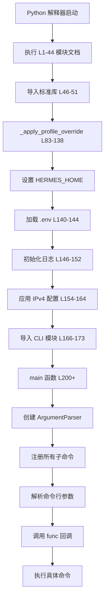
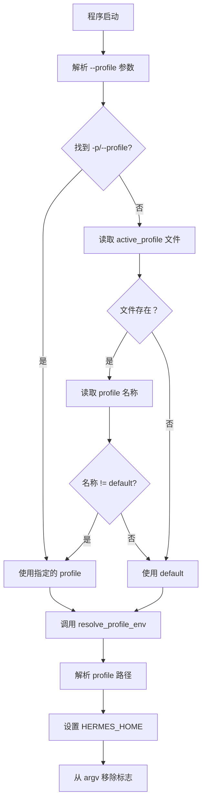
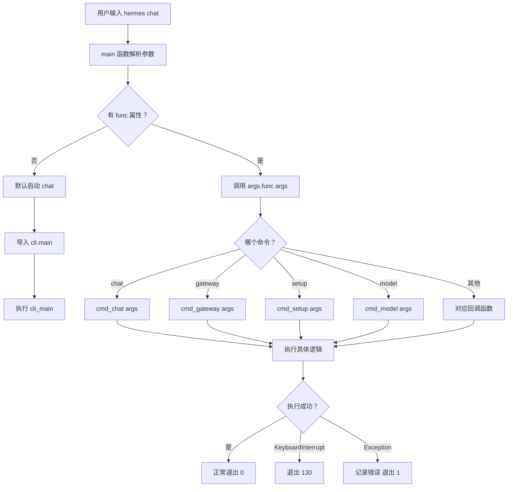

# Hermes CLI 业务逻辑分析

> 文件：`hermes_cli/main.py` | 整理日期：2026-04-23 | 版本：1.0

***

## 目录

1. [文件概览](#1-文件概览)
2. [程序启动流程](#2-程序启动流程)
3. [参数解析器架构](#3-参数解析器架构)
4. [核心命令详解](#4-核心命令详解)
5. [Profile 机制](#5-profile-机制)
6. [环境隔离机制](#6-环境隔离机制)
7. [回调函数分发](#7-回调函数分发)
8. [关键设计模式](#8-关键设计模式)

***

## 1. 文件概览

### 1.1 文件信息

| 属性 | 值 |
|------|------|
| **文件路径** | `hermes_cli/main.py` |
| **代码行数** | ~5500 行 |
| **主要职责** | CLI 命令入口、参数解析、命令分发 |
| **核心函数** | `main()`, `_apply_profile_override()` |

### 1.2 功能模块

```
┌─────────────────────────────────────────────────────────┐
│                   hermes_cli/main.py                     │
├─────────────────────────────────────────────────────────┤
│  1. Profile 覆盖机制 (L83-138)                           │
│  2. 环境变量加载 (L140-144)                              │
│  3. 日志系统初始化 (L146-152)                            │
│  4. 网络配置应用 (L154-164)                              │
│  5. 参数解析器 (L200-5000+)                              │
│  6. 命令分发器 (L5000-5500)                              │
└─────────────────────────────────────────────────────────┘
```

***

## 2. 程序启动流程

### 2.1 完整启动序列



### 2.2 关键初始化步骤

**步骤 1：Profile 覆盖（L83-138）**

```python
def _apply_profile_override() -> None:
    """Pre-parse --profile/-p and set HERMES_HOME before module imports."""
    argv = sys.argv[1:]
    profile_name = None
    consume = 0

    # 1. 检查显式 -p / --profile 标志
    for i, arg in enumerate(argv):
        if arg in ("--profile", "-p") and i + 1 < len(argv):
            profile_name = argv[i + 1]
            consume = 2
            break
        elif arg.startswith("--profile="):
            profile_name = arg.split("=", 1)[1]
            consume = 1
            break

    # 2. 如果没有标志，检查 active_profile 文件
    if profile_name is None:
        try:
            from hermes_constants import get_default_hermes_root
            active_path = get_default_hermes_root() / "active_profile"
            if active_path.exists():
                name = active_path.read_text().strip()
                if name and name != "default":
                    profile_name = name
                    consume = 0  # 不从 argv 中移除任何内容
        except (UnicodeDecodeError, OSError):
            pass  # 文件损坏，跳过

    # 3. 如果找到 profile，解析并设置 HERMES_HOME
    if profile_name is not None:
        try:
            from hermes_cli.profiles import resolve_profile_env
            hermes_home = resolve_profile_env(profile_name)
        except (ValueError, FileNotFoundError) as exc:
            print(f"Error: {exc}", file=sys.stderr)
            sys.exit(1)
        except Exception as exc:
            print(f"Warning: profile override failed ({exc}), using default", file=sys.stderr)
            return
        os.environ["HERMES_HOME"] = hermes_home
        # 从 argv 中移除标志，防止 argparse 报错
        if consume > 0:
            # ... 移除逻辑
```

**调用时机：** L138 - 在所有模块导入之前

```python
_apply_profile_override()  # MUST happen before any hermes module import
```

**步骤 2：环境变量加载（L140-144）**

```python
from hermes_cli.config import get_hermes_home
from hermes_cli.env_loader import load_hermes_dotenv
load_hermes_dotenv(project_env=PROJECT_ROOT / '.env')
```

**步骤 3：日志初始化（L146-152）**

```python
try:
    from hermes_logging import setup_logging as _setup_logging
    _setup_logging(mode="cli")
except Exception:
    pass  # 最佳努力 — 日志失败不崩溃
```

**步骤 4：网络配置（L154-164）**

```python
try:
    from hermes_cli.config import load_config as _load_config_early
    from hermes_constants import apply_ipv4_preference as _apply_ipv4
    _early_cfg = _load_config_early()
    _net = _early_cfg.get("network", {})
    if isinstance(_net, dict) and _net.get("force_ipv4"):
        _apply_ipv4(force=True)
    del _early_cfg, _net
except Exception:
    pass  # 最佳努力
```

***

## 3. 参数解析器架构

### 3.1 主解析器创建

**代码位置：** L200-250

```python
def main():
    parser = argparse.ArgumentParser(
        prog="hermes",
        description="Hermes Agent - Your AI assistant",
        epilog="Examples:\n"
               "  hermes\n"
               "  hermes chat\n"
               "  hermes gateway\n"
               "  hermes setup\n",
        formatter_class=argparse.RawDescriptionHelpFormatter,
    )
```

### 3.2 全局参数

**代码位置：** L250-300

```python
# 全局参数
parser.add_argument(
    "--version", "-V",
    action="version",
    version=f"%(prog)s {__version__} ({__release_date__})",
)

parser.add_argument(
    "--profile", "-p",
    metavar="NAME",
    help="Use a named profile instead of default (profiles live in ~/.hermes/profiles/NAME)",
)

parser.add_argument(
    "--verbose", "-v",
    action="store_true",
    help="Enable verbose logging",
)
```

### 3.3 子命令结构

```python
subparsers = parser.add_subparsers(
    dest="command",
    title="commands",
    description="Available commands",
)
```

**子命令组织方式：**

```
hermes
├── chat (默认)
├── gateway
│   ├── run
│   ├── start
│   ├── stop
│   ├── status
│   ├── install
│   └── uninstall
├── setup
├── model
├── config
├── skills
├── tools
├── honcho
├── cron
├── doctor
├── backup
├── import
└── ...
```

***

## 4. 核心命令详解

### 4.1 chat 命令（默认命令）

**代码位置：** L4500-4663

**功能：** 交互式聊天

**参数定义：**

```python
chat_parser = subparsers.add_parser(
    "chat",
    help="Interactive chat with Hermes Agent",
    description="Start an interactive chat session with Hermes Agent",
)

# 位置参数
chat_parser.add_argument(
    "message",
    nargs="?",
    help="Initial message to send (optional)",
)

# 模型参数
chat_parser.add_argument(
    "--model", "-m",
    metavar="MODEL",
    help="Model to use for this session",
)

# 工具集参数
chat_parser.add_argument(
    "--enabled-toolsets",
    nargs="+",
    metavar="TOOLSET",
    help="Enable specific toolsets",
)

chat_parser.add_argument(
    "--disabled-toolsets",
    nargs="+",
    metavar="TOOLSET",
    help="Disable specific toolsets",
)

# 会话参数
chat_parser.add_argument(
    "--resume", "-r",
    metavar="SESSION_ID",
    default=argparse.SUPPRESS,
    help="Resume a previous session by ID",
)

chat_parser.add_argument(
    "--continue", "-c",
    dest="continue_last",
    nargs="?",
    const=True,
    default=argparse.SUPPRESS,
    metavar="SESSION_NAME",
    help="Resume a session by name, or the most recent",
)

# 工作树参数
chat_parser.add_argument(
    "--worktree", "-w",
    action="store_true",
    default=argparse.SUPPRESS,
    help="Run in an isolated git worktree",
)

# 检查点参数
chat_parser.add_argument(
    "--checkpoints",
    action="store_true",
    default=False,
    help="Enable filesystem checkpoints before destructive operations",
)

# 最大迭代次数
chat_parser.add_argument(
    "--max-turns",
    type=int,
    default=None,
    metavar="N",
    help="Maximum tool-calling iterations per turn",
)

# YOLO 模式
chat_parser.add_argument(
    "--yolo",
    action="store_true",
    default=argparse.SUPPRESS,
    help="Bypass all dangerous command approval prompts",
)

# 会话 ID 传递
chat_parser.add_argument(
    "--pass-session-id",
    action="store_true",
    default=argparse.SUPPRESS,
    help="Include session ID in system prompt",
)

# 来源标签
chat_parser.add_argument(
    "--source",
    default=None,
    help="Session source tag for filtering (default: cli)",
)

# 安静模式
chat_parser.add_argument(
    "-Q", "--quiet",
    action="store_true",
    help="Quiet mode: suppress banner, spinner, and tool previews",
)

# 详细模式
chat_parser.add_argument(
    "-v", "--verbose",
    action="store_true",
    help="Verbose output",
)

# 设置回调函数
chat_parser.set_defaults(func=cmd_chat)
```

**回调函数：** `cmd_chat(args)`

### 4.2 gateway 命令

**代码位置：** L4715-4762

**功能：** 消息平台网关管理

**子命令：**

```python
# gateway run (默认)
gateway_run = gateway_subparsers.add_parser(
    "run",
    help="Run gateway in foreground (recommended for WSL, Docker, Termux)"
)
gateway_run.add_argument("-v", "--verbose", action="count", default=0)
gateway_run.add_argument("-q", "--quiet", action="store_true")
gateway_run.add_argument("--replace", action="store_true")

# gateway start
gateway_start = gateway_subparsers.add_parser(
    "start",
    help="Start the installed systemd/launchd background service"
)
gateway_start.add_argument("--system", action="store_true")

# gateway stop
gateway_stop = gateway_subparsers.add_parser(
    "stop",
    help="Stop gateway service"
)
gateway_stop.add_argument("--system", action="store_true")
gateway_stop.add_argument("--all", action="store_true")

# gateway restart
gateway_restart = gateway_subparsers.add_parser(
    "restart",
    help="Restart gateway service"
)
gateway_restart.add_argument("--system", action="store_true")

# gateway status
gateway_status = gateway_subparsers.add_parser(
    "status",
    help="Show gateway status"
)
gateway_status.add_argument("--deep", action="store_true")
gateway_status.add_argument("--system", action="store_true")

# gateway install
gateway_install = gateway_subparsers.add_parser(
    "install",
    help="Install gateway as a systemd/launchd background service"
)
gateway_install.add_argument("--force", action="store_true")
gateway_install.add_argument("--system", action="store_true")
gateway_install.add_argument("--run-as-user", dest="run_as_user")

# gateway uninstall
gateway_uninstall = gateway_subparsers.add_parser(
    "uninstall",
    help="Uninstall gateway service"
)
gateway_uninstall.add_argument("--system", action="store_true")

# gateway setup
gateway_subparsers.add_parser(
    "setup",
    help="Configure messaging platforms"
)

# 设置回调
gateway_parser.set_defaults(func=cmd_gateway)
```

### 4.3 setup 命令

**代码位置：** L4767-4790

**功能：** 交互式配置向导

```python
setup_parser = subparsers.add_parser(
    "setup",
    help="Interactive setup wizard",
    description="Configure Hermes Agent with an interactive wizard. "
                "Run a specific section: hermes setup model|tts|terminal|gateway|tools|agent"
)

setup_parser.add_argument(
    "section",
    nargs="?",
    choices=["model", "tts", "terminal", "gateway", "tools", "agent"],
    default=None,
    help="Run a specific setup section instead of the full wizard"
)

setup_parser.add_argument(
    "--non-interactive",
    action="store_true",
    help="Non-interactive mode (use defaults/env vars)"
)

setup_parser.add_argument(
    "--reset",
    action="store_true",
    help="Reset configuration to defaults"
)

setup_parser.set_defaults(func=cmd_setup)
```

### 4.4 model 命令

**代码位置：** L4667-4710

**功能：** 选择默认模型和提供商

```python
model_parser = subparsers.add_parser(
    "model",
    help="Select default model and provider",
    description="Interactively select your inference provider and default model"
)

model_parser.add_argument("--portal-url", help="Portal base URL for Nous login")
model_parser.add_argument("--inference-url", help="Inference API base URL")
model_parser.add_argument("--client-id", default=None, help="OAuth client id")
model_parser.add_argument("--scope", default=None, help="OAuth scope")
model_parser.add_argument("--no-browser", action="store_true")
model_parser.add_argument("--timeout", type=float, default=15.0)
model_parser.add_argument("--ca-bundle", help="Path to CA bundle PEM file")
model_parser.add_argument("--insecure", action="store_true")

model_parser.set_defaults(func=cmd_model)
```

### 4.5 honcho 命令

**代码位置：** L4800-4900（估算）

**功能：** Honcho AI 记忆集成管理

**子命令示例：**

```python
honcho_parser = subparsers.add_parser(
    "honcho",
    help="Manage Honcho AI memory integration"
)

honcho_sub = honcho_parser.add_subparsers(dest="honcho_command")

# honcho setup
honcho_sub.add_parser("setup", help="Configure Honcho integration")

# honcho status
honcho_sub.add_parser("status", help="Show Honcho config and connection status")

# honcho sessions
honcho_sub.add_parser("sessions", help="List directory → session mappings")

# honcho map
honcho_map = honcho_sub.add_parser("map", help="Map current directory to session")
honcho_map.add_argument("name", help="Session name")

# honcho peer
honcho_peer = honcho_sub.add_parser("peer", help="Show peer names and settings")
honcho_peer.add_argument("--user", metavar="NAME", help="Set user peer name")
honcho_peer.add_argument("--ai", metavar="NAME", help="Set AI peer name")
honcho_peer.add_argument("--reasoning", metavar="LEVEL", help="Set reasoning level")

# honcho mode
honcho_mode = honcho_sub.add_parser("mode", help="Show/set memory mode")
honcho_mode.add_argument("mode", nargs="?", choices=["hybrid", "honcho", "local"])

# honcho tokens
honcho_tokens = honcho_sub.add_parser("tokens", help="Show token budget")
honcho_tokens.add_argument("--context", type=int, metavar="N", help="Set context token cap")
honcho_tokens.add_argument("--dialectic", type=int, metavar="N", help="Set result char cap")

# honcho identity
honcho_identity = honcho_sub.add_parser("identity", help="Show/set AI peer identity")
honcho_identity.add_argument("file", nargs="?", help="Seed identity from file")

# honcho migrate
honcho_sub.add_parser("migrate", help="Step-by-step migration guide")

honcho_parser.set_defaults(func=cmd_honcho)
```

### 4.6 config 命令

**代码位置：** L5116-5146

**功能：** 查看和编辑配置

```python
config_parser = subparsers.add_parser(
    "config",
    help="View and edit configuration",
    description="Manage Hermes Agent configuration"
)

config_subparsers = config_parser.add_subparsers(dest="config_command")

# config show
config_subparsers.add_parser("show", help="Show current configuration")

# config edit
config_subparsers.add_parser("edit", help="Open config file in editor")

# config set
config_set = config_subparsers.add_parser("set", help="Set a configuration value")
config_set.add_argument("key", nargs="?", help="Configuration key")
config_set.add_argument("value", nargs="?", help="Value to set")

# config path
config_subparsers.add_parser("path", help="Print config file path")

# config env-path
config_subparsers.add_parser("env-path", help="Print .env file path")

# config check
config_subparsers.add_parser("check", help="Check for missing/outdated config")

# config migrate
config_subparsers.add_parser("migrate", help="Update config with new options")

config_parser.set_defaults(func=cmd_config)
```

### 4.7 其他重要命令

#### skills 命令（L5179-5250）

```python
skills_parser = subparsers.add_parser(
    "skills",
    help="Search, install, configure, and manage skills"
)

skills_subparsers = skills_parser.add_subparsers(dest="skills_action")

# skills browse
skills_browse = skills_subparsers.add_parser("browse", help="Browse all available skills")
skills_browse.add_argument("--page", type=int, default=1)
skills_browse.add_argument("--size", type=int, default=20)
skills_browse.add_argument("--source", default="all",
                           choices=["all", "official", "skills-sh", "well-known", "github", "clawhub", "lobehub"])

# skills search
skills_search = skills_subparsers.add_parser("search", help="Search skill registries")
skills_search.add_argument("query", help="Search query")
skills_search.add_argument("--source", default="all")
skills_search.add_argument("--limit", type=int, default=10)

# skills install
skills_install = skills_subparsers.add_parser("install", help="Install a skill")
skills_install.add_argument("identifier", help="Skill identifier")

skills_parser.set_defaults(func=cmd_skills)
```

#### tools 命令

```python
tools_parser = subparsers.add_parser(
    "tools",
    help="Enable/disable tools"
)

tools_parser.set_defaults(func=cmd_tools)
```

#### cron 命令

```python
cron_parser = subparsers.add_parser(
    "cron",
    help="Manage cron jobs"
)

cron_subparsers = cron_parser.add_subparsers(dest="cron_command")
cron_subparsers.add_parser("list", help="List cron jobs")
cron_subparsers.add_parser("status", help="Check if cron scheduler is running")

cron_parser.set_defaults(func=cmd_cron)
```

#### doctor 命令

```python
doctor_parser = subparsers.add_parser(
    "doctor",
    help="Check configuration and dependencies"
)

doctor_parser.add_argument(
    "--fix",
    action="store_true",
    help="Attempt to fix issues automatically"
)

doctor_parser.set_defaults(func=cmd_doctor)
```

#### backup/import 命令

```python
# backup
backup_parser = subparsers.add_parser(
    "backup",
    help="Back up Hermes home directory to a zip file"
)
backup_parser.add_argument(
    "-o", "--output",
    help="Output path for the zip file"
)
backup_parser.set_defaults(func=cmd_backup)

# import
import_parser = subparsers.add_parser(
    "import",
    help="Restore a Hermes backup from a zip file"
)
import_parser.add_argument("zipfile", help="Path to the backup zip file")
import_parser.add_argument("--force", "-f", action="store_true")
import_parser.set_defaults(func=cmd_import)
```

#### pairing 命令（L5151-5174）

```python
pairing_parser = subparsers.add_parser(
    "pairing",
    help="Manage DM pairing codes for user authorization"
)

pairing_sub = pairing_parser.add_subparsers(dest="pairing_action")

pairing_sub.add_parser("list", help="Show pending + approved users")

pairing_approve_parser = pairing_sub.add_parser("approve", help="Approve a pairing code")
pairing_approve_parser.add_argument("platform", help="Platform name")
pairing_approve_parser.add_argument("code", help="Pairing code")

pairing_revoke_parser = pairing_sub.add_parser("revoke", help="Revoke user access")
pairing_revoke_parser.add_argument("platform", help="Platform name")
pairing_revoke_parser.add_argument("user_id", help="User ID")

pairing_sub.add_parser("clear-pending", help="Clear all pending codes")

def cmd_pairing(args):
    from hermes_cli.pairing import pairing_command
    pairing_command(args)

pairing_parser.set_defaults(func=cmd_pairing)
```

***

## 5. Profile 机制

### 5.1 Profile 架构

```
~/.hermes/
├── config.yaml              # 默认配置
├── .env                     # 默认环境变量
├── active_profile           # 当前激活的 profile 名称
└── profiles/
    ├── default/             # 默认 profile
    │   ├── config.yaml
    │   └── .env
    ├── coder/               # 开发者 profile
    │   ├── config.yaml
    │   └── .env
    └── work/                # 工作 profile
        ├── config.yaml
        └── .env
```

### 5.2 Profile 解析流程



### 5.3 Profile 环境变量解析

**代码位置：** `hermes_cli/profiles.py:resolve_profile_env()`

```python
def resolve_profile_env(profile_name: str) -> str:
    """解析 profile 的 HERMES_HOME 路径"""
    from hermes_constants import get_default_hermes_root
    
    # 1. 获取 profiles 根目录
    profiles_root = get_default_hermes_root() / "profiles"
    
    # 2. 解析 profile 路径
    if profile_name == "default":
        profile_path = get_default_hermes_root()
    else:
        profile_path = profiles_root / profile_name
    
    # 3. 检查路径是否存在
    if not profile_path.exists():
        raise FileNotFoundError(f"Profile '{profile_name}' not found")
    
    # 4. 返回 profile 路径作为 HERMES_HOME
    return str(profile_path)
```

### 5.4 Profile 使用示例

```bash
# 使用指定 profile
hermes -p coder chat "Hello"

# 使用长格式
hermes --profile work chat "Hello"

# 设置默认 profile
echo "coder" > ~/.hermes/active_profile
hermes chat "Hello"  # 自动使用 coder profile

# 查看当前 profile
hermes status
```

***

## 6. 环境隔离机制

### 6.1 环境变量加载顺序


### 6.2 .env 文件加载

**代码位置：** L140-144

```python
from hermes_cli.config import get_hermes_home
from hermes_cli.env_loader import load_hermes_dotenv

load_hermes_dotenv(project_env=PROJECT_ROOT / '.env')
```

**加载逻辑：** `hermes_cli/env_loader.py:load_hermes_dotenv()`

```python
def load_hermes_dotenv(project_env: Path = None):
    """加载 .env 文件"""
    # 1. 获取 HERMES_HOME
    hermes_home = get_hermes_home()
    
    # 2. 加载用户 .env
    user_env = hermes_home / ".env"
    if user_env.exists():
        load_dotenv(user_env)
    
    # 3. 加载项目 .env（开发 fallback）
    if project_env and project_env.exists():
        load_dotenv(project_env)
```

### 6.3 环境变量优先级

| 来源 | 优先级 | 说明 |
|------|--------|------|
| 系统环境变量 | 最高 | 直接在 shell 中 export |
| ~/.hermes/.env | 高 | 用户管理的 .env 文件 |
| 项目根目录/.env | 低 | 开发环境的 fallback |
| Profile .env | 最高（按 profile） | 每个 profile 独立的 .env |

### 6.4 环境隔离效果

```bash
# Profile A 的环境
~/.hermes/profiles/dev/.env:
  OPENAI_API_KEY=sk-dev-xxx
  DEFAULT_MODEL=gpt-4

# Profile B 的环境
~/.hermes/profiles/prod/.env:
  OPENAI_API_KEY=sk-prod-yyy
  DEFAULT_MODEL=claude-3

# 使用不同 profile
hermes -p dev chat   # 使用 dev 环境的 API key
hermes -p prod chat  # 使用 prod 环境的 API key
```

***

## 7. 回调函数分发

### 7.1 回调函数注册模式

每个子命令通过 `set_defaults(func=callback)` 注册回调函数：

```python
chat_parser.set_defaults(func=cmd_chat)
gateway_parser.set_defaults(func=cmd_gateway)
setup_parser.set_defaults(func=cmd_setup)
model_parser.set_defaults(func=cmd_model)
```

### 7.2 主分发逻辑

**代码位置：** L5400-5500（估算）

```python
def main():
    # ... 创建解析器 ...
    
    # 解析参数
    args = parser.parse_args()
    
    # 检查是否有命令
    if not hasattr(args, 'func'):
        # 没有命令，默认启动 chat
        from cli import main as cli_main
        cli_main()
        return
    
    # 调用回调函数
    try:
        args.func(args)
    except KeyboardInterrupt:
        sys.exit(130)
    except Exception as e:
        logger.exception("Command failed: %s", args.command)
        print(f"Error: {e}", file=sys.stderr)
        sys.exit(1)
```

### 7.3 回调函数列表

| 命令 | 回调函数 | 实现位置 |
|------|----------|----------|
| `chat` | `cmd_chat()` | `hermes_cli/main.py` |
| `gateway` | `cmd_gateway()` | `hermes_cli/main.py` |
| `setup` | `cmd_setup()` | `hermes_cli/setup.py` |
| `model` | `cmd_model()` | `hermes_cli/models.py` |
| `config` | `cmd_config()` | `hermes_cli/config_commands.py` |
| `skills` | `cmd_skills()` | `hermes_cli/skills_hub.py` |
| `tools` | `cmd_tools()` | `hermes_cli/tools_config.py` |
| `honcho` | `cmd_honcho()` | `hermes_cli/honcho_commands.py` |
| `cron` | `cmd_cron()` | `hermes_cli/cron_commands.py` |
| `doctor` | `cmd_doctor()` | `hermes_cli/doctor.py` |
| `backup` | `cmd_backup()` | `hermes_cli/backup.py` |
| `import` | `cmd_import()` | `hermes_cli/backup.py` |
| `pairing` | `cmd_pairing()` | `hermes_cli/pairing.py` |
| `debug` | `cmd_debug()` | `hermes_cli/debug.py` |
| `dump` | `cmd_dump()` | `hermes_cli/dump.py` |
| `webhook` | `cmd_webhook()` | `hermes_cli/webhook.py` |
| `sessions` | `cmd_sessions()` | `hermes_cli/sessions.py` |
| `claw` | `cmd_claw()` | `hermes_cli/claw_commands.py` |

### 7.4 回调函数分发流程图



***

## 8. 关键设计模式

### 8.1 命令模式（Command Pattern）

```python
# 每个命令封装为一个回调函数
class Command:
    def __init__(self, func, parser):
        self.func = func
        self.parser = parser
    
    def execute(self, args):
        return self.func(args)

# 注册到解析器
chat_command = Command(cmd_chat, chat_parser)
chat_parser.set_defaults(func=cmd_chat)
```

**优点：**
- 命令解耦，易于扩展
- 每个命令独立测试
- 支持命令撤销/重做（未来扩展）

### 8.2 责任链模式（Chain of Responsibility）

```python
# 初始化链：Profile → .env → Logging → Config → Command
_apply_profile_override()  # 链 1
load_hermes_dotenv()       # 链 2
setup_logging()            # 链 3
load_config()              # 链 4
parse_args()               # 链 5
execute_command()          # 链 6
```

**优点：**
- 每个环节独立
- 易于添加新环节
- 失败不阻塞后续（最佳努力）

### 8.3 策略模式（Strategy Pattern）

```python
# 不同平台使用不同的策略
class PlatformStrategy:
    def connect(self): pass
    def send_message(self): pass
    def disconnect(self): pass

class TelegramStrategy(PlatformStrategy): ...
class DiscordStrategy(PlatformStrategy): ...
class SlackStrategy(PlatformStrategy): ...

# Gateway 根据配置选择策略
def cmd_gateway(args):
    strategy = get_strategy(platform_name)
    strategy.connect()
```

### 8.4 单例模式（Singleton）

```python
# 全局唯一的解析器实例
parser = argparse.ArgumentParser(...)  # 只创建一次

# 全局唯一的 HERMES_HOME
os.environ["HERMES_HOME"] = hermes_home  # 设置一次，全局使用
```

### 8.5 工厂模式（Factory Pattern）

```python
# 根据命令名工厂化创建对应的解析器
def create_parser(command_name):
    if command_name == "chat":
        return create_chat_parser()
    elif command_name == "gateway":
        return create_gateway_parser()
    # ...
```

***

## 9. 错误处理机制

### 9.1 交互式命令保护

**代码位置：** L53-67

```python
def _require_tty(command_name: str) -> None:
    """Exit with a clear error if stdin is not a terminal."""
    if not sys.stdin.isatty():
        print(
            f"Error: 'hermes {command_name}' requires an interactive terminal.\n"
            f"It cannot be run through a pipe or non-interactive subprocess.\n"
            f"Run it directly in your terminal instead.",
            file=sys.stderr,
        )
        sys.exit(1)
```

**用途：** 防止 `hermes tools`、`hermes setup` 等交互式命令在管道中运行导致 CPU 空转。

### 9.2 Profile 错误处理

**代码位置：** L118-124

```python
try:
    from hermes_cli.profiles import resolve_profile_env
    hermes_home = resolve_profile_env(profile_name)
except (ValueError, FileNotFoundError) as exc:
    print(f"Error: {exc}", file=sys.stderr)
    sys.exit(1)
except Exception as exc:
    print(f"Warning: profile override failed ({exc}), using default", file=sys.stderr)
    return  # 失败不阻塞，使用默认
```

### 9.3 命令执行错误处理

```python
try:
    args.func(args)
except KeyboardInterrupt:
    sys.exit(130)  # Ctrl+C 标准退出码
except Exception as e:
    logger.exception("Command failed: %s", args.command)
    print(f"Error: {e}", file=sys.stderr)
    sys.exit(1)
```

***

## 10. 总结

### 10.1 核心职责

| 职责 | 说明 | 代码行数 |
|------|------|----------|
| **Profile 管理** | 解析 --profile 参数，设置 HERMES_HOME | L83-138 |
| **环境加载** | 加载 .env 文件，应用环境变量 | L140-144 |
| **日志初始化** | 设置集中式文件日志 | L146-152 |
| **网络配置** | 应用 IPv4 偏好设置 | L154-164 |
| **参数解析** | 创建 argparse，注册所有子命令 | L200-5000+ |
| **命令分发** | 调用对应的回调函数 | L5000-5500 |

### 10.2 关键特性

✅ **Profile 隔离** - 多实例完全隔离，每个 profile 独立配置  
✅ **环境优先** - .env 优先于系统环境变量  
✅ **最佳努力** - 非关键初始化失败不阻塞启动  
✅ **命令解耦** - 每个命令独立回调函数  
✅ **错误保护** - 交互式命令防止非终端调用  

### 10.3 设计亮点

1. **Profile 机制** - 在模块导入前解析，确保所有模块使用正确的 HERMES_HOME
2. **延迟导入** - 回调函数中导入模块，减少启动时间
3. **命令分发** - 通过 `func` 属性自动分发，无需 if-else 链
4. **错误处理** - 分层处理，关键错误退出，非关键错误降级

***

**文档版本：** 1.0  
**整理日期：** 2026-04-23  
**适用版本：** Hermes-Agent v2.0+  
**源文件：** `hermes_cli/main.py`
