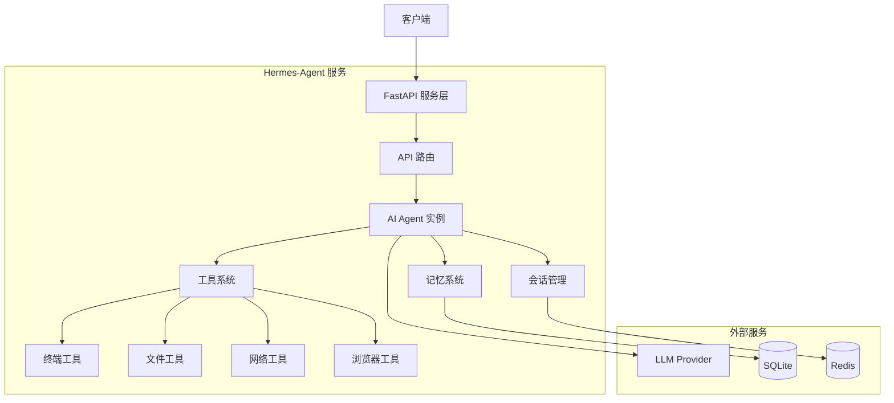

# Hermes-Agent FastAPI 部署指南

> 将 Hermes-Agent AI Agent 部分通过 FastAPI 部署到服务端，提供 RESTful API 接口

**整理日期**: 2026-04-28  
**版本**: 1.0  
**适用版本**: Hermes-Agent v2.0+

---

## 📋 目录

1. [项目架构概览](#1-项目架构概览)
2. [核心组件分析](#2-核心组件分析)
3. [FastAPI 服务设计](#3-fastapi-服务设计)
4. [完整实现代码](#4-完整实现代码)
5. [部署方案](#5-部署方案)
6. [Docker 容器化](#6-docker-容器化)
7. [生产环境配置](#7-生产环境配置)
8. [API 使用示例](#8-api-使用示例)
9. [性能优化](#9-性能优化)
10. [监控与日志](#10-监控与日志)
11. [故障排查](#11-故障排查)

---

## 1. 项目架构概览

### 1.1 整体架构图



### 1.2 核心文件结构

```
hermes-agent/
├── run_agent.py              # AIAgent 核心类
├── model_tools.py            # 工具编排系统
├── tools/
│   ├── registry.py          # 工具注册表
│   ├── terminal_tool.py     # 终端工具
│   ├── file_tools.py        # 文件工具
│   ├── web_tools.py         # 网络工具
│   └── browser_tool.py      # 浏览器工具
├── agent/
│   ├── memory_manager.py    # 记忆管理
│   ├── context_compressor.py # 上下文压缩
│   └── prompt_builder.py    # 提示词构建
├── hermes_state.py          # 会话状态存储
├── fastapi_server/          # FastAPI 服务（新建）
│   ├── main.py             # 主服务入口
│   ├── routes/             # API 路由
│   ├── models/             # 数据模型
│   ├── services/           # 业务服务
│   └── config.py           # 配置管理
└── requirements.txt         # 依赖包
```

---

## 2. 核心组件分析

### 2.1 AIAgent 类核心接口

**位置**: `run_agent.py#L492`

**关键方法**:

```python
class AIAgent:
    def __init__(
        self,
        model: str = "anthropic/claude-opus-4.6",
        max_iterations: int = 90,
        enabled_toolsets: List[str] = None,
        disabled_toolsets: List[str] = None,
        quiet_mode: bool = False,
        save_trajectories: bool = False,
        platform: str = None,
        session_id: str = None,
        # ... 更多参数
    ):
        """初始化 AI Agent"""
        
    def chat(self, message: str, stream_callback: Optional[callable] = None) -> str:
        """简单对话接口 - 返回最终响应"""
        
    def run_conversation(
        self,
        user_message: str,
        system_message: str = None,
        conversation_history: list = None,
        task_id: str = None,
        stream_callback: callable = None,
    ) -> dict:
        """完整对话循环 - 返回详细结果"""
```

### 2.2 工具系统架构

**位置**: `model_tools.py`

```python
# 工具定义和调用
from model_tools import (
    get_tool_definitions,      # 获取工具 schema
    handle_function_call,      # 执行工具调用
    check_toolset_requirements, # 检查工具依赖
)

# 工具注册表
from tools.registry import registry

# 可用工具集
- terminal: 终端命令执行
- file: 文件读写
- web: 网络搜索
- browser: 浏览器自动化
- memory: 记忆管理
- session_search: 会话搜索
- skill_manage: 技能管理
```

### 2.3 会话管理

**位置**: `hermes_state.py`

```python
class SessionDB:
    """SQLite 会话存储"""
    
    def create_session(self, session_id: str, **kwargs) -> Session:
        """创建新会话"""
        
    def append_message(self, session_id: str, **kwargs):
        """追加消息到会话"""
        
    def get_session(self, session_id: str) -> Session:
        """获取会话详情"""
```

---

## 3. FastAPI 服务设计

### 3.1 API 路由设计

| 端点 | 方法 | 说明 |
|------|------|------|
| `/api/v1/chat` | POST | 简单对话 |
| `/api/v1/chat/stream` | POST | 流式对话 |
| `/api/v1/conversation` | POST | 完整对话循环 |
| `/api/v1/sessions/{id}` | GET | 获取会话详情 |
| `/api/v1/sessions` | GET | 列出所有会话 |
| `/api/v1/tools` | GET | 列出可用工具 |
| `/api/v1/health` | GET | 健康检查 |

### 3.2 数据模型

```python
from pydantic import BaseModel, Field
from typing import List, Dict, Any, Optional

class ChatRequest(BaseModel):
    """对话请求"""
    message: str = Field(..., description="用户消息", min_length=1)
    system_message: Optional[str] = Field(None, description="自定义系统消息")
    session_id: Optional[str] = Field(None, description="会话 ID")
    model: Optional[str] = Field("anthropic/claude-opus-4.6", description="模型名称")
    max_iterations: int = Field(90, ge=1, le=200, description="最大迭代次数")
    stream: bool = Field(False, description="是否流式响应")

class ChatResponse(BaseModel):
    """对话响应"""
    response: str
    session_id: str
    model: str
    iterations: int
    tool_calls: List[Dict[str, Any]]
    cost: Optional[float] = None

class StreamChunk(BaseModel):
    """流式响应块"""
    type: str  # "text", "tool_start", "tool_complete", "done"
    content: Optional[str] = None
    tool_name: Optional[str] = None
    tool_args: Optional[Dict[str, Any]] = None
    tool_result: Optional[str] = None
```

### 3.3 服务层设计

```python
class AgentService:
    """Agent 业务服务"""
    
    def __init__(self, config: dict):
        self.config = config
        self.sessions = {}  # 会话缓存
        self.agents = {}    # Agent 实例缓存
    
    def create_agent(self, session_id: str, **kwargs) -> AIAgent:
        """创建 Agent 实例"""
        
    async def chat(self, request: ChatRequest) -> ChatResponse:
        """处理对话请求"""
        
    async def stream_chat(self, request: ChatRequest):
        """流式对话"""
        async for chunk in self._generate_chunks(request):
            yield chunk
```

---

## 4. 完整实现代码

### 4.1 项目结构

```bash
mkdir -p fastapi_server/{routes,services,models,middleware}
touch fastapi_server/{main.py,config.py,dependencies.py}
touch fastapi_server/routes/{chat.py,sessions.py,tools.py,health.py}
touch fastapi_server/services/{agent_service.py,session_service.py}
touch fastapi_server/models/{request.py,response.py}
```

### 4.2 配置文件 `fastapi_server/config.py`

```python
#!/usr/bin/env python3
"""
FastAPI 服务配置
"""

from pydantic_settings import BaseSettings
from typing import List, Optional
import os


class Settings(BaseSettings):
    """服务配置"""
    
    # 服务配置
    app_name: str = "Hermes-Agent API"
    app_version: str = "1.0.0"
    debug: bool = False
    host: str = "0.0.0.0"
    port: int = 8000
    
    # Agent 配置
    default_model: str = "anthropic/claude-opus-4.6"
    max_iterations: int = 90
    tool_delay: float = 1.0
    save_trajectories: bool = False
    
    # 会话管理
    session_timeout: int = 3600  # 1 小时
    max_sessions_per_user: int = 10
    
    # 资源限制
    max_concurrent_agents: int = 10
    max_request_timeout: int = 300  # 5 分钟
    
    # API Key 认证
    api_keys: List[str] = []
    api_key_header: str = "X-API-Key"
    
    # CORS
    cors_origins: List[str] = ["*"]
    
    # 日志
    log_level: str = "INFO"
    log_file: Optional[str] = None
    
    # Redis（可选，用于分布式会话存储）
    redis_url: Optional[str] = None
    
    # 监控
    enable_metrics: bool = True
    prometheus_port: int = 9090
    
    class Config:
        env_file = ".env"
        env_file_encoding = "utf-8"


# 全局配置实例
settings = Settings()


def get_config() -> Settings:
    """获取配置对象"""
    return settings
```

### 4.3 数据模型 `fastapi_server/models/request.py`

```python
#!/usr/bin/env python3
"""
请求数据模型
"""

from pydantic import BaseModel, Field
from typing import List, Dict, Any, Optional


class ChatRequest(BaseModel):
    """对话请求"""
    
    message: str = Field(
        ...,
        description="用户消息",
        min_length=1,
        max_length=10000,
        example="Tell me about Python 3.13 new features"
    )
    
    system_message: Optional[str] = Field(
        None,
        description="自定义系统消息",
        max_length=5000
    )
    
    session_id: Optional[str] = Field(
        None,
        description="会话 ID（不传则自动生成）",
        example="session_123456"
    )
    
    model: Optional[str] = Field(
        "anthropic/claude-opus-4.6",
        description="模型名称",
        example="anthropic/claude-opus-4.6"
    )
    
    max_iterations: int = Field(
        90,
        ge=1,
        le=200,
        description="最大工具调用次数"
    )
    
    enabled_toolsets: Optional[List[str]] = Field(
        None,
        description="启用的工具集",
        example=["terminal", "file", "web"]
    )
    
    disabled_toolsets: Optional[List[str]] = Field(
        None,
        description="禁用的工具集",
        example=["browser"]
    )
    
    stream: bool = Field(
        False,
        description="是否流式响应"
    )
    
    class Config:
        schema_extra = {
            "example": {
                "message": "Create a Python script that prints Hello World",
                "model": "anthropic/claude-opus-4.6",
                "max_iterations": 50,
                "stream": False
            }
        }


class StreamChunk(BaseModel):
    """流式响应块"""
    
    type: str = Field(
        ...,
        description="块类型",
        enum=["text", "tool_start", "tool_complete", "thinking", "done", "error"]
    )
    
    content: Optional[str] = Field(
        None,
        description="文本内容"
    )
    
    tool_name: Optional[str] = Field(
        None,
        description="工具名称"
    )
    
    tool_args: Optional[Dict[str, Any]] = Field(
        None,
        description="工具参数"
    )
    
    tool_result: Optional[str] = Field(
        None,
        description="工具执行结果"
    )
    
    session_id: Optional[str] = Field(
        None,
        description="会话 ID"
    )
    
    error: Optional[str] = Field(
        None,
        description="错误信息"
    )
```

### 4.4 响应模型 `fastapi_server/models/response.py`

```python
#!/usr/bin/env python3
"""
响应数据模型
"""

from pydantic import BaseModel, Field
from typing import List, Dict, Any, Optional
from datetime import datetime


class ToolCallInfo(BaseModel):
    """工具调用信息"""
    
    name: str
    args: Dict[str, Any]
    result: Optional[str] = None
    success: bool = True
    error: Optional[str] = None
    duration: Optional[float] = None


class ChatResponse(BaseModel):
    """对话响应"""
    
    response: str = Field(
        ...,
        description="AI 响应内容"
    )
    
    session_id: str = Field(
        ...,
        description="会话 ID"
    )
    
    model: str = Field(
        ...,
        description="使用的模型"
    )
    
    iterations: int = Field(
        ...,
        description="API 调用次数"
    )
    
    tool_calls: List[ToolCallInfo] = Field(
        default_factory=list,
        description="工具调用列表"
    )
    
    cost: Optional[float] = Field(
        None,
        description="估算成本（USD）"
    )
    
    duration: float = Field(
        ...,
        description="总耗时（秒）"
    )
    
    created_at: datetime = Field(
        default_factory=datetime.utcnow,
        description="创建时间"
    )
    
    class Config:
        schema_extra = {
            "example": {
                "response": "I've created the Python script...",
                "session_id": "session_abc123",
                "model": "anthropic/claude-opus-4.6",
                "iterations": 3,
                "tool_calls": [
                    {
                        "name": "write_file",
                        "args": {"path": "hello.py", "content": "..."},
                        "result": "File created",
                        "success": True,
                        "duration": 0.5
                    }
                ],
                "cost": 0.002,
                "duration": 5.2
            }
        }


class SessionInfo(BaseModel):
    """会话信息"""
    
    session_id: str
    created_at: datetime
    last_updated: datetime
    message_count: int
    model: str
    platform: str = "api"
    status: str = "active"


class HealthCheck(BaseModel):
    """健康检查响应"""
    
    status: str = "healthy"
    version: str
    agents_active: int
    sessions_count: int
    timestamp: datetime
```

### 4.5 Agent 服务 `fastapi_server/services/agent_service.py`

```python
#!/usr/bin/env python3
"""
Agent 业务服务
"""

import asyncio
import json
import logging
import uuid
from datetime import datetime
from typing import AsyncGenerator, Dict, List, Optional
import threading

from run_agent import AIAgent
from ..models.request import ChatRequest, StreamChunk
from ..models.response import ChatResponse, ToolCallInfo
from ..config import settings

logger = logging.getLogger(__name__)


class AgentService:
    """Agent 业务服务类"""
    
    def __init__(self):
        self.sessions: Dict[str, dict] = {}  # 会话信息缓存
        self.agents: Dict[str, AIAgent] = {}  # Agent 实例缓存
        self._lock = threading.Lock()
        self._active_count = 0
        self._max_concurrent = settings.max_concurrent_agents
        
    async def create_agent(self, request: ChatRequest) -> AIAgent:
        """创建 Agent 实例"""
        
        # 检查并发限制
        with self._lock:
            if self._active_count >= self._max_concurrent:
                raise RuntimeError(
                    f"Max concurrent agents ({self._max_concurrent}) reached"
                )
            self._active_count += 1
        
        # 生成或使用现有会话 ID
        session_id = request.session_id or f"session_{uuid.uuid4().hex}"
        
        # 回调函数：收集工具调用信息
        tool_calls = []
        
        def tool_start_callback(tool_name: str, args: dict):
            tool_calls.append({
                "name": tool_name,
                "args": args,
                "start_time": datetime.utcnow(),
            })
            logger.info(f"Tool started: {tool_name}")
        
        def tool_complete_callback(tool_name: str, result: str, success: bool):
            for tc in tool_calls:
                if tc["name"] == tool_name and "end_time" not in tc:
                    tc["result"] = result
                    tc["success"] = success
                    tc["end_time"] = datetime.utcnow()
                    tc["duration"] = (tc["end_time"] - tc["start_time"]).total_seconds()
                    break
            logger.info(f"Tool completed: {tool_name}, success={success}")
        
        # 创建 Agent 实例
        agent = AIAgent(
            model=request.model or settings.default_model,
            max_iterations=request.max_iterations,
            tool_delay=settings.tool_delay,
            enabled_toolsets=request.enabled_toolsets,
            disabled_toolsets=request.disabled_toolsets,
            save_trajectories=settings.save_trajectories,
            quiet_mode=True,  # 服务端模式使用安静模式
            platform="api",
            session_id=session_id,
            tool_start_callback=tool_start_callback,
            tool_complete_callback=tool_complete_callback,
        )
        
        # 缓存会话信息
        with self._lock:
            self.sessions[session_id] = {
                "session_id": session_id,
                "created_at": datetime.utcnow(),
                "last_updated": datetime.utcnow(),
                "message_count": 0,
                "model": request.model or settings.default_model,
                "status": "active",
            }
            self.agents[session_id] = agent
        
        return agent
    
    async def chat(self, request: ChatRequest) -> ChatResponse:
        """处理对话请求"""
        
        start_time = datetime.utcnow()
        
        # 创建 Agent
        agent = await self.create_agent(request)
        session_id = agent.session_id
        
        try:
            # 运行对话
            loop = asyncio.get_event_loop()
            result = await loop.run_in_executor(
                None,
                lambda: agent.run_conversation(
                    user_message=request.message,
                    system_message=request.system_message,
                )
            )
            
            # 收集工具调用信息
            tool_calls_info = []
            # 这里需要从 agent 内部获取工具调用信息
            # 实际实现中需要在 agent 中添加获取方法
            
            end_time = datetime.utcnow()
            duration = (end_time - start_time).total_seconds()
            
            # 更新会话
            with self._lock:
                if session_id in self.sessions:
                    self.sessions[session_id]["last_updated"] = end_time
                    self.sessions[session_id]["message_count"] += 1
            
            return ChatResponse(
                response=result.get("final_response", ""),
                session_id=session_id,
                model=agent.model,
                iterations=result.get("api_call_count", 0),
                tool_calls=tool_calls_info,
                duration=duration,
            )
            
        except Exception as e:
            logger.error(f"Chat failed: {e}", exc_info=True)
            raise
        finally:
            # 释放并发计数
            with self._lock:
                self._active_count -= 1
    
    async def stream_chat(
        self, request: ChatRequest
    ) -> AsyncGenerator[StreamChunk, None]:
        """流式对话"""
        
        session_id = request.session_id or f"session_{uuid.uuid4().hex}"
        
        # 创建 Agent（带流式回调）
        agent = await self.create_agent(request)
        
        # 流式回调队列
        queue = asyncio.Queue()
        
        def stream_callback(text: str):
            """流式文本回调"""
            asyncio.create_task(
                queue.put(StreamChunk(
                    type="text",
                    content=text,
                    session_id=session_id,
                ))
            )
        
        try:
            # 在后台线程中运行对话
            def run_conversation():
                try:
                    result = agent.run_conversation(
                        user_message=request.message,
                        system_message=request.system_message,
                        stream_callback=stream_callback,
                    )
                    # 发送完成信号
                    asyncio.create_task(
                        queue.put(StreamChunk(
                            type="done",
                            content=result.get("final_response", ""),
                            session_id=session_id,
                        ))
                    )
                except Exception as e:
                    asyncio.create_task(
                        queue.put(StreamChunk(
                            type="error",
                            error=str(e),
                            session_id=session_id,
                        ))
                    )
            
            loop = asyncio.get_event_loop()
            await loop.run_in_executor(None, run_conversation)
            
            # 流式输出
            while True:
                chunk = await queue.get()
                yield chunk
                if chunk.type == "done" or chunk.type == "error":
                    break
                    
        finally:
            with self._lock:
                self._active_count -= 1
    
    def get_session_info(self, session_id: str) -> Optional[dict]:
        """获取会话信息"""
        with self._lock:
            return self.sessions.get(session_id)
    
    def list_sessions(self) -> List[dict]:
        """列出所有会话"""
        with self._lock:
            return list(self.sessions.values())
    
    async def cleanup_session(self, session_id: str):
        """清理会话"""
        with self._lock:
            if session_id in self.agents:
                agent = self.agents[session_id]
                agent.close()  # 释放资源
                del self.agents[session_id]
            if session_id in self.sessions:
                del self.sessions[session_id]
        
        logger.info(f"Session cleaned up: {session_id}")


# 全局服务实例
agent_service = AgentService()


def get_agent_service() -> AgentService:
    """获取 Agent 服务实例（依赖注入）"""
    return agent_service
```

### 4.6 API 路由 `fastapi_server/routes/chat.py`

```python
#!/usr/bin/env python3
"""
对话 API 路由
"""

import json
import logging
from typing import AsyncGenerator
from fastapi import APIRouter, Depends, HTTPException, Request
from fastapi.responses import StreamingResponse
from sse_starlette.sse import EventSourceResponse

from ..models.request import ChatRequest
from ..models.response import ChatResponse, StreamChunk
from ..services.agent_service import AgentService, get_agent_service
from ..config import settings

logger = logging.getLogger(__name__)

router = APIRouter(prefix="/api/v1", tags=["chat"])


@router.post("/chat", response_model=ChatResponse)
async def chat(
    request: ChatRequest,
    service: AgentService = Depends(get_agent_service),
):
    """
    简单对话接口
    
    发送消息并等待完整响应返回。
    适用于不需要实时反馈的场景。
    """
    
    logger.info(f"Chat request: {request.message[:100]}...")
    
    try:
        response = await service.chat(request)
        logger.info(f"Chat completed in {response.duration:.2f}s")
        return response
    except RuntimeError as e:
        raise HTTPException(status_code=503, detail=str(e))
    except Exception as e:
        logger.error(f"Chat failed: {e}", exc_info=True)
        raise HTTPException(status_code=500, detail=f"Chat failed: {str(e)}")


@router.post("/chat/stream")
async def chat_stream(
    request: ChatRequest,
    service: AgentService = Depends(get_agent_service),
):
    """
    流式对话接口
    
    使用 Server-Sent Events (SSE) 实时返回响应块。
    适用于需要实时显示进度的场景。
    
    返回事件类型:
    - `text`: 文本内容块
    - `tool_start`: 工具开始执行
    - `tool_complete`: 工具执行完成
    - `thinking`: 思考内容
    - `done`: 对话完成
    - `error`: 错误信息
    """
    
    logger.info(f"Stream chat request: {request.message[:100]}...")
    
    async def generate() -> AsyncGenerator[dict, None]:
        try:
            async for chunk in service.stream_chat(request):
                yield {
                    "event": chunk.type,
                    "data": chunk.model_dump_json(),
                }
        except Exception as e:
            logger.error(f"Stream chat failed: {e}", exc_info=True)
            yield {
                "event": "error",
                "data": StreamChunk(
                    type="error",
                    error=str(e),
                ).model_dump_json(),
            }
    
    return EventSourceResponse(generate())


@router.post("/conversation")
async def conversation(
    request: ChatRequest,
    service: AgentService = Depends(get_agent_service),
):
    """
    完整对话循环接口
    
    与 /chat 类似，但返回更详细的信息，
    包括完整的消息历史、工具调用详情等。
    """
    
    logger.info(f"Conversation request: {request.message[:100]}...")
    
    try:
        response = await service.chat(request)
        return response
    except Exception as e:
        logger.error(f"Conversation failed: {e}", exc_info=True)
        raise HTTPException(status_code=500, detail=str(e))
```

### 4.7 会话路由 `fastapi_server/routes/sessions.py`

```python
#!/usr/bin/env python3
"""
会话管理 API 路由
"""

import logging
from fastapi import APIRouter, Depends, HTTPException, Path
from typing import List

from ..models.response import SessionInfo, HealthCheck
from ..services.agent_service import AgentService, get_agent_service
from ..config import settings

logger = logging.getLogger(__name__)

router = APIRouter(prefix="/api/v1/sessions", tags=["sessions"])


@router.get("", response_model=List[SessionInfo])
async def list_sessions(
    service: AgentService = Depends(get_agent_service),
):
    """列出所有活跃会话"""
    sessions = service.list_sessions()
    return sessions


@router.get("/{session_id}", response_model=SessionInfo)
async def get_session(
    session_id: str = Path(..., description="会话 ID"),
    service: AgentService = Depends(get_agent_service),
):
    """获取会话详情"""
    session = service.get_session_info(session_id)
    
    if not session:
        raise HTTPException(status_code=404, detail="Session not found")
    
    return session


@router.delete("/{session_id}")
async def delete_session(
    session_id: str = Path(..., description="会话 ID"),
    service: AgentService = Depends(get_agent_service),
):
    """删除会话并释放资源"""
    await service.cleanup_session(session_id)
    return {"status": "success", "message": f"Session {session_id} deleted"}
```

### 4.8 工具路由 `fastapi_server/routes/tools.py`

```python
#!/usr/bin/env python3
"""
工具管理 API 路由
"""

import logging
from fastapi import APIRouter
from typing import List, Dict, Any

from model_tools import get_tool_definitions

logger = logging.getLogger(__name__)

router = APIRouter(prefix="/api/v1/tools", tags=["tools"])


@router.get("", response_model=List[Dict[str, Any]])
async def list_tools():
    """列出所有可用工具"""
    tools = get_tool_definitions()
    return tools


@router.get("/toolsets")
async def list_toolsets():
    """列出所有工具集"""
    # 从工具定义中提取工具集信息
    tools = get_tool_definitions()
    toolsets = set()
    for tool in tools:
        if "toolset" in tool:
            toolsets.add(tool["toolset"])
    
    return {"toolsets": sorted(list(toolsets))}
```

### 4.9 健康检查路由 `fastapi_server/routes/health.py`

```python
#!/usr/bin/env python3
"""
健康检查 API 路由
"""

import logging
from datetime import datetime
from fastapi import APIRouter, Depends

from ..models.response import HealthCheck
from ..services.agent_service import AgentService, get_agent_service
from ..config import settings

logger = logging.getLogger(__name__)

router = APIRouter(prefix="/api/v1", tags=["health"])


@router.get("/health", response_model=HealthCheck)
async def health_check(
    service: AgentService = Depends(get_agent_service),
):
    """
    健康检查
    
    返回服务状态、活跃 Agent 数量、会话数量等信息。
    """
    
    sessions = service.list_sessions()
    
    return HealthCheck(
        status="healthy",
        version=settings.app_version,
        agents_active=service._active_count,
        sessions_count=len(sessions),
        timestamp=datetime.utcnow(),
    )
```

### 4.10 主服务入口 `fastapi_server/main.py`

```python
#!/usr/bin/env python3
"""
Hermes-Agent FastAPI 服务入口
"""

import logging
import sys
from pathlib import Path
from contextlib import asynccontextmanager

from fastapi import FastAPI, Request
from fastapi.middleware.cors import CORSMiddleware
from fastapi.responses import JSONResponse
from fastapi.exceptions import RequestValidationError

# 添加项目根目录到路径
root_path = Path(__file__).parent.parent
sys.path.insert(0, str(root_path))

from .config import settings
from .routes import chat, sessions, tools, health

# 配置日志
logging.basicConfig(
    level=getattr(logging, settings.log_level.upper()),
    format="%(asctime)s - %(name)s - %(levelname)s - %(message)s",
    handlers=[
        logging.StreamHandler(sys.stdout),
        logging.FileHandler(settings.log_file) if settings.log_file else logging.NullHandler(),
    ],
)

logger = logging.getLogger(__name__)


@asynccontextmanager
async def lifespan(app: FastAPI):
    """应用生命周期管理"""
    # 启动时执行
    logger.info(f"Starting {settings.app_name} v{settings.app_version}")
    logger.info(f"Debug mode: {settings.debug}")
    logger.info(f"Max concurrent agents: {settings.max_concurrent_agents}")
    
    yield
    
    # 关闭时执行
    logger.info("Shutting down application")


# 创建 FastAPI 应用
app = FastAPI(
    title=settings.app_name,
    version=settings.app_version,
    description="Hermes-Agent AI Agent REST API",
    docs_url="/docs",
    redoc_url="/redoc",
    lifespan=lifespan,
)

# CORS 中间件
app.add_middleware(
    CORSMiddleware,
    allow_origins=settings.cors_origins,
    allow_credentials=True,
    allow_methods=["*"],
    allow_headers=["*"],
)


# 全局异常处理
@app.exception_handler(RequestValidationError)
async def validation_exception_handler(request: Request, exc: RequestValidationError):
    logger.error(f"Validation error: {exc}")
    return JSONResponse(
        status_code=422,
        content={"detail": exc.errors()},
    )


@app.exception_handler(Exception)
async def general_exception_handler(request: Request, exc: Exception):
    logger.error(f"Unhandled exception: {exc}", exc_info=True)
    return JSONResponse(
        status_code=500,
        content={"detail": "Internal server error"},
    )


# 注册路由
app.include_router(chat.router)
app.include_router(sessions.router)
app.include_router(tools.router)
app.include_router(health.router)


# 根路径
@app.get("/")
async def root():
    """API 根路径"""
    return {
        "name": settings.app_name,
        "version": settings.app_version,
        "docs": "/docs",
        "health": "/api/v1/health",
    }


# 启动命令
if __name__ == "__main__":
    import uvicorn
    
    uvicorn.run(
        "fastapi_server.main:app",
        host=settings.host,
        port=settings.port,
        reload=settings.debug,
        log_level=settings.log_level.lower(),
    )
```

### 4.11 依赖包 `requirements.txt`

```txt
# FastAPI 框架
fastapi>=0.109.0
uvicorn[standard]>=0.27.0
python-multipart>=0.0.6

# 数据验证
pydantic>=2.5.0
pydantic-settings>=2.1.0

# SSE 流式响应
sse-starlette>=2.0.0

# HTTP 客户端（可选）
httpx>=0.26.0
aiohttp>=3.9.0

# 缓存（可选）
redis>=5.0.0

# 监控（可选）
prometheus-client>=0.19.0

# 测试
pytest>=7.4.0
pytest-asyncio>=0.23.0
pytest-cov>=4.1.0

# 开发
black>=23.12.0
ruff>=0.1.0
```

---

## 5. 部署方案

### 5.1 本地开发部署

```bash
# 1. 安装依赖
pip install -r requirements.txt

# 2. 配置环境变量
cp .env.example .env
# 编辑 .env 文件，设置 API Key 等配置

# 3. 启动服务（开发模式）
cd fastapi_server
python main.py

# 或使用 uvicorn 直接启动
uvicorn fastapi_server.main:app --reload --host 0.0.0.0 --port 8000
```

### 5.2 生产环境部署（Gunicorn + Uvicorn）

```bash
# 1. 安装 Gunicorn
pip install gunicorn

# 2. 启动服务
gunicorn fastapi_server.main:app \
    --bind 0.0.0.0:8000 \
    --workers 4 \
    --worker-class uvicorn.workers.UvicornWorker \
    --timeout 300 \
    --keep-alive 5 \
    --access-logfile /var/log/hermes/access.log \
    --error-logfile /var/log/hermes/error.log \
    --log-level info
```

### 5.3 Systemd 服务部署

创建服务文件 `/etc/systemd/system/hermes-agent.service`:

```ini
[Unit]
Description=Hermes-Agent FastAPI Service
After=network.target

[Service]
Type=notify
User=hermes
Group=hermes
WorkingDirectory=/opt/hermes-agent
Environment="PATH=/opt/hermes-agent/venv/bin"
ExecStart=/opt/hermes-agent/venv/bin/gunicorn fastapi_server.main:app \
    --bind 0.0.0.0:8000 \
    --workers 4 \
    --worker-class uvicorn.workers.UvicornWorker \
    --timeout 300
Restart=always
RestartSec=10

# 资源限制
LimitNOFILE=65535
LimitNPROC=4096

# 安全设置
NoNewPrivileges=true
PrivateTmp=true

[Install]
WantedBy=multi-user.target
```

启动服务：

```bash
sudo systemctl daemon-reload
sudo systemctl enable hermes-agent
sudo systemctl start hermes-agent
sudo systemctl status hermes-agent
```

---

## 6. Docker 容器化

### 6.1 Dockerfile

```dockerfile
# 多阶段构建
FROM python:3.11-slim as builder

WORKDIR /app

# 安装构建依赖
RUN apt-get update && apt-get install -y --no-install-recommends \
    build-essential \
    && rm -rf /var/lib/apt/lists/*

# 复制依赖文件
COPY requirements.txt .

# 安装 Python 依赖
RUN pip install --no-cache-dir --user -r requirements.txt

# 运行时镜像
FROM python:3.11-slim

WORKDIR /app

# 创建非 root 用户
RUN useradd -m -u 1000 hermes

# 复制构建阶段的依赖
COPY --from=builder /root/.local /home/hermes/.local

# 复制应用代码
COPY --chown=hermes:hermes \
    run_agent.py \
    model_tools.py \
    hermes_state.py \
    hermes_constants.py \
    ./

COPY --chown=hermes:hermes tools/ tools/
COPY --chown=hermes:hermes agent/ agent/
COPY --chown=hermes:hermes hermes_cli/ hermes_cli/
COPY --chown=hermes:hermes fastapi_server/ fastapi_server/

# 复制配置文件
COPY .env.example .env
COPY requirements.txt .

# 设置环境变量
ENV PATH=/home/hermes/.local/bin:$PATH \
    PYTHONUNBUFFERED=1 \
    PYTHONDONTWRITEBYTECODE=1

# 切换到非 root 用户
USER hermes

# 暴露端口
EXPOSE 8000

# 健康检查
HEALTHCHECK --interval=30s --timeout=10s --start-period=5s --retries=3 \
    CMD python -c "import httpx; httpx.get('http://localhost:8000/api/v1/health')" || exit 1

# 启动命令
CMD ["python", "-m", "uvicorn", "fastapi_server.main:app", \
     "--host", "0.0.0.0", \
     "--port", "8000", \
     "--workers", "4"]
```

### 6.2 Docker Compose

创建 `docker-compose.yml`:

```yaml
version: '3.8'

services:
  hermes-agent:
    build:
      context: .
      dockerfile: Dockerfile
    container_name: hermes-agent
    ports:
      - "8000:8000"
    environment:
      - OPENROUTER_API_KEY=${OPENROUTER_API_KEY}
      - DASHSCOPE_API_KEY=${DASHSCOPE_API_KEY}
      - LOG_LEVEL=INFO
      - MAX_CONCURRENT_AGENTS=10
    volumes:
      - hermes-data:/home/hermes/.hermes
      - ./logs:/var/log/hermes
    restart: unless-stopped
    healthcheck:
      test: ["CMD", "python", "-c", "import httpx; httpx.get('http://localhost:8000/api/v1/health')"]
      interval: 30s
      timeout: 10s
      retries: 3
      start_period: 10s
    networks:
      - hermes-network

  # 可选：Redis 用于分布式会话存储
  redis:
    image: redis:7-alpine
    container_name: hermes-redis
    ports:
      - "6379:6379"
    volumes:
      - redis-data:/data
    restart: unless-stopped
    networks:
      - hermes-network

  # 可选：Nginx 反向代理
  nginx:
    image: nginx:alpine
    container_name: hermes-nginx
    ports:
      - "80:80"
      - "443:443"
    volumes:
      - ./nginx.conf:/etc/nginx/nginx.conf:ro
      - ./ssl:/etc/nginx/ssl:ro
    depends_on:
      - hermes-agent
    restart: unless-stopped
    networks:
      - hermes-network

volumes:
  hermes-data:
  redis-data:

networks:
  hermes-network:
    driver: bridge
```

### 6.3 Nginx 配置

创建 `nginx.conf`:

```nginx
events {
    worker_connections 1024;
}

http {
    upstream hermes_backend {
        server hermes-agent:8000;
        keepalive 32;
    }

    # 限流
    limit_req_zone $binary_remote_addr zone=api_limit:10m rate=10r/s;

    server {
        listen 80;
        server_name _;

        # 安全头
        add_header X-Frame-Options "SAMEORIGIN" always;
        add_header X-Content-Type-Options "nosniff" always;
        add_header X-XSS-Protection "1; mode=block" always;

        # API 限流
        location /api/ {
            limit_req zone=api_limit burst=20 nodelay;
            
            proxy_pass http://hermes_backend;
            proxy_set_header Host $host;
            proxy_set_header X-Real-IP $remote_addr;
            proxy_set_header X-Forwarded-For $proxy_add_x_forwarded_for;
            proxy_set_header X-Forwarded-Proto $scheme;
            
            # 超时设置
            proxy_connect_timeout 60s;
            proxy_send_timeout 300s;
            proxy_read_timeout 300s;
            
            # 缓冲设置
            proxy_buffering off;
            proxy_cache off;
        }

        # 静态文件（Swagger UI）
        location /docs {
            proxy_pass http://hermes_backend;
        }

        location /openapi.json {
            proxy_pass http://hermes_backend;
        }

        # 健康检查
        location /api/v1/health {
            proxy_pass http://hermes_backend;
            access_log off;
        }
    }
}
```

---

## 7. 生产环境配置

### 7.1 环境变量配置 `.env`

```bash
# 服务配置
APP_NAME=Hermes-Agent API
APP_VERSION=1.0.0
DEBUG=false
HOST=0.0.0.0
PORT=8000

# Agent 配置
DEFAULT_MODEL=anthropic/claude-opus-4.6
MAX_ITERATIONS=90
TOOL_DELAY=1.0
SAVE_TRAJECTORIES=false

# API Keys
OPENROUTER_API_KEY=sk-or-v1-xxxxxxxxxxxx
DASHSCOPE_API_KEY=sk-xxxxxxxxxxxx

# 会话管理
SESSION_TIMEOUT=3600
MAX_SESSIONS_PER_USER=10

# 资源限制
MAX_CONCURRENT_AGENTS=10
MAX_REQUEST_TIMEOUT=300

# API Key 认证（多个用逗号分隔）
API_KEYS=key1,key2,key3

# CORS
CORS_ORIGINS=https://yourdomain.com,https://api.yourdomain.com

# 日志
LOG_LEVEL=INFO
LOG_FILE=/var/log/hermes/agent.log

# Redis（可选）
REDIS_URL=redis://localhost:6379/0
```

### 7.2 性能调优

**Uvicorn 配置优化**:

```python
# 在 main.py 中
uvicorn.run(
    "fastapi_server.main:app",
    host="0.0.0.0",
    port=8000,
    workers=4,              # CPU 核心数
    loop="uvloop",          # 高性能事件循环
    http="httptools",       # 高性能 HTTP 解析
    ws="websockets",        # WebSocket 支持
    lifespan="on",
    access_log=True,
    log_level="info",
)
```

**Gunicorn 配置优化**:

```python
# gunicorn.conf.py
import multiprocessing

bind = "0.0.0.0:8000"
workers = multiprocessing.cpu_count() * 2 + 1
worker_class = "uvicorn.workers.UvicornWorker"
worker_connections = 1000
timeout = 300
keepalive = 5

# 进程管理
max_requests = 1000
max_requests_jitter = 50

# 日志
accesslog = "/var/log/hermes/access.log"
errorlog = "/var/log/hermes/error.log"
loglevel = "info"

# 性能
preload_app = True
```

启动：

```bash
gunicorn fastapi_server.main:app -c gunicorn.conf.py
```

### 7.3 安全配置

**API Key 认证中间件**:

```python
# fastapi_server/middleware/auth.py
from fastapi import Request, HTTPException, Depends
from fastapi.security import HTTPBearer, HTTPAuthorizationCredentials
from ..config import settings

security = HTTPBearer(auto_error=False)


async def api_key_auth(
    request: Request,
    credentials: HTTPAuthorizationCredentials = Depends(security),
):
    """API Key 认证"""
    
    if not credentials:
        # 尝试从 header 获取
        api_key = request.headers.get(settings.api_key_header)
        if not api_key:
            raise HTTPException(
                status_code=401,
                detail="Missing API key",
            )
    else:
        api_key = credentials.credentials
    
    # 验证 API Key
    if api_key not in settings.api_keys:
        raise HTTPException(
            status_code=401,
            detail="Invalid API key",
        )
    
    return api_key
```

**速率限制**:

```python
# fastapi_server/middleware/rate_limit.py
from fastapi import Request, HTTPException
from fastapi.responses import JSONResponse
from slowapi import Limiter, _rate_limit_exceeded_handler
from slowapi.util import get_remote_address
from slowapi.errors import RateLimitExceeded
from ..config import settings

# 创建限流器
limiter = Limiter(key_func=get_remote_address)


async def rate_limit_handler(request: Request, exc: RateLimitExceeded):
    """限流超过时的处理"""
    return JSONResponse(
        status_code=429,
        content={
            "detail": "Rate limit exceeded",
            "retry_after": str(exc.headers.get("Retry-After", 60)),
        },
    )
```

在 `main.py` 中使用：

```python
from .middleware.auth import api_key_auth
from .middleware.rate_limit import limiter, rate_limit_handler

app = FastAPI(...)
app.state.limiter = limiter
app.add_exception_handler(RateLimitExceeded, rate_limit_handler)

# 在路由中使用
@router.post("/chat", dependencies=[Depends(api_key_auth)])
async def chat(...):
    ...
```

---

## 8. API 使用示例

### 8.1 简单对话

```bash
# 发送 POST 请求
curl -X POST http://localhost:8000/api/v1/chat \
    -H "Content-Type: application/json" \
    -H "X-API-Key: your-api-key" \
    -d '{
        "message": "Create a Python script that prints Hello World",
        "model": "anthropic/claude-opus-4.6",
        "max_iterations": 50
    }'
```

**响应**:

```json
{
    "response": "I've created the Python script for you.",
    "session_id": "session_abc123",
    "model": "anthropic/claude-opus-4.6",
    "iterations": 2,
    "tool_calls": [
        {
            "name": "write_file",
            "args": {"path": "hello.py", "content": "print('Hello World')"},
            "result": "File created",
            "success": true,
            "duration": 0.5
        }
    ],
    "cost": 0.002,
    "duration": 5.2
}
```

### 8.2 流式对话

```bash
# SSE 流式请求
curl -X POST http://localhost:8000/api/v1/chat/stream \
    -H "Content-Type: application/json" \
    -H "X-API-Key: your-api-key" \
    -d '{
        "message": "Tell me about Python 3.13",
        "stream": true
    }'
```

**响应流**:

```
event: text
data: {"type":"text","content":"Python","session_id":"..."}

event: text
data: {"type":"text","content":" 3.13","session_id":"..."}

event: tool_start
data: {"type":"tool_start","tool_name":"search_files",...}

event: tool_complete
data: {"type":"tool_complete","tool_name":"search_files",...}

event: done
data: {"type":"done","content":"Full response text",...}
```

### 8.3 Python 客户端

```python
#!/usr/bin/env python3
"""
Hermes-Agent API 客户端示例
"""

import httpx
import asyncio


class HermesClient:
    """Hermes-Agent API 客户端"""
    
    def __init__(self, base_url: str, api_key: str):
        self.base_url = base_url
        self.api_key = api_key
        self.headers = {"X-API-Key": api_key}
    
    async def chat(self, message: str, **kwargs) -> dict:
        """发送对话请求"""
        async with httpx.AsyncClient() as client:
            response = await client.post(
                f"{self.base_url}/api/v1/chat",
                headers=self.headers,
                json={"message": message, **kwargs},
            )
            response.raise_for_status()
            return response.json()
    
    async def chat_stream(self, message: str, **kwargs):
        """流式对话"""
        async with httpx.AsyncClient() as client:
            async with client.stream(
                "POST",
                f"{self.base_url}/api/v1/chat/stream",
                headers=self.headers,
                json={"message": message, **kwargs},
            ) as response:
                async for line in response.aiter_lines():
                    if line.startswith("data: "):
                        yield line[6:]
    
    async def get_session(self, session_id: str) -> dict:
        """获取会话信息"""
        async with httpx.AsyncClient() as client:
            response = await client.get(
                f"{self.base_url}/api/v1/sessions/{session_id}",
                headers=self.headers,
            )
            response.raise_for_status()
            return response.json()


# 使用示例
async def main():
    client = HermesClient(
        base_url="http://localhost:8000",
        api_key="your-api-key",
    )
    
    # 简单对话
    response = await client.chat(
        "Create a Python script that calculates factorial",
        max_iterations=50,
    )
    print(f"Response: {response['response']}")
    print(f"Tool calls: {len(response['tool_calls'])}")
    
    # 流式对话
    async for chunk in client.chat_stream("Tell me a joke"):
        print(chunk, end="", flush=True)


if __name__ == "__main__":
    asyncio.run(main())
```

### 8.4 JavaScript 客户端

```javascript
// Hermes-Agent API 客户端（JavaScript）

class HermesClient {
    constructor(baseURL, apiKey) {
        this.baseURL = baseURL;
        this.apiKey = apiKey;
        this.headers = {
            'Content-Type': 'application/json',
            'X-API-Key': apiKey,
        };
    }

    async chat(message, options = {}) {
        const response = await fetch(`${this.baseURL}/api/v1/chat`, {
            method: 'POST',
            headers: this.headers,
            body: JSON.stringify({
                message,
                ...options,
            }),
        });

        if (!response.ok) {
            throw new Error(`HTTP error! status: ${response.status}`);
        }

        return await response.json();
    }

    async *chatStream(message, options = {}) {
        const response = await fetch(`${this.baseURL}/api/v1/chat/stream`, {
            method: 'POST',
            headers: this.headers,
            body: JSON.stringify({
                message,
                ...options,
            }),
        });

        const reader = response.body.getReader();
        const decoder = new TextDecoder();

        while (true) {
            const { done, value } = await reader.read();
            if (done) break;

            const chunk = decoder.decode(value);
            const lines = chunk.split('\n');

            for (const line of lines) {
                if (line.startsWith('data: ')) {
                    const data = JSON.parse(line.slice(6));
                    yield data;
                }
            }
        }
    }
}

// 使用示例
async function main() {
    const client = new HermesClient(
        'http://localhost:8000',
        'your-api-key'
    );

    // 简单对话
    const response = await client.chat(
        'Create a Python script',
        { max_iterations: 50 }
    );
    console.log('Response:', response.response);

    // 流式对话
    for await (const chunk of client.chatStream('Tell me a story')) {
        console.log('Chunk:', chunk);
    }
}

main();
```

---

## 9. 性能优化

### 9.1 并发控制

```python
# 使用信号量控制并发
import asyncio

class AgentService:
    def __init__(self):
        self.semaphore = asyncio.Semaphore(settings.max_concurrent_agents)
    
    async def chat(self, request: ChatRequest):
        async with self.semaphore:
            # 处理请求
            pass
```

### 9.2 连接池

```python
# HTTP 连接池
import httpx

client = httpx.AsyncClient(
    limits=httpx.Limits(
        max_keepalive_connections=20,
        max_connections=100,
    ),
    timeout=httpx.Timeout(30.0),
)
```

### 9.3 缓存策略

```python
# 使用 Redis 缓存
from redis import asyncio as aioredis

class CacheService:
    def __init__(self, redis_url: str):
        self.redis = aioredis.from_url(redis_url)
    
    async def get(self, key: str):
        return await self.redis.get(key)
    
    async def set(self, key: str, value: str, ttl: int = 3600):
        await self.redis.setex(key, ttl, value)
```

### 9.4 数据库优化

```python
# SQLite 优化配置
import sqlite3

conn = sqlite3.connect('hermes.db')
conn.execute('PRAGMA journal_mode=WAL')
conn.execute('PRAGMA synchronous=NORMAL')
conn.execute('PRAGMA cache_size=10000')
conn.execute('PRAGMA temp_store=MEMORY')
```

---

## 10. 监控与日志

### 10.1 Prometheus 监控

```python
# fastapi_server/middleware/metrics.py
from prometheus_client import Counter, Histogram, generate_latest
from fastapi import Request
from fastapi.responses import PlainTextResponse
import time

# 指标定义
REQUEST_COUNT = Counter(
    'http_requests_total',
    'Total HTTP requests',
    ['method', 'endpoint', 'status']
)

REQUEST_DURATION = Histogram(
    'http_request_duration_seconds',
    'HTTP request duration in seconds',
    ['method', 'endpoint'],
)

AGENT_ACTIVE = Counter(
    'agent_active_total',
    'Active agents count'
)

# 中间件
async def metrics_middleware(request: Request, call_next):
    start_time = time.time()
    
    response = await call_next(request)
    
    duration = time.time() - start_time
    
    REQUEST_COUNT.labels(
        method=request.method,
        endpoint=request.url.path,
        status=response.status_code,
    ).inc()
    
    REQUEST_DURATION.labels(
        method=request.method,
        endpoint=request.url.path,
    ).observe(duration)
    
    return response

# 指标端点
@app.get("/metrics")
async def metrics():
    return PlainTextResponse(generate_latest())
```

### 10.2 结构化日志

```python
# 使用 JSON 格式日志
import logging
import json
from pythonjsonlogger import jsonlogger

logger = logging.getLogger(__name__)

# 自定义格式化器
class CustomJsonFormatter(jsonlogger.JsonFormatter):
    def add_fields(self, log_record, record, message_dict):
        super(CustomJsonFormatter, self).add_fields(log_record, record, message_dict)
        log_record['level'] = record.levelname
        log_record['logger'] = record.name

# 配置
handler = logging.StreamHandler()
handler.setFormatter(CustomJsonFormatter(
    '%(asctime)s %(name)s %(levelname)s %(message)s'
))
logger.addHandler(handler)
logger.setLevel(logging.INFO)
```

### 10.3 健康检查仪表板

创建 `monitoring/grafana-dashboard.json`:

```json
{
  "dashboard": {
    "title": "Hermes-Agent Monitoring",
    "panels": [
      {
        "title": "Request Rate",
        "type": "graph",
        "targets": [
          {
            "expr": "rate(http_requests_total[5m])",
            "legendFormat": "{{method}} {{endpoint}}"
          }
        ]
      },
      {
        "title": "Response Time",
        "type": "graph",
        "targets": [
          {
            "expr": "histogram_quantile(0.95, rate(http_request_duration_seconds_bucket[5m]))",
            "legendFormat": "P95"
          }
        ]
      },
      {
        "title": "Active Agents",
        "type": "gauge",
        "targets": [
          {
            "expr": "agent_active_total",
            "legendFormat": "Active"
          }
        ]
      }
    ]
  }
}
```

---

## 11. 故障排查

### 11.1 常见问题

**问题 1: API Key 认证失败**

```bash
# 检查 API Key 配置
grep API_KEYS .env

# 测试认证
curl -X GET http://localhost:8000/api/v1/health \
    -H "X-API-Key: invalid-key"
```

**问题 2: 并发限制触发**

```bash
# 查看当前活跃连接
curl http://localhost:8000/api/v1/health

# 调整并发限制
# 编辑 .env: MAX_CONCURRENT_AGENTS=20
```

**问题 3: 超时错误**

```bash
# 增加超时时间
# 编辑 .env: MAX_REQUEST_TIMEOUT=600

# 检查 Gunicorn 配置
grep timeout gunicorn.conf.py
```

### 11.2 日志分析

```bash
# 查看错误日志
tail -f /var/log/hermes/error.log

# 搜索特定错误
grep "ERROR" /var/log/hermes/error.log | tail -20

# 分析访问日志
awk '{print $1}' /var/log/hermes/access.log | sort | uniq -c | sort -rn | head -10
```

### 11.3 性能分析

```bash
# 使用 py-spy 进行性能分析
py-spy record -o profile.svg -- python -m uvicorn fastapi_server.main:app

# 查看慢查询
grep "duration.*[5-9]\.[0-9]" /var/log/hermes/access.log
```

---

## 📝 总结

### 关键要点

1. **核心架构**: AIAgent 类 + 工具系统 + 会话管理
2. **API 设计**: RESTful + SSE 流式响应
3. **部署方案**: 本地开发 → Docker → 生产环境
4. **性能优化**: 并发控制 + 连接池 + 缓存
5. **监控日志**: Prometheus + 结构化日志

### 下一步

- [ ] 实现 API Key 认证
- [ ] 配置 Docker 容器化
- [ ] 设置监控告警
- [ ] 性能压力测试
- [ ] 编写集成测试

---

**文档版本**: 1.0  
**最后更新**: 2026-04-28  
**维护者**: Hermes-Agent Team