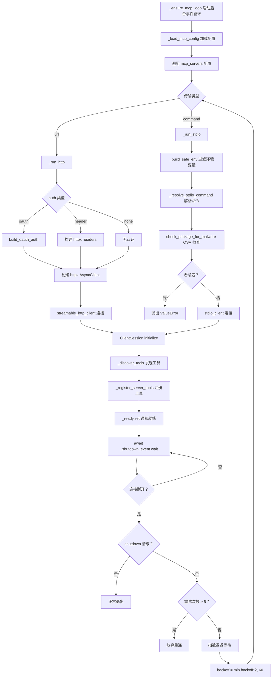
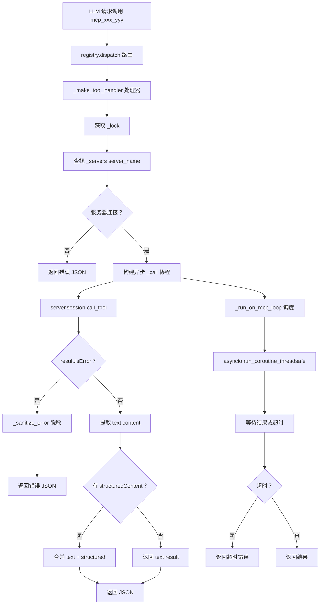
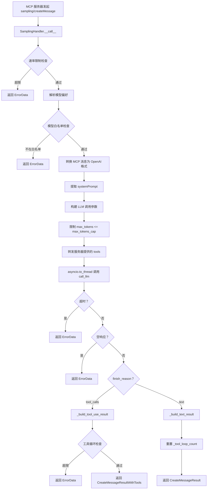
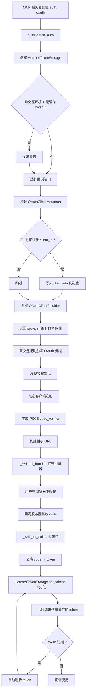
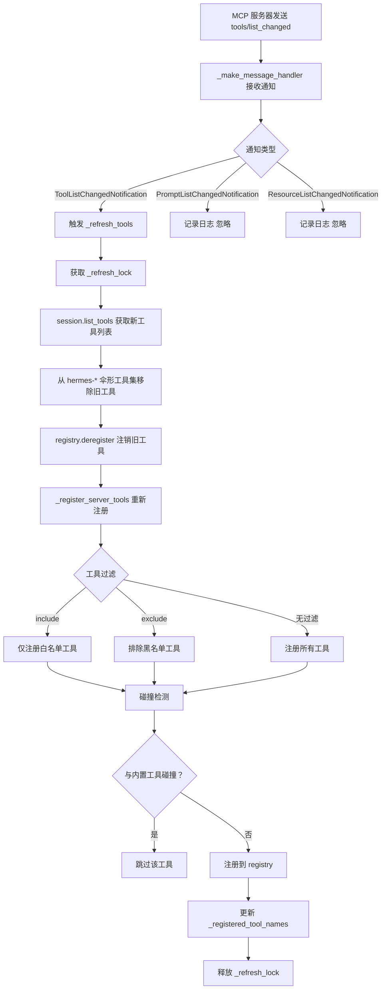

# MCP 协议安全调度系统架构分析

## 1. 概述

Hermes Agent 实现了一套完整的 **MCP (Model Context Protocol)** 安全调度系统，涵盖客户端连接、服务端暴露、OAuth 认证、Sampling 安全、工具注册调度等多个维度。系统采用**双角色架构**（既作 MCP Client 又作 MCP Server），通过多层安全机制确保外部 MCP 服务器的安全接入和内部能力的安全暴露。

### 1.1 核心设计目标

| 目标 | 实现策略 |
|-----|---------|
| **安全接入** | 环境变量过滤、凭证脱敏、恶意包检测 |
| **安全暴露** | ACP 权限桥接、OAuth 2.1 PKCE 认证 |
| **安全采样** | 速率限制、模型白名单、工具循环治理 |
| **弹性连接** | 指数退避重连、双传输层支持 |
| **动态发现** | tools/list_changed 通知、热刷新 |
| **细粒度控制** | 工具 include/exclude 过滤、资源/提示开关 |

### 1.2 系统角色

```
┌─────────────────────────────────────────────────────────┐
│              Hermes Agent 双角色架构                     │
├─────────────────────────────────────────────────────────┤
│                                                         │
│  角色 1: MCP Client（消费外部 MCP 服务器）              │
│  ┌─────────────────────────────────────────────────┐    │
│  │ tools/mcp_tool.py                              │    │
│  │ • 连接外部 MCP 服务器（stdio/HTTP）             │    │
│  │ • 发现并注册远程工具到本地 registry             │    │
│  │ • 调度工具调用到远程服务器                      │    │
│  │ • 处理 Sampling 请求（服务器发起的 LLM 调用）    │    │
│  │ • OAuth 2.1 PKCE 认证                          │    │
│  └─────────────────────────────────────────────────┘    │
│                                                         │
│  角色 2: MCP Server（向外部暴露 Hermes 能力）           │
│  ┌─────────────────────────────────────────────────┐    │
│  │ mcp_serve.py                                   │    │
│  │ • 暴露消息通道为 MCP 工具                       │    │
│  │ • 9 个标准工具 + 1 个 Hermes 扩展              │    │
│  │ • EventBridge 轮询 SessionDB                   │    │
│  │ • 权限审批桥接                                 │    │
│  └─────────────────────────────────────────────────┘    │
│                                                         │
│  角色 3: ACP Adapter（VS Code / Zed / JetBrains 集成）  │
│  ┌─────────────────────────────────────────────────┐    │
│  │ acp_adapter/                                   │    │
│  │ • ACP 协议适配                                 │    │
│  │ • 权限审批桥接                                 │    │
│  │ • Provider 检测                                │    │
│  └─────────────────────────────────────────────────┘    │
│                                                         │
└─────────────────────────────────────────────────────────┘
```

---

## 2. 架构设计

### 2.1 分层架构

```
┌─────────────────────────────────────────────────────────┐
│              第 1 层：配置管理层                         │
│  ┌─────────────────────────────────────────────────┐    │
│  │ hermes_cli/mcp_config.py                       │    │
│  │ • hermes mcp add/remove/list/test/configure    │    │
│  │ • 服务器配置 CRUD                              │    │
│  │ • 发现优先的工具选择                           │    │
│  │ • OAuth 流程引导                               │    │
│  │ • 预设模板                                     │    │
│  └─────────────────────────────────────────────────┘    │
└─────────────────────────────────────────────────────────┘
                        ↓
┌─────────────────────────────────────────────────────────┐
│              第 2 层：连接管理层                         │
│  ┌─────────────────────────────────────────────────┐    │
│  │ MCPServerTask (tools/mcp_tool.py)              │    │
│  │ • stdio 传输（子进程管理）                      │    │
│  │ • HTTP/StreamableHTTP 传输                     │    │
│  │ • 指数退避重连（最多 5 次）                     │    │
│  │ • 生命周期管理（start/run/shutdown）            │    │
│  │ • 动态工具发现（notifications）                 │    │
│  └─────────────────────────────────────────────────┘    │
└─────────────────────────────────────────────────────────┘
                        ↓
┌─────────────────────────────────────────────────────────┐
│              第 3 层：安全防护层                         │
│  ┌─────────────────────────────────────────────────┐    │
│  │ 环境变量过滤 + 凭证脱敏 + 恶意包检测           │    │
│  │ • _build_safe_env() — 白名单环境变量            │    │
│  │ • _sanitize_error() — 凭证模式替换              │    │
│  │ • OSV 恶意包检查                               │    │
│  │ • OAuth 2.1 PKCE 认证                          │    │
│  │ • SamplingHandler — 速率/模型/循环限制          │    │
│  └─────────────────────────────────────────────────┘    │
└─────────────────────────────────────────────────────────┘
                        ↓
┌─────────────────────────────────────────────────────────┐
│              第 4 层：工具注册层                         │
│  ┌─────────────────────────────────────────────────┐    │
│  │ _register_server_tools()                       │    │
│  │ • 工具名前缀 mcp_{server}_{tool}               │    │
│  │ • include/exclude 过滤                          │    │
│  │ • 内置工具碰撞保护                             │    │
│  │ • 资源/提示工具注册                             │    │
│  │ • 工具集同步（TOOLSETS）                        │    │
│  └─────────────────────────────────────────────────┘    │
└─────────────────────────────────────────────────────────┘
                        ↓
┌─────────────────────────────────────────────────────────┐
│              第 5 层：调度执行层                         │
│  ┌─────────────────────────────────────────────────┐    │
│  │ _make_tool_handler()                           │    │
│  │ • 同步→异步桥接                                │    │
│  │ • 超时控制                                     │    │
│  │ • 错误处理 + 凭证脱敏                          │    │
│  │ • structuredContent 合并                        │    │
│  │ • 线程安全（_lock 保护）                        │    │
│  └─────────────────────────────────────────────────┘    │
└─────────────────────────────────────────────────────────┘
```

### 2.2 核心设计原则

1. **纵深防御（Defense in Depth）**: 环境过滤 → 凭证脱敏 → 恶意包检测 → 速率限制
2. **最小权限（Least Privilege）**: 白名单环境变量、模型白名单、工具过滤
3. **失效安全（Fail-Safe）**: 连接失败不阻塞其他服务器、超时自动拒绝
4. **线程安全（Thread Safety）**: 全局锁保护共享状态、专用事件循环
5. **弹性设计（Resilience）**: 指数退避重连、优雅关闭、PID 跟踪清理

---

## 3. 核心实现

### 3.1 MCPServerTask — 连接管理

**文件位置**: [`tools/mcp_tool.py`](file:///home/meizu/Documents/my_agent_project/hermes-agent/tools/mcp_tool.py#L720-L1062)

#### 3.1.1 生命周期管理

```python
class MCPServerTask:
    """Manages a single MCP server connection in a dedicated asyncio Task.

    The entire connection lifecycle (connect, discover, serve, disconnect)
    runs inside one asyncio Task so that anyio cancel-scopes created by
    the transport client are entered and exited in the same Task context.
    """

    __slots__ = (
        "name", "session", "tool_timeout",
        "_task", "_ready", "_shutdown_event", "_tools", "_error", "_config",
        "_sampling", "_registered_tool_names", "_auth_type", "_refresh_lock",
    )

    def __init__(self, name: str):
        self.name = name
        self.session: Optional[Any] = None
        self.tool_timeout: float = _DEFAULT_TOOL_TIMEOUT
        self._task: Optional[asyncio.Task] = None
        self._ready = asyncio.Event()
        self._shutdown_event = asyncio.Event()
        self._tools: list = []
        self._error: Optional[Exception] = None
        self._config: dict = {}
        self._sampling: Optional[SamplingHandler] = None
        self._registered_tool_names: list[str] = []
        self._auth_type: str = ""
        self._refresh_lock = asyncio.Lock()
```

#### 3.1.2 指数退避重连

```python
async def run(self, config: dict):
    """Long-lived coroutine: connect, discover tools, wait, disconnect.

    Includes automatic reconnection with exponential backoff if the
    connection drops unexpectedly (unless shutdown was requested).
    """
    self._config = config
    self.tool_timeout = config.get("timeout", _DEFAULT_TOOL_TIMEOUT)
    self._auth_type = (config.get("auth") or "").lower().strip()

    # Set up sampling handler
    sampling_config = config.get("sampling", {})
    if sampling_config.get("enabled", True) and _MCP_SAMPLING_TYPES:
        self._sampling = SamplingHandler(self.name, sampling_config)
    else:
        self._sampling = None

    retries = 0
    backoff = 1.0

    while True:
        try:
            if self._is_http():
                await self._run_http(config)
            else:
                await self._run_stdio(config)
            break  # Normal exit (shutdown requested)
        except Exception as exc:
            self.session = None

            # First connection attempt — report error immediately
            if not self._ready.is_set():
                self._error = exc
                self._ready.set()
                return

            # Shutdown requested — don't reconnect
            if self._shutdown_event.is_set():
                return

            retries += 1
            if retries > _MAX_RECONNECT_RETRIES:  # 5
                logger.warning(
                    "MCP server '%s' failed after %d reconnection attempts",
                    self.name, _MAX_RECONNECT_RETRIES,
                )
                return

            logger.warning(
                "MCP server '%s' connection lost (attempt %d/%d), "
                "reconnecting in %.0fs",
                self.name, retries, _MAX_RECONNECT_RETRIES, backoff,
            )
            await asyncio.sleep(backoff)
            backoff = min(backoff * 2, _MAX_BACKOFF_SECONDS)  # 60s cap
```

#### 3.1.3 动态工具发现

```python
def _make_message_handler(self):
    """Build a message_handler callback for ClientSession.

    Dispatches on notification type. Only ToolListChangedNotification
    triggers a refresh; prompt and resource change notifications are
    logged as stubs for future work.
    """
    async def _handler(message):
        try:
            if isinstance(message, Exception):
                return
            if _MCP_NOTIFICATION_TYPES and isinstance(message, ServerNotification):
                match message.root:
                    case ToolListChangedNotification():
                        logger.info(
                            "MCP server '%s': received tools/list_changed notification",
                            self.name,
                        )
                        await self._refresh_tools()
                    case PromptListChangedNotification():
                        logger.debug("MCP server '%s': prompts/list_changed (ignored)", self.name)
                    case ResourceListChangedNotification():
                        logger.debug("MCP server '%s': resources/list_changed (ignored)", self.name)
        except Exception:
            logger.exception("Error in MCP message handler for '%s'", self.name)
    return _handler

async def _refresh_tools(self):
    """Re-fetch tools from the server and update the registry.

    The lock prevents overlapping refreshes from rapid-fire notifications.
    """
    from tools.registry import registry, tool_error
    from toolsets import TOOLSETS

    async with self._refresh_lock:
        # 1. Fetch current tool list from server
        tools_result = await self.session.list_tools()
        new_mcp_tools = tools_result.tools

        # 2. Remove old tools from hermes-* umbrella toolsets
        for ts_name, ts in TOOLSETS.items():
            if ts_name.startswith("hermes-"):
                ts["tools"] = [t for t in ts["tools"] if t not in self._registered_tool_names]

        # 3. Deregister old tools from the central registry
        for prefixed_name in self._registered_tool_names:
            registry.deregister(prefixed_name)

        # 4. Re-register with fresh tool list
        self._tools = new_mcp_tools
        self._registered_tool_names = _register_server_tools(
            self.name, self, self._config
        )
```

### 3.2 环境变量安全过滤

**文件位置**: [`tools/mcp_tool.py`](file:///home/meizu/Documents/my_agent_project/hermes-agent/tools/mcp_tool.py#L192-L208)

```python
_SAFE_ENV_KEYS = frozenset({
    "PATH", "HOME", "USER", "LANG", "LC_ALL", "TERM", "SHELL", "TMPDIR",
})

def _build_safe_env(user_env: Optional[dict]) -> dict:
    """Build a filtered environment dict for stdio subprocesses.

    Only passes through safe baseline variables (PATH, HOME, etc.) and XDG_*
    variables from the current process environment, plus any variables
    explicitly specified by the user in the server config.

    This prevents accidentally leaking secrets like API keys, tokens, or
    credentials to MCP server subprocesses.
    """
    env = {}
    for key, value in os.environ.items():
        if key in _SAFE_ENV_KEYS or key.startswith("XDG_"):
            env[key] = value
    if user_env:
        env.update(user_env)
    return env
```

**安全策略**:
- **白名单机制**: 仅传递 8 个安全环境变量 + XDG_* 前缀
- **显式注入**: 用户在 config 中指定的 `env` 字段覆盖白名单
- **防止泄露**: 阻断 API_KEY、TOKEN、SECRET 等敏感变量传递给子进程

### 3.3 凭证脱敏

**文件位置**: [`tools/mcp_tool.py`](file:///home/meizu/Documents/my_agent_project/hermes-agent/tools/mcp_tool.py#L173-L217)

```python
_CREDENTIAL_PATTERN = re.compile(
    r"(?:"
    r"ghp_[A-Za-z0-9_]{1,255}"           # GitHub PAT
    r"|sk-[A-Za-z0-9_]{1,255}"           # OpenAI-style key
    r"|Bearer\s+\S+"                      # Bearer token
    r"|token=[^\s&,;\"']{1,255}"         # token=...
    r"|key=[^\s&,;\"']{1,255}"           # key=...
    r"|API_KEY=[^\s&,;\"']{1,255}"       # API_KEY=...
    r"|password=[^\s&,;\"']{1,255}"      # password=...
    r"|secret=[^\s&,;\"']{1,255}"        # secret=...
    r")",
    re.IGNORECASE,
)

def _sanitize_error(text: str) -> str:
    """Strip credential-like patterns from error text before returning to LLM.

    Replaces tokens, keys, and other secrets with [REDACTED] to prevent
    accidental credential exposure in tool error responses.
    """
    return _CREDENTIAL_PATTERN.sub("[REDACTED]", text)
```

**脱敏覆盖**:
| 模式 | 示例 | 替换 |
|-----|------|------|
| GitHub PAT | `ghp_x7Kz...` | `[REDACTED]` |
| OpenAI Key | `sk-proj-...` | `[REDACTED]` |
| Bearer Token | `Bearer eyJ...` | `[REDACTED]` |
| URL 参数 | `?token=abc` | `?token=[REDACTED]` |
| API Key | `API_KEY=xyz` | `API_KEY=[REDACTED]` |
| Password | `password=secret` | `password=[REDACTED]` |

### 3.4 恶意包检测

**文件位置**: [`tools/mcp_tool.py`](file:///home/meizu/Documents/my_agent_project/hermes-agent/tools/mcp_tool.py#L837-L843)

```python
async def _run_stdio(self, config: dict):
    command = config.get("command")
    args = config.get("args", [])
    user_env = config.get("env")

    if not command:
        raise ValueError(f"MCP server '{self.name}' has no 'command' in config")

    safe_env = _build_safe_env(user_env)
    command, safe_env = _resolve_stdio_command(command, safe_env)

    # Check package against OSV malware database before spawning
    from tools.osv_check import check_package_for_malware
    malware_error = check_package_for_malware(command, args)
    if malware_error:
        raise ValueError(f"MCP server '{self.name}': {malware_error}")
```

### 3.5 SamplingHandler — 采样安全

**文件位置**: [`tools/mcp_tool.py`](file:///home/meizu/Documents/my_agent_project/hermes-agent/tools/mcp_tool.py#L349-L713)

#### 3.5.1 速率限制

```python
class SamplingHandler:
    def __init__(self, server_name: str, config: dict):
        self.server_name = server_name
        self.max_rpm = _safe_numeric(config.get("max_rpm", 10), 10, int)
        self.timeout = _safe_numeric(config.get("timeout", 30), 30, float)
        self.max_tokens_cap = _safe_numeric(config.get("max_tokens_cap", 4096), 4096, int)
        self.max_tool_rounds = _safe_numeric(
            config.get("max_tool_rounds", 5), 5, int, minimum=0,
        )
        self.model_override = config.get("model")
        self.allowed_models = config.get("allowed_models", [])
        self._rate_timestamps: List[float] = []
        self._tool_loop_count = 0
        self.metrics = {"requests": 0, "errors": 0, "tokens_used": 0, "tool_use_count": 0}

    def _check_rate_limit(self) -> bool:
        """Sliding-window rate limiter. Returns True if request is allowed."""
        now = time.time()
        window = now - 60
        self._rate_timestamps[:] = [t for t in self._rate_timestamps if t > window]
        if len(self._rate_timestamps) >= self.max_rpm:
            return False
        self._rate_timestamps.append(now)
        return True
```

#### 3.5.2 模型白名单

```python
def _resolve_model(self, preferences) -> Optional[str]:
    """Config override > server hint > None (use default)."""
    if self.model_override:
        return self.model_override
    if preferences and hasattr(preferences, "hints") and preferences.hints:
        for hint in preferences.hints:
            if hasattr(hint, "name") and hint.name:
                return hint.name
    return None

# In __call__:
resolved_model = model or self.model_override or ""
if self.allowed_models and resolved_model and resolved_model not in self.allowed_models:
    logger.warning(
        "MCP server '%s' requested model '%s' not in allowed_models",
        self.server_name, resolved_model,
    )
    self.metrics["errors"] += 1
    return self._error(
        f"Model '{resolved_model}' not allowed for server "
        f"'{self.server_name}'. Allowed: {', '.join(self.allowed_models)}"
    )
```

#### 3.5.3 工具循环治理

```python
def _build_tool_use_result(self, choice, response):
    """Build a CreateMessageResultWithTools from an LLM tool_calls response."""
    self.metrics["tool_use_count"] += 1

    # Tool loop governance
    if self.max_tool_rounds == 0:
        self._tool_loop_count = 0
        return self._error(
            f"Tool loops disabled for server '{self.server_name}' (max_tool_rounds=0)"
        )

    self._tool_loop_count += 1
    if self._tool_loop_count > self.max_tool_rounds:
        self._tool_loop_count = 0
        return self._error(
            f"Tool loop limit exceeded for server '{self.server_name}' "
            f"(max {self.max_tool_rounds} rounds)"
        )
```

### 3.6 OAuth 2.1 PKCE 认证

**文件位置**: [`tools/mcp_oauth.py`](file:///home/meizu/Documents/my_agent_project/hermes-agent/tools/mcp_oauth.py#L378-L481)

```python
def build_oauth_auth(
    server_name: str,
    server_url: str,
    oauth_config: dict | None = None,
) -> "OAuthClientProvider | None":
    """Build an httpx.Auth-compatible OAuth handler for an MCP server."""
    if not _OAUTH_AVAILABLE:
        return None

    cfg = oauth_config or {}
    storage = HermesTokenStorage(server_name)

    # Non-interactive warning
    if not _is_interactive() and not storage.has_cached_tokens():
        logger.warning(
            "MCP OAuth for '%s': non-interactive environment and no cached tokens found.",
            server_name,
        )

    # Pick callback port
    redirect_port = int(cfg.get("redirect_port", 0))
    if redirect_port == 0:
        redirect_port = _find_free_port()

    # Client metadata
    client_name = cfg.get("client_name", "Hermes Agent")
    scope = cfg.get("scope")
    redirect_uri = f"http://127.0.0.1:{redirect_port}/callback"

    metadata_kwargs = {
        "client_name": client_name,
        "redirect_uris": [AnyUrl(redirect_uri)],
        "grant_types": ["authorization_code", "refresh_token"],
        "response_types": ["code"],
        "token_endpoint_auth_method": "none",
    }

    # Build provider
    provider = OAuthClientProvider(
        server_url=base_url,
        client_metadata=client_metadata,
        storage=storage,
        redirect_handler=_redirect_handler,
        callback_handler=_wait_for_callback,
        timeout=float(cfg.get("timeout", 300)),
    )
    return provider
```

#### 3.6.1 Token 持久化

```python
class HermesTokenStorage:
    """Persist OAuth tokens and client registration to JSON files.

    File layout:
        HERMES_HOME/mcp-tokens/<server_name>.json         -- tokens
        HERMES_HOME/mcp-tokens/<server_name>.client.json   -- client info
    """

    async def get_tokens(self) -> "OAuthToken | None":
        data = _read_json(self._tokens_path())
        if data is None:
            return None
        return OAuthToken.model_validate(data)

    async def set_tokens(self, tokens: "OAuthToken") -> None:
        _write_json(self._tokens_path(), tokens.model_dump(exclude_none=True))

def _write_json(path: Path, data: dict) -> None:
    """Write a dict as JSON with restricted permissions (0o600)."""
    path.parent.mkdir(parents=True, exist_ok=True)
    tmp = path.with_suffix(".tmp")
    try:
        tmp.write_text(json.dumps(data, indent=2, default=str), encoding="utf-8")
        os.chmod(tmp, 0o600)  # 仅所有者可读写
        tmp.rename(path)
    except OSError:
        tmp.unlink(missing_ok=True)
        raise
```

### 3.7 工具注册与调度

**文件位置**: [`tools/mcp_tool.py`](file:///home/meizu/Documents/my_agent_project/hermes-agent/tools/mcp_tool.py#L1734-L1794)

#### 3.7.1 工具名前缀

```python
def _convert_mcp_schema(server_name: str, mcp_tool) -> dict:
    """Convert an MCP tool listing to the Hermes registry schema format."""
    safe_tool_name = sanitize_mcp_name_component(mcp_tool.name)
    safe_server_name = sanitize_mcp_name_component(server_name)
    prefixed_name = f"mcp_{safe_server_name}_{safe_tool_name}"
    return {
        "name": prefixed_name,
        "description": mcp_tool.description or f"MCP tool {mcp_tool.name} from {server_name}",
        "parameters": _normalize_mcp_input_schema(mcp_tool.inputSchema),
    }
```

#### 3.7.2 工具过滤

```python
def _register_server_tools(name: str, server: MCPServerTask, config: dict) -> List[str]:
    """Register tools from an already-connected server into the registry."""
    from tools.registry import registry, tool_error
    from toolsets import create_custom_toolset, TOOLSETS

    registered_names: List[str] = []
    toolset_name = f"mcp-{name}"

    # Selective tool loading: honour include/exclude lists from config.
    tools_filter = config.get("tools") or {}
    include_set = _normalize_name_filter(tools_filter.get("include"), ...)
    exclude_set = _normalize_name_filter(tools_filter.get("exclude"), ...)

    def _should_register(tool_name: str) -> bool:
        if include_set:
            return tool_name in include_set
        if exclude_set:
            return tool_name not in exclude_set
        return True

    for mcp_tool in server._tools:
        if not _should_register(mcp_tool.name):
            continue
        schema = _convert_mcp_schema(name, mcp_tool)
        tool_name_prefixed = schema["name"]

        # Guard against collisions with built-in (non-MCP) tools.
        existing_toolset = registry.get_toolset_for_tool(tool_name_prefixed)
        if existing_toolset and not existing_toolset.startswith("mcp-"):
            logger.warning(
                "MCP server '%s': tool '%s' collides with built-in "
                "tool in toolset '%s' — skipping",
                name, mcp_tool.name, existing_toolset,
            )
            continue

        registry.register(
            name=tool_name_prefixed,
            toolset=toolset_name,
            schema=schema,
            handler=_make_tool_handler(name, mcp_tool.name, server.tool_timeout),
            check_fn=_make_check_fn(name),
            is_async=False,
            description=schema["description"],
        )
        registered_names.append(tool_name_prefixed)
```

#### 3.7.3 调度执行

```python
def _make_tool_handler(server_name: str, tool_name: str, tool_timeout: float):
    """Return a sync handler that calls an MCP tool via the background loop."""

    def _handler(args: dict, **kwargs) -> str:
        with _lock:
            server = _servers.get(server_name)
        if not server or not server.session:
            return json.dumps({"error": f"MCP server '{server_name}' is not connected"})

        async def _call():
            result = await server.session.call_tool(tool_name, arguments=args)
            if result.isError:
                error_text = ""
                for block in (result.content or []):
                    if hasattr(block, "text"):
                        error_text += block.text
                return json.dumps({
                    "error": _sanitize_error(error_text or "MCP tool returned an error")
                })

            parts: List[str] = []
            for block in (result.content or []):
                if hasattr(block, "text"):
                    parts.append(block.text)
            text_result = "\n".join(parts) if parts else ""

            structured = getattr(result, "structuredContent", None)
            if structured is not None:
                if text_result:
                    return json.dumps({"result": text_result, "structuredContent": structured})
                return json.dumps({"result": structured})
            return json.dumps({"result": text_result})

        try:
            return _run_on_mcp_loop(_call(), timeout=tool_timeout)
        except Exception as exc:
            return json.dumps({
                "error": _sanitize_error(f"MCP call failed: {type(exc).__name__}: {exc}")
            })

    return _handler
```

### 3.8 MCP Server — 能力暴露

**文件位置**: [`mcp_serve.py`](file:///home/meizu/Documents/my_agent_project/hermes-agent/mcp_serve.py#L1-L200)

#### 3.8.1 工具暴露面

```
9 个标准工具（匹配 OpenClaw MCP Channel Bridge）:
  1. conversations_list    — 列出会话
  2. conversation_get      — 获取会话详情
  3. messages_read         — 读取消息历史
  4. attachments_fetch     — 获取附件
  5. events_poll           — 轮询事件
  6. events_wait           — 等待事件
  7. messages_send         — 发送消息
  8. permissions_list_open — 列出待审批
  9. permissions_respond   — 响应审批

1 个 Hermes 扩展:
  10. channels_list        — 列出可用通道
```

#### 3.8.2 EventBridge

```python
class EventBridge:
    """Background poller that watches SessionDB for new messages and
    maintains an in-memory event queue with waiter support.

    This is the Hermes equivalent of OpenClaw's WebSocket gateway bridge.
    Instead of WebSocket events, we poll the SQLite database for changes.
    """

    def __init__(self):
        self._queue: List[QueueEvent] = []
        self._cursor = 0
        self._lock = threading.Lock()
        self._new_event = threading.Event()
        self._running = False
        self._thread: Optional[threading.Thread] = None
        self._last_poll_timestamps: Dict[str, float] = {}
```

### 3.9 ACP 权限桥接

**文件位置**: [`acp_adapter/permissions.py`](file:///home/meizu/Documents/my_agent_project/hermes-agent/acp_adapter/permissions.py#L26-L76)

```python
_KIND_TO_HERMES = {
    "allow_once": "once",
    "allow_always": "always",
    "reject_once": "deny",
    "reject_always": "deny",
}

def make_approval_callback(
    request_permission_fn: Callable,
    loop: asyncio.AbstractEventLoop,
    session_id: str,
    timeout: float = 60.0,
) -> Callable[[str, str], str]:
    """Return a hermes-compatible approval_callback that bridges to the ACP client."""

    def _callback(command: str, description: str) -> str:
        options = [
            PermissionOption(option_id="allow_once", kind="allow_once", name="Allow once"),
            PermissionOption(option_id="allow_always", kind="allow_always", name="Allow always"),
            PermissionOption(option_id="deny", kind="reject_once", name="Deny"),
        ]

        tool_call = _acp.start_tool_call("perm-check", command, kind="execute")
        coro = request_permission_fn(
            session_id=session_id,
            tool_call=tool_call,
            options=options,
        )

        try:
            future = asyncio.run_coroutine_threadsafe(coro, loop)
            response = future.result(timeout=timeout)
        except (FutureTimeout, Exception) as exc:
            logger.warning("Permission request timed out or failed: %s", exc)
            return "deny"

        outcome = response.outcome
        if isinstance(outcome, AllowedOutcome):
            option_id = outcome.option_id
            for opt in options:
                if opt.option_id == option_id:
                    return _KIND_TO_HERMES.get(opt.kind, "deny")
            return "once"
        else:
            return "deny"

    return _callback
```

---

## 4. 业务流程

### 4.1 MCP 服务器连接流程



### 4.2 工具调用调度流程



### 4.3 Sampling 请求流程



### 4.4 OAuth 认证流程



### 4.5 动态工具发现流程



---

## 5. 安全机制详解

### 5.1 安全防护矩阵

| 安全层 | 防护目标 | 机制 | 应用位置 |
|-------|---------|------|---------|
| **环境隔离** | 凭证泄露 | 白名单环境变量过滤 | stdio 子进程 |
| **凭证脱敏** | 凭证暴露 | 8 种正则模式替换 | 错误消息 |
| **恶意包检测** | 供应链攻击 | OSV 数据库查询 | stdio 命令 |
| **速率限制** | 资源耗尽 | 滑动窗口 RPM | Sampling 请求 |
| **模型白名单** | 模型滥用 | allowed_models 配置 | Sampling 请求 |
| **工具循环治理** | 无限循环 | max_tool_rounds 限制 | Sampling 响应 |
| **Token 上限** | Token 耗尽 | max_tokens_cap 配置 | Sampling 请求 |
| **OAuth PKCE** | 中间人攻击 | 授权码 + PKCE | HTTP 传输 |
| **Token 权限** | Token 泄露 | 0o600 文件权限 | OAuth 存储 |
| **工具碰撞保护** | 内置工具覆盖 | toolset 前缀检查 | 工具注册 |
| **工具过滤** | 最小权限 | include/exclude 配置 | 工具注册 |
| **超时控制** | 挂起连接 | 可配置超时 | 所有操作 |

### 5.2 线程安全架构

```python
# 全局锁保护所有共享状态
_lock = threading.Lock()

# 专用后台事件循环（daemon 线程）
_mcp_loop: Optional[asyncio.AbstractEventLoop] = None
_mcp_thread: Optional[threading.Thread] = None

# 服务器字典（受 _lock 保护）
_servers: Dict[str, MCPServerTask] = {}

# stdio 子进程 PID 跟踪（受 _lock 保护）
_stdio_pids: set = set()

# 调度桥接：同步 handler → 异步 MCP 调用
def _run_on_mcp_loop(coro, timeout: float = 30):
    """Schedule a coroutine on the MCP event loop and block until done."""
    with _lock:
        loop = _mcp_loop
    if loop is None or not loop.is_running():
        raise RuntimeError("MCP event loop is not running")
    future = asyncio.run_coroutine_threadsafe(coro, loop)
    return future.result(timeout=timeout)
```

### 5.3 子进程生命周期管理

```python
# PID 快照用于跟踪新创建的子进程
def _snapshot_child_pids() -> set:
    """Return a set of current child process PIDs."""
    my_pid = os.getpid()
    # Linux: read from /proc
    try:
        children_path = f"/proc/{my_pid}/task/{my_pid}/children"
        with open(children_path) as f:
            return {int(p) for p in f.read().split() if p.strip()}
    except (FileNotFoundError, OSError, ValueError):
        pass
    # Fallback: psutil
    try:
        import psutil
        return {c.pid for c in psutil.Process(my_pid).children()}
    except Exception:
        pass
    return set()

# 在 _run_stdio 中跟踪 PID
pids_before = _snapshot_child_pids()
async with stdio_client(server_params) as (read_stream, write_stream):
    new_pids = _snapshot_child_pids() - pids_before
    if new_pids:
        with _lock:
            _stdio_pids.update(new_pids)
    async with ClientSession(read_stream, write_stream, **sampling_kwargs) as session:
        await session.initialize()
        # ...
# Context exited cleanly — subprocess was terminated by the SDK.
if new_pids:
    with _lock:
        _stdio_pids.difference_update(new_pids)
```

---

## 6. 测试覆盖

### 6.1 环境变量过滤测试

```python
class TestBuildSafeEnv:
    def test_only_safe_keys_passed(self):
        os.environ["API_KEY"] = "secret123"
        os.environ["PATH"] = "/usr/bin"
        result = _build_safe_env(None)
        assert "API_KEY" not in result
        assert "PATH" in result

    def test_user_env_overrides(self):
        result = _build_safe_env({"MY_TOKEN": "abc"})
        assert "MY_TOKEN" in result
```

### 6.2 凭证脱敏测试

```python
class TestSanitizeError:
    def test_github_pat_redacted(self):
        result = _sanitize_error("error with ghp_abc123key")
        assert "ghp_" not in result
        assert "[REDACTED]" in result

    def test_bearer_token_redacted(self):
        result = _sanitize_error("Bearer eyJhbGciOiJIUzI1NiJ9")
        assert "Bearer" not in result
        assert "[REDACTED]" in result
```

### 6.3 Sampling 速率限制测试

```python
class TestSamplingRateLimit:
    def test_rate_limit_enforced(self):
        handler = SamplingHandler("test", {"max_rpm": 2})
        assert handler._check_rate_limit() is True
        assert handler._check_rate_limit() is True
        assert handler._check_rate_limit() is False  # 超过限制
```

---

## 7. 安全评估

### 7.1 防护效果评估

| 防护层 | 覆盖威胁 | 有效性 | 备注 |
|-------|---------|-------|------|
| 环境变量过滤 | 凭证泄露到子进程 | ⭐⭐⭐⭐⭐ | 白名单机制 |
| 凭证脱敏 | 错误消息中的凭证 | ⭐⭐⭐⭐⭐ | 8 种模式 |
| 恶意包检测 | 供应链攻击 | ⭐⭐⭐⭐ | 依赖 OSV 数据库 |
| 速率限制 | 资源耗尽 | ⭐⭐⭐⭐⭐ | 滑动窗口 |
| 模型白名单 | 模型滥用 | ⭐⭐⭐⭐ | 可配置 |
| 工具循环治理 | 无限循环 | ⭐⭐⭐⭐⭐ | 硬限制 |
| OAuth PKCE | 中间人攻击 | ⭐⭐⭐⭐⭐ | 标准协议 |
| 工具碰撞保护 | 内置工具覆盖 | ⭐⭐⭐⭐⭐ | 前缀检查 |

### 7.2 已知限制

1. **恶意包检测依赖 OSV**: 新发布的恶意包可能尚未收录
2. **OAuth 需要交互**: 非交互环境首次认证需要手动操作
3. **Sampling 审计粒度**: 仅记录请求/错误/Token 计数，无详细内容审计
4. **HTTP 传输信任**: 远程 MCP 服务器本身的可信度未验证
5. **子进程清理**: 极端情况下 PID 跟踪可能遗漏

### 7.3 改进建议

1. **证书固定（Certificate Pinning）**: HTTP 传输验证服务器证书
2. **内容审计**: 记录 Sampling 请求/响应的详细内容
3. **沙箱隔离**: stdio 子进程在沙箱中运行
4. **双向认证**: MCP 服务器和客户端互相验证身份
5. **资源配额**: 限制单个服务器的总 Token 使用量

---

## 8. 最佳实践

### 8.1 开发者指南

1. **始终使用 _build_safe_env**: 创建 stdio 子进程时
2. **始终使用 _sanitize_error**: 返回错误消息给 LLM 时
3. **配置 Sampling 限制**: 为每个服务器设置合理的 RPM/Token 上限
4. **使用 include 过滤**: 仅注册需要的工具，减少攻击面
5. **监控 _stdio_pids**: 确保子进程正确清理

### 8.2 用户指南

1. **使用 hermes mcp add**: 交互式添加服务器，自动发现和选择工具
2. **配置 OAuth**: 远程服务器优先使用 OAuth 而非静态 Token
3. **设置工具过滤**: 使用 include/exclude 减少暴露面
4. **定期审查**: `hermes mcp list` 检查已配置的服务器
5. **测试连接**: `hermes mcp test <name>` 验证服务器可用性

### 8.3 部署指南

1. **启用恶意包检测**: 确保 OSV 检查可用
2. **配置超时**: 根据网络环境调整 timeout 和 connect_timeout
3. **限制 Sampling**: 设置 max_rpm、max_tokens_cap、max_tool_rounds
4. **使用模型白名单**: 限制 Sampling 可使用的模型
5. **审计日志**: 设置 sampling.log_level 为 "info" 或 "debug"

---

## 9. 相关文件索引

| 文件 | 职责 | 关键函数/类 |
|-----|------|------------|
| `tools/mcp_tool.py` | MCP 客户端核心 | `MCPServerTask`, `SamplingHandler`, `_build_safe_env`, `_sanitize_error`, `_register_server_tools` |
| `tools/mcp_oauth.py` | OAuth 2.1 PKCE | `HermesTokenStorage`, `build_oauth_auth`, `_redirect_handler`, `_wait_for_callback` |
| `mcp_serve.py` | MCP 服务器 | `EventBridge`, `FastMCP` 工具注册 |
| `hermes_cli/mcp_config.py` | CLI 管理 | `cmd_mcp_add/remove/list/test/configure` |
| `acp_adapter/permissions.py` | ACP 权限桥接 | `make_approval_callback` |
| `acp_adapter/auth.py` | ACP 认证 | `detect_provider`, `has_provider` |
| `tools/osv_check.py` | 恶意包检测 | `check_package_for_malware` |

---

## 10. 总结

Hermes Agent 的 MCP 协议安全调度系统采用了**双角色架构、纵深防御、弹性设计**的设计哲学：

### 核心优势

1. **双角色架构**: 既作 MCP Client 消费外部服务，又作 MCP Server 暴露内部能力
2. **纵深防御**: 环境过滤 → 凭证脱敏 → 恶意包检测 → 速率限制 → 模型白名单 → 工具循环治理
3. **弹性连接**: 指数退避重连（最多 5 次，最大 60s 间隔）
4. **动态发现**: tools/list_changed 通知驱动的热刷新
5. **细粒度控制**: include/exclude 工具过滤 + 资源/提示开关

### 安全特性

- ✅ **防凭证泄露**: 白名单环境变量 + 8 种凭证模式脱敏
- ✅ **防供应链攻击**: OSV 恶意包数据库检查
- ✅ **防资源耗尽**: 滑动窗口速率限制 + Token 上限
- ✅ **防模型滥用**: 模型白名单 + 配置覆盖
- ✅ **防无限循环**: max_tool_rounds 硬限制
- ✅ **防中间人攻击**: OAuth 2.1 PKCE + 0o600 Token 权限
- ✅ **防工具覆盖**: 内置工具碰撞保护
- ✅ **线程安全**: 全局锁 + 专用事件循环

### 适用场景

| 场景 | 推荐配置 | 安全级别 |
|-----|---------|---------|
| 本地开发 | stdio + 无认证 | 🟡 中等 |
| 远程 API | HTTP + Bearer Token | 🟡 中等 |
| 企业环境 | HTTP + OAuth 2.1 | 🔴 最高 |
| 可信服务器 | stdio + include 过滤 | 🟡 中等 |
| 不可信服务器 | HTTP + OAuth + Sampling 限制 | 🔴 最高 |

通过这套系统，Hermes Agent 实现了安全、灵活、可扩展的 MCP 协议调度，既能安全接入外部 MCP 服务器，又能安全暴露内部能力给外部客户端。
