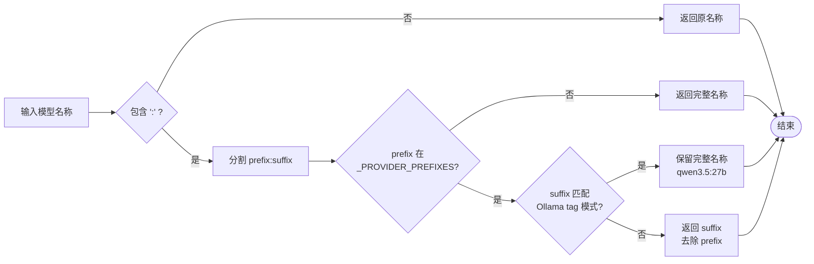

# Hermes-Agent Ollama 本地模型配置架构分析

## 1. 系统概述

Hermes-Agent 的 Ollama 本地模型配置系统是一个多层次的智能检测与适配架构，旨在无缝集成 Ollama 本地大语言模型服务器。该系统通过自动检测本地服务器类型、动态查询模型上下文长度、智能注入配置参数等机制，解决了 Ollama 默认 2048 token 上下文限制的问题，使本地模型能够充分发挥其训练时的完整上下文能力。

### 1.1 核心功能特性

| 功能模块 | 描述 |
|---------|------|
| **本地服务器自动检测** | 通过探测特定端点区分 Ollama、LM Studio、vLLM、llama.cpp |
| **上下文长度智能查询** | 通过 `/api/show` 获取模型真实上下文能力 |
| **配置参数动态注入** | 通过 `extra_body.options.num_ctx` 覆盖默认限制 |
| **用户配置覆盖** | 支持 `model.ollama_num_ctx` 手动设置 |
| **多层级回退策略** | 10-tier 上下文长度解析策略 |

### 1.2 架构设计原则

1. **零配置优先**：自动检测并配置，无需用户手动干预
2. **用户可控**：提供配置覆盖点，允许高级用户自定义
3. **容错设计**：检测失败时优雅降级，不影响核心功能
4. **性能优化**：缓存检测结果，避免重复查询

---

## 2. 软件架构图

### 2.1 整体架构层次图

```
┌─────────────────────────────────────────────────────────────────────────────┐
│                           AIAgent (run_agent.py)                            │
│  ┌─────────────────────────────────────────────────────────────────────┐   │
│  │  Ollama 配置初始化 (_ollama_num_ctx)                                │   │
│  │  ┌─────────────┐  ┌─────────────┐  ┌─────────────────────────────┐ │   │
│  │  │ 配置覆盖检测 │→ │ 自动检测    │→ │ 运行时注入 extra_body       │ │   │
│  │  │ (config.yaml)│  │ (api/show)  │  │ (options.num_ctx)           │ │   │
│  │  └─────────────┘  └─────────────┘  └─────────────────────────────┘ │   │
│  └─────────────────────────────────────────────────────────────────────┘   │
└─────────────────────────────────────────────────────────────────────────────┘
                                       │
                                       ▼
┌─────────────────────────────────────────────────────────────────────────────┐
│                      Model Metadata Layer (agent/model_metadata.py)         │
│  ┌─────────────────────┐  ┌─────────────────────┐  ┌─────────────────────┐ │
│  │ detect_local_server │  │ query_ollama_num_ctx│  │ _query_local_ctx    │ │
│  │ _type()             │  │                     │  │                     │ │
│  │                     │  │ • 服务器类型检测     │  │ • LM Studio 支持    │ │
│  │ • /api/tags 探测    │  │ • /api/show 查询    │  │ • vLLM 支持         │ │
│  │ • /api/v1/models    │  │ • model_info 解析   │  │ • llama.cpp 支持    │ │
│  │ • /v1/props 探测    │  │ • parameters 解析   │  │ • 多路径回退        │ │
│  └─────────────────────┘  └─────────────────────┘  └─────────────────────┘ │
└─────────────────────────────────────────────────────────────────────────────┘
                                       │
                                       ▼
┌─────────────────────────────────────────────────────────────────────────────┐
│                     Provider Resolution Layer (hermes_cli/)                 │
│  ┌─────────────────────┐  ┌─────────────────────┐  ┌─────────────────────┐ │
│  │   providers.py      │  │ runtime_provider.py │  │       auth.py       │ │
│  │                     │  │                     │  │                     │ │
│  │ • ProviderDef       │  │ • 本地端点检测      │  │ • Ollama Cloud      │ │
│  │ • ALIASES 映射      │  │ • 模型自动发现      │  │   认证支持          │ │
│  │ • "ollama" →        │  │ • base_url 解析     │  │ • 凭证池管理        │ │
│  │   "ollama-cloud"    │  │ • API 模式检测      │  │                     │ │
│  └─────────────────────┘  └─────────────────────┘  └─────────────────────┘ │
└─────────────────────────────────────────────────────────────────────────────┘
                                       │
                                       ▼
┌─────────────────────────────────────────────────────────────────────────────┐
│                           Ollama Server                                     │
│                    ┌─────────────────────────┐                              │
│                    │      Ollama API         │                              │
│                    │  ┌─────────┐ ┌────────┐ │                              │
│                    │  │/api/tags│ │/api/show│ │                              │
│                    │  │  GET    │ │  POST  │ │                              │
│                    │  └─────────┘ └────────┘ │                              │
│                    └─────────────────────────┘                              │
└─────────────────────────────────────────────────────────────────────────────┘
```

### 2.2 Ollama 上下文检测流程图

```
┌─────────────────┐
│   开始检测      │
└────────┬────────┘
         │
         ▼
┌─────────────────────────┐     否      ┌─────────────────┐
│ 检查 config.yaml 中     │────────────→│ 检查是否为本地  │
│ model.ollama_num_ctx    │             │ 端点 (localhost │
│ 用户覆盖配置            │             │ /127.0.0.1/私网)│
└────────┬────────────────┘             └────────┬────────┘
         │ 是                                   │
         ▼                                       ▼
┌─────────────────┐                     ┌─────────────────┐     否
│ 使用用户配置值  │                     │ 调用 detect_    │────────→ 结束
│ 作为 num_ctx    │                     │ local_server_   │          (非本地)
└────────┬────────┘                     │ type() 检测     │
         │                              └────────┬────────┘
         │                                       │ 是
         │                                       ▼
         │                              ┌─────────────────┐
         │                              │ 服务器类型 ==   │     否
         │                              │ "ollama"?       │────────→ 结束
         │                              └────────┬────────┘          (非Ollama)
         │                                       │ 是
         │                                       ▼
         │                              ┌─────────────────┐
         │                              │ 调用 query_     │
         │                              │ ollama_num_ctx()│
         │                              └────────┬────────┘
         │                                       │
         │                                       ▼
         │                              ┌─────────────────┐
         │                              │ POST /api/show  │
         │                              │ {name: model}   │
         │                              └────────┬────────┘
         │                                       │
         │                                       ▼
         │                              ┌─────────────────┐
         │                              │ 解析响应数据    │
         │                              │ • parameters    │
         │                              │   (num_ctx)     │
         │                              │ • model_info    │
         │                              │   (context_)    │
         │                              └────────┬────────┘
         │                                       │
         │                                       ▼
         │                              ┌─────────────────┐
         │                              │ 返回检测到的    │
         │                              │ 上下文长度      │
         │                              └────────┬────────┘
         │                                       │
         └───────────────────────────────────────┘
                         │
                         ▼
┌─────────────────────────────────────────────────────────────────┐
│                    运行时请求注入                                 │
│  ┌───────────────────────────────────────────────────────────┐  │
│  │  chat.completions.create(                                  │  │
│  │      model=model,                                          │  │
│  │      messages=messages,                                    │  │
│  │      extra_body={                                          │  │
│  │          "options": {                                      │  │
│  │              "num_ctx": detected_ctx  ←── 注入点           │  │
│  │          }                                                 │  │
│  │      }                                                     │  │
│  │  )                                                         │  │
│  └───────────────────────────────────────────────────────────┘  │
└─────────────────────────────────────────────────────────────────┘
```

### 2.3 本地服务器类型检测架构

```
┌─────────────────────────────────────────────────────────────────┐
│              detect_local_server_type(base_url)                  │
│                                                                  │
│   输入: base_url (如 http://localhost:11434/v1)                  │
│                                                                  │
│   检测顺序 (按特异性排序):                                        │
│   ┌─────────────────────────────────────────────────────────┐   │
│   │ 1. LM Studio: GET /api/v1/models                        │   │
│   │    特征: 返回 {"models": [...]}                          │   │
│   │    优先级最高，因为 LM Studio 也响应 /api/tags           │   │
│   ├─────────────────────────────────────────────────────────┤   │
│   │ 2. Ollama: GET /api/tags                                │   │
│   │    特征: 返回 {"models": [...]}                          │   │
│   │    LM Studio 返回错误，但需验证响应格式                  │   │
│   ├─────────────────────────────────────────────────────────┤   │
│   │ 3. llama.cpp: GET /v1/props 或 /props                   │   │
│   │    特征: 包含 "default_generation_settings"              │   │
│   ├─────────────────────────────────────────────────────────┤   │
│   │ 4. vLLM: GET /version                                   │   │
│   │    特征: 返回 {"version": "x.x.x"}                       │   │
│   └─────────────────────────────────────────────────────────┘   │
│                                                                  │
│   输出: "ollama" | "lm-studio" | "vllm" | "llamacpp" | None      │
└─────────────────────────────────────────────────────────────────┘
```

### 2.4 上下文长度解析策略 (10-Tier Resolution)

```
┌─────────────────────────────────────────────────────────────────────┐
│           get_model_context_length() 解析层级                        │
├─────────────────────────────────────────────────────────────────────┤
│ Tier 0 │ 用户显式配置 (config_context_length)                        │
│        │ → model.context_length in config.yaml                       │
├────────┼─────────────────────────────────────────────────────────────┤
│ Tier 1 │ 持久化缓存 (Persistent Cache)                               │
│        │ → ~/.hermes/context_length_cache.yaml                       │
├────────┼─────────────────────────────────────────────────────────────┤
│ Tier 2 │ 端点元数据 (Endpoint Metadata)                              │
│        │ → GET /v1/models 从自定义端点获取                           │
├────────┼─────────────────────────────────────────────────────────────┤
│ Tier 3 │ 本地服务器查询 (Local Server Query)                         │
│        │ → Ollama: /api/show                                         │
│        │ → LM Studio: /api/v1/models                                 │
│        │ → vLLM/llama.cpp: /v1/models/{model}                        │
├────────┼─────────────────────────────────────────────────────────────┤
│ Tier 4 │ Anthropic /v1/models API                                    │
│        │ → 仅适用于 api.anthropic.com                                │
├────────┼─────────────────────────────────────────────────────────────┤
│ Tier 5 │ OpenRouter 实时 API 元数据                                  │
│        │ → https://openrouter.ai/api/v1/models                       │
├────────┼─────────────────────────────────────────────────────────────┤
│ Tier 6 │ Nous Portal 后缀匹配                                        │
│        │ → 通过 OpenRouter 缓存解析 Nous 模型                        │
├────────┼─────────────────────────────────────────────────────────────┤
│ Tier 7 │ models.dev 注册表查询                                       │
│        │ → provider-aware 上下文长度                                 │
├────────┼─────────────────────────────────────────────────────────────┤
│ Tier 8 │ 硬编码默认值 (Hardcoded Defaults)                           │
│        │ → DEFAULT_CONTEXT_LENGTHS 字典                              │
├────────┼─────────────────────────────────────────────────────────────┤
│ Tier 9 │ 最终回退 (Final Fallback)                                   │
│        │ → DEFAULT_FALLBACK_CONTEXT = 128K                           │
└────────┴─────────────────────────────────────────────────────────────┘
```

---

## 3. 核心业务流程

### 3.1 Ollama 上下文检测详细流程

```mermaid
sequenceDiagram
    participant User as 用户/Agent
    participant AIAgent as AIAgent (run_agent.py)
    participant Metadata as model_metadata.py
    participant Ollama as Ollama Server

    User->>AIAgent: 初始化 AIAgent(base_url, model)
    AIAgent->>AIAgent: 检查 _model_cfg.get("ollama_num_ctx")
    alt 用户配置了 ollama_num_ctx
        AIAgent->>AIAgent: 使用用户配置值
    else 未配置，且为本地端点
        AIAgent->>Metadata: detect_local_server_type(base_url)
        Metadata->>Ollama: GET /api/tags
        Ollama-->>Metadata: {"models": [...]}
        Metadata-->>AIAgent: 返回 "ollama"
        
        AIAgent->>Metadata: query_ollama_num_ctx(model, base_url)
        Metadata->>Metadata: _strip_provider_prefix(model)
        Note over Metadata: "local:qwen2.5:7b" → "qwen2.5:7b"
        
        Metadata->>Ollama: POST /api/show {name: "qwen2.5:7b"}
        Ollama-->>Metadata: {model_info: {...}, parameters: "..."}
        
        Metadata->>Metadata: 解析 parameters 中的 num_ctx
        alt 找到 num_ctx
            Metadata-->>AIAgent: 返回 num_ctx 值
        else 未找到
            Metadata->>Metadata: 解析 model_info.context_length
            Metadata-->>AIAgent: 返回 context_length
        end
        
        AIAgent->>AIAgent: 设置 self._ollama_num_ctx
    end
    
    Note over AIAgent: 运行时请求阶段
    
    User->>AIAgent: chat(messages)
    AIAgent->>Ollama: chat.completions.create(
        extra_body={"options": {"num_ctx": detected_ctx}}
    )
    Ollama-->>User: 响应 (使用完整上下文窗口)
```

### 3.2 本地服务器检测流程

```mermaid
flowchart TD
    Start([开始检测]) --> Normalize[规范化 base_url<br/>去除 /v1 后缀]
    
    Normalize --> LMStudio[GET /api/v1/models]
    LMStudio -->|status=200| CheckLM{检查响应}
    CheckLM -->|包含 models 数组| ReturnLM[返回 "lm-studio"]
    CheckLM -->|其他| OllamaCheck
    
    LMStudio -->|失败| OllamaCheck[GET /api/tags]
    OllamaCheck -->|status=200| CheckOllama{检查响应}
    CheckOllama -->|包含 models 键| ReturnOllama[返回 "ollama"]
    CheckOllama -->|其他| LlamaCheck
    
    OllamaCheck -->|失败| LlamaCheck[GET /v1/props 或 /props]
    LlamaCheck -->|status=200| CheckLlama{检查响应}
    CheckLlama -->|包含 default_generation_settings| ReturnLlama[返回 "llamacpp"]
    CheckLlama -->|其他| VLLMCheck
    
    LlamaCheck -->|失败| VLLMCheck[GET /version]
    VLLMCheck -->|status=200| CheckVLLM{检查响应}
    CheckVLLM -->|包含 version 键| ReturnVLLM[返回 "vllm"]
    CheckVLLM -->|其他| ReturnNone
    
    VLLMCheck -->|失败| ReturnNone[返回 None]
    
    ReturnLM --> End([结束])
    ReturnOllama --> End
    ReturnLlama --> End
    ReturnVLLM --> End
    ReturnNone --> End
```

### 3.3 模型名称前缀处理流程



---

## 4. 核心代码分析

### 4.1 本地服务器类型检测

**文件**: `agent/model_metadata.py:294-350`

```python
def detect_local_server_type(base_url: str) -> Optional[str]:
    """Detect which local server is running at base_url by probing known endpoints.

    Returns one of: "ollama", "lm-studio", "vllm", "llamacpp", or None.
    """
    import httpx

    normalized = _normalize_base_url(base_url)
    server_url = normalized
    if server_url.endswith("/v1"):
        server_url = server_url[:-3]

    try:
        with httpx.Client(timeout=2.0) as client:
            # LM Studio exposes /api/v1/models — check first (most specific)
            try:
                r = client.get(f"{server_url}/api/v1/models")
                if r.status_code == 200:
                    return "lm-studio"
            except Exception:
                pass
            # Ollama exposes /api/tags and responds with {"models": [...]}
            # LM Studio returns {"error": "Unexpected endpoint"} with status 200
            # on this path, so we must verify the response contains "models".
            try:
                r = client.get(f"{server_url}/api/tags")
                if r.status_code == 200:
                    try:
                        data = r.json()
                        if "models" in data:
                            return "ollama"
                    except Exception:
                        pass
            except Exception:
                pass
            # llama.cpp exposes /v1/props
            try:
                r = client.get(f"{server_url}/v1/props")
                if r.status_code != 200:
                    r = client.get(f"{server_url}/props")
                if r.status_code == 200 and "default_generation_settings" in r.text:
                    return "llamacpp"
            except Exception:
                pass
            # vLLM: /version
            try:
                r = client.get(f"{server_url}/version")
                if r.status_code == 200:
                    data = r.json()
                    if "version" in data:
                        return "vllm"
            except Exception:
                pass
    except Exception:
        pass

    return None
```

**设计要点**:
1. **检测顺序很重要**: LM Studio 优先，因为它也会响应 `/api/tags` 但返回错误
2. **响应验证**: Ollama 检测需要验证响应中包含 `"models"` 键
3. **超时设置**: 2 秒超时避免阻塞
4. **异常处理**: 所有检测都包裹在 try-except 中，确保容错

### 4.2 Ollama 上下文长度查询

**文件**: `agent/model_metadata.py:700-750`

```python
def query_ollama_num_ctx(model: str, base_url: str) -> Optional[int]:
    """Query an Ollama server for the model's context length.

    Returns the model's maximum context from GGUF metadata via ``/api/show``,
    or the explicit ``num_ctx`` from the Modelfile if set.  Returns None if
    the server is unreachable or not Ollama.

    This is the value that should be passed as ``num_ctx`` in Ollama chat
    requests to override the default 2048.
    """
    import httpx

    bare_model = _strip_provider_prefix(model)
    server_url = base_url.rstrip("/")
    if server_url.endswith("/v1"):
        server_url = server_url[:-3]

    try:
        server_type = detect_local_server_type(base_url)
    except Exception:
        return None
    if server_type != "ollama":
        return None

    try:
        with httpx.Client(timeout=3.0) as client:
            resp = client.post(f"{server_url}/api/show", json={"name": bare_model})
            if resp.status_code != 200:
                return None
            data = resp.json()

            # Prefer explicit num_ctx from Modelfile parameters (user override)
            params = data.get("parameters", "")
            if "num_ctx" in params:
                for line in params.split("\n"):
                    if "num_ctx" in line:
                        parts = line.strip().split()
                        if len(parts) >= 2:
                            try:
                                return int(parts[-1])
                            except ValueError:
                                pass

            # Fall back to GGUF model_info context_length (training max)
            model_info = data.get("model_info", {})
            for key, value in model_info.items():
                if "context_length" in key and isinstance(value, (int, float)):
                    return int(value)
    except Exception:
        pass
    return None
```

**设计要点**:
1. **双重解析策略**: 优先 `parameters.num_ctx` (用户覆盖)，其次 `model_info.context_length` (模型训练值)
2. **前缀剥离**: 使用 `_strip_provider_prefix` 处理 `local:model` 格式
3. **服务器验证**: 再次确认服务器类型为 Ollama
4. **超时设置**: 3 秒超时平衡可靠性和响应速度

### 4.3 AIAgent 初始化与运行时注入

**文件**: `run_agent.py:1370-1395`

```python
# ── Ollama num_ctx injection ──
# Ollama defaults to 2048 context regardless of the model's capabilities.
# When running against an Ollama server, detect the model's max context
# and pass num_ctx on every chat request so the full window is used.
# User override: set model.ollama_num_ctx in config.yaml to cap VRAM use.
self._ollama_num_ctx: int | None = None
_ollama_num_ctx_override = None
if isinstance(_model_cfg, dict):
    _ollama_num_ctx_override = _model_cfg.get("ollama_num_ctx")
if _ollama_num_ctx_override is not None:
    try:
        self._ollama_num_ctx = int(_ollama_num_ctx_override)
    except (TypeError, ValueError):
        logger.debug("Invalid ollama_num_ctx config value: %r", _ollama_num_ctx_override)
if self._ollama_num_ctx is None and self.base_url and is_local_endpoint(self.base_url):
    try:
        _detected = query_ollama_num_ctx(self.model, self.base_url)
        if _detected and _detected > 0:
            self._ollama_num_ctx = _detected
    except Exception as exc:
        logger.debug("Ollama num_ctx detection failed: %s", exc)
if self._ollama_num_ctx and not self.quiet_mode:
    logger.info(
        "Ollama num_ctx: will request %d tokens (model max from /api/show)",
        self._ollama_num_ctx,
    )
```

**文件**: `run_agent.py:6175-6182`

```python
# Ollama num_ctx: override the 2048 default so the model actually
# uses the context window it was trained for.  Passed via the OpenAI
# SDK's extra_body → options.num_ctx, which Ollama's OpenAI-compat
# endpoint forwards to the runner as --ctx-size.
if self._ollama_num_ctx:
    options = extra_body.get("options", {})
    options["num_ctx"] = self._ollama_num_ctx
    extra_body["options"] = options
```

**设计要点**:
1. **配置覆盖优先**: 用户可以通过 `model.ollama_num_ctx` 强制设置
2. **条件检测**: 仅在本地端点时执行自动检测
3. **静默失败**: 检测失败时不抛出异常，仅记录 debug 日志
4. **运行时注入**: 通过 `extra_body.options.num_ctx` 传递给 Ollama

### 4.4 模型名称前缀处理

**文件**: `agent/model_metadata.py:48-65`

```python
def _strip_provider_prefix(model: str) -> str:
    """Strip a recognised provider prefix from a model string.

    ``"local:my-model"`` → ``"my-model"``
    ``"qwen3.5:27b"``   → ``"qwen3.5:27b"``  (unchanged — not a provider prefix)
    ``"qwen:0.5b"``     → ``"qwen:0.5b"``    (unchanged — Ollama model:tag)
    ``"deepseek:latest"``→ ``"deepseek:latest"``(unchanged — Ollama model:tag)
    """
    if ":" not in model or model.startswith("http"):
        return model
    prefix, suffix = model.split(":", 1)
    prefix_lower = prefix.strip().lower()
    if prefix_lower in _PROVIDER_PREFIXES:
        # Don't strip if suffix looks like an Ollama tag (e.g. "7b", "latest", "q4_0")
        if _OLLAMA_TAG_PATTERN.match(suffix.strip()):
            return model
        return suffix
    return model
```

**关键正则表达式**:

```python
_OLLAMA_TAG_PATTERN = re.compile(
    r"^(\d+\.?\d*b|latest|stable|q\d|fp?\d|instruct|chat|coder|vision|text)",
    re.IGNORECASE,
)
```

**设计要点**:
1. **精确区分**: 区分 `local:model` (provider 前缀) 和 `qwen3.5:27b` (Ollama tag)
2. **保留 Ollama 格式**: Ollama 的 `model:tag` 格式被保留，确保正确查询
3. **大小写不敏感**: provider 前缀匹配不区分大小写

---

## 5. 配置接口

### 5.1 用户配置选项

**config.yaml 配置示例**:

```yaml
model:
  # 模型标识符
  default: "local:qwen2.5:7b"
  
  # Ollama 特定配置
  ollama_num_ctx: 32768  # 手动设置上下文长度，覆盖自动检测
  
  # 本地端点配置
  base_url: "http://localhost:11434/v1"
  
  # 提供商选择
  provider: "custom"
```

### 5.2 环境变量支持

| 环境变量 | 描述 |
|---------|------|
| `OLLAMA_API_KEY` | Ollama Cloud 认证密钥 |
| `OPENAI_API_KEY` | 本地服务器可能需要的 API 密钥占位符 |

### 5.3 运行时参数

```python
AIAgent(
    model="local:llama3.1:8b",
    base_url="http://localhost:11434/v1",
    # ollama_num_ctx 通过 config.yaml 或自动检测获取
)
```

---

## 6. 测试覆盖

### 6.1 单元测试结构

**文件**: `tests/test_ollama_num_ctx.py`

```python
class TestQueryOllamaNumCtx:
    """Test the Ollama /api/show context length query."""

    def test_returns_context_from_model_info(self):
        """Should extract context_length from GGUF model_info metadata."""
        
    def test_prefers_explicit_num_ctx_from_modelfile(self):
        """If the Modelfile sets num_ctx explicitly, that should take priority."""
        
    def test_returns_none_for_non_ollama_server(self):
        """Should return None if the server is not Ollama."""
        
    def test_strips_provider_prefix(self):
        """Should strip 'local:' prefix from model name before querying."""
```

**文件**: `tests/agent/test_model_metadata_local_ctx.py`

```python
class TestQueryLocalContextLengthOllama:
    """_query_local_context_length with server_type == 'ollama'."""

    def test_ollama_model_info_context_length(self):
        """Reads context length from model_info dict in /api/show response."""
        
    def test_ollama_parameters_num_ctx(self):
        """Falls back to num_ctx in parameters string when model_info lacks context_length."""
        
    def test_ollama_show_404_falls_through(self):
        """When /api/show returns 404, falls through to /v1/models/{model}."""
```

### 6.2 测试覆盖要点

1. **模型信息解析**: 验证从 `model_info` 提取 `context_length`
2. **参数解析**: 验证从 `parameters` 提取 `num_ctx`
3. **优先级**: 验证 `num_ctx` 优先于 `model_info.context_length`
4. **前缀处理**: 验证 `local:` 前缀被正确剥离
5. **错误处理**: 验证非 Ollama 服务器返回 None
6. **网络错误**: 验证连接失败时返回 None

---

## 7. 设计模式分析

### 7.1 策略模式 (Strategy Pattern)

本地服务器检测使用策略模式，针对不同类型的服务器采用不同的检测策略：

```python
# 策略接口
def detect_local_server_type(base_url: str) -> Optional[str]:
    # 依次尝试各种检测策略
    
# 具体策略
- LMStudioStrategy: GET /api/v1/models
- OllamaStrategy: GET /api/tags
- LlamaCppStrategy: GET /v1/props
- VLLMStrategy: GET /version
```

### 7.2 责任链模式 (Chain of Responsibility)

上下文长度解析使用 10-tier 责任链，按优先级依次尝试：

```python
# 责任链处理
if config_context_length: return config_context_length
if cached: return cached
if endpoint_metadata: return endpoint_metadata
if local_server_query: return local_server_query
# ... 继续链式处理
return DEFAULT_FALLBACK_CONTEXT
```

### 7.3 模板方法模式 (Template Method)

`_query_local_context_length` 为不同服务器类型提供统一的查询模板：

```python
def _query_local_context_length(model, base_url):
    model = _strip_provider_prefix(model)  # 通用步骤
    server_type = detect_local_server_type(base_url)  # 通用步骤
    
    if server_type == "ollama":
        # Ollama 特定实现
    elif server_type == "lm-studio":
        # LM Studio 特定实现
    # ... 其他服务器类型
```

### 7.4 装饰器模式 (Decorator)

模型名称前缀剥离作为装饰器功能，为查询函数提供统一的名称处理：

```python
# 装饰器功能
bare_model = _strip_provider_prefix(model)
# 然后执行实际查询
```

---

## 8. 安全与容错设计

### 8.1 超时控制

| 操作 | 超时时间 | 说明 |
|------|---------|------|
| 服务器类型检测 | 2 秒 | 快速失败，避免阻塞 |
| Ollama /api/show 查询 | 3 秒 | 平衡可靠性和响应速度 |
| 端点元数据获取 | 10 秒 | 允许较慢的网络响应 |

### 8.2 错误处理策略

```python
try:
    result = detect_local_server_type(base_url)
except Exception:
    return None  # 静默失败，返回 None
```

1. **静默失败**: 检测失败不抛出异常，避免中断主流程
2. **日志记录**: 使用 `logger.debug` 记录失败信息，便于排查
3. **优雅降级**: 检测失败时使用默认上下文长度 (128K)

### 8.3 输入验证

```python
def _coerce_reasonable_int(value: Any, minimum: int = 1024, maximum: int = 10_000_000) -> Optional[int]:
    # 验证上下文长度在合理范围内
```

---

## 9. 性能优化

### 9.1 缓存机制

```python
# 内存缓存
_model_metadata_cache: Dict[str, Dict[str, Any]] = {}
_model_metadata_cache_time: float = 0
_MODEL_CACHE_TTL = 3600  # 1 小时

# 磁盘缓存
_context_length_cache.yaml
```

### 9.2 延迟加载

```python
# 仅在需要时导入 httpx
import httpx  # 在函数内部导入，避免启动时加载
```

### 9.3 并发安全

```python
# 使用线程局部存储或锁保护共享缓存
```

---

## 10. 代码索引

### 10.1 核心文件

| 文件路径 | 行数 | 核心功能 |
|---------|------|---------|
| `agent/model_metadata.py` | ~1088 | 模型元数据、上下文长度检测、本地服务器检测 |
| `run_agent.py` | ~6200 | AIAgent 类、Ollama 配置初始化与运行时注入 |
| `hermes_cli/providers.py` | ~543 | Provider 定义、别名映射、Ollama 别名 |
| `hermes_cli/runtime_provider.py` | ~835 | 运行时 Provider 解析、本地端点检测 |
| `hermes_cli/auth.py` | ~1000+ | 认证系统、Ollama Cloud 支持 |
| `hermes_cli/models.py` | ~1700 | 模型目录、Provider 模型列表 |

### 10.2 核心函数索引

| 函数名 | 文件 | 行号 | 功能描述 |
|-------|------|------|---------|
| `detect_local_server_type()` | `agent/model_metadata.py` | 294 | 检测本地服务器类型 |
| `query_ollama_num_ctx()` | `agent/model_metadata.py` | 700 | 查询 Ollama 上下文长度 |
| `_query_local_context_length()` | `agent/model_metadata.py` | 753 | 通用本地上下文查询 |
| `_strip_provider_prefix()` | `agent/model_metadata.py` | 48 | 剥离 provider 前缀 |
| `get_model_context_length()` | `agent/model_metadata.py` | 917 | 10-tier 上下文解析 |
| `is_local_endpoint()` | `agent/model_metadata.py` | 255 | 检测是否为本地端点 |
| `_auto_detect_local_model()` | `hermes_cli/runtime_provider.py` | 49 | 自动检测本地模型 |

### 10.3 测试文件

| 文件路径 | 描述 |
|---------|------|
| `tests/test_ollama_num_ctx.py` | Ollama num_ctx 检测单元测试 |
| `tests/agent/test_model_metadata_local_ctx.py` | 本地上下文查询集成测试 |
| `tests/agent/test_model_metadata.py` | 模型元数据通用测试 |
| `tests/hermes_cli/test_ollama_cloud_auth.py` | Ollama Cloud 认证测试 |

---

## 11. 总结

Hermes-Agent 的 Ollama 本地模型配置系统展现了一个成熟、健壮的本地 LLM 集成方案。其核心设计亮点包括：

1. **智能自动检测**: 通过多维度端点探测自动识别服务器类型
2. **深度集成**: 不仅支持 Ollama，还兼容 LM Studio、vLLM、llama.cpp 等主流本地服务器
3. **用户可控**: 提供配置覆盖点，平衡自动化和自定义需求
4. **容错设计**: 多层回退策略确保检测失败时不影响核心功能
5. **性能优化**: 缓存机制和超时控制确保高效运行

该系统成功解决了 Ollama 默认 2048 token 上下文限制的问题，使本地部署的大语言模型能够充分发挥其完整能力，为用户提供与云端模型相媲美的体验。
