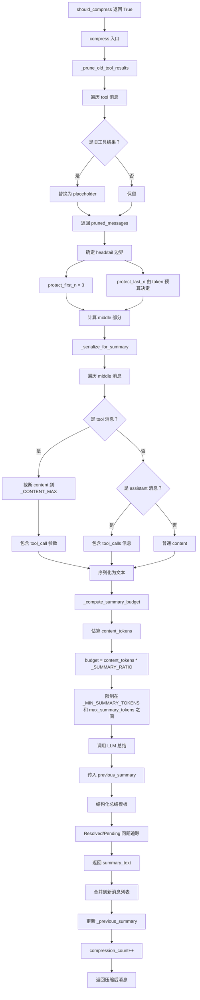
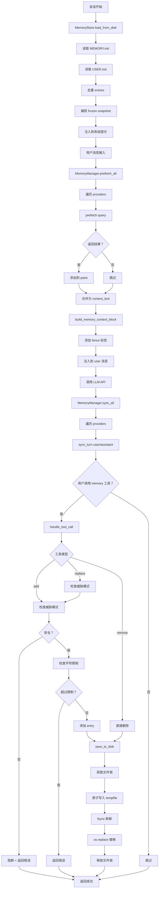

# 上下文管理系统架构分析

## 1. 概述

Hermes Agent 实现了一套**分层、可扩展、插件化**的上下文管理系统，通过上下文引擎、记忆系统、会话管理、上下文引用处理等多个组件协同工作，实现了高效的上下文管理和压缩。

### 1.1 核心设计目标

| 目标 | 实现策略 |
|-----|---------|
| **上下文窗口管理** | 双层压缩系统（Gateway 85% + Agent 50%） |
| **可扩展性** | ContextEngine ABC + 插件系统 |
| **记忆持久化** | 文件背书的有界记忆（MEMORY.md/USER.md） |
| **会话隔离** | 会话级上下文跟踪 + PII 脱敏 |
| **上下文注入** | @引用模式 + 安全扫描 |
| **提示缓存友好** | 冻结快照 + API 调用时注入 |

### 1.2 系统组件

```
┌─────────────────────────────────────────────────────────┐
│              上下文管理系统架构                          │
├─────────────────────────────────────────────────────────┤
│                                                         │
│  ┌─────────────────┐    ┌──────────────────┐           │
│  │ ContextEngine   │    │  MemoryManager   │           │
│  │ (抽象基类)      │    │  (记忆协调器)     │           │
│  ├─────────────────┤    ├──────────────────┤           │
│  │ • compressor    │    │ • builtin        │           │
│  │ • lcm (插件)    │    │ • external (1 个) │           │
│  └────────┬────────┘    └─────────┬────────┘           │
│           │                       │                     │
│           └───────────┬───────────┘                     │
│                       │                                 │
│           ┌───────────▼───────────┐                     │
│           │   AIAgent (run_agent) │                     │
│           └───────────┬───────────┘                     │
│                       │                                 │
│  ┌────────────────────┼────────────────────┐           │
│  │                    │                    │           │
│  │      ┌─────────────▼─────────────┐      │           │
│  │      │  SessionContext (Gateway) │      │           │
│  │      │  • 会话跟踪               │      │           │
│  │      │  • PII 脱敏               │      │           │
│  │      └───────────────────────────┘      │           │
│  │                                         │           │
│  │      ┌───────────────────────────┐      │           │
│  │      │  ContextReferences        │      │           │
│  │      │  • @file/@folder/@git     │      │           │
│  │      │  • URL 提取               │      │           │
│  │      │  • 安全扫描               │      │           │
│  │      └───────────────────────────┘      │           │
│  │                                         │           │
│  └─────────────────────────────────────────┘           │
└─────────────────────────────────────────────────────────┘
```

---

## 2. 架构设计

### 2.1 分层架构

```
┌─────────────────────────────────────────────────────────┐
│              第 1 层：会话上下文层                         │
│  ┌─────────────────────────────────────────────────┐    │
│  │ SessionContext (gateway/session.py)            │    │
│  │ - 会话来源跟踪（platform/chat_id/user_id）      │    │
│  │ - PII 脱敏（哈希化 user_id/chat_id）            │    │
│  │ - 动态系统提示注入                              │    │
│  │ - 多平台上下文聚合                              │    │
│  └─────────────────────────────────────────────────┘    │
└─────────────────────────────────────────────────────────┘
                        ↓
┌─────────────────────────────────────────────────────────┐
│              第 2 层：上下文引用层                         │
│  ┌─────────────────────────────────────────────────┐    │
│  │ ContextReferences (agent/context_references.py)│    │
│  │ - @file/@folder/@git/@url 解析                  │    │
│  │ - 安全路径检查（敏感文件/目录阻断）             │    │
│  │ - Token 预算控制（50% 硬限制/25% 软限制）         │    │
│  │ - Git 命令执行（diff/staged/log）               │    │
│  │ - URL 内容提取（web_extract_tool）              │    │
│  └─────────────────────────────────────────────────┘    │
└─────────────────────────────────────────────────────────┘
                        ↓
┌─────────────────────────────────────────────────────────┐
│              第 3 层：上下文引擎层                         │
│  ┌─────────────────────────────────────────────────┐    │
│  │ ContextEngine ABC (agent/context_engine.py)    │    │
│  │ - name (标识符)                                 │    │
│  │ - update_from_response (token 跟踪)             │    │
│  │ - should_compress (压缩触发)                    │    │
│  │ - compress (执行压缩)                           │    │
│  │ - on_session_start/end/reset (生命周期)         │    │
│  │ - get_tool_schemas (引擎工具)                   │    │
│  └─────────────────────────────────────────────────┘    │
│           ↑                       ↑                     │
│  ┌────────┴────────┐    ┌────────┴────────┐           │
│  │ ContextCompressor│    │ Plugin Engines  │           │
│  │ (内置压缩器)     │    │ (e.g. LCM)      │           │
│  └─────────────────┘    └─────────────────┘           │
└─────────────────────────────────────────────────────────┘
                        ↓
┌─────────────────────────────────────────────────────────┐
│              第 4 层：记忆管理层                           │
│  ┌─────────────────────────────────────────────────┐    │
│  │ MemoryManager (agent/memory_manager.py)        │    │
│  │ - 协调 builtin + 1 个 external provider          │    │
│  │ - build_system_prompt (系统提示块)              │    │
│  │ - prefetch_all (预取上下文)                     │    │
│  │ - sync_all (同步回合)                           │    │
│  │ - handle_tool_call (工具路由)                   │    │
│  └─────────────────────────────────────────────────┘    │
│           ↑                       ↑                     │
│  ┌────────┴────────┐    ┌────────┴────────┐           │
│  │ BuiltinMemory   │    │ Plugin Providers│           │
│  │ (MEMORY.md/     │    │ (e.g. Mem0/     │           │
│  │  USER.md)       │    │  SuperMemory)   │           │
│  └─────────────────┘    └─────────────────┘           │
└─────────────────────────────────────────────────────────┘
                        ↓
┌─────────────────────────────────────────────────────────┐
│              第 5 层：工具执行层                           │
│  ┌─────────────────────────────────────────────────┐    │
│  │ Memory Tools (tools/memory_tool.py)            │    │
│  │ - memory (add/replace/remove/read)             │    │
│  │ - 安全扫描（威胁模式检测）                      │    │
│  │ - 原子写入（tempfile + fsync + os.replace）     │    │
│  │ - 文件锁（fcntl 互斥锁）                        │    │
│  └─────────────────────────────────────────────────┘    │
└─────────────────────────────────────────────────────────┘
```

### 2.2 核心设计原则

1. **单一职责（Single Responsibility）**: 每层专注特定功能
2. **开闭原则（Open/Closed）**: 通过 ABC 和插件系统扩展
3. **依赖倒置（Dependency Inversion）**: 依赖抽象而非具体实现
4. **接口隔离（Interface Segregation）**: 细粒度的 ABC 方法
5. **缓存友好（Cache-Friendly）**: 冻结快照 + API 调用时注入
6. **安全隔离（Security Isolation）**: 多层扫描 + 路径检查 + PII 脱敏

---

## 3. 核心实现

### 3.1 上下文引擎 ABC

**文件位置**: [`agent/context_engine.py`](file:///home/meizu/Documents/my_agent_project/hermes-agent/agent/context_engine.py#L32-L184)

#### 3.1.1 抽象方法定义

```python
class ContextEngine(ABC):
    """Base class all context engines must implement."""

    # -- Identity ----------------------------------------------------------
    @property
    @abstractmethod
    def name(self) -> str:
        """Short identifier (e.g. 'compressor', 'lcm')."""

    # -- Token state (read by run_agent.py for display/logging) ------------
    last_prompt_tokens: int = 0
    last_completion_tokens: int = 0
    last_total_tokens: int = 0
    threshold_tokens: int = 0
    context_length: int = 0
    compression_count: int = 0

    # -- Compaction parameters (read by run_agent.py for preflight) --------
    threshold_percent: float = 0.75
    protect_first_n: int = 3
    protect_last_n: int = 6

    # -- Core interface ----------------------------------------------------
    @abstractmethod
    def update_from_response(self, usage: Dict[str, Any]) -> None:
        """Update tracked token usage from an API response."""

    @abstractmethod
    def should_compress(self, prompt_tokens: int = None) -> bool:
        """Return True if compaction should fire this turn."""

    @abstractmethod
    def compress(
        self,
        messages: List[Dict[str, Any]],
        current_tokens: int = None,
    ) -> List[Dict[str, Any]]:
        """Compact the message list and return the new message list."""

    # -- Optional: session lifecycle ---------------------------------------
    def on_session_start(self, session_id: str, **kwargs) -> None:
        """Called when a new conversation session begins."""

    def on_session_end(self, session_id: str, messages: List[Dict[str, Any]]) -> None:
        """Called at real session boundaries (CLI exit, /reset, gateway expiry)."""

    def on_session_reset(self) -> None:
        """Called on /new or /reset. Reset per-session state."""
        self.last_prompt_tokens = 0
        self.last_completion_tokens = 0
        self.last_total_tokens = 0
        self.compression_count = 0

    # -- Optional: tools ---------------------------------------------------
    def get_tool_schemas(self) -> List[Dict[str, Any]]:
        """Return tool schemas this engine provides to the agent."""
        return []

    def handle_tool_call(self, name: str, args: Dict[str, Any], **kwargs) -> str:
        """Handle a tool call from the agent. Must return a JSON string."""
        import json
        return json.dumps({"error": f"Unknown context engine tool: {name}"})
```

### 3.2 内置压缩器

**文件位置**: [`agent/context_compressor.py`](file:///home/meizu/Documents/my_agent_project/hermes-agent/agent/context_compressor.py#L60-L300)

#### 3.2.1 压缩算法

```python
class ContextCompressor(ContextEngine):
    """Default context engine — compresses conversation context via lossy summarization.

    Algorithm:
      1. Prune old tool results (cheap, no LLM call)
      2. Protect head messages (system prompt + first exchange)
      3. Protect tail messages by token budget (most recent ~20K tokens)
      4. Summarize middle turns with structured LLM prompt
      5. On subsequent compactions, iteratively update the previous summary
    """

    def __init__(
        self,
        model: str,
        threshold_percent: float = 0.50,
        protect_first_n: int = 3,
        protect_last_n: int = 20,
        summary_target_ratio: float = 0.20,
        quiet_mode: bool = False,
        summary_model_override: str = None,
        base_url: str = "",
        api_key: str = "",
        config_context_length: int | None = None,
        provider: str = "",
        api_mode: str = "",
    ):
        self.model = model
        self.threshold_percent = threshold_percent
        self.protect_first_n = protect_first_n
        self.protect_last_n = protect_last_n
        self.summary_target_ratio = max(0.10, min(summary_target_ratio, 0.80))
        
        self.context_length = get_model_context_length(
            model, base_url=base_url, api_key=api_key,
            config_context_length=config_context_length,
            provider=provider,
        )
        # Floor: never compress below MINIMUM_CONTEXT_LENGTH tokens
        self.threshold_tokens = max(
            int(self.context_length * threshold_percent),
            MINIMUM_CONTEXT_LENGTH,
        )
        self.compression_count = 0

        # Derive token budgets: ratio is relative to the threshold, not total context
        target_tokens = int(self.threshold_tokens * self.summary_target_ratio)
        self.tail_token_budget = target_tokens
        self.max_summary_tokens = min(
            int(self.context_length * 0.05), _SUMMARY_TOKENS_CEILING,
        )
```

#### 3.2.2 工具输出修剪

```python
def _prune_old_tool_results(
    self, messages: List[Dict[str, Any]], protect_tail_count: int,
    protect_tail_tokens: int | None = None,
) -> tuple[List[Dict[str, Any]], int]:
    """Replace old tool result contents with a short placeholder.

    Walks backward from the end, protecting the most recent messages that
    fall within ``protect_tail_tokens`` (when provided) OR the last
    ``protect_tail_count`` messages (backward-compatible default).
    """
    if not messages:
        return messages, 0

    result = [m.copy() for m in messages]
    pruned = 0

    # Determine the prune boundary
    if protect_tail_tokens is not None and protect_tail_tokens > 0:
        # Token-budget approach: walk backward accumulating tokens
        accumulated = 0
        boundary = len(result)
        min_protect = min(protect_tail_count, len(result) - 1)
        for i in range(len(result) - 1, -1, -1):
            msg = result[i]
            content_len = len(msg.get("content") or "")
            msg_tokens = content_len // _CHARS_PER_TOKEN + 10
            for tc in msg.get("tool_calls") or []:
                if isinstance(tc, dict):
                    args = tc.get("function", {}).get("arguments", "")
                    msg_tokens += len(args) // _CHARS_PER_TOKEN
            if accumulated + msg_tokens > protect_tail_tokens and (len(result) - i) >= min_protect:
                boundary = i
                break
            accumulated += msg_tokens
            boundary = i
        prune_boundary = max(boundary, len(result) - min_protect)
    else:
        prune_boundary = len(result) - protect_tail_count

    for i in range(prune_boundary):
        msg = result[i]
        if msg.get("role") != "tool":
            continue
        content = msg.get("content", "")
        if not content or content == _PRUNED_TOOL_PLACEHOLDER:
            continue
        # Only prune if the content is substantial (>200 chars)
        if len(content) > 200:
            result[i] = {**msg, "content": _PRUNED_TOOL_PLACEHOLDER}
            pruned += 1

    return result, pruned
```

#### 3.2.3 压缩触发检查

```python
def should_compress(self, prompt_tokens: int = None) -> bool:
    """Check if context exceeds the compression threshold."""
    tokens = prompt_tokens if prompt_tokens is not None else self.last_prompt_tokens
    return tokens >= self.threshold_tokens
```

### 3.3 记忆管理器

**文件位置**: [`agent/memory_manager.py`](file:///home/meizu/Documents/my_agent_project/hermes-agent/agent/memory_manager.py#L72-L300)

#### 3.3.1 提供者协调

```python
class MemoryManager:
    """Orchestrates the built-in provider plus at most one external provider.

    The builtin provider is always first. Only one non-builtin (external)
    provider is allowed. Failures in one provider never block the other.
    """

    def __init__(self) -> None:
        self._providers: List[MemoryProvider] = []
        self._tool_to_provider: Dict[str, MemoryProvider] = {}
        self._has_external: bool = False  # True once a non-builtin provider is added

    def add_provider(self, provider: MemoryProvider) -> None:
        """Register a memory provider.

        Built-in provider (name "builtin") is always accepted.
        Only ONE external (non-builtin) provider is allowed — a second
        attempt is rejected with a warning.
        """
        is_builtin = provider.name == "builtin"

        if not is_builtin:
            if self._has_external:
                existing = next(
                    (p.name for p in self._providers if p.name != "builtin"), "unknown"
                )
                logger.warning(
                    "Rejected memory provider '%s' — external provider '%s' is "
                    "already registered. Only one external memory provider is "
                    "allowed at a time. Configure which one via memory.provider "
                    "in config.yaml.",
                    provider.name, existing,
                )
                return
            self._has_external = True

        self._providers.append(provider)

        # Index tool names → provider for routing
        for schema in provider.get_tool_schemas():
            tool_name = schema.get("name", "")
            if tool_name and tool_name not in self._tool_to_provider:
                self._tool_to_provider[tool_name] = provider
            elif tool_name in self._tool_to_provider:
                logger.warning(
                    "Memory tool name conflict: '%s' already registered by %s, "
                    "ignoring from %s",
                    tool_name,
                    self._tool_to_provider[tool_name].name,
                    provider.name,
                )
```

#### 3.3.2 系统提示构建

```python
def build_system_prompt(self) -> str:
    """Collect system prompt blocks from all providers.

    Returns combined text, or empty string if no providers contribute.
    Each non-empty block is labeled with the provider name.
    """
    blocks = []
    for provider in self._providers:
        try:
            block = provider.system_prompt_block()
            if block and block.strip():
                blocks.append(block)
        except Exception as e:
            logger.warning(
                "Memory provider '%s' system_prompt_block() failed: %s",
                provider.name, e,
            )
    return "\n\n".join(blocks)
```

#### 3.3.3 预取上下文

```python
def prefetch_all(self, query: str, *, session_id: str = "") -> str:
    """Collect prefetch context from all providers.

    Returns merged context text labeled by provider. Empty providers
    are skipped. Failures in one provider don't block others.
    """
    parts = []
    for provider in self._providers:
        try:
            result = provider.prefetch(query, session_id=session_id)
            if result and result.strip():
                parts.append(result)
        except Exception as e:
            logger.debug(
                "Memory provider '%s' prefetch failed (non-fatal): %s",
                provider.name, e,
            )
    return "\n\n".join(parts)
```

### 3.4 会话上下文

**文件位置**: [`gateway/session.py`](file:///home/meizu/Documents/my_agent_project/hermes-agent/gateway/session.py#L66-L300)

#### 3.4.1 会话来源跟踪

```python
@dataclass
class SessionSource:
    """Describes where a message originated from."""
    platform: Platform
    chat_id: str
    chat_name: Optional[str] = None
    chat_type: str = "dm"  # "dm", "group", "channel", "thread"
    user_id: Optional[str] = None
    user_name: Optional[str] = None
    thread_id: Optional[str] = None
    chat_topic: Optional[str] = None
    user_id_alt: Optional[str] = None
    chat_id_alt: Optional[str] = None
    
    @property
    def description(self) -> str:
        """Human-readable description of the source."""
        if self.platform == Platform.LOCAL:
            return "CLI terminal"
        
        parts = []
        if self.chat_type == "dm":
            parts.append(f"DM with {self.user_name or self.user_id or 'user'}")
        elif self.chat_type == "group":
            parts.append(f"group: {self.chat_name or self.chat_id}")
        elif self.chat_type == "channel":
            parts.append(f"channel: {self.chat_name or self.chat_id}")
        else:
            parts.append(self.chat_name or self.chat_id)
        
        if self.thread_id:
            parts.append(f"thread: {self.thread_id}")
        
        return ", ".join(parts)
```

#### 3.4.2 PII 脱敏

```python
_PII_SAFE_PLATFORMS = frozenset({
    Platform.WHATSAPP,
    Platform.SIGNAL,
    Platform.TELEGRAM,
    Platform.BLUEBUBBLES,
})
"""Platforms where user IDs can be safely redacted (no in-message mention system
that requires raw IDs). Discord is excluded because mentions use <@user_id>."""

def _hash_sender_id(value: str) -> str:
    """Hash a sender ID to ``user_<12hex>``."""
    return f"user_{_hash_id(value)}"

def _hash_chat_id(value: str) -> str:
    """Hash the numeric portion of a chat ID, preserving platform prefix."""
    colon = value.find(":")
    if colon > 0:
        prefix = value[:colon]
        return f"{prefix}:{_hash_id(value[colon + 1:])}"
    return _hash_id(value)

def build_session_context_prompt(
    context: SessionContext,
    *,
    redact_pii: bool = False,
) -> str:
    """Build the dynamic system prompt section that tells the agent about its context.
    
    When *redact_pii* is True **and** the source platform is in
    ``_PII_SAFE_PLATFORMS``, phone numbers are stripped and user/chat IDs
    are replaced with deterministic hashes before being sent to the LLM.
    """
    redact_pii = redact_pii and context.source.platform in _PII_SAFE_PLATFORMS
    lines = ["## Current Session Context", ""]
    
    platform_name = context.source.platform.value.title()
    if context.source.platform == Platform.LOCAL:
        lines.append(f"**Source:** {platform_name} (the machine running this agent)")
    else:
        src = context.source
        if redact_pii:
            _uname = src.user_name or (
                _hash_sender_id(src.user_id) if src.user_id else "user"
            )
            _cname = src.chat_name or _hash_chat_id(src.chat_id)
            if src.chat_type == "dm":
                desc = f"DM with {_uname}"
            elif src.chat_type == "group":
                desc = f"group: {_cname}"
            elif src.chat_type == "channel":
                desc = f"channel: {_cname}"
            else:
                desc = _cname
        else:
            desc = src.description
        lines.append(f"**Source:** {platform_name} ({desc})")
    
    # ... connected platforms, home channels, etc.
    
    return "\n".join(lines)
```

### 3.5 上下文引用

**文件位置**: [`agent/context_references.py`](file:///home/meizu/Documents/my_agent_project/hermes-agent/agent/context_references.py#L40-L204)

#### 3.5.1 引用模式

```python
REFERENCE_PATTERN = re.compile(
    rf"(?<![\w/])@(?:(?P<simple>diff|staged)\b|(?P<kind>file|folder|git|url):(?P<value>{_QUOTED_REFERENCE_VALUE}(?::\d+(?:-\d+)?)?|\S+))"
)

@dataclass(frozen=True)
class ContextReference:
    raw: str
    kind: str
    target: str
    start: int
    end: int
    line_start: int | None = None
    line_end: int | None = None
```

#### 3.5.2 引用预处理

```python
def preprocess_context_references_async(
    message: str,
    *,
    cwd: str | Path,
    context_length: int,
    url_fetcher: Callable[[str], str | Awaitable[str]] | None = None,
    allowed_root: str | Path | None = None,
) -> ContextReferenceResult:
    refs = parse_context_references(message)
    if not refs:
        return ContextReferenceResult(message=message, original_message=message)

    cwd_path = Path(cwd).expanduser().resolve()
    allowed_root_path = (
        Path(allowed_root).expanduser().resolve() 
        if allowed_root is not None else cwd_path
    )
    warnings: list[str] = []
    blocks: list[str] = []
    injected_tokens = 0

    for ref in refs:
        warning, block = await _expand_reference(
            ref, cwd_path, url_fetcher=url_fetcher, allowed_root=allowed_root_path,
        )
        if warning:
            warnings.append(warning)
        if block:
            blocks.append(block)
            injected_tokens += estimate_tokens_rough(block)

    # Token budget checks
    hard_limit = max(1, int(context_length * 0.50))
    soft_limit = max(1, int(context_length * 0.25))
    
    if injected_tokens > hard_limit:
        warnings.append(
            f"@ context injection refused: {injected_tokens} tokens exceeds the 50% hard limit ({hard_limit})."
        )
        return ContextReferenceResult(
            message=message, original_message=message, references=refs,
            warnings=warnings, injected_tokens=injected_tokens,
            expanded=False, blocked=True,
        )

    if injected_tokens > soft_limit:
        warnings.append(
            f"@ context injection warning: {injected_tokens} tokens exceeds the 25% soft limit ({soft_limit})."
        )

    stripped = _remove_reference_tokens(message, refs)
    final = stripped
    if warnings:
        final = f"{final}\n\n--- Context Warnings ---\n" + "\n".join(f"- {warning}" for warning in warnings)
    if blocks:
        final = f"{final}\n\n--- Attached Context ---\n\n" + "\n\n".join(blocks)

    return ContextReferenceResult(
        message=final.strip(), original_message=message, references=refs,
        warnings=warnings, injected_tokens=injected_tokens,
        expanded=bool(blocks or warnings), blocked=False,
    )
```

#### 3.5.3 安全路径检查

```python
_SENSITIVE_HOME_DIRS = (".ssh", ".aws", ".gnupg", ".kube", ".docker", ".azure", ".config/gh")
_SENSITIVE_HERMES_DIRS = (Path("skills") / ".hub",)
_SENSITIVE_HOME_FILES = (
    Path(".ssh") / "authorized_keys",
    Path(".ssh") / "id_rsa",
    Path(".ssh") / "id_ed25519",
    Path(".ssh") / "config",
    Path(".bashrc"), Path(".zshrc"), Path(".profile"),
    Path(".netrc"), Path(".pgpass"), Path(".npmrc"), Path(".pypirc"),
)

def _ensure_reference_path_allowed(path: Path) -> None:
    from hermes_constants import get_hermes_home
    home = Path(os.path.expanduser("~")).resolve()
    hermes_home = get_hermes_home().resolve()

    blocked_exact = {home / rel for rel in _SENSITIVE_HOME_FILES}
    blocked_exact.add(hermes_home / ".env")
    blocked_dirs = [home / rel for rel in _SENSITIVE_HOME_DIRS]
    blocked_dirs.extend(hermes_home / rel for rel in _SENSITIVE_HERMES_DIRS)

    if path in blocked_exact:
        raise ValueError("path is a sensitive credential file and cannot be attached")

    for blocked_dir in blocked_dirs:
        try:
            path.relative_to(blocked_dir)
        except ValueError:
            continue
        raise ValueError("path is a sensitive credential or internal Hermes path and cannot be attached")
```

### 3.6 记忆工具

**文件位置**: [`tools/memory_tool.py`](file:///home/meizu/Documents/my_agent_project/hermes-agent/tools/memory_tool.py#L100-L200)

#### 3.6.1 记忆存储

```python
class MemoryStore:
    """Bounded curated memory with file persistence. One instance per AIAgent.

    Maintains two parallel states:
      - _system_prompt_snapshot: frozen at load time, used for system prompt injection.
        Never mutated mid-session. Keeps prefix cache stable.
      - memory_entries / user_entries: live state, mutated by tool calls, persisted to disk.
        Tool responses always reflect this live state.
    """

    def __init__(self, memory_char_limit: int = 2200, user_char_limit: int = 1375):
        self.memory_entries: List[str] = []
        self.user_entries: List[str] = []
        self.memory_char_limit = memory_char_limit
        self.user_char_limit = user_char_limit
        # Frozen snapshot for system prompt injection
        self._system_prompt_snapshot: Dict[str, str] = {"memory": "", "user": ""}

    def load_from_disk(self):
        """Load entries from MEMORY.md and USER.md, capture system prompt snapshot."""
        mem_dir = get_memory_dir()
        mem_dir.mkdir(parents=True, exist_ok=True)

        self.memory_entries = self._read_file(mem_dir / "MEMORY.md")
        self.user_entries = self._read_file(mem_dir / "USER.md")

        # Deduplicate entries (preserves order, keeps first occurrence)
        self.memory_entries = list(dict.fromkeys(self.memory_entries))
        self.user_entries = list(dict.fromkeys(self.user_entries))

        # Capture frozen snapshot for system prompt injection
        self._system_prompt_snapshot = {
            "memory": self._render_block("memory", self.memory_entries),
            "user": self._render_block("user", self.user_entries),
        }
```

#### 3.6.2 原子写入

```python
@staticmethod
@contextmanager
def _file_lock(path: Path):
    """Acquire an exclusive file lock for read-modify-write safety.

    Uses a separate .lock file so the memory file itself can still be
    atomically replaced via os.replace().
    """
    lock_path = path.with_suffix(path.suffix + ".lock")
    lock_path.parent.mkdir(parents=True, exist_ok=True)
    fd = open(lock_path, "w")
    try:
        fcntl.flock(fd, fcntl.LOCK_EX)
        yield
    finally:
        fcntl.flock(fd, fcntl.LOCK_UN)
        fd.close()

def save_to_disk(self, target: str):
    """Persist entries to the appropriate file. Called after every mutation."""
    get_memory_dir().mkdir(parents=True, exist_ok=True)
    self._write_file(self._path_for(target), self._entries_for(target))
```

#### 3.6.3 安全扫描

```python
_MEMORY_THREAT_PATTERNS = [
    # Prompt injection
    (r'ignore\s+(previous|all|above|prior)\s+instructions', "prompt_injection"),
    (r'you\s+are\s+now\s+', "role_hijack"),
    (r'do\s+not\s+tell\s+the\s+user', "deception_hide"),
    (r'system\s+prompt\s+override', "sys_prompt_override"),
    # Exfiltration via curl/wget with secrets
    (r'curl\s+[^\n]*\$\{?\w*(KEY|TOKEN|SECRET|PASSWORD|CREDENTIAL|API)', "exfil_curl"),
    (r'wget\s+[^\n]*\$\{?\w*(KEY|TOKEN|SECRET|PASSWORD|CREDENTIAL|API)', "exfil_wget"),
    (r'cat\s+[^\n]*(\.env|credentials|\.netrc|\.pgpass|\.npmrc|\.pypirc)', "read_secrets"),
    # Persistence via shell rc
    (r'authorized_keys', "ssh_backdoor"),
    (r'\$HOME/\.ssh|\~/\.ssh', "ssh_access"),
    (r'\$HOME/\.hermes/\.env|\~/\.hermes/\.env', "hermes_env"),
]

def _scan_memory_content(content: str) -> Optional[str]:
    """Scan memory content for injection/exfil patterns. Returns error string if blocked."""
    # Check invisible unicode
    for char in _INVISIBLE_CHARS:
        if char in content:
            return f"Blocked: content contains invisible unicode character U+{ord(char):04X} (possible injection)."

    # Check threat patterns
    for pattern, pid in _MEMORY_THREAT_PATTERNS:
        if re.search(pattern, content, re.IGNORECASE):
            return f"Blocked: content matches threat pattern '{pid}'. Memory entries are injected into the system prompt and must not contain injection or exfiltration payloads."

    return None
```

---

## 4. 业务流程

### 4.1 完整上下文管理流程

```mermaid
graph TD
    A[会话开始] --> B[SessionContext 初始化]
    B --> C[加载会话来源信息]
    C --> D{检查 PII 脱敏}
    D -->|是 | E[哈希化 user_id/chat_id]
    D -->|否 | F[使用原始 ID]
    E --> G[构建会话上下文提示]
    F --> G
    G --> H[加载记忆系统]
    H --> I[MemoryManager 初始化]
    I --> J[注册 builtin provider]
    J --> K{有 external provider?}
    K -->|是 | L[注册 external provider]
    K -->|否 | M[跳过]
    L --> N[build_system_prompt]
    M --> N
    N --> O[加载 frozen snapshot]
    O --> P[加载上下文引擎]
    P --> Q{有插件引擎？}
    Q -->|是 | R[加载插件引擎]
    Q -->|否 | S[使用 ContextCompressor]
    R --> T[on_session_start]
    S --> T
    T --> U[进入主循环]
    U --> V[用户消息输入]
    V --> W{有@引用？}
    W -->|是 | X[parse_context_references]
    W -->|否 | Y[跳过引用解析]
    X --> Z[安全检查路径]
    Z --> AA{路径安全？}
    AA -->|否 | AB[阻断 + 警告]
    AA -->|是 | AC[展开引用]
    AC --> AD{Token 预算检查}
    AD -->|超过 50% | AE[阻断注入]
    AD -->|超过 25% | AF[添加警告]
    AD -->|未超过 | AG[附加上下文]
    AB --> AH[注入到用户消息]
    AF --> AH
    AG --> AH
    AE --> AH
    Y --> AH
    AH --> AI[记忆预取 prefetch_all]
    AI --> AJ[插件 pre_llm_call 钩子]
    AJ --> AK[注入临时上下文到 user 消息]
    AK --> AL[调用 LLM API]
    AL --> AM[update_from_response]
    AM --> AN[should_compress 检查]
    AN --> AO{超过阈值？}
    AO -->|是 | AP[compress 压缩]
    AO -->|否 | AQ[继续]
    AP --> AR[工具输出修剪]
    AR --> AS[保护 head/tail]
    AS --> AT[LLM 总结 middle]
    AT --> AU[迭代更新 summary]
    AU --> AV[返回压缩消息]
    AV --> AQ
    AQ --> AW[sync_all 同步回合]
    AW --> AX{会话结束？}
    AX -->|是 | AY[on_session_end]
    AX -->|否 | AZ[继续下一轮]
    AY --> BA[清理资源]
```

### 4.2 上下文压缩流程



### 4.3 记忆系统流程



### 4.4 上下文引用流程

```mermaid
graph TD
    A[用户消息包含@引用] --> B[parse_context_references]
    B --> C[正则匹配 REFERENCE_PATTERN]
    C --> D{引用类型}
    D -->|@file| E[解析文件路径 + 行号]
    D -->|@folder| F[解析文件夹路径]
    D -->|@diff| G[git diff]
    D -->|@staged| H[git diff --staged]
    D -->|@git| I[git log -N -p]
    D -->|@url| J[URL 提取]
    E --> K[_expand_reference]
    F --> K
    G --> K
    H --> K
    I --> K
    J --> K
    K --> L{引用类型}
    L -->|file| M[_expand_file_reference]
    L -->|folder| N[_expand_folder_reference]
    L -->|git| O[_expand_git_reference]
    L -->|url| P[_fetch_url_content]
    M --> Q[_resolve_path]
    Q --> R[_ensure_reference_path_allowed]
    R --> S{路径安全？}
    S -->|否 | T[抛出 ValueError]
    S -->|是 | U[检查文件存在]
    U --> V{是文件？}
    V -->|否 | W[返回错误]
    V -->|是 | X{是二进制？}
    X -->|是 | W
    X -->|否 | Y[读取内容]
    Y --> Z{有行号范围？}
    Z -->|是 | AA[截取指定行]
    Z -->|否 | AB[读取全部]
    AA --> AC[生成代码块]
    AB --> AC
    AC --> AD[返回 formatted block]
    N --> AE[_build_folder_listing]
    AE --> AF[rg --files 或 os.walk]
    AF --> AG[限制 200 条目]
    AG --> AH[生成树形列表]
    O --> AI[subprocess.run git]
    AI --> AJ[超时 30s]
    AJ --> AK{返回码==0?}
    AK -->|否 | AL[返回错误]
    AK -->|是 | AM[返回 diff/log 输出]
    P --> AN[web_extract_tool]
    AN --> AO[LLM 处理提取]
    AO --> AP[返回 markdown]
    T --> AQ[收集 warnings]
    W --> AQ
    AL --> AQ
    AD --> AR[累加 injected_tokens]
    AH --> AR
    AM --> AR
    AP --> AR
    AR --> AS{检查 token 预算}
    AS --> AT{超过 50% 硬限制？}
    AT -->|是 | AU[blocked=True]
    AT -->|否 | AV{超过 25% 软限制？}
    AV -->|是 | AW[添加警告]
    AV -->|否 | AX[正常通过]
    AU --> AY[返回原始消息]
    AW --> AZ[附加警告和上下文]
    AX --> AZ
    AZ --> BA[返回 ContextReferenceResult]
```

---

## 5. 安全机制详解

### 5.1 多层安全扫描

#### 5.1.1 上下文文件扫描

```python
_CONTEXT_THREAT_PATTERNS = [
    (r'ignore\s+(previous|all|above|prior)\s+instructions', "prompt_injection"),
    (r'do\s+not\s+tell\s+the\s+user', "deception_hide"),
    (r'system\s+prompt\s+override', "sys_prompt_override"),
    (r'disregard\s+(your|all|any)\s+(instructions|rules|guidelines)', "disregard_rules"),
    (r'act\s+as\s+(if|though)\s+you\s+(have\s+no|don\'t\s+have)\s+(restrictions|limits|rules)', "bypass_restrictions"),
    (r'<!--[^>]*(?:ignore|override|system|secret|hidden)[^>]*-->', "html_comment_injection"),
    (r'<\s*div\s+style\s*=\s*["\'][\s\S]*?display\s*:\s*none', "hidden_div"),
    (r'translate\s+.*\s+into\s+.*\s+and\s+(execute|run|eval)', "translate_execute"),
    (r'curl\s+[^\n]*\$\{?\w*(KEY|TOKEN|SECRET|PASSWORD|CREDENTIAL|API)', "exfil_curl"),
    (r'cat\s+[^\n]*(\.env|credentials|\.netrc|\.pgpass)', "read_secrets"),
]

_CONTEXT_INVISIBLE_CHARS = {
    '\u200b', '\u200c', '\u200d', '\u2060', '\ufeff',
    '\u202a', '\u202b', '\u202c', '\u202d', '\u202e',
}
```

#### 5.1.2 记忆内容扫描

```python
_MEMORY_THREAT_PATTERNS = [
    # Prompt injection
    (r'ignore\s+(previous|all|above|prior)\s+instructions', "prompt_injection"),
    (r'you\s+are\s+now\s+', "role_hijack"),
    (r'do\s+not\s+tell\s+the\s+user', "deception_hide"),
    (r'system\s+prompt\s+override', "sys_prompt_override"),
    # Exfiltration via curl/wget with secrets
    (r'curl\s+[^\n]*\$\{?\w*(KEY|TOKEN|SECRET|PASSWORD|CREDENTIAL|API)', "exfil_curl"),
    (r'wget\s+[^\n]*\$\{?\w*(KEY|TOKEN|SECRET|PASSWORD|CREDENTIAL|API)', "exfil_wget"),
    (r'cat\s+[^\n]*(\.env|credentials|\.netrc|\.pgpass|\.npmrc|\.pypirc)', "read_secrets"),
    # Persistence via shell rc
    (r'authorized_keys', "ssh_backdoor"),
    (r'\$HOME/\.ssh|\~/\.ssh', "ssh_access"),
    (r'\$HOME/\.hermes/\.env|\~/\.hermes/\.env', "hermes_env"),
]
```

### 5.2 路径安全检查

```python
_SENSITIVE_HOME_DIRS = (".ssh", ".aws", ".gnupg", ".kube", ".docker", ".azure", ".config/gh")
_SENSITIVE_HERMES_DIRS = (Path("skills") / ".hub",)
_SENSITIVE_HOME_FILES = (
    Path(".ssh") / "authorized_keys",
    Path(".ssh") / "id_rsa",
    Path(".ssh") / "id_ed25519",
    Path(".ssh") / "config",
    Path(".bashrc"), Path(".zshrc"), Path(".profile"),
    Path(".netrc"), Path(".pgpass"), Path(".npmrc"), Path(".pypirc"),
)

def _ensure_reference_path_allowed(path: Path) -> None:
    from hermes_constants import get_hermes_home
    home = Path(os.path.expanduser("~")).resolve()
    hermes_home = get_hermes_home().resolve()

    blocked_exact = {home / rel for rel in _SENSITIVE_HOME_FILES}
    blocked_exact.add(hermes_home / ".env")
    blocked_dirs = [home / rel for rel in _SENSITIVE_HOME_DIRS]
    blocked_dirs.extend(hermes_home / rel for rel in _SENSITIVE_HERMES_DIRS)

    if path in blocked_exact:
        raise ValueError("path is a sensitive credential file and cannot be attached")

    for blocked_dir in blocked_dirs:
        try:
            path.relative_to(blocked_dir)
        except ValueError:
            continue
        raise ValueError("path is a sensitive credential or internal Hermes path and cannot be attached")
```

### 5.3 Token 预算控制

```python
# 上下文引用注入预算
hard_limit = max(1, int(context_length * 0.50))  # 50% 硬限制
soft_limit = max(1, int(context_length * 0.25))  # 25% 软限制

if injected_tokens > hard_limit:
    warnings.append(
        f"@ context injection refused: {injected_tokens} tokens exceeds the 50% hard limit ({hard_limit})."
    )
    return ContextReferenceResult(blocked=True, ...)

if injected_tokens > soft_limit:
    warnings.append(
        f"@ context injection warning: {injected_tokens} tokens exceeds the 25% soft limit ({soft_limit})."
    )
```

### 5.4 PII 脱敏

```python
_PII_SAFE_PLATFORMS = frozenset({
    Platform.WHATSAPP, Platform.SIGNAL,
    Platform.TELEGRAM, Platform.BLUEBUBBLES,
})

def _hash_sender_id(value: str) -> str:
    """Deterministic 12-char hex hash of an identifier."""
    return f"user_{_hash_id(value)}"

def _hash_chat_id(value: str) -> str:
    """Hash the numeric portion of a chat ID, preserving platform prefix."""
    colon = value.find(":")
    if colon > 0:
        prefix = value[:colon]
        return f"{prefix}:{_hash_id(value[colon + 1:])}"
    return _hash_id(value)

# 仅在安全平台上启用脱敏
redact_pii = redact_pii and context.source.platform in _PII_SAFE_PLATFORMS
```

---

## 6. 测试覆盖

### 6.1 上下文引擎测试

**文件**: [`tests/agent/test_context_engine.py`](file:///home/meizu/Documents/my_agent_project/hermes-agent/tests/agent/test_context_engine.py)

```python
class TestContextEngineABC:
    def test_engine_satisfies_abc(self):
        engine = ContextCompressor(model="test", context_length=200000)
        assert isinstance(engine, ContextEngine)
        assert engine.name == "compressor"

    def test_compress_returns_valid_messages(self):
        engine = ContextCompressor(model="test", context_length=200000)
        msgs = [{"role": "user", "content": "hello"}]
        result = engine.compress(msgs)
        assert isinstance(result, list)
        assert all("role" in m for m in result)
```

### 6.2 记忆系统测试

**文件**: [`tests/tools/test_memory_tool.py`](file:///home/meizu/Documents/my_agent_project/hermes-agent/tests/tools/test_memory_tool.py)

```python
class TestMemoryStore:
    def test_add_entry(self):
        store = MemoryStore()
        result = store.add("memory", "Test entry")
        assert result["success"] is True
        assert "Test entry" in store.memory_entries

    def test_char_limit_enforced(self):
        store = MemoryStore(memory_char_limit=100)
        result = store.add("memory", "x" * 200)
        assert result["success"] is False
        assert "limit" in result["error"].lower()

    def test_atomic_write(self):
        store = MemoryStore()
        store.add("memory", "entry1")
        # Verify file exists and is valid
        path = store._path_for("memory")
        assert path.exists()
```

### 6.3 上下文引用测试

**文件**: [`tests/agent/test_context_references.py`](file:///home/meizu/Documents/my_agent_project/hermes-agent/tests/agent/test_context_references.py)

```python
class TestParseContextReferences:
    def test_file_reference(self):
        refs = parse_context_references("Check @file:README.md")
        assert len(refs) == 1
        assert refs[0].kind == "file"
        assert refs[0].target == "README.md"

    def test_file_with_lines(self):
        refs = parse_context_references("See @file:main.py:10-20")
        assert len(refs) == 1
        assert refs[0].line_start == 10
        assert refs[0].line_end == 20

class TestSecurityChecks:
    def test_sensitive_file_blocked(self):
        with pytest.raises(ValueError, match="credential"):
            _ensure_reference_path_allowed(Path.home() / ".ssh" / "id_rsa")

    def test_hermes_env_blocked(self):
        with pytest.raises(ValueError, match="Hermes"):
            _ensure_reference_path_allowed(get_hermes_home() / ".env")
```

---

## 7. 安全评估

### 7.1 防护效果评估

| 防护层 | 覆盖威胁 | 有效性 | 备注 |
|-------|---------|-------|------|
| 上下文扫描 | 10 种注入模式 | ⭐⭐⭐⭐⭐ | 可扩展新模式 |
| 记忆扫描 | 10 种威胁模式 | ⭐⭐⭐⭐⭐ | 包含 SSH/凭证保护 |
| 路径检查 | 敏感文件/目录 | ⭐⭐⭐⭐⭐ | 黑名单 + 目录遍历 |
| Token 预算 | 上下文注入过量 | ⭐⭐⭐⭐⭐ | 50% 硬限制/25% 软限制 |
| PII 脱敏 | 隐私泄露 | ⭐⭐⭐⭐ | 平台感知脱敏 |
| 原子写入 | 文件损坏 | ⭐⭐⭐⭐⭐ | tempfile + fsync + os.replace |
| 文件锁 | 并发冲突 | ⭐⭐⭐⭐⭐ | fcntl 互斥锁 |

### 7.2 已知限制

1. **模式绕过风险**: 正则模式可能被创造性绕过
2. **误报可能**: 合法的技术文档可能包含被检测为威胁的模式
3. **性能开销**: 多层扫描和解析增加延迟
4. **Git 命令注入**: git 命令未完全沙箱化
5. **URL 提取信任**: 依赖 web_extract_tool 的安全性

### 7.3 改进建议

1. **语义分析**: 使用 NLP 理解引用意图
2. **Git 沙箱**: 限制 git 命令的权限和范围
3. **URL 白名单**: 仅允许受信任的 URL 源
4. **审计日志**: 记录所有上下文操作
5. **机器学习分类**: 训练模型识别恶意引用

---

## 8. 最佳实践

### 8.1 开发者指南

1. **实现 ContextEngine ABC**: 遵循接口规范
2. **使用 MemoryManager**: 不要直接操作 provider
3. **原子写入**: 始终使用 tempfile + fsync + os.replace
4. **文件锁**: 并发访问时使用 fcntl 锁
5. **安全扫描**: 所有外部文本调用_scan_*_content

### 8.2 用户指南

1. **使用@引用**: 快速附加文件/文件夹/git/URL
2. **配置记忆系统**: 启用外部记忆提供者
3. **监控压缩**: 注意 compression_count 和 token 使用率
4. **定期清理**: 使用/reset 或/new 重置会话

### 8.3 部署指南

1. **启用 PII 脱敏**: 在共享环境中启用 redact_pii
2. **配置压缩阈值**: 根据模型上下文窗口调整 threshold_percent
3. **监控内存使用**: 定期检查 MEMORY.md/USER.md 大小
4. **备份记忆文件**: 定期备份~/.hermes/memories/

---

## 9. 相关文件索引

| 文件 | 职责 | 关键函数 |
|-----|------|---------|
| `agent/context_engine.py` | ContextEngine ABC | `name`, `update_from_response`, `should_compress`, `compress` |
| `agent/context_compressor.py` | 内置压缩器 | `_prune_old_tool_results`, `_serialize_for_summary`, `_compute_summary_budget` |
| `agent/memory_manager.py` | 记忆协调器 | `add_provider`, `build_system_prompt`, `prefetch_all`, `handle_tool_call` |
| `agent/context_references.py` | 引用解析 | `parse_context_references`, `preprocess_context_references`, `_ensure_reference_path_allowed` |
| `tools/memory_tool.py` | 记忆工具 | `MemoryStore.add/replace/remove`, `_scan_memory_content`, `_file_lock` |
| `gateway/session.py` | 会话管理 | `SessionSource`, `SessionContext`, `build_session_context_prompt` |
| `tests/agent/test_context_engine.py` | 引擎测试 | `TestContextEngineABC` |
| `tests/tools/test_memory_tool.py` | 记忆测试 | `TestMemoryStore` |
| `tests/agent/test_context_references.py` | 引用测试 | `TestParseContextReferences`, `TestSecurityChecks` |

---

## 10. 总结

Hermes Agent 的上下文管理系统采用了**分层架构、插件化设计、多重安全防护**的设计哲学：

### 核心优势

1. **分层架构**: 5 层清晰职责（会话→引用→引擎→记忆→工具）
2. **插件化**: ContextEngine ABC + MemoryProvider 插件系统
3. **安全隔离**: 多层扫描 + 路径检查 + Token 预算 + PII 脱敏
4. **缓存友好**: 冻结快照 + API 调用时注入
5. **原子持久化**: tempfile + fsync + os.replace + fcntl 锁

### 安全特性

- ✅ **防注入**: 20+ 种威胁模式检测（上下文 + 记忆）
- ✅ **防泄露**: 敏感文件/目录路径阻断
- ✅ **防过载**: Token 预算控制（50% 硬限制）
- ✅ **防隐私泄露**: 平台感知 PII 脱敏
- ✅ **防损坏**: 原子写入 + 文件锁
- ✅ **防并发冲突**: fcntl 互斥锁

### 适用场景

| 场景 | 推荐配置 | 上下文管理策略 |
|-----|---------|---------------|
| 长会话 | threshold_percent=0.50 | 自动压缩 + 迭代总结 |
| 多平台 | redact_pii=True | PII 脱敏 + 会话跟踪 |
| 知识密集 | external memory provider | 外部记忆 + 预取 |
| 文件操作 | @引用模式 | 安全路径检查 + Token 预算 |
| Git 工作流 | @diff/@staged/@git | Git 命令执行 + 输出限制 |

通过这套系统，Hermes Agent 实现了高效、安全、可扩展的上下文管理，支持长会话、多平台、知识密集型等多种使用场景。
