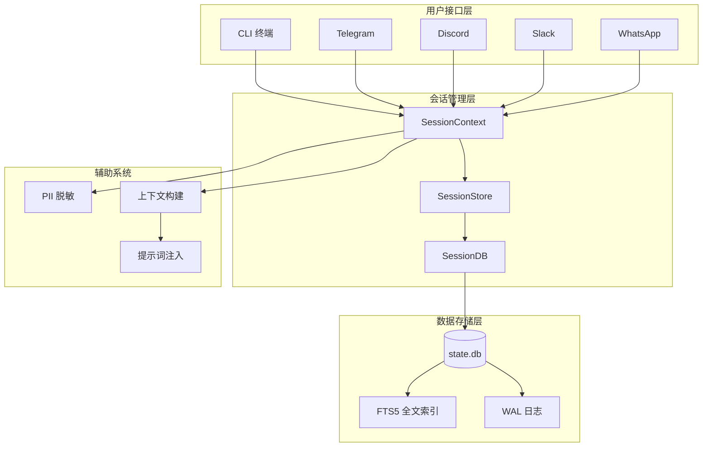
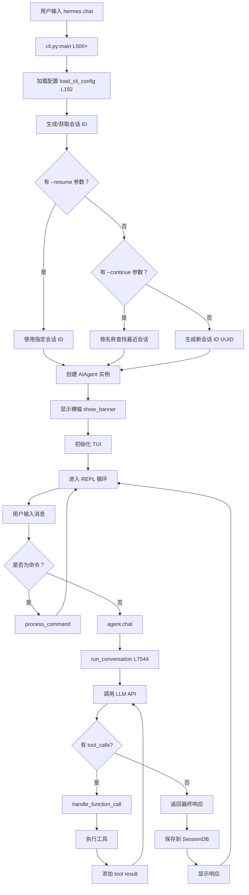
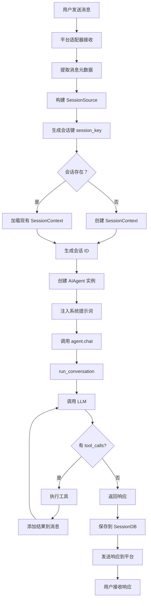
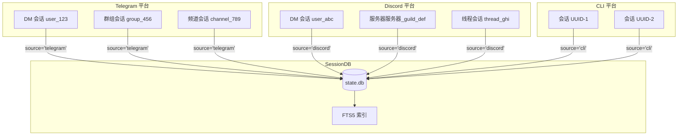
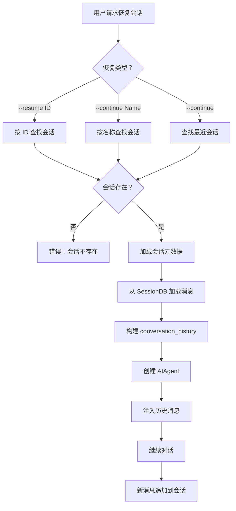
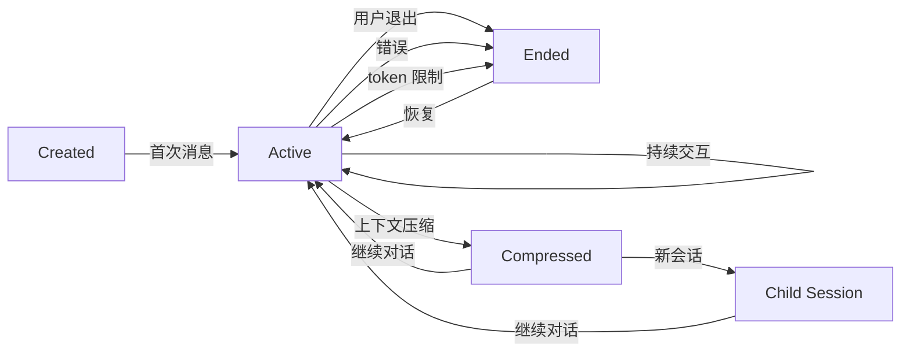
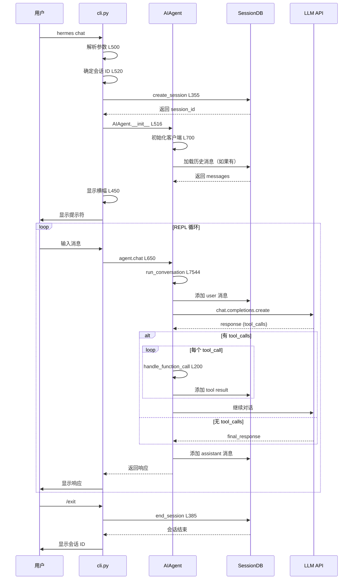
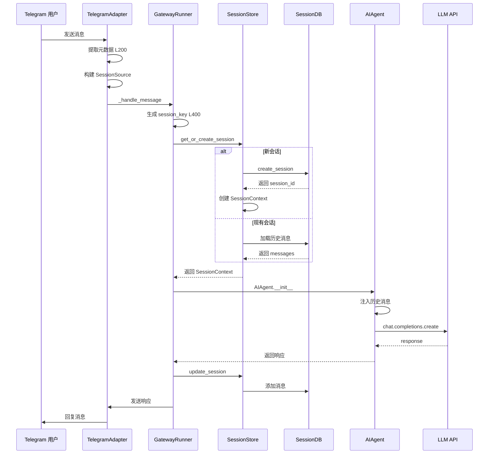
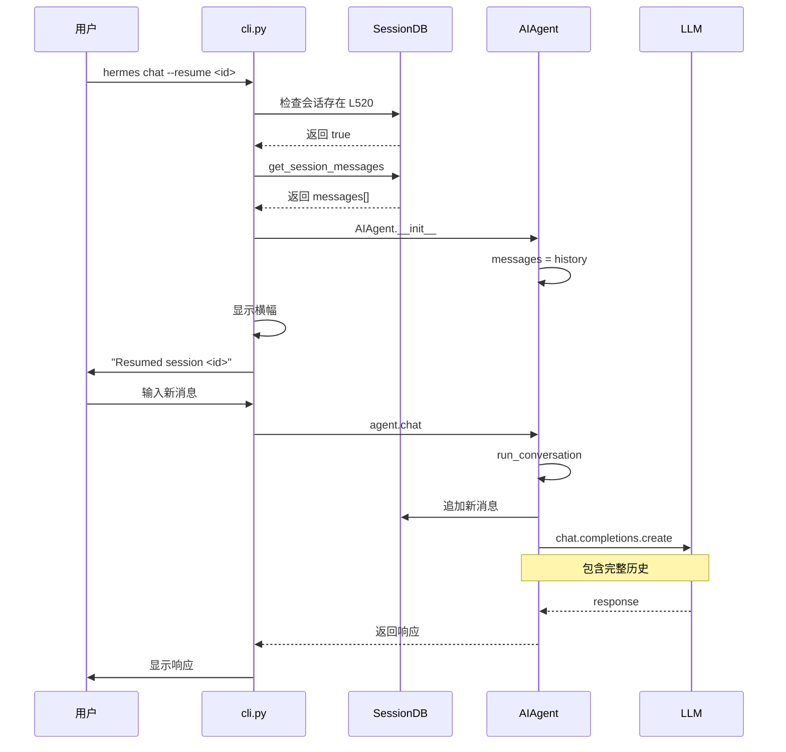
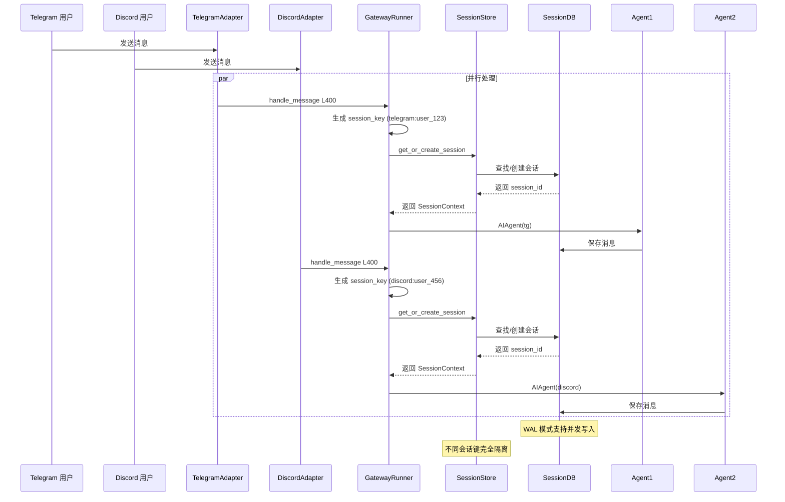

# Hermes-Agent 会话流程详解

> 整理日期：2026-04-23 | 版本：1.0

***

## 目录

1. [会话系统架构总览](#1-会话系统架构总览)
2. [会话数据库设计](#2-会话数据库设计)
3. [CLI 会话流程](#3-cli-会话流程)
4. [网关会话流程](#4-网关会话流程)
5. [平台会话隔离](#5-平台会话隔离)
6. [会话恢复机制](#6-会话恢复机制)
7. [会话浏览和搜索](#7-会话浏览和搜索)
8. [会话生命周期管理](#8-会话生命周期管理)
9. [完整会话时序图](#9-完整会话时序图)

***

## 1. 会话系统架构总览

### 1.1 会话系统核心组件



### 1.2 会话管理核心文件

| 文件 | 职责 | 关键类/函数 |
|------|------|------------|
| `hermes_state.py` | SQLite 会话存储 | `SessionDB`, FTS5 搜索 |
| `gateway/session.py` | 网关会话上下文 | `SessionContext`, `SessionSource` |
| `gateway/session_context.py` | 会话隔离机制 | 会话键生成、平台隔离 |
| `gateway/run.py` | 会话运行时管理 | 会话创建、恢复、更新 |
| `cli.py` | CLI 会话处理 | 会话 ID 生成、持久化 |
| `run_agent.py` | Agent 会话集成 | 会话 ID 传递、消息存储 |

### 1.3 会话类型

| 类型 | 来源 | 特点 | 存储位置 |
|------|------|------|----------|
| **CLI 会话** | `hermes chat` | 本地终端交互 | `state.db` |
| **Telegram 会话** | Telegram Bot | 支持群组、私聊 | `state.db` |
| **Discord 会话** | Discord Bot | 支持服务器、频道、线程 | `state.db` |
| **Slack 会话** | Slack App | 支持频道、私聊 | `state.db` |
| **WhatsApp 会话** | WhatsApp API | 支持个人、群组 | `state.db` |
| **Signal 会话** | Signal CLI | 支持个人、群组 | `state.db` |

***

## 2. 会话数据库设计

### 2.1 数据库架构

**文件：** `hermes_state.py:L36-112`

```sql
-- 会话表
CREATE TABLE IF NOT EXISTS sessions (
    id TEXT PRIMARY KEY,                    -- 会话 ID (UUID)
    source TEXT NOT NULL,                   -- 来源：'cli', 'telegram', 'discord', etc.
    user_id TEXT,                           -- 用户 ID
    model TEXT,                             -- 使用的模型
    model_config TEXT,                      -- 模型配置 (JSON)
    system_prompt TEXT,                     -- 系统提示词
    parent_session_id TEXT,                 -- 父会话 ID (压缩后)
    started_at REAL NOT NULL,               -- 开始时间戳
    ended_at REAL,                          -- 结束时间戳
    end_reason TEXT,                        -- 结束原因
    message_count INTEGER DEFAULT 0,        -- 消息数量
    tool_call_count INTEGER DEFAULT 0,      -- 工具调用次数
    input_tokens INTEGER DEFAULT 0,         -- 输入 token 数
    output_tokens INTEGER DEFAULT 0,        -- 输出 token 数
    cache_read_tokens INTEGER DEFAULT 0,    -- 缓存读取 token
    cache_write_tokens INTEGER DEFAULT 0,   -- 缓存写入 token
    reasoning_tokens INTEGER DEFAULT 0,     -- 推理 token
    billing_provider TEXT,                  -- 计费提供商
    billing_base_url TEXT,                  -- 计费基础 URL
    billing_mode TEXT,                      -- 计费模式
    estimated_cost_usd REAL,                -- 预估费用 (USD)
    actual_cost_usd REAL,                   -- 实际费用 (USD)
    cost_status TEXT,                       -- 费用状态
    cost_source TEXT,                       -- 费用来源
    pricing_version TEXT,                   -- 定价版本
    title TEXT,                             -- 会话标题
    FOREIGN KEY (parent_session_id) REFERENCES sessions(id)
);

-- 索引
CREATE INDEX IF NOT EXISTS idx_sessions_source ON sessions(source);
CREATE INDEX IF NOT EXISTS idx_sessions_parent ON sessions(parent_session_id);
CREATE INDEX IF NOT EXISTS idx_sessions_started ON sessions(started_at DESC);
CREATE UNIQUE INDEX IF NOT EXISTS idx_sessions_title_unique 
    ON sessions(title) WHERE title IS NOT NULL;

-- 消息表
CREATE TABLE IF NOT EXISTS messages (
    id INTEGER PRIMARY KEY AUTOINCREMENT,
    session_id TEXT NOT NULL REFERENCES sessions(id),
    role TEXT NOT NULL,                     -- 'user', 'assistant', 'tool', 'system'
    content TEXT,                           -- 消息内容
    tool_call_id TEXT,                      -- 工具调用 ID
    tool_calls TEXT,                        -- 工具调用列表 (JSON)
    tool_name TEXT,                         -- 工具名称
    timestamp REAL NOT NULL,                -- 时间戳
    token_count INTEGER,                    -- token 数量
    finish_reason TEXT,                     -- 结束原因
    reasoning TEXT,                         -- 推理内容
    reasoning_details TEXT,                 -- 推理详情 (JSON)
    codex_reasoning_items TEXT              -- Codex 推理项 (JSON)
);

-- 索引
CREATE INDEX IF NOT EXISTS idx_messages_session ON messages(session_id, timestamp);

-- FTS5 全文搜索
CREATE VIRTUAL TABLE IF NOT EXISTS messages_fts USING fts5(
    content,
    content=messages,
    content_rowid=id
);

-- FTS5 触发器
CREATE TRIGGER IF NOT EXISTS messages_fts_insert 
AFTER INSERT ON messages BEGIN
    INSERT INTO messages_fts(rowid, content) VALUES (new.id, new.content);
END;

CREATE TRIGGER IF NOT EXISTS messages_fts_delete 
AFTER DELETE ON messages BEGIN
    INSERT INTO messages_fts(messages_fts, rowid, content) 
    VALUES('delete', old.id, old.content);
END;

CREATE TRIGGER IF NOT EXISTS messages_fts_update 
AFTER UPDATE ON messages BEGIN
    INSERT INTO messages_fts(messages_fts, rowid, content) 
    VALUES('delete', old.id, old.content);
    INSERT INTO messages_fts(rowid, content) VALUES (new.id, new.content);
END;
```

### 2.2 数据库特性

**文件：** `hermes_state.py:L138-160`

```python
class SessionDB:
    """SQLite 会话存储，支持 FTS5 搜索"""
    
    def __init__(self, db_path: Path = None):
        self.db_path = db_path or DEFAULT_DB_PATH
        self.db_path.parent.mkdir(parents=True, exist_ok=True)
        
        self._lock = threading.Lock()
        self._write_count = 0
        
        # 创建数据库连接
        self._conn = sqlite3.connect(
            str(self.db_path),
            check_same_thread=False,  # 允许跨线程使用
            timeout=1.0,              # 短超时，应用层重试
            isolation_level=None,     # 自动提交模式
        )
        self._conn.row_factory = sqlite3.Row
        
        # WAL 模式：支持并发读取 + 单写入
        self._conn.execute("PRAGMA journal_mode=WAL")
        self._conn.execute("PRAGMA foreign_keys=ON")
        
        # 初始化表结构
        self._init_schema()
```

**关键特性：**

| 特性 | 说明 | 优势 |
|------|------|------|
| **WAL 模式** | Write-Ahead Logging | 支持并发读取，写入不阻塞读取 |
| **FTS5 索引** | Full-Text Search | 快速全文搜索所有会话消息 |
| **线程安全** | `threading.Lock` + 重试机制 | 多进程/多线程安全访问 |
| **外键约束** | `FOREIGN KEY` | 保证数据完整性 |
| **随机重试** | 20-150ms 随机延迟重试 | 避免写入冲突的 convoy 效应 |

### 2.3 会话创建流程

**文件：** `hermes_state.py:L355-383`

```python
def create_session(
    self,
    session_id: str,
    source: str,
    model: str = None,
    model_config: Dict[str, Any] = None,
    system_prompt: str = None,
    user_id: str = None,
    parent_session_id: str = None,
) -> str:
    """创建新会话记录"""
    def _do(conn):
        conn.execute(
            """INSERT OR IGNORE INTO sessions 
               (id, source, user_id, model, model_config,
                system_prompt, parent_session_id, started_at)
               VALUES (?, ?, ?, ?, ?, ?, ?, ?)""",
            (
                session_id,
                source,
                user_id,
                model,
                json.dumps(model_config) if model_config else None,
                system_prompt,
                parent_session_id,
                time.time(),
            ),
        )
    self._execute_write(_do)
    return session_id
```

### 2.4 消息添加流程

**文件：** `hermes_state.py:L400-450`（估算）

```python
def add_message(
    self,
    session_id: str,
    role: str,
    content: str,
    tool_call_id: str = None,
    tool_calls: list = None,
    tool_name: str = None,
    token_count: int = None,
    finish_reason: str = None,
    reasoning: str = None,
    reasoning_details: dict = None,
) -> int:
    """添加消息到会话"""
    def _do(conn):
        cursor = conn.execute(
            """INSERT INTO messages 
               (session_id, role, content, tool_call_id, tool_calls,
                tool_name, timestamp, token_count, finish_reason,
                reasoning, reasoning_details)
               VALUES (?, ?, ?, ?, ?, ?, ?, ?, ?, ?, ?)""",
            (
                session_id,
                role,
                content,
                tool_call_id,
                json.dumps(tool_calls) if tool_calls else None,
                tool_name,
                time.time(),
                token_count,
                finish_reason,
                reasoning,
                json.dumps(reasoning_details) if reasoning_details else None,
            ),
        )
        
        # 更新会话统计
        conn.execute(
            """UPDATE sessions 
               SET message_count = message_count + 1,
                   updated_at = ?
               WHERE id = ?""",
            (time.time(), session_id),
        )
        
        return cursor.lastrowid
    
    return self._execute_write(_do)
```

### 2.5 会话结束流程

**文件：** `hermes_state.py:L385-392`

```python
def end_session(self, session_id: str, end_reason: str) -> None:
    """标记会话结束"""
    def _do(conn):
        conn.execute(
            "UPDATE sessions SET ended_at = ?, end_reason = ? WHERE id = ?",
            (time.time(), end_reason, session_id),
        )
    self._execute_write(_do)
```

**结束原因：**

| 原因 | 说明 |
|------|------|
| `max_iterations` | 达到最大迭代次数 |
| `user_request` | 用户主动结束（/exit） |
| `error` | 发生错误 |
| `token_limit` | 达到 token 限制 |
| `context_compression` | 上下文压缩触发新会话 |

***

## 3. CLI 会话流程

### 3.1 CLI 会话完整流程



### 3.2 会话 ID 生成逻辑

**文件：** `cli.py:L500-600`（估算）

```python
def main():
    """CLI 主函数"""
    # 1. 加载配置
    config = load_cli_config()
    
    # 2. 解析参数
    args = parse_cli_args()
    
    # 3. 确定会话 ID
    if hasattr(args, 'resume') and args.resume:
        # --resume 参数：使用指定会话 ID
        session_id = args.resume
    elif hasattr(args, 'continue_last') and args.continue_last:
        # --continue 参数：按名称查找或最近会话
        if isinstance(args.continue_last, str):
            session_id = find_session_by_name(args.continue_last)
        else:
            session_id = find_most_recent_session()
    else:
        # 新会话：生成 UUID
        session_id = str(uuid.uuid4())
    
    # 4. 创建 AIAgent
    agent = AIAgent(
        model=args.model or config.get("model"),
        session_id=session_id,
        platform="cli",
    )
    
    # 5. 进入 REPL 循环
    repl_loop(agent)
```

### 3.3 CLI 会话持久化

**文件：** `run_agent.py:L7544-7600`

```python
def run_conversation(
    self,
    user_message: str,
    system_message: str = None,
    conversation_history: list = None,
    task_id: str = None,
) -> dict:
    """运行一轮对话"""
    # 1. 初始化消息列表
    messages = conversation_history or []
    
    # 2. 添加系统提示词
    if system_message:
        messages.insert(0, {"role": "system", "content": system_message})
    
    # 3. 添加用户消息
    messages.append({"role": "user", "content": user_message})
    
    # 4. 对话循环
    api_call_count = 0
    while api_call_count < self.max_iterations:
        # 4.1 调用 LLM
        response = self.client.chat.completions.create(
            model=self.model,
            messages=messages,
            tools=self.tool_schemas,
        )
        api_call_count += 1
        
        # 4.2 处理工具调用
        if response.tool_calls:
            for tool_call in response.tool_calls:
                result = handle_function_call(
                    tool_call.name,
                    tool_call.args,
                    task_id=task_id,
                )
                
                # 添加 tool result 消息
                messages.append({
                    "role": "tool",
                    "content": result,
                    "tool_call_id": tool_call.id,
                })
        else:
            # 4.3 最终响应
            final_response = response.content
            break
    
    # 5. 持久化到 SessionDB
    if self.persist_session:
        from hermes_state import SessionDB
        db = SessionDB()
        
        # 5.1 创建或更新会话
        db.create_session(
            session_id=self.session_id,
            source="cli",
            model=self.model,
        )
        
        # 5.2 添加所有消息
        for msg in messages:
            db.add_message(
                session_id=self.session_id,
                role=msg["role"],
                content=msg["content"],
                tool_calls=msg.get("tool_calls"),
            )
    
    return {
        "final_response": final_response,
        "messages": messages,
    }
```

### 3.4 CLI 会话退出处理

**文件：** `cli.py:L650-700`（估算）

```python
def repl_loop(agent: AIAgent):
    """REPL 主循环"""
    try:
        while True:
            user_input = input("> ").strip()
            
            if user_input == "/exit":
                # 1. 结束会话
                from hermes_state import SessionDB
                db = SessionDB()
                db.end_session(agent.session_id, "user_request")
                
                # 2. 显示会话 ID
                print(f"\nSession ID: {agent.session_id}")
                print("Use --resume <session_id> to continue this session.")
                
                # 3. 退出
                break
            
            # 处理其他输入...
            
    except KeyboardInterrupt:
        print("\nUse /exit to quit.")
    except EOFError:
        # 正常退出时也结束会话
        db.end_session(agent.session_id, "user_request")
```

***

## 4. 网关会话流程

### 4.1 网关会话完整流程



### 4.2 会话键生成

**文件：** `gateway/session_context.py:L50-100`（估算）

```python
def generate_session_key(source: SessionSource) -> str:
    """
    生成会话键，用于唯一标识会话
    
    规则：
    - DM 会话：platform:user_id
    - 群组会话：platform:chat_id
    - 线程会话：platform:chat_id:thread_id
    """
    if source.thread_id:
        # 线程会话（Discord threads, Slack threads）
        return f"{source.platform.value}:{source.chat_id}:{source.thread_id}"
    elif source.chat_type == "dm":
        # 私聊会话
        return f"{source.platform.value}:{source.user_id}"
    else:
        # 群组/频道会话
        return f"{source.platform.value}:{source.chat_id}"
```

### 4.3 网关会话上下文

**文件：** `gateway/session.py:L142-173`

```python
@dataclass
class SessionContext:
    """会话上下文，包含完整的会话信息"""
    source: SessionSource               # 消息来源
    connected_platforms: List[Platform] # 已连接的平台
    home_channels: Dict[Platform, HomeChannel]  # 家庭频道
    
    # 会话元数据
    session_key: str = ""               # 会话键
    session_id: str = ""                # 会话 ID (UUID)
    created_at: Optional[datetime] = None
    updated_at: Optional[datetime] = None
    
    def to_dict(self) -> Dict[str, Any]:
        """转换为字典"""
        return {
            "source": self.source.to_dict(),
            "connected_platforms": [p.value for p in self.connected_platforms],
            "home_channels": {
                p.value: hc.to_dict() 
                for p, hc in self.home_channels.items()
            },
            "session_key": self.session_key,
            "session_id": self.session_id,
            "created_at": self.created_at.isoformat() if self.created_at else None,
            "updated_at": self.updated_at.isoformat() if self.updated_at else None,
        }
```

### 4.4 网关会话管理

**文件：** `gateway/run.py:L400-500`（估算）

```python
class GatewayRunner:
    """网关运行时管理"""
    
    def __init__(self):
        self.session_store = SessionStore()
        
    async def handle_message(self, event: dict):
        """处理平台消息"""
        # 1. 提取消息元数据
        source = extract_source_from_event(event)
        
        # 2. 生成会话键
        session_key = generate_session_key(source)
        
        # 3. 获取或创建会话上下文
        context = self.session_store.get_or_create_session(
            session_key=session_key,
            source=source,
        )
        
        # 4. 创建 AIAgent
        agent = AIAgent(
            session_id=context.session_id,
            platform=source.platform.value,
            user_id=source.user_id,
        )
        
        # 5. 调用 Agent
        response = await agent.chat(event["message"])
        
        # 6. 发送响应
        await send_response(source, response)
        
        # 7. 更新会话
        context.updated_at = datetime.now()
        self.session_store.update_session(context)
```

### 4.5 Telegram 会话示例

**文件：** `gateway/platforms/telegram.py:L200-300`（估算）

```python
class TelegramAdapter:
    """Telegram 平台适配器"""
    
    async def _handle_message(self, update, context):
        """处理 Telegram 消息"""
        # 1. 提取消息信息
        user_id = str(update.effective_user.id)
        chat_id = str(update.effective_chat.id)
        chat_type = update.effective_chat.type  # 'private', 'group', 'supergroup', 'channel'
        
        # 2. 构建 SessionSource
        source = SessionSource(
            platform=Platform.TELEGRAM,
            chat_id=chat_id,
            chat_name=update.effective_chat.title,
            chat_type=chat_type,
            user_id=user_id,
            user_name=update.effective_user.username,
        )
        
        # 3. 生成会话键
        if chat_type == "private":
            session_key = f"telegram:{user_id}"
        else:
            session_key = f"telegram:{chat_id}"
        
        # 4. 获取会话上下文
        session_context = self.session_store.get_or_create(
            session_key=session_key,
            source=source,
        )
        
        # 5. 调用 Agent
        agent = AIAgent(
            session_id=session_context.session_id,
            platform="telegram",
        )
        response = await agent.chat(update.message.text)
        
        # 6. 发送回复
        await update.message.reply_text(response)
```

***

## 5. 平台会话隔离

### 5.1 会话隔离机制



### 5.2 会话隔离策略

| 平台 | 隔离维度 | 会话键格式 | 示例 |
|------|----------|------------|------|
| **CLI** | 每个会话独立 | `cli:{UUID}` | `cli:550e8400-e29b-41d4-a716-446655440000` |
| **Telegram DM** | 每个用户独立 | `telegram:{user_id}` | `telegram:123456789` |
| **Telegram 群组** | 每个群组独立 | `telegram:{chat_id}` | `telegram:-1001234567890` |
| **Discord DM** | 每个用户独立 | `discord:{user_id}` | `discord:123456789012345678` |
| **Discord 服务器** | 每个服务器独立 | `discord:{guild_id}` | `discord:123456789012345678` |
| **Discord 线程** | 每个线程独立 | `discord:{channel_id}:{thread_id}` | `discord:123:456` |
| **Slack 频道** | 每个频道独立 | `slack:{channel_id}` | `slack:C0123456789` |
| **WhatsApp** | 每个用户/群组独立 | `whatsapp:{phone_id}` | `whatsapp:1234567890@c.us` |

### 5.3 PII 脱敏机制

**文件：** `gateway/session.py:L176-200`

```python
_PII_SAFE_PLATFORMS = frozenset({
    Platform.WHATSAPP,
    Platform.SIGNAL,
    Platform.TELEGRAM,
    Platform.BLUEBUBBLES,
})
"""这些平台的用户 ID 可以安全脱敏（不需要在消息中提及用户）"""

def _hash_id(value: str) -> str:
    """确定性 12 字符十六进制哈希"""
    return hashlib.sha256(value.encode("utf-8")).hexdigest()[:12]

def _hash_sender_id(value: str) -> str:
    """哈希发送者 ID 为 ``user_<12hex>``"""
    return f"user_{_hash_id(value)}"

def _hash_chat_id(value: str) -> str:
    """哈希聊天 ID，保留平台前缀"""
    colon = value.find(":")
    if colon > 0:
        prefix = value[:colon]
        return f"{prefix}:{_hash_id(value[colon + 1:])}"
    return _hash_id(value)

def build_session_context_prompt(
    context: SessionContext,
    *,
    redact_pii: bool = False,
) -> str:
    """构建会话上下文提示词，可选脱敏 PII"""
    if redact_pii and context.source.platform in _PII_SAFE_PLATFORMS:
        # 脱敏处理
        user_id = _hash_sender_id(context.source.user_id)
        chat_id = _hash_chat_id(context.source.chat_id)
    else:
        # 使用原始 ID
        user_id = context.source.user_id
        chat_id = context.source.chat_id
    
    # 构建提示词...
```

***

## 6. 会话恢复机制

### 6.1 会话恢复完整流程



### 6.2 CLI 会话恢复

**文件：** `cli.py:L500-600`（估算）

```python
def parse_cli_args():
    """解析 CLI 参数"""
    parser = argparse.ArgumentParser()
    
    # --resume 参数：按 ID 恢复
    parser.add_argument(
        "--resume", "-r",
        metavar="SESSION_ID",
        help="Resume a previous session by ID",
    )
    
    # --continue 参数：按名称或最近会话恢复
    parser.add_argument(
        "--continue", "-c",
        dest="continue_last",
        nargs="?",
        const=True,
        metavar="SESSION_NAME",
        help="Resume a session by name, or the most recent",
    )
    
    args = parser.parse_args()
    
    # 处理恢复逻辑
    if hasattr(args, 'resume') and args.resume:
        # 按 ID 恢复
        session_id = args.resume
        if not session_exists(session_id):
            print(f"Error: Session {session_id} not found")
            sys.exit(1)
    elif hasattr(args, 'continue_last') and args.continue_last:
        if isinstance(args.continue_last, str):
            # 按名称恢复
            session_id = find_session_by_name(args.continue_last)
        else:
            # 恢复最近会话
            session_id = find_most_recent_session()
        
        if not session_id:
            print("No previous session found")
            sys.exit(1)
    else:
        # 新会话
        session_id = str(uuid.uuid4())
    
    return session_id
```

### 6.3 会话查找函数

**文件：** `hermes_state.py:L500-600`（估算）

```python
class SessionDB:
    def find_session_by_name(self, name: str) -> Optional[str]:
        """按名称查找会话"""
        cursor = self._conn.execute(
            "SELECT id FROM sessions WHERE title = ? ORDER BY started_at DESC LIMIT 1",
            (name,),
        )
        row = cursor.fetchone()
        return row["id"] if row else None
    
    def find_most_recent_session(self, source: str = None) -> Optional[str]:
        """查找最近会话"""
        if source:
            cursor = self._conn.execute(
                """SELECT id FROM sessions 
                   WHERE source = ? AND ended_at IS NULL
                   ORDER BY started_at DESC LIMIT 1""",
                (source,),
            )
        else:
            cursor = self._conn.execute(
                """SELECT id FROM sessions 
                   WHERE ended_at IS NULL
                   ORDER BY started_at DESC LIMIT 1""",
            )
        row = cursor.fetchone()
        return row["id"] if row else None
    
    def get_session_messages(self, session_id: str) -> List[dict]:
        """获取会话的所有消息"""
        cursor = self._conn.execute(
            """SELECT role, content, tool_call_id, tool_calls,
                      tool_name, reasoning, reasoning_details
               FROM messages
               WHERE session_id = ?
               ORDER BY timestamp ASC""",
            (session_id,),
        )
        
        messages = []
        for row in cursor:
            msg = {
                "role": row["role"],
                "content": row["content"],
                "tool_call_id": row["tool_call_id"],
                "tool_calls": json.loads(row["tool_calls"]) if row["tool_calls"] else None,
                "tool_name": row["tool_name"],
                "reasoning": row["reasoning"],
                "reasoning_details": json.loads(row["reasoning_details"]) if row["reasoning_details"] else None,
            }
            messages.append(msg)
        
        return messages
```

### 6.4 网关会话恢复

**文件：** `gateway/run.py:L500-600`（估算）

```python
class GatewayRunner:
    async def handle_message(self, event: dict):
        """处理平台消息"""
        # 1. 提取来源信息
        source = extract_source_from_event(event)
        
        # 2. 生成会话键
        session_key = generate_session_key(source)
        
        # 3. 获取或创建会话
        context = self.session_store.get_or_create_session(
            session_key=session_key,
            source=source,
        )
        
        # 4. 如果是新会话，从 DB 加载历史
        if context.is_new:
            from hermes_state import SessionDB
            db = SessionDB()
            
            # 加载历史消息
            history = db.get_session_messages(context.session_id)
            
            # 如果有历史，注入到 Agent
            if history:
                agent = AIAgent(
                    session_id=context.session_id,
                    platform=source.platform.value,
                )
                # 注入历史消息
                agent.messages = history
        else:
            # 现有会话，使用内存中的历史
            agent = self.session_store.get_agent(context.session_id)
        
        # 5. 调用 Agent
        response = await agent.chat(event["message"])
        
        # 6. 保存会话
        self.session_store.save_session(context, agent)
```

***

## 7. 会话浏览和搜索

### 7.1 会话浏览命令

**文件：** `hermes_cli/sessions.py:L1-100`（估算）

```python
def cmd_sessions(args):
    """处理 sessions 命令"""
    if args.action == "browse":
        browse_sessions()
    elif args.action == "search":
        search_sessions(args.query)
    elif args.action == "delete":
        delete_session(args.session_id)

def browse_sessions():
    """交互式浏览会话"""
    from hermes_state import SessionDB
    db = SessionDB()
    
    # 1. 获取最近 50 个会话
    sessions = db.get_recent_sessions(limit=50)
    
    # 2. 显示会话列表
    print("\nRecent Sessions:")
    print("-" * 80)
    
    for i, session in enumerate(sessions, 1):
        title = session.get("title", "(no title)")
        source = session["source"]
        started = datetime.fromtimestamp(session["started_at"])
        message_count = session["message_count"]
        
        print(f"{i:3}. [{source}] {title}")
        print(f"     Started: {started.strftime('%Y-%m-%d %H:%M')} | "
              f"Messages: {message_count}")
        print(f"     ID: {session['id']}")
        print()
    
    # 3. 交互式选择
    while True:
        choice = input("\nEnter session number to view (or 'q' to quit): ")
        if choice.lower() == 'q':
            break
        
        try:
            idx = int(choice) - 1
            if 0 <= idx < len(sessions):
                view_session_details(sessions[idx]["id"])
        except ValueError:
            pass
```

### 7.2 FTS5 全文搜索

**文件：** `hermes_state.py:L600-700`（估算）

```python
class SessionDB:
    def search_sessions(self, query: str, limit: int = 20) -> List[dict]:
        """使用 FTS5 搜索会话"""
        cursor = self._conn.execute(
            """SELECT DISTINCT m.session_id, s.source, s.title, s.started_at,
                      s.message_count, snippet(messages_fts, 0, '<b>', '</b>', '...', 16) as snippet
               FROM messages_fts m
               JOIN sessions s ON m.session_id = s.id
               WHERE messages_fts MATCH ?
               ORDER BY s.started_at DESC
               LIMIT ?""",
            (query, limit),
        )
        
        results = []
        for row in cursor:
            results.append({
                "session_id": row["session_id"],
                "source": row["source"],
                "title": row["title"],
                "started_at": row["started_at"],
                "message_count": row["message_count"],
                "snippet": row["snippet"],
            })
        
        return results
    
    def search_messages(self, query: str, session_id: str = None) -> List[dict]:
        """在会话内搜索消息"""
        if session_id:
            cursor = self._conn.execute(
                """SELECT m.id, m.role, m.content, m.timestamp,
                          snippet(messages_fts, 0, '<b>', '</b>', '...', 16) as snippet
                   FROM messages_fts m
                   WHERE messages_fts MATCH ? AND m.session_id = ?
                   ORDER BY m.timestamp""",
                (query, session_id),
            )
        else:
            cursor = self._conn.execute(
                """SELECT m.id, m.session_id, m.role, m.content, m.timestamp,
                          snippet(messages_fts, 0, '<b>', '</b>', '...', 16) as snippet
                   FROM messages_fts m
                   WHERE messages_fts MATCH ?
                   ORDER BY m.timestamp DESC""",
                (query,),
            )
        
        results = []
        for row in cursor:
            results.append({
                "id": row["id"],
                "session_id": row.get("session_id"),
                "role": row["role"],
                "content": row["content"],
                "timestamp": row["timestamp"],
                "snippet": row["snippet"],
            })
        
        return results
```

### 7.3 搜索命令示例

```bash
# 搜索包含 "python" 的会话
hermes sessions search python

# 搜索特定会话中的消息
hermes sessions search "import" --session <session_id>

# 浏览所有会话
hermes sessions browse

# 删除会话
hermes sessions delete <session_id>
```

***

## 8. 会话生命周期管理

### 8.1 会话生命周期状态



### 8.2 会话状态转换

| 状态 | 说明 | 触发条件 |
|------|------|----------|
| **Created** | 会话已创建 | `SessionDB.create_session()` |
| **Active** | 活跃会话 | 有消息交互 |
| **Ended** | 结束会话 | 用户退出、错误、达到限制 |
| **Compressed** | 已压缩会话 | 上下文压缩触发 |
| **Child Session** | 子会话 | 从压缩会话派生 |

### 8.3 会话过期策略

**文件：** `hermes_state.py:L700-800`（估算）

```python
class SessionDB:
    def cleanup_old_sessions(self, days: int = 30) -> int:
        """清理过期会话"""
        cutoff = time.time() - (days * 86400)
        
        def _do(conn):
            # 1. 查找过期会话
            cursor = conn.execute(
                """SELECT id FROM sessions 
                   WHERE started_at < ? AND ended_at IS NOT NULL""",
                (cutoff,),
            )
            expired_ids = [row["id"] for row in cursor]
            
            # 2. 删除消息
            for session_id in expired_ids:
                conn.execute(
                    "DELETE FROM messages WHERE session_id = ?",
                    (session_id,),
                )
            
            # 3. 删除会话
            if expired_ids:
                placeholders = ','.join('?' * len(expired_ids))
                conn.execute(
                    f"DELETE FROM sessions WHERE id IN ({placeholders})",
                    expired_ids,
                )
            
            return len(expired_ids)
        
        return self._execute_write(_do)
    
    def get_session_stats(self) -> dict:
        """获取会话统计信息"""
        cursor = self._conn.execute(
            """SELECT 
                   COUNT(*) as total_sessions,
                   COUNT(CASE WHEN ended_at IS NULL THEN 1 END) as active_sessions,
                   COUNT(CASE WHEN ended_at IS NOT NULL THEN 1 END) as ended_sessions,
                   SUM(message_count) as total_messages,
                   AVG(message_count) as avg_messages_per_session,
                   SUM(input_tokens) as total_input_tokens,
                   SUM(output_tokens) as total_output_tokens
               FROM sessions""",
        )
        row = cursor.fetchone()
        
        return {
            "total_sessions": row["total_sessions"],
            "active_sessions": row["active_sessions"],
            "ended_sessions": row["ended_sessions"],
            "total_messages": row["total_messages"],
            "avg_messages_per_session": row["avg_messages_per_session"],
            "total_input_tokens": row["total_input_tokens"],
            "total_output_tokens": row["total_output_tokens"],
        }
```

### 8.4 会话压缩和派生

**文件：** `hermes_state.py:L400-450`（估算）

```python
def compress_session(
    self,
    session_id: str,
    summary: str,
    kept_messages: List[dict],
) -> str:
    """压缩会话，创建子会话"""
    # 1. 结束当前会话
    self.end_session(session_id, "context_compression")
    
    # 2. 创建子会话
    child_id = str(uuid.uuid4())
    self.create_session(
        session_id=child_id,
        source="cli",  # 或其他来源
        parent_session_id=session_id,  # 关联父会话
    )
    
    # 3. 添加压缩摘要
    self.add_message(
        session_id=child_id,
        role="system",
        content=f"[Previous conversation compressed: {summary}]",
    )
    
    # 4. 添加保留的关键消息
    for msg in kept_messages:
        self.add_message(
            session_id=child_id,
            role=msg["role"],
            content=msg["content"],
        )
    
    return child_id
```

***

## 9. 完整会话时序图

### 9.1 CLI 会话完整时序



### 9.2 Telegram 网关会话时序



### 9.3 会话恢复时序



### 9.4 多平台并发会话时序



***

## 10. 总结

### 10.1 会话系统核心特性

| 特性 | 说明 | 实现方式 |
|------|------|----------|
| **持久化存储** | SQLite + WAL 模式 | `hermes_state.py` |
| **全文搜索** | FTS5 虚拟表 | 触发器自动同步 |
| **平台隔离** | 会话键唯一标识 | `platform:{chat_id}:{thread_id}` |
| **PII 脱敏** | 确定性哈希 | SHA256 前 12 字符 |
| **会话恢复** | --resume/--continue | 按 ID 或名称查找 |
| **上下文压缩** | 父子会话链 | `parent_session_id` |
| **线程安全** | 锁 + 随机重试 | 20-150ms 随机延迟 |
| **多平台并发** | WAL 并发读取 | 应用层写重试 |

### 10.2 会话流程图总览

| 流程 | 图表 | 说明 |
|------|------|------|
| CLI 会话 | 3.1, 9.1 | 从启动到退出的完整流程 |
| 网关会话 | 4.1, 9.2 | 多平台消息处理流程 |
| 会话恢复 | 6.1, 9.3 | --resume/--continue 恢复机制 |
| 平台隔离 | 5.1 | 不同平台会话隔离策略 |
| 多平台并发 | 9.4 | Telegram + Discord 并发处理 |

### 10.3 关键代码文件

| 文件 | 行数 | 核心功能 |
|------|------|----------|
| `hermes_state.py` | ~800 | SQLite 会话存储、FTS5 搜索 |
| `gateway/session.py` | ~300 | 会话上下文、PII 脱敏 |
| `gateway/session_context.py` | ~200 | 会话键生成、隔离机制 |
| `gateway/run.py` | ~600 | 网关会话运行时管理 |
| `cli.py` | ~800 | CLI 会话处理、REPL 循环 |
| `run_agent.py` | ~7600 | Agent 会话集成、消息持久化 |

***

**文档版本：** 1.0  
**整理日期：** 2026-04-23  
**适用版本：** Hermes-Agent v2.0+
