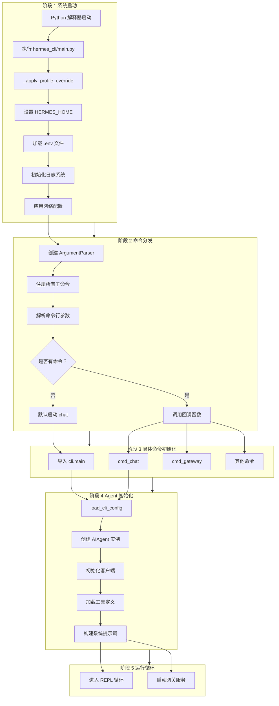
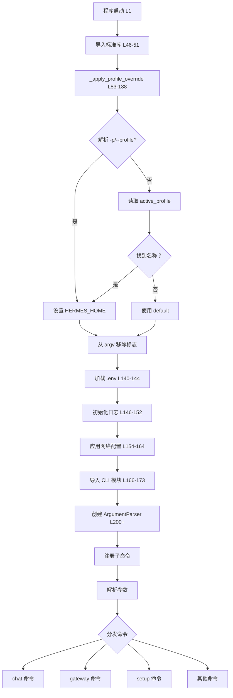
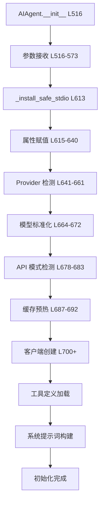
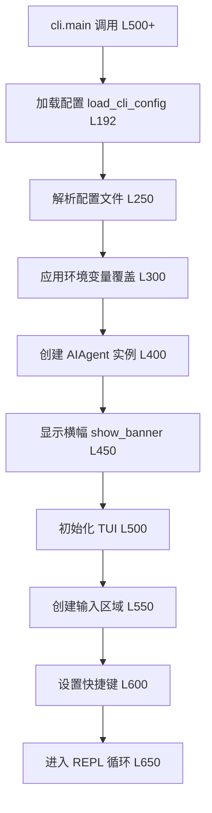
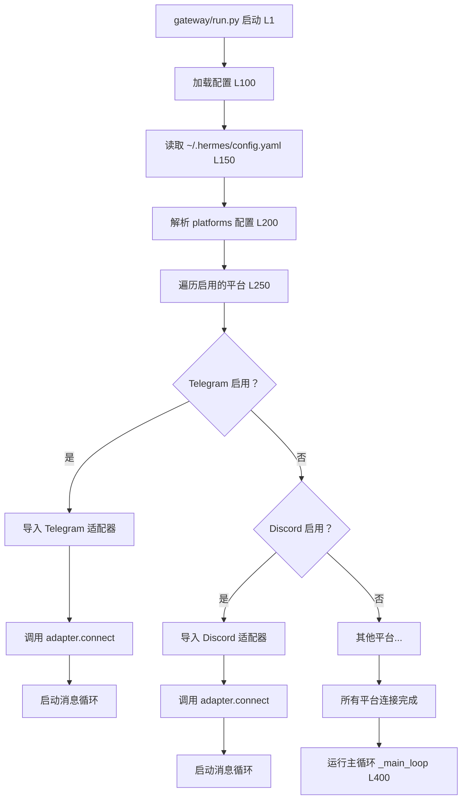
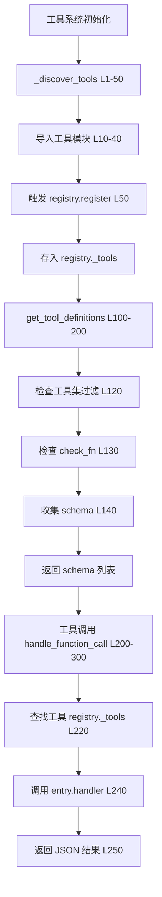
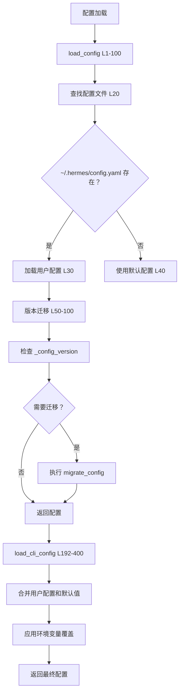
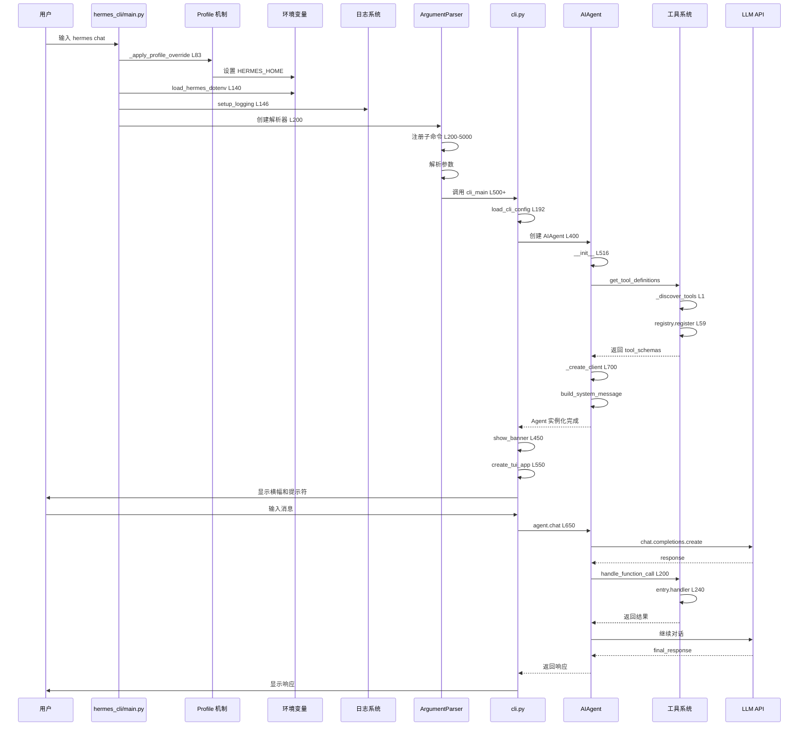
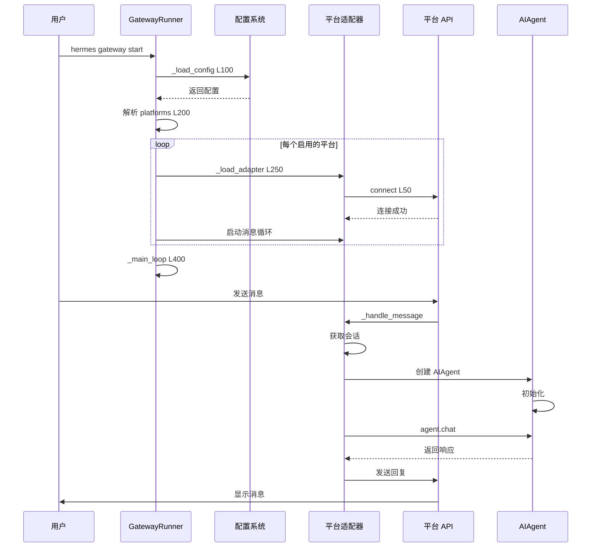
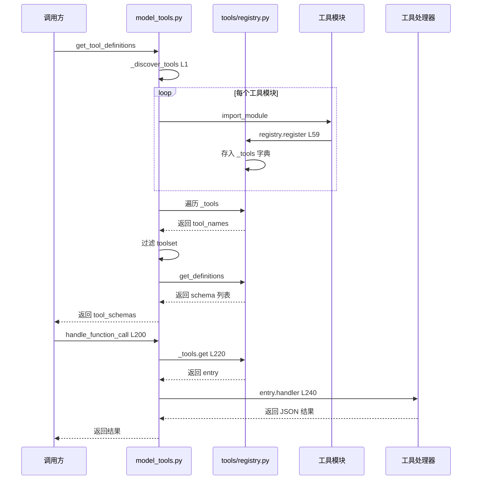

# Hermes-Agent 项目初始化流程详解

> 整理日期：2026-04-23 | 版本：1.0

***

## 目录

1. [初始化流程总览](#1-初始化流程总览)
2. [CLI 启动初始化](#2-cli-启动初始化)
3. [AIAgent 初始化](#3-aiagent-初始化)
4. [CLI 交互界面初始化](#4-cli-交互界面初始化)
5. [网关启动初始化](#5-网关启动初始化)
6. [工具系统初始化](#6-工具系统初始化)
7. [配置系统初始化](#7-配置系统初始化)
8. [初始化时序图](#8-初始化时序图)

***

## 1. 初始化流程总览

### 1.1 完整初始化链路



### 1.2 关键初始化模块

| 模块 | 文件 | 关键行数 | 职责 |
|------|------|----------|------|
| **CLI 入口** | `hermes_cli/main.py` | L83-138 | Profile 覆盖、环境变量加载 |
| **AIAgent** | `run_agent.py` | L500-800 | Agent 实例化、客户端创建 |
| **CLI 界面** | `cli.py` | L192-400 | 配置加载、界面初始化 |
| **网关** | `gateway/run.py` | L1-300 | 平台适配器启动 |
| **工具系统** | `model_tools.py` | L1-200 | 工具发现和注册 |
| **配置系统** | `hermes_cli/config.py` | L1-300 | 配置文件加载 |

***

## 2. CLI 启动初始化

### 2.1 完整初始化流程



### 2.2 Profile 覆盖机制（L83-138）

**代码位置：** `hermes_cli/main.py:83-138`

```python
def _apply_profile_override() -> None:
    """Pre-parse --profile/-p and set HERMES_HOME before module imports."""
    argv = sys.argv[1:]
    profile_name = None
    consume = 0

    # 1. 检查显式 -p / --profile 标志
    for i, arg in enumerate(argv):
        if arg in ("--profile", "-p") and i + 1 < len(argv):
            profile_name = argv[i + 1]
            consume = 2
            break
        elif arg.startswith("--profile="):
            profile_name = arg.split("=", 1)[1]
            consume = 1
            break

    # 2. 如果没有标志，检查 active_profile 文件
    if profile_name is None:
        try:
            from hermes_constants import get_default_hermes_root
            active_path = get_default_hermes_root() / "active_profile"
            if active_path.exists():
                name = active_path.read_text().strip()
                if name and name != "default":
                    profile_name = name
                    consume = 0  # 不从 argv 中移除任何内容
        except (UnicodeDecodeError, OSError):
            pass  # 文件损坏，跳过

    # 3. 如果找到 profile，解析并设置 HERMES_HOME
    if profile_name is not None:
        try:
            from hermes_cli.profiles import resolve_profile_env
            hermes_home = resolve_profile_env(profile_name)
        except (ValueError, FileNotFoundError) as exc:
            print(f"Error: {exc}", file=sys.stderr)
            sys.exit(1)
        except Exception as exc:
            print(f"Warning: profile override failed ({exc}), using default", file=sys.stderr)
            return
        os.environ["HERMES_HOME"] = hermes_home
        # 从 argv 中移除标志，防止 argparse 报错
        if consume > 0:
            # ... 移除逻辑
```

**调用时机：** L138 - 在所有模块导入之前

```python
_apply_profile_override()  # MUST happen before any hermes module import
```

### 2.3 环境变量加载（L140-144）

**代码位置：** `hermes_cli/main.py:140-144`

```python
from hermes_cli.config import get_hermes_home
from hermes_cli.env_loader import load_hermes_dotenv
load_hermes_dotenv(project_env=PROJECT_ROOT / '.env')
```

**加载逻辑：** `hermes_cli/env_loader.py:load_hermes_dotenv()`

```python
def load_hermes_dotenv(hermes_home: Path = None, project_env: Path = None):
    """按优先级加载 .env 文件"""
    # 1. 获取 HERMES_HOME
    if hermes_home is None:
        hermes_home = get_hermes_home()
    
    # 2. 加载用户 .env（最高优先级）
    user_env = hermes_home / ".env"
    if user_env.exists():
        load_dotenv(user_env)
    
    # 3. 加载项目 .env（开发 fallback）
    if project_env and project_env.exists():
        load_dotenv(project_env)
```

**加载顺序：**

```
系统环境变量 (最高)
    ↓
~/.hermes/.env (高)
    ↓
~/.hermes/profiles/<name>/.env (按 profile)
    ↓
项目根目录/.env (低)
```

### 2.4 日志系统初始化（L146-152）

**代码位置：** `hermes_cli/main.py:146-152`

```python
try:
    from hermes_logging import setup_logging as _setup_logging
    _setup_logging(mode="cli")
except Exception:
    pass  # 最佳努力 — 日志失败不崩溃
```

**日志文件位置：**

```
~/.hermes/
├── agent.log      # Agent 运行日志
└── errors.log     # 错误日志
```

### 2.5 网络配置应用（L154-164）

**代码位置：** `hermes_cli/main.py:154-164`

```python
try:
    from hermes_cli.config import load_config as _load_config_early
    from hermes_constants import apply_ipv4_preference as _apply_ipv4
    _early_cfg = _load_config_early()
    _net = _early_cfg.get("network", {})
    if isinstance(_net, dict) and _net.get("force_ipv4"):
        _apply_ipv4(force=True)
    del _early_cfg, _net
except Exception:
    pass  # 最佳努力
```

### 2.6 参数解析和命令分发（L200-5500）

**代码位置：** `hermes_cli/main.py:200-5500`

```python
def main():
    # 创建主解析器
    parser = argparse.ArgumentParser(
        prog="hermes",
        description="Hermes Agent - Your AI assistant",
    )
    
    # 创建子命令解析器
    subparsers = parser.add_subparsers(dest="command")
    
    # 注册所有子命令
    _setup_chat_parser(subparsers)      # L4500-4663
    _setup_gateway_parser(subparsers)   # L4715-4762
    _setup_setup_parser(subparsers)     # L4767-4790
    _setup_model_parser(subparsers)     # L4667-4710
    # ... 其他命令
    
    # 解析参数
    args = parser.parse_args()
    
    # 分发命令
    if hasattr(args, 'func'):
        args.func(args)  # 调用回调函数
    else:
        # 默认启动 chat
        from cli import main as cli_main
        cli_main()
```

***

## 3. AIAgent 初始化

### 3.1 完整初始化流程



### 3.2 初始化参数（L516-573）

**代码位置：** `run_agent.py:516-573`

```python
def __init__(
    self,
    base_url: str = None,
    api_key: str = None,
    provider: str = None,
    api_mode: str = None,
    model: str = "",
    max_iterations: int = 90,
    tool_delay: float = 1.0,
    enabled_toolsets: List[str] = None,
    disabled_toolsets: List[str] = None,
    save_trajectories: bool = False,
    verbose_logging: bool = False,
    quiet_mode: bool = False,
    session_id: str = None,
    platform: str = None,
    skip_context_files: bool = False,
    skip_memory: bool = False,
    checkpoints_enabled: bool = False,
    # ... 更多参数
):
    """初始化 AI Agent"""
```

### 3.3 核心初始化步骤

#### 步骤 1：安全标准 IO（L613）

```python
_install_safe_stdio()
```

**作用：** 确保标准 IO 在多线程环境下安全

#### 步骤 2：属性赋值（L615-640）

```python
self.model = model
self.max_iterations = max_iterations
self.iteration_budget = iteration_budget or IterationBudget(max_iterations)
self.tool_delay = tool_delay
self.save_trajectories = save_trajectories
self.verbose_logging = verbose_logging
self.quiet_mode = quiet_mode
self.platform = platform  # "cli", "telegram", "discord", etc.
self._user_id = user_id
self.skip_context_files = skip_context_files
self.pass_session_id = pass_session_id
self.persist_session = persist_session
```

#### 步骤 3：Provider 检测（L641-661）

```python
provider_name = provider.strip().lower() if isinstance(provider, str) and provider.strip() else None
self.provider = provider_name or ""

# API 模式自动检测
if api_mode in {"chat_completions", "codex_responses", "anthropic_messages"}:
    self.api_mode = api_mode
elif self.provider == "openai-codex":
    self.api_mode = "codex_responses"
elif self.provider == "anthropic":
    self.api_mode = "anthropic_messages"
else:
    self.api_mode = "chat_completions"
```

#### 步骤 4：模型标准化（L664-672）

```python
try:
    from hermes_cli.model_normalize import (
        _AGGREGATOR_PROVIDERS,
        normalize_model_for_provider,
    )
    
    if self.provider not in _AGGREGATOR_PROVIDERS:
        self.model = normalize_model_for_provider(self.model, self.provider)
except Exception:
    pass
```

#### 步骤 5：API 模式升级（L678-683）

```python
# GPT-5.x 和较新模型需要 Responses API
if self.api_mode == "chat_completions" and (
    self._is_direct_openai_url()
    or self._model_requires_responses_api(self.model)
):
    self.api_mode = "codex_responses"
```

#### 步骤 6：缓存预热（L687-692）

```python
# 后台线程预热 OpenRouter 模型元数据缓存
if self.provider == "openrouter" or self._is_openrouter_url():
    threading.Thread(
        target=lambda: fetch_model_metadata(),
        daemon=True,
    ).start()
```

#### 步骤 7：客户端创建（L700+）

```python
# 创建 HTTP 客户端
self.client = self._create_client()

def _create_client(self):
    """创建 LLM API 客户端"""
    from openai import OpenAI
    
    client = OpenAI(
        base_url=self.base_url,
        api_key=self.api_key,
    )
    
    return client
```

#### 步骤 8：工具定义加载

```python
from model_tools import get_tool_definitions

self.tool_schemas = get_tool_definitions(
    enabled_toolsets=self.enabled_toolsets,
    disabled_toolsets=self.disabled_toolsets,
)
```

#### 步骤 9：系统提示词构建

```python
from agent.prompt_builder import build_system_message

self.system_message = build_system_message(
    model=self.model,
    enabled_toolsets=self.enabled_toolsets,
    platform=self.platform,
)
```

### 3.4 初始化完成后的状态

```python
# AIAgent 初始化完成后的关键属性
self.model              # 模型名称
self.provider           # 提供商
self.api_mode          # API 模式
self.client            # HTTP 客户端
self.tool_schemas      # 工具 schema 列表
self.system_message    # 系统提示词
self.messages          # 消息历史（空列表）
self.session_id        # 会话 ID
self.platform          # 平台标识
```

***

## 4. CLI 交互界面初始化

### 4.1 完整初始化流程



### 4.2 配置加载（L192-400）

**代码位置：** `cli.py:192-400`

```python
def load_cli_config() -> Dict[str, Any]:
    """
    从配置文件加载 CLI 配置
    
    配置查找顺序：
    1. ~/.hermes/config.yaml (用户配置 - 首选)
    2. ./cli-config.yaml (项目配置 - fallback)
    
    环境变量优先于配置文件
    """
    # 1. 尝试加载用户配置
    config_path = get_hermes_home() / "config.yaml"
    if config_path.exists():
        with open(config_path) as f:
            config = yaml.safe_load(f)
    else:
        config = {}
    
    # 2. 环境变量覆盖
    if os.getenv("HERMES_MODEL"):
        config["model"] = os.getenv("HERMES_MODEL")
    
    if os.getenv("HERMES_MAX_TURNS"):
        config["agent"] = config.get("agent", {})
        config["agent"]["max_turns"] = int(os.getenv("HERMES_MAX_TURNS"))
    
    # 3. 返回合并后的配置
    return config
```

### 4.3 主函数入口

**代码位置：** `cli.py:500+`

```python
def main():
    """CLI 主函数"""
    # 1. 加载配置
    config = load_cli_config()
    
    # 2. 解析命令行参数
    args = parse_cli_args()
    
    # 3. 合并配置和参数
    model = args.model or config.get("model", "anthropic/claude-opus-4.6")
    max_turns = args.max_turns or config.get("agent", {}).get("max_turns", 90)
    enabled_toolsets = args.toolsets or config.get("toolsets", {}).get("enabled", [])
    
    # 4. 创建 AIAgent 实例
    agent = AIAgent(
        model=model,
        max_iterations=max_turns,
        enabled_toolsets=enabled_toolsets,
        platform="cli",
        session_id=args.session_id,
    )
    
    # 5. 显示横幅
    show_banner(config)
    
    # 6. 初始化 TUI
    app = create_tui_app(agent)
    
    # 7. 运行应用
    app.run()
```

### 4.4 TUI 应用创建

**代码位置：** `cli.py:550-700`

```python
def create_tui_app(agent: AIAgent) -> Application:
    """创建 prompt_toolkit TUI 应用"""
    
    # 1. 创建输入区域
    input_area = TextArea(
        height=Dimension(min=3, max=10),
        prompt="> ",
        multiline=False,
    )
    
    # 2. 创建输出区域
    output_area = TextArea(
        read_only=True,
        style="class:output-area",
    )
    
    # 3. 创建布局
    layout = Layout(
        HSplit([
            Window(FormattedTextControl(get_banner_text)),
            output_area,
            input_area,
        ])
    )
    
    # 4. 创建应用
    app = Application(
        layout=layout,
        key_bindings=KeyBindings(),
        style=PTStyle.from_dict({
            "output-area": "#ansigray",
        }),
    )
    
    # 5. 设置快捷键
    @app.key_bindings.add("c-c")
    def _(event):
        """Ctrl+C 退出"""
        event.app.exit()
    
    @app.key_bindings.add("enter")
    def _(event):
        """Enter 发送消息"""
        user_input = input_area.text
        if user_input.strip():
            # 处理用户输入
            process_input(agent, user_input, output_area)
            input_area.text = ""
    
    return app
```

### 4.5 REPL 循环

**代码位置：** `cli.py:650+`

```python
def repl_loop(agent: AIAgent, output_area: TextArea):
    """REPL 主循环"""
    while True:
        try:
            # 1. 获取用户输入
            user_input = input("> ").strip()
            
            # 2. 检查是否为命令
            if user_input.startswith("/"):
                process_command(user_input)
                continue
            
            # 3. 检查是否为空
            if not user_input:
                continue
            
            # 4. 调用 Agent
            with patch_stdout():
                response = agent.chat(user_input)
            
            # 5. 显示响应
            print_formatted_text(ANSI(response))
            
        except KeyboardInterrupt:
            print("\nUse /exit to quit.")
        except EOFError:
            break
```

***

## 5. 网关启动初始化

### 5.1 完整初始化流程



### 5.2 网关启动入口

**代码位置：** `gateway/run.py:1-100`

```python
class GatewayRunner:
    """网关生命周期管理"""
    
    def __init__(self):
        self.platforms = []
        self.config = self._load_config()
        
    def _load_config(self):
        """加载配置文件 ~/.hermes/config.yaml"""
        config_path = get_hermes_home() / "config.yaml"
        with open(config_path) as f:
            return yaml.safe_load(f)
    
    async def start(self):
        """启动所有平台适配器"""
        # 1. 读取配置
        platforms_config = self.config.get("gateway", {}).get("platforms", {})
        
        # 2. 启动每个平台
        for platform_name, platform_config in platforms_config.items():
            if not platform_config.get("enabled", False):
                continue
            
            # 3. 动态导入平台适配器
            adapter = self._load_adapter(platform_name)
            await adapter.connect(platform_config)
            self.platforms.append(adapter)
        
        # 4. 运行主循环
        await self._main_loop()
```

### 5.3 平台适配器加载

**代码位置：** `gateway/run.py:250-300`

```python
def _load_adapter(self, platform_name: str):
    """动态加载平台适配器"""
    if platform_name == "telegram":
        from gateway.platforms.telegram import TelegramAdapter
        return TelegramAdapter()
    elif platform_name == "discord":
        from gateway.platforms.discord import DiscordAdapter
        return DiscordAdapter()
    elif platform_name == "slack":
        from gateway.platforms.slack import SlackAdapter
        return SlackAdapter()
    elif platform_name == "whatsapp":
        from gateway.platforms.whatsapp import WhatsAppAdapter
        return WhatsAppAdapter()
    else:
        raise ValueError(f"Unknown platform: {platform_name}")
```

### 5.4 Telegram 适配器初始化

**代码位置：** `gateway/platforms/telegram.py:1-200`

```python
class TelegramAdapter:
    """Telegram Bot 适配器"""
    
    def __init__(self):
        self.bot = None
        self.session_store = SessionStore()
        
    async def connect(self, config: dict):
        """连接到 Telegram Bot API"""
        from telegram import Bot
        from telegram.ext import Application, CommandHandler, MessageHandler, filters
        
        # 1. 获取 Bot Token
        token = config.get("bot_token")
        if not token:
            raise ValueError("Telegram bot_token not configured")
        
        # 2. 创建 Bot 实例
        self.bot = Bot(token=token)
        
        # 3. 创建 Application
        self.app = Application.builder().token(token).build()
        
        # 4. 注册处理器
        self.app.add_handler(CommandHandler("start", self._cmd_start))
        self.app.add_handler(CommandHandler("help", self._cmd_help))
        self.app.add_handler(MessageHandler(filters.TEXT & ~filters.COMMAND, self._handle_message))
        
        # 5. 启动轮询
        await self.app.start_polling()
    
    async def _handle_message(self, update, context):
        """处理用户消息"""
        # 1. 获取用户消息
        user_message = update.message.text
        
        # 2. 获取或创建会话
        session = self.session_store.get_session(update.effective_user.id)
        
        # 3. 调用 Agent
        response = await self._call_agent(user_message, session)
        
        # 4. 发送回复
        await update.message.reply_text(response)
```

### 5.5 网关主循环

**代码位置：** `gateway/run.py:400-500`

```python
async def _main_loop(self):
    """网关主循环"""
    logger.info("Gateway started. Listening for messages...")
    
    # 保持运行直到收到停止信号
    try:
        while True:
            await asyncio.sleep(1)
    except asyncio.CancelledError:
        logger.info("Gateway received shutdown signal")
    finally:
        # 清理资源
        for adapter in self.platforms:
            await adapter.disconnect()
```

***

## 6. 工具系统初始化

### 6.1 完整初始化流程



### 6.2 工具发现（L1-50）

**代码位置：** `model_tools.py:1-50`

```python
def _discover_tools() -> None:
    """导入所有工具模块，触发 registry.register()"""
    tool_modules = [
        "tools.terminal_tool",
        "tools.file_tools",
        "tools.web_tools",
        "tools.browser_tool",
        "tools.code_execution_tool",
        "tools.delegate_tool",
        "tools.mcp_tool",
        # ... 更多工具
    ]
    
    for module_name in tool_modules:
        importlib.import_module(module_name)
```

### 6.3 工具注册

**代码位置：** `tools/registry.py:59-94`

```python
class ToolRegistry:
    """单例工具注册中心"""
    
    def __init__(self):
        self._tools: Dict[str, ToolEntry] = {}
        self._toolset_checks: Dict[str, Callable] = {}
    
    def register(
        self,
        name: str,
        toolset: str,
        schema: dict,
        handler: Callable,
        check_fn: Callable = None,
        requires_env: list = None,
        is_async: bool = False,
        description: str = "",
        emoji: str = "",
    ):
        """注册一个工具"""
        self._tools[name] = ToolEntry(
            name=name,
            toolset=toolset,
            schema=schema,
            handler=handler,
            check_fn=check_fn,
            requires_env=requires_env or [],
            is_async=is_async,
            description=description,
            emoji=emoji,
        )


# 全局单例
registry = ToolRegistry()
```

### 6.4 工具示例：终端工具注册

**代码位置：** `tools/terminal_tool.py`

```python
import json
import subprocess
from tools.registry import registry

def check_requirements() -> bool:
    """检查是否满足运行条件"""
    return True  # 终端工具总是可用

def terminal_tool(command: str, background: bool = False, task_id: str = None) -> str:
    """执行终端命令"""
    try:
        if background:
            # 后台执行
            process = subprocess.Popen(
                command,
                shell=True,
                stdout=subprocess.PIPE,
                stderr=subprocess.PIPE,
            )
            result = {"pid": process.pid, "status": "started"}
        else:
            # 前台执行
            result = subprocess.run(
                command,
                shell=True,
                capture_output=True,
                text=True,
                timeout=300,
            )
            result = {
                "stdout": result.stdout,
                "stderr": result.stderr,
                "returncode": result.returncode,
            }
        return json.dumps(result)
    except Exception as e:
        return json.dumps({"error": str(e)})

# 注册工具
registry.register(
    name="terminal",
    toolset="terminal",
    schema={
        "name": "terminal",
        "description": "Execute a shell command",
        "parameters": {
            "type": "object",
            "properties": {
                "command": {"type": "string", "description": "The command to execute"},
                "background": {"type": "boolean", "description": "Run in background"},
            },
            "required": ["command"],
        },
    },
    handler=lambda args, **kw: terminal_tool(
        command=args.get("command", ""),
        background=args.get("background", False),
        task_id=kw.get("task_id"),
    ),
    check_fn=check_requirements,
    requires_env=[],
)
```

### 6.5 工具定义获取

**代码位置：** `model_tools.py:100-200`

```python
def get_tool_definitions(
    enabled_toolsets: list = None,
    disabled_toolsets: list = None,
) -> List[dict]:
    """获取所有可用工具的 schema"""
    # 1. 发现工具
    _discover_tools()
    
    # 2. 从 registry 获取定义
    tool_names = set()
    for entry in registry._tools.values():
        # 检查 toolset 过滤
        if entry.toolset in (disabled_toolsets or []):
            continue
        if enabled_toolsets and entry.toolset not in enabled_toolsets:
            continue
        
        # 检查工具可用性
        if entry.check_fn:
            try:
                if not entry.check_fn():
                    continue
            except Exception:
                continue
        
        tool_names.add(entry.name)
    
    # 3. 返回 schema 列表
    return registry.get_definitions(tool_names)
```

### 6.6 工具调用处理

**代码位置：** `model_tools.py:200-300`

```python
def handle_function_call(
    tool_name: str,
    tool_args: dict,
    task_id: str = None,
) -> str:
    """
    处理 LLM 的工具调用请求
    
    流程：
    1. 查找工具
    2. 执行工具
    3. 返回结果（JSON 字符串）
    """
    # 1. 特殊工具拦截（todo, memory 等）
    if tool_name == "todo_write":
        return handle_todo_write(tool_args)
    elif tool_name == "memory_add":
        return handle_memory_add(tool_args)
    
    # 2. 从 registry 查找工具
    entry = registry._tools.get(tool_name)
    if not entry:
        return json.dumps({
            "error": f"Unknown tool: {tool_name}",
        })
    
    # 3. 执行工具
    try:
        result = entry.dispatch(tool_args, task_id=task_id)
        return result
    except Exception as e:
        logger.exception("Tool execution failed: %s", tool_name)
        return json.dumps({
            "error": str(e),
            "tool": tool_name,
        })
```

***

## 7. 配置系统初始化

### 7.1 完整初始化流程



### 7.2 配置加载函数

**代码位置：** `hermes_cli/config.py:1-100`

```python
def load_config() -> Dict[str, Any]:
    """
    加载配置文件
    
    配置查找顺序：
    1. ~/.hermes/config.yaml (用户配置)
    2. 内置默认配置
    
    如果配置版本过旧，自动执行迁移
    """
    # 1. 获取配置路径
    config_path = get_hermes_home() / "config.yaml"
    
    # 2. 加载配置
    if config_path.exists():
        with open(config_path, 'r', encoding='utf-8') as f:
            config = yaml.safe_load(f)
    else:
        config = {}
    
    # 3. 版本检查和迁移
    config_version = config.get('version', 0)
    if config_version < _config_version:
        config = migrate_config(config, config_version, _config_version)
    
    # 4. 合并默认配置
    merged = deepcopy(DEFAULT_CONFIG)
    _merge_dict(merged, config)
    
    return merged
```

### 7.3 默认配置

**代码位置：** `hermes_cli/config.py:50-150`

```python
DEFAULT_CONFIG = {
    'version': _config_version,
    
    # 显示设置
    'display': {
        'skin': 'default',
        'tool_progress_command': True,
        'background_process_notifications': 'all',
    },
    
    # 模型设置
    'model': {
        'default': 'anthropic/claude-opus-4.6',
        'parameters': {
            'temperature': 0.1,
            'max_tokens': 8192,
        },
    },
    
    # Agent 设置
    'agent': {
        'max_turns': 90,
        'save_trajectories': False,
    },
    
    # 工具集设置
    'toolsets': {
        'enabled': [],  # 空表示全部启用
        'disabled': [],
    },
    
    # 终端设置
    'terminal': {
        'backend': 'local',  # local, docker, ssh, modal, daytona
        'background': False,
        'notify_on_complete': False,
    },
    
    # 网关设置
    'gateway': {
        'platforms': {
            'telegram': {
                'enabled': False,
                'bot_token': '${TELEGRAM_BOT_TOKEN}',
            },
            'discord': {
                'enabled': False,
                'bot_token': '${DISCORD_BOT_TOKEN}',
            },
        },
    },
    
    # 网络设置
    'network': {
        'force_ipv4': False,
    },
}
```

### 7.4 配置迁移

**代码位置：** `hermes_cli/config.py:150-250`

```python
def migrate_config(config: dict, from_version: int, to_version: int) -> dict:
    """
    迁移配置从一个版本到另一个版本
    
    迁移步骤：
    from_version -> from_version+1 -> ... -> to_version
    """
    current = deepcopy(config)
    
    for version in range(from_version, to_version):
        migration_func = MIGRATIONS.get(version)
        if migration_func:
            try:
                current = migration_func(current)
                logger.info("Migrated config from v%d to v%d", version, version + 1)
            except Exception as e:
                logger.error("Migration from v%d failed: %s", version, e)
                break
    
    current['version'] = to_version
    return current


# 迁移函数注册表
MIGRATIONS = {
    1: migrate_v1_to_v2,
    2: migrate_v2_to_v3,
    3: migrate_v3_to_v4,
    4: migrate_v4_to_v5,
}
```

### 7.5 CLI 配置加载

**代码位置：** `cli.py:192-400`

```python
def load_cli_config() -> Dict[str, Any]:
    """
    加载 CLI 专用配置
    
    配置查找顺序：
    1. ~/.hermes/config.yaml (用户配置 - 首选)
    2. ./cli-config.yaml (项目配置 - fallback)
    
    环境变量优先于配置文件
    """
    # 1. 尝试加载用户配置
    config_path = get_hermes_home() / "config.yaml"
    if config_path.exists():
        with open(config_path) as f:
            config = yaml.safe_load(f)
    else:
        config = {}
    
    # 2. 环境变量覆盖
    if os.getenv("HERMES_MODEL"):
        config["model"] = os.getenv("HERMES_MODEL")
    
    if os.getenv("HERMES_MAX_TURNS"):
        config["agent"] = config.get("agent", {})
        config["agent"]["max_turns"] = int(os.getenv("HERMES_MAX_TURNS"))
    
    if os.getenv("HERMES_QUIET"):
        config["display"] = config.get("display", {})
        config["display"]["quiet"] = os.getenv("HERMES_QUIET").lower() in ("1", "true", "yes")
    
    # 3. 返回合并后的配置
    return config
```

***

## 8. 初始化时序图

### 8.1 CLI 启动完整时序



### 8.2 网关启动时序



### 8.3 工具系统初始化时序



***

## 9. 总结

### 9.1 初始化阶段概览

| 阶段 | 步骤 | 关键代码 | 耗时 |
|------|------|----------|------|
| **阶段 1** | Profile 覆盖 | `main.py:L83-138` | <1ms |
| **阶段 2** | 环境变量加载 | `main.py:L140-144` | <5ms |
| **阶段 3** | 日志初始化 | `main.py:L146-152` | <10ms |
| **阶段 4** | 参数解析 | `main.py:L200-5000` | <50ms |
| **阶段 5** | Agent 初始化 | `run_agent.py:L516-800` | <100ms |
| **阶段 6** | 工具加载 | `model_tools.py:L1-200` | <200ms |
| **阶段 7** | TUI 创建 | `cli.py:L550-700` | <50ms |

### 9.2 关键设计特性

✅ **Profile 隔离** - 在模块导入前设置 HERMES_HOME  
✅ **环境变量优先** - .env 优先于系统环境变量  
✅ **最佳努力** - 非关键初始化失败不阻塞启动  
✅ **懒加载** - 工具模块按需导入  
✅ **单例模式** - ToolRegistry、SessionDB 等全局单例  
✅ **异步初始化** - 缓存预热在后台线程  

### 9.3 初始化依赖关系

```
Profile 机制
    ↓
环境变量
    ↓
日志系统
    ↓
配置系统
    ↓
参数解析
    ↓
Agent 初始化
    ↓
工具系统
    ↓
TUI/网关
```

***

**文档版本：** 1.0  
**整理日期：** 2026-04-23  
**适用版本：** Hermes-Agent v2.0+
