# Hermes-Agent 子代理安全边界架构分析

## 1. 系统概述

Hermes-Agent 的子代理安全边界系统是一个多层次、细粒度控制的代理隔离架构。该系统通过**工具白名单过滤**、**深度限制**、**凭证池隔离**、**并发控制**、**会话状态保护**和**心跳活动传播**等机制，在支持任务委托的同时，防止子代理越权访问敏感资源、无限递归委托或污染父代理状态。

### 1.1 核心功能特性

| 功能模块 | 描述 |
|---------|------|
| **工具白名单过滤** | 阻止子代理访问 delegate_task、clarify、memory、send_message、execute_code 等敏感工具 |
| **深度限制** | 最大委托深度为 2 (parent→child→grandchild 被阻止) |
| **凭证池隔离** | 子代理独立凭证池，相同 provider 共享，不同 provider 隔离 |
| **凭证租赁机制** | acquire_lease → swap_credential → release_lease，防止凭证竞争 |
| **并发控制** | 最多 3 个并发子代理，批量任务超出时返回错误 |
| **会话状态保护** | 保存/恢复 _last_resolved_tool_names，防止子代理污染父代理工具集 |
| **心跳活动传播** | 子代理活动期间定期触发父代理 _touch_activity，防止网关超时 |
| **可观测性增强** | 返回 tool_trace、tokens、model、exit_reason 等详细元数据 |

### 1.2 架构设计原则

1. **最小权限**: 子代理仅能访问必要工具，敏感工具被显式阻止
2. **深度限制**: 防止无限递归委托导致资源耗尽
3. **凭证隔离**: 不同 provider 凭证池隔离，防止凭证泄露
4. **状态保护**: 父代理状态在子代理执行前后保存/恢复
5. **活动传播**: 子代理活动期间保持父代理"活跃"，防止超时
6. **可观测性**: 详细的执行元数据便于调试和审计

---

## 2. 软件架构图

### 2.1 整体架构层次图

```
┌──────────────────────────────────────────────────────────────────────────────┐
│                          调用层 (LLM / User)                                  │
│                                                                              │
│   LLM 调用 delegate_task 工具：                                               │
│   {goal: "Research topic X",                                                  │
│    tasks: [{goal: "Task A"}, {goal: "Task B"}],                              │
│    toolsets: ["web", "file"],                                                │
│    max_iterations: 50}                                                       │
└──────────────────────────────────┬───────────────────────────────────────────┘
                                   │
                                   ▼
┌──────────────────────────────────────────────────────────────────────────────┐
│                   tools/delegate_tool.py (委托编排层)                          │
│                                                                              │
│   ┌────────────────────────────────────────────────────────────────────┐     │
│   │  delegate_task(goal, tasks, context, toolsets, ...)                │     │
│   │                                                                    │     │
│   │  验证阶段:                                                         │     │
│   │    • 检查 parent_agent 存在性                                       │     │
│   │    • 检查深度限制 (depth < MAX_DEPTH=2)                            │     │
│   │    • 验证 goal/tasks 非空                                            │     │
│   │    • 检查并发限制 (len(tasks) <= _get_max_concurrent_children=3)   │     │
│   │                                                                    │     │
│   │  凭证解析:                                                         │     │
│   │    • _resolve_delegation_credentials(cfg, parent)                  │     │
│   │    • 返回 {provider, base_url, api_key, api_mode, model}           │     │
│   │                                                                    │     │
│   │  工具集过滤:                                                       │     │
│   │    • _strip_blocked_tools(toolsets)                                │     │
│   │    • 移除 delegation, clarify, memory, hermes-* 等                 │     │
│   │                                                                    │     │
│   │  子代理构建:                                                       │     │
│   │    • _build_child_agent(task_index, goal, context, ...)            │     │
│   │    • 创建 AIAgent 实例 (隔离工具集/凭证/深度)                        │     │
│   │                                                                    │     │
│   │  执行模式:                                                         │     │
│   │    • 单任务：直接调用 _run_single_child()                          │     │
│   │    • 批量：ThreadPoolExecutor 并发执行 (最多 3 个)                   │     │     │
│   └────────────────────────────────────────────────────────────────────┘     │
│                                   │                                          │
│           ┌───────────────────────┼───────────────────────┐                  │
│           ▼                       ▼                       ▼                  │
│   ┌──────────────────┐  ┌──────────────────┐  ┌──────────────────┐          │
│   │ _build_child_    │  │ _run_single_     │  │ _resolve_        │          │
│   │ agent()          │  │ child()          │  │ delegation_      │          │
│   │                  │  │                  │  │ credentials()    │          │
│   │ • 创建 AIAgent   │  │ • 执行子代理     │  │                  │          │
│   │ • 设置工具集     │  │ • 凭证租赁       │  │ • 解析 provider  │          │
│   │ • 继承回调       │  │ • 心跳传播       │  │ • 自定义端点     │          │
│   │ • 深度 +1        │  │ • 状态保护       │  │ • 环境变量       │          │
│   └──────────────────┘  └──────────────────┘  └──────────────────┘          │
└──────────────────────────────────────────────────────────────────────────────┘
                                   │
                                   ▼
┌──────────────────────────────────────────────────────────────────────────────┐
│                      凭证池管理层 (agent/credential_pool.py)                   │
│                                                                              │
│   ┌────────────────────────────────────────────────────────────────────┐     │
│   │  PooledCredential 数据类                                            │     │
│   │                                                                    │     │
│   │  字段:                                                             │     │
│   │    • provider: str              # 提供商 (openrouter/anthropic/...) │     │
│   │    • id: str                    # 凭证 ID (6 字符)                   │     │
│   │    • access_token: str          # API Key / OAuth Token             │     │
│   │    • base_url: str              # 端点 URL                          │     │
│   │    • last_status: str           # "ok" / "exhausted"               │     │
│   │    • last_error_code: int       # 最近错误码 (429/402/...)          │     │
│   │    • request_count: int         # 使用次数计数                      │     │
│   │    • priority: int              # 优先级 (高优先级先用)              │     │
│   │                                                                    │     │
│   │  运行时属性:                                                         │     │
│   │    • runtime_api_key: str       # Nous: agent_key 优先               │     │
│   │    • runtime_base_url: str      # Nous: inference_base_url 优先      │     │
│   └────────────────────────────────────────────────────────────────────┘     │
│                                   │                                          │
│           ┌───────────────────────┼───────────────────────┐                  │
│           ▼                       ▼                       ▼                  │
│   ┌──────────────────┐  ┌──────────────────┐  ┌──────────────────┐          │
│   │ load_pool()      │  │ acquire_lease()  │  │ release_lease()  │          │
│   │                  │  │                  │  │                  │          │
│   │ 加载凭证池       │  │ 获取可用凭证     │  │ 释放凭证租赁     │          │
│   │ • 从 JSON 文件    │  │ • 选择策略：     │  │ • 标记为可用     │          │
│   │ • 按 provider     │  │   fill_first/    │  │ • 更新状态       │          │
│   │ • 过滤 exhausted  │  │   round_robin/   │  │                  │          │
│   │                 │  │   random/        │  │                  │          │
│   │                 │  │   least_used     │  │                  │          │
│   │                 │  • 返回 lease_id    │  │                  │          │
│   └──────────────────┘  └──────────────────┘  └──────────────────┘          │
│                                                                              │
│   ┌────────────────────────────────────────────────────────────────────┐     │
│   │  凭证隔离策略                                                       │     │
│   │                                                                    │     │
│   │  相同 provider: 共享父代理凭证池                                     │     │
│   │    • parent.provider == child.provider → 共享 pool                 │     │
│   │    • 避免重复加载，提升性能                                         │     │
│   │                                                                    │     │
│   │  不同 provider: 独立凭证池                                          │     │
│   │    • parent.provider != child.provider → 加载新 pool               │     │
│   │    • 防止凭证泄露到错误端点                                         │     │
│   │    • pool 为空时返回 None (继承父代理)                              │     │
│   │                                                                    │     │
│   │  无 provider 指定：继承父代理                                        │     │
│   │    • child.provider = None → 使用父代理 pool                        │     │
│   └────────────────────────────────────────────────────────────────────┘     │
└──────────────────────────────────────────────────────────────────────────────┘
                                   │
                                   ▼
┌──────────────────────────────────────────────────────────────────────────────┐
│                         AIAgent (run_agent.py)                                │
│                                                                              │
│   ┌────────────────────────────────────────────────────────────────────┐     │
│   │  子代理特定属性                                                     │     │
│   │                                                                    │     │
│   │  • _delegate_depth: int           # 委托深度 (parent=0, child=1)   │     │
│   │  • _delegate_saved_tool_names: List[str]  # 保存的工具名           │     │
│   │  • _credential_pool: CredentialPool  # 凭证池                     │     │
│   │  • _active_children: List[AIAgent]  # 活跃子代理列表               │     │
│   │  • _active_children_lock: Lock    # 线程安全锁                     │     │
│   │  • _print_fn: callable            # 打印回调 (继承父代理)           │     │
│   │  • thinking_callback: callable    # 思考回调 (静默子代理)           │     │
│   │                                                                    │     │
│   │  工具集隔离:                                                        │     │
│   │    • enabled_toolsets = _strip_blocked_tools(parent_toolsets)     │     │
│   │    • 移除 delegate_task, clarify, memory, execute_code, ...       │     │
│   │                                                                    │     │
│   │  凭证租赁:                                                          │     │
│   │    • lease_id = _credential_pool.acquire_lease()                  │     │
│   │    • entry = _credential_pool.current()                           │     │
│   │    • _swap_credential(entry)  # 切换到租赁凭证                      │     │
│   │    • run_conversation()                                            │     │
│   │    • _credential_pool.release_lease(lease_id)                     │     │
│   │                                                                    │     │
│   │  心跳传播:                                                          │     │
│   │    • _HEARTBEAT_INTERVAL = 0.1s                                    │     │
│   │    • 后台线程定期调用 parent._touch_activity(desc)                 │     │
│   │    • 防止网关不活动超时                                             │     │
│   └────────────────────────────────────────────────────────────────────┘     │
└──────────────────────────────────────────────────────────────────────────────┘
```

### 2.2 子代理安全边界架构图

```
┌──────────────────────────────────────────────────────────────────────────────┐
│                      子代理安全边界 (Security Boundary)                        │
│                                                                              │
│  ┌──────────────────────────────────────────────────────────────────────┐   │
│  │  Layer 1: 工具集过滤 (Toolset Filtering)                              │   │
│  │                                                                      │   │
│  │  DELEGATE_BLOCKED_TOOLS (10 项):                                     │   │
│  │    • delegate_task   — 防止递归委托                                   │   │
│  │    • clarify         — 防止用户交互 (子代理不应打扰用户)              │   │
│  │    • memory          — 防止写入共享 MEMORY.md                         │   │
│  │    • send_message    — 防止跨会话通信                                 │   │
│  │    • execute_code    — 防止程序化工具调用 (PTC) 绕过                  │   │
│  │    • browser_navigate  — 防止浏览器自动化 (高风险)                   │   │
│  │    • delegation      — 整个 delegation 工具集被排除                    │   │
│  │    • clarify         — 整个 clarify 工具集被排除                       │   │
│  │    • memory          — 整个 memory 工具集被排除                        │   │
│  │    • hermes-*        — 所有 Hermes 特定工具集                         │   │
│  │                                                                      │   │
│  │  允许的工具集 (11 项):                                                 │   │
│  │    terminal, file, web, vision, code, image, audio,                  │   │
│  │    screenshot, mcp, skills, batch                                    │   │
│  └──────────────────────────────────────────────────────────────────────┘   │
│                                   │                                          │
│                                   ▼                                          │
│  ┌──────────────────────────────────────────────────────────────────────┐   │
│  │  Layer 2: 深度限制 (Depth Limit)                                      │   │
│  │                                                                      │   │
│  │  MAX_DEPTH = 2                                                       │   │
│  │                                                                      │   │
│  │  委托链:                                                             │   │
│  │    parent (depth=0)                                                  │   │
│  │      └─→ child (depth=1)  ✓ 允许                                     │   │
│  │          └─→ grandchild (depth=2)  ✗ 阻止                           │   │
│  │                                                                      │   │
│  │  检查逻辑:                                                           │   │
│  │    if depth >= MAX_DEPTH:                                            │   │
│  │        return {"error": "Delegation depth limit reached"}            │   │
│  └──────────────────────────────────────────────────────────────────────┘   │
│                                   │                                          │
│                                   ▼                                          │
│  ┌──────────────────────────────────────────────────────────────────────┐   │
│  │  Layer 3: 凭证池隔离 (Credential Pool Isolation)                      │   │
│  │                                                                      │   │
│  │  凭证解析流程:                                                       │   │
│  │    1. delegation.provider 指定？                                      │   │
│  │       • 是 → _resolve_delegation_credentials()                       │   │
│  │       • 否 → 继承父代理凭证                                          │   │
│  │                                                                      │   │
│  │  凭证池分配:                                                         │   │
│  │    • child.provider == parent.provider → 共享 pool                   │   │
│  │    • child.provider != parent.provider → 加载独立 pool               │   │
│  │    • child.provider == None → 继承父代理 pool                        │   │
│  │                                                                      │   │
│  │  凭证租赁:                                                           │   │
│  │    • acquire_lease() → lease_id                                     │   │
│  │    • _swap_credential(entry)  # 切换到租赁凭证                        │   │
│  │    • run_conversation()                                             │   │
│  │    • release_lease(lease_id)                                        │   │
│  │                                                                      │   │
│  │  安全优势:                                                           │   │
│  │    • 不同 provider 凭证池隔离，防止凭证泄露                           │   │
│  │    • 租赁机制防止并发请求竞争同一凭证                                 │   │
│  │    • exhausted 凭证自动冷却 (429: 1 小时，default: 1 小时)             │   │
│  └──────────────────────────────────────────────────────────────────────┘   │
│                                   │                                          │
│                                   ▼                                          │
│  ┌──────────────────────────────────────────────────────────────────────┐   │
│  │  Layer 4: 并发控制 (Concurrency Control)                              │   │
│  │                                                                      │   │
│  │  _get_max_concurrent_children() = 3                                  │   │
│  │                                                                      │   │
│  │  批量任务限制:                                                       │   │
│  │    • len(tasks) > 3 → 返回错误                                        │   │
│  │    • "Too many tasks. Maximum concurrent children is 3"              │   │
│  │                                                                      │   │
│  │  执行策略:                                                           │   │
│  │    • n_tasks == 1: 直接执行 (无线程池开销)                            │   │
│  │    • n_tasks > 1: ThreadPoolExecutor 并发执行                         │   │
│  │    • 每任务独立 AIAgent 实例，互不干扰                                │   │
│  └──────────────────────────────────────────────────────────────────────┘   │
│                                   │                                          │
│                                   ▼                                          │
│  ┌──────────────────────────────────────────────────────────────────────┐   │
│  │  Layer 5: 会话状态保护 (Session State Protection)                     │   │
│  │                                                                      │   │
│  │  _last_resolved_tool_names 保护:                                     │   │
│  │    • 子代理构建前：保存父代理工具名列表                               │   │
│  │    • 子代理执行：AIAgent() 调用 get_tool_definitions() 覆盖全局       │   │
│  │    • 子代理完成后：恢复父代理工具名列表                               │   │
│  │                                                                      │   │
│  │  问题场景:                                                           │   │
│  │    • 不保护 → 父代理 execute_code 沙箱导入错误工具                    │   │
│  │    • 保护后 → 父代理工具集不受子代理影响                              │   │
│  │                                                                      │   │
│  │  实现:                                                               │   │
│  │    _parent_tool_names = list(model_tools._last_resolved_tool_names) │   │
│  │    try:                                                              │   │
│  │        # 构建并执行子代理                                             │   │
│  │    finally:                                                          │   │
│  │        model_tools._last_resolved_tool_names = _parent_tool_names   │   │
│  └──────────────────────────────────────────────────────────────────────┘   │
│                                   │                                          │
│                                   ▼                                          │
│  ┌──────────────────────────────────────────────────────────────────────┐   │
│  │  Layer 6: 心跳活动传播 (Heartbeat Activity Propagation)               │   │
│  │                                                                      │   │
│  │  问题场景:                                                           │   │
│  │    • 父代理调用 delegate_task() 阻塞等待                              │   │
│  │    • 网关检测父代理 _last_activity_ts 超时                            │   │
│  │    • 父代理被错误标记为"不活动"而终止                                 │   │
│  │                                                                      │   │
│  │  解决方案:                                                           │   │
│  │    • 后台线程定期 (0.1s) 调用 parent._touch_activity(desc)            │   │
│  │    • desc = child.get_activity_summary() 返回当前活动描述             │   │
│  │    • 网关看到父代理"活跃"，不触发超时                                 │   │
│  │                                                                      │   │
│  │  实现:                                                               │   │
│  │    def _heartbeat_loop():                                            │   │
│  │        while not stop_event.is_set():                                │   │
│  │            summary = child.get_activity_summary()                    │   │
│  │            desc = summary.get("last_activity_desc") or "working..."  │   │
│  │            parent._touch_activity(f"[child #{i}] {desc}")           │   │
│  │            stop_event.wait(_HEARTBEAT_INTERVAL)                      │   │
│  └──────────────────────────────────────────────────────────────────────┘   │
└──────────────────────────────────────────────────────────────────────────────┘
```

### 2.3 凭证租赁机制架构图

```
┌──────────────────────────────────────────────────────────────────────────────┐
│                   凭证租赁机制 (Credential Leasing)                            │
│                                                                              │
│  ┌──────────────────────────────────────────────────────────────────────┐   │
│  │  租赁流程                                                             │   │
│  │                                                                      │   │
│  │  1. acquire_lease()                                                  │   │
│  │     • 选择策略：fill_first / round_robin / random / least_used       │   │
│  │     • 过滤 exhausted 凭证 (last_status="exhausted" + 未过冷却)        │   │
│  │     • 返回 lease_id (凭证 ID)                                         │   │
│  │                                                                      │   │
│  │  2. _credential_pool.current()                                       │   │
│  │     • 返回当前租赁的 PooledCredential 对象                             │   │
│  │     • entry.access_token, entry.base_url, ...                        │   │
│  │                                                                      │   │
│  │  3. _swap_credential(entry)                                          │   │
│  │     • 切换到租赁凭证                                                 │   │
│  │     • self.api_key = entry.runtime_api_key                           │   │
│  │     • self.base_url = entry.runtime_base_url                         │   │
│  │                                                                      │   │
│  │  4. run_conversation()                                               │   │
│  │     • 使用租赁凭证执行 API 调用                                        │   │
│  │     • 成功：request_count += 1                                       │   │
│  │     • 失败 (429/402): 标记 exhausted + 设置冷却时间                   │   │
│  │                                                                      │   │
│  │  5. release_lease(lease_id)                                          │   │
│  │     • 标记凭证为可用                                                 │   │
│  │     • 更新 last_status, last_error_code, ...                         │   │
│  └──────────────────────────────────────────────────────────────────────┘   │
│                                   │                                          │
│                                   ▼                                          │
│  ┌──────────────────────────────────────────────────────────────────────┐   │
│  │  凭证状态机                                                           │   │
│  │                                                                      │   │
│  │  ┌─────────┐     成功请求      ┌─────────┐                          │   │
│  │  │  idle   │ ───────────────→ │  active │                          │   │
│  │  └─────────┘                   └─────────┘                          │   │
│  │       ▲                            │                                 │   │
│  │       │     release_lease()      │ 429/402 错误                     │   │
│  │       │                          ▼                                 │   │
│  │       │                   ┌─────────┐                              │   │
│  │       │                   │exhausted│                              │   │
│  │       │                   └─────────┘                              │   │
│  │       │                        │                                    │   │
│  │       │     冷却时间过期        │                                    │   │
│  │       └────────────────────────┘                                    │   │
│  │                                                                      │   │
│  │  exhausted 凭证冷却时间:                                             │   │
│  │    • 429 (rate-limited): 1 小时                                      │   │
│  │    • 402 (billing/quota): 1 小时                                     │   │
│  │    • provider 指定 reset_at: 使用 provider 时间                       │   │
│  └──────────────────────────────────────────────────────────────────────┘   │
└──────────────────────────────────────────────────────────────────────────────┘
```

---

## 3. 核心业务流程

### 3.1 子代理委托完整流程

```
                              LLM 调用 delegate_task
                                        │
                                        ▼
                              ┌─────────────────────┐
                              │  parent_agent 存在？ │
                              └──────┬──────────────┘
                                     │
                          ┌──────────┴──────────┐
                          ▼                     ▼
                         否                     是
                          │                     │
                          ▼                     ▼
              ┌────────────────────┐  ┌──────────────────────┐
              │ 返回错误:          │  │ depth >= MAX_DEPTH?  │
              │ "No parent agent" │  └──────┬───────────────┘
              └────────┬──────────┘         │
                       │          ┌──────────┴──────────┐
                       │          ▼                     ▼
                       │         是                     否
                       │          │                     │
                       │          ▼                     ▼
                       │  ┌─────────────────────┐ ┌──────────────────────┐
                       │  │ 返回错误:            │ │  goal/tasks 非空？   │
                       │  │ "Depth limit        │ └──────┬───────────────┘
                       │  │  reached"           │        │
                       │  └────────┬────────────┘  ┌────┴────┐
                       │           │               ▼         ▼
                       │           │              否         是
                       │           │               │         │
                       │           │               ▼         ▼
                       │           │  ┌──────────────────┐ ┌────────────────────┐
                       │           │  │ 返回错误:        │ │ len(tasks) <= 3?   │
                       │           │  │ "Goal or tasks   │ └──────┬─────────────┘
                       │           │  │  required"       │        │
                       │           │  └───────┬──────────┘  ┌────┴────┐
                       │           │          │             ▼         ▼
                       │           │          │            否         是
                       │           │          │             │         │
                       │           │          │             ▼         ▼
                       │           │          │  ┌────────────────┐ ┌──────────────────────┐
                       │           │          │  │ 返回错误:      │ │ 加载 delegation      │
                       │           │          │  │ "Too many      │ │ config.yaml          │
                       │           │          │  │  tasks"        │ └──────────┬───────────┘
                       │           │          │  └───────┬────────┘            │
                       │           │          │          │                     ▼
                       │           │          │          │        ┌──────────────────────────┐
                       │           │          │          │        │ _resolve_delegation_     │
                       │           │          │          │        │ credentials()            │
                       │           │          │          │        └──────────┬───────────────┘
                       │           │          │          │                   │
                       │           │          │          │                   ▼
                       │           │          │          │        ┌──────────────────────────┐
                       │           │          │          │        │ delegation.provider 指定？│
                       │           │          │          │        └──────┬───────────────────┘
                       │           │          │          │          ┌──────┴──────┐
                       │           │          │          │          ▼             ▼
                       │           │          │          │         是             否
                       │           │          │          │          │             │
                       │           │          │          │          ▼             ▼
                       │           │          │          │  ┌──────────────┐ ┌──────────────────┐
                       │           │          │          │  │ 解析 provider│ │ 继承父代理凭证   │
                       │           │          │          │  │ base_url /   │ └────────┬─────────┘
                       │           │          │          │  │ api_key      │          │
                       │           │          │          │  └──────┬───────┘          │
                       │           │          │          │         │                  │
                       │           │          │          │         └────────┬─────────┘
                       │           │          │          │                  ▼
                       │           │          │          │     ┌──────────────────────────┐
                       │           │          │          │     │ _strip_blocked_tools()   │
                       │           │          │          │     │ 移除: delegate_task /    │
                       │           │          │          │     │ clarify / memory /       │
                       │           │          │          │     │ execute_code / ...       │
                       │           │          │          │     └──────────┬───────────────┘
                       │           │          │          │                ▼
                       │           │          │          │     ┌──────────────────────────┐
                       │           │          │          │     │ 构建子代理列表            │
                       │           │          │          │     └──────────┬───────────────┘
                       │           │          │          │                │
                       │           │          │          │                ▼
                       │           │          │          │     ┌──────────────────────────┐
                       │           │          │          │     │ 遍历 tasks               │◄──────┐
                       │           │          │          │     └──────────┬───────────────┘       │
                       │           │          │          │                │                       │
                       │           │          │          │                ▼                       │
                       │           │          │          │  ┌──────────────────────────────┐      │
                       │           │          │          │  │ 保存父代理                    │      │
                       │           │          │          │  │ _last_resolved_tool_names    │      │
                       │           │          │          │  └──────────────┬───────────────┘      │
                       │           │          │          │                 ▼                      │
                       │           │          │          │  ┌──────────────────────────────┐      │
                       │           │          │          │  │ _build_child_agent()         │      │
                       │           │          │          │  │   task_index, goal,          │      │
                       │           │          │          │  │   context, toolsets,         │      │
                       │           │          │          │  │   creds, depth+1             │      │
                       │           │          │          │  └──────────────┬───────────────┘      │
                       │           │          │          │                 ▼                      │
                       │           │          │          │  ┌──────────────────────────────┐      │
                       │           │          │          │  │ 设置隔离:                    │      │
                       │           │          │          │  │  • 工具集白名单              │      │
                       │           │          │          │  │  • 凭证池                    │      │
                       │           │          │          │  │  • 深度 +1                   │      │
                       │           │          │          │  │  • 回调继承                  │      │
                       │           │          │          │  └──────────────┬───────────────┘      │
                       │           │          │          │                 ▼                      │
                       │           │          │          │        ┌──────────────┐                │
                       │           │          │          │        │ 还有任务？   │                │
                       │           │          │          │        └──────┬───────┘                │
                       │           │          │          │          ┌────┴────┐                   │
                       │           │          │          │          ▼         ▼                   │
                       │           │          │          │         是         否                  │
                       │           │          │          │          │         │                   │
                       │           │          │          │          └─────────┼───────────────────┘
                       │           │          │          │                    │
                       │           │          │          │                    ▼
                       │           │          │          │          ┌──────────────────┐
                       │           │          │          │          │ n_tasks == 1?   │
                       │           │          │          │          └───────┬──────────┘
                       │           │          │          │           ┌──────┴──────┐
                       │           │          │          │           ▼             ▼
                       │           │          │          │          是             否
                       │           │          │          │           │             │
                       │           │          │          │           ▼             ▼
                       │           │          │          │  ┌──────────────┐ ┌──────────────────────┐
                       │           │          │          │  │ 直接调用     │ │ ThreadPoolExecutor   │
                       │           │          │          │  │ _run_single_ │ │ 并发执行最多 3 个    │
                       │           │          │          │  │ child        │ └──────────┬───────────┘
                       │           │          │          │  └──────┬───────┘            │
                       │           │          │          │         │                    │
                       │           │          │          │         └────────┬───────────┘
                       │           │          │          │                  ▼
                       │           │          │          │     ┌──────────────────────────┐
                       │           │          │          │     │ 收集结果                 │
                       │           │          │          │     └──────────┬───────────────┘
                       │           │          │          │                ▼
                       │           │          │          │     ┌──────────────────────────┐
                       │           │          │          │     │ 恢复父代理               │
                       │           │          │          │     │ _last_resolved_tool_names│
                       │           │          │          │     └──────────┬───────────────┘
                       │           │          │          │                ▼
                       │           │          │          │     ┌──────────────────────────┐
                       │           │          │          │     │ 格式化响应:              │
                       │           │          │          │     │  results +               │
                       │           │          │          │     │  total_duration +         │
                       │           │          │          │     │  total_api_calls          │
                       │           │          │          │     └──────────┬───────────────┘
                       │           │          │          │                ▼
                       │           │          │          │     ┌──────────────────────────┐
                       │           │          │          │     │ 返回 JSON 结果           │
                       │           │          │          │     └──────────┬───────────────┘
                       │           │          │          │                │
                       ▼           ▼          ▼          ▼                ▼
                                ┌────────────────────────────────────────────┐
                                │                  结束                      │
                                └────────────────────────────────────────────┘
```

### 3.2 子代理构建与执行流程

```mermaid
flowchart TD
    Start[_build_child_agent] --> CreateAgent[创建 AIAgent 实例]
    
    CreateAgent --> SetModel[设置 model/<br/>override_provider/<br/>override_base_url/<br/>override_api_key]
    
    SetModel --> SetToolsets[设置 enabled_toolsets =<br/>_strip_blocked_toolsparent_toolsets]
    
    SetToolsets --> SetDepth[设置 _delegate_depth =<br/>parent._delegate_depth + 1]
    
    SetDepth --> InheritCallbacks[继承父代理回调:<br/>• _print_fn<br/>• tool_progress_callback<br/>• thinking_callback 静默]
    
    InheritCallbacks --> SetCredentialPool[设置 _credential_pool =<br/>_resolve_child_credential_pool]
    
    SetCredentialPool --> CheckProvider{child.provider<br/>== parent.provider?}
    
    CheckProvider -->|是 | SharePool[共享父代理凭证池]
    CheckProvider -->|否 | LoadNewPool[加载独立凭证池]
    CheckProvider -->|None| InheritPool[继承父代理凭证池]
    
    SharePool --> SetPool
    LoadNewPool --> CheckPoolEmpty{pool.has_<br/>credentials?}
    InheritPool --> SetPool
    
    CheckPoolEmpty -->|是 | SetPool[设置 child._credential_pool]
    CheckPoolEmpty -->|否 | SetPoolNone[设置为 None<br/>继承父代理]
    
    SetPoolNone --> SetPool
    
    SetPool --> ReturnChild[返回 child 实例]
    
    ReturnChild --> StartExec[_run_single_child 开始执行]
    
    StartExec --> AcquireLease[child._credential_pool.<br/>acquire_lease]
    
    AcquireLease --> GetEntry[child._credential_pool.<br/>current]
    
    GetEntry --> SwapCred[child._swap_<br/>credential entry]
    
    SwapCred --> SaveToolNames2[保存 model_tools.<br/>_last_resolved_tool_names]
    
    SaveToolNames2 --> StartHeartbeat[启动心跳线程<br/>_HEARTBEAT_INTERVAL=0.1s]
    
    StartHeartbeat --> RunConversation[child.run_<br/>conversation]
    
    RunConversation --> CheckSuccess{执行<br/>成功？}
    
    CheckSuccess -->|是 | ExtractToolTrace[提取 tool_trace<br/>从 messages]
    CheckSuccess -->|否 | CatchException[捕获异常<br/>记录 error]
    
    ExtractToolTrace --> CalcTokens[计算 tokens:<br/>session_prompt_tokens +<br/>session_completion_tokens]
    
    CalcTokens --> DetermineExit[确定 exit_reason:<br/>completed / interrupted /<br/>max_iterations]
    
    DetermineExit --> StopHeartbeat[停止心跳线程]
    
    CatchException --> StopHeartbeat
    
    StopHeartbeat --> ReleaseLease[child._credential_pool.<br/>release_lease lease_id]
    
    ReleaseLease --> RestoreToolNames[恢复 model_tools.<br/>_last_resolved_tool_names]
    
    RestoreToolNames --> BuildResult[构建结果字典:<br/>task_index, status,<br/>summary, tool_trace,<br/>tokens, model,<br/>exit_reason, duration]
    
    BuildResult --> ReturnResult[返回结果]
```



### 3.3 凭证解析与租赁流程

```
┌──────────────────────────────────────────────────────────────────────────────┐
│                          凭证解析与租赁流程                                  │
├──────────────────────────────────────────────────────────────────────────────┤
│                                                                            │
│  ┌──────────────────────────────────────────────────────────────────────┐   │
│  │  _resolve_delegation_credentials(cfg, parent)                       │   │
│  └──────────────────────────────────┬───────────────────────────────────┘   │
│                                       │                                       │
│                                       ▼                                       │
│  ┌──────────────────────────────────────────────────────────────────────┐   │
│  │  cfg.provider 非空？                                               │   │
│  └──────────────────────────────────┬───────────────────────────────────┘   │
│               ┌─────────────────────┴─────────────────────┐               │
│               ▼                                           ▼               │
│  ┌───────────────────────────┐         ┌───────────────────────────┐   │
│  │ 否: cfg.model 非空？       │         │ 是: cfg.base_url 指定？   │   │
│  └─────────────┬───────────┘         └─────────────┬─────────────┘   │
│                │                                   │                   │
│        ┌───────┴───────┐                     ┌─────┴─────┐             │
│        ▼               ▼                     ▼           ▼             │
│ ┌────────────┐ ┌────────────┐       ┌──────────┐ ┌────────────────┐   │
│ │ 否: 返回   │ │ 是: 返回   │       │ 是:      │ │ 否: 调用       │   │
│ │ 全 None   │ │ model      │       │ provider │ │ resolve_runtime_│   │
│ │ 继承父代理 │ │ 其他 None  │       │ "custom" │ │ provider       │   │
│ └────┬──────┘ └─────┬──────┘       │ 使用     │ └────────┬─────────┘   │
│       │              │              │ cfg.base_url/ │          │             │
│       │              │              │ cfg.api_key   │          │             │
│       └────┬─────────┘              └──────┬────────┘          │             │
│            │                               │                   │             │
│            │                               │              ┌────┴────┐        │
│            │                               │              ▼         ▼        │
│            │                               │       ┌──────────┐  ┌──────────┐ │
│            │                               │       │ 解析成功？│  │ 解析失败  │ │
│            │                               │       └────┬──────┘  └────┬──────┘ │
│            │                               │            │               │        │
│            │                               │            │        ┌─────┴─────┐   │
│            │                               │            │        │ 抛出     │   │
│            │                               │            │        │ ValueError│   │
│            │                               │            │        └───────────┘   │
│            │                               │       ┌────┴────┐                 │
│            │                               │       ▼         ▼                 │
│            │                               │  ┌──────────┐  ┌──────────┐      │
│            │                               │  │ api_key  │  │ api_key  │      │
│            │                               │  │ 非空？   │  │ 为空     │      │
│            │                               │  └────┬─────┘  └────┬─────┘      │
│            │                               │       │               │           │
│            │                               │       │        ┌─────┴─────┐      │
│            │                               │       │        │ 抛出     │      │
│            │                               │       │        │ ValueError│      │
│            │                               │       │        └───────────┘      │
│            │                               │  ┌────┴────┐                        │
│            │                               │  │ 使用    │                        │
│            │                               │  │ resolved│                        │
│            │                               │  │ provider│                        │
│            │                               │  └────┬────┘                        │
│            │                               │       │                               │
│            └───────────────────────────────┼───────┼───────────────────────────┐   │
│                                            │       │                           │   │
│                                            ▼       ▼                           ▼   │
│  ┌──────────────────────────────────────────────────────────────────────┐   │
│  │  返回凭证字典                                                           │   │
│  └──────────────────────────────────┬───────────────────────────────────┘   │
│                                       │                                       │
│                                       ▼                                       │
│  ┌──────────────────────────────────────────────────────────────────────┐   │
│  │  _run_single_child 凭证租赁流程                                        │   │
│  └──────────────────────────────────┬───────────────────────────────────┘   │
│                                       │                                       │
│                                       ▼                                       │
│  ┌──────────────────────────────────────────────────────────────────────┐   │
│  │  child._credential_pool 存在？                                         │   │
│  └──────────────────────────────────┬───────────────────────────────────┘   │
│               ┌─────────────────────┴─────────────────────┐               │
│               ▼                                           ▼               │
│  ┌───────────────────────────┐         ┌───────────────────────────┐   │
│  │ 否: 跳过租赁             │         │ 是: acquire_lease          │   │
│  │ 使用父代理凭证           │         └─────────────┬─────────────┘   │
│  └─────────────┬───────────┘                     │                   │
│                │                     ┌─────────────┴─────────────┐   │
│                │                     │ 选择策略:                 │   │
│                │                     │ fill_first/round_robin/   │   │
│                │                     │ random/least_used          │   │
│                │                     └─────────────┬─────────────┘   │
│                │                                 │                   │
│                │                     ┌─────────────┴─────────────┐   │
│                │                     │ 过滤 exhausted 凭证        │   │
│                │                     └─────────────┬─────────────┘   │
│                │                                 │                   │
│                │                     ┌─────────────┴─────────────┐   │
│                │                     │ 选择凭证，返回 lease_id    │   │
│                │                     └─────────────┬─────────────┘   │
│                │                                 │                   │
│                │                     ┌─────────────┴─────────────┐   │
│                │                     │ current 返回 PooledCredential │   │
│                │                     └─────────────┬─────────────┘   │
│                │                                 │                   │
│                │                     ┌─────────────┴─────────────┐   │
│                │                     │ _swap_credential 切换到   │   │
│                │                     │ 租赁凭证                   │   │
│                │                     └─────────────┬─────────────┘   │
│                │                                 │                   │
│                │                     ┌─────────────┴─────────────┐   │
│                │                     │ run_conversation           │   │
│                │                     └─────────────┬─────────────┘   │
│                │                                 │                   │
│                │                     ┌─────────────┴─────────────┐   │
│                │                     │ 跟踪请求: request_count += 1 │   │
│                │                     └─────────────┬─────────────┘   │
│                │                                 │                   │
│                │                     ┌─────────────┴─────────────┐   │
│                │                     │ API 错误？                  │   │
│                │                     └─────────────┬─────────────┘   │
│                │                     ┌────────────┴────────┬──────┐   │
│                │                     ▼                   ▼      ▼   │
│                │              ┌───────────┐      ┌──────────┐ ┌──────────┐ │
│                │              │ 否        │      │ 是 429/402│ │ 是 其他   │ │
│                │              └────┬──────┘      └────┬─────┘ └────┬─────┘ │
│                │                   │                   │            │        │
│                │                   │            ┌──────┴─────┐   ┌──┴──────┐   │
│                │                   │            │ 标记       │   │ 标记     │   │
│                │                   │            │ exhausted  │   │ last_error_* │   │
│                │                   │            │ 设置冷却时间│   └──────────┘   │
│                │                   │            └────────────┘                 │
│                │                   │                                          │
│                └───────────────────┼──────────────────────────────────────┐   │
│                                    │                                      │   │
│                                    ▼                                      │   │
│  ┌──────────────────────────────────────────────────────────────────────┐   │
│  │  release_lease(lease_id)                                             │   │
│  └──────────────────────────────────┬───────────────────────────────────┘   │
│                                       │                                       │
│                                       ▼                                       │
│  ┌──────────────────────────────────────────────────────────────────────┐   │
│  │  结束租赁                                                               │   │
│  └──────────────────────────────────┬───────────────────────────────────┘   │
│                                       │                                       │
│                                       ▼                                       │
│  ┌──────────────────────────────────────────────────────────────────────┐   │
│  │  结束                                                                 │   │
│  └──────────────────────────────────────────────────────────────────────┘   │
│                                                                            │
└──────────────────────────────────────────────────────────────────────────────┘
```

### 3.4 心跳活动传播流程

```
┌─────────────────────────────────────────────────────────────────────────────┐
│                     _run_single_child() 启动心跳线程                        │
│                                                                             │
│   ┌───────────────────────────────────────────────────────────────────┐    │
│   │ 1. 初始化阶段                                                     │    │
│   │                                                                   │    │
│   │   stop_heartbeat = threading.Event()                             │    │
│   │                                                                   │    │
│   │   定义 _heartbeat_loop():                                         │    │
│   │   ┌─────────────────────────────────────────────────────────┐     │    │
│   │   │                                                         │     │    │
│   │   │  ┌──────────────────────────┐                          │     │    │
│   │   │  │ stop_heartbeat.is_set()? │◄────────────────────┐    │     │    │
│   │   │  └─────────┬────────────────┘                     │    │     │    │
│   │   │       ┌────┴────┐                                 │    │     │    │
│   │   │       ▼         ▼                                 │    │     │    │
│   │   │      是         否                                │    │     │    │
│   │   │       │         │                                 │    │     │    │
│   │   │       │         ▼                                 │    │     │    │
│   │   │       │  ┌──────────────────────────────┐        │    │     │    │
│   │   │       │  │ child.get_activity_summary() │        │    │     │    │
│   │   │       │  └──────────────┬───────────────┘        │    │     │    │
│   │   │       │                 │                        │    │     │    │
│   │   │       │                 ▼                        │    │     │    │
│   │   │       │  ┌──────────────────────────────┐        │    │     │    │
│   │   │       │  │ summary.current_tool 非空？  │        │    │     │    │
│   │   │       │  └─────────┬────────────────────┘        │    │     │    │
│   │   │       │       ┌───┴───┐                          │    │     │    │
│   │   │       │       ▼       ▼                          │    │     │    │
│   │   │       │      是       否                         │    │     │    │
│   │   │       │       │       │                          │    │     │    │
│   │   │       │       ▼       ▼                          │    │     │    │
│   │   │       │  ┌──────────┐ ┌────────────────────┐    │    │     │    │
│   │   │       │  │ desc =   │ │ desc =             │    │    │     │    │
│   │   │       │  │"executing│ │ summary.           │    │    │     │    │
│   │   │       │  │ tool:    │ │ last_activity_desc │    │    │     │    │
│   │   │       │  │{tool}"   │ │ or "deliberating.."│    │    │     │    │
│   │   │       │  └────┬─────┘ └─────────┬──────────┘    │    │     │    │
│   │   │       │       │                 │                │    │     │    │
│   │   │       │       └────────┬────────┘                │    │     │    │
│   │   │       │                ▼                         │    │     │    │
│   │   │       │  ┌──────────────────────────────────┐   │    │     │    │
│   │   │       │  │ parent._touch_activity(          │   │    │     │    │
│   │   │       │  │   "[child #{i}] {desc}"          │   │    │     │    │
│   │   │       │  │ )                                │   │    │     │    │
│   │   │       │  │                                  │   │    │     │    │
│   │   │       │  │ → 更新父代理 _last_activity_ts  │   │    │     │    │
│   │   │       │  │ → 网关看到父代理"活跃"          │   │    │     │    │
│   │   │       │  │ → 不触发不活动超时               │   │    │     │    │
│   │   │       │  └──────────────┬───────────────────┘   │    │     │    │
│   │   │       │                 │                        │    │     │    │
│   │   │       │                 ▼                        │    │     │    │
│   │   │       │  ┌──────────────────────────────────┐   │    │     │    │
│   │   │       │  │ stop_heartbeat.wait(             │   │    │     │    │
│   │   │       │  │   _HEARTBEAT_INTERVAL = 0.1s     │───┘    │     │    │
│   │   │       │  │ )                                │        │     │    │
│   │   │       │  └──────────────────────────────────┘        │     │    │
│   │   │       │                                             │     │    │
│   │   │       ▼                                             │     │    │
│   │   │  ┌──────────────┐                                   │     │    │
│   │   │  │ 线程退出     │                                   │     │    │
│   │   │  └──────────────┘                                   │     │    │
│   │   └─────────────────────────────────────────────────────┘     │    │
│   │                                                               │    │
│   │ 2. 启动阶段                                                   │    │
│   │                                                               │    │
│   │   heartbeat_thread = Thread(target=_heartbeat_loop)          │    │
│   │   heartbeat_thread.start()   ← 后台线程开始循环              │    │
│   │                                                               │    │
│   │ 3. 执行阶段                                                   │    │
│   │                                                               │    │
│   │   child.run_conversation()   ← 主线程阻塞执行子代理          │    │
│   │       │                                                       │    │
│   │       │   (同时，心跳线程每0.1秒传播活动到父代理)             │    │
│   │       │                                                       │    │
│   │       ▼                                                       │    │
│   │   ┌──────────────────────┐                                    │    │
│   │   │  child 完成或异常？  │                                    │    │
│   │   └──────────┬───────────┘                                    │    │
│   │         ┌────┴────┐                                           │    │
│   │         ▼         ▼                                           │    │
│   │       完成      异常                                          │    │
│   │         │         │                                           │    │
│   │         └────┬────┘                                           │    │
│   │              ▼                                                │    │
│   │   stop_heartbeat.set()   ← 通知心跳线程停止                  │    │
│   │              │                                                │    │
│   │              ▼                                                │    │
│   │   heartbeat_thread.join(timeout=1s)   ← 等待线程退出         │    │
│   │              │                                                │    │
│   │              ▼                                                │    │
│   │   ┌──────────────────────────────────────────┐               │    │
│   │   │ 心跳线程退出                              │               │    │
│   │   │ → 不再传播活动到父代理                    │               │    │
│   │   │ → 父代理 _last_activity_ts 不再更新      │               │    │
│   │   └──────────────────────────────────────────┘               │    │
│   └───────────────────────────────────────────────────────────────┘    │
│                                                                         │
│   时间线视图:                                                           │
│                                                                         │
│   ┌─────────────────────────────────────────────────────────────────┐  │
│   │                                                                 │  │
│   │  主线程:   ──[run_conversation 阻塞等待]────────────[完成]──▶   │  │
│   │                                                                 │  │
│   │  心跳线程: ─T─T─T─T─T─T─T─T─T─T─T─T─T─T─T─T─T─T─[stop]──▶    │  │
│   │             │ │ │ │ │ │ │ │ │ │ │ │ │ │ │ │ │ │              │  │
│   │             ▼ ▼ ▼ ▼ ▼ ▼ ▼ ▼ ▼ ▼ ▼ ▼ ▼ ▼ ▼ ▼ ▼ ▼              │  │
│   │  父代理:   ● ● ● ● ● ● ● ● ● ● ● ● ● ● ● ● ● ●  (停止更新) │  │
│   │            _touch_activity() 每0.1秒触发                       │  │
│   │                                                                 │  │
│   │  网关视角: 父代理持续"活跃" → 不触发超时终止                   │  │
│   │                                                                 │  │
│   │  T = _touch_activity("[child #0] executing tool: terminal")    │  │
│   │  ● = _last_activity_ts 更新                                    │  │
│   │                                                                 │  │
│   └─────────────────────────────────────────────────────────────────┘  │
│                                                                         │
│   为什么需要心跳？                                                      │
│   ┌─────────────────────────────────────────────────────────────────┐  │
│   │                                                                 │  │
│   │  无心跳时:                                                      │  │
│   │  ──────────                                                     │  │
│   │  父代理: ──[delegate_task 阻塞]────────────────                  │  │
│   │  网关:   ────────────[超时检测]──✗ 终止父代理                   │  │
│   │                         ↑ _last_activity_ts 过旧               │  │
│   │                                                                 │  │
│   │  有心跳时:                                                      │  │
│   │  ──────────                                                     │  │
│   │  父代理: ──[delegate_task 阻塞]────────────────                  │  │
│   │  心跳:   ─T─T─T─T─T─T─T─T─T─T─T─T─T─T─                        │  │
│   │  网关:   ──────────────────────────────✓ 父代理仍活跃           │  │
│   │                         ↑ _last_activity_ts 持续更新            │  │
│   │                                                                 │  │
│   └─────────────────────────────────────────────────────────────────┘  │
└─────────────────────────────────────────────────────────────────────────┘
```

---

## 4. 核心代码分析

### 4.1 工具白名单定义

**文件**: `tools/delegate_tool.py:32-49`

```python
DELEGATE_BLOCKED_TOOLS = frozenset([
    "delegate_task",   # no recursive delegation
    "clarify",         # no user interaction
    "memory",          # no writes to shared MEMORY.md
    "send_message",    # no cross-session messaging
    "execute_code",    # no programmatic tool calling (PTC)
    "browser_navigate",  # no browser automation (high risk)
])

_EXCLUDED_TOOLSET_NAMES = {"delegation", "clarify", "memory"}

_SUBAGENT_TOOLSETS = frozenset(
    name for name, defn in TOOLSETS.items()
    if name not in _EXCLUDED_TOOLSET_NAMES
    and not name.startswith("hermes-")
    and not all(t in DELEGATE_BLOCKED_TOOLS for t in defn.get("tools", []))
)
```

**设计要点**:
1. **递归委托阻止**: `delegate_task` 被显式阻止，防止无限递归
2. **用户交互阻止**: `clarify` 被阻止，子代理不应打扰用户
3. **共享状态保护**: `memory` 被阻止，防止写入共享 MEMORY.md
4. **跨会话通信阻止**: `send_message` 被阻止
5. **PTC 绕过阻止**: `execute_code` 被阻止，防止子代理通过程序化调用绕过工具限制
6. **高风险操作阻止**: `browser_navigate` 被阻止

### 4.2 深度限制检查

**文件**: `tools/delegate_tool.py:646-653`

```python
# Depth limit
depth = getattr(parent_agent, '_delegate_depth', 0)
if depth >= MAX_DEPTH:
    return json.dumps({
        "error": (
            f"Delegation depth limit reached ({MAX_DEPTH}). "
            "Subagents cannot spawn further subagents."
        )
    })
```

**设计要点**:
1. **MAX_DEPTH = 2**: 允许 parent(0) → child(1)，阻止 grandchild(2)
2. **属性继承**: `_delegate_depth` 在子代理构建时 +1
3. **早期返回**: 深度超限时立即返回错误，避免资源浪费

### 4.3 凭证解析

**文件**: `tools/delegate_tool.py:155-210`

```python
def _resolve_delegation_credentials(cfg: dict, parent_agent) -> dict:
    """Resolve delegation credentials from config.

    Priority:
    1. Direct endpoint (base_url + api_key)
    2. Provider resolution via resolve_runtime_provider
    3. Inherit from parent (return None for all fields)
    """
    # Direct endpoint
    if cfg.get("base_url"):
        api_key = cfg.get("api_key") or os.getenv("OPENAI_API_KEY")
        if not api_key:
            raise ValueError(
                "Direct endpoint configured but no api_key provided "
                "and OPENAI_API_KEY env var not set"
            )
        return {
            "provider": "custom",
            "base_url": cfg["base_url"],
            "api_key": api_key,
            "api_mode": "chat_completions",
            "model": cfg.get("model"),
        }

    # Provider resolution
    provider = cfg.get("provider")
    if provider:
        try:
            from hermes_cli.runtime_provider import resolve_runtime_provider
            resolved = resolve_runtime_provider(requested=provider)
            if not resolved.get("api_key"):
                raise ValueError(f"Provider '{provider}' resolved but has no API key")
            return {
                "provider": resolved["provider"],
                "base_url": resolved["base_url"],
                "api_key": resolved["api_key"],
                "api_mode": resolved["api_mode"],
                "model": cfg.get("model"),
            }
        except Exception as e:
            raise ValueError(f"Cannot resolve delegation provider '{provider}': {e}")

    # Inherit from parent
    return {
        "provider": None,
        "base_url": None,
        "api_key": None,
        "api_mode": None,
        "model": cfg.get("model"),
    }
```

**设计要点**:
1. **优先级**: 直接端点 → Provider 解析 → 继承父代理
2. **直接端点**: 使用 `base_url` + `api_key` (或 OPENAI_API_KEY env)
3. **Provider 解析**: 调用 `resolve_runtime_provider` 解析 provider 凭证
4. **错误处理**: 解析失败抛出 ValueError，返回 JSON 错误

### 4.4 凭证池隔离

**文件**: `tools/delegate_tool.py:220-233`

```python
def _resolve_child_credential_pool(provider: Optional[str], parent_agent):
    """Resolve child's credential pool based on provider.

    - Same provider: share parent's pool
    - Different provider: load independent pool
    - No provider (None): inherit parent's pool
    """
    if provider is None or provider == parent_agent.provider:
        # Share parent's pool (avoid redundant loading)
        return parent_agent._credential_pool

    # Different provider: load independent pool
    try:
        from agent.credential_pool import load_pool
        child_pool = load_pool(provider)
        if not child_pool.has_credentials():
            return None  # Empty pool: inherit parent
        return child_pool
    except Exception:
        return None  # Load failure: inherit parent
```

**设计要点**:
1. **相同 provider**: 共享父代理凭证池，避免重复加载
2. **不同 provider**: 加载独立凭证池，防止凭证泄露
3. **空池处理**: 池为空时返回 None，继承父代理
4. **异常容错**: 加载失败返回 None，继承父代理

### 4.5 心跳活动传播

**文件**: `tools/delegate_tool.py:480-510`

```python
def _heartbeat_loop(child, parent, task_index, stop_event):
    """Background thread that propagates child activity to parent.

    Prevents gateway inactivity timeout from firing while child is running.
    """
    while not stop_event.is_set():
        summary = child.get_activity_summary()
        current_tool = summary.get("current_tool")
        last_activity_desc = summary.get("last_activity_desc", "working...")

        if current_tool:
            desc = f"executing tool: {current_tool}"
        else:
            desc = last_activity_desc or "deliberating..."

        parent._touch_activity(f"[child #{task_index}] {desc}")
        stop_event.wait(_HEARTBEAT_INTERVAL)  # 0.1s
```

**设计要点**:
1. **后台线程**: 独立于子代理执行线程，定期触发
2. **活动摘要**: 调用 `child.get_activity_summary()` 获取当前活动
3. **描述构建**: 优先使用 `current_tool`，其次 `last_activity_desc`
4. **传播父代理**: 调用 `parent._touch_activity` 更新父代理活动时间戳

---

## 5. 设计模式分析

### 5.1 责任链模式 (Chain of Responsibility)

凭证解析使用责任链模式，依次尝试不同解析策略：

```python
# 优先级 1: 直接端点
if cfg.get("base_url"):
    return {...}

# 优先级 2: Provider 解析
if cfg.get("provider"):
    resolved = resolve_runtime_provider(...)
    return {...}

# 优先级 3: 继承父代理
return {provider: None, base_url: None, ...}
```

**优势**:
- 多策略依次尝试，灵活扩展
- 早期返回优化，避免不必要解析

### 5.2 策略模式 (Strategy Pattern)

凭证选择使用策略模式，支持多种选择策略：

```python
SUPPORTED_POOL_STRATEGIES = {
    STRATEGY_FILL_FIRST,    # 优先使用高优先级凭证
    STRATEGY_ROUND_ROBIN,   # 轮询
    STRATEGY_RANDOM,        # 随机
    STRATEGY_LEAST_USED,    # 最少使用
}
```

**优势**:
- 运行时切换策略
- 新增策略无需修改调用代码

### 5.3 租赁模式 (Lease Pattern)

凭证管理使用租赁模式，防止并发竞争：

```python
lease_id = pool.acquire_lease()
entry = pool.current()
_swap_credential(entry)
run_conversation()
pool.release_lease(lease_id)
```

**优势**:
- 防止并发请求竞争同一凭证
- exhausted 凭证自动冷却
- 使用计数跟踪

### 5.4 观察者模式 (Observer Pattern)

心跳线程使用观察者模式，通知父代理活动状态：

```python
def _heartbeat_loop():
    while not stop_event.is_set():
        summary = child.get_activity_summary()
        parent._touch_activity(f"[child #{i}] {desc}")
        stop_event.wait(_HEARTBEAT_INTERVAL)
```

**优势**:
- 解耦子代理执行与父代理活动更新
- 防止网关超时

### 5.5 保护性模式 (Guard Pattern)

工具名列表保护使用保护性模式：

```python
_parent_tool_names = list(model_tools._last_resolved_tool_names)
try:
    # 构建并执行子代理 (会覆盖全局 _last_resolved_tool_names)
finally:
    model_tools._last_resolved_tool_names = _parent_tool_names
```

**优势**:
- 确保父代理状态不受子代理影响
- finally 块保证恢复，即使子代理失败

---

## 6. 配置接口

### 6.1 config.yaml 配置

```yaml
# 委托配置
delegation:
  max_iterations: 50  # 子代理最大迭代次数
  model: "google/gemini-3-flash-preview"  # 子代理模型
  provider: "openrouter"  # 子代理提供商 (可选)
  base_url: "http://localhost:1234/v1"  # 自定义端点 (可选)
  api_key: "local-key"  # 自定义 API 密钥 (可选)
  reasoning_effort: "low"  # 推理努力程度 (none/low/medium/high/xhigh)

# 凭证池配置
credential_pool:
  strategy: "fill_first"  # fill_first/round_robin/random/least_used
  cooldown_429: 3600  # 429 错误冷却时间 (秒)
  cooldown_default: 3600  # 默认冷却时间 (秒)
```

### 6.2 常量配置

| 常量 | 值 | 描述 |
|------|-----|------|
| `MAX_DEPTH` | 2 | 最大委托深度 |
| `_get_max_concurrent_children()` | 3 | 最大并发子代理数 |
| `_HEARTBEAT_INTERVAL` | 0.1s | 心跳间隔 |
| `DELEGATE_BLOCKED_TOOLS` | 10 项 | 被阻止的工具列表 |
| `_EXCLUDED_TOOLSET_NAMES` | 3 项 | 被排除的工具集 |

---

## 7. 测试覆盖

### 7.1 测试文件

| 文件路径 | 描述 |
|---------|------|
| `tests/tools/test_delegate.py` | 子代理委托测试 (~1280 行) |
| `tests/agent/test_credential_pool.py` | 凭证池测试 |
| `tests/agent/test_credential_pool_routing.py` | 凭证路由测试 |

### 7.2 关键测试场景

```python
# 深度限制测试
def test_depth_limit():
    parent = _make_mock_parent(depth=2)
    result = json.loads(delegate_task(goal="test", parent_agent=parent))
    assert "depth limit" in result["error"].lower()

# 工具名保护测试
def test_global_tool_names_restored_after_delegation():
    original_tools = ["terminal", "read_file", "web_search", "execute_code", "delegate_task"]
    model_tools._last_resolved_tool_names = list(original_tools)
    
    delegate_task(goal="Test tool preservation", parent_agent=parent)
    
    assert model_tools._last_resolved_tool_names == original_tools

# 凭证租赁测试
def test_run_single_child_acquires_and_releases_lease():
    child._credential_pool.acquire_lease.return_value = "cred-b"
    child._credential_pool.current.return_value = leased_entry
    
    result = _run_single_child(task_index=0, goal="Test", child=child, parent_agent=parent)
    
    child._credential_pool.acquire_lease.assert_called_once()
    child._swap_credential.assert_called_once_with(leased_entry)
    child._credential_pool.release_lease.assert_called_once_with("cred-b")

# 心跳测试
def test_heartbeat_touches_parent_activity_during_child_run():
    touch_calls = []
    parent._touch_activity = lambda desc: touch_calls.append(desc)
    
    with patch("_HEARTBEAT_INTERVAL", 0.05):
        _run_single_child(task_index=0, goal="Test", child=child, parent_agent=parent)
    
    assert len(touch_calls) > 0
    assert any("terminal" in desc for desc in touch_calls)

# 凭证解析测试
def test_provider_resolves_full_credentials():
    mock_resolve.return_value = {
        "provider": "openrouter",
        "base_url": "https://openrouter.ai/api/v1",
        "api_key": "sk-or-test-key",
        "api_mode": "chat_completions",
    }
    creds = _resolve_delegation_credentials(cfg, parent)
    assert creds["provider"] == "openrouter"
    assert creds["api_key"] == "sk-or-test-key"
```

---

## 8. 代码索引

### 8.1 核心文件

| 文件路径 | 行数 | 核心功能 |
|---------|------|---------|
| `tools/delegate_tool.py` | ~900+ | 子代理委托编排、凭证解析、心跳传播 |
| `agent/credential_pool.py` | ~1000+ | 凭证池管理、租赁机制、状态跟踪 |
| `run_agent.py` | ~6200+ | AIAgent 类、子代理属性、凭证租赁集成 |
| `hermes_cli/runtime_provider.py` | ~835 | Provider 凭证解析 |

### 8.2 核心函数索引

| 函数名 | 文件 | 功能描述 |
|-------|------|---------|
| `delegate_task()` | `delegate_tool.py:590` | 委托任务主入口 |
| `_build_child_agent()` | `delegate_tool.py:238` | 构建子代理实例 |
| `_run_single_child()` | `delegate_tool.py:399` | 执行单个子代理 |
| `_resolve_delegation_credentials()` | `delegate_tool.py:155` | 解析子代理凭证 |
| `_resolve_child_credential_pool()` | `delegate_tool.py:220` | 解析子代理凭证池 |
| `_strip_blocked_tools()` | `delegate_tool.py:145` | 过滤被阻止的工具集 |
| `_heartbeat_loop()` | `delegate_tool.py:480` | 心跳活动传播 |
| `acquire_lease()` | `credential_pool.py` | 获取凭证租赁 |
| `release_lease()` | `credential_pool.py` | 释放凭证租赁 |
| `_swap_credential()` | `run_agent.py` | 切换到租赁凭证 |

---

## 9. 总结

Hermes-Agent 的子代理安全边界系统展现了一个多层次、细粒度控制的代理隔离架构。其核心设计亮点包括：

1. **六层安全边界**: 工具白名单 → 深度限制 → 凭证池隔离 → 并发控制 → 会话状态保护 → 心跳活动传播
2. **凭证租赁机制**: acquire_lease → swap_credential → release_lease，防止并发竞争
3. **凭证池隔离**: 相同 provider 共享，不同 provider 隔离，空池继承父代理
4. **心跳传播**: 后台线程定期触发父代理活动，防止网关超时
5. **状态保护**: 保存/恢复 _last_resolved_tool_names，防止子代理污染父代理工具集
6. **可观测性**: 返回 tool_trace、tokens、model、exit_reason 等详细元数据
7. **并发控制**: 最多 3 个并发子代理，批量任务超出时返回错误
8. **深度限制**: MAX_DEPTH=2，防止无限递归委托

该系统成功平衡了任务委托的灵活性与安全性，在保证子代理隔离的前提下，通过凭证租赁、心跳传播、状态保护等机制提升了系统稳定性和可观测性。
