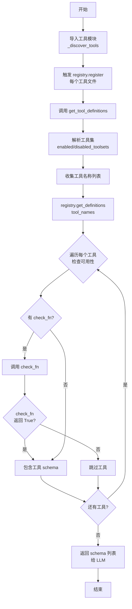
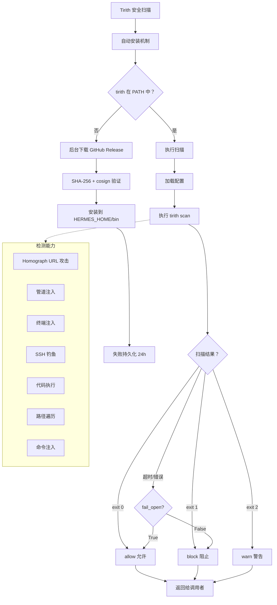
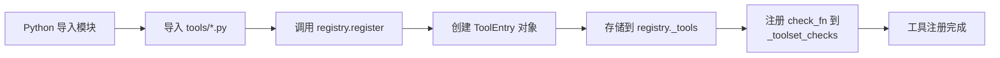
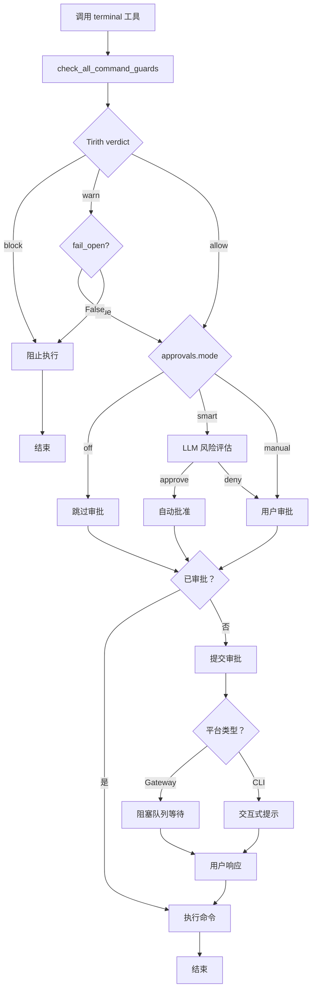

# Hermes-Agent 工具注册权限检查架构分析

## 1. 系统概述

Hermes-Agent 的工具注册权限检查系统是一个多层次、动态化的工具可用性与安全验证架构。该系统通过 **集中式注册表 (Tool Registry)** 统一管理所有工具的元数据、权限检查和分发调度，结合 **工具集 (Toolset)** 分组、**环境变量依赖**、**运行时可用性检测**、**危险命令审批** 等多维度权限控制机制，确保工具在安全可控的前提下被调用。

### 1.1 核心功能特性

| 功能模块        | 描述                                                  |
| ----------- | --------------------------------------------------- |
| **集中式注册表**  | `tools/registry.py` 统一管理工具 schema、handler、check\_fn |
| **工具集分组**   | 按功能分组 (web/file/terminal/vision 等)，支持批量启用/禁用        |
| **动态可用性检测** | 运行时检查 API Key、环境依赖、服务可用性                            |
| **危险命令审批**  | 模式检测 + 会话审批 + 智能 LLM 风险评估 + 永久白名单                   |
| **安全扫描集成**  | Tirith 内容级威胁扫描 (homograph URL/管道注入/终端注入)            |
| **环境变量隔离**  | 子进程环境变量白名单过滤，防止凭证泄露                                 |

### 1.2 架构设计原则

1. **最小权限原则**: 工具默认不可用，需通过 check\_fn 验证
2. **分层验证**: 工具集级 → 工具级 → 命令级 → 内容级
3. **动态适配**: 根据环境变化 (API Key 配置/服务可用性) 动态调整可用工具
4. **用户可控**: 支持会话审批、永久白名单、YOLO 模式、智能审批
5. **容错设计**: 检查失败时优雅降级 (fail-open/fail-closed 可配置)

***

## 2. 软件架构图

### 2.1 整体架构层次图

```
┌──────────────────────────────────────────────────────────────────────────────┐
│                         AIAgent / CLI / Gateway                               │
│                                                                              │
│   调用 get_tool_definitions(enabled_toolsets, disabled_toolsets)             │
│   调用 handle_function_call(tool_name, tool_args, task_id)                   │
└──────────────────────────────────┬───────────────────────────────────────────┘
                                   │
                                   ▼
┌──────────────────────────────────────────────────────────────────────────────┐
│                      model_tools.py (工具编排层)                               │
│                                                                              │
│   ┌────────────────────────────────────────────────────────────────────┐     │
│   │  _discover_tools() — 导入所有工具模块，触发 registry.register()    │     │
│   │                                                                    │     │
│   │  • tools.web_tools      • tools.terminal_tool  • tools.file_tools  │     │
│   │  • tools.vision_tools   • tools.browser_tool   • tools.memory_tool │     │
│   │  • tools.skills_tool    • tools.delegate_tool  • tools.mcp_tool    │     │
│   │  • ... (20+ 工具模块)                                              │     │
│   └────────────────────────────────────────────────────────────────────┘     │
│                                   │                                          │
│                                   ▼                                          │
│   ┌────────────────────────────────────────────────────────────────────┐     │
│   │  get_tool_definitions() — 工具集解析与过滤                          │     │
│   │                                                                    │     │
│   │  1. 解析 enabled_toolsets / disabled_toolsets                      │     │
│   │  2. resolve_toolset() 展开工具集 → 工具列表                         │     │
│   │  3. 调用 registry.get_definitions(tool_names)                      │     │
│   └────────────────────────────────────────────────────────────────────┘     │
│                                   │                                          │
│                                   ▼                                          │
│   ┌────────────────────────────────────────────────────────────────────┐     │
│   │  handle_function_call() — 工具分发调度                             │     │
│   │                                                                    │     │
│   │  1. 工具级代理工具 (memory/todo) — 直接拦截                        │     │
│   │  2. MCP 工具 — 转发到 MCP 服务器                                    │     │
│   │  3. 标准工具 — registry.dispatch()                                 │     │
│   └────────────────────────────────────────────────────────────────────┘     │
└──────────────────────────────────────────────────────────────────────────────┘
                                   │
                                   ▼
┌──────────────────────────────────────────────────────────────────────────────┐
│                    tools/registry.py (集中式注册表)                            │
│                                                                              │
│   ┌────────────────────────────────────────────────────────────────────┐     │
│   │  ToolRegistry 单例                                                  │     │
│   │                                                                    │     │
│   │  _tools: Dict[str, ToolEntry]                                      │     │
│   │  _toolset_checks: Dict[str, Callable]                              │     │
│   └────────────────────────────────────────────────────────────────────┘     │
│                                   │                                          │
│           ┌───────────────────────┼───────────────────────┐                  │
│           ▼                       ▼                       ▼                  │
│   ┌──────────────────┐  ┌──────────────────┐  ┌──────────────────┐          │
│   │ register()       │  │ get_definitions()│  │ dispatch()       │          │
│   │                  │  │                  │  │                  │          │
│   │ • 注册工具元数据  │  │ • 调用 check_fn() │  │ • 执行 handler()  │          │
│   │ • 存储 check_fn  │  │ • 过滤不可用工具  │  │ • 异常捕获        │          │
│   │ • 记录 requires_env│ │ • 返回 schema 列表│  │ • JSON 序列化     │          │
│   └──────────────────┘  └──────────────────┘  └──────────────────┘          │
│                                   │                                          │
│           ┌───────────────────────┼───────────────────────┐                  │
│           ▼                       ▼                       ▼                  │
│   ┌──────────────────┐  ┌──────────────────┐  ┌──────────────────┐          │
│   │ is_toolset_      │  │ check_toolset_   │  │ get_available_   │          │
│   │ available()      │  │ requirements()   │  │ toolsets()       │          │
│   │                  │  │                  │  │                  │          │
│   │ • 调用 check_fn()│  │ • 遍历所有       │  │ • 构建工具集     │          │
│   │ • 返回 bool      │  │   toolset        │  │   元数据         │          │
│   └──────────────────┘  └──────────────────┘  └──────────────────┘          │
└──────────────────────────────────────────────────────────────────────────────┘
                                   │
                                   ▼
┌──────────────────────────────────────────────────────────────────────────────┐
│                      工具文件层 (tools/*.py)                                  │
│                                                                              │
│   每个工具文件在模块导入时调用 registry.register():                            │
│                                                                              │
│   registry.register(                                                         │
│       name="web_search",                                                     │
│       toolset="web",                                                         │
│       schema={...},                                                          │
│       handler=lambda args, **kw: web_search(...),                            │
│       check_fn=check_web_api_key,       # 运行时可用性检查                   │
│       requires_env=["OPENROUTER_API_KEY"],  # 环境变量依赖                   │
│       is_async=True,                                                         │
│       emoji="🔍",                                                            │
│   )                                                                          │
│                                                                              │
│   典型 check_fn 实现:                                                         │
│   ┌────────────────────────────────────────────────────────────────────┐     │
│   │ def check_web_api_key() -> bool:                                   │     │
│   │     # 1. 检查配置的 API Key                                        │     │
│   │     # 2. 检查环境变量                                              │     │
│   │     # 3. 可选：测试 API 连通性                                      │     │
│   │     return bool(api_key_configured)                                │     │
│   └────────────────────────────────────────────────────────────────────┘     │
└──────────────────────────────────────────────────────────────────────────────┘
                                   │
                                   ▼
┌──────────────────────────────────────────────────────────────────────────────┐
│                      权限检查执行层                                           │
│                                                                              │
│   ┌────────────────────────────────────────────────────────────────────┐     │
│   │  Layer 1: 工具集级检查 (Toolset-Level)                              │     │
│   │                                                                    │     │
│   │  • check_fn() 验证工具集整体可用性                                  │     │
│   │  • 例如：check_browser_requirements() 检查                          │     │
│   │    - Browserbase API Key                                           │     │
│   │    - Playwright 安装                                               │     │
│   │    - 网络连接                                                      │     │
│   └────────────────────────────────────────────────────────────────────┘     │
│                                   │                                          │
│                                   ▼                                          │
│   ┌────────────────────────────────────────────────────────────────────┐     │
│   │  Layer 2: 工具级检查 (Tool-Level)                                   │     │
│   │                                                                    │     │
│   │  • requires_env 声明环境变量依赖                                    │     │
│   │  • check_fn 运行时验证                                              │     │
│   │  • 例如：check_web_api_key() 检查                                   │     │
│   │    - OPENROUTER_API_KEY / FIRECRAWL_API_KEY                        │     │
│   └────────────────────────────────────────────────────────────────────┘     │
│                                   │                                          │
│                                   ▼                                          │
│   ┌────────────────────────────────────────────────────────────────────┐     │
│   │  Layer 3: 命令级检查 (Command-Level) — terminal tool only           │     │
│   │                                                                    │     │
│   │  • detect_dangerous_command() 模式匹配                              │     │
│   │  • check_all_command_guards() 综合检查                              │     │
│   │  • 危险模式: rm -rf, chmod 777, DROP TABLE, > /etc/...             │     │
│   └────────────────────────────────────────────────────────────────────┘     │
│                                   │                                          │
│                                   ▼                                          │
│   ┌────────────────────────────────────────────────────────────────────┐     │
│   │  Layer 4: 内容级检查 (Content-Level) — Tirith 安全扫描              │     │
│   │                                                                    │     │
│   │  • check_command_security() 调用 tirith 二进制                      │     │
│   │  • 检测: homograph URL / 管道注入 / 终端注入 / SSH 钓鱼             │     │
│   │  • 返回: allow / warn / block + 详细 findings                       │     │
│   └────────────────────────────────────────────────────────────────────┘     │
└──────────────────────────────────────────────────────────────────────────────┘
```

### 2.2 工具注册权限检查流程图



### 2.3 工具调用权限验证流程

```mermaid
sequenceDiagram
    participant LLM as LLM Agent
    participant Agent as AIAgent
    participant Tools as model_tools.py
    participant Registry as tools/registry.py
    participant CheckFn as check_fn (工具级)
    participant Terminal as terminal_tool.py
    participant Approval as approval.py
    participant Tirith as tirith_security.py
    participant Handler as Tool Handler

    LLM->>Agent: 调用工具 (tool_name, args)
    Agent->>Tools: handle_function_call(tool_name, args, task_id)
    
    Tools->>Tools: 检查是否为代理工具 (memory/todo)
    alt 代理工具
        Tools->>Tools: 直接拦截处理
    else MCP 工具
        Tools->>Tools: 转发到 MCP 服务器
    else 标准工具
        Tools->>Registry: registry.dispatch(tool_name, args)
    end
    
    Registry->>Registry: 查找 ToolEntry
    
    alt 工具不存在
        Registry-->>Tools: 返回 {"error": "Unknown tool"}
        Tools-->>Agent: 错误消息
        Agent-->>LLM: 错误消息
    else 工具存在
        Registry->>CheckFn: 调用 check_fn() (如果已缓存则跳过)
        CheckFn-->>Registry: 返回 True/False
        
        alt check_fn 返回 False
            Registry-->>Tools: 返回 {"error": "Tool unavailable"}
            Tools-->>Agent: 错误消息
            Agent-->>LLM: 错误消息
        else check_fn 返回 True
            Registry->>Handler: 调用 handler(args, **kwargs)
            
            alt 异步 handler
                Handler->>Handler: _run_async(coro)
            end
            
            alt terminal 工具
                Handler->>Terminal: terminal(command, ...)
                Terminal->>Approval: check_all_command_guards()
                
                Approval->>Tirith: check_command_security(command)
                Tirith-->>Approval: 返回 allow/warn/block + findings
                
                Approval->>Approval: detect_dangerous_command(command)
                
                Approval->>Approval: 综合检查
(Tirith + 危险模式)
                
                alt 需要审批
                    Approval->>Approval: 检查会话审批状态
                    alt 已审批/YOLO 模式
                        Approval-->>Terminal: {"approved": True}
                    else 未审批
                        Approval->>Approval: 提交审批请求
                        Approval-->>Terminal: {"approved": False,
status: "approval_required"}
                        Terminal-->>Handler: 阻塞等待审批
                        Note over Approval: 用户审批:
once/session/always/deny
                        Approval-->>Terminal: 审批结果
                    end
                else 无需审批
                    Approval-->>Terminal: {"approved": True}
                end
                
                Terminal->>Terminal: 执行命令
                Terminal-->>Handler: 返回结果
            else 其他工具
                Handler->>Handler: 执行工具逻辑
                Handler-->>Registry: 返回 JSON 结果
            end
            
            Registry-->>Tools: 返回 JSON 结果
            Tools-->>Agent: 返回结果
            Agent-->>LLM: 返回结果
        end
    end
```

### 2.4 危险命令审批架构

```
┌──────────────────────────────────────────────────────────────────────────────┐
│                    approval.py (危险命令审批系统)                              │
│                                                                              │
│   ┌────────────────────────────────────────────────────────────────────┐     │
│   │  DANGEROUS_PATTERNS (130+ 危险模式)                                │     │
│   │                                                                    │     │
│   │  分类:                                                             │     │
│   │  • 文件删除: rm -rf, find -delete, git reset --hard               │     │
│   │  • 权限修改: chmod 777, chown root                                │     │
│   │  • 磁盘操作: mkfs, dd if=, > /dev/sd                              │     │
│   │  • 数据库: DROP TABLE, DELETE FROM (无 WHERE)                     │     │
│   │  • 系统服务：systemctl stop, kill -9 -1                          │     │
│   │  • 代码执行：python -c, curl | bash, heredoc                      │     │
│   │  • Git 破坏：force push, branch -D, clean -f                      │     │
│   │  • 自终止保护：pkill hermes, kill $(pgrep hermes)                │     │
│   │  • 网关保护：gateway run & (systemd 外启动)                       │     │
│   └────────────────────────────────────────────────────────────────────┘     │
│                                   │                                          │
│                                   ▼                                          │
│   ┌────────────────────────────────────────────────────────────────────┐     │
│   │  detect_dangerous_command(command)                                 │     │
│   │                                                                    │     │
│   │  1. _normalize_command_for_detection()                             │     │
│   │     • strip_ansi() 清洗 ANSI 转义序列                               │     │
│   │     • 移除 null 字节                                                 │     │
│   │     • Unicode NFKC 规范化 (防御全角字符混淆)                        │     │
│   │  2. 遍历 DANGEROUS_PATTERNS 正则匹配                                │     │
│   │  3. 返回 (is_dangerous, pattern_key, description)                  │     │
│   └────────────────────────────────────────────────────────────────────┘     │
│                                   │                                          │
│                                   ▼                                          │
│   ┌────────────────────────────────────────────────────────────────────┐     │
│   │  check_all_command_guards(command, env_type)                       │     │
│   │                                                                    │     │
│   │  Phase 1: 收集发现                                                 │     │
│   │    • Tirith 扫描 (allow/warn/block + findings)                    │     │
│   │    • 危险模式检测 (pattern_key, description)                       │     │
│   │                                                                    │     │
│   │  Phase 2: 决策                                                    │     │
│   │    • 跳过容器环境 (docker/singularity/modal/daytona)              │     │
│   │    • 检查 YOLO 模式 / approvals.mode=off                           │     │
│   │    • 收集未审批的警告 (Tirith + 危险模式)                           │     │
│   │                                                                    │     │
│   │  Phase 2.5: 智能审批 (approvals.mode=smart)                        │     │
│   │    • 调用辅助 LLM 风险评估                                         │     │
│   │    • 返回 approve/deny/escalate                                    │     │
│   │    • approve → 自动授予会话级审批                                  │     │
│   │                                                                    │     │
│   │  Phase 3: 审批                                                    │     │
│   │    • Gateway: 阻塞队列 + threading.Event 等待                       │     │
│   │    • CLI: prompt_dangerous_approval() 交互式提示                   │     │
│   │    • 审批选项：once/session/always/deny                            │     │
│   └────────────────────────────────────────────────────────────────────┘     │
│                                   │                                          │
│                                   ▼                                          │
│   ┌────────────────────────────────────────────────────────────────────┐     │
│   │  会话审批状态管理 (线程安全)                                         │     │
│   │                                                                    │     │
│   │  _session_approved: Dict[session_key, Set[pattern_key]]            │     │
│   │  _permanent_approved: Set[pattern_key]                             │     │
│   │  _gateway_queues: Dict[session_key, List[_ApprovalEntry]]          │     │
│   │                                                                    │     │
│   │  API:                                                              │     │
│   │  • approve_session(session_key, pattern_key)                       │     │
│   │  • approve_permanent(pattern_key)                                  │     │
│   │  • is_approved(session_key, pattern_key)                           │     │
│   │  • resolve_gateway_approval(session_key, choice)                   │     │
│   └────────────────────────────────────────────────────────────────────┘     │
└──────────────────────────────────────────────────────────────────────────────┘
```

### 2.5 Tirith 安全扫描架构


    
    style Start fill:#90EE90
    style Final fill:#87CEEB
    style Allow fill:#90EE90
    style Block fill:#FFB6C1
    style Homograph fill:#FFE4B5
    style PipeInject fill:#FFE4B5
    style TermInject fill:#FFE4B5
    style SSHPhish fill:#FFE4B5
    style CodeExec fill:#FFE4B5
    style PathTraversal fill:#FFE4B5
    style CmdInject fill:#FFE4B5
```

## 3. 核心业务流程## 3. 核心业务流程

### 3.1 工具注册与发现流程



### 3.2 工具可用性检查流程

```
┌──────────────────────────────────────────────────────────────────────────────┐
│                            工具可用性检查流程                                  │
├──────────────────────────────────────────────────────────────────────────────┤
│                                                                            │
│  ┌──────────────────────────────────────────────────────────────────────┐   │
│  │  get_tool_definitions(enabled_toolsets)                           │   │
│  └──────────────────────────────────┬───────────────────────────────────┘   │
│                                       │                                       │
│                                       ▼                                       │
│  ┌──────────────────────────────────────────────────────────────────────┐   │
│  │  resolve_toolset 展开工具集                                         │   │
│  └──────────────────────────────────┬───────────────────────────────────┘   │
│                                       │                                       │
│                                       ▼                                       │
│  ┌──────────────────────────────────────────────────────────────────────┐   │
│  │  收集工具名称列表                                                     │   │
│  └──────────────────────────────────┬───────────────────────────────────┘   │
│                                       │                                       │
│                                       ▼                                       │
│  ┌──────────────────────────────────────────────────────────────────────┐   │
│  │  registry.get_definitions(tool_names)                              │   │
│  └──────────────────────────────────┬───────────────────────────────────┘   │
│                                       │                                       │
│                                       ▼                                       │
│  ┌──────────────────────────────────────────────────────────────────────┐   │
│  │  遍历工具                                                           │   │
│  └──────────────────────────────────┬───────────────────────────────────┘   │
│                                       │                                       │
│                                       ▼                                       │
│  ┌──────────────────────────────────────────────────────────────────────┐   │
│  │  获取 ToolEntry                                                     │   │
│  └──────────────────────────────────┬───────────────────────────────────┘   │
│                                       │                                       │
│                                       ▼                                       │
│  ┌──────────────────────────────────────────────────────────────────────┐   │
│  │  有 check_fn?                                                      │   │
│  └──────────────────────────────────┬───────────────────────────────────┘   │
│               ┌─────────────────────┴─────────────────────┐               │
│               ▼                                           ▼               │
│  ┌───────────────────────────┐         ┌───────────────────────────┐   │
│  │ 否: 包含工具 schema       │         │ 是: 已缓存?                │   │
│  └─────────────┬───────────┘         └─────────────┬─────────────┘   │
│                │                                   │                   │
│                │                     ┌─────────────┴─────────────┐   │
│                │                     ▼                           ▼   │
│                │           ┌──────────────────┐   ┌───────────────────┐ │
│                │           │ 使用缓存结果      │   │ 调用 check_fn     │ │
│                │           └──────────┬───────┘   └───────────┬───────┘ │
│                │                      │                       │         │
│                │                      │                       │         │
│                │                      │                       ▼         │
│                │                      │           ┌───────────────────┐ │
│                │                      │           │ 缓存结果           │ │
│                │                      │           │ check_results[]    │ │
│                │                      │           └───────────┬───────┘ │
│                │                      │                       │         │
│                │                      │                       ▼         │
│                │                      │           ┌───────────────────┐ │
│                │                      │           │ check_fn 返回     │ │
│                │                      │           │ True?             │ │
│                │                      │           └───────────┬───────┘ │
│                │                      │                       │         │
│                │                      │          ┌──────────┴──────────┐ │
│                │                      │          ▼                     ▼ │
│                │           ┌──────────────────────┐  ┌───────────────────┐ │
│                │           │ 缓存结果为 True?     │  │ 跳过工具           │ │
│                │           └──────────┬───────────┘  │ 记录 debug 日志     │ │
│                │                      │              └───────────┬───────┘ │
│                │             ┌────────┴────────┐                     │         │
│                │             ▼                 ▼                     │         │
│                │      ┌────────────┐   ┌────────────┐                │         │
│                │      │ 是: 包含   │   │ 否: 跳过   │                │         │
│                │      │ 工具 schema│   │ 工具       │                │         │
│                │      └────────────┘   └────────────┘                │         │
│                │                                                    │         │
│                └────────────────────────────────────────────────────┘         │
│                                                                            │
│  ┌──────────────────────────────────────────────────────────────────────┐   │
│  │  还有工具?                                                          │   │
│  └──────────────────────────────────┬───────────────────────────────────┘   │
│               ┌─────────────────────┴─────────────────────┐               │
│               ▼                                           ▼               │
│  ┌───────────────────────────┐         ┌───────────────────────────┐   │
│  │ 是: 继续遍历                │         │ 否: 返回 schema 列表        │   │
│  └─────────────┬───────────┘         └─────────────┬─────────────┘   │
│                │                                   │                   │
│                │                                   ▼                   │
│                │                     ┌───────────────────────────┐   │
│                │                     │ 结束                        │   │
│                │                     └───────────────────────────┘   │
│                │                                                    │
│                └───────────────────────────────────────────────┐    │
│                                                             │    │
│  ┌────────────────────────────────────────────────────────────┘    │   │
│  │  返回到遍历工具步骤                                               │   │
│  └──────────────────────────────────────────────────────────────────────┘   │
│                                                                            │
└──────────────────────────────────────────────────────────────────────────────┘
```

### 3.3 危险命令审批完整流程



### 3.4 环境变量隔离流程

```
┌──────────────────────────────────────────────────────────────────────────────┐
│                           环境变量隔离流程                                    │
├──────────────────────────────────────────────────────────────────────────────┤
│                                                                            │
│  ┌──────────────────────────────────────────────────────────────────────┐   │
│  │  构建子进程环境                                                           │   │
│  └──────────────────────────────────┬───────────────────────────────────┘   │
│                                       │                                       │
│                                       ▼                                       │
│  ┌──────────────────────────────────────────────────────────────────────┐   │
│  │  遍历 os.environ                                                     │   │
│  └──────────────────────────────────┬───────────────────────────────────┘   │
│                                       │                                       │
│                                       ▼                                       │
│  ┌──────────────────────────────────────────────────────────────────────┐   │
│  │  在 env_passthrough 白名单?                                          │   │
│  └──────────────────────────────────┬───────────────────────────────────┘   │
│               ┌─────────────────────┴─────────────────────┐               │
│               ▼                                           ▼               │
│  ┌───────────────────────────┐         ┌───────────────────────────┐   │
│  │ 是: 包含在 child_env      │         │ 否: 包含 KEY/TOKEN/        │   │
│  │                           │         │ SECRET/PASSWORD/            │   │
│  │                           │         │ CREDENTIAL/AUTH?            │   │
│  └─────────────┬───────────┘         └─────────────┬─────────────┘   │
│                │                                   │                   │
│                │                     ┌─────────────┴─────────────┐   │
│                │                     ▼                           ▼   │
│                │           ┌──────────────────┐   ┌───────────────────┐ │
│                │           │ 是: 排除         │   │ 否: 以安全前缀    │ │
│                │           │                 │   │ 开头?             │ │
│                │           └──────────┬───────┘   └───────────┬───────┘ │
│                │                      │                       │         │
│                │                      │                ┌────────┴────────┐ │
│                │                      │                ▼                 ▼ │
│                │                      │          ┌───────────┐   ┌──────────┐ │
│                │                      │          │ 是: 包含  │   │ 否: 排除  │ │
│                │                      │          └────┬──────┘   └────┬─────┘ │
│                │                      │               │               │       │
│                │                      │               │               │       │
│                └──────────────────────┼───────────────┼───────────────┘       │
│                                       │               │                       │
│                                       ▼               ▼                       │
│  ┌──────────────────────────────────────────────────────────────────────┐   │
│  │  还有变量?                                                          │   │
│  └──────────────────────────────────┬───────────────────────────────────┘   │
│               ┌─────────────────────┴─────────────────────┐               │
│               ▼                                           ▼               │
│  ┌───────────────────────────┐         ┌───────────────────────────┐   │
│  │ 是: 继续遍历                │         │ 否: 添加特殊变量           │   │
│  │                           │         │ HERMES_RPC_SOCKET         │   │
│  │                           │         │ PYTHONDONTWRITEBYTECODE   │   │
│  │                           │         │ PYTHONPATH                │   │
│  │                           │         │ TZ                        │   │
│  │                           │         │ HOME (Profile 隔离)        │   │
│  └─────────────┬───────────┘         └─────────────┬─────────────┘   │
│                │                                   │                   │
│                │                                   ▼                   │
│                │                     ┌───────────────────────────┐   │
│                │                     │ 返回 child_env            │   │
│                │                     └───────────────────────────┘   │
│                │                                                    │
│                └───────────────────────────────────────────────┐    │
│                                                             │    │
│  ┌────────────────────────────────────────────────────────────┘    │   │
│  │  返回到遍历 os.environ 步骤                                          │   │
│  └──────────────────────────────────────────────────────────────────────┘   │
│                                                                            │
└──────────────────────────────────────────────────────────────────────────────┘
```

***

## 4. 核心代码分析

### 4.1 工具注册表核心结构

**文件**: `tools/registry.py:24-46`

```python
class ToolEntry:
    """Metadata for a single registered tool."""

    __slots__ = (
        "name", "toolset", "schema", "handler", "check_fn",
        "requires_env", "is_async", "description", "emoji",
        "max_result_size_chars",
    )

    def __init__(self, name, toolset, schema, handler, check_fn,
                 requires_env, is_async, description, emoji,
                 max_result_size_chars=None):
        self.name = name
        self.toolset = toolset
        self.schema = schema
        self.handler = handler
        self.check_fn = check_fn
        self.requires_env = requires_env
        self.is_async = is_async
        self.description = description
        self.emoji = emoji
        self.max_result_size_chars = max_result_size_chars
```

**设计要点**:

1. __slots__ 优化: 减少内存占用，加速属性访问
2. **元数据完整**: 包含 schema、handler、check\_fn、requires\_env 等完整信息
3. **emoji 支持**: 用于 CLI 工具预览的视觉标识

### 4.2 工具注册方法

**文件**: `tools/registry.py:59-93`

```python
def register(
    self,
    name: str,
    toolset: str,
    schema: dict,
    handler: Callable,
    check_fn: Callable = None,
    requires_env: list = None,
    is_async: bool = False,
    description: str = "",
    emoji: str = "",
    max_result_size_chars: int | float | None = None,
):
    """Register a tool.  Called at module-import time by each tool file."""
    existing = self._tools.get(name)
    if existing and existing.toolset != toolset:
        logger.warning(
            "Tool name collision: '%s' (toolset '%s') is being "
            "overwritten by toolset '%s'",
            name, existing.toolset, toolset,
        )
    self._tools[name] = ToolEntry(...)
    if check_fn and toolset not in self._toolset_checks:
        self._toolset_checks[toolset] = check_fn
```

**设计要点**:

1. **工具集级 check\_fn**: 每个 toolset 只注册一个 check\_fn，避免重复检查
2. **名称冲突检测**: 记录警告日志，防止意外覆盖
3. **模块导入时注册**: 在 `import tools.web_tools` 时自动触发

### 4.3 工具定义获取 (带可用性检查)

**文件**: `tools/registry.py:116-143`

```python
def get_definitions(self, tool_names: Set[str], quiet: bool = False) -> List[dict]:
    """Return OpenAI-format tool schemas for the requested tool names.

    Only tools whose ``check_fn()`` returns True (or have no check_fn)
    are included.
    """
    result = []
    check_results: Dict[Callable, bool] = {}
    for name in sorted(tool_names):
        entry = self._tools.get(name)
        if not entry:
            continue
        if entry.check_fn:
            if entry.check_fn not in check_results:
                try:
                    check_results[entry.check_fn] = bool(entry.check_fn())
                except Exception:
                    check_results[entry.check_fn] = False
                    if not quiet:
                        logger.debug("Tool %s check raised; skipping", name)
            if not check_results[entry.check_fn]:
                if not quiet:
                    logger.debug("Tool %s unavailable (check failed)", name)
                continue
        # Ensure schema always has a "name" field — use entry.name as fallback
        schema_with_name = {**entry.schema, "name": entry.name}
        result.append({"type": "function", "function": schema_with_name})
    return result
```

**设计要点**:

1. **check\_fn 缓存**: 同一 check\_fn 只执行一次，多个工具共享结果
2. **异常容错**: check\_fn 抛出异常时返回 False，不中断流程
3. **schema 补全**: 确保 schema 始终包含 "name" 字段

### 4.4 危险命令检测

**文件**: `tools/approval.py:163-192`

```python
def _normalize_command_for_detection(command: str) -> str:
    """Normalize a command string before dangerous-pattern matching.

    Strips ANSI escape sequences (full ECMA-48 via tools.ansi_strip),
    null bytes, and normalizes Unicode fullwidth characters so that
    obfuscation techniques cannot bypass the pattern-based detection.
    """
    from tools.ansi_strip import strip_ansi

    # Strip all ANSI escape sequences (CSI, OSC, DCS, 8-bit C1, etc.)
    command = strip_ansi(command)
    # Strip null bytes
    command = command.replace('\x00', '')
    # Normalize Unicode (fullwidth Latin, halfwidth Katakana, etc.)
    command = unicodedata.normalize('NFKC', command)
    return command


def detect_dangerous_command(command: str) -> tuple:
    """Check if a command matches any dangerous patterns.

    Returns:
        (is_dangerous, pattern_key, description) or (False, None, None)
    """
    command_lower = _normalize_command_for_detection(command).lower()
    for pattern, description in DANGEROUS_PATTERNS:
        if re.search(pattern, command_lower, re.IGNORECASE | re.DOTALL):
            pattern_key = description
            return (True, pattern_key, description)
    return (False, None, None)
```

**设计要点**:

1. **三重规范化**: ANSI 清洗 + null 字节移除 + Unicode 规范化，防止混淆绕过
2. **不区分大小写**: 使用 `re.IGNORECASE` 匹配
3. **DOTALL 模式**: 允许 `.` 匹配换行符，处理多行命令

### 4.5 综合命令守卫检查

**文件**: `tools/approval.py:690-800`

```python
def check_all_command_guards(command: str, env_type: str,
                             approval_callback=None) -> dict:
    """Run all pre-exec security checks and return a single approval decision.

    Gathers findings from tirith and dangerous-command detection, then
    presents them as a single combined approval request.
    """
    # Skip containers for both checks
    if env_type in ("docker", "singularity", "modal", "daytona"):
        return {"approved": True, "message": None}

    # --yolo or approvals.mode=off: bypass all approval prompts.
    approval_mode = _get_approval_mode()
    if os.getenv("HERMES_YOLO_MODE") or is_current_session_yolo_enabled() or approval_mode == "off":
        return {"approved": True, "message": None}

    is_cli = os.getenv("HERMES_INTERACTIVE")
    is_gateway = os.getenv("HERMES_GATEWAY_SESSION")
    is_ask = os.getenv("HERMES_EXEC_ASK")

    # Preserve the existing non-interactive behavior
    if not is_cli and not is_gateway and not is_ask:
        return {"approved": True, "message": None}

    # --- Phase 1: Gather findings from both checks ---

    # Tirith check
    tirith_result = {"action": "allow", "findings": [], "summary": ""}
    try:
        from tools.tirith_security import check_command_security
        tirith_result = check_command_security(command)
    except ImportError:
        pass  # tirith module not installed — allow

    # Dangerous command check (detection only, no approval)
    is_dangerous, pattern_key, description = detect_dangerous_command(command)

    # --- Phase 2: Decide ---

    # Collect warnings that need approval
    warnings = []  # list of (pattern_key, description, is_tirith)

    session_key = get_current_session_key()

    # Tirith block/warn → approvable warning with rich findings.
    if tirith_result["action"] in ("block", "warn"):
        findings = tirith_result.get("findings") or []
        rule_id = findings[0].get("rule_id", "unknown") if findings else "unknown"
        tirith_key = f"tirith:{rule_id}"
        tirith_desc = _format_tirith_description(tirith_result)
        if not is_approved(session_key, tirith_key):
            warnings.append((tirith_key, tirith_desc, True))

    if is_dangerous:
        if not is_approved(session_key, pattern_key):
            warnings.append((pattern_key, description, False))

    # Nothing to warn about
    if not warnings:
        return {"approved": True, "message": None}

    # --- Phase 2.5: Smart approval (auxiliary LLM risk assessment) ---
    if approval_mode == "smart":
        combined_desc_for_llm = "; ".join(desc for _, desc, _ in warnings)
        verdict = _smart_approve(command, combined_desc_for_llm)
        if verdict == "approve":
            # Auto-approve and grant session-level approval for these patterns
            for key, _, _ in warnings:
                approve_session(session_key, key)
            logger.debug("Smart approval: auto-approved '%s' (%s)",
                         command[:60], combined_desc_for_llm)
            return {"approved": True, "message": None,
                    "smart_approved": True,
                    "description": combined_desc_for_llm}
        elif verdict == "deny":
            combined_desc_for_llm = "; ".join(desc for _, desc, _ in warnings)
            return {
                "approved": False,
                "message": f"BLOCKED by smart approval: {combined_desc_for_llm}. "
                           "The command was assessed as genuinely dangerous. Do NOT retry.",
                "smart_denied": True,
            }
        # verdict == "escalate" → fall through to manual prompt

    # --- Phase 3: Approval ---

    # Combine descriptions for a single approval prompt
    combined_desc = "; ".join(desc for _, desc, _ in warnings)
    primary_key = warnings[0][0]
    all_keys = [key for key, _, _ in warnings]
    has_tirith = any(is_t for _, _, is_t in warnings)

    # Gateway/async approval
    if is_gateway or is_ask:
        # ... (阻塞队列实现)
```

**设计要点**:

1. **三阶段检查**: Phase 1 收集 → Phase 2 决策 → Phase 3 审批
2. **智能审批**: LLM 风险评估，自动批准低风险命令
3. **合并提示**: Tirith + 危险模式合并为单一审批请求，避免多次提示
4. **容器跳过**: 容器环境默认安全，跳过审批

***

## 5. 设计模式分析

### 5.1 单例模式 (Singleton Pattern)

`ToolRegistry` 使用单例模式，确保全局只有一个注册表实例：

```python
# Module-level singleton
registry = ToolRegistry()
```

**优势**:

- 避免多个注册表实例导致的状态不一致
- 工具注册和查询共享同一数据源

### 5.2 策略模式 (Strategy Pattern)

审批模式使用策略模式，支持多种审批策略：

```python
approval_mode = _get_approval_mode()  # "manual" | "smart" | "off"

if approval_mode == "smart":
    verdict = _smart_approve(command, description)  # LLM 策略
elif approval_mode == "manual":
    choice = prompt_dangerous_approval(command, description)  # 手动策略
elif approval_mode == "off":
    return {"approved": True}  # 禁用策略
```

### 5.3 责任链模式 (Chain of Responsibility)

命令守卫检查使用责任链，依次经过多个检查点：

```python
# Phase 1: 收集
tirith_result = check_command_security(command)
is_dangerous, pattern_key, description = detect_dangerous_command(command)

# Phase 2: 决策
warnings = []
if tirith_result["action"] in ("block", "warn"):
    warnings.append(...)
if is_dangerous:
    warnings.append(...)

# Phase 3: 审批
if warnings:
    # 触发审批流程
```

### 5.4 代理模式 (Proxy Pattern)

`check_fn` 作为工具可用性的代理，延迟执行实际检查：

```python
# 注册时
registry.register(
    name="web_search",
    check_fn=check_web_api_key,  # 代理函数
)

# 查询时
if entry.check_fn:
    check_results[entry.check_fn] = bool(entry.check_fn())  # 延迟执行
```

### 5.5 观察者模式 (Observer Pattern)

Gateway 审批回调使用观察者模式，通知用户审批请求：

```python
register_gateway_notify(session_key, cb)  # 注册观察者

# 触发通知
notify_cb(approval_data)  # 通知所有观察者
```

***

## 6. 配置接口

### 6.1 config.yaml 配置

```yaml
# 工具集启用/禁用
toolsets:
  enabled:
    - web
    - file
    - terminal
  disabled:
    - browser  # 禁用浏览器工具

# 审批配置
approvals:
  mode: "smart"  # "manual" | "smart" | "off"
  timeout: 60  # CLI 审批超时 (秒)
  gateway_timeout: 300  # Gateway 审批超时 (秒)

# 安全配置
security:
  tirith_enabled: True
  tirith_path: "tirith"  # 或绝对路径
  tirith_timeout: 5
  tirith_fail_open: True  # 扫描失败时允许执行

# 永久命令白名单
command_allowlist:
  - "recursive delete"  # 允许 rm -rf
  - "script execution via -c flag"  # 允许 python -c
```

### 6.2 环境变量配置

| 环境变量               | 描述                | 默认值      |
| ------------------ | ----------------- | -------- |
| `HERMES_YOLO_MODE` | 启用 YOLO 模式，跳过所有审批 | 未设置      |
| `TIRITH_ENABLED`   | 启用 Tirith 扫描      | `True`   |
| `TIRITH_BIN`       | Tirith 二进制路径      | `tirith` |
| `TIRITH_TIMEOUT`   | Tirith 扫描超时       | `5`      |
| `TIRITH_FAIL_OPEN` | Tirith 失败时允许执行    | `True`   |

***

## 7. 测试覆盖

### 7.1 测试文件

| 文件路径                                  | 描述            |
| ------------------------------------- | ------------- |
| `tests/tools/test_approval.py`        | 危险命令审批测试      |
| `tests/tools/test_tirith_security.py` | Tirith 安全扫描测试 |
| `tests/tools/test_registry.py`        | 工具注册表测试       |
| `tests/tools/test_code_execution.py`  | 沙箱环境变量过滤测试    |

### 7.2 关键测试场景

```python
# 危险命令检测测试
def test_detect_rm_rf():
    is_dangerous, key, desc = detect_dangerous_command("rm -rf /tmp")
    assert is_dangerous
    assert key == "recursive delete"

# Tirith 扫描测试
def test_tirith_homograph_url():
    result = check_command_security("curl http://раураl.com")
    assert result["action"] == "block"
    assert any("homograph" in f["title"] for f in result["findings"])

# 会话审批测试
def test_session_approval():
    session_key = "test-session"
    approve_session(session_key, "recursive delete")
    assert is_approved(session_key, "recursive delete")

# 环境变量过滤测试
def test_api_key_excluded():
    child_env = build_child_env({
        "OPENAI_API_KEY": "sk-secret",
        "PATH": "/usr/bin",
    })
    assert "OPENAI_API_KEY" not in child_env
    assert "PATH" in child_env
```

***

## 8. 代码索引

### 8.1 核心文件

| 文件路径                           | 行数      | 核心功能                                          |
| ------------------------------ | ------- | --------------------------------------------- |
| `tools/registry.py`            | \~335   | 工具注册表、schema 检索、分发调度                          |
| `tools/approval.py`            | \~923   | 危险命令检测、审批状态、智能审批、Gateway 队列                   |
| `tools/tirith_security.py`     | \~400+  | Tirith 安全扫描、自动安装、SHA-256/cosign 验证            |
| `model_tools.py`               | \~650+  | 工具编排、\_discover\_tools、handle\_function\_call |
| `tools/terminal_tool.py`       | \~1800+ | 终端执行、危险命令守卫、sudo 密码提示                         |
| `tools/code_execution_tool.py` | \~1378  | 沙箱执行、环境变量过滤、RPC 通信                            |

### 8.2 核心函数索引

| 函数名                               | 文件                       | 功能描述                         |
| --------------------------------- | ------------------------ | ---------------------------- |
| `registry.register()`             | `registry.py:59`         | 注册工具元数据                      |
| `registry.get_definitions()`      | `registry.py:116`        | 获取工具 schema (带 check\_fn 过滤) |
| `registry.dispatch()`             | `registry.py:149`        | 执行工具 handler                 |
| `registry.is_toolset_available()` | `registry.py:209`        | 检查工具集可用性                     |
| `handle_function_call()`          | `model_tools.py:320`     | 工具分发调度入口                     |
| `detect_dangerous_command()`      | `approval.py:181`        | 危险命令模式检测                     |
| `check_all_command_guards()`      | `approval.py:690`        | 综合命令守卫检查 (Tirith + 危险模式)     |
| `check_command_security()`        | `tirith_security.py:250` | Tirith 安全扫描                  |
| `approve_session()`               | `approval.py:294`        | 会话级审批                        |
| `approve_permanent()`             | `approval.py:343`        | 永久审批                         |
| `is_approved()`                   | `approval.py:329`        | 检查审批状态                       |
| `_smart_approve()`                | `approval.py:531`        | LLM 智能风险评估                   |
| `resolve_gateway_approval()`      | `approval.py:253`        | Gateway 审批队列解析               |

### 8.3 工具文件 (部分)

| 文件路径                           | 工具集             | check\_fn                     |
| ------------------------------ | --------------- | ----------------------------- |
| `tools/web_tools.py`           | web             | `check_web_api_key`           |
| `tools/file_tools.py`          | file            | `_check_file_reqs`            |
| `tools/terminal_tool.py`       | terminal        | `check_terminal_requirements` |
| `tools/vision_tools.py`        | vision          | `check_vision_requirements`   |
| `tools/browser_tool.py`        | browser         | `check_browser_requirements`  |
| `tools/memory_tool.py`         | memory          | `check_memory_requirements`   |
| `tools/code_execution_tool.py` | code\_execution | `check_sandbox_requirements`  |
| `tools/delegate_tool.py`       | delegate        | `check_delegate_requirements` |
| `tools/mcp_tool.py`            | mcp             | `_make_check_fn(server_name)` |

***

## 9. 总结

Hermes-Agent 的工具注册权限检查系统展现了一个多层次、动态化、用户可控的安全架构。其核心设计亮点包括：

1. **集中式注册表**: 统一管理所有工具的元数据、可用性检查和分发调度，消除冗余代码
2. **四层权限验证**: 工具集级 → 工具级 → 命令级 → 内容级，形成纵深防御
3. **智能审批**: 辅助 LLM 风险评估，自动批准低风险命令，减少用户干扰
4. **动态适配**: 根据 API Key 配置、服务可用性、环境依赖动态调整可用工具
5. **会话隔离**: 基于 session\_key 的审批状态管理，支持 Gateway 多会话并发
6. **持久化白名单**: 用户可永久信任特定模式，配置同步到 config.yaml
7. **Tirith 集成**: 内容级威胁扫描，检测 homograph URL、管道注入、终端注入等高级威胁
8. **环境变量隔离**: 子进程环境变量白名单过滤，防止 API Key/Token 泄露

该系统成功平衡了安全性与可用性，在保证工具调用安全的前提下，通过智能审批、会话缓存、YOLO 模式等机制最小化对用户工作流的干扰。
