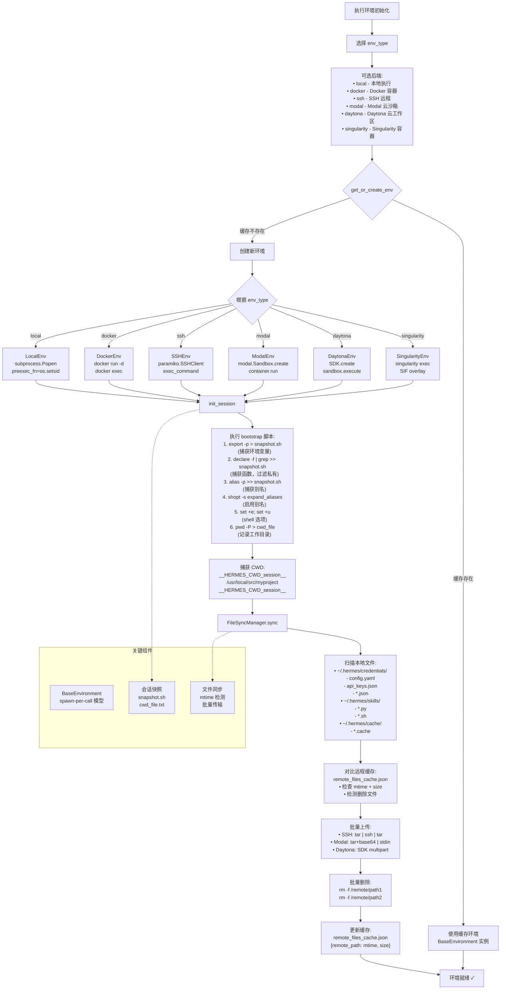
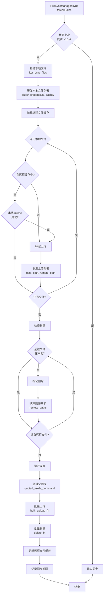

# Hermes-Agent 执行环境隔离架构分析

## 1. 系统概述

Hermes-Agent 的执行环境隔离系统是一个多后端、安全加固的命令执行架构，支持**本地执行**、**Docker 容器**、**SSH 远程**、**Modal 云沙箱**、**Daytona 云工作区**和**Singularity 容器**六种执行环境。该系统通过**spawn-per-call**模型、**环境变量隔离**、**文件系统持久化**、**资源限制**和**安全加固**等机制，在保障安全隔离的前提下，为 Agent 提供灵活多样的执行环境选择。

### 1.1 核心功能特性

| 功能模块 | 描述 |
|---------|------|
| **多后端支持** | 本地/Docker/SSH/Modal/Daytona/Singularity 六种执行环境，统一接口 |
| **Spawn-per-call** | 每次执行 spawn 新进程/容器，避免状态污染 |
| **会话快照** | 跨调用保持环境变量 (export -p 捕获) |
| **环境变量隔离** | 密钥黑名单 + 技能声明白名单 + 用户配置透传 |
| **文件系统持久化** | bind mounts/overlay/tar 快照，跨会话保持 |
| **资源限制** | CPU/memory/disk 配额，PID 限制 |
| **安全加固** | cap-drop ALL、no-new-privileges、tmpfs 限制 |

### 1.2 架构设计原则

1. **统一抽象**: `BaseEnvironment` 定义标准接口，所有后端实现一致
2. **隔离优先**: 默认隔离执行环境，防止跨会话状态污染
3. **安全加固**: 最小权限原则，能力丢弃，资源限制
4. **持久化可选**: 支持文件系统持久化，跨会话保持状态
5. **透明文件同步**: FileSyncManager 自动同步技能/凭证文件
6. **环境变量可控**: 默认剥离密钥，支持技能声明和用户配置透传

---

## 2. 软件架构图

### 2.1 整体架构层次图

```
┌──────────────────────────────────────────────────────────────────────────────┐
│                         调用层 (terminal_tool / execute_code)                 │
│                                                                              │
│   env_type = "local" | "docker" | "ssh" | "modal" | "daytona" | "singularity"│
│   env = get_or_create_env(env_type, **kwargs)                                │
│   result = env.execute(command, timeout=60)                                  │
└──────────────────────────────────┬───────────────────────────────────────────┘
                                   │
                                   ▼
┌──────────────────────────────────────────────────────────────────────────────┐
│                   tools/environments/base.py (抽象基类)                        │
│                                                                              │
│   ┌────────────────────────────────────────────────────────────────────┐     │
│   │  BaseEnvironment (ABC)                                             │     │
│   │                                                                    │     │
│   │  抽象方法:                                                         │     │
│   │    • _run_bash(cmd, login, timeout, stdin_data) → Popen            │     │
│   │    • cleanup()                                                     │     │
│   │                                                                    │     │
│   │  通用方法:                                                         │     │
│   │    • execute(command, timeout, login) → {output, exit_code}        │     │
│   │    • init_session() — 捕获 export -p 到 snapshot.json              │     │
│   │    • _update_cwd(result) — 从输出提取 CWD 标记                      │     │
│   │    • _wait_for_process(proc, activity_callback)                    │     │
│   │    • _wrap_command(cmd) — source snapshot + cd + eval              │     │
│   └────────────────────────────────────────────────────────────────────┘     │
│                                   │                                          │
│           ┌───────────────────────┼───────────────────────┐                  │
│           ▼                       ▼                       ▼                  │
│   ┌──────────────────┐  ┌──────────────────┐  ┌──────────────────┐          │
│   │ LocalEnvironment │  │ DockerEnvironment│  │ SSHEnvironment   │          │
│   │                  │  │                  │  │                  │          │
│   │ • 本地子进程     │  │ • Docker 容器      │  │ • SSH 远程主机     │          │
│   │ • spawn-per-call │  │ • spawn-per-call │  │ • ControlMaster  │          │
│   │ • 环境变量过滤   │  │ • 安全加固        │  │ • 文件同步        │          │
│   └──────────────────┘  └──────────────────┘  └──────────────────┘          │
│           │                       │                       │                  │
│           ▼                       ▼                       ▼                  │
│   ┌──────────────────┐  ┌──────────────────┐  ┌──────────────────┐          │
│   │ModalEnvironment  │  │DaytonaEnvironment│  │SingularityEnv    │          │
│   │                  │  │                  │  │                  │          │
│   │ • Modal 沙箱      │  │ • Daytona SDK    │  │ • Apptainer      │          │
│   │ • 异步 SDK        │  │ • 持久化沙箱      │  │ • overlay 持久化  │          │
│   │ • tar 快照        │  │ • 批量文件上传   │  │ • SIF 镜像构建    │          │
│   └──────────────────┘  └──────────────────┘  └──────────────────┘          │
└──────────────────────────────────────────────────────────────────────────────┘
                                   │
                                   ▼
┌──────────────────────────────────────────────────────────────────────────────┐
│                      文件同步层 (FileSyncManager)                              │
│                                                                              │
│   ┌────────────────────────────────────────────────────────────────────┐     │
│   │  FileSyncManager                                                   │     │
│   │                                                                    │     │
│   │  输入:                                                             │     │
│   │    • get_files_fn() → iter_sync_files()                            │     │
│   │    • upload_fn(host_path, remote_path)                             │     │
│   │    • delete_fn(remote_paths)                                       │     │
│   │    • bulk_upload_fn(files: [(host, remote), ...])                  │     │
│   │                                                                    │     │
│   │  同步流程:                                                         │     │
│   │    1. 扫描本地 ~/.hermes/skills, ~/.hermes/credentials             │     │
│   │    2. 对比远程文件列表 (rate-limited)                               │     │
│   │    3. 批量上传新文件 (bulk_upload_fn)                              │     │
│   │    4. 批量删除远程文件 (delete_fn)                                 │     │
│   │    5. 更新远程文件列表缓存                                          │     │
│   └────────────────────────────────────────────────────────────────────┘     │
│                                                                              │
│   ┌────────────────────────────────────────────────────────────────────┐     │
│   │  后端特定实现                                                       │     │
│   │                                                                    │     │
│   │  SSH:                                                              │     │
│   │    • _ssh_bulk_upload: tar | ssh | tar (单 TCP 流)                  │     │
│   │    • ~580 文件：5 min → <2 s                                       │     │
│   │                                                                    │     │
│   │  Modal:                                                            │     │
│   │    • _modal_bulk_upload: tar + base64 | stdin                      │     │
│   │    • 避免 SDK 64 KB ARG_MAX_BYTES 限制                              │     │
│   │                                                                    │     │
│   │  Daytona:                                                          │     │
│   │    • _daytona_bulk_upload: SDK multipart POST                      │     │
│   │    • ~580 文件：5 min → <2 s                                       │     │
│   │                                                                    │     │
│   │  SSH (单文件):                                                     │     │
│   │    • _scp_upload: scp over ControlMaster                           │     │
│   │                                                                    │     │
│   │  Modal (单文件):                                                   │     │
│   │    • _modal_upload: base64 | stdin                                 │     │
│   │                                                                    │     │
│   │  Daytona (单文件):                                                 │     │
│   │    • _daytona_upload: SDK fs.upload_file                           │     │
│   └────────────────────────────────────────────────────────────────────┘     │
└──────────────────────────────────────────────────────────────────────────────┘
                                   │
                                   ▼
┌──────────────────────────────────────────────────────────────────────────────┐
│                   环境变量隔离层 (env_passthrough.py)                          │
│                                                                              │
│   ┌────────────────────────────────────────────────────────────────────┐     │
│   │  环境变量来源                                                       │     │
│   │                                                                    │     │
│   │  1. 技能声明                                                        │     │
│   │     • skill YAML frontmatter:                                      │     │
│   │       required_environment_variables: [API_KEY, CONFIG_PATH]       │     │
│   │     • register_env_passthrough() 注册                              │     │
│   │                                                                    │     │
│   │  2. 用户配置                                                        │     │
│   │     • config.yaml: terminal.env_passthrough: [MY_VAR]              │     │
│   │     • _load_config_passthrough() 加载                              │     │
│   │                                                                    │     │
│   │  3. 透传检查                                                        │     │
│   │     • is_env_passthrough(var_name)                                 │     │
│   │     • 技能声明 ∪ 用户配置                                            │     │
│   └────────────────────────────────────────────────────────────────────┘     │
│                                   │                                          │
│                                   ▼                                          │
│   ┌────────────────────────────────────────────────────────────────────┐     │
│   │  环境变量过滤 (_sanitize_subprocess_env / _make_run_env)           │     │
│   │                                                                    │     │
│   │  黑名单前缀 (100+):                                                │     │
│   │    • API Key: OPENAI_API_KEY, ANTHROPIC_API_KEY, ...              │     │
│   │    • Token: GITHUB_TOKEN, MODAL_TOKEN_ID, ...                     │     │
│   │    • Secret: *_SECRET, *_PASSWORD, *_CREDENTIAL                   │     │
│   │    • Messaging: TELEGRAM_*, DISCORD_*, SLACK_*, ...               │     │
│   │                                                                    │     │
│   │  白名单透传:                                                       │     │
│   │    • is_env_passthrough(key) → 允许通过                            │     │
│   │    • _HERMES_FORCE_ 前缀强制透传                                   │     │
│   │                                                                    │     │
│   │  Profile 隔离:                                                     │     │
│   │    • HOME → {HERMES_HOME}/home/ (子进程)                           │     │
│   │    • 防止跨 Profile 配置泄露                                         │     │
│   └────────────────────────────────────────────────────────────────────┘     │
└──────────────────────────────────────────────────────────────────────────────┘
```

### 2.2 执行环境隔离架构图

```
┌──────────────────────────────────────────────────────────────────────────────┐
│                          BaseEnvironment (ABC)                                │
│                                                                              │
│  ┌──────────────────────────────────────────────────────────────────────┐   │
│  │  核心属性                                                             │   │
│  │                                                                      │   │
│  │  • cwd: str                  # 当前工作目录                           │   │
│  │  • timeout: int              # 默认超时 (秒)                          │   │
│  │  • env: dict                 # 环境变量快照                           │   │
│  │  • _snapshot_path: str       # session snapshot JSON 路径             │   │
│  │  • _cwd_file: str            # CWD 追踪临时文件                       │   │
│  └──────────────────────────────────────────────────────────────────────┘   │
│                                   │                                          │
│           ┌───────────────────────┼───────────────────────┐                  │
│           ▼                       ▼                       ▼                  │
│  ┌──────────────────┐  ┌──────────────────┐  ┌──────────────────┐          │
│  │ _run_bash()      │  │ execute()        │  │ init_session()   │          │
│  │ (抽象方法)        │  │                  │  │                  │          │
│  │                  │  │ 1. _before_      │  │ 1. source ~/.bash│   │
│  │ 子类实现:        │  │    execute()     │  │    _rc (login)   │          │
│  │ • Local:         │  │ 2. _wrap_        │  │ 2. export -p >   │          │
│  │   subprocess.    │  │    command()     │  │    snapshot.json │          │
│  │   Popen(bash)    │  │ 3. _run_bash()   │  │ 3. 捕获 env vars  │          │
│  │ • Docker:        │  │ 4. _wait_for_    │  │                  │          │
│  │   docker exec    │  │    process()     │  │                  │          │
│  │ • SSH:           │  │ 5. _update_      │  │                  │          │
│  │   ssh bash -c    │  │    cwd()         │  │                  │          │
│  │ • Modal:         │  │ 6. _after_       │  │                  │          │
│  │   Sandbox.exec() │  │    execute()     │  │                  │          │
│  │ • Daytona:       │  │                  │  │                  │          │
│  │   SDK.exec()     │  │                  │  │                  │          │
│  │ • Singularity:   │  │                  │  │                  │          │
│  │   instance exec  │  │                  │  │                  │          │
│  └──────────────────┘  └──────────────────┘  └──────────────────┘          │
│                                                                              │
│  ┌──────────────────────────────────────────────────────────────────────┐   │
│  │  CWD 追踪机制                                                         │   │
│  │                                                                      │   │
│  │  execute() 包装命令:                                                 │   │
│  │    cd /target/cwd && \                                               │   │
│  │    echo "___HERMES_CWD_START___" && \                                │   │
│  │    pwd && \                                                          │   │
│  │    echo "___HERMES_CWD_END___" && \                                  │   │
│  │    eval "command" && \                                               │   │
│  │    echo "___HERMES_CWD_START___" && \                                │   │
│  │    pwd && \                                                          │   │
│  │    echo "___HERMES_CWD_END___"                                       │   │
│  │                                                                      │   │
│  │  _extract_cwd_from_output():                                         │   │
│  │    • 正则匹配 ___HERMES_CWD_START___pwd___HERMES_CWD_END___         │   │
│  │    • 更新 self.cwd                                                   │   │
│  └──────────────────────────────────────────────────────────────────────┘   │
│                                                                              │
│  ┌──────────────────────────────────────────────────────────────────────┐   │
│  │  会话快照机制 (跨调用保持环境变量)                                     │   │
│  │                                                                      │   │
│  │  init_session():                                                     │   │
│  │    • Login shell: bash -l -c "export -p"                             │   │
│  │    • 解析输出: export VAR=value → {VAR: value}                       │   │
│  │    • 保存到 snapshot.json                                            │   │
│  │                                                                      │   │
│  │  _wrap_command(cmd):                                                 │   │
│  │    • 非 login 执行时 source snapshot.json                            │   │
│  │    • cd target_cwd                                                   │   │
│  │    • eval cmd                                                        │   │
│  │                                                                      │   │
│  │  优势:                                                               │   │
│  │    • 避免每次 bash -l 的开销 (0.5s → 0.05s)                          │   │
│  │    • 跨调用保持 export 的变量                                         │   │
│  │    • 支持远程环境 (SSH/Modal/Daytona)                                │   │
│  └──────────────────────────────────────────────────────────────────────┘   │
└──────────────────────────────────────────────────────────────────────────────┘
```

### 2.3 后端特定架构图

#### 2.3.1 Docker 环境安全加固

```
┌──────────────────────────────────────────────────────────────────────────────┐
│                    DockerEnvironment (安全加固)                               │
│                                                                              │
│  ┌──────────────────────────────────────────────────────────────────────┐   │
│  │  _SECURITY_ARGS (所有容器应用)                                        │   │
│  │                                                                      │   │
│  │  能力限制:                                                           │   │
│  │    • --cap-drop ALL              # 丢弃所有能力                       │   │
│  │    • --cap-add DAC_OVERRIDE      # 允许 root 写入 bind mount          │   │
│  │    • --cap-add CHOWN             # pip/npm 需要 chown                 │   │
│  │    • --cap-add FOWNER            # 包管理器需要                       │   │
│  │                                                                      │   │
│  │  权限限制:                                                           │   │
│  │    • --security-opt no-new-privileges  # 禁止提权                     │   │
│  │    • --pids-limit 256                  # 防止 fork 炸弹                │   │
│  │                                                                      │   │
│  │  tmpfs 限制:                                                          │   │
│  │    • --tmpfs /tmp:rw,nosuid,size=512m                                │   │
│  │    • --tmpfs /var/tmp:rw,noexec,nosuid,size=256m                     │   │
│  │    • --tmpfs /run:rw,noexec,nosuid,size=64m                          │   │
│  └──────────────────────────────────────────────────────────────────────┘   │
│                                   │                                          │
│                                   ▼                                          │
│  ┌──────────────────────────────────────────────────────────────────────┐   │
│  │  资源限制                                                             │   │
│  │                                                                      │   │
│  │  CPU:  --cpus 2.0                                                    │   │
│  │  Memory: --memory 4096m                                              │   │
│  │  Disk: --storage-opt size=10240m (overlay2 on XFS w/ pquota)         │   │
│  │  Network: --network=none (可选禁用)                                  │   │
│  └──────────────────────────────────────────────────────────────────────┘   │
│                                   │                                          │
│                                   ▼                                          │
│  ┌──────────────────────────────────────────────────────────────────────┐   │
│  │  文件系统持久化                                                       │   │
│  │                                                                      │   │
│  │  persistent=True:                                                    │   │
│  │    • Bind mount: ~/.hermes/sandboxes/docker/{task_id}/home → /root   │   │
│  │    • Bind mount: ~/.hermes/sandboxes/docker/{task_id}/workspace      │   │
│  │    • 跨容器重启保持                                                   │   │
│  │                                                                      │   │
│  │  persistent=False:                                                   │   │
│  │    • --tmpfs /workspace:rw,exec,size=10g                             │   │
│  │    • --tmpfs /home:rw,exec,size=1g                                   │   │
│  │    • --tmpfs /root:rw,exec,size=1g                                   │   │
│  │    • 容器停止即丢失                                                   │   │
│  └──────────────────────────────────────────────────────────────────────┘   │
│                                   │                                          │
│                                   ▼                                          │
│  ┌──────────────────────────────────────────────────────────────────────┐   │
│  │  凭证/技能文件挂载                                                    │   │
│  │                                                                      │   │
│  │  get_credential_file_mounts():                                       │   │
│  │    • OAuth tokens, API key files                                    │   │
│  │    • 只读挂载：host_path:container_path:ro                           │   │
│  │                                                                      │   │
│  │  get_skills_directory_mount():                                       │   │
│  │    • ~/.hermes/skills → container:/root/.hermes/skills:ro            │   │
│  │    • 技能脚本/模板只读挂载                                            │   │
│  │                                                                      │   │
│  │  get_cache_directory_mounts():                                       │   │
│  │    • documents, images, audio, screenshots                           │   │
│  │    • 只读挂载，容器可读不可写                                         │   │
│  └──────────────────────────────────────────────────────────────────────┘   │
└──────────────────────────────────────────────────────────────────────────────┘
```

#### 2.3.2 SSH 环境连接复用

```
┌──────────────────────────────────────────────────────────────────────────────┐
│                   SSHEnvironment (ControlMaster 连接复用)                      │
│                                                                              │
│  ┌──────────────────────────────────────────────────────────────────────┐   │
│  │  ControlMaster 配置                                                   │   │
│  │                                                                      │   │
│  │  SSH 选项:                                                           │   │
│  │    • ControlPath={control_dir}/{user}@{host}:{port}.sock            │   │
│  │    • ControlMaster=auto          # 自动创建主连接                     │   │
│  │    • ControlPersist=300          # 5 分钟空闲超时                     │   │
│  │    • BatchMode=yes               # 非交互式                          │   │
│  │    • StrictHostKeyChecking=accept-new                                │   │
│  │    • ConnectTimeout=10                                             │   │
│  │                                                                      │   │
│  │  连接流程:                                                           │   │
│  │    1. 首次连接：创建 ControlMaster 连接                               │   │
│  │    2. 后续命令：复用 ControlSocket (无需重新握手)                     │   │
│  │    3. 空闲 5 分钟后自动断开                                           │   │
│  │                                                                      │   │
│  │  性能优势:                                                           │   │
│  │    • 首次连接：~2s (TCP + SSH 握手)                                   │   │
│  │    • 复用连接：~50ms (无握手开销)                                     │   │
│  └──────────────────────────────────────────────────────────────────────┘   │
│                                   │                                          │
│                                   ▼                                          │
│  ┌──────────────────────────────────────────────────────────────────────┐   │
│  │  文件同步 (FileSyncManager)                                           │   │
│  │                                                                      │   │
│  │  _ensure_remote_dirs():                                              │   │
│  │    • mkdir -p ~/.hermes/{skills,credentials,cache}                  │   │
│  │    • 单次 SSH 调用创建所有目录                                         │   │
│  │                                                                      │   │
│  │  _scp_upload(host, remote):                                          │   │
│  │    • scp -o ControlPath={socket} host_path user@host:remote_path    │   │
│  │    • 复用 ControlMaster 连接                                          │   │
│  │                                                                      │   │
│  │  _ssh_bulk_upload(files):                                            │   │
│  │    • tar c | ssh | tar x (单 TCP 流)                                  │   │
│  │    • ~580 文件：5 min (N 次 scp) → <2 s (单次 tar)                    │   │
│  │    • Symlink staging: 避免 GNU tar --transform 脆弱规则               │   │
│  │                                                                      │   │
│  │  _ssh_delete(remote_paths):                                          │   │
│  │    • ssh rm -f file1 file2 ... (批量删除)                            │   │
│  │    • 单次 SSH 调用                                                     │   │
│  └──────────────────────────────────────────────────────────────────────┘   │
└──────────────────────────────────────────────────────────────────────────────┘
```

#### 2.3.3 Modal 环境异步执行

```
┌──────────────────────────────────────────────────────────────────────────────┐
│                   ModalEnvironment (异步 SDK 适配)                             │
│                                                                              │
│  ┌──────────────────────────────────────────────────────────────────────┐   │
│  │  _AsyncWorker (后台事件循环)                                          │   │
│  │                                                                      │   │
│  │  结构:                                                               │   │
│  │    • _loop: asyncio.AbstractEventLoop                                │   │
│  │    • _thread: threading.Thread                                       │   │
│  │    • _started: threading.Event                                       │   │
│  │                                                                      │   │
│  │  工作流程:                                                           │   │
│  │    1. start(): 创建后台线程，运行 asyncio.run_forever()              │   │
│  │    2. run_coroutine(coro, timeout):                                  │   │
│  │       • asyncio.run_coroutine_threadsafe(coro, _loop)                │   │
│  │       • future.result(timeout) 阻塞等待                               │   │
│  │    3. stop(): _loop.call_soon_threadsafe(_loop.stop)                 │   │
│  │                                                                      │   │
│  │  优势:                                                               │   │
│  │    • 同步代码调用异步 Modal SDK                                       │   │
│  │    • 避免阻塞主事件循环 (Gateway)                                     │   │
│  └──────────────────────────────────────────────────────────────────────┘   │
│                                   │                                          │
│                                   ▼                                          │
│  ┌──────────────────────────────────────────────────────────────────────┐   │
│  │  文件系统快照持久化                                                   │   │
│  │                                                                      │   │
│  │  保存快照:                                                           │   │
│  │    cleanup():                                                        │   │
│  │      • sandbox.snapshot_filesystem() → Image 对象                     │   │
│  │      • 存储 snapshot_id 到 modal_snapshots.json                       │   │
│  │      • key: "direct:{task_id}"                                       │   │
│  │                                                                      │   │
│  │  恢复快照:                                                           │   │
│  │    __init__():                                                       │   │
│  │      • 加载 modal_snapshots.json                                     │   │
│  │      • Image.from_id(snapshot_id)                                    │   │
│  │      • 失败回退：使用基础镜像                                         │   │
│  │                                                                      │   │
│  │  镜像解析:                                                           │   │
│  │    _resolve_modal_image(image_spec):                                 │   │
│  │      • "im-xxx" → Image.from_id()                                    │   │
│  │      • "ubuntu:22.04" → Image.from_registry() + add_python           │   │
│  │      • debian/ubuntu 自动安装 python3                                │   │
│  └──────────────────────────────────────────────────────────────────────┘   │
│                                   │                                          │
│                                   ▼                                          │
│  ┌──────────────────────────────────────────────────────────────────────┐   │
│  │  文件上传优化                                                         │   │
│  │                                                                      │   │
│  │  _modal_bulk_upload(files):                                          │   │
│  │    • 内存构建 tar.gz 归档                                             │   │
│  │    • base64 编码                                                      │   │
│  │    • sandbox.exec("base64 -d | tar xzf - -C /")                      │   │
│  │    • 分块写入 stdin (1 MB/chunk)                                      │   │
│  │    • 避免 SDK 64 KB ARG_MAX_BYTES 限制                                │   │
│  └──────────────────────────────────────────────────────────────────────┘   │
└──────────────────────────────────────────────────────────────────────────────┘
```

---

## 3. 核心业务流程

### 3.1 执行环境初始化流程



### 3.2 命令执行流程

```mermaid
flowchart TD
    Start[terminal_tool 调用] --> ParseConfig[解析配置
_get_env_config]
    
    ParseConfig --> Config["配置项:
• env_type: local/docker/ssh/modal/daytona/singularity
• cwd: 工作目录
• timeout: 超时时间
• modal_mode: auto/direct/managed
• docker_image, modal_image, etc."]
    
    Config --> CreateEnv[创建环境
_create_environment]
    
    CreateEnv --> EnvType{env_type?}
    EnvType -->|local| LocalEnv[_LocalEnvironment
preexec_fn=os.setsid
进程组隔离]
    EnvType -->|docker| DockerEnv[_DockerEnvironment
docker run -d
bind mount /workspace]
    EnvType -->|ssh| SSHEnv[_SSHEnvironment
paramiko.SSHClient
persistent_shell]
    EnvType -->|modal| ModalEnv[_ModalEnvironment
modal.Sandbox.create
cloud sandbox]
    EnvType -->|daytona| DaytonaEnv[_DaytonaEnvironment
SDK.create
cloud workspace]
    EnvType -->|singularity| SingEnv[_SingularityEnvironment
singularity exec
SIF overlay]
    
    LocalEnv --> GetOrCreate[get_or_create_env
task_id 缓存复用]
    DockerEnv --> GetOrCreate
    SSHEnv --> GetOrCreate
    ModalEnv --> GetOrCreate
    DaytonaEnv --> GetOrCreate
    SingEnv --> GetOrCreate
    
    GetOrCreate --> BeforeExec[_before_execute
触发文件同步]
    
    BeforeExec --> TransformSudo[_transform_sudo_command
添加 sudo -S -p '']
    
    TransformSudo --> WrapCmd[_wrap_command
构建完整脚本]
    
    WrapCmd --> Script["执行脚本:
1. source snapshot.sh
   (恢复环境变量)
2. cd $WORKDIR
   (切换工作目录)
3. eval '$COMMAND'
   (执行命令)
4. __hermes_ec=$?
   (保存退出码)
5. export -p > snapshot.sh
   (更新环境变量)
6. pwd -P > cwd_file
   (记录工作目录)
7. printf CWD_MARKER
   (输出 CWD 标记)
8. exit $__hermes_ec
   (返回退出码)"]
    
    Script --> ExecBackend{执行后端}
    
    ExecBackend -->|local| LocalExec["subprocess.Popen
args:
• shell=True
• preexec_fn=os.setsid
• stdin=PIPE
stdout=PIPE
stderr=PIPE"]
    ExecBackend -->|docker| DockerExec["docker exec
• -i (交互式)
• -w /workspace
• 附加到容器"]
    ExecBackend -->|ssh| SSHExec["SSHClient.exec_command
• get_pty=True
• 交互式 shell"]
    ExecBackend -->|modal| ModalExec["container.run
• stdin=stdin_data
• 云沙箱执行"]
    ExecBackend -->|daytona| DaytonaExec["sandbox.execute
• SDK 调用
• 云工作区"]
    ExecBackend -->|singularity| SingExec["singularity exec
• --bind 挂载
• 本地执行"]
    
    LocalExec --> WaitProc[_wait_for_process
等待进程完成]
    DockerExec --> WaitProc
    SSHExec --> WaitProc
    ModalExec --> WaitProc
    DaytonaExec --> WaitProc
    SingExec --> WaitProc
    
    WaitProc --> DrainOut[" draining stdout:
• 逐行读取
• UnicodeDecodeError 处理
• 二进制输出检测
• 超时/中断检查"]
    
    DrainOut --> ActivityCheck["活动检查:
每 10 秒
activity_callback
防止网关超时"]
    
    ActivityCheck --> Result["返回结果:
• output: stdout + stderr
• returncode: 退出码
• timeout: 是否超时
• cwd: 工作目录"]
    
    Result --> ExtractCWD[_extract_cwd_from_output
解析 CWD_MARKER]
    
    ExtractCWD --> UpdateSnapshot[更新快照
export -p > snapshot.sh]
    
    UpdateSnapshot --> ReturnResult[返回给调用者
{output, returncode}]
    
    subgraph 关键机制
        SpawnPerCall[spawn-per-call 模型
每次执行新进程]
        SessionSnapshot[会话快照
snapshot.sh
cwd_file.txt]
        SudoHandling[sudo 处理
-S -p '' + stdin]
        ActivityTimeout[活动超时
10 秒心跳
防止网关断开]
    end
    
    WrapCmd -.-> SessionSnapshot
    TransformSudo -.-> SudoHandling
    WaitProc -.-> ActivityTimeout
```

### 3.3 环境变量隔离流程

```mermaid
flowchart TD
    A[环境变量隔离流程] --> B[阶段1 继承最小系统环境变量]
    B --> C[PATH HOME LANG HERMES_HOME]
    C --> D[阶段2 init_session捕获环境]
    D --> E[export -p > snapshot.sh]
    E --> F[declare -f | grep >> snapshot.sh]
    F --> G[alias -p >> snapshot.sh]
    G --> H[shopt -s expand_aliases]
    H --> I[set +e set +u]
    I --> J[pwd -P > cwd_file.txt]
    J --> K[快照就绪]
    K --> L[阶段3 每次命令执行时的环境恢复]
    L --> M[source snapshot.sh]
    M --> N[cd WORKDIR]
    N --> O[os.environ.update custom_env]
    O --> P[阶段4 执行命令 spawn-per-call]
    P --> Q[subprocess.Popen env=final_env]
    Q --> R[进程级隔离]
    R --> S[子进程继承final_env]
    S --> T[修改不影响父进程]
    T --> U[进程结束自动销毁]
    U --> V[不污染其他命令]
    V --> W[阶段5 命令完成后更新快照]
    W --> X[export -p > snapshot.sh]
    X --> Y[pwd -P > cwd_file.txt]
    Y --> Z[解析CWD_MARKER]
    Z --> AA[会话就绪]
```

## 环境变量隔离详解

### 核心设计原则

**spawn-per-call 模型：**
- 每个命令执行都 spawn 新的子进程
- 子进程继承父进程的环境变量副本
- 子进程对环境变量的修改不会影响父进程
- 进程结束后，所有修改自动销毁
- 实现了完美的进程级隔离

**会话快照机制：**
- `init_session()` 在环境初始化时捕获环境变量
- 保存到 `snapshot.sh` 文件
- 后续命令通过 `source snapshot.sh` 恢复环境
- 命令执行后重新导出环境变量到快照
- 实现了跨调用的环境变量保持

**last-writer-wins 策略：**
- 并发调用时，最后完成的命令更新快照
- 避免并发写入冲突
- 保证快照一致性

### 环境变量来源

| 来源 | 示例 | 生命周期 |
|------|------|----------|
| **系统环境变量** | PATH, HOME, LANG | 系统级 |
| **init_session 捕获** | export -p 所有变量 | 会话级 |
| **函数定义** | declare -f | 会话级 |
| **shell 别名** | alias -p | 会话级 |
| **自定义覆盖** | os.environ.update | 命令级 |
| **最终合并** | System + Session + Custom | 进程级 |

### 关键代码位置

| 流程节点 | 代码文件 | 行号 |
|---------|---------|------|
| init_session | `tools/environments/base.py` | 289-325 |
| _wrap_command | `tools/environments/base.py` | 330-366 |
| execute | `tools/environments/base.py` | 519-558 |
| _update_cwd | `tools/environments/base.py` | 463-466 |
| _extract_cwd_from_output | `tools/environments/base.py` | 467-499 |

### 环境变量隔离示例

**命令 1：** `export FOO=bar`
```bash
# 执行前：source snapshot.sh (FOO 不存在)
# 执行中：export FOO=bar (子进程环境变量)
# 执行后：export -p > snapshot.sh (FOO=bar 保存到快照)
```

**命令 2：** `echo $FOO`
```bash
# 执行前：source snapshot.sh (FOO=bar 已存在)
# 执行中：echo $FOO 输出 bar
# 执行后：export -p > snapshot.sh (FOO=bar 保持不变)
```

**进程隔离：**
```python
# 父进程
os.environ['PARENT'] = 'value1'

# 子进程 (subprocess.Popen)
subprocess.Popen('echo $PARENT', shell=True)
# 子进程输出：value1
# 但子进程修改不会影响父进程

# 子进程内
os.environ['CHILD'] = 'value2'  # 不影响父进程

# 父进程
print(os.environ.get('CHILD'))  # None
```


### 3.4 文件同步流程



---

## 4. 核心代码分析

### 4.1 BaseEnvironment 抽象基类

**文件**: `tools/environments/base.py:85-250`

```python
class BaseEnvironment(ABC):
    """Base class for all execution environments."""

    def __init__(self, cwd: str = "", timeout: int = 60, env: dict = None):
        self.cwd = cwd or os.getcwd()
        self.timeout = timeout
        self.env = dict(env or {})
        self._snapshot_path = tempfile.mktemp(prefix="hermes_env_")
        self._cwd_file = tempfile.mktemp(prefix="hermes_cwd_")

    @abstractmethod
    def _run_bash(self, cmd_string: str, *, login: bool = False,
                  timeout: int = 120,
                  stdin_data: str | None = None) -> subprocess.Popen:
        """Spawn a bash process. Must be implemented by subclasses."""

    @abstractmethod
    def cleanup(self):
        """Clean up resources."""

    def execute(self, command: str, timeout: int = None,
                login: bool = False, activity_callback=None) -> dict:
        """Execute a command and return {output, exit_code}."""
        self._before_execute()
        wrapped = self._wrap_command(command)
        proc = self._run_bash(wrapped, login=login, timeout=timeout or self.timeout)
        result = self._wait_for_process(proc, activity_callback)
        self._update_cwd(result)
        self._after_execute(result)
        return result

    def init_session(self):
        """Capture login shell environment to snapshot.json."""
        proc = self._run_bash("export -p", login=True, timeout=30)
        stdout, _ = proc.communicate(timeout=30)
        env_dict = {}
        for line in stdout.splitlines():
            if line.startswith("declare -x "):
                _, rest = line.split(" ", 2)
                if "=" in rest:
                    key, value = rest.split("=", 1)
                    env_dict[key.strip()] = value.strip('"')
        self.env = env_dict
        _save_json_store(self._snapshot_path, env_dict)
```

**设计要点**:
1. **模板方法模式**: `execute()` 定义执行流程，子类实现 `_run_bash()`
2. **会话快照**: `init_session()` 捕获 `export -p` 输出，后续执行时 source
3. **CWD 追踪**: 通过 stdout 标记提取 CWD，避免远程环境 `pwd` 调用

### 4.2 Docker 环境安全加固

**文件**: `tools/environments/docker.py:135-145`

```python
_SECURITY_ARGS = [
    "--cap-drop", "ALL",
    "--cap-add", "DAC_OVERRIDE",
    "--cap-add", "CHOWN",
    "--cap-add", "FOWNER",
    "--security-opt", "no-new-privileges",
    "--pids-limit", "256",
    "--tmpfs", "/tmp:rw,nosuid,size=512m",
    "--tmpfs", "/var/tmp:rw,noexec,nosuid,size=256m",
    "--tmpfs", "/run:rw,noexec,nosuid,size=64m",
]
```

**设计要点**:
1. **最小权限**: 丢弃所有能力，仅添加必要能力 (DAC_OVERRIDE/CHOWN/FOWNER)
2. **禁止提权**: `no-new-privileges` 防止 setuid 提权
3. **PID 限制**: 256 上限防止 fork 炸弹
4. **tmpfs 限制**: nosuid/noexec 防止提权/代码执行

### 4.3 环境变量过滤

**文件**: `tools/environments/local.py:110-138`

```python
def _sanitize_subprocess_env(base_env: dict | None, extra_env: dict | None = None) -> dict:
    """Filter Hermes-managed secrets from a subprocess environment."""
    try:
        from tools.env_passthrough import is_env_passthrough as _is_passthrough
    except Exception:
        _is_passthrough = lambda _: False

    sanitized: dict[str, str] = {}

    for key, value in (base_env or {}).items():
        if key.startswith(_HERMES_PROVIDER_ENV_FORCE_PREFIX):
            continue
        if key not in _HERMES_PROVIDER_ENV_BLOCKLIST or _is_passthrough(key):
            sanitized[key] = value

    for key, value in (extra_env or {}).items():
        if key.startswith(_HERMES_PROVIDER_ENV_FORCE_PREFIX):
            real_key = key[len(_HERMES_PROVIDER_ENV_FORCE_PREFIX):]
            sanitized[real_key] = value
        elif key not in _HERMES_PROVIDER_ENV_BLOCKLIST or _is_passthrough(key):
            sanitized[key] = value

    # Per-profile HOME isolation
    from hermes_constants import get_subprocess_home
    _profile_home = get_subprocess_home()
    if _profile_home:
        sanitized["HOME"] = _profile_home

    return sanitized
```

**设计要点**:
1. **黑名单过滤**: 100+ 密钥/凭证/配置变量被排除
2. **白名单透传**: 技能声明 + 用户配置的变量允许通过
3. **_HERMES_FORCE_**: 强制透传前缀，用于特殊场景
4. **Profile 隔离**: HOME 重定向到 `{HERMES_HOME}/home/`

### 4.4 SSH 批量文件上传

**文件**: `tools/environments/ssh.py:141-217`

```python
def _ssh_bulk_upload(self, files: list[tuple[str, str]]) -> None:
    """Upload many files in a single tar-over-SSH stream.

    Pipes ``tar c`` on the local side through an SSH connection to
    ``tar x`` on the remote, transferring all files in one TCP stream
    instead of spawning a subprocess per file.
    """
    if not files:
        return

    parents = unique_parent_dirs(files)
    if parents:
        cmd = self._build_ssh_command()
        cmd.append(quoted_mkdir_command(parents))
        result = subprocess.run(cmd, capture_output=True, text=True, timeout=30)

    # Symlink staging avoids fragile GNU tar --transform rules.
    with tempfile.TemporaryDirectory(prefix="hermes-ssh-bulk-") as staging:
        for host_path, remote_path in files:
            staged = os.path.join(staging, remote_path.lstrip("/"))
            os.makedirs(os.path.dirname(staged), exist_ok=True)
            os.symlink(os.path.abspath(host_path), staged)

        tar_cmd = ["tar", "-chf", "-", "-C", staging, "."]
        ssh_cmd = self._build_ssh_command()
        ssh_cmd.append("tar xf - -C /")

        tar_proc = subprocess.Popen(
            tar_cmd, stdout=subprocess.PIPE, stderr=subprocess.PIPE
        )
        ssh_proc = subprocess.Popen(
            ssh_cmd, stdin=tar_proc.stdout, stdout=subprocess.PIPE,
            stderr=subprocess.PIPE,
        )

        tar_proc.stdout.close()

        try:
            _, ssh_stderr = ssh_proc.communicate(timeout=120)
            tar_stderr_raw = b""
            if tar_proc.poll() is None:
                _, tar_stderr_raw = tar_proc.communicate(timeout=10)
            else:
                tar_stderr_raw = tar_proc.stderr.read() if tar_proc.stderr else b""
        except subprocess.TimeoutExpired:
            tar_proc.kill()
            ssh_proc.kill()
            tar_proc.wait()
            ssh_proc.wait()
            raise RuntimeError("SSH bulk upload timed out")

        if tar_proc.returncode != 0:
            raise RuntimeError(f"tar create failed: {tar_stderr_raw.decode()}")
        if ssh_proc.returncode != 0:
            raise RuntimeError(f"tar extract over SSH failed: {ssh_stderr.decode()}")
```

**设计要点**:
1. **单 TCP 流**: tar | ssh | tar 管道，避免 N 次 scp 往返
2. **Symlink staging**: 避免 GNU tar `--transform` 脆弱规则
3. **批量 mkdir**: 单次 SSH 调用创建所有父目录
4. **性能提升**: ~580 文件从 5 分钟降至<2 秒

---

## 5. 设计模式分析

### 5.1 策略模式 (Strategy Pattern)

多后端执行环境使用策略模式，运行时选择不同执行策略：

```python
env_type = config.get("terminal", {}).get("environment", "local")

if env_type == "docker":
    env = DockerEnvironment(image, cpu, memory, ...)
elif env_type == "ssh":
    env = SSHEnvironment(host, user, port, ...)
elif env_type == "modal":
    env = ModalEnvironment(image, persistent, ...)
# ... 其他后端
```

**优势**:
- 统一接口，后端可互换
- 新增后端无需修改调用代码

### 5.2 模板方法模式 (Template Method)

`BaseEnvironment.execute()` 定义执行模板，子类实现 `_run_bash()`:

```python
def execute(self, command, timeout, login, activity_callback):
    self._before_execute()      # 钩子：子类可覆盖
    wrapped = self._wrap_command(command)
    proc = self._run_bash(wrapped, login, timeout)  # 抽象方法
    result = self._wait_for_process(proc, activity_callback)
    self._update_cwd(result)
    self._after_execute(result)  # 钩子：子类可覆盖
    return result
```

**优势**:
- 执行流程统一
- 子类专注后端特定实现

### 5.3 单例模式 (Singleton)

环境变量透传列表使用模块级单例：

```python
_allowed_env_vars_var: ContextVar[set[str]] = ContextVar("_allowed_env_vars")
_config_passthrough: frozenset[str] | None = None  # 缓存
```

**优势**:
- 全局共享透传列表
- ContextVar 防止跨会话污染

### 5.4 观察者模式 (Observer)

`activity_callback` 作为观察者，每 10 秒触发一次：

```python
def _wait_for_process(proc, activity_callback=None):
    last_activity = time.monotonic()
    while proc.poll() is None:
        if time.monotonic() - last_activity > 10:
            if activity_callback:
                activity_callback()  # 通知观察者
            last_activity = time.monotonic()
        time.sleep(0.1)
```

**优势**:
- 防止网关超时
- 解耦执行与活动通知

---

## 6. 配置接口

### 6.1 config.yaml 配置

```yaml
# 执行环境选择
terminal:
  environment: "docker"  # local/docker/ssh/modal/daytona/singularity
  
  # Docker 特定配置
  docker_image: "ubuntu:22.04"
  docker_cpu: 2.0
  docker_memory: 4096
  docker_disk: 10240
  docker_persistent: true
  docker_volumes:
    - "/host/path:/container/path:ro"
  docker_forward_env:
    - "MY_API_KEY"
  docker_env:
    CUSTOM_VAR: "value"
  
  # SSH 特定配置
  ssh_host: "remote.example.com"
  ssh_user: "user"
  ssh_port: 22
  ssh_key_path: "~/.ssh/id_ed25519"
  
  # Modal 特定配置
  modal_image: "ubuntu:22.04"
  modal_persistent: true
  modal_sandbox_kwargs:
    cpu: 2
    memory: 4096
  
  # Daytona 特定配置
  daytona_image: "ubuntu:22.04"
  daytona_cpu: 1
  daytona_memory: 5120
  daytona_disk: 10240
  daytona_persistent: true
  
  # Singularity 特定配置
  singularity_image: "docker://ubuntu:22.04"
  singularity_cpu: 2.0
  singularity_memory: 4096
  singularity_persistent: true
  
  # 环境变量透传
  env_passthrough:
    - "MY_CUSTOM_API_KEY"
    - "SPECIAL_CONFIG"
```

### 6.2 环境变量配置

| 环境变量 | 描述 | 默认值 |
|---------|------|-------|
| `TERMINAL_SCRATCH_DIR` | Singularity scratch 目录 | `/scratch` 或 `~/.hermes/sandboxes/singularity` |
| `APPTAINER_CACHEDIR` | Apptainer 镜像缓存目录 | `{TERMINAL_SCRATCH_DIR}/.apptainer` |
| `HERMES_HOME` | Hermes 主目录 | `~/.hermes` |

---

## 7. 测试覆盖

### 7.1 测试文件

| 文件路径 | 描述 |
|---------|------|
| `tests/tools/test_environments.py` | 执行环境通用测试 |
| `tests/tools/test_docker_environment.py` | Docker 环境测试 |
| `tests/tools/test_ssh_environment.py` | SSH 环境测试 |
| `tests/tools/test_env_passthrough.py` | 环境变量透传测试 |

### 7.2 关键测试场景

```python
# Docker 安全加固测试
def test_docker_security_args():
    env = DockerEnvironment("ubuntu:22.04")
    assert "--cap-drop" in env._run_args
    assert "ALL" in env._run_args
    assert "--security-opt" in env._run_args
    assert "no-new-privileges" in env._run_args

# 环境变量过滤测试
def test_api_key_filtered():
    child_env = _sanitize_subprocess_env({
        "OPENAI_API_KEY": "sk-secret",
        "PATH": "/usr/bin",
        "MY_API_KEY": "secret",
    })
    assert "OPENAI_API_KEY" not in child_env
    assert "PATH" in child_env
    assert "MY_API_KEY" not in child_env

def test_passthrough_allowed():
    register_env_passthrough("MY_API_KEY")
    child_env = _sanitize_subprocess_env({
        "MY_API_KEY": "secret",
    })
    assert "MY_API_KEY" in child_env

# SSH 批量上传测试
def test_ssh_bulk_upload():
    env = SSHEnvironment("host", "user")
    files = [("/local/file1", "/remote/file1"), ...]
    env._ssh_bulk_upload(files)
    # 验证单 tar 流，非 N 次 scp
```

---

## 8. 代码索引

### 8.1 核心文件

| 文件路径 | 行数 | 核心功能 |
|---------|------|---------|
| `tools/environments/base.py` | ~578 | 抽象基类、统一执行流程、会话快照、CWD 追踪 |
| `tools/environments/local.py` | ~310 | 本地子进程执行、环境变量过滤、Profile 隔离 |
| `tools/environments/docker.py` | ~565 | Docker 容器执行、安全加固、资源限制、文件挂载 |
| `tools/environments/ssh.py` | ~250 | SSH 远程执行、ControlMaster 连接复用、批量文件同步 |
| `tools/environments/modal.py` | ~434 | Modal 云沙箱、异步 SDK 适配、文件系统快照 |
| `tools/environments/daytona.py` | ~229 | Daytona 云工作区、持久化沙箱、批量文件上传 |
| `tools/environments/singularity.py` | ~268 | Singularity/Apptainer 容器、overlay 持久化、SIF 镜像构建 |
| `tools/env_passthrough.py` | ~102 | 环境变量透传注册表、技能声明 + 用户配置 |

### 8.2 核心函数索引

| 函数名 | 文件 | 功能描述 |
|-------|------|---------|
| `execute()` | `base.py:290` | 统一执行入口、包装命令、等待进程、更新 CWD |
| `init_session()` | `base.py:252` | 捕获登录 shell 环境到 snapshot.json |
| `_run_bash()` | `base.py:抽象` | 抽象方法：spawn bash 进程 |
| `_wrap_command()` | `base.py:350` | 包装命令：source snapshot + cd + eval |
| `_wait_for_process()` | `base.py:380` | 等待进程退出、超时/中断处理、活动回调 |
| `_sanitize_subprocess_env()` | `local.py:110` | 过滤子进程环境变量 |
| `_make_run_env()` | `local.py:186` | 构建 run 环境 (PATH + HOME 隔离) |
| `_ssh_bulk_upload()` | `ssh.py:141` | SSH 批量文件上传 (tar | ssh | tar) |
| `_modal_bulk_upload()` | `modal.py:306` | Modal 批量上传 (tar + base64 | stdin) |
| `_daytona_bulk_upload()` | `daytona.py:147` | Daytona 批量上传 (SDK multipart POST) |
| `is_env_passthrough()` | `env_passthrough.py:83` | 检查环境变量是否允许透传 |
| `register_env_passthrough()` | `env_passthrough.py:49` | 注册技能声明的环境变量 |

---

## 9. 总结

Hermes-Agent 的执行环境隔离系统展现了一个多后端、安全加固、灵活可扩展的命令执行架构。其核心设计亮点包括：

1. **统一抽象**: `BaseEnvironment` 定义标准接口，六种后端实现一致，后端可互换
2. **Spawn-per-call**: 每次执行 spawn 新进程/容器，避免状态污染，跨调用通过会话快照保持环境变量
3. **安全加固**: Docker 能力丢弃、no-new-privileges、PID 限制、tmpfs 限制；SSH ControlMaster 连接复用；Modal/Daytona 云沙箱隔离
4. **环境变量隔离**: 100+ 密钥黑名单 + 技能声明白名单 + 用户配置透传 + Profile 隔离
5. **文件同步优化**: FileSyncManager 批量上传/删除，SSH tar 流从 5 分钟降至<2 秒
6. **持久化可选**: bind mounts/overlay/tar 快照支持跨会话保持，同时支持纯 ephemeral 模式
7. **异步适配**: Modal 异步 SDK 通过 `_AsyncWorker` 后台事件循环适配同步接口

该系统成功平衡了安全性、灵活性和性能，在保证执行环境隔离的前提下，通过会话快照、文件同步优化、连接复用等机制提升了执行效率。
