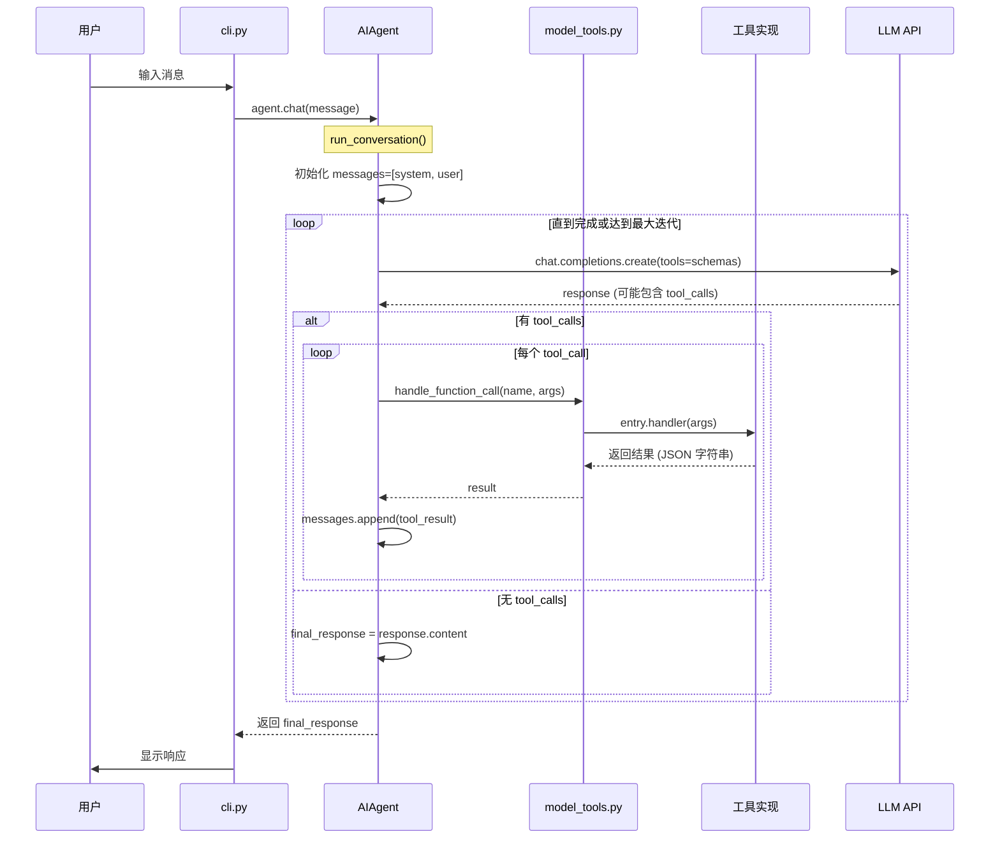
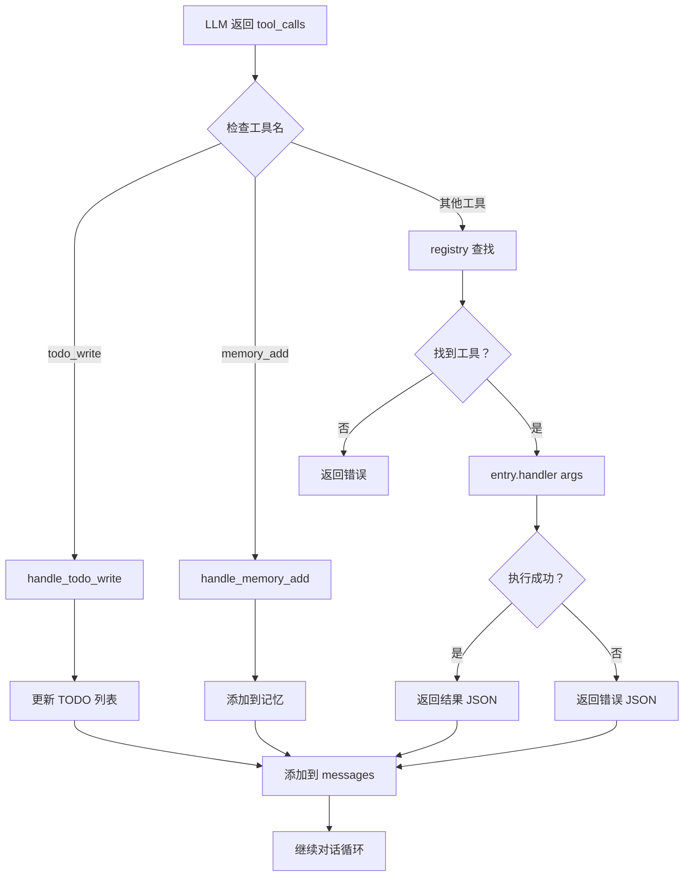
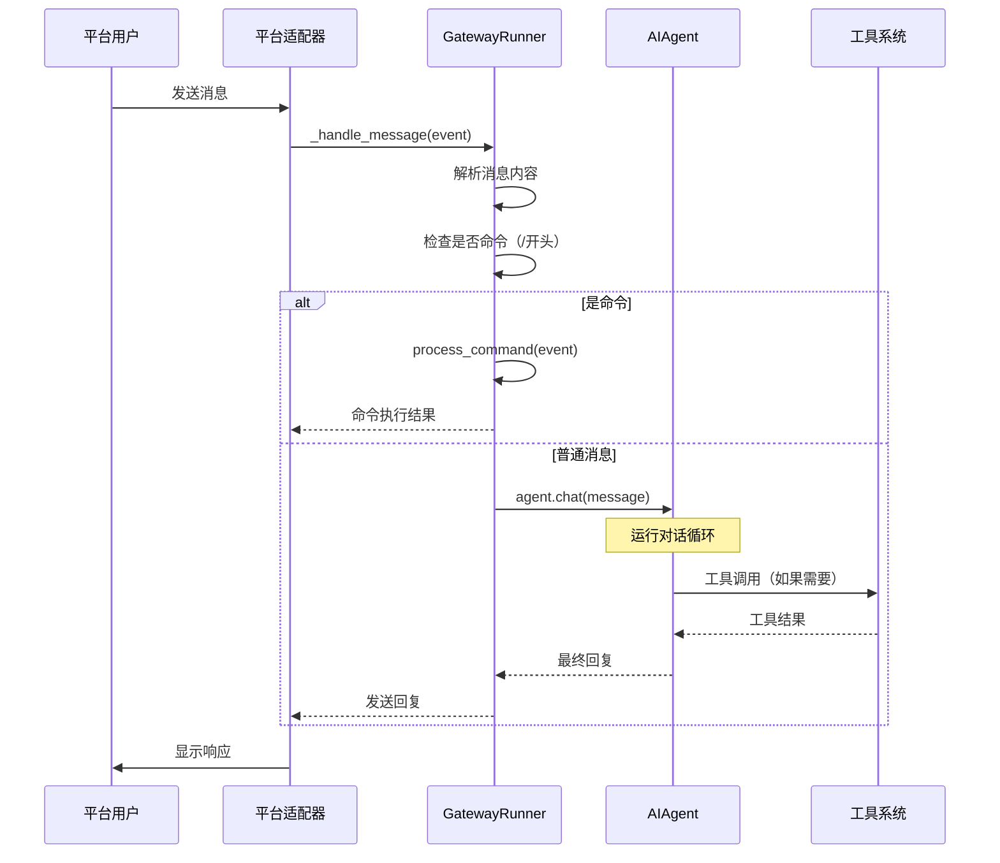
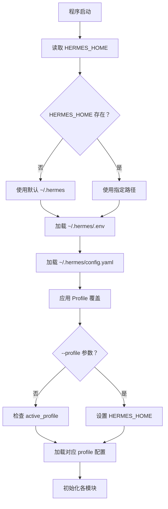

# Hermes-Agent 快速入门指南

> 帮助你快速熟悉项目代码结构、核心入口和业务流程  
> 整理日期：2026-04-23 | 版本：1.0

***

## 目录

1. [项目概览](#1-项目概览)
2. [代码地图](#2-代码地图)
3. [核心入口点](#3-核心入口点)
4. [业务流程详解](#4-业务流程详解)
5. [关键模块解析](#5-关键模块解析)
6. [快速上手路径](#6-快速上手路径)

***

## 1. 项目概览

### 1.1 项目定位

Hermes-Agent 是一个**多功能 AI Agent 框架**，支持：
- **CLI 交互模式** - 终端交互式 AI 助手
- **多平台网关** - Telegram/Discord/Slack/WhatsApp 等
- **工具系统** - 100+ 工具（终端、文件、Web、浏览器、代码执行等）
- **技能系统** - 可扩展的技能插件机制
- **多配置文件** - Profile 隔离的多实例支持

### 1.2 核心架构

```
┌─────────────────────────────────────────────────────────┐
│                   用户接口层                              │
│  ┌─────────────┐  ┌─────────────┐  ┌─────────────┐     │
│  │    CLI      │  │   Gateway   │  │     ACP     │     │
│  │  终端交互   │  │  平台适配器  │  │  编辑器集成  │     │
│  └─────────────┘  └─────────────┘  └─────────────┘     │
└─────────────────────────────────────────────────────────┘
                        ↓
┌─────────────────────────────────────────────────────────┐
│                   Agent 核心层                            │
│  ┌─────────────────────────────────────────────────┐    │
│  │              AIAgent (run_agent.py)             │    │
│  │  - run_conversation() 核心对话循环               │    │
│  │  - chat() 简化接口                               │    │
│  │  - 工具调用调度、上下文管理、提示词构建          │    │
│  └─────────────────────────────────────────────────┘    │
└─────────────────────────────────────────────────────────┘
                        ↓
┌─────────────────────────────────────────────────────────┐
│                   工具系统层                              │
│  ┌─────────────┐  ┌─────────────┐  ┌─────────────┐     │
│  │  Registry   │  │  Tools      │  │  MCP        │     │
│  │  工具注册   │  │  工具实现   │  │  协议支持   │     │
│  └─────────────┘  └─────────────┘  └─────────────┘     │
└─────────────────────────────────────────────────────────┘
                        ↓
┌─────────────────────────────────────────────────────────┐
│                   基础设施层                              │
│  ┌─────────────┐  ┌─────────────┐  ┌─────────────┐     │
│  │   Memory    │  │   Session   │  │   Config    │     │
│  │   内存管理  │  │   会话存储  │  │   配置管理  │     │
│  └─────────────┘  └─────────────┘  └─────────────┘     │
└─────────────────────────────────────────────────────────┘
```

### 1.3 文件结构

```
hermes-agent/
├── hermes_cli/               # CLI 入口和配置
│   ├── main.py              # hermes 命令入口（第 44-200 行）
│   ├── config.py            # 配置加载和迁移
│   ├── commands.py          # 斜杠命令注册
│   └── ...
├── cli.py                    # 交互式 CLI 主程序（第 200-600 行）
├── run_agent.py              # AIAgent 核心（第 492-7600 行）
├── model_tools.py            # 工具编排（第 1-500 行）
├── tools/                    # 工具实现
│   ├── registry.py          # 工具注册中心（第 1-200 行）
│   ├── terminal_tool.py     # 终端工具
│   ├── file_tools.py        # 文件工具
│   ├── web_tools.py         # Web 工具
│   ├── browser_tool.py      # 浏览器工具
│   └── ...
├── gateway/                  # 平台网关
│   ├── run.py               # 网关入口（第 1-300 行）
│   └── platforms/           # 平台适配器
├── agent/                    # Agent 内部模块
│   ├── prompt_builder.py    # 提示词构建
│   ├── context_compressor.py # 上下文压缩
│   └── ...
└── hermes_constants.py       # 全局常量
```

***

## 2. 代码地图

### 2.1 核心文件清单

| 文件 | 关键行数 | 职责 | 阅读优先级 |
|------|----------|------|------------|
| `hermes_cli/main.py` | L44-200 | CLI 命令入口，参数解析 | ⭐⭐⭐ |
| `cli.py` | L200-600 | 交互式 CLI 主循环 | ⭐⭐⭐ |
| `run_agent.py` | L492-800 | AIAgent 类定义 | ⭐⭐⭐⭐ |
| `run_agent.py` | L7544-7600 | run_conversation() 核心循环 | ⭐⭐⭐⭐⭐ |
| `model_tools.py` | L1-200 | 工具发现和调度 | ⭐⭐⭐⭐ |
| `tools/registry.py` | L1-200 | 工具注册中心 | ⭐⭐⭐ |
| `gateway/run.py` | L1-300 | 网关启动入口 | ⭐⭐ |

### 2.2 模块依赖关系

```
hermes_cli/main.py (入口)
       ↓
cli.py (CLI 实现)
       ↓
run_agent.py (AIAgent)
       ↓
model_tools.py (工具编排)
       ↓
tools/registry.py (工具注册)
       ↓
tools/*.py (工具实现)
```

***

## 3. 核心入口点

### 3.1 CLI 入口 - `hermes_cli/main.py`

**文件位置：** `/home/meizu/Documents/my_agent_project/hermes-agent/hermes_cli/main.py`

**关键代码段：**

```python
# 第 44-200 行 - 主函数和命令分发
def main():
    parser = argparse.ArgumentParser(
        prog="hermes",
        description="Hermes Agent - Your AI assistant",
    )
    
    subparsers = parser.add_subparsers(dest="command", help="Commands")
    
    # chat 命令
    chat_parser = subparsers.add_parser("chat", help="Interactive chat")
    chat_parser.add_argument("message", nargs="?", help="Initial message")
    
    # gateway 命令
    gateway_parser = subparsers.add_parser("gateway", help="Messaging gateway")
    gateway_subparsers = gateway_parser.add_subparsers(dest="gateway_command")
    
    # setup 命令
    setup_parser = subparsers.add_parser("setup", help="Interactive setup")
    
    # ... 其他命令
    
    args = parser.parse_args()
    
    if args.command == "chat" or args.command is None:
        from cli import main as cli_main
        cli_main()
    elif args.command == "gateway":
        from gateway.run import main as gateway_main
        gateway_main(args.gateway_command)
    elif args.command == "setup":
        from hermes_cli.setup import run_setup
        run_setup()
```

**执行流程：**

```
用户输入 hermes chat
       ↓
hermes_cli/main.py:main() 解析参数
       ↓
导入 cli.py 并调用 cli_main()
       ↓
进入交互式 CLI 循环
```

### 3.2 交互式 CLI 入口 - `cli.py`

**文件位置：** `/home/meizu/Documents/my_agent_project/hermes-agent/cli.py`

**关键代码段：**

```python
# 第 200-300 行 - HermesCLI 类定义
class HermesCLI:
    def __init__(self):
        self.agent = None
        self.config = load_cli_config()
        self.session_id = str(uuid.uuid4())
        
    def run(self):
        """主运行循环"""
        self.show_banner()  # 显示横幅
        self.load_agent()   # 初始化 Agent
        
        # 进入 REPL 循环
        while True:
            try:
                user_input = self.get_input()
                if user_input.startswith("/"):
                    self.process_command(user_input)
                else:
                    self.chat(user_input)
            except KeyboardInterrupt:
                continue
            except EOFError:
                break
    
    def chat(self, message: str):
        """与 Agent 对话"""
        if not self.agent:
            self.load_agent()
        
        response = self.agent.chat(message)
        self.show_response(response)
```

```python
# 第 400-500 行 - 命令处理
def process_command(self, command: str):
    """处理斜杠命令"""
    parts = command.split()
    cmd_name = parts[0].lower()
    
    if cmd_name == "/help":
        self.show_help()
    elif cmd_name == "/model":
        self.switch_model(parts[1:])
    elif cmd_name == "/tools":
        self.toggle_tools(parts[1:])
    elif cmd_name == "/exit":
        sys.exit(0)
    # ... 其他命令
```

**执行流程：**

```
cli_main() 调用
       ↓
HermesCLI.run() 启动循环
       ↓
显示横幅 → 初始化 Agent → 等待输入
       ↓
用户输入 → 判断命令类型 → 执行对应处理
       ↓
显示响应 → 继续循环
```

### 3.3 Agent 核心入口 - `run_agent.py`

**文件位置：** `/home/meizu/Documents/my_agent_project/hermes-agent/run_agent.py`

**关键代码段：**

```python
# 第 492-600 行 - AIAgent 类定义
class AIAgent:
    def __init__(self,
        model: str = "anthropic/claude-opus-4.6",
        max_iterations: int = 90,
        enabled_toolsets: list = None,
        disabled_toolsets: list = None,
        quiet_mode: bool = False,
        save_trajectories: bool = False,
        platform: str = None,
        session_id: str = None,
        skip_context_files: bool = False,
        skip_memory: bool = False,
    ):
        """初始化 Agent"""
        self.model = model
        self.max_iterations = max_iterations
        self.enabled_toolsets = enabled_toolsets or []
        self.disabled_toolsets = disabled_toolsets or []
        self.quiet_mode = quiet_mode
        self.session_id = session_id or str(uuid.uuid4())
        self.platform = platform or "cli"
        
        # 初始化客户端
        self.client = self._create_client()
        
        # 初始化消息历史
        self.messages = []
        
        # 初始化系统提示词
        self.system_message = self._build_system_message()
```

```python
# 第 7544-7600 行 - run_conversation() 核心循环
def run_conversation(
    self,
    user_message: str,
    system_message: str = None,
    conversation_history: list = None,
    task_id: str = None,
) -> dict:
    """
    运行一轮 Agent 对话
    
    返回：
        dict: {
            "final_response": str,  # 最终回复
            "messages": list,       # 完整消息历史
            "tool_calls": list,     # 工具调用记录
        }
    """
    # 1. 初始化消息列表
    messages = conversation_history or []
    
    # 2. 添加系统提示词
    if system_message:
        messages.insert(0, {"role": "system", "content": system_message})
    
    # 3. 添加用户消息
    messages.append({"role": "user", "content": user_message})
    
    # 4. 开始对话循环
    api_call_count = 0
    while api_call_count < self.max_iterations:
        # 4.1 调用 LLM
        response = self.client.chat.completions.create(
            model=self.model,
            messages=messages,
            tools=self.tool_schemas,
        )
        api_call_count += 1
        
        # 4.2 检查是否有工具调用
        if response.tool_calls:
            # 4.2.1 处理每个工具调用
            for tool_call in response.tool_calls:
                result = handle_function_call(
                    tool_call.name,
                    tool_call.args,
                    task_id=task_id,
                )
                
                # 4.2.2 添加工具结果到消息历史
                messages.append({
                    "role": "tool",
                    "content": result,
                    "tool_call_id": tool_call.id,
                })
        else:
            # 4.3 没有工具调用，返回最终回复
            final_response = response.content
            break
    
    return {
        "final_response": final_response,
        "messages": messages,
        "tool_calls": [...],
    }
```

**执行流程图：**

```
run_conversation(user_message)
       ↓
初始化 messages = [system, user]
       ↓
进入循环 (api_call_count < max_iterations)
       ↓
┌─────────────────────────────────────┐
│ 调用 LLM API                         │
│ client.chat.completions.create()    │
└─────────────────────────────────────┘
       ↓
检查 response.tool_calls
       ↓
有工具调用？──是──→ 处理工具调用
       │              ↓
       │         遍历每个 tool_call
       │              ↓
       │         handle_function_call()
       │              ↓
       │         添加 tool result 到 messages
       │              ↓
       └──────← 继续循环
       │
       否
       ↓
返回最终回复
```

### 3.4 工具系统入口 - `tools/registry.py`

**文件位置：** `/home/meizu/Documents/my_agent_project/hermes-agent/tools/registry.py`

**关键代码段：**

```python
# 第 1-200 行 - ToolRegistry 类定义
class ToolRegistry:
    """单例工具注册中心"""
    
    def __init__(self):
        self._tools: Dict[str, ToolEntry] = {}
        self._toolset_checks: Dict[str, Callable] = {}
    
    def register(
        self,
        name: str,
        toolset: str,
        schema: dict,
        handler: Callable,
        check_fn: Callable = None,
        requires_env: list = None,
        is_async: bool = False,
        description: str = "",
        emoji: str = "",
    ):
        """注册一个工具"""
        self._tools[name] = ToolEntry(
            name=name,
            toolset=toolset,
            schema=schema,
            handler=handler,
            check_fn=check_fn,
            requires_env=requires_env or [],
            is_async=is_async,
            description=description,
            emoji=emoji,
        )
    
    def get_definitions(self, tool_names: Set[str]) -> List[dict]:
        """获取工具 schema 列表（OpenAI 格式）"""
        result = []
        for name in sorted(tool_names):
            entry = self._tools.get(name)
            if not entry:
                continue
            
            # 检查工具可用性
            if entry.check_fn:
                try:
                    if not entry.check_fn():
                        continue
                except Exception:
                    continue
            
            result.append({
                "type": "function",
                "function": entry.schema,
            })
        return result
    
    def dispatch(self, name: str, args: dict, **kwargs) -> str:
        """调度执行工具"""
        entry = self._tools.get(name)
        if not entry:
            raise ValueError(f"Unknown tool: {name}")
        
        # 执行处理函数
        result = entry.handler(args, **kwargs)
        
        # 确保返回 JSON 字符串
        if isinstance(result, dict):
            return json.dumps(result)
        return result


# 全局单例
registry = ToolRegistry()
```

**工具注册流程：**

```
tools/terminal_tool.py 导入
       ↓
在模块级别调用 registry.register()
       ↓
工具信息存入 registry._tools 字典
       ↓
所有工具文件导入完成后
       ↓
registry 包含所有可用工具
```

### 3.5 工具调度入口 - `model_tools.py`

**文件位置：** `/home/meizu/Documents/my_agent_project/hermes-agent/model_tools.py`

**关键代码段：**

```python
# 第 1-100 行 - 工具发现
def _discover_tools() -> None:
    """导入所有工具模块，触发 registry.register()"""
    tool_modules = [
        "tools.terminal_tool",
        "tools.file_tools",
        "tools.web_tools",
        "tools.browser_tool",
        "tools.code_execution_tool",
        # ... 更多工具
    ]
    
    for module_name in tool_modules:
        importlib.import_module(module_name)


def get_tool_definitions(
    enabled_toolsets: list = None,
    disabled_toolsets: list = None,
) -> List[dict]:
    """获取所有可用工具的 schema"""
    # 1. 发现工具
    _discover_tools()
    
    # 2. 从 registry 获取定义
    tool_names = set()
    for entry in registry._tools.values():
        # 检查 toolset 过滤
        if entry.toolset in (disabled_toolsets or []):
            continue
        if enabled_toolsets and entry.toolset not in enabled_toolsets:
            continue
        
        tool_names.add(entry.name)
    
    # 3. 返回 schema 列表
    return registry.get_definitions(tool_names)
```

```python
# 第 200-300 行 - 工具调用处理
def handle_function_call(
    tool_name: str,
    tool_args: dict,
    task_id: str = None,
) -> str:
    """
    处理 LLM 的工具调用请求
    
    流程：
    1. 查找工具
    2. 执行工具
    3. 返回结果（JSON 字符串）
    """
    # 1. 特殊工具拦截（todo, memory 等）
    if tool_name == "todo_write":
        return handle_todo_write(tool_args)
    elif tool_name == "memory_add":
        return handle_memory_add(tool_args)
    
    # 2. 从 registry 查找工具
    entry = registry._tools.get(tool_name)
    if not entry:
        return json.dumps({
            "error": f"Unknown tool: {tool_name}",
        })
    
    # 3. 执行工具
    try:
        result = entry.dispatch(tool_args, task_id=task_id)
        return result
    except Exception as e:
        logger.exception("Tool execution failed: %s", tool_name)
        return json.dumps({
            "error": str(e),
            "tool": tool_name,
        })
```

**工具调度流程：**

```
LLM 返回 tool_calls
       ↓
run_agent.py 调用 handle_function_call()
       ↓
检查是否为特殊工具（todo/memory）
       ↓
否 → 从 registry 查找工具
       ↓
调用 entry.handler(args)
       ↓
返回 JSON 字符串结果
       ↓
添加到 messages 作为 tool result
```

### 3.6 网关入口 - `gateway/run.py`

**文件位置：** `/home/meizu/Documents/my_agent_project/hermes-agent/gateway/run.py`

**关键代码段：**

```python
# 第 1-200 行 - 网关启动
class GatewayRunner:
    """网关生命周期管理"""
    
    def __init__(self):
        self.platforms = []
        self.config = self._load_config()
        
    def _load_config(self):
        """加载配置文件 ~/.hermes/config.yaml"""
        config_path = get_hermes_home() / "config.yaml"
        with open(config_path) as f:
            return yaml.safe_load(f)
    
    async def start(self):
        """启动所有平台适配器"""
        # 1. 读取配置
        platforms_config = self.config.get("gateway", {}).get("platforms", {})
        
        # 2. 启动每个平台
        for platform_name, platform_config in platforms_config.items():
            if not platform_config.get("enabled", False):
                continue
            
            # 3. 动态导入平台适配器
            adapter = self._load_adapter(platform_name)
            await adapter.connect(platform_config)
            self.platforms.append(adapter)
        
        # 4. 运行主循环
        await self._main_loop()
```

**平台适配器列表：**

| 平台 | 适配器文件 | 关键方法 |
|------|------------|----------|
| Telegram | `gateway/platforms/telegram.py` | `connect()`, `_handle_message()` |
| Discord | `gateway/platforms/discord.py` | `setup()`, `on_message()` |
| Slack | `gateway/platforms/slack.py` | `start()`, `_handle_event()` |
| WhatsApp | `gateway/platforms/whatsapp.py` | `connect()`, `_process_message()` |

***

## 4. 业务流程详解

### 4.1 CLI 对话流程



**关键代码位置：**

- CLI 输入处理：`cli.py:L400-500`
- Agent 对话循环：`run_agent.py:L7544-7600`
- 工具调度：`model_tools.py:L200-300`
- 工具注册：`tools/registry.py:L59-110`

### 4.2 工具调用流程



**关键代码位置：**

- 工具拦截：`model_tools.py:L200-250`
- 工具注册：`tools/registry.py:L59-94`
- 工具分发：`tools/registry.py:L149-180`
- 错误处理：`model_tools.py:L280-300`

### 4.3 网关消息处理流程



**关键代码位置：**

- 网关启动：`gateway/run.py:L100-200`
- 消息处理：`gateway/run.py:L400-500`
- 命令解析：`gateway/run.py:L600-700`
- 平台适配：`gateway/platforms/*.py`

### 4.4 配置文件加载流程



**关键代码位置：**

- Profile 处理：`hermes_cli/main.py:L83-150`
- 配置加载：`hermes_cli/config.py:L1-200`
- 环境变量：`hermes_cli/env_loader.py:L1-100`

***

## 5. 关键模块解析

### 5.1 提示词构建系统

**文件：** `agent/prompt_builder.py`

**职责：** 组装系统提示词，包括：
- Agent 身份设定
- 工具使用说明
- 记忆系统指导
- 技能列表
- 平台特定提示

**关键函数：**

```python
# 第 100-200 行 - 构建系统提示词
def build_system_message(
    model: str,
    enabled_toolsets: list,
    platform: str,
) -> str:
    """组装完整的系统提示词"""
    parts = []
    
    # 1. Agent 身份
    parts.append(DEFAULT_AGENT_IDENTITY)
    
    # 2. 工具使用说明
    parts.append(build_tools_guidance(enabled_toolsets))
    
    # 3. 记忆系统指导
    parts.append(MEMORY_GUIDANCE)
    
    # 4. 技能列表
    parts.append(build_skills_system_prompt())
    
    # 5. 平台特定提示
    if platform in PLATFORM_HINTS:
        parts.append(PLATFORM_HINTS[platform])
    
    return "\n\n".join(parts)
```

### 5.2 上下文压缩系统

**文件：** `agent/context_compressor.py`

**职责：** 当上下文超出限制时自动压缩

**关键方法：**

```python
# 第 50-150 行 - 上下文压缩
class ContextCompressor:
    def compress(self, messages: list, limit: int) -> list:
        """压缩消息历史到限制内"""
        # 1. 估算当前 token 数
        current_tokens = estimate_messages_tokens_rough(messages)
        
        # 2. 如果未超限，直接返回
        if current_tokens <= limit:
            return messages
        
        # 3. 保留系统提示词和最近 N 轮
        compressed = [messages[0]]  # system
        compressed.extend(messages[-10:])  # 最近 10 轮
        
        # 4. 添加压缩标记
        compressed.insert(1, {
            "role": "system",
            "content": f"[Previous {len(messages)-11} messages compressed]",
        })
        
        return compressed
```

### 5.3 记忆管理系统

**文件：** `agent/memory_manager.py`

**职责：** 管理短期记忆（SessionDB）和长期记忆

**关键函数：**

```python
# 第 100-200 行 - 构建记忆上下文
def build_memory_context_block(
    session_id: str,
    user_message: str,
) -> str:
    """从记忆系统检索相关上下文"""
    # 1. 搜索会话历史
    session_db = SessionDB(session_id)
    recent = session_db.search_recent(limit=5)
    
    # 2. 搜索长期记忆
    long_term = search_long_term_memory(user_message, limit=3)
    
    # 3. 组装记忆块
    memory_block = []
    if recent:
        memory_block.append("## Recent Sessions\n" + format_sessions(recent))
    if long_term:
        memory_block.append("## Long-term Memory\n" + format_memories(long_term))
    
    return "\n\n".join(memory_block)
```

### 5.4 工具审批系统

**文件：** `tools/approval.py`

**职责：** 检测危险命令并请求用户审批

**关键函数：**

```python
# 第 50-150 行 - 危险命令检测
def detect_dangerous_command(command: str) -> tuple:
    """检测命令是否危险"""
    dangerous_patterns = [
        (r"\brm\s+-rf\s+/", "recursive_delete_root"),
        (r"\bdd\s+.*\bif=\b.*\bof=/dev/", "disk_overwrite"),
        (r"\bchmod\s+-R\s+777\s+/", "chmod_recursive"),
        # ... 50+ 种危险模式
    ]
    
    for pattern, key in dangerous_patterns:
        if re.search(pattern, command):
            return (True, key, get_description(key))
    
    return (False, None, None)
```

### 5.5 会话存储系统

**文件：** `hermes_state.py`

**职责：** SQLite 会话存储，支持 FTS5 全文搜索

**关键方法：**

```python
# 第 100-200 行 - 会话数据库
class SessionDB:
    def __init__(self, session_id: str):
        self.db_path = get_hermes_home() / "sessions.db"
        self.session_id = session_id
        self._init_db()
    
    def _init_db(self):
        """初始化数据库表"""
        conn = sqlite3.connect(self.db_path)
        cursor = conn.cursor()
        
        # 创建会话表
        cursor.execute("""
            CREATE TABLE IF NOT EXISTS sessions (
                id TEXT PRIMARY KEY,
                platform TEXT,
                created_at TIMESTAMP,
                updated_at TIMESTAMP
            )
        """)
        
        # 创建消息表
        cursor.execute("""
            CREATE TABLE IF NOT EXISTS messages (
                id INTEGER PRIMARY KEY AUTOINCREMENT,
                session_id TEXT,
                role TEXT,
                content TEXT,
                timestamp TIMESTAMP
            )
        """)
        
        # 创建 FTS5 虚拟表（全文搜索）
        cursor.execute("""
            CREATE VIRTUAL TABLE IF NOT EXISTS messages_fts USING fts5(
                content,
                content='messages',
                content_rowid='id'
            )
        """)
        
        conn.commit()
        conn.close()
```

***

## 6. 快速上手路径

### 6.1 第一次阅读建议

**推荐顺序：**

1. **入门级** - 先理解整体流程
   - `hermes_cli/main.py:L44-200` - CLI 入口
   - `cli.py:L200-300` - CLI 主循环
   - `run_agent.py:L492-600` - AIAgent 类

2. **进阶级** - 深入核心逻辑
   - `run_agent.py:L7544-7600` - run_conversation()
   - `model_tools.py:L1-200` - 工具发现
   - `model_tools.py:L200-300` - 工具调度

3. **专家级** - 掌握全部细节
   - `tools/registry.py:L1-200` - 工具注册
   - `agent/prompt_builder.py:L100-200` - 提示词构建
   - `agent/context_compressor.py:L50-150` - 上下文压缩

### 6.2 调试技巧

**设置断点：**

```python
# 在关键位置添加
import pdb; pdb.set_trace()

# 或使用 logging
logger.info("Debug: %s", variable)
```

**启用详细日志：**

```bash
export HERMES_DEBUG=1
hermes chat "test message"
```

**查看工具调用：**

```bash
# 启用工具调用日志
export HERMES_LOG_TOOLS=1
hermes chat "list files in current directory"
```

### 6.3 实战练习

**练习 1：添加一个新工具**

1. 创建 `tools/my_tool.py`
2. 定义 `my_tool(args)` 函数
3. 调用 `registry.register()` 注册
4. 在 `model_tools.py:_discover_tools()` 中添加导入
5. 测试：`hermes chat "use my_tool to..."`

**练习 2：修改系统提示词**

1. 编辑 `agent/prompt_builder.py`
2. 修改 `DEFAULT_AGENT_IDENTITY`
3. 重启 CLI 测试效果

**练习 3：添加新平台适配器**

1. 创建 `gateway/platforms/myplatform.py`
2. 实现 `connect()`, `_handle_message()`
3. 在 `config.yaml` 中配置
4. 启动网关测试

### 6.4 常见问题

**Q: 如何查看当前加载的工具？**

```bash
hermes chat --list-tools
```

**Q: 如何禁用某个工具集？**

```bash
hermes chat --disabled-toolsets web,browser
```

**Q: 如何查看 Agent 对话日志？**

```bash
tail -f ~/.hermes/hermes.log
```

**Q: 如何切换模型？**

```bash
# CLI 中
/model anthropic/claude-sonnet-4-20250514

# 或启动时指定
hermes chat --model anthropic/claude-sonnet-4-20250514
```

***

## 附录

### A. 关键常量定义

**文件：** `hermes_constants.py`

```python
# Hermes 主目录
HERMES_HOME = Path.home() / ".hermes"

# 配置文件路径
CONFIG_PATH = HERMES_HOME / "config.yaml"
ENV_PATH = HERMES_HOME / ".env"

# 数据库路径
SESSIONS_DB = HERMES_HOME / "sessions.db"
MEMORY_DB = HERMES_HOME / "memory.db"

# 默认模型
DEFAULT_MODEL = "anthropic/claude-opus-4.6"

# 默认最大迭代次数
DEFAULT_MAX_ITERATIONS = 90

# 输出截断限制
MAX_STDOUT_BYTES = 50 * 1024  # 50KB
```

### B. 环境变量列表

| 变量名 | 说明 | 默认值 |
|--------|------|--------|
| `HERMES_HOME` | 配置目录路径 | `~/.hermes` |
| `HERMES_DEBUG` | 启用调试模式 | `0` |
| `HERMES_QUIET` | 安静模式 | `0` |
| `HERMES_REDACT_SECRETS` | 敏感数据脱敏 | `1` |
| `HERMES_LOG_TOOLS` | 记录工具调用 | `0` |

### C. 配置文件结构

**~/.hermes/config.yaml:**

```yaml
version: 5

# 显示设置
display:
  skin: default
  tool_progress_command: true
  
# 模型设置
model:
  default: anthropic/claude-opus-4.6
  parameters:
    temperature: 0.1
    max_tokens: 8192

# 工具集设置
toolsets:
  enabled: []  # 空表示全部启用
  disabled: []

# 网关设置
gateway:
  platforms:
    telegram:
      enabled: false
      bot_token: "${TELEGRAM_BOT_TOKEN}"
    discord:
      enabled: false
      bot_token: "${DISCORD_BOT_TOKEN}"

# 终端设置
terminal:
  background: false
  notify_on_complete: false
```

***

**文档版本：** 1.0  
**整理日期：** 2026-04-23  
**适用版本：** Hermes-Agent v2.0+
