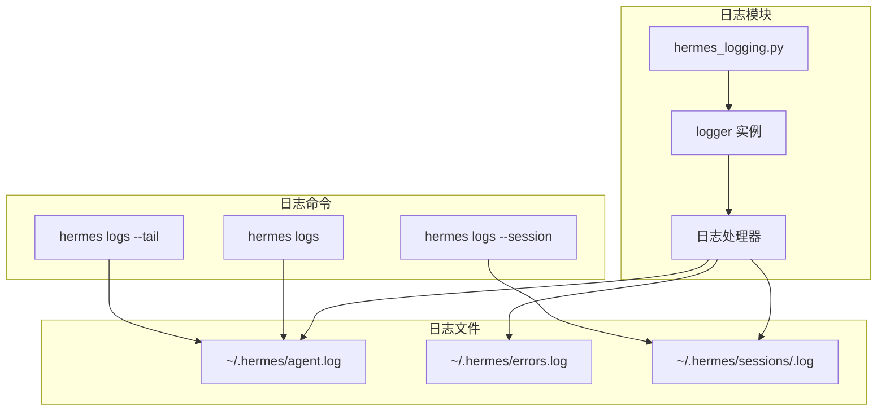

# Hermes-Agent 日志系统与调试指南

> 整理日期：2026-04-23 | 版本：1.0

***

## 目录

1. [日志系统架构](#1-日志系统架构)
2. [日志配置](#2-日志配置)
3. [添加日志](#3-添加日志)
4. [查看日志](#4-查看日志)
5. [调试技巧](#5-调试技巧)
6. [常见问题排查](#6-常见问题排查)
7. [实战案例](#7-实战案例)

***

## 1. 日志系统架构

### 1.1 日志系统组成



### 1.2 日志级别

| 级别 | 说明 | 使用场景 | 示例 |
|------|------|----------|------|
| `DEBUG` | 调试信息 | 详细的调试信息 | `logger.debug("Tool args: %s", args)` |
| `INFO` | 一般信息 | 正常的业务流程 | `logger.info("Conversation turn started")` |
| `WARNING` | 警告信息 | 可能的问题 | `logger.warning("Rate limit approaching")` |
| `ERROR` | 错误信息 | 错误但可继续 | `logger.error("Tool execution failed: %s", e)` |
| `CRITICAL` | 严重错误 | 系统崩溃 | `logger.critical("Database corruption detected")` |

### 1.3 日志格式化

```python
# 默认日志格式
"%(asctime)s - %(name)s - %(levelname)s - %(message)s"

# 带会话上下文的格式（run_agent.py 中）
"%(asctime)s - %(levelname)s - [Session: %(session_id)s] - %(message)s"
```

**示例输出：**
```
2026-04-23 10:30:15,123 - hermes.agent - INFO - [Session: abc-123] - Conversation turn started
2026-04-23 10:30:16,456 - hermes.tools - DEBUG - Executing tool: terminal
2026-04-23 10:30:17,789 - hermes.errors - ERROR - Tool execution failed: Permission denied
```

***

## 2. 日志配置

### 2.1 日志配置文件

**文件位置：** `~/.hermes/config.yaml`

```yaml
# 日志配置
logging:
  # 日志级别：DEBUG, INFO, WARNING, ERROR, CRITICAL
  level: INFO
  
  # 日志文件路径
  file: ~/.hermes/agent.log
  
  # 错误日志文件路径
  error_file: ~/.hermes/errors.log
  
  # 日志格式
  format: "%(asctime)s - %(name)s - %(levelname)s - %(message)s"
  
  # 日志轮转
  rotation:
    max_bytes: 10485760  # 10MB
    backup_count: 5      # 保留 5 个备份文件
  
  # 会话日志（每个会话独立日志）
  session_logs:
    enabled: true
    directory: ~/.hermes/sessions/
```

### 2.2 环境变量配置

```bash
# 设置日志级别
export HERMES_LOG_LEVEL=DEBUG

# 启用详细日志
export HERMES_DEBUG=1

# 启用工具调用日志
export HERMES_LOG_TOOLS=1

# 启用 API 调用日志
export HERMES_LOG_API=1

# 启用会话日志
export HERMES_SESSION_LOGS=1

# 指定日志文件路径
export HERMES_LOG_FILE=/path/to/custom.log
```

### 2.3 代码中配置日志

**文件位置：** `hermes_logging.py`

```python
import logging
import sys
from pathlib import Path
from logging.handlers import RotatingFileHandler

def setup_logging(mode: str = "cli", log_level: str = None):
    """
    配置 Hermes 日志系统
    
    Args:
        mode: 运行模式 ("cli", "gateway", "agent")
        log_level: 日志级别（可选，默认从配置读取）
    """
    # 1. 获取日志级别
    if log_level is None:
        log_level = os.getenv("HERMES_LOG_LEVEL", "INFO").upper()
    
    numeric_level = getattr(logging, log_level, logging.INFO)
    
    # 2. 创建根 logger
    logger = logging.getLogger("hermes")
    logger.setLevel(numeric_level)
    
    # 3. 创建控制台处理器
    console_handler = logging.StreamHandler(sys.stdout)
    console_handler.setLevel(numeric_level)
    console_handler.setFormatter(logging.Formatter(
        "%(asctime)s - %(name)s - %(levelname)s - %(message)s"
    ))
    logger.addHandler(console_handler)
    
    # 4. 创建文件处理器（轮转）
    log_file = Path.home() / ".hermes" / "agent.log"
    log_file.parent.mkdir(parents=True, exist_ok=True)
    
    file_handler = RotatingFileHandler(
        log_file,
        maxBytes=10*1024*1024,  # 10MB
        backupCount=5
    )
    file_handler.setLevel(numeric_level)
    file_handler.setFormatter(logging.Formatter(
        "%(asctime)s - %(name)s - %(levelname)s - %(message)s"
    ))
    logger.addHandler(file_handler)
    
    # 5. 创建错误日志处理器
    error_file = Path.home() / ".hermes" / "errors.log"
    error_handler = RotatingFileHandler(
        error_file,
        maxBytes=10*1024*1024,
        backupCount=3
    )
    error_handler.setLevel(logging.ERROR)
    error_handler.setFormatter(logging.Formatter(
        "%(asctime)s - %(name)s - %(levelname)s - %(message)s"
    ))
    logger.addHandler(error_handler)
    
    logger.info("Logging initialized (mode=%s, level=%s)", mode, log_level)
```

***

## 3. 添加日志

### 3.1 基础日志记录

```python
# 1. 导入 logger
import logging
logger = logging.getLogger(__name__)

# 2. 记录不同级别的消息
logger.debug("调试信息：详细的数据")
logger.info("一般信息：业务流程")
logger.warning("警告信息：可能的问题")
logger.error("错误信息：发生错误")
logger.critical("严重错误：系统崩溃")

# 3. 带参数的日志
logger.info("User %s logged in from %s", user_id, ip_address)
logger.debug("Tool args: %s", json.dumps(args, indent=2))
logger.error("Failed to connect: %s", str(error))
```

### 3.2 在 AIAgent 中添加日志

**文件位置：** `run_agent.py`

```python
import logging
logger = logging.getLogger(__name__)

class AIAgent:
    def run_conversation(self, user_message: str, ...):
        """运行对话循环"""
        
        # 1. 记录对话开始
        _msg_preview = (user_message[:80] + "...") if len(user_message) > 80 else user_message
        _msg_preview = _msg_preview.replace("\n", " ")
        logger.info(
            "conversation turn: session=%s model=%s provider=%s platform=%s history=%d msg=%r",
            self.session_id or "none", 
            self.model, 
            self.provider or "unknown",
            self.platform or "unknown", 
            len(conversation_history or []),
            _msg_preview,
        )
        
        # 2. 记录 API 调用
        logger.debug("Calling LLM API: model=%s, messages=%d", self.model, len(messages))
        
        try:
            response = self._interruptible_api_call(messages=messages)
            logger.info("API call successful: choices=%d", len(response.choices))
            
        except Exception as e:
            logger.error("API call failed: %s", str(e), exc_info=True)
            raise
        
        # 3. 记录工具调用
        if response.choices[0].message.tool_calls:
            tool_calls = response.choices[0].message.tool_calls
            logger.info("Tool calls detected: count=%d", len(tool_calls))
            
            for tool_call in tool_calls:
                logger.debug(
                    "Executing tool: %s, args=%s",
                    tool_call.function.name,
                    tool_call.function.arguments,
                )
                
                try:
                    result = handle_function_call(...)
                    logger.debug("Tool result: %s", result[:200])
                    
                except Exception as e:
                    logger.error(
                        "Tool execution failed: tool=%s, error=%s",
                        tool_call.function.name,
                        str(e),
                        exc_info=True,
                    )
        
        # 4. 记录会话持久化
        if self.persist_session:
            logger.debug("Persisting session: %s", self.session_id)
            self._persist_session(messages, final_response)
            logger.info("Session persisted: messages=%d", len(messages))
```

### 3.3 在工具中添加日志

**文件位置：** `tools/terminal_tool.py`

```python
import logging
logger = logging.getLogger(__name__)

def terminal_tool(command: str, background: bool = False, task_id: str = None):
    """执行终端命令"""
    
    # 1. 记录工具调用
    logger.info("Terminal tool called: command=%s, background=%s", command, background)
    logger.debug("Task ID: %s", task_id)
    
    try:
        if background:
            logger.debug("Running in background mode")
            process = subprocess.Popen(
                command,
                shell=True,
                stdout=subprocess.PIPE,
                stderr=subprocess.PIPE,
            )
            result = {"pid": process.pid, "status": "started"}
            logger.info("Background process started: pid=%d", process.pid)
            
        else:
            logger.debug("Running in foreground mode")
            logger.debug("Executing command: %s", command)
            
            result = subprocess.run(
                command,
                shell=True,
                capture_output=True,
                text=True,
                timeout=300,
            )
            
            logger.info(
                "Command completed: returncode=%d, stdout=%d chars, stderr=%d chars",
                result.returncode,
                len(result.stdout),
                len(result.stderr),
            )
            
            logger.debug("Stdout preview: %s", result.stdout[:200])
            
            result = {
                "stdout": result.stdout,
                "stderr": result.stderr,
                "returncode": result.returncode,
            }
        
        return json.dumps(result)
        
    except subprocess.TimeoutExpired:
        logger.error("Command timed out after 300s: command=%s", command)
        return json.dumps({"error": "Command timed out"})
        
    except Exception as e:
        logger.error("Command execution failed: %s", str(e), exc_info=True)
        return json.dumps({"error": str(e)})
```

### 3.4 在网关中添加日志

**文件位置：** `gateway/run.py`

```python
import logging
logger = logging.getLogger(__name__)

class GatewayRunner:
    async def handle_message(self, event: dict):
        """处理平台消息"""
        
        # 1. 记录消息接收
        logger.info(
            "Message received: platform=%s, user=%s, chat=%s",
            event.get("platform"),
            event.get("user_id"),
            event.get("chat_id"),
        )
        logger.debug("Message content: %s", event.get("message", "")[:200])
        
        # 2. 记录会话处理
        session_key = generate_session_key(source)
        logger.debug("Generated session key: %s", session_key)
        
        context = self.session_store.get_or_create_session(
            session_key=session_key,
            source=source,
        )
        
        if context.is_new:
            logger.info("Created new session: key=%s, id=%s", session_key, context.session_id)
        else:
            logger.debug("Using existing session: key=%s, id=%s", session_key, context.session_id)
        
        # 3. 记录 Agent 调用
        logger.debug("Creating AIAgent: session=%s, platform=%s", context.session_id, source.platform)
        
        try:
            response = await agent.chat(event["message"])
            logger.info(
                "Agent response: session=%s, length=%d",
                context.session_id,
                len(response),
            )
            
            # 4. 发送响应
            await send_response(source, response)
            logger.debug("Response sent to platform")
            
        except Exception as e:
            logger.error(
                "Agent chat failed: session=%s, error=%s",
                context.session_id,
                str(e),
                exc_info=True,
            )
            raise
```

### 3.5 带上下文的日志

```python
from hermes_logging import set_session_context

# 设置会话上下文（在 run_conversation 开始时）
set_session_context(self.session_id)

# 之后的所有日志都会自动包含会话 ID
logger.info("Conversation started")
# 输出：[Session: abc-123] Conversation started

logger.debug("Tool called: terminal")
# 输出：[Session: abc-123] Tool called: terminal
```

***

## 4. 查看日志

### 4.1 使用 hermes logs 命令

```bash
# 查看最近的日志
hermes logs

# 查看最近的 50 行日志
hermes logs --tail 50

# 持续跟踪日志（类似 tail -f）
hermes logs --follow

# 查看特定级别的日志
hermes logs --level ERROR
hermes logs --level WARNING

# 查看特定时间段的日志
hermes logs --since "2026-04-23 10:00:00"
hermes logs --until "2026-04-23 12:00:00"

# 搜索日志内容
hermes logs --grep "tool"
hermes logs --grep "error" --level ERROR

# 查看特定会话的日志
hermes logs --session <session_id>

# 查看特定平台的日志
hermes logs --platform telegram
hermes logs --platform discord

# 组合使用
hermes logs --session <id> --tail 100 --level DEBUG
```

### 4.2 直接查看日志文件

```bash
# 查看主日志文件
tail -f ~/.hermes/agent.log

# 查看错误日志
tail -f ~/.hermes/errors.log

# 查看特定会话日志
tail -f ~/.hermes/sessions/<session_id>.log

# 使用 less 查看
less -R ~/.hermes/agent.log

# 搜索日志内容
grep "ERROR" ~/.hermes/agent.log
grep "session_id" ~/.hermes/agent.log | head -20

# 按时间过滤
grep "2026-04-23 10:" ~/.hermes/agent.log

# 统计日志级别
grep -c "INFO" ~/.hermes/agent.log
grep -c "ERROR" ~/.hermes/agent.log
grep -c "WARNING" ~/.hermes/agent.log
```

### 4.3 日志分析脚本

**脚本：** `scripts/analyze_logs.py`

```python
#!/usr/bin/env python3
"""分析 Hermes 日志文件"""

import re
from collections import Counter
from datetime import datetime

def analyze_log_file(log_path: str):
    """分析日志文件"""
    
    # 统计日志级别
    level_counts = Counter()
    error_messages = []
    tool_calls = Counter()
    session_ids = set()
    
    # 日志行模式
    log_pattern = re.compile(
        r"(\d{4}-\d{2}-\d{2} \d{2}:\d{2}:\d{2},\d{3}) - "
        r"(\w+) - "
        r"\[?Session: ([\w-]+)\]? - "
        r"(.+)"
    )
    
    with open(log_path, 'r') as f:
        for line in f:
            match = log_pattern.match(line)
            if match:
                timestamp, level, session_id, message = match.groups()
                
                level_counts[level] += 1
                session_ids.add(session_id)
                
                # 记录错误
                if level == "ERROR":
                    error_messages.append({
                        "timestamp": timestamp,
                        "session_id": session_id,
                        "message": message,
                    })
                
                # 统计工具调用
                if "Executing tool:" in message:
                    tool_name = message.split("Executing tool: ")[1].split(",")[0]
                    tool_calls[tool_name] += 1
    
    # 输出统计
    print("=" * 60)
    print("Hermes 日志分析报告")
    print("=" * 60)
    print(f"\n日志文件：{log_path}")
    print(f"\n日志级别统计:")
    for level, count in level_counts.most_common():
        print(f"  {level}: {count}")
    
    print(f"\n会话总数：{len(session_ids)}")
    
    print(f"\n工具调用统计:")
    for tool, count in tool_calls.most_common(10):
        print(f"  {tool}: {count}")
    
    print(f"\n最近错误 ({len(error_messages)} 条):")
    for error in error_messages[-5:]:
        print(f"  [{error['timestamp']}] Session: {error['session_id']}")
        print(f"    {error['message']}")
    
    print("\n" + "=" * 60)

if __name__ == "__main__":
    import sys
    log_file = sys.argv[1] if len(sys.argv) > 1 else "/home/user/.hermes/agent.log"
    analyze_log_file(log_file)
```

**使用：**
```bash
python scripts/analyze_logs.py ~/.hermes/agent.log
```

***

## 5. 调试技巧

### 5.1 启用调试模式

```bash
# 方法 1：环境变量
export HERMES_DEBUG=1
hermes chat "test message"

# 方法 2：设置日志级别为 DEBUG
export HERMES_LOG_LEVEL=DEBUG
hermes chat "test message"

# 方法 3：命令行参数
hermes chat --verbose "test message"

# 方法 4：修改配置文件
# ~/.hermes/config.yaml
logging:
  level: DEBUG
```

### 5.2 使用 Python 调试器

```python
# 1. 使用 pdb
import pdb

def some_function():
    pdb.set_trace()  # 设置断点
    # ... 代码
    
# 2. 使用 breakpoint() (Python 3.7+)
def some_function():
    breakpoint()  # 等同于 pdb.set_trace()
    # ... 代码

# 3. 条件断点
import pdb

def process_data(data):
    for item in data:
        if item.get("type") == "special":
            pdb.set_trace()  # 只在特殊条件下断点
        process_item(item)
```

**调试命令：**
```bash
# 启动调试
python -m pdb run_agent.py

# 调试常用命令
# n (next) - 执行下一行
# s (step) - 进入函数
# c (continue) - 继续执行
# l (list) - 显示代码
# p (print) - 打印变量
# q (quit) - 退出调试器
```

### 5.3 使用日志进行调试

```python
import logging
logger = logging.getLogger(__name__)

def debug_function(data, complex_object):
    """调试函数"""
    
    # 1. 打印函数参数
    logger.debug("Function called with: data=%s", data)
    logger.debug("Complex object: %s", repr(complex_object))
    
    # 2. 打印关键变量
    logger.debug("Processing %d items", len(data))
    
    # 3. 打印执行路径
    logger.debug("Entering loop")
    for i, item in enumerate(data):
        logger.debug("Processing item %d/%d", i+1, len(data))
        
        if should_skip(item):
            logger.debug("Skipping item %d", i)
            continue
        
        result = process_item(item)
        logger.debug("Item %d result: %s", i, result)
    
    logger.debug("Loop completed")
    
    # 4. 打印返回值
    final_result = aggregate_results(data)
    logger.debug("Returning: %s", final_result)
    return final_result
```

### 5.4 性能调试

```python
import logging
import time
from contextlib import contextmanager

logger = logging.getLogger(__name__)

@contextmanager
def log_execution_time(operation_name: str):
    """上下文管理器：记录执行时间"""
    start_time = time.time()
    logger.debug("Starting %s", operation_name)
    
    try:
        yield
    finally:
        elapsed = time.time() - start_time
        logger.debug("Completed %s in %.3f seconds", operation_name, elapsed)

# 使用示例
def process_large_data(data):
    with log_execution_time("data_processing"):
        # 处理大数据
        result = heavy_computation(data)
        logger.info("Processed %d items", len(data))
    
    with log_execution_time("result_serialization"):
        # 序列化结果
        json_result = json.dumps(result)
        logger.info("Serialized to %d bytes", len(json_result))
```

### 5.5 异常调试

```python
import logging
import traceback

logger = logging.getLogger(__name__)

def risky_operation():
    """可能失败的操作"""
    try:
        # 危险操作
        result = dangerous_function()
        logger.info("Operation successful")
        return result
        
    except SpecificError as e:
        # 记录具体错误
        logger.error("Specific error occurred: %s", str(e))
        logger.debug("Error details: %s", repr(e))
        raise
        
    except Exception as e:
        # 记录完整堆栈
        logger.error(
            "Unexpected error: %s\nTraceback: %s",
            str(e),
            traceback.format_exc(),
            exc_info=True,
        )
        raise
```

***

## 6. 常见问题排查

### 6.1 API 调用失败

**症状：** Agent 无法调用 LLM API

**排查步骤：**

```bash
# 1. 启用详细日志
export HERMES_LOG_LEVEL=DEBUG
export HERMES_LOG_API=1

# 2. 运行命令
hermes chat "test"

# 3. 查看日志
hermes logs --grep "API" --level ERROR

# 4. 检查错误日志
tail -f ~/.hermes/errors.log
```

**日志分析：**
```python
# 在 run_agent.py 中添加详细日志
try:
    logger.debug("API request: url=%s, model=%s", self.base_url, self.model)
    logger.debug("API request body: %s", json.dumps(request_params, indent=2))
    
    response = self.client.chat.completions.create(**request_params)
    
    logger.debug("API response status: %d", response.status_code if hasattr(response, 'status_code') else 200)
    logger.debug("API response: %s", response)
    
except Exception as e:
    logger.error("API call failed: %s", str(e), exc_info=True)
    logger.debug("Request params: %s", request_params)
    raise
```

### 6.2 工具调用失败

**症状：** 工具执行失败或返回错误

**排查步骤：**

```bash
# 1. 启用工具日志
export HERMES_LOG_TOOLS=1
export HERMES_LOG_LEVEL=DEBUG

# 2. 运行命令
hermes chat "execute: ls -la"

# 3. 查看工具日志
hermes logs --grep "tool" --level DEBUG

# 4. 查看特定工具的日志
hermes logs --grep "terminal" --level DEBUG
```

**日志分析：**
```python
# 在 model_tools.py 中添加详细日志
def handle_function_call(tool_name: str, tool_args: dict, task_id: str = None):
    logger.info("Handling tool call: %s", tool_name)
    logger.debug("Tool args: %s", json.dumps(tool_args, indent=2))
    logger.debug("Task ID: %s", task_id)
    
    try:
        # 特殊工具拦截
        if tool_name == "todo_write":
            logger.debug("Intercepting todo_write")
            return handle_todo_write(tool_args)
        
        # 从 registry 查找工具
        entry = registry._tools.get(tool_name)
        if not entry:
            logger.error("Tool not found: %s", tool_name)
            return json.dumps({"error": f"Unknown tool: {tool_name}"})
        
        logger.debug("Found tool entry: %s", entry)
        
        # 执行工具
        logger.debug("Dispatching tool: %s", tool_name)
        result = entry.dispatch(tool_args, task_id=task_id)
        
        logger.info("Tool execution completed: %s", tool_name)
        logger.debug("Tool result: %s", result[:500])
        
        return result
        
    except Exception as e:
        logger.error(
            "Tool execution failed: tool=%s, error=%s",
            tool_name,
            str(e),
            exc_info=True,
        )
        return json.dumps({"error": str(e)})
```

### 6.3 会话持久化失败

**症状：** 会话未保存到数据库

**排查步骤：**

```bash
# 1. 启用调试模式
export HERMES_LOG_LEVEL=DEBUG

# 2. 运行命令
hermes chat "test"

# 3. 查看会话日志
hermes logs --grep "session" --level DEBUG

# 4. 检查数据库文件
ls -lh ~/.hermes/state.db

# 5. 查看数据库内容
sqlite3 ~/.hermes/state.db "SELECT * FROM sessions ORDER BY started_at DESC LIMIT 5;"
```

**日志分析：**
```python
# 在 hermes_state.py 中添加详细日志
def create_session(self, session_id: str, source: str, ...):
    logger.debug("Creating session: id=%s, source=%s", session_id, source)
    
    try:
        def _do(conn):
            logger.debug("Executing INSERT query")
            conn.execute(
                """INSERT OR IGNORE INTO sessions ...""",
                (session_id, source, ...),
            )
            logger.debug("Session inserted: %s", session_id)
        
        self._execute_write(_do)
        logger.info("Session created successfully: %s", session_id)
        
    except Exception as e:
        logger.error(
            "Failed to create session: %s, error: %s",
            session_id,
            str(e),
            exc_info=True,
        )
        raise
```

### 6.4 上下文压缩问题

**症状：** 对话历史丢失或压缩异常

**排查步骤：**

```bash
# 1. 启用调试
export HERMES_LOG_LEVEL=DEBUG

# 2. 运行长对话
hermes chat

# 3. 查看压缩日志
hermes logs --grep "compress" --level DEBUG

# 4. 查看上下文日志
hermes logs --grep "context" --level DEBUG
```

**日志分析：**
```python
# 在 context_compressor.py 中添加详细日志
def compress_context(self, messages: list, limit: int):
    logger.info("Starting context compression: messages=%d, limit=%d", len(messages), limit)
    
    # 估算当前 token 数
    current_tokens = estimate_messages_tokens_rough(messages)
    logger.debug("Current tokens: %d, limit: %d", current_tokens, limit)
    
    if current_tokens <= limit:
        logger.debug("No compression needed")
        return messages
    
    # 保留系统提示词和最近 N 轮
    compressed = [messages[0]]  # system
    compressed.extend(messages[-10:])  # 最近 10 轮
    
    logger.info(
        "Compressed context: from %d to %d messages",
        len(messages),
        len(compressed),
    )
    
    # 添加压缩标记
    compressed.insert(1, {
        "role": "system",
        "content": f"[Previous {len(messages)-11} messages compressed]",
    })
    
    logger.debug("Compression completed")
    return compressed
```

***

## 7. 实战案例

### 7.1 案例 1：排查工具执行超时

**问题：** terminal 工具执行超时

**排查过程：**

```bash
# 1. 启用详细日志
export HERMES_LOG_LEVEL=DEBUG
export HERMES_LOG_TOOLS=1

# 2. 运行命令
hermes chat "execute: sleep 600"

# 3. 实时查看日志
hermes logs --follow --grep "terminal"

# 4. 查看错误
hermes logs --level ERROR --grep "timeout"
```

**日志输出：**
```
2026-04-23 10:30:15 - hermes.tools - INFO - Terminal tool called: command=sleep 600, background=False
2026-04-23 10:30:15 - hermes.tools - DEBUG - Running in foreground mode
2026-04-23 10:30:15 - hermes.tools - DEBUG - Executing command: sleep 600
2026-04-23 10:40:15 - hermes.tools - ERROR - Command timed out after 300s: command=sleep 600
```

**解决方案：**
```python
# 在 terminal_tool.py 中优化日志
def terminal_tool(command: str, background: bool = False, ...):
    logger.info("Terminal command: %s", command)
    logger.info("Timeout: 300s, Background: %s", background)
    
    try:
        result = subprocess.run(
            command,
            shell=True,
            capture_output=True,
            text=True,
            timeout=300,
        )
        logger.info(
            "Command completed: returncode=%d, elapsed=%.2fs",
            result.returncode,
            result.elapsed if hasattr(result, 'elapsed') else 0,
        )
        
    except subprocess.TimeoutExpired as e:
        logger.error("Command timeout after 300s")
        logger.debug("Timeout details: %s", str(e))
        return json.dumps({"error": "Command timed out"})
```

### 7.2 案例 2：排查 API 速率限制

**问题：** 频繁触发 API 速率限制

**排查过程：**

```bash
# 1. 启用 API 日志
export HERMES_LOG_API=1
export HERMES_LOG_LEVEL=DEBUG

# 2. 运行命令
hermes chat "test"

# 3. 查看速率限制日志
hermes logs --grep "429" --level WARNING

# 4. 统计 API 调用频率
hermes logs --grep "API call" | grep -o "^[0-9:-]*" | uniq -c
```

**日志输出：**
```
2026-04-23 10:30:15 - hermes.api - DEBUG - API call started
2026-04-23 10:30:16 - hermes.api - INFO - API call successful
2026-04-23 10:30:17 - hermes.api - DEBUG - API call started
2026-04-23 10:30:17 - hermes.api - WARNING - Rate limit approaching: 45/50 requests per minute
2026-04-23 10:30:18 - hermes.api - DEBUG - API call started
2026-04-23 10:30:18 - hermes.api - ERROR - Rate limit exceeded (429)
```

**解决方案：**
```python
# 在 run_agent.py 中添加速率限制处理
def _interruptible_api_call(self, messages, system_prompt):
    max_retries = 3
    retry_count = 0
    
    while retry_count < max_retries:
        try:
            logger.debug("API call attempt %d/%d", retry_count + 1, max_retries)
            response = self.client.chat.completions.create(...)
            logger.info("API call successful")
            return response
            
        except RateLimitError as e:
            retry_count += 1
            wait_time = 2 ** retry_count  # 指数退避
            
            logger.warning(
                "Rate limit hit: retrying in %d seconds (attempt %d/%d)",
                wait_time,
                retry_count,
                max_retries,
            )
            
            time.sleep(wait_time)
    
    logger.error("Rate limit exceeded after %d retries", max_retries)
    raise
```

### 7.3 案例 3：排查会话丢失

**问题：** 会话未保存或丢失

**排查过程：**

```bash
# 1. 启用会话日志
export HERMES_LOG_LEVEL=DEBUG
export HERMES_SESSION_LOGS=1

# 2. 运行对话
hermes chat "test"
hermes chat "continue"

# 3. 查看会话日志
hermes logs --session <session_id>

# 4. 检查数据库
sqlite3 ~/.hermes/state.db "SELECT id, started_at, message_count FROM sessions ORDER BY started_at DESC LIMIT 5;"
```

**日志输出：**
```
2026-04-23 10:30:15 - hermes.session - DEBUG - Creating session: id=abc-123
2026-04-23 10:30:15 - hermes.session - INFO - Session created: source=cli
2026-04-23 10:30:20 - hermes.session - DEBUG - Adding message: role=user
2026-04-23 10:30:25 - hermes.session - DEBUG - Adding message: role=assistant
2026-04-23 10:30:25 - hermes.session - INFO - Session persisted: messages=2
2026-04-23 10:35:00 - hermes.session - DEBUG - Loading session: id=abc-123
2026-04-23 10:35:00 - hermes.session - INFO - Session loaded: messages=2
```

**解决方案：**
```python
# 在 hermes_state.py 中增强日志
def _persist_session(self, messages, final_response):
    logger.info("Persisting session: id=%s", self.session_id)
    logger.debug("Messages to save: %d", len(messages))
    
    try:
        # 创建或更新会话
        self._session_db.create_session(
            session_id=self.session_id,
            source=self.platform or "cli",
            model=self.model,
        )
        logger.debug("Session record created/updated")
        
        # 添加所有消息
        for i, msg in enumerate(messages):
            self._session_db.add_message(
                session_id=self.session_id,
                role=msg["role"],
                content=msg["content"],
            )
            logger.debug("Message %d/%d added", i+1, len(messages))
        
        # 更新统计
        stats = self._calculate_session_stats(messages)
        self._session_db.update_session_stats(
            session_id=self.session_id,
            message_count=stats["message_count"],
        )
        logger.info(
            "Session persisted successfully: messages=%d, tokens=%d",
            stats["message_count"],
            stats["input_tokens"] + stats["output_tokens"],
        )
        
    except Exception as e:
        logger.error(
            "Session persistence failed: %s",
            str(e),
            exc_info=True,
        )
        raise
```

***

## 8. 总结

### 8.1 日志最佳实践

| 实践 | 说明 | 示例 |
|------|------|------|
| **使用合适的级别** | 根据重要性选择级别 | DEBUG 用于调试，INFO 用于业务流程 |
| **包含上下文信息** | 添加会话 ID、用户 ID 等 | `logger.info("Session: %s", session_id)` |
| **避免敏感信息** | 不记录密码、token 等 | 使用脱敏函数 |
| **结构化日志** | 使用 JSON 格式记录复杂数据 | `logger.debug("Data: %s", json.dumps(data))` |
| **记录异常堆栈** | 使用 exc_info=True | `logger.error("Error: %s", e, exc_info=True)` |

### 8.2 调试工具对比

| 工具 | 用途 | 优点 | 缺点 |
|------|------|------|------|
| **logger.debug** | 记录调试信息 | 简单，可配置级别 | 需要预先添加 |
| **pdb.set_trace** | 交互式调试 | 可实时查看变量 | 需要中断执行 |
| **print** | 快速调试 | 最简单 | 难以管理，生产环境需删除 |
| **日志分析脚本** | 批量分析 | 可发现模式 | 需要额外编写脚本 |

### 8.3 常用命令速查

```bash
# 启用调试
export HERMES_DEBUG=1
export HERMES_LOG_LEVEL=DEBUG

# 查看日志
hermes logs
hermes logs --tail 100
hermes logs --follow
hermes logs --session <id>
hermes logs --grep "error"

# 分析日志
tail -f ~/.hermes/agent.log
grep "ERROR" ~/.hermes/agent.log
sqlite3 ~/.hermes/state.db "SELECT * FROM sessions;"

# 清理日志
rm ~/.hermes/*.log
rm -rf ~/.hermes/sessions/*.log
```

***

**文档版本：** 1.0  
**整理日期：** 2026-04-23  
**适用版本：** Hermes-Agent v2.0+
