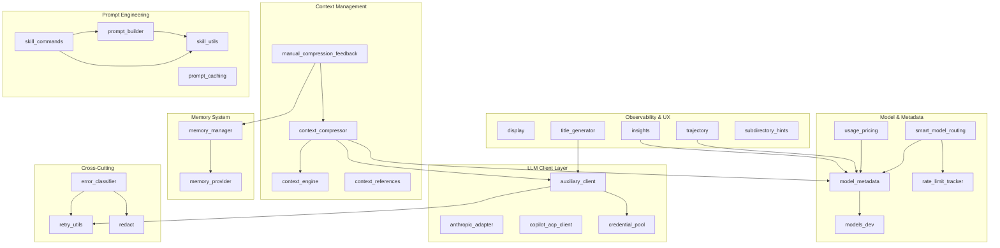
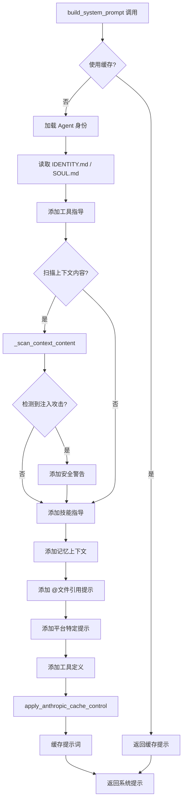
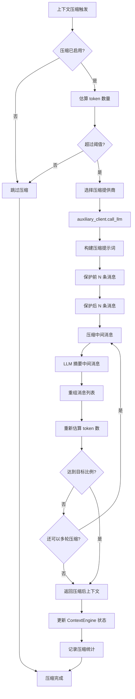
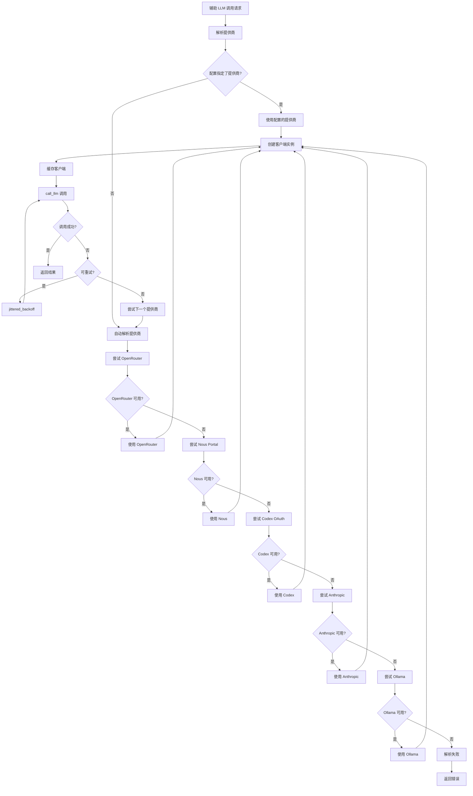
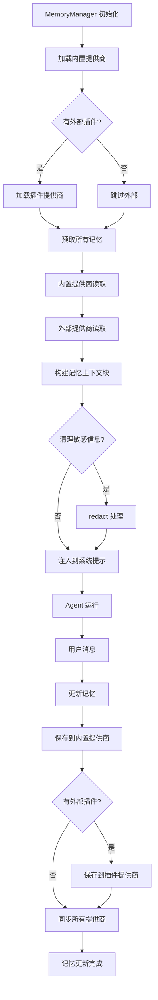
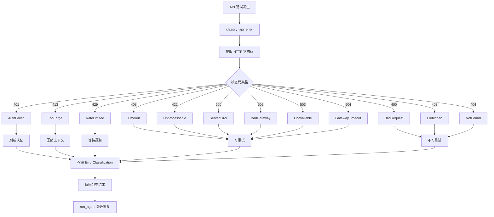

# Hermes Agent — agent 子模块架构与业务流程分析

## 目录概述

**目录路径**: `agent/`  
**定位**: Hermes Agent 的内部核心模块集合，从原始 `run_agent.py` 中抽离出的专注单一职责的子模块  
**设计目标**: 将 10,500+ 行的单体 Agent 拆分为独立子模块，提高可维护性、可测试性和可扩展性  
**文件数量**: 28 个 Python 文件  

---

## 模块分类总览

```
┌────────────────────────────────────────────────────────────────────┐
│                       Hermes Agent Core                           │
│                       (run_agent.py)                               │
└────────┬────────────────────┬──────────────────┬──────────────────┘
         │                    │                  │
    LLM Client          Context Engine      Prompt System
    客户端层              上下文引擎层         提示系统层
         │                    │                  │
    ┌────┴────┐          ┌────┴────┐         ┌────┴────┐
    │anthropic│          │context  │         │prompt   │
    │_adapter │          │_engine  │         │_builder │
    │         │          │_compress│         │_caching │
    │auxiliary│          │_references       │skill_*  │
    │_client  │          │_manual_fb        └─────────┘
    │copilot  │          └─────────┘
    │_acp     │
    │credential       Memory System      Model & Metadata
    │_pool            记忆系统层          模型元数据层
    └─────────┘          │                  │
                    ┌────┴────┐         ┌────┴────┐
                    │memory   │         │model    │
                    │_provider│         │_metadata│
                    │_manager │         │_dev     │
                    └─────────┘         │_routing │
                                        │_pricing │
                    Observability       │_rate_lmt│
                    可观测性层          └─────────┘
                    ┌────┬────┐
                    │disp- │traj-│
                    │lay   │ectory│
                    │insights     │
                    │title_gen    │
                    │subdir_hints │
                    └─────────────┘

    Cross-Cutting (横切关注点)
    ┌─────────┬─────────┬─────────┐
    │error_   │retry_   │redact   │
    │classifier│utils   │         │
    └─────────┴─────────┴─────────┘
```

---

## 模块详细清单

### 1. LLM 客户端层 — 模型连接与认证

| 模块 | 主要类/函数 | 职责描述 | 被谁依赖 |
|------|------------|---------|---------|
| **anthropic_adapter.py** | `build_anthropic_client()`, `normalize_anthropic_response()`, `convert_messages_to_anthropic()`, `resolve_anthropic_token()`, `_is_oauth_token()` | Anthropic Messages API 完整适配器，实现 OpenAI ↔ Anthropic 格式双向转换，支持 OAuth 认证 | run_agent.py |
| **auxiliary_client.py** | `AuxiliaryClient`, `call_llm()`, `get_text_auxiliary_client()`, `get_vision_auxiliary_client()`, `resolve_provider_client()` | 辅助 LLM 路由器，为压缩/视觉/标题等侧任务自动选择最优提供商（7 层降级链） | context_compressor, title_generator, toolsets |
| **copilot_acp_client.py** | `CopilotACPClient`, `_create_chat_completion()`, `_run_prompt()` | GitHub Copilot ACP 兼容层，JSON-RPC 通信，短生命周期会话管理 | run_agent.py (via provider router) |
| **credential_pool.py** | `CredentialPool`, `PooledCredential`, `load_pool()`, `select()`, `refresh_credentials()`, `ensure_credential_pool()` | 凭证池管理，API 密钥轮换、验证、选择、429 自动切换 | auxiliary_client, smart_model_routing |

### 2. 上下文管理层 — 对话窗口优化

| 模块 | 主要类/函数 | 职责描述 | 被谁依赖 |
|------|------------|---------|---------|
| **context_engine.py** | `ContextEngine` (抽象基类) | 可插拔上下文引擎接口，定义 `update_from_response()`, `should_compress()`, `compress()`, `get_tool_schemas()` 等 | context_compressor, plugins |
| **context_compressor.py** | `ContextCompressor(ContextEngine)`, `on_session_reset()`, `update_model()` | 默认上下文引擎，LLM 摘要压缩，保护首尾消息，迭代式更新 | run_agent.py, manual_compression_feedback |
| **context_references.py** | `parse_context_references()`, `preprocess_context_references_async()`, `expand_file_reference()`, `expand_folder_reference()` | 解析用户消息中的 @file/@folder/@url/@git 等引用，安全路径处理 | prompt_builder, CLI |
| **manual_compression_feedback.py** | 反馈处理函数 | 用户对压缩结果的手动反馈和调整策略 | CLI compression commands |

### 3. 记忆系统 — 跨会话持久化

| 模块 | 主要类/函数 | 职责描述 | 被谁依赖 |
|------|------------|---------|---------|
| **memory_provider.py** | `MemoryProvider` (抽象基类), `BuiltinMemoryProvider` | 记忆提供者接口及内置 JSON 实现，定义 `save()`, `load()`, `search()`, `sync()` | memory_manager |
| **memory_manager.py** | `MemoryManager`, `build_memory_context_block()`, `sanitize_context()`, `add_provider()`, `prefetch_all()`, `sync_all()` | 记忆编排器，内置 + 最多一个外部插件，上下文围栏注入 | run_agent.py, prompt_builder |

### 4. 提示工程 — 系统提示与安全

| 模块 | 主要类/函数 | 职责描述 | 被谁依赖 |
|------|------------|---------|---------|
| **prompt_builder.py** | `build_system_prompt()`, `_scan_context_content()`, `_find_hermes_md()`, `build_skills_system_prompt()`, `build_context_files_prompt()` | 系统提示组装，包含身份、工具指导、安全扫描（注入/隐藏字符检测） | run_agent.py |
| **prompt_caching.py** | `apply_anthropic_cache_control()` | Anthropic 提示缓存控制，注入 `cache_control` 断点（system + 最后 3 条消息） | run_agent.py |
| **skill_commands.py** | 技能命令处理函数 | `/skills` 等技能相关斜杠命令的共享 CLI/gateway 逻辑 | hermes_cli/commands.py |
| **skill_utils.py** | `extract_skill_conditions()`, `get_all_skills_dirs()`, `parse_frontmatter()`, `skill_matches_platform()`, `get_disabled_skill_names()` | 技能扫描、解析、匹配、索引工具函数 | prompt_builder, skill_commands |

### 5. 模型元数据 — 上下文与成本

| 模块 | 主要类/函数 | 职责描述 | 被谁依赖 |
|------|------------|---------|---------|
| **model_metadata.py** | `get_model_context_length()`, `estimate_tokens_rough()`, `estimate_messages_tokens_rough()`, `parse_context_limit_from_error()`, `save_context_length()`, `is_local_endpoint()`, `query_ollama_num_ctx()`, `get_next_probe_tier()` | 模型上下文窗口、token 估算、错误解析、Ollama 探测 | context_compressor, usage_pricing, smart_model_routing, run_agent.py |
| **models_dev.py** | models.dev 注册表集成 | 提供商感知的上下文，开发模型注册表 | model_metadata |
| **smart_model_routing.py** | 智能路由函数 | 根据任务类型、负载、延迟选择最优模型 | run_agent.py (future) |
| **usage_pricing.py** | `estimate_usage_cost()`, `normalize_usage()` | 使用量跟踪、定价计算、成本估算 | run_agent.py, insights |
| **rate_limit_tracker.py** | `RateLimitState`, 速率限制解析 | API 速率限制跟踪，解析 `x-ratelimit-*` 响应头 | smart_model_routing |

### 6. 可观测性与体验 — 用户界面

| 模块 | 主要类/函数 | 职责描述 | 被谁依赖 |
|------|------------|---------|---------|
| **display.py** | `KawaiiSpinner`, `get_tool_emoji()`, `build_tool_preview()`, `get_cute_tool_message()`, `_detect_tool_failure()` | UI 显示工具 — kawaii 旋转器、工具预览、emoji、失败检测 | run_agent.py, hermes_cli |
| **trajectory.py** | `save_trajectory()`, `has_incomplete_scratchpad()`, `convert_scratchpad_to_think()` | 对话轨迹保存（JSONL）、`<REASONING_SCRATCHPAD>` 检测 | run_agent.py |
| **insights.py** | `track_task_completion()`, `compute_token_efficiency()` | 任务完成跟踪、token 效率计算、性能分析 | `/insights` command |
| **title_generator.py** | 标题生成函数 | 基于对话内容自动生成会话标题（辅助 LLM） | gateway session |
| **subdirectory_hints.py** | `SubdirectoryHintTracker` | 子目录提示跟踪，辅助文件定位，避免模型在错误目录操作 | run_agent.py |

### 7. 横切关注点 — 错误与重试

| 模块 | 主要类/函数 | 职责描述 | 被谁依赖 |
|------|------------|---------|---------|
| **error_classifier.py** | `classify_api_error()`, `FailoverReason` (Enum), `ErrorClassification` | API 错误分类引擎，结构化恢复决策（限流/上下文/认证/网络） | run_agent.py |
| **retry_utils.py** | `jittered_backoff()` | 抖动退避重试工具（指数退避 + 随机抖动，可配置上下限） | run_agent.py |
| **redact.py** | 脱敏函数 | 敏感信息识别与删除（API 密钥、凭证、路径） | error_classifier |

---

## 模块依赖关系图



---

## 核心业务流程图

### 1. 系统提示构建流程 (`prompt_builder.py`)



### 2. 上下文压缩流程 (`context_compressor.py`)



### 3. 辅助 LLM 路由流程 (`auxiliary_client.py`)



### 4. 记忆管理流程 (`memory_manager.py`)



### 5. API 错误分类与恢复流程 (`error_classifier.py`)



### 6. 上下文引用解析流程 (`context_references.py`)

```mermaid
graph TD
    Start[用户消息输入] --> ParseRefs[parse_context_references]
    
    ParseRefs --> FindAt[查找 @ 符号]
    FindAt --> ClassifyRef{引用类型}
    
    ClassifyRef -->|@file| ExpandFile[expand_file_reference]
    ClassifyRef -->|@folder| ExpandFolder[expand_folder_reference]
    ClassifyRef -->|@url| FetchURL[获取 URL 内容]
    ClassifyRef -->|@git| ExpandGit[展开 git diff]
    ClassifyRef -->|@diff| ExpandDiff[展开差异]
    ClassifyRef -->|@commit| ExpandCommit[展开提交]
    
    ExpandFile --> CheckPath{路径安全?}
    CheckPath -->|是| ReadFile[读取文件内容]
    CheckPath -->|否| SkipFile[跳过不安全路径]
    
    ExpandFolder --> ListFiles[列出目录文件]
    ListFiles --> CheckCount{文件数量}
    CheckCount -->|<=100| ReadAllFiles[读取所有文件]
    CheckCount -->|>100| TruncateFiles[截断文件列表]
    
    ReadFile --> BuildContent[构建内容块]
    ReadAllFiles --> BuildContent
    TruncateFiles --> BuildContent
    FetchURL --> BuildContent
    ExpandGit --> BuildContent
    ExpandDiff --> BuildContent
    ExpandCommit --> BuildContent
    SkipFile --> BuildContent
    
    BuildContent --> ReplaceRef[替换引用为内容]
    ReplaceRef --> MoreRefs{还有引用?}
    MoreRefs -->|是| FindAt
    MoreRefs -->|否| ReturnMsg[返回处理后消息]
```

---

## 模块间协作关系

### 核心调用链

```
run_agent.py
    │
    ├── prompt_builder.build_system_prompt()
    │       ├── skill_utils.get_all_skills_dirs()
    │       ├── skill_utils.parse_frontmatter()
    │       └── memory_manager.build_memory_context_block()
    │
    ├── context_compressor.compress()
    │       ├── auxiliary_client.call_llm()
    │       │       └── credential_pool.select()
    │       ├── model_metadata.estimate_tokens_rough()
    │       └── retry_utils.jittered_backoff()
    │
    ├── model_metadata.get_model_context_length()
    │       └── models_dev (注册表查询)
    │
    ├── anthropic_adapter.build_anthropic_client()
    │
    ├── error_classifier.classify_api_error()
    │       └── redact (脱敏)
    │
    └── display.KawaiiSpinner (UI 显示)
```

### 数据流

```
用户输入
    ↓
context_references.parse_context_references()
    ↓  (展开 @引用)
prompt_builder.build_system_prompt()
    ↓  (组装系统提示)
run_agent.run_conversation()
    ↓  (API 调用)
anthropic_adapter / auxiliary_client
    ↓  (响应处理)
context_compressor.update_from_response()
    ↓  (更新上下文)
memory_manager.update()
    ↓  (持久化)
memory_provider.save()
```

---

## 关键设计模式

### 1. 适配器模式
- **anthropic_adapter.py** — 将 OpenAI 格式转换为 Anthropic 格式
- **copilot_acp_client.py** — 将标准接口适配到 Copilot ACP

### 2. 策略模式
- **context_engine.py** — 抽象基类，可插拔实现（内置压缩 / 插件引擎）
- **memory_provider.py** — 抽象基类，可插拔实现（内置 / 外部插件）
- **auxiliary_client.py** — 多提供商自动选择策略

### 3. 工厂模式
- **credential_pool.py** — 凭证工厂，根据提供商类型创建凭证对象
- **model_metadata.py** — 模型上下文长度工厂，缓存 + 探测

### 4. 观察者模式
- **display.py** — UI 事件观察与显示
- **trajectory.py** — 对话轨迹观察与记录

### 5. 责任链模式
- **auxiliary_client.py** — 7 层提供商降级链
- **error_classifier.py** — 错误分类链，逐级尝试恢复

---

## 性能优化策略

| 优化点 | 模块 | 策略 |
|--------|------|------|
| 提示缓存 | prompt_caching.py | Anthropic cache_control，降低 75% 成本 |
| 客户端缓存 | auxiliary_client.py | 客户端实例缓存，避免重复创建 |
| 元数据缓存 | model_metadata.py | 模型上下文长度缓存 1 小时 |
| 凭证池 | credential_pool.py | 凭证缓存，429 自动切换 |
| 速率跟踪 | rate_limit_tracker.py | x-ratelimit-* 头解析，预防限流 |
| 压缩优化 | context_compressor.py | 保护首尾消息，减少无效压缩 |

---

## 总结

`agent/` 目录是 Hermes Agent 的核心模块集合，包含 **28 个文件**，分为 **7 个逻辑层**：

| 层级 | 模块数 | 核心职责 |
|------|--------|---------|
| LLM 客户端层 | 4 | 模型连接、认证、格式转换 |
| 上下文管理层 | 4 | 对话窗口优化、引用解析、压缩 |
| 记忆系统 | 2 | 跨会话持久化、外部插件集成 |
| 提示工程 | 4 | 系统提示组装、技能管理、缓存 |
| 模型元数据 | 5 | 上下文窗口、成本估算、路由 |
| 可观测性 | 5 | UI 显示、轨迹记录、性能分析 |
| 横切关注点 | 3 | 错误分类、重试、脱敏 |

**设计特点**:
- 高度模块化，每个文件专注单一职责
- 支持可插拔架构（上下文引擎、记忆提供商）
- 多层降级链确保高可用性
- 完善的错误处理与恢复机制
- 性能优化贯穿各层（缓存、压缩、速率控制）