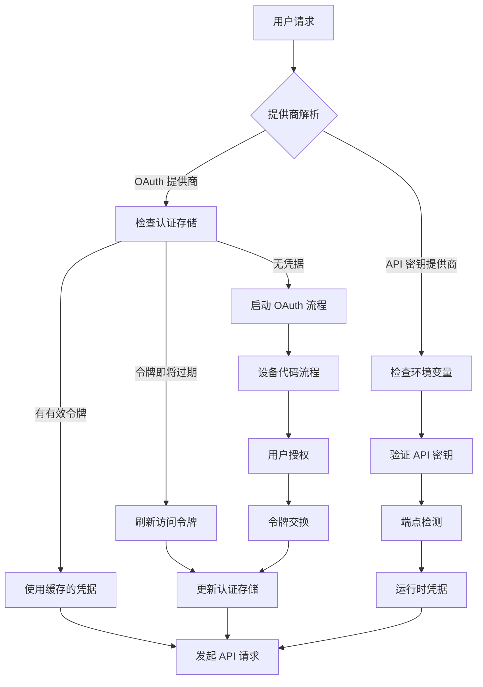
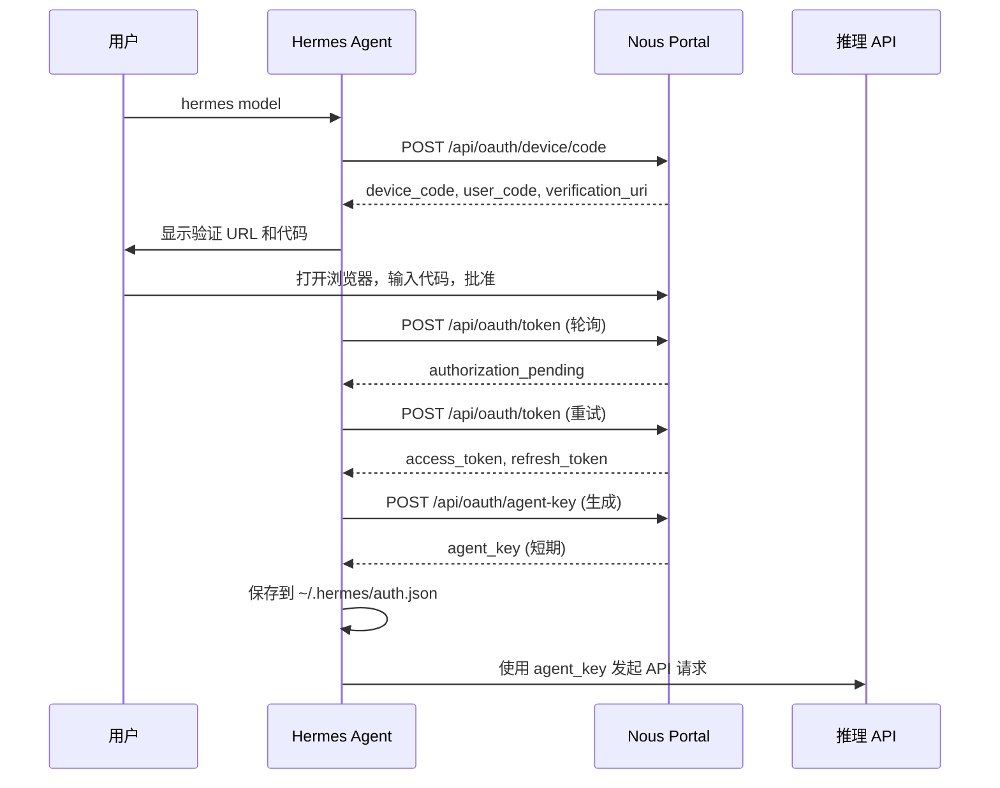
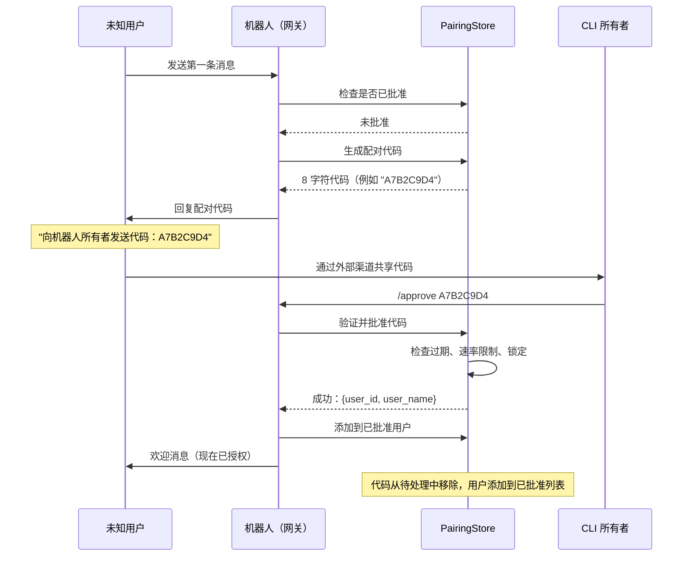
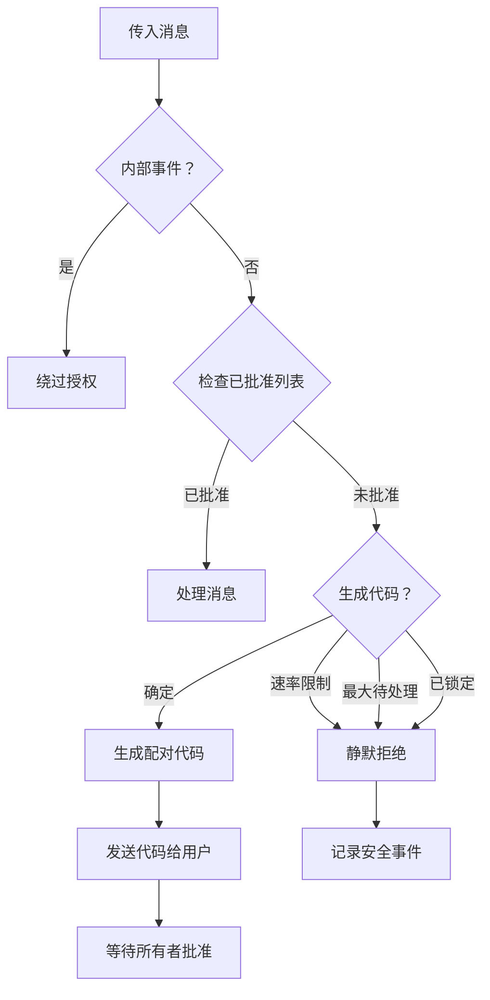
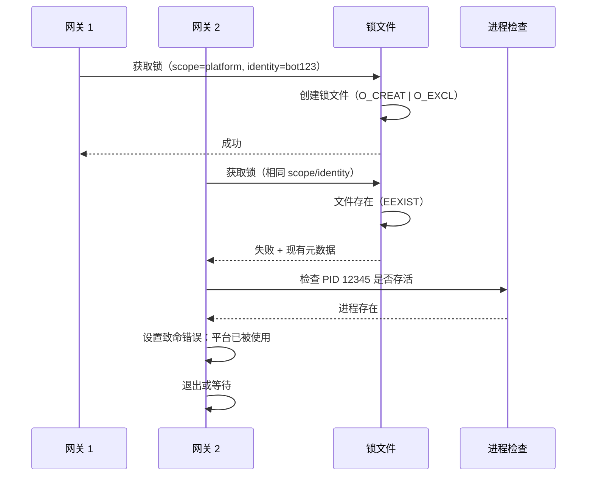
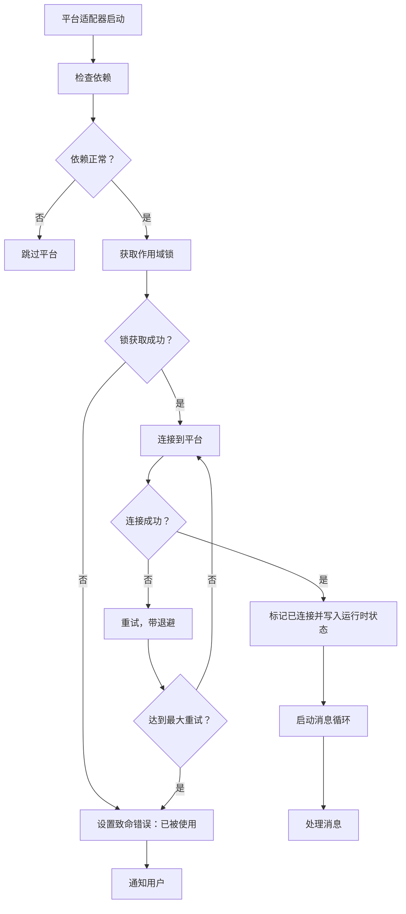

# Hermes Agent 授权和 DM 配对安全架构

## 概述

Hermes Agent 实现了全面的多层安全架构，包括：
1. **用户授权** - 跨多个推理提供商的 OAuth2 和 API 密钥认证
2. **DM 配对** - 基于代码的审批流程，用于消息平台用户授权
3. **平台适配器安全** - 作用域锁和凭据隔离，用于多实例部署

---

## 目录

- [1. 认证架构](#1-认证架构)
- [2. DM 配对系统](#2-dm-配对系统)
- [3. 平台适配器安全](#3-平台适配器安全)
- [4. 会话管理](#4-会话管理)
- [5. 安全设计原则](#5-安全设计原则)

---

## 1. 认证架构

### 1.1 多提供商认证系统

Hermes 支持多种认证方式的推理提供商：

```
┌─────────────────────────────────────────────────────────────────┐
│                    Hermes Agent                                  │
│                                                                  │
│  ┌──────────────────────────────────────────────────────────┐  │
│  │              提供商注册表                                 │  │
│  │  - nous (OAuth 设备代码)                                  │  │
│  │  - openai-codex (OAuth 外部)                              │  │
│  │  - qwen-oauth (OAuth 外部)                                │  │
│  │  - copilot (API 密钥)                                     │  │
│  │  - gemini, zai, kimi-coding (API 密钥)                    │  │
│  │  - anthropic, deepseek, xai (API 密钥)                    │  │
│  └──────────────────────────────────────────────────────────┘  │
│                                                                  │
│  ┌──────────────────────────────────────────────────────────┐  │
│  │              认证存储 (~/.hermes/auth.json)               │  │
│  │  - 跨进程文件锁定 (fcntl/msvcrt)                         │  │
│  │  - 每个提供商的凭据状态                                   │  │
│  │  - 令牌刷新和过期跟踪                                     │  │
│  └──────────────────────────────────────────────────────────┘  │
└─────────────────────────────────────────────────────────────────┘
```

### 1.2 认证流程架构



### 1.3 OAuth 设备代码流程（Nous Portal）



### 1.4 凭据存储安全

**文件：`~/.hermes/auth.json`**

```json
{
  "version": 1,
  "active_provider": "nous",
  "providers": {
    "nous": {
      "access_token": "...",
      "refresh_token": "...",
      "agent_key": "...",
      "agent_key_expires_at": "2026-04-22T12:00:00Z",
      "portal_base_url": "https://portal.nousresearch.com",
      "inference_base_url": "https://inference-api.nousresearch.com/v1",
      "tls": {
        "insecure": false,
        "ca_bundle": null
      }
    }
  },
  "updated_at": "2026-04-22T10:30:00Z"
}
```

**安全特性：**
- 文件权限：`chmod 0600`（仅所有者读写）
- 通过临时文件 + `os.replace()` 实现原子写入
- 跨进程锁定防止竞态条件
- 令牌指纹用于遥测（不记录原始令牌）

### 1.5 令牌刷新策略

```python
# 刷新倾斜：过期前 2 分钟刷新
ACCESS_TOKEN_REFRESH_SKEW_SECONDS = 120

# 最小代理密钥 TTL
DEFAULT_AGENT_KEY_MIN_TTL_SECONDS = 30 * 60  # 30 分钟
```

**刷新逻辑：**
1. 检查令牌是否在倾斜窗口内过期
2. 如果是，使用刷新令牌获取新的访问令牌
3. 生成/重用具有最小 TTL 的代理密钥
4. 在文件锁下持久化状态
5. 处理刷新令牌轮换（一次性使用）

---

## 2. DM 配对系统

### 2.1 架构概述

DM 配对系统用**基于代码的审批流程**替代静态白名单，用于授权消息平台上的新用户。

```
┌─────────────────────────────────────────────────────────────────┐
│                    配对系统                                      │
│                                                                  │
│  存储：~/.hermes/pairing/                                       │
│  ┌───────────────────────────────────────────────────────────┐ │
│  │ {platform}-pending.json   : 待处理的配对请求               │ │
│  │ {platform}-approved.json  : 已批准（已配对）的用户         │ │
│  │ _rate_limits.json         : 速率限制跟踪                   │ │
│  └───────────────────────────────────────────────────────────┘ │
│                                                                  │
│  安全特性 (OWASP + NIST SP 800-63-4):                           │
│  - 8 字符代码，来自 32 字符无歧义字母表                          │
│  - 使用 secrets.choice 的密码学随机性                           │
│  - 1 小时代码过期                                                 │
│  - 每个平台最多 3 个待处理代码                                     │
│  - 速率限制：每个用户每 10 分钟 1 次请求                             │
│  - 5 次失败尝试后锁定（1 小时）                                    │
│  - 文件权限：chmod 0600                                          │
└─────────────────────────────────────────────────────────────────┘
```

### 2.2 配对流程



### 2.3 安全机制

#### 代码生成
```python
# 无歧义字母表（无 0/O, 1/I）
ALPHABET = "ABCDEFGHJKLMNPQRSTUVWXYZ23456789"
CODE_LENGTH = 8

# 生成密码学随机代码
code = "".join(secrets.choice(ALPHABET) for _ in range(CODE_LENGTH))
# 示例："A7B2C9D4"
```

#### 速率限制
```python
RATE_LIMIT_SECONDS = 600  # 每个用户每 10 分钟 1 次请求
MAX_PENDING_PER_PLATFORM = 3  # 每个平台最多 3 个待处理代码
```

#### 锁定保护
```python
LOCKOUT_SECONDS = 3600  # 1 小时锁定
MAX_FAILED_ATTEMPTS = 5  # 锁定前最多 5 次失败尝试
```

#### 文件安全
```python
def _secure_write(path: Path, data: str) -> None:
    """使用限制性权限原子写入（仅所有者读写）。"""
    fd, tmp_path = tempfile.mkstemp(dir=str(path.parent), suffix=".tmp")
    try:
        with os.fdopen(fd, "w", encoding="utf-8") as f:
            f.write(data)
            f.flush()
            os.fsync(f.fileno())
        os.replace(tmp_path, str(path))  # 原子重命名
        os.chmod(path, 0o600)  # 仅所有者读写
    except BaseException:
        try:
            os.unlink(tmp_path)
        except OSError:
            pass
        raise
```

### 2.4 数据结构

**待处理请求（`{platform}-pending.json`）：**
```json
{
  "A7B2C9D4": {
    "user_id": "123456789",
    "user_name": "john_doe",
    "created_at": 1713787200.0
  }
}
```

**已批准用户（`{platform}-approved.json`）：**
```json
{
  "123456789": {
    "user_name": "john_doe",
    "approved_at": 1713787500.0
  }
}
```

**速率限制（`_rate_limits.json`）：**
```json
{
  "telegram:123456789": 1713787200.0,
  "_failures:telegram": 2,
  "_lockout:telegram": 1713790800.0
}
```

### 2.5 授权检查流程



---

## 3. 平台适配器安全

### 3.1 作用域锁系统

防止多个网关节点使用相同的外部身份（例如相同的 Telegram 机器人令牌）。

```
┌─────────────────────────────────────────────────────────────────┐
│              作用域锁架构                                         │
│                                                                  │
│  锁目录：{XDG_STATE_HOME}/hermes/gateway-locks/                 │
│                                                                  │
│  锁文件：{scope}-{identity_hash}.lock                           │
│  示例：platform-telegram-bot123.lock                            │
│                                                                  │
│  锁元数据：                                                       │
│  {                                                              │
│    "pid": 12345,                                                │
│    "kind": "hermes-gateway",                                    │
│    "scope": "platform",                                         │
│    "identity_hash": "abc123...",                                │
│    "metadata": {"platform": "telegram"},                        │
│    "start_time": 1234567890,                                    │
│    "updated_at": "2026-04-22T10:00:00Z"                         │
│  }                                                              │
└─────────────────────────────────────────────────────────────────┘
```

### 3.2 锁获取流程



### 3.3 锁文件验证

```python
def acquire_scoped_lock(scope: str, identity: str, metadata=None):
    """获取以 scope + identity 为键的机器本地锁。"""
    lock_path = _get_scope_lock_path(scope, identity)
    
    # 检查锁文件是否存在
    existing = _read_json_file(lock_path)
    if existing:
        existing_pid = int(existing["pid"])
        
        # 检查是否已拥有此锁（可重入）
        if existing_pid == os.getpid():
            _write_json_file(lock_path, record)
            return True, existing
        
        # 检查现有进程是否过时
        stale = False
        try:
            os.kill(existing_pid, 0)  # 检查是否存活
        except (ProcessLookupError, PermissionError):
            stale = True  # 进程已死亡
        
        # 检查进程是否已重启（不同的启动时间）
        if not stale:
            current_start = _get_process_start_time(existing_pid)
            if current_start != existing.get("start_time"):
                stale = True
        
        # 检查进程是否已停止（Ctrl+Z）
        if not stale:
            state = _read_process_state(existing_pid)
            if state in ("T", "t"):  # 停止/跟踪
                stale = True
        
        if stale:
            lock_path.unlink()  # 删除过时锁
        else:
            return False, existing  # 锁被活动进程持有
    
    # 尝试原子创建锁文件
    try:
        fd = os.open(lock_path, os.O_CREAT | os.O_EXCL | os.O_WRONLY)
    except FileExistsError:
        return False, _read_json_file(lock_path)
    
    # 写入锁元数据
    with os.fdopen(fd, "w") as handle:
        json.dump(record, handle)
    
    return True, None
```

### 3.4 平台适配器连接流程



---

## 4. 会话管理

### 4.1 会话架构

```
┌─────────────────────────────────────────────────────────────────┐
│                  会话管理                                         │
│                                                                  │
│  会话存储：~/.hermes/sessions/                                   │
│  ┌───────────────────────────────────────────────────────────┐ │
│  │ sessions.json            : 会话键 -> ID 映射                │ │
│  │ {session_id}.jsonl       : 传统转录文件                     │ │
│  │ hermes_state.db (SQLite) : 会话元数据 + 消息                │ │
│  └───────────────────────────────────────────────────────────┘ │
│                                                                  │
│  会话键格式：                                                    │
│  agent:main:{platform}:{chat_type}:{chat_id}:{thread_id}       │
│                                                                  │
│  示例：                                                          │
│  - agent:main:telegram:dm:123456789                            │
│  - agent:main:discord:channel:987654321:thread-abc             │
└─────────────────────────────────────────────────────────────────┘
```

### 4.2 会话键生成

```python
def build_session_key(source: SessionSource, ...) -> str:
    """从消息源构建确定性会话键。"""
    platform = source.platform.value
    
    if source.chat_type == "dm":
        if source.chat_id:
            if source.thread_id:
                return f"agent:main:{platform}:dm:{source.chat_id}:{source.thread_id}"
            return f"agent:main:{platform}:dm:{source.chat_id}"
        return f"agent:main:{platform}:dm"
    
    # 群组/频道会话
    participant_id = source.user_id_alt or source.user_id
    key_parts = ["agent:main", platform, source.chat_type]
    
    if source.chat_id:
        key_parts.append(source.chat_id)
    if source.thread_id:
        key_parts.append(source.thread_id)
    
    # 群组中的每用户隔离（可选）
    if group_sessions_per_user and participant_id:
        key_parts.append(str(participant_id))
    
    return ":".join(key_parts)
```

### 4.3 会话重置策略

```yaml
# config.yaml
gateway:
  session_reset:
    # 每个平台/会话类型的策略
    telegram:
      dm:
        mode: "both"          # "none", "idle", "daily", "both"
        idle_minutes: 1440    # 24 小时
        at_hour: 3            # 凌晨 3 点
      group:
        mode: "idle"
        idle_minutes: 60      # 1 小时
```

**重置逻辑：**
```python
def _is_session_expired(entry: SessionEntry) -> bool:
    policy = config.get_reset_policy(platform=entry.platform, session_type=entry.chat_type)
    
    if policy.mode == "none":
        return False
    
    now = _now()
    
    # 空闲超时检查
    if policy.mode in ("idle", "both"):
        idle_deadline = entry.updated_at + timedelta(minutes=policy.idle_minutes)
        if now > idle_deadline:
            return True
    
    # 每日重置检查
    if policy.mode in ("daily", "both"):
        today_reset = now.replace(hour=policy.at_hour, minute=0, second=0, microsecond=0)
        if now.hour < policy.at_hour:
            today_reset -= timedelta(days=1)
        if entry.updated_at < today_reset:
            return True
    
    return False
```

### 4.4 会话安全特性

**PII 脱敏：**
```python
def build_session_context_prompt(context: SessionContext, redact_pii: bool = False):
    """为没有提及系统的平台脱敏 PII。"""
    _PII_SAFE_PLATFORMS = frozenset({
        Platform.WHATSAPP,
        Platform.SIGNAL,
        Platform.TELEGRAM,
        Platform.BLUEBUBBLES,
    })
    
    if redact_pii and context.source.platform in _PII_SAFE_PLATFORMS:
        # 哈希用户/聊天 ID
        user_id = _hash_sender_id(source.user_id)  # "user_abc123def456"
        chat_id = _hash_chat_id(source.chat_id)    # "xyz789abc123"
```

**转录存储：**
- 带 FTS5 搜索的 SQLite 数据库
- 传统 JSONL 回退
- 原子写入带临时文件
- 敏感数据的消息脱敏

---

## 5. 安全设计原则

### 5.1 纵深防御

```
┌──────────────────────────────────────────────────────────────┐
│                   安全层                                       │
│                                                               │
│  第 1 层：认证                                                  │
│  - 带 PKCE 的 OAuth2 设备代码流程                               │
│  - API 密钥验证和端点检测                                       │
│  - 带自动过期处理的令牌刷新                                    │
│                                                               │
│  第 2 层：授权                                                  │
│  - 使用 8 字符密码学代码的 DM 配对                               │
│  - 认证尝试的速率限制和锁定保护                                │
│  - 每个平台的批准列表                                          │
│                                                               │
│  第 3 层：隔离                                                  │
│  - 作用域锁防止凭据冲突                                        │
│  - 配置文件感知的 HERMES_HOME 目录                             │
│  - 进程身份验证                                                │
│                                                               │
│  第 4 层：数据保护                                              │
│  - 敏感数据的文件权限 (0600)                                   │
│  - 原子写入防止部分状态                                        │
│  - 会话上下文中的 PII 脱敏                                      │
│  - 标识符的确定性哈希                                          │
│                                                               │
│  第 5 层：监控                                                  │
│  - 用于诊断的运行时状态文件                                    │
│  - OAuth 跟踪日志（可选加入）                                   │
│  - 安全事件日志（失败批准、锁定）                              │
└──────────────────────────────────────────────────────────────┘
```

### 5.2 安全标准合规

**OWASP 指南：**
- 密码学随机性（`secrets.choice`）
- 认证尝试的速率限制
- 重复失败后的锁定
- 安全会话管理

**NIST SP 800-63-4：**
- 代码的无歧义字母表（无 0/O, 1/I）
- 8 字符代码（约 42 位熵）
- 基于时间的代码过期（1 小时）
- 通过外部渠道安全传输代码

### 5.3 威胁模型

| 威胁 | 缓解措施 |
|------|---------|
| **未授权访问** | 所有新用户都需要 DM 配对代码 |
| **暴力攻击** | 速率限制（10 分钟）、锁定（5 次尝试，1 小时） |
| **凭据盗窃** | 文件权限 (0600)，无 stdout 日志 |
| **竞态条件** | 跨进程文件锁定 (fcntl/msvcrt) |
| **会话劫持** | 确定性会话键，PII 脱敏 |
| **多实例冲突** | 带 PID 验证的作用域锁 |
| **令牌过期** | 过期前自动刷新（2 分钟倾斜） |
| **SSRF 攻击** | URL 安全验证，重定向防护 |
| **权限升级** | 每个平台的批准列表，无跨平台访问 |

### 5.4 安全最佳实践

**代码生成：**
```python
# 好：密码学安全
code = "".join(secrets.choice(ALPHABET) for _ in range(CODE_LENGTH))

# 坏：可预测
code = "".join(random.choice(ALPHABET) for _ in range(CODE_LENGTH))
```

**文件写入：**
```python
# 好：原子写入带安全权限
fd, tmp_path = tempfile.mkstemp(dir=str(path.parent))
with os.fdopen(fd, "w") as f:
    f.write(data)
    os.fsync(f.fileno())
os.replace(tmp_path, str(path))
os.chmod(path, 0o600)

# 坏：易受竞态条件攻击
with open(path, "w") as f:
    f.write(data)
os.chmod(path, 0o600)
```

**进程验证：**
```python
# 好：多重验证检查
try:
    os.kill(pid, 0)  # 检查存活
    current_start = _get_process_start_time(pid)
    if current_start != recorded_start:
        stale = True  # 进程已重启
    state = _read_process_state(pid)
    if state in ("T", "t"):
        stale = True  # 进程已停止
except ProcessLookupError:
    stale = True  # 进程已死亡
```

---

## 6. 实现文件

### 核心安全文件

| 文件 | 用途 |
|------|------|
| `gateway/pairing.py` | DM 配对系统实现 |
| `gateway/session.py` | 会话管理和存储 |
| `gateway/status.py` | 作用域锁和运行时状态 |
| `gateway/platforms/base.py` | 带安全功能的基础平台适配器 |
| `hermes_cli/auth.py` | 多提供商认证 |
| `tools/registry.py` | 工具授权和分发 |
| `tools/approval.py` | 危险命令批准 |

### 配置文件

| 文件 | 用途 |
|------|------|
| `~/.hermes/auth.json` | OAuth 凭据和提供商状态 |
| `~/.hermes/config.yaml` | 用户配置和策略 |
| `~/.hermes/.env` | API 密钥和环境变量 |
| `~/.hermes/pairing/*.json` | DM 配对批准列表 |
| `~/.hermes/sessions/` | 会话转录和元数据 |
| `{XDG_STATE_HOME}/hermes/gateway-locks/` | 作用域锁文件 |

---

## 7. 总结

Hermes Agent 实现了全面的安全架构，结合了：

1. **强认证**：带安全令牌管理的 OAuth2 流程
2. **显式授权**：带速率限制的基于代码的 DM 配对
3. **进程隔离**：作用域锁防止凭据冲突
4. **数据保护**：文件权限、原子写入、PII 脱敏
5. **监控**：运行时状态跟踪和安全事件日志

该设计遵循 OWASP 指南和 NIST 标准，提供针对常见威胁的纵深防御，同时保持合法用户的可用性。

---

## 参考资料

- [OWASP 认证速查表](https://cheatsheetseries.owasp.org/cheatsheets/Authentication_Cheat_Sheet.html)
- [NIST SP 800-63-4 数字身份指南](https://pages.nist.gov/800-63-4/)
- [OAuth 2.0 设备授权授权 (RFC 8628)](https://datatracker.ietf.org/doc/html/rfc8628)
- [Unix 文件权限最佳实践](https://www.gnu.org/software/coreutils/manual/html_node/Symbolic-Modes.html)
