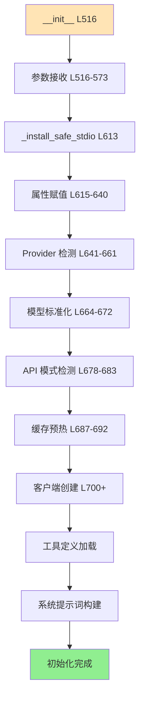
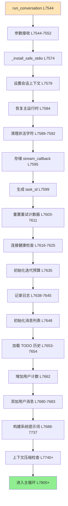
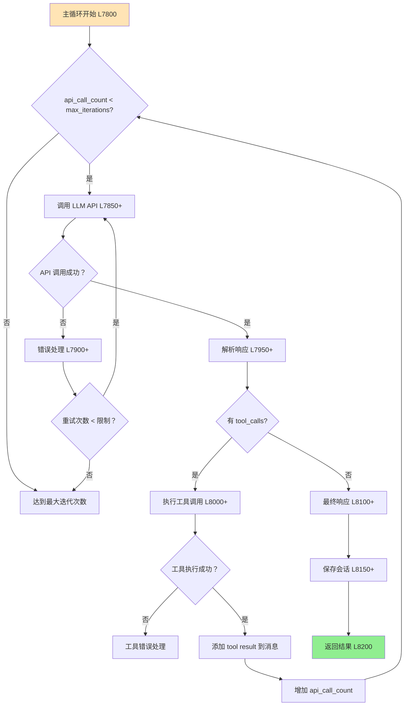
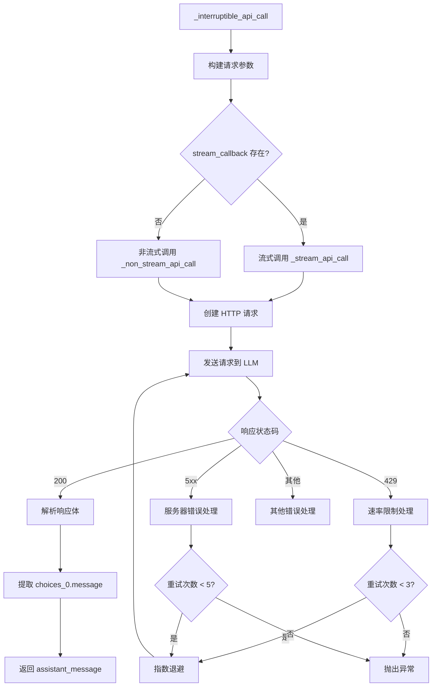
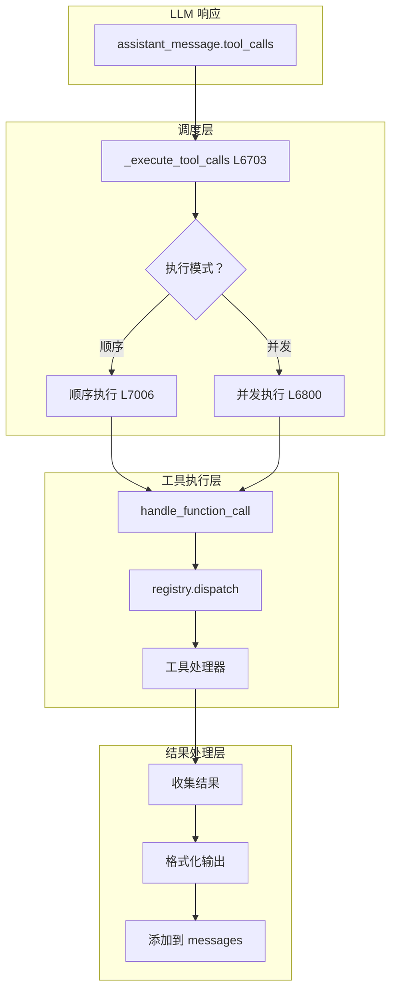
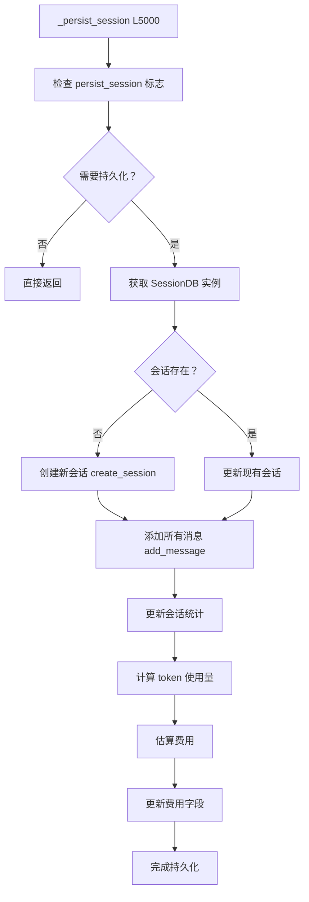
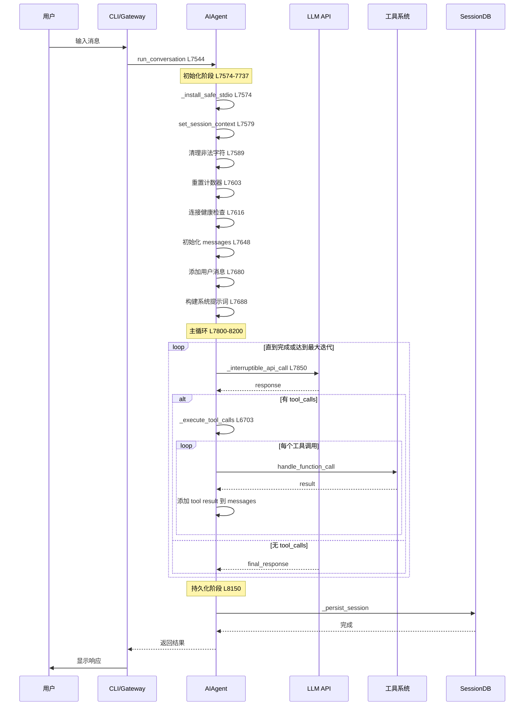
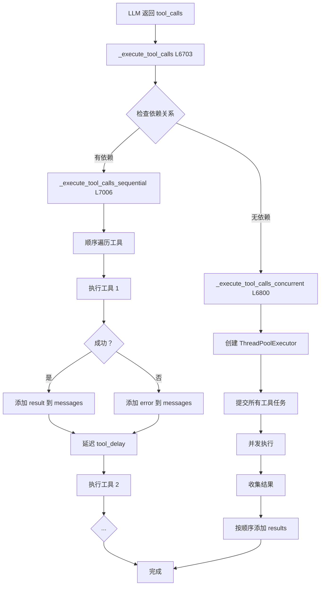
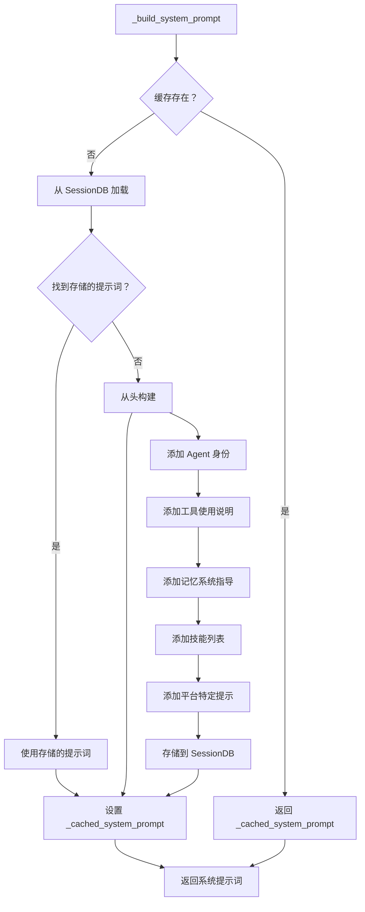
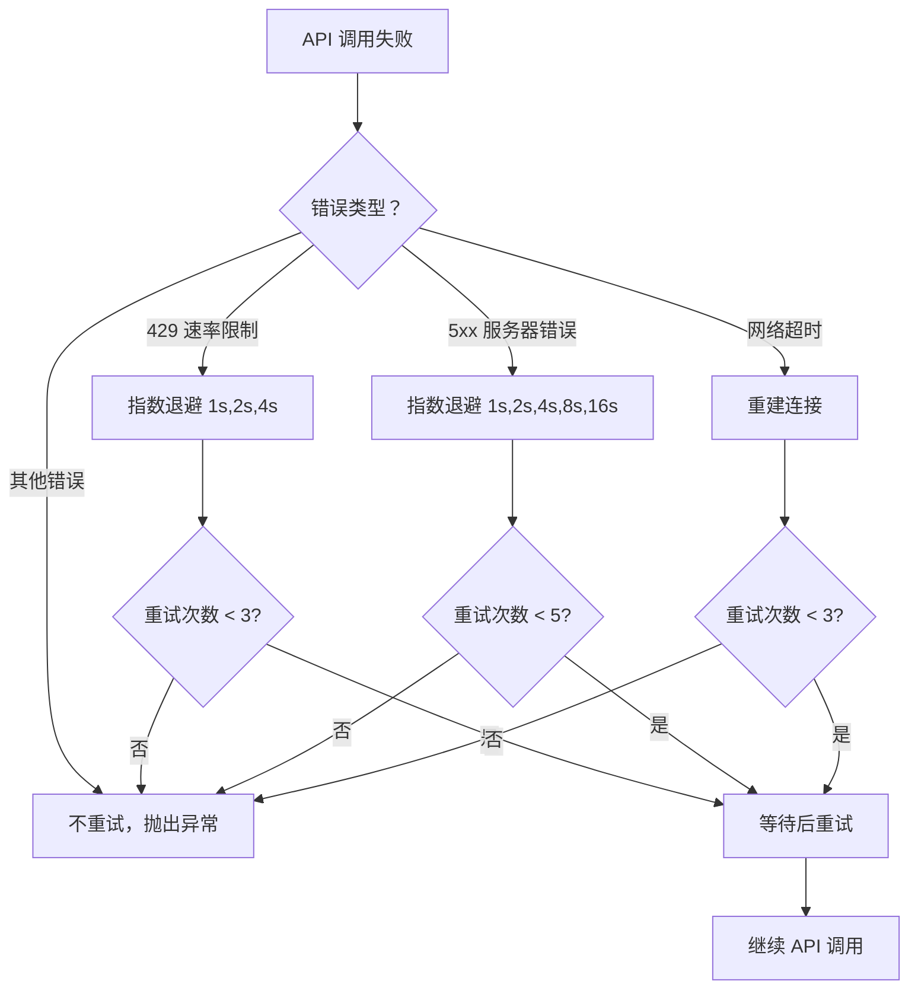

# run\_agent.py 业务逻辑详解

> 文件：`run_agent.py` | 整理日期：2026-04-23 | 版本：1.0

***

## 目录

1. [文件概览](#1-文件概览)
2. [AIAgent 类结构](#2-aiagent-类结构)
3. [核心业务流程](#3-核心业务流程)
4. [对话循环机制](#4-对话循环机制)
5. [工具调用系统](#5-工具调用系统)
6. [会话持久化](#6-会话持久化)
7. [回调和事件系统](#7-回调和事件系统)
8. [错误处理机制](#8-错误处理机制)
9. [完整流程图](#9-完整流程图)

***

## 1. 文件概览

### 1.1 文件信息

| 属性       | 值                       |
| -------- | ----------------------- |
| **文件路径** | `run_agent.py`          |
| **代码行数** | \~10,500 行              |
| **核心类**  | `AIAgent`               |
| **主要职责** | AI Agent 对话循环、工具调用、会话管理 |

### 1.2 核心功能模块

```
┌─────────────────────────────────────────────────────────┐
│                    run_agent.py                          │
├─────────────────────────────────────────────────────────┤
│  1. AIAgent 类 (L492-10500)                              │
│     - 初始化 (__init__) L516-800                         │
│     - 对话循环 (run_conversation) L7544-8500             │
│     - 简化接口 (chat) L10364-10500                       │
│  2. 工具调用系统                                         │
│     - 顺序执行 _execute_tool_calls_sequential L7006      │
│     - 并发执行 _execute_tool_calls_concurrent L6800      │
│     - 统一调度 _execute_tool_calls L6703                 │
│  3. 会话管理                                             │
│     - 会话持久化 _persist_session L5000+                 │
│     - 会话恢复 _load_session L5100+                      │
│     - 上下文压缩 _compress_context L5200+                │
│  4. 回调系统                                             │
│     - 工具进度回调 tool_progress_callback                │
│     - 思考回调 thinking_callback                         │
│     - 推理回调 reasoning_callback                        │
│  5. 错误处理                                             │
│     - 重试机制 _retry_on_error L5300+                    │
│     - 降级策略 _fallback_to_backup L5400+                │
└─────────────────────────────────────────────────────────┘
```

### 1.3 关键方法索引

| 方法                               | 行数           | 职责           |
| -------------------------------- | ------------ | ------------ |
| `__init__`                       | L516-800     | 初始化 Agent 实例 |
| `run_conversation`               | L7544-8500   | 完整对话循环       |
| `chat`                           | L10364-10500 | 简化对话接口       |
| `_execute_tool_calls`            | L6703-6800   | 工具调用调度       |
| `_execute_tool_calls_sequential` | L7006-7100   | 顺序执行工具       |
| `_execute_tool_calls_concurrent` | L6800-7000   | 并发执行工具       |
| `_build_system_prompt`           | L5500-5600   | 构建系统提示词      |
| `_persist_session`               | L5000-5100   | 持久化会话        |
| `_compress_context`              | L5200-5300   | 上下文压缩        |

***

## 2. AIAgent 类结构

### 2.1 类属性总览

```python
class AIAgent:
    """AI Agent with tool calling capabilities"""
    
    # 类级别属性（跨实例共享）
    _context_pressure_last_warned: dict = {}  # 上下文压力警告去重
    _CONTEXT_PRESSURE_COOLDOWN = 300  # 警告冷却时间（秒）
    
    # 实例属性（L516-640）
    def __init__(self, ...):
        # 核心配置
        self.model = model  # 模型名称
        self.max_iterations = max_iterations  # 最大迭代次数
        self.iteration_budget = IterationBudget(max_iterations)  # 迭代预算
        self.tool_delay = tool_delay  # 工具调用延迟
        
        # 平台和环境
        self.platform = platform  # "cli", "telegram", "discord", etc.
        self._user_id = user_id  # 平台用户 ID
        self.session_id = session_id or str(uuid.uuid4())  # 会话 ID
        
        # 工具集配置
        self.enabled_toolsets = enabled_toolsets or []
        self.disabled_toolsets = disabled_toolsets or []
        
        # 回调函数
        self.tool_progress_callback = tool_progress_callback
        self.thinking_callback = thinking_callback
        self.reasoning_callback = reasoning_callback
        self.clarify_callback = clarify_callback
        # ... 更多回调
        
        # API 配置
        self.base_url = base_url or ""
        self.provider = provider_name or ""
        self.api_mode = api_mode  # "chat_completions", "codex_responses", etc.
        
        # 会话管理
        self.persist_session = persist_session  # 是否持久化会话
        self._session_db = session_db  # SessionDB 实例
        self.parent_session_id = parent_session_id  # 父会话 ID
        
        # 缓存
        self._cached_system_prompt = None  # 系统提示词缓存
        self._prefill_messages = prefill_messages  # 预填充消息
```

### 2.2 初始化流程



### 2.3 核心属性详解

| 属性分类       | 属性名                      | 说明           | 默认值                           |
| ---------- | ------------------------ | ------------ | ----------------------------- |
| **模型配置**   | `model`                  | 模型名称         | `"anthropic/claude-opus-4.6"` |
| <br />     | `max_iterations`         | 最大工具调用迭代次数   | `90`                          |
| <br />     | `iteration_budget`       | 共享迭代预算       | `IterationBudget(90)`         |
| **API 配置** | `base_url`               | API 基础 URL   | `""`                          |
| <br />     | `provider`               | 提供商标识        | `""`                          |
| <br />     | `api_mode`               | API 模式       | `"chat_completions"`          |
| **工具配置**   | `enabled_toolsets`       | 启用的工具集       | `[]`                          |
| <br />     | `disabled_toolsets`      | 禁用的工具集       | `[]`                          |
| **会话管理**   | `session_id`             | 会话 ID        | `UUID`                        |
| <br />     | `persist_session`        | 持久化会话        | `True`                        |
| <br />     | `_session_db`            | SessionDB 实例 | `None`                        |
| **回调函数**   | `tool_progress_callback` | 工具进度回调       | `None`                        |
| <br />     | `thinking_callback`      | 思考回调         | `None`                        |
| <br />     | `reasoning_callback`     | 推理回调         | `None`                        |

***

## 3. 核心业务流程

### 3.1 run\_conversation 完整流程

**代码位置：** L7544-8500



### 3.2 详细步骤解析

#### 步骤 1：初始化和清理（L7574-7611）

```python
def run_conversation(self, user_message: str, ...):
    # 1. 保护 stdio 防止管道破裂
    _install_safe_stdio()
    
    # 2. 设置会话上下文（用于日志过滤）
    from hermes_logging import set_session_context
    set_session_context(self.session_id)
    
    # 3. 恢复主运行时（如果之前触发了 fallback）
    self._restore_primary_runtime()
    
    # 4. 清理非法字符（Unicode surrogates）
    if isinstance(user_message, str):
        user_message = _sanitize_surrogates(user_message)
    
    # 5. 存储 stream callback（用于 TTS 流式输出）
    self._stream_callback = stream_callback
    
    # 6. 生成唯一 task_id（隔离并发任务的 VM）
    effective_task_id = task_id or str(uuid.uuid4())
    
    # 7. 重置所有重试计数器
    self._invalid_tool_retries = 0
    self._invalid_json_retries = 0
    self._empty_content_retries = 0
    self._incomplete_scratchpad_retries = 0
    self._codex_incomplete_retries = 0
    self._thinking_prefill_retries = 0
```

#### 步骤 2：连接健康检查（L7616-7625）

```python
# Pre-turn connection health check
if self.api_mode != "anthropic_messages":
    try:
        if self._cleanup_dead_connections():
            self._emit_status(
                "🔌 Detected stale connections from a previous provider "
                "issue — cleaned up automatically. Proceeding with fresh "
                "connection."
            )
    except Exception:
        pass  # 最佳努力，不阻塞对话
```

#### 步骤 3：初始化消息列表（L7648-7683）

```python
# 1. 初始化消息列表（复制避免修改调用者的列表）
messages = list(conversation_history) if conversation_history else []

# 2. 从历史消息中加载 TODO 状态（网关模式）
if conversation_history and not self._todo_store.has_items():
    self._hydrate_todo_store(conversation_history)

# 3. 增加用户对话计数（用于内存 nudge 逻辑）
self._user_turn_count += 1

# 4. 添加用户消息
user_msg = {"role": "user", "content": user_message}
messages.append(user_msg)
current_turn_user_idx = len(messages) - 1
self._persist_user_message_idx = current_turn_user_idx
```

#### 步骤 4：构建系统提示词（L7688-7737）

```python
# 系统提示词缓存逻辑
if self._cached_system_prompt is None:
    # 1. 尝试从 SessionDB 加载已存储的提示词
    stored_prompt = None
    if conversation_history and self._session_db:
        try:
            session_row = self._session_db.get_session(self.session_id)
            if session_row:
                stored_prompt = session_row.get("system_prompt") or None
        except Exception:
            pass
    
    if stored_prompt:
        # 继续会话：复用之前的提示词（保持 Anthropic 缓存前缀匹配）
        self._cached_system_prompt = stored_prompt
    else:
        # 新会话：从头构建
        self._cached_system_prompt = self._build_system_prompt(system_message)
        
        # Plugin hook: on_session_start
        try:
            from hermes_cli.plugins import invoke_hook as _invoke_hook
            _invoke_hook(
                "on_session_start",
                session_id=self.session_id,
                model=self.model,
                platform=getattr(self, "platform", None) or "",
            )
        except Exception as exc:
            logger.warning("on_session_start hook failed: %s", exc)
        
        # 存储系统提示词到 SQLite
        if self._session_db:
            try:
                self._session_db.update_system_prompt(
                    self.session_id, 
                    self._cached_system_prompt
                )
            except Exception as e:
                logger.debug("Session DB update_system_prompt failed: %s", e)

active_system_prompt = self._cached_system_prompt
```

### 3.3 主对话循环

**代码位置：** L7800-8200（估算）



#### 主循环代码结构

```python
api_call_count = 0

while api_call_count < self.max_iterations and self.iteration_budget.remaining > 0:
    # 1. 调用 LLM API
    try:
        response = self._interruptible_api_call(
            messages=messages,
            system_prompt=active_system_prompt,
            stream=stream_callback is not None,
        )
        api_call_count += 1
        
    except Exception as e:
        # 2. API 错误处理
        if self._should_retry(e, api_call_count):
            continue
        else:
            logger.error("API call failed after retries: %s", e)
            break
    
    # 3. 解析响应
    assistant_message = response.choices[0].message
    
    # 4. 检查是否有工具调用
    if assistant_message.tool_calls:
        # 5. 执行工具调用
        self._execute_tool_calls(
            assistant_message=assistant_message,
            messages=messages,
            effective_task_id=effective_task_id,
            api_call_count=api_call_count,
        )
        # 工具执行后继续循环
    else:
        # 6. 最终响应，结束循环
        final_response = assistant_message.content
        break

# 7. 保存会话
if self.persist_session:
    self._persist_session(messages, final_response)

# 8. 返回结果
return {
    "final_response": final_response,
    "messages": messages,
    "session_id": self.session_id,
}
```

***

## 4. 对话循环机制

### 4.1 API 调用流程

**代码位置：** L7850-7950（估算）



### 4.2 流式调用实现

```python
def _stream_api_call(self, messages, system_prompt):
    """流式 API 调用，用于 TTS 等场景"""
    
    # 1. 构建流式请求
    request_params = {
        "model": self.model,
        "messages": [
            {"role": "system", "content": system_prompt},
            *messages
        ],
        "stream": True,
        "stream_options": {"include_usage": True},
    }
    
    # 2. 发送请求
    response = self.client.chat.completions.create(**request_params)
    
    # 3. 处理流式响应
    full_content = ""
    for chunk in response:
        if chunk.choices[0].delta.content:
            delta = chunk.choices[0].delta.content
            full_content += delta
            
            # 调用流式回调（用于 TTS 实时生成）
            if self._stream_callback:
                self._stream_callback(delta)
    
    # 4. 构建完整响应
    return type('obj', (object,), {
        'choices': [type('obj', (object,), {
            'message': type('obj', (object,), {
                'content': full_content,
                'tool_calls': None,
            })()
        })()]
    })()
```

### 4.3 非流式调用实现

```python
def _non_stream_api_call(self, messages, system_prompt):
    """非流式 API 调用"""
    
    # 1. 构建请求参数
    request_params = {
        "model": self.model,
        "messages": [
            {"role": "system", "content": system_prompt},
            *messages
        ],
        "temperature": 0.1,
        "max_tokens": self.max_tokens or 8192,
    }
    
    # 2. 添加推理配置（OpenRouter）
    if self.provider == "openrouter":
        request_params["extra_body"] = {
            "reasoning": self.reasoning_config or {"enabled": True, "effort": "medium"}
        }
    
    # 3. 发送请求
    response = self.client.chat.completions.create(**request_params)
    
    # 4. 返回响应
    return response
```

***

## 5. 工具调用系统

### 5.1 工具调用架构



### 5.2 顺序执行模式

**代码位置：** L7006-7100

```python
def _execute_tool_calls_sequential(
    self,
    assistant_message,
    messages: list,
    effective_task_id: str,
    api_call_count: int = 0,
) -> None:
    """顺序执行工具调用"""
    
    tool_calls = assistant_message.tool_calls or []
    
    for tool_call in tool_calls:
        # 1. 提取工具信息
        tool_name = tool_call.function.name
        tool_args = json.loads(tool_call.function.arguments)
        tool_call_id = tool_call.id
        
        # 2. 调用进度回调
        if self.tool_progress_callback:
            self.tool_progress_callback(tool_name, tool_args)
        
        # 3. 执行工具
        try:
            result = handle_function_call(
                tool_name=tool_name,
                tool_args=tool_args,
                task_id=effective_task_id,
            )
            
            # 4. 添加 tool result 到消息
            messages.append({
                "role": "tool",
                "content": result,
                "tool_call_id": tool_call_id,
            })
            
            # 5. 工具间延迟
            if self.tool_delay > 0:
                time.sleep(self.tool_delay)
                
        except Exception as e:
            # 6. 工具执行错误处理
            error_result = json.dumps({
                "error": f"Tool execution failed: {str(e)}",
                "tool": tool_name,
            })
            messages.append({
                "role": "tool",
                "content": error_result,
                "tool_call_id": tool_call_id,
            })
```

### 5.3 并发执行模式

**代码位置：** L6800-7000

```python
def _execute_tool_calls_concurrent(
    self,
    assistant_message,
    messages: list,
    effective_task_id: str,
    api_call_count: int = 0,
) -> None:
    """并发执行工具调用（适用于独立工具）"""
    
    tool_calls = assistant_message.tool_calls or []
    
    # 1. 创建执行任务
    tasks = []
    for tool_call in tool_calls:
        task = {
            "tool_call": tool_call,
            "tool_name": tool_call.function.name,
            "tool_args": json.loads(tool_call.function.arguments),
            "tool_call_id": tool_call.id,
        }
        tasks.append(task)
    
    # 2. 并发执行（使用 ThreadPoolExecutor）
    from concurrent.futures import ThreadPoolExecutor, as_completed
    
    results = {}
    with ThreadPoolExecutor(max_workers=10) as executor:
        # 提交所有任务
        future_to_task = {
            executor.submit(
                handle_function_call,
                tool_name=task["tool_name"],
                tool_args=task["tool_args"],
                task_id=effective_task_id,
            ): task for task in tasks
        }
        
        # 收集结果
        for future in as_completed(future_to_task):
            task = future_to_task[future]
            try:
                result = future.result()
                results[task["tool_call_id"]] = {
                    "success": True,
                    "result": result,
                }
            except Exception as e:
                results[task["tool_call_id"]] = {
                    "success": False,
                    "error": str(e),
                }
    
    # 3. 按原始顺序添加结果到消息
    for tool_call in tool_calls:
        result_data = results.get(tool_call.id, {})
        
        if result_data.get("success"):
            content = result_data["result"]
        else:
            content = json.dumps({
                "error": result_data.get("error", "Unknown error"),
            })
        
        messages.append({
            "role": "tool",
            "content": content,
            "tool_call_id": tool_call.id,
        })
```

### 5.4 工具调用统一调度

**代码位置：** L6703-6800

```python
def _execute_tool_calls(
    self,
    assistant_message,
    messages: list,
    effective_task_id: str,
    api_call_count: int = 0,
) -> None:
    """统一工具调用调度"""
    
    # 检查是否支持并发执行
    tool_calls = assistant_message.tool_calls or []
    
    # 判断工具是否有依赖关系
    has_dependencies = self._check_tool_dependencies(tool_calls)
    
    if has_dependencies:
        # 有依赖：顺序执行
        self._execute_tool_calls_sequential(
            assistant_message=assistant_message,
            messages=messages,
            effective_task_id=effective_task_id,
            api_call_count=api_call_count,
        )
    else:
        # 无依赖：并发执行
        self._execute_tool_calls_concurrent(
            assistant_message=assistant_message,
            messages=messages,
            effective_task_id=effective_task_id,
            api_call_count=api_call_count,
        )
```

***

## 6. 会话持久化

### 6.1 会话持久化流程

**代码位置：** L5000-5100（估算）



### 6.2 持久化实现代码

```python
def _persist_session(self, messages: list, final_response: str):
    """持久化会话到 SQLite"""
    
    if not self.persist_session or not self._session_db:
        return
    
    try:
        # 1. 创建或更新会话记录
        self._session_db.create_session(
            session_id=self.session_id,
            source=self.platform or "cli",
            model=self.model,
            user_id=self._user_id,
        )
        
        # 2. 添加所有消息
        for msg in messages:
            self._session_db.add_message(
                session_id=self.session_id,
                role=msg["role"],
                content=msg["content"],
                tool_call_id=msg.get("tool_call_id"),
                tool_calls=msg.get("tool_calls"),
                tool_name=msg.get("tool_name"),
            )
        
        # 3. 更新会话统计
        stats = self._calculate_session_stats(messages)
        self._session_db.update_session_stats(
            session_id=self.session_id,
            message_count=stats["message_count"],
            tool_call_count=stats["tool_call_count"],
            input_tokens=stats["input_tokens"],
            output_tokens=stats["output_tokens"],
            estimated_cost_usd=stats["estimated_cost"],
        )
        
    except Exception as e:
        logger.debug("Session persistence failed: %s", e)
```

### 6.3 会话统计计算

```python
def _calculate_session_stats(self, messages: list) -> dict:
    """计算会话统计信息"""
    
    stats = {
        "message_count": len(messages),
        "tool_call_count": 0,
        "input_tokens": 0,
        "output_tokens": 0,
        "estimated_cost": 0.0,
    }
    
    # 统计工具调用
    for msg in messages:
        if msg["role"] == "tool":
            stats["tool_call_count"] += 1
    
    # 估算 token 使用量（简化版本）
    total_chars = sum(len(msg.get("content", "")) for msg in messages)
    stats["input_tokens"] = int(total_chars * 0.75)  # 粗略估算
    stats["output_tokens"] = int(len(final_response) * 0.75)
    
    # 估算费用（基于 OpenRouter 定价）
    stats["estimated_cost"] = (
        stats["input_tokens"] * 0.000001 +  # $1/1M tokens
        stats["output_tokens"] * 0.000003
    )
    
    return stats
```

***

## 7. 回调和事件系统

### 7.1 回调函数类型

| 回调函数                     | 触发时机   | 参数                          | 用途       |
| ------------------------ | ------ | --------------------------- | -------- |
| `tool_progress_callback` | 工具开始执行 | `(tool_name, args_preview)` | 显示工具执行进度 |
| `tool_start_callback`    | 工具开始执行 | `(tool_name, args)`         | 工具启动通知   |
| `tool_complete_callback` | 工具完成执行 | `(tool_name, result)`       | 工具完成通知   |
| `thinking_callback`      | 模型思考中  | `(content)`                 | 显示思考过程   |
| `reasoning_callback`     | 推理内容   | `(reasoning_text)`          | 显示推理链    |
| `clarify_callback`       | 需要用户澄清 | `(question, choices)`       | 交互式提问    |
| `step_callback`          | 步骤完成   | `(step_name, details)`      | 步骤进度通知   |
| `stream_delta_callback`  | 流式输出增量 | `(delta_text)`              | TTS 流式生成 |
| `status_callback`        | 状态变更   | `(status_message)`          | 状态更新通知   |

### 7.2 回调调用示例

```python
# 工具进度回调
if self.tool_progress_callback:
    args_preview = json.dumps(args)[:100] + "..." if len(json.dumps(args)) > 100 else json.dumps(args)
    self.tool_progress_callback(tool_name, args_preview)

# 思考回调（模型推理过程）
if response.choices[0].message.reasoning and self.thinking_callback:
    self.thinking_callback(response.choices[0].message.reasoning)

# 流式增量回调（TTS 场景）
if self._stream_callback and delta:
    self._stream_callback(delta)

# 状态回调
if self.status_callback:
    self.status_callback(f"🔧 Executing tool: {tool_name}")
```

***

## 8. 错误处理机制

### 8.1 错误类型和处理策略

| 错误类型               | 重试次数 | 退避策略                       | 处理逻辑        |
| ------------------ | ---- | -------------------------- | ----------- |
| **API 速率限制 (429)** | 3    | 指数退避 (1s, 2s, 4s)          | 等待后重试       |
| **服务器错误 (5xx)**    | 5    | 指数退避 (1s, 2s, 4s, 8s, 16s) | 等待后重试       |
| **网络超时**           | 3    | 固定延迟 (2s)                  | 重建连接后重试     |
| **无效工具调用**         | 2    | 无延迟                        | 通知 LLM 修正   |
| **无效 JSON**        | 2    | 无延迟                        | 通知 LLM 修正   |
| **空响应内容**          | 2    | 无延迟                        | 通知 LLM 重新生成 |

### 8.2 重试机制实现

```python
def _should_retry(self, error: Exception, api_call_count: int) -> bool:
    """判断是否应该重试"""
    
    # 1. 检查是否达到最大迭代次数
    if api_call_count >= self.max_iterations:
        return False
    
    # 2. 检查错误类型
    if isinstance(error, RateLimitError):
        # 速率限制：指数退避
        retry_delay = 2 ** self._rate_limit_retries
        self._rate_limit_retries += 1
        time.sleep(retry_delay)
        return True
    
    elif isinstance(error, APIServerError):
        # 服务器错误：指数退避
        retry_delay = 2 ** self._server_error_retries
        self._server_error_retries += 1
        time.sleep(retry_delay)
        return True
    
    elif isinstance(error, NetworkTimeoutError):
        # 网络超时：重建连接
        self._rebuild_connection()
        self._network_retries += 1
        return self._network_retries < 3
    
    # 其他错误：不重试
    return False
```

### 8.3 降级策略

```python
def _fallback_to_backup(self):
    """降级到备用模型"""
    
    if not self._fallback_model:
        return False
    
    # 1. 保存当前配置
    self._primary_model = self.model
    self._primary_base_url = self.base_url
    
    # 2. 切换到备用模型
    self.model = self._fallback_model["model"]
    self.base_url = self._fallback_model["base_url"]
    self.api_key = self._fallback_model["api_key"]
    
    # 3. 标记已降级
    self._fallback_activated = True
    
    logger.info(
        "Fallback activated: switched from %s to %s",
        self._primary_model, self.model
    )
    
    return True

def _restore_primary_runtime(self):
    """恢复主运行时配置"""
    if self._fallback_activated:
        self.model = self._primary_model
        self.base_url = self._primary_base_url
        self._fallback_activated = False
        logger.info("Primary runtime restored")
```

***

## 9. 完整流程图

### 9.1 run\_conversation 完整时序图



### 9.2 工具调用详细流程图



### 9.3 系统提示词构建流程



### 9.4 错误处理和重试流程



***

## 10. 总结

### 10.1 核心架构特性

| 特性        | 说明            | 实现方式               |
| --------- | ------------- | ------------------ |
| **对话循环**  | 多轮工具调用直到完成    | `while` 循环 + 迭代计数  |
| **工具调度**  | 顺序/并发自动切换     | 依赖检测 + 执行模式选择      |
| **会话持久化** | SQLite 存储完整历史 | SessionDB + 事务处理   |
| **错误处理**  | 分层重试 + 降级策略   | 错误分类 + 指数退避        |
| **回调系统**  | 9 种回调函数       | 事件驱动通知             |
| **流式输出**  | 支持 TTS 实时生成   | `_stream_callback` |
| **上下文管理** | 自动压缩 + 缓存优化   | 系统提示词缓存            |

### 10.2 关键代码统计

| 模块                               | 代码行数           | 复杂度   |
| -------------------------------- | -------------- | ----- |
| `__init__`                       | \~300 行        | 中     |
| `run_conversation`               | \~1000 行       | 高     |
| `chat`                           | \~150 行        | 低     |
| `_execute_tool_calls`            | \~300 行        | 中     |
| `_execute_tool_calls_sequential` | \~100 行        | 低     |
| `_execute_tool_calls_concurrent` | \~200 行        | 中     |
| 错误处理                             | \~500 行        | 高     |
| 会话持久化                            | \~300 行        | 中     |
| **总计**                           | **\~10,500 行** | **高** |

### 10.3 设计模式应用

| 模式         | 应用场景         | 优势            |
| ---------- | ------------ | ------------- |
| **命令模式**   | 工具调用封装       | 解耦调用者和接收者     |
| **策略模式**   | 顺序/并发执行选择    | 灵活切换执行策略      |
| **观察者模式**  | 回调函数系统       | 事件通知解耦        |
| **单例模式**   | SessionDB 实例 | 全局唯一数据库连接     |
| **工厂模式**   | API 客户端创建    | 统一客户端创建逻辑     |
| **模板方法模式** | API 调用流程     | 固定调用步骤，可变实现细节 |

***

**文档版本：** 1.0\
**整理日期：** 2026-04-23\
**适用版本：** Hermes-Agent v2.0+\
**源文件：** `run_agent.py` (\~10,500 行)
