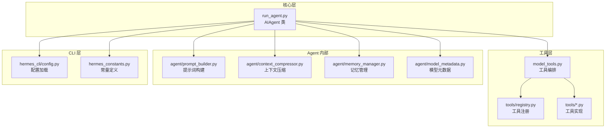
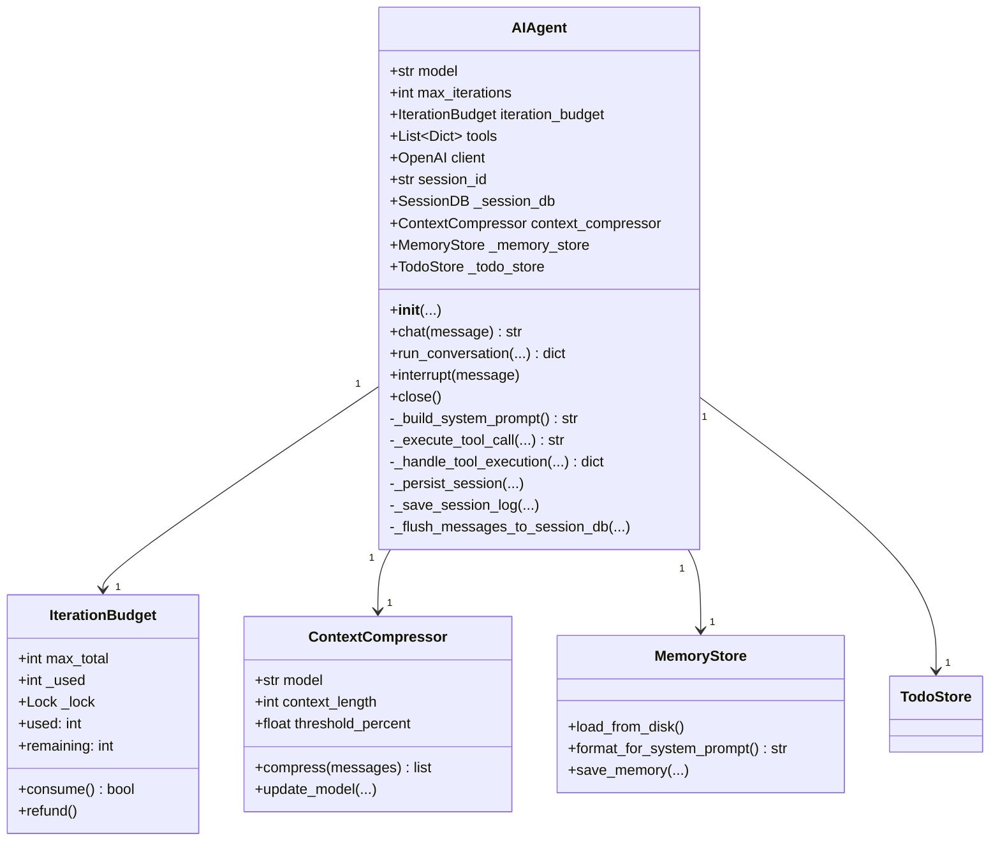
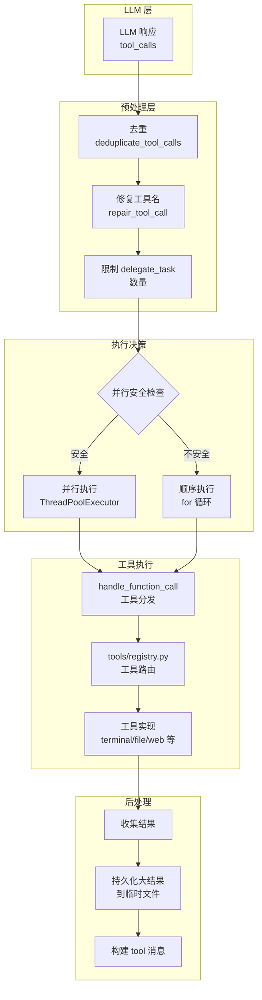
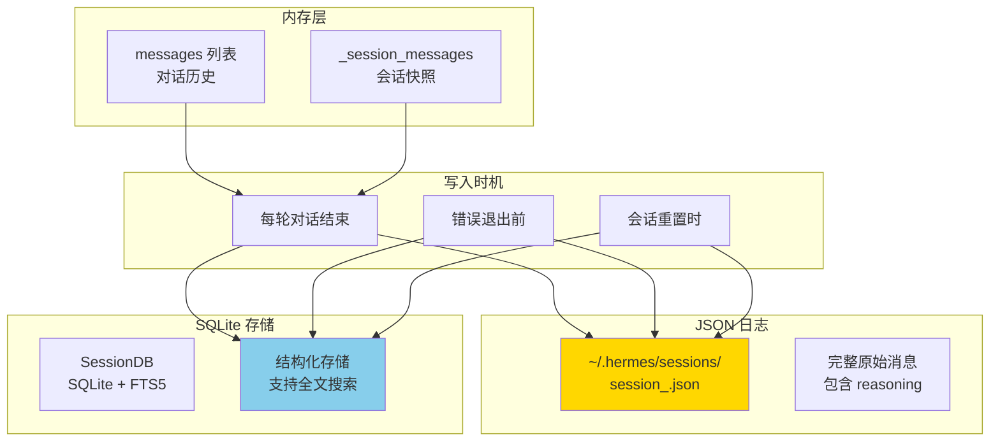
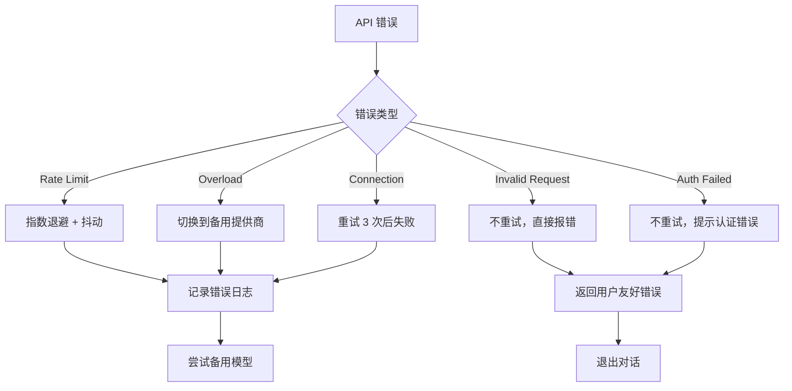
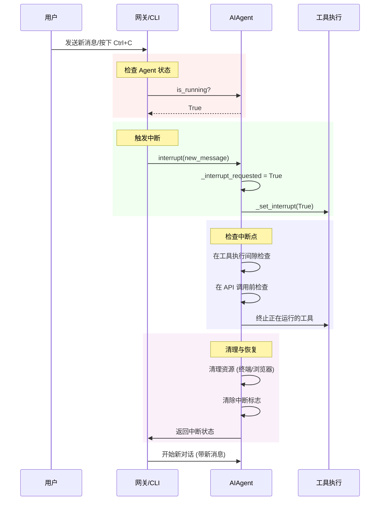
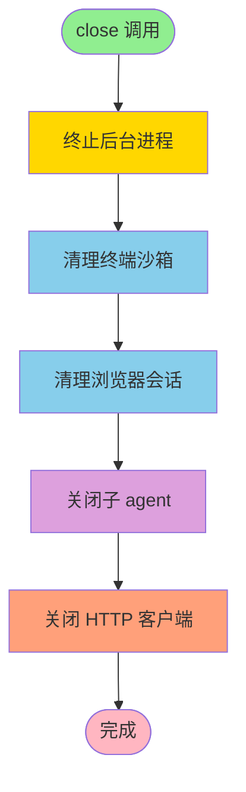

# run_agent.py 核心业务逻辑与架构详解

> 本文档深入解析 Hermes-Agent 的核心对话引擎 `run_agent.py`，揭示 AI Agent 的完整业务流程、工具调用机制和对话管理架构。

## 目录

1. [文件概览](#1-文件概览)
2. [AIAgent 类核心架构](#2-aiagent-类核心架构)
3. [初始化流程详解](#3-初始化流程详解)
4. [对话循环核心逻辑](#4-对话循环核心逻辑)
5. [工具调用系统](#5-工具调用系统)
6. [会话管理与持久化](#6-会话管理与持久化)
7. [错误处理与重试机制](#7-错误处理与重试机制)
8. [上下文管理与压缩](#8-上下文管理与压缩)
9. [中断机制](#9-中断机制)
10. [资源清理与关闭](#10-资源清理与关闭)
11. [完整业务流程图](#11-完整业务流程图)
12. [总结](#12-总结)

---

## 1. 文件概览

### 1.1 核心功能

`run_agent.py` 是 Hermes-Agent 的**核心对话引擎**，提供了：

- ✅ **AI Agent 主循环** - 完整的对话管理和工具调用流程
- ✅ **工具编排系统** - 自动发现、验证、执行工具
- ✅ **会话持久化** - SQLite + JSON 日志双重存储
- ✅ **上下文管理** - 自动压缩、缓存优化
- ✅ **错误恢复** - 分层重试、降级策略
- ✅ **多平台支持** - CLI、Telegram、Discord 等统一接口

### 1.2 核心文件依赖



---

## 2. AIAgent 类核心架构

### 2.1 类结构总览

```python
class AIAgent:
    """AI Agent with tool calling capabilities."""
    
    # 核心属性
    - model: str              # 模型名称
    - max_iterations: int     # 最大工具调用次数 (默认 90)
    - iteration_budget: IterationBudget  # 线程安全的迭代计数器
    - tools: List[Dict]       # 可用工具列表
    - client: OpenAI          # LLM 客户端
    - session_id: str         # 会话 ID
    - _session_db: SessionDB  # SQLite 会话存储
    - context_compressor: ContextCompressor  # 上下文压缩器
    - _memory_store: MemoryStore  # 记忆存储
    - _todo_store: TodoStore  # 任务列表存储
    
    # 回调系统 (9 种)
    - tool_progress_callback  # 工具进度通知
    - thinking_callback       # 思考状态
    - reasoning_callback      # 推理内容
    - clarify_callback        # 用户澄清问题
    - status_callback         # 生命周期状态
    
    # 核心方法
    + __init__(...)           # 初始化
    + chat(message) -> str    # 简单对话接口
    + run_conversation(...)   # 完整对话循环
    + interrupt(message)      # 中断当前操作
    + close()                 # 释放资源
```

### 2.2 UML 类图



---

## 3. 初始化流程详解

### 3.1 初始化流程图

```mermaid
sequenceDiagram
    participant User as 用户
    participant Agent as AIAgent
    participant Config as 配置系统
    participant Tools as 工具系统
    participant Memory as 记忆系统
    participant Context as 上下文引擎
    participant DB as SessionDB
    
    User->>Agent: 创建 AIAgent 实例
    
    rect rgb(240, 248, 255)
        Note over Agent: 1. 环境加载
        Agent->>Config: 加载 .env 文件
        Config-->>Agent: ~/.hermes/.env + 项目.env
    end
    
    rect rgb(255, 250, 240)
        Note over Agent: 2. 客户端初始化
        Agent->>Agent: 解析 provider/api_mode
        Agent->>Agent: 创建 OpenAI/Anthropic 客户端
        Note over Agent: 处理认证、base_url、headers
    end
    
    rect rgb(240, 255, 240)
        Note over Agent: 3. 工具系统加载
        Agent->>Tools: get_tool_definitions()
        Tools-->>Agent: 返回工具 schema 列表
        Agent->>Agent: 过滤 enabled/disabled toolsets
        Agent->>Agent: 检查工具依赖 (API keys 等)
    end
    
    rect rgb(255, 240, 240)
        Note over Agent: 4. 记忆与上下文
        Agent->>Memory: 加载 MEMORY.md + USER.md
        Agent->>Context: 初始化 ContextCompressor
        Note over Context: 读取 compression 配置
        Context->>Context: 检测模型 context_length
    end
    
    rect rgb(250, 240, 255)
        Note over Agent: 5. 会话存储
        Agent->>DB: create_session(session_id)
        DB-->>Agent: SQLite 会话记录创建成功
    end
    
    Agent-->>User: AIAgent 初始化完成
end
```

### 3.2 初始化关键步骤

#### 步骤 1: 环境变量加载

```python
# 加载顺序：~/.hermes/.env → 项目根目录/.env
_hermes_home = get_hermes_home()
_project_env = Path(__file__).parent / '.env'
_loaded_env_paths = load_hermes_dotenv(hermes_home=_hermes_home, project_env=_project_env)
```

#### 步骤 2: API 模式检测

```python
# 自动检测 API 模式
if provider == "openai-codex":
    api_mode = "codex_responses"
elif provider == "anthropic" or "api.anthropic.com" in base_url:
    api_mode = "anthropic_messages"
else:
    api_mode = "chat_completions"
```

#### 步骤 3: 工具加载与过滤

```python
# 获取工具定义并应用过滤
self.tools = get_tool_definitions(
    enabled_toolsets=enabled_toolsets,
    disabled_toolsets=disabled_toolsets,
    quiet_mode=self.quiet_mode,
)

# 存储有效工具名用于验证
self.valid_tool_names = {tool["function"]["name"] for tool in self.tools}
```

#### 步骤 4: 上下文引擎初始化

```python
# 配置驱动的上下文引擎选择
_engine_name = config.get("context", {}).get("engine", "compressor")

if _engine_name != "compressor":
    # 尝试加载插件引擎
    _selected_engine = load_context_engine(_engine_name)
else:
    # 使用内置压缩器
    self.context_compressor = ContextCompressor(
        model=self.model,
        threshold_percent=compression_threshold,
        protect_last_n=compression_protect_last,
    )
```

---

## 4. 对话循环核心逻辑

### 4.1 完整对话流程图

```mermaid
flowchart TD
    Start([开始对话]) --> Init[初始化会话状态]
    
    Init --> BuildPrompt[构建系统提示词]
    BuildPrompt --> CheckBudget{迭代预算<br/>剩余？}
    
    CheckBudget -->|是 | APICall[调用 LLM API]
    CheckBudget -->|否 | InjectBudget[注入预算耗尽消息]
    InjectBudget --> GraceCall[允许最后一次 API 调用]
    
    APICall --> HasToolCall{有工具调用？}
    GraceCall --> HasToolCall
    
    HasToolCall -->|是 | ParallelCheck{可并行执行？}
    HasToolCall -->|否 | HasResponse{有文本响应？}
    
    ParallelCheck -->|是 | ParallelExec[并发执行工具<br/>ThreadPoolExecutor]
    ParallelCheck -->|否 | SequentialExec[顺序执行工具]
    
    ParallelExec --> CollectResults[收集工具结果]
    SequentialExec --> CollectResults
    
    CollectResults --> AppendMessages[追加工具消息到历史]
    AppendMessages --> CheckBudget
    
    HasResponse -->|是 | CleanResponse[清理响应内容]
    HasResponse -->|否 | Retry[重试或报错]
    
    CleanResponse --> PersistSession[持久化会话]
    PersistSession --> SaveTrajectory[保存轨迹 (可选)]
    SaveTrajectory --> ReturnResponse[返回响应]
    ReturnResponse --> End([结束])
    
    Retry --> CheckRetry{可重试？}
    CheckRetry -->|是 | APICall
    CheckRetry -->|否 | ErrorExit[错误退出]
    
    style Start fill:#90EE90
    style End fill:#FFB6C1
    style APICall fill:#87CEEB
    style ParallelExec fill:#DDA0DD
    style SequentialExec fill:#DDA0DD
    style PersistSession fill:#FFD700
```

### 4.2 对话循环伪代码

```python
def run_conversation(self, user_message, conversation_history=None):
    # 1. 初始化
    messages = build_initial_messages(user_message, conversation_history)
    api_call_count = 0
    tool_results = []
    
    # 2. 主循环
    while api_call_count < max_iterations and budget.remaining > 0:
        # 2.1 检查中断
        if self._interrupt_requested:
            return handle_interrupt()
        
        # 2.2 调用 LLM
        response = client.chat.completions.create(
            model=self.model,
            messages=messages,
            tools=self.tools,
            max_tokens=self.max_tokens,
        )
        
        api_call_count += 1
        assistant_message = response.choices[0].message
        
        # 2.3 提取推理内容
        reasoning = self._extract_reasoning(assistant_message)
        
        # 2.4 检查工具调用
        if assistant_message.tool_calls:
            # 2.4.1 去重和修复工具名
            tool_calls = deduplicate_tool_calls(assistant_message.tool_calls)
            tool_calls = repair_tool_names(tool_calls)
            
            # 2.4.2 决定执行模式
            if should_parallelize(tool_calls):
                results = execute_parallel(tool_calls, task_id=session_id)
            else:
                results = execute_sequential(tool_calls, task_id=session_id)
            
            # 2.4.3 追加消息
            messages.append(assistant_message)
            for result in results:
                messages.append(create_tool_result_message(result))
            
            tool_results.extend(results)
            time.sleep(tool_delay)
            
        # 2.5 检查文本响应
        elif assistant_message.content:
            # 2.5.1 清理内容
            content = clean_response(assistant_message.content)
            
            # 2.5.2 持久化
            self._persist_session(messages, conversation_history)
            
            # 2.5.3 返回
            return {
                "final_response": content,
                "messages": messages,
                "tool_results": tool_results,
            }
        
        # 2.6 无响应处理
        else:
            if can_retry(response):
                continue
            else:
                raise Error("Empty response")
    
    # 3. 预算耗尽处理
    return handle_budget_exhausted(messages)
```

### 4.3 关键决策点

#### 决策点 1: 并行 vs 顺序执行

```python
def _should_parallelize_tool_batch(tool_calls) -> bool:
    """判断工具调用批次是否可并行执行。"""
    if len(tool_calls) <= 1:
        return False
    
    tool_names = [tc.function.name for tc in tool_calls]
    
    # 1. 检查是否包含禁止并行的工具 (如 clarify)
    if any(name in _NEVER_PARALLEL_TOOLS for name in tool_names):
        return False
    
    # 2. 检查文件工具路径是否冲突
    reserved_paths = []
    for tool_call in tool_calls:
        if tool_name in _PATH_SCOPED_TOOLS:
            scoped_path = _extract_parallel_scope_path(tool_name, args)
            if any(_paths_overlap(scoped_path, existing) for existing in reserved_paths):
                return False
            reserved_paths.append(scoped_path)
        
        # 3. 检查是否是只读工具
        if tool_name not in _PARALLEL_SAFE_TOOLS:
            return False
    
    return True
```

#### 决策点 2: 工具名修复

```python
def _repair_tool_call(self, tool_name: str) -> str | None:
    """尝试修复不匹配的工具名。"""
    # 1. 尝试小写
    lowered = tool_name.lower()
    if lowered in self.valid_tool_names:
        return lowered
    
    # 2. 尝试标准化 (横线/空格 → 下划线)
    normalized = lowered.replace("-", "_").replace(" ", "_")
    if normalized in self.valid_tool_names:
        return normalized
    
    # 3. 尝试模糊匹配
    matches = get_close_matches(lowered, self.valid_tool_names, n=1, cutoff=0.7)
    if matches:
        return matches[0]
    
    return None  # 无法修复
```

---

## 5. 工具调用系统

### 5.1 工具调用架构



### 5.2 工具执行流程

```python
# 工具执行核心逻辑
def _execute_tool_call(tool_call, task_id):
    tool_name = tool_call.function.name
    args = json.loads(tool_call.function.arguments)
    
    # 1. 调用工具处理器
    result = handle_function_call(
        tool_name=tool_name,
        function_args=args,
        task_id=task_id,
    )
    
    # 2. 处理大结果 (超过 100KB 保存到临时文件)
    if len(result) > 100_000:
        result = persist_large_result_to_temp_file(result)
    
    # 3. 构建工具结果消息
    tool_result_message = {
        "role": "tool",
        "content": result,
        "tool_call_id": tool_call.id,
        "tool_name": tool_name,
    }
    
    return tool_result_message
```

### 5.3 并发执行模型

```python
# 并发执行实现
def execute_tools_parallel(tool_calls, task_id, max_workers=8):
    results = []
    
    with ThreadPoolExecutor(max_workers=max_workers) as executor:
        futures = {
            executor.submit(_execute_tool_call, tc, task_id): tc
            for tc in tool_calls
        }
        
        for future in as_completed(futures):
            try:
                result = future.result()
                results.append(result)
            except Exception as e:
                results.append({"error": str(e)})
    
    return results
```

---

## 6. 会话管理与持久化

### 6.1 双重持久化架构



### 6.2 持久化流程

```python
def _persist_session(self, messages, conversation_history=None):
    """在任何退出路径保存会话状态。"""
    if not self.persist_session:
        return
    
    # 1. 应用用户消息覆盖 (用于 API-only 变体)
    self._apply_persist_user_message_override(messages)
    
    # 2. 更新内存快照
    self._session_messages = messages
    
    # 3. 保存 JSON 日志
    self._save_session_log(messages)
    
    # 4. 刷新到 SQLite
    self._flush_messages_to_session_db(messages, conversation_history)

def _flush_messages_to_session_db(self, messages, conversation_history=None):
    """将未刷新的消息持久化到 SQLite。"""
    if not self._session_db:
        return
    
    # 1. 确保会话存在
    self._session_db.ensure_session(
        session_id=self.session_id,
        source=self.platform or "cli",
        model=self.model,
    )
    
    # 2. 计算刷新起点 (避免重复写入)
    start_idx = len(conversation_history) if conversation_history else 0
    flush_from = max(start_idx, self._last_flushed_db_idx)
    
    # 3. 追加消息
    for msg in messages[flush_from:]:
        self._session_db.append_message(
            session_id=self.session_id,
            role=msg.get("role"),
            content=msg.get("content"),
            tool_calls=msg.get("tool_calls"),
            reasoning=msg.get("reasoning"),
            # ... 其他字段
        )
    
    # 4. 更新游标
    self._last_flushed_db_idx = len(messages)
```

### 6.3 轨迹保存 (训练数据)

```python
def _save_trajectory(self, messages, user_query, completed):
    """保存对话轨迹到 JSONL 文件 (用于模型训练)。"""
    if not self.save_trajectories:
        return
    
    # 1. 转换为轨迹格式
    trajectory = self._convert_to_trajectory_format(
        messages, user_query, completed
    )
    
    # 2. 保存到文件
    _save_trajectory_to_file(trajectory, self.model, completed)

# 轨迹格式示例
```json
{
    "messages": [
        {"from": "system", "value": "You are a function calling AI..."},
        {"from": "human", "value": "用户问题"},
        {"from": "gpt", "value": "<think>\n推理内容\n</think>\n

### 7.1 错误分类架构



### 7.2 重试逻辑实现

```python
# 分层重试策略
def execute_with_retry(func, max_retries=3):
    """执行函数并重试。"""
    for attempt in range(max_retries):
        try:
            return func()
        except RateLimitError as e:
            # Rate limit: 指数退避 + 抖动
            wait_time = (2 ** attempt) + random.uniform(0, 1)
            logger.warning(f"Rate limited, waiting {wait_time}s")
            time.sleep(wait_time)
            
        except APITimeoutError as e:
            # 超时：立即重试，最多 3 次
            if attempt >= max_retries:
                raise
            logger.warning(f"Timeout (attempt {attempt+1}/{max_retries})")
            continue
            
        except AuthenticationError as e:
            # 认证失败：不重试
            logger.error("Authentication failed")
            raise
            
        except InvalidRequestError as e:
            # 无效请求：不重试
            logger.error(f"Invalid request: {e}")
            raise
```

### 7.3 错误信息清理

```python
def _clean_error_message(error_msg: str) -> str:
    """清理错误消息用于用户显示。"""
    if not error_msg:
        return "Unknown error"
    
    # 移除 HTML 内容 (CloudFlare 错误页面)
    if error_msg.strip().startswith('<!DOCTYPE html') or '<html' in error_msg:
        return "Service temporarily unavailable (HTML error page returned)"
    
    # 移除换行和多余空格
    cleaned = ' '.join(error_msg.split())
    
    # 截断过长消息
    if len(cleaned) > 150:
        cleaned = cleaned[:150] + "..."
    
    return cleaned
```

---


---

## 7. 错误处理与重试机制

### 7.1 错误分类架构


### 7.2 重试逻辑实现

```python
# 分层重试策略
def execute_with_retry(func, max_retries=3):
    """执行函数并重试。"""
    for attempt in range(max_retries):
        try:
            return func()
        except RateLimitError as e:
            # Rate limit: 指数退避 + 抖动
            wait_time = (2 ** attempt) + random.uniform(0, 1)
            logger.warning(f"Rate limited, waiting {wait_time}s")
            time.sleep(wait_time)
            
        except APITimeoutError as e:
            # 超时：立即重试，最多 3 次
            if attempt >= max_retries:
                raise
            logger.warning(f"Timeout (attempt {attempt+1}/{max_retries})")
            continue
            
        except AuthenticationError as e:
            # 认证失败：不重试
            logger.error("Authentication failed")
            raise
            
        except InvalidRequestError as e:
            # 无效请求：不重试
            logger.error(f"Invalid request: {e}")
            raise
```

### 7.3 错误信息清理

```python
def _clean_error_message(error_msg: str) -> str:
    """清理错误消息用于用户显示。"""
    if not error_msg:
        return "Unknown error"
    
    # 移除 HTML 内容 (CloudFlare 错误页面)
    if error_msg.strip().startswith('<!DOCTYPE html') or '<html' in error_msg:
        return "Service temporarily unavailable (HTML error page returned)"
    
    # 移除换行和多余空格
    cleaned = ' '.join(error_msg.split())
    
    # 截断过长消息
    if len(cleaned) > 150:
        cleaned = cleaned[:150] + "..."
    
    return cleaned
```
## 8. 上下文管理与压缩

### 8.1 上下文压缩架构

```mermaid
sequenceDiagram
    participant Agent as AIAgent
    participant Compressor as ContextCompressor
    participant AuxLLM as 辅助 LLM
    participant Messages as 消息历史
    
    Agent->>Agent: 每次 API 调用前检查
    
    rect rgb(255, 240, 240)
        Note over Agent: 检查上下文使用率
        Agent->>Compressor: estimate_tokens(messages)
        Compressor-->>Agent: 当前 token 数
        Agent->>Agent: 计算使用率 = current/limit
    end
    
    rect rgb(240, 255, 240)
        Note over Agent: 超过阈值 (50%)?
        Agent->>Agent{使用率 > threshold?}
        Agent-->>Agent: 否：继续正常对话
        Agent-->>Agent: 是：触发压缩
    end
    
    rect rgb(240, 240, 255)
        Note over Agent: 执行压缩
        Agent->>Compressor: compress(messages)
        Compressor->>Compressor: 识别可压缩的中间对话
        Compressor->>AuxLLM: 调用辅助 LLM 总结
        AuxLLM-->>Compressor: 返回摘要
        Compressor->>Compressor: 替换原始对话为摘要
        Compressor-->>Agent: 压缩后的消息列表
    end
    
    rect rgb(250, 240, 250)
        Note over Agent: 更新状态
        Agent->>Agent: 使系统提示词缓存失效
        Agent->>Agent: 重建系统提示词
        Agent->>Agent: 继续对话
    end
```

### 8.2 压缩配置

```yaml
# config.yaml
compression:
  enabled: true              # 启用自动压缩
  threshold: 0.50            # 50% 使用率触发
  target_ratio: 0.20         # 压缩到 20%
  protect_last_n: 20         # 保护最近 20 轮对话
  summary_model: "gpt-4o"    # 辅助总结模型
  context_length: 128000     # 主模型上下文窗口
```

### 8.3 压缩策略

```python
class ContextCompressor:
    def compress(self, messages):
        """压缩对话历史。"""
        # 1. 计算当前 token 数
        current_tokens = estimate_tokens_rough(messages)
        
        # 2. 检查是否需要压缩
        if current_tokens < self.threshold_tokens:
            return messages  # 不需要压缩
        
        # 3. 识别可压缩的部分
        #    - 保护系统提示词 (前 3 条)
        #    - 保护最近 N 轮对话
        #    - 压缩中间的旧对话
        compress_start = self.protect_first_n
        compress_end = len(messages) - self.protect_last_n
        
        if compress_end <= compress_start:
            return messages  # 没有可压缩的内容
        
        # 4. 调用辅助 LLM 总结
        to_compress = messages[compress_start:compress_end]
        summary = self._summarize_with_llm(to_compress)
        
        # 5. 替换为摘要
        summary_message = {
            "role": "system",
            "content": f"[Context Summary]\n{summary}"
        }
        
        compressed = (
            messages[:compress_start] +
            [summary_message] +
            messages[compress_end:]
        )
        
        return compressed
```

---

## 9. 中断机制

### 9.1 中断流程图



### 9.2 中断实现

```python
def interrupt(self, message: str = None) -> None:
    """请求中断当前的工具调用循环。"""
    # 1. 设置中断标志
    self._interrupt_requested = True
    self._interrupt_message = message
    
    # 2. 信号通知所有工具立即终止
    #    作用域到此 agent 的执行线程
    _set_interrupt(True, self._execution_thread_id)
    
    # 3. 传播中断到子 agent (委托任务)
    with self._active_children_lock:
        children_copy = list(self._active_children)
    
    for child in children_copy:
        try:
            child.interrupt(message)
        except Exception as e:
            logger.debug(f"Failed to propagate interrupt: {e}")
    
    # 4. 用户提示
    if not self.quiet_mode:
        print(f"\n⚡ Interrupt requested" + 
              (f": '{message[:40]}...'" if message else ""))

def clear_interrupt(self) -> None:
    """清除中断请求。"""
    self._interrupt_requested = False
    self._interrupt_message = None
    _set_interrupt(False, self._execution_thread_id)
```

### 9.3 中断检查点

```python
# 在对话循环中检查中断
def run_conversation(self, user_message, ...):
    while api_call_count < max_iterations:
        # 检查点 1: 循环开始
        if self._interrupt_requested:
            return handle_interrupt()
        
        # API 调用
        response = client.chat.completions.create(...)
        
        # 检查点 2: 工具执行前
        if self._interrupt_requested:
            return handle_interrupt()
        
        # 工具执行
        if assistant_message.tool_calls:
            results = execute_tools(...)
            
            # 检查点 3: 工具执行后
            if self._interrupt_requested:
                return handle_interrupt()
```

---

## 10. 资源清理与关闭

### 10.1 资源清理流程



### 10.2 清理实现

```python
def close(self) -> None:
    """释放 agent 实例持有的所有资源。"""
    task_id = getattr(self, "session_id", None) or ""
    
    # 1. 终止后台进程
    try:
        from tools.process_registry import process_registry
        process_registry.kill_all(task_id=task_id)
    except Exception:
        pass
    
    # 2. 清理终端沙箱
    try:
        from tools.terminal_tool import cleanup_vm
        cleanup_vm(task_id)
    except Exception:
        pass
    
    # 3. 清理浏览器会话
    try:
        from tools.browser_tool import cleanup_browser
        cleanup_browser(task_id)
    except Exception:
        pass
    
    # 4. 关闭子 agent
    try:
        with self._active_children_lock:
            children = list(self._active_children)
            self._active_children.clear()
        
        for child in children:
            try:
                child.close()
            except Exception:
                pass
    except Exception:
        pass
    
    # 5. 关闭 HTTP 客户端
    try:
        client = getattr(self, "client", None)
        if client is not None:
            self._close_openai_client(client, reason="agent_close")
            self.client = None
    except Exception:
        pass
```

---

## 11. 完整业务流程图

### 11.1 端到端业务流程

```mermaid
flowchart TB
    Start([用户请求]) --> CLI[CLI 或网关接收]
    
    CLI --> CreateAgent[创建 AIAgent 实例]
    
    subgraph 初始化
        CreateAgent --> LoadEnv[加载环境变量]
        LoadEnv --> InitClient[初始化 LLM 客户端]
        InitClient --> LoadTools[加载工具系统]
        LoadTools --> InitMemory[初始化记忆系统]
        InitMemory --> InitContext[初始化上下文引擎]
        InitContext --> CreateSession[创建会话存储]
    end
    
    subgraph 对话循环
        CreateSession --> BuildPrompt[构建系统提示词]
        BuildPrompt --> CheckBudget{预算剩余？}
        
        CheckBudget -->|否 | InjectBudget[注入预算消息]
        CheckBudget -->|是 | APICall[调用 LLM]
        InjectBudget --> APICall
        
        APICall --> CheckToolCall{有工具调用？}
        
        CheckToolCall -->|是 | Preprocess[预处理工具调用]
        Preprocess --> ParallelCheck{可并行？}
        
        ParallelCheck -->|是 | ParallelExec[并发执行]
        ParallelCheck -->|否 | SequentialExec[顺序执行]
        
        ParallelExec --> CollectResults[收集结果]
        SequentialExec --> CollectResults
        
        CollectResults --> AppendMessages[追加消息]
        AppendMessages --> CheckBudget
        
        CheckToolCall -->|否 | CheckResponse{有文本响应？}
        
        CheckResponse -->|是 | CleanContent[清理内容]
        CleanContent --> PersistSession[持久化会话]
        PersistSession --> SaveTrajectory[保存轨迹 (可选)]
        SaveTrajectory --> ReturnResponse[返回响应]
        
        CheckResponse -->|否 | Retry{可重试？}
        Retry -->|是 | APICall
        Retry -->|否 | ErrorHandle[错误处理]
    end
    
    subgraph 清理
        ReturnResponse --> Cleanup[清理资源]
        ErrorHandle --> Cleanup
        Cleanup --> Close[关闭 agent]
    end
    
    Close --> End([结束])
    
    style Start fill:#90EE90
    style End fill:#FFB6C1
    style APICall fill:#87CEEB
    style ParallelExec fill:#DDA0DD
    style SequentialExec fill:#DDA0DD
    style PersistSession fill:#FFD700
    style Cleanup fill:#FFA07A
```

### 11.2 关键路径时序图

```mermaid
sequenceDiagram
    participant U as 用户
    participant C as CLI/Gateway
    participant A as AIAgent
    participant L as LLM
    participant T as 工具系统
    participant D as SessionDB
    
    U->>C: 发送消息
    
    rect rgb(240, 248, 255)
        Note over C,A: 初始化阶段
        C->>A: new AIAgent(...)
        A->>A: 加载工具/记忆/上下文
        A->>D: create_session()
        A-->>C: 初始化完成
    end
    
    rect rgb(255, 250, 240)
        Note over A,L,T: 对话循环 (多次迭代)
        C->>A: run_conversation(message)
        
        loop 直到完成或预算耗尽
            A->>L: chat.completions.create()
            L-->>A: 响应 (tool_calls 或 content)
            
            alt 有工具调用
                A->>T: execute_parallel/sequential()
                T-->>A: 工具结果列表
                A->>A: 追加消息到历史
            else 有文本响应
                A->>A: 清理响应内容
                A->>D: _persist_session()
                A-->>C: 返回响应
            end
        end
    end
    
    rect rgb(240, 255, 240)
        Note over A,D: 持久化阶段
        A->>D: _save_session_log()
        A->>D: _flush_messages_to_session_db()
    end
    
    rect rgb(255, 240, 240)
        Note over A: 清理阶段
        A->>A: close()
        Note over A: 终止进程/清理沙箱/<br/>关闭客户端
    end
    
    C-->>U: 返回最终响应
```

---

## 12. 总结

### 12.1 核心设计模式

| 模式 | 应用场景 | 优势 |
|------|---------|------|
| **策略模式** | 工具执行 (并行/顺序) | 灵活切换执行策略 |
| **工厂模式** | LLM 客户端创建 | 统一不同 provider 的初始化 |
| **观察者模式** | 回调系统 | 解耦进度通知与业务逻辑 |
| **单例模式** | SessionDB、Registry | 全局唯一实例，资源共享 |
| **责任链模式** | 错误处理 | 分层处理不同类型的错误 |
| **代理模式** | 工具注册表 | 延迟加载工具，统一调度 |

### 12.2 关键技术特性

✅ **线程安全**: `IterationBudget` 使用锁保护共享状态  
✅ **并发控制**: 最大 8 个工作线程，路径冲突检测  
✅ **容错机制**: 分层重试、指数退避、备用 provider  
✅ **资源管理**: 自动清理终端、浏览器、后台进程  
✅ **持久化**: JSON 日志 + SQLite 双重存储  
✅ **可扩展性**: 插件式上下文引擎、记忆 provider  
✅ **性能优化**: 提示词缓存、上下文压缩  

### 12.3 配置驱动架构

```yaml
# 配置影响的核心行为
agent:
  tool_use_enforcement: "auto"  # 工具使用纪律
  max_iterations: 90            # 最大工具调用次数

compression:
  enabled: true                 # 自动压缩
  threshold: 0.50               # 触发阈值
  engine: "compressor"          # 上下文引擎 (可插件化)

memory:
  memory_enabled: true          # 持久记忆
  user_profile_enabled: true    # 用户画像
  provider: "honcho"            # 记忆 provider (可插件化)

delegation:
  max_concurrent_children: 3    # 最大子 agent 并发数
  max_iterations: 50            # 子 agent 迭代限制
```

### 12.4 性能指标

| 指标 | 默认值 | 说明 |
|------|-------|------|
| 最大迭代次数 | 90 | 父 agent 总调用次数 |
| 子 agent 迭代 | 50 | 每个委托任务的限制 |
| 并发工具执行 | 8 | ThreadPoolExecutor 最大线程数 |
| 上下文压缩阈值 | 50% | 触发压缩的使用率 |
| 保护最近对话 | 20 轮 | 不被压缩的最近对话数 |
| 工具结果阈值 | 100KB | 超过则保存到临时文件 |

### 12.5 最佳实践

1. **生产环境配置**:
   - 启用 `save_trajectories` 用于调试
   - 配置 `fallback_providers` 提高可用性
   - 设置合理的 `max_iterations` 避免无限循环

2. **性能优化**:
   - 使用 prompt caching (Claude via OpenRouter)
   - 配置辅助 LLM 进行上下文压缩
   - 启用工具并发执行 (默认已启用)

3. **错误处理**:
   - 监控 `errors.log` 文件
   - 配置告警回调 (`status_callback`)
   - 定期清理 `~/.hermes/sessions/` 目录

4. **安全建议**:
   - 使用配置文件控制工具访问
   - 对危险命令启用审批流
   - 定期备份 `~/.hermes/` 目录

---

## 附录：快速参考

### A. 核心方法签名

```python
# 对话接口
chat(message: str) -> str
run_conversation(user_message, conversation_history, system_message) -> dict

# 生命周期
__init__(model, max_iterations, enabled_toolsets, ...)
close()
interrupt(message: str = None)
clear_interrupt()

# 持久化
_save_session_log(messages)
_flush_messages_to_session_db(messages, conversation_history)
_save_trajectory(messages, user_query, completed)

# 系统提示词
_build_system_prompt(system_message) -> str
_invalidate_system_prompt()
```

### B. 关键文件路径

```
~/.hermes/
├── config.yaml              # 主配置文件
├── .env                     # API keys
├── logs/
│   ├── agent.log           # 主日志 (INFO+)
│   └── errors.log          # 错误日志 (WARNING+)
├── sessions/
│   ├── session_<id>.json   # JSON 日志
│   └── hermes.db           # SQLite 数据库
├── trajectories/
│   └── <model>_<timestamp>.jsonl  # 训练轨迹
└── skills/                 # 用户技能
    └── *.md
```

### C. 环境变量

```bash
# 核心配置
HERMES_HOME=~/.hermes              # Hermes 主目录
TERMINAL_CWD=/path/to/cwd          # 终端工作目录
MESSAGING_CWD=/path/to/cwd         # 网关工作目录

# 调试
HERMES_VERBOSE=true                # 详细日志
HERMES_QUIET=false                 # 安静模式
HERMES_DUMP_REQUEST_STDOUT=true    # 打印请求转储

# 功能开关
HERMES_SKIP_CONTEXT_FILES=false    # 跳过上下文文件
HERMES_SKIP_MEMORY=false           # 跳过记忆加载
HERMES_SAVE_TRAJECTORIES=false     # 保存轨迹
```

---

**文档版本**: 1.0  
**最后更新**: 2026-04-23  
**适用版本**: Hermes-Agent v2.0+  
**作者**: AI Assistant
