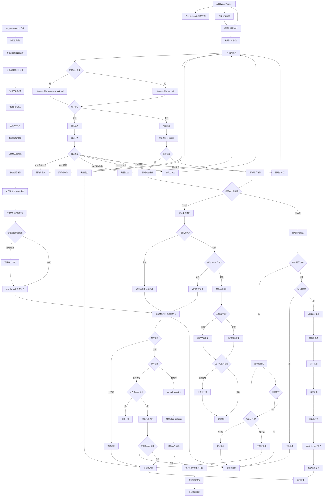
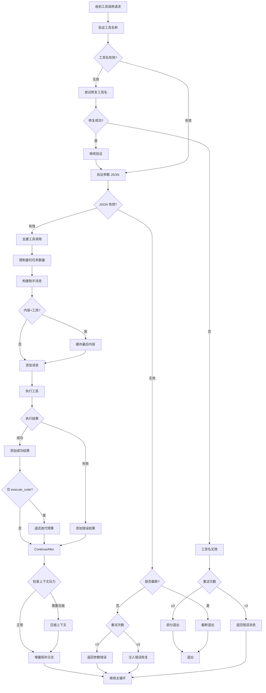
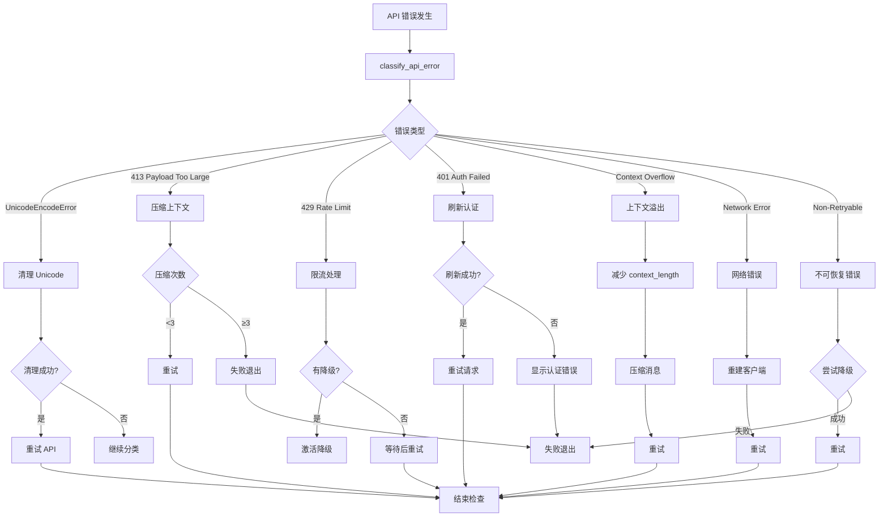
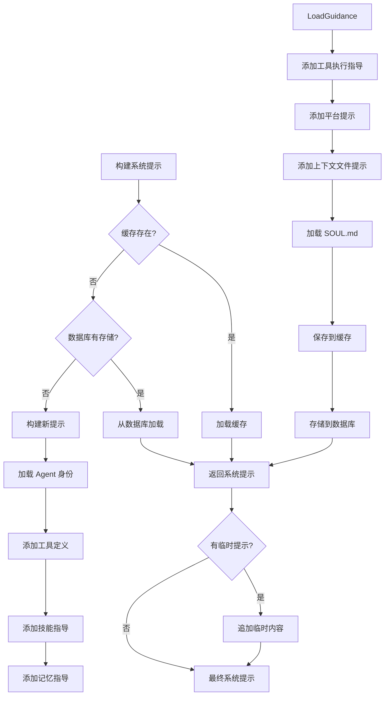
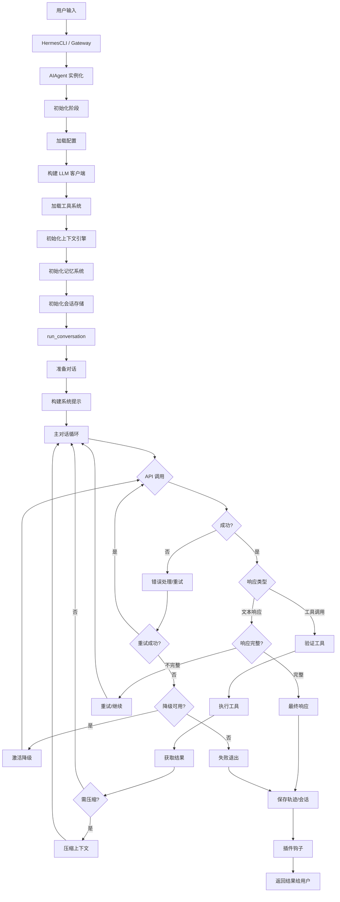

# Hermes Agent 核心运行模块架构分析

## 文件概述

**文件路径**: `run_agent.py`  
**文件定位**: Hermes Agent 的核心对话引擎，提供完整的 AI Agent 运行能力  
**核心类**: `AIAgent` — 管理对话流程、工具执行、响应处理的完整生命周期  
**代码规模**: 约 10,500 行，是 Hermes Agent 最大的单体文件  

---

## 代码结构总览

### 模块依赖关系

```
run_agent.py
├── 环境加载
│   ├── hermes_constants.get_hermes_home()
│   └── hermes_cli.env_loader.load_hermes_dotenv()
├── 工具系统
│   ├── model_tools (工具定义、调度、检查)
│   ├── tools.terminal_tool (终端工具)
│   ├── tools.tool_result_storage (结果持久化)
│   └── tools.browser_tool (浏览器清理)
├── Agent 内部模块
│   ├── agent.prompt_builder (系统提示构建)
│   ├── agent.model_metadata (模型上下文管理)
│   ├── agent.context_compressor (上下文压缩)
│   ├── agent.prompt_caching (Anthropic 缓存)
│   ├── agent.auxiliary_client (辅助 LLM 客户端)
│   ├── agent.memory_manager (外部记忆管理)
│   ├── agent.display (UI 显示)
│   ├── agent.trajectory (轨迹保存)
│   └── agent.usage_pricing (成本估算)
└── 工具执行
    ├── tools.checkpoint_manager (检查点管理)
    └── tools.todo_tool (任务列表)
```

### 核心类与辅助类

| 类名 | 职责 | 代码位置 |
|------|------|----------|
| `AIAgent` | 主 Agent 类，管理完整对话生命周期 | L492-10376 |
| `IterationBudget` | 线程安全的迭代计数器，控制工具调用预算 | L170-211 |
| `_SafeWriter` | 透明标准输出包装器，防止管道断裂崩溃 | L113-167 |

---

## AIAgent 类详细结构

### 初始化阶段 (`__init__`)

初始化流程分为以下阶段：

```
1. 环境初始化
   ├── 安装安全输出包装器 (_install_safe_stdio)
   ├── 加载 .env 环境变量
   └── 获取 HERMES_HOME 路径

2. 模型客户端初始化
   ├── 解析 provider 和 api_mode
   ├── 标准化模型名称
   ├── 检测 GPT-5.x (需要 Responses API)
   ├── 构建 OpenAI/Anthropic 客户端
   └── 预填充 fallback 链

3. 工具系统初始化
   ├── 获取可用工具列表 (支持过滤)
   ├── 检查工具依赖要求
   └── 注册工具回调函数

4. 上下文引擎初始化
   ├── 加载压缩配置 (阈值、目标比例)
   ├── 检测上下文引擎插件
   ├── 初始化 ContextCompressor
   └── 验证最小上下文窗口 (≥64K)

5. 记忆系统初始化
   ├── 加载 MEMORY.md/USER.md (内置记忆)
   ├── 初始化外部记忆插件 (如 Honcho)
   └── 注入记忆工具到工具表面

6. 会话管理初始化
   ├── 生成/使用 session_id
   ├── 创建会话日志目录
   ├── 初始化 SQLite 会话存储
   └── 初始化 TodoStore

7. 配置加载
   ├── 加载 config.yaml
   ├── 解析记忆配置
   ├── 解析技能配置
   ├── 解析压缩配置
   └── 解析 Ollama num_ctx
```

### 关键配置属性

```python
# 核心运行时
model: str                     # 模型名称 (如 "anthropic/claude-opus-4.6")
provider: str                  # 提供商 (如 "anthropic", "openrouter")
base_url: str                  # API 基础 URL
api_mode: str                  # API 模式: chat_completions | codex_responses | anthropic_messages

# 迭代控制
max_iterations: int            # 最大迭代次数 (默认 90)
iteration_budget: IterationBudget  # 线程安全迭代预算

# 工具系统
tools: list                    # 工具定义列表 (OpenAI 格式)
valid_tool_names: set          # 有效工具名称集合

# 上下文管理
context_compressor: ContextCompressor  # 上下文压缩引擎
compression_enabled: bool      # 是否启用压缩

# 记忆系统
_memory_store: MemoryStore     # 内置记忆存储
_memory_manager: MemoryManager # 外部记忆管理器
_memory_enabled: bool          # 记忆是否启用

# 会话管理
session_id: str                # 会话唯一标识
_session_db: SessionDB         # SQLite 会话存储
_session_messages: list        # 会话消息列表

# 回调系统
tool_progress_callback: callable    # 工具进度回调
thinking_callback: callable         # 思考过程回调
status_callback: callable           # 状态变更回调
stream_delta_callback: callable     # 流式输出回调
clarify_callback: callable          # 用户澄清回调
step_callback: callable             # 步骤回调

# 安全与容错
_interrupt_requested: bool     # 中断标志
_fallback_chain: list          # 降级模型链
_retry_counts: dict            # 各种重试计数器
```

---

## 核心业务逻辑

### `run_conversation()` 方法流程

这是整个 Agent 的核心循环，处理完整的对话生命周期：

```
输入: user_message (用户消息)
     system_message (可选系统消息)
     conversation_history (可选历史消息)
     task_id (任务标识)

输出: Dict[
    final_response: str,      # 最终响应文本
    messages: list,           # 完整消息历史
    api_calls: int,           # API 调用次数
    completed: bool,          # 是否完成
    interrupted: bool,        # 是否被中断
    partial: bool,            # 是否部分完成
    ... (更多指标字段)
]
```

#### 详细业务流程



### 工具调用验证与执行流程



### 错误处理与恢复机制



### 系统提示构建流程



---

## 并行工具执行机制

### 并行安全判断

```python
# 绝不并行执行的工具 (交互式/用户-facing)
_NEVER_PARALLEL_TOOLS = frozenset({"clarify"})

# 可安全并行的只读工具
_PARALLEL_SAFE_TOOLS = frozenset({
    "ha_get_state", "ha_list_entities", "ha_list_services",
    "read_file", "search_files", "session_search",
    "skill_view", "skills_list",
    "vision_analyze", "web_search", "web_extract",
})

# 基于路径的并发工具 (可独立路径并行)
_PATH_SCOPED_TOOLS = frozenset({"read_file", "write_file", "patch"})
```

### 并行判断逻辑

```
工具批次 → 是否有 >1 个工具?
    → 否: 顺序执行
    → 是: 检查是否有 clarify?
        → 是: 顺序执行
        → 否: 检查路径冲突?
            → 有冲突: 顺序执行
            → 无冲突: 检查是否全部安全?
                → 是: 并行执行 (最多 8 线程)
                → 否: 顺序执行
```

---

## 预算管理机制

### IterationBudget 类

```
max_total: int          # 最大迭代次数
_used: int              # 已使用次数
_lock: threading.Lock   # 线程安全锁

方法:
  consume() -> bool     # 消费一次迭代，返回是否允许
  refund()              # 退还一次迭代
  used -> int           # 已使用次数
  remaining -> int      # 剩余次数
```

### 预算特殊处理

- **execute_code**: 编程式工具调用不消耗预算 (自动 refund)
- **Grace 调用**: 预算耗尽时，允许额外一次 API 调用以获取总结
- **子 Agent**: 每个子 Agent 有独立预算 (delegation.max_iterations)

---

## 上下文压缩机制

### 压缩触发条件

```
1. 预压缩 (Preflight):
   - 加载历史消息后，如果总 token 数 >= threshold_tokens
   
2. 413 错误:
   - API 返回 payload-too-large
   
3. Context 溢出:
   - API 返回 context-length-exceeded 错误
   
4. 运行时压力:
   - 实际 token 数 >= threshold_tokens * 压缩比例
```

### 压缩策略

```
1. 保护首尾:
   - protect_first_n: 保护前 N 条消息 (通常是系统+首轮)
   - protect_last_n: 保护后 N 条消息 (最近上下文)

2. 中间压缩:
   - 使用辅助 LLM 对中间消息进行摘要
   - target_ratio: 目标压缩比例 (默认 20%)

3. 多轮压缩:
   - 最多 3 轮压缩
   - 每轮压缩后重新估算 token 数
```

---

## 降级与容错链

### Fallback 机制

```python
# 支持的降级格式
fallback_model: Dict | List[Dict]
# 每个降级项:
{
    "provider": str,     # 降级提供商
    "model": str,        # 降级模型
}

# 降级触发条件
1. 空响应/无效响应
2. 429 限流 (无凭证池时)
3. 不可恢复的 4xx 错误
4. 网络错误 (重试耗尽后)
5. 思考预算耗尽
```

### 降级激活流程

```
触发降级 → 检查降级链是否还有项
    → 是: 激活下一降级
        → 重建客户端
        → 更新上下文引擎
        → 重置重试计数器
        → 继续主循环
    → 否: 失败退出
```

---

## 插件钩子系统

### 钩子列表

| 钩子名 | 触发时机 | 用途 |
|--------|---------|------|
| `on_session_start` | 新会话创建时 | 初始化插件状态 |
| `pre_llm_call` | 工具循环开始前 | 注入用户上下文 |
| `pre_api_request` | API 调用前 | 记录/修改请求参数 |
| `post_api_request` | API 调用后 | 记录响应信息 |
| `post_llm_call` | 工具循环结束后 | 持久化数据 |
| `on_session_end` | run_conversation 结束时 | 清理插件资源 |

---

## 回调系统

### 回调接口

```python
# UI 显示回调
tool_progress_callback(tool_name, args_preview)  # 工具进度
thinking_callback(message)                        # 思考过程
status_callback(event_type, message)              # 状态变更
stream_delta_callback(delta)                      # 流式输出增量
interim_assistant_callback(message)               # 中间助手消息

# 用户交互回调
clarify_callback(question, choices) -> str        # 澄清问题

# 流程回调
step_callback(iteration, prev_tools)              # 步骤进度
```

---

## 完整流程图 (宏观视角)



---

## 关键设计模式

### 1. 消息格式转换

```
OpenAI 格式 (chat.completions):
{
    "role": "system/user/assistant/tool",
    "content": str,
    "tool_calls": [...],
    "tool_call_id": str,
}

Anthropic 格式 (messages API):
{
    "role": "system/user/assistant/tool",
    "content": str | [{"type": "tool_use", ...}],
}

Codex Responses 格式:
response.output = [
    {"type": "message", ...},
    {"type": "function_call", ...},
]
```

### 2. 推理内容处理

```
多种格式支持:
- message.reasoning (DeepSeek, Qwen)
- message.reasoning_content (Moonshot, Novita)
- message.reasoning_details (OpenRouter unified)
- <think> 标签 (传统 XML 格式)
- <thinking>/<reasoning> 等变体

存储策略:
- 推理内容嵌入 assistant_msg["reasoning"]
- API 调用时转为 reasoning_content 字段
- 输出给用户时移除 <think> 块
```

### 3. 会话持久化策略

```
1. JSON 日志:
   - ~/.hermes/sessions/session_<id>.json
   - 完整对话历史，包含时间戳
   
2. SQLite 存储:
   - hermes_state.py SessionDB
   - 支持 FTS5 全文搜索
   - 增量写入，防止重复
   
3. 会话恢复:
   - 从 SQLite 加载历史消息
   - 恢复系统提示缓存
   - 恢复 Todo 状态
```

---

## 性能优化措施

### 1. 提示缓存 (Anthropic)

```
- 自动为 Claude 模型启用
- 缓存策略: system + 最后 3 条消息
- 成本降低约 75%
- TTL: 5 分钟
```

### 2. 模型元数据缓存

```
- fetch_model_metadata() 缓存 1 小时
- 避免每次 API 调用都查询
- 后台线程预热缓存
```

### 3. 流式调用优化

```
- 优先使用流式路径
- 健康检查: 90s  stale-stream 检测
- 读取超时: 60s
- 实时 token 回调
```

### 4. 并行工具执行

```
- 最多 8 个并发线程
- 智能并行判断
- 路径冲突检测
- 安全工具白名单
```

---

## 安全与容错

### 1. 安全输出包装

```
_SafeWriter 类:
- 捕获 OSError/ValueError
- 防止管道断裂导致崩溃
- systemd/Docker 环境下关键
```

### 2. Unicode 清理

```
- 检测孤立代理码点 (U+D800-U+DFFF)
- 替换为 U+FFFD
- 防止 JSON 序列化崩溃
- 支持 ASCII 编解码回退
```

### 3. 中断机制

```
- 线程安全中断标志
- 执行线程 ID 记录
- 中断消息捕获
- 安全退出保存状态
```

### 4. 工具调用防护

```
- 工具名自动修复
- JSON 参数验证
- 重复工具调用去重
- 委托任务数量限制
- 截断参数检测
```

---

## 测试与调试

### 日志系统

```
集中式日志:
- agent.log: INFO 级别以上
- errors.log: WARNING 级别以上
- 位置: ~/.hermes/logs/
- 支持 verbose_logging
- 会话上下文过滤
```

### 轨迹保存

```
save_trajectories 选项:
- JSONL 格式
- 包含完整消息历史
- 时间戳和元数据
- 用于调试和分析
```

---

## 总结

`run_agent.py` 是 Hermes Agent 的核心引擎，负责：

1. **完整的对话生命周期管理** — 从初始化到最终响应返回
2. **多模型多 API 格式支持** — OpenAI/Anthropic/Codex 无缝切换
3. **强大的容错与降级机制** — 自动重试、降级、压缩恢复
4. **丰富的插件与回调系统** — 高度可扩展的架构
5. **精细的上下文管理** — 自动压缩、缓存优化
6. **安全的执行环境** — 中断处理、Unicode 清理、输出保护

该模块设计复杂但结构清晰，通过合理的分层和模块化，实现了高可靠性的 AI Agent 运行能力。
