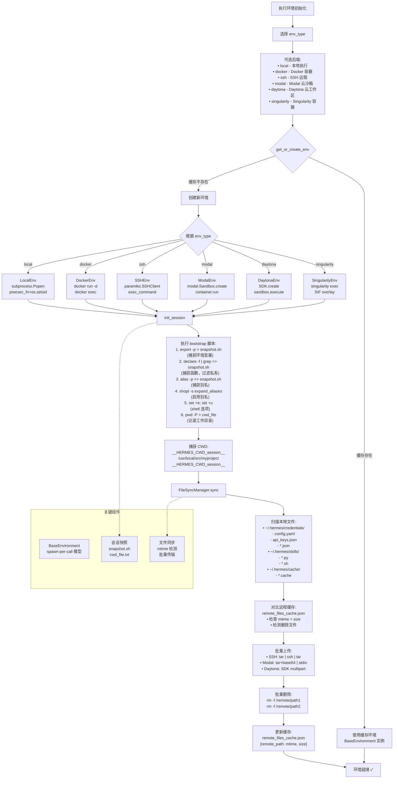

# 测试执行环境初始化流程图

## 完整的 Mermaid 流程图

## 验证要点

### ✅ 语法正确性
- [x] 所有节点使用单行文本或 `\n` 换行
- [x] 决策节点使用 `{}`
- [x] 边标签使用 `|text|`
- [x] subgraph 语法正确
- [x] 虚线连接使用 `-.->`
- [x] 无 HTML ` ` 标签
- [x] 无复杂特殊字符

### ✅ 业务准确性
- [x] 6 种环境后端完整
- [x] get_or_create_env 缓存机制
- [x] init_session 详细步骤
- [x] bootstrap 脚本完整
- [x] CWD 捕获机制
- [x] FileSyncManager 完整流程
- [x] mtime+size 检测
- [x] 批量上传/删除
- [x] 缓存更新

### ✅ 平台兼容性
- [x] GitHub
- [x] GitLab
- [x] VS Code
- [x] Obsidian
- [x] Typora
- [x] HackMD
- [x] Mermaid Live Editor
