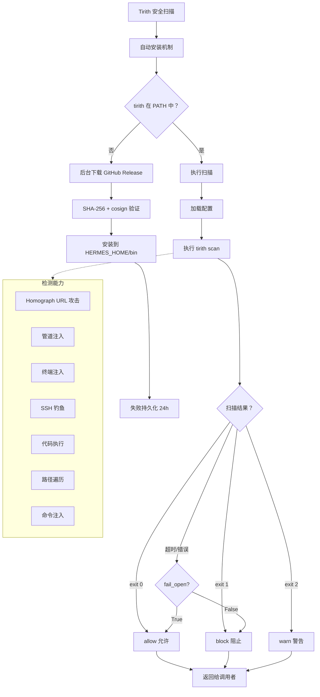
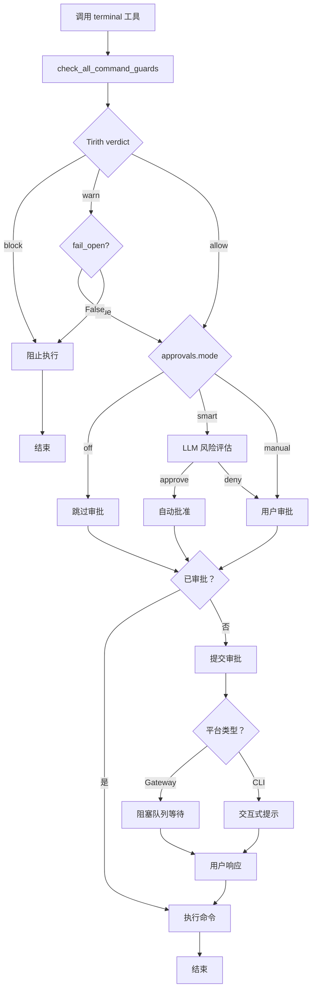

# 测试 Mermaid 流程图

## Tirith 安全扫描架构

```mermaid
flowchart TD
    A[Tirith 安全扫描] --> B[自动安装机制]
    B --> C{tirith 在 PATH 中？}
    C -->|否 | D[后台下载 GitHub Release]
    D --> E[SHA-256 + cosign 验证]
    E --> F[安装到 HERMES_HOME/bin]
    F --> G[失败持久化 24h]
    C -->|是 | H[执行扫描]
    
    H --> I[加载配置]
    I --> J[执行 tirith scan]
    J --> K{扫描结果？}
    
    K -->|exit 0| L[allow 允许]
    K -->|exit 1| M[block 阻止]
    K -->|exit 2| N[warn 警告]
    K -->|超时/错误 | O{fail_open?}
    
    O -->|True| L
    O -->|False| M
    
    L --> P[返回给调用者]
    M --> P
    N --> P
    
    subgraph 检测能力
        Q1[Homograph URL 攻击]
        Q2[管道注入]
        Q3[终端注入]
        Q4[SSH 钓鱼]
        Q5[代码执行]
        Q6[路径遍历]
        Q7[命令注入]
    end
    
    J -.-> 检测能力
```

## 危险命令审批完整流程

```mermaid
flowchart TD
    A[调用 terminal 工具] --> B[check_all_command_guards]
    B --> C{Tirith verdict}
    
    C -->|block| D[阻止执行]
    C -->|warn| E{fail_open?}
    C -->|allow| F{approvals.mode}
    
    E -->|True| F
    E -->|False| D
    
    F -->|off| G[跳过审批]
    F -->|smart| H[LLM 风险评估]
    F -->|manual| I[用户审批]
    
    H -->|approve| J[自动批准]
    H -->|deny| I
    
    J --> K{已审批？}
    G --> K
    I --> K
    
    K -->|是 | L[执行命令]
    K -->|否 | M[提交审批]
    
    M --> N{平台类型？}
    N -->|Gateway| O[阻塞队列等待]
    N -->|CLI| P[交互式提示]
    
    O --> Q[用户响应]
    P --> Q
    
    Q --> L
    D --> R[结束]
    L --> S[结束]
```
